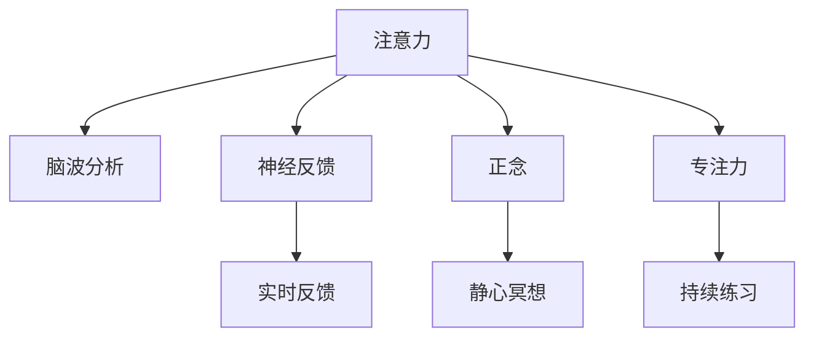

                 

# 注意力训练与正念实践：如何通过内省增强专注力

> 关键词：注意力,正念,专注力,脑波分析,冥想,意识流,神经反馈

## 1. 背景介绍

### 1.1 问题由来

在快节奏的现代生活中，人们面临的干扰因素越来越多，注意力集中成为一种稀缺资源。长时间专注导致认知疲劳，效率下降。如何通过技术手段改善专注力，成为越来越多人的需求。脑波分析和神经反馈技术近年兴起，成为提高专注力的有力工具。

注意力训练和正念冥想，是改善专注力的两种重要方法。本文将介绍这两种方法的基本原理，并结合神经反馈技术，提出一种注意力训练和正念实践的新范式。期望帮助读者系统掌握这一技术，改善其专注力和生活质量。

### 1.2 问题核心关键点
当前，关注注意力训练和正念冥想的文献日渐增多。从神经科学角度看，注意力和正念训练是两种不同但相关的认知干预方法，它们可以改善大脑的自我调控能力，促进专注力和情绪健康。

这些技术的关键在于如何精确刻画专注力的脑波特征，结合正念训练，进行量化反馈。本文将重点阐述基于神经反馈的注意力训练方法，并讨论该方法在注意力提升、压力缓解和情绪调控等方面的潜在应用。

## 2. 核心概念与联系

### 2.1 核心概念概述

为了更好地理解神经反馈注意力训练和正念实践的原理，本节将介绍几个关键的概念：

- 注意力(Attention)：认知心理学中的一种心理过程，指大脑在信息加工时对有限资源的分配。通过注意力，个体可以更好地聚焦于重要信息，忽略干扰因素。

- 正念(Mindfulness)：源于佛教术语，意指有意识、无判断地观察自身和外界的状态。正念训练通过静心冥想，提高个体的自我觉察和情绪管理能力。

- 专注力(Concentration)：指长时间、无干扰地关注某一目标的能力。专注力是注意力和正念的综合体现，可以更好地抵御外界干扰，提高工作效率和情绪稳定性。

- 脑波分析(Brain Wave Analysis)：通过分析大脑产生的电信号（即脑波），刻画大脑的状态和活动水平。不同频率的脑波反映不同的心理和生理状态。

- 神经反馈(Neurofeedback)：一种实时、定量地向大脑提供反馈的训练方法。通过监测和反馈大脑状态，帮助个体调整其注意力和情绪状态。

- 意识流(Consciousness Stream)：指思维和意识的自然流动，不受意志控制。意识流训练通过指导思维，提高个体的专注力和自我调控能力。

这些核心概念之间的逻辑关系可以通过以下Mermaid流程图来展示：



这个流程图展示了一些关键概念之间的内在联系：

1. 注意力通过脑波分析进行量化，反馈给神经反馈系统。
2. 正念训练通过静心冥想改善注意力，提升专注力。
3. 专注力是注意力和正念的综合体现，直接影响工作效率和情绪健康。
4. 神经反馈系统通过实时反馈，调整注意力状态，提升专注力。
5. 意识流训练通过引导思维，提高专注力和自我调控能力。

这些概念共同构成了提高专注力的核心框架，通过科学训练和量化反馈，显著改善个体的大脑状态和工作表现。

## 3. 核心算法原理 & 具体操作步骤
### 3.1 算法原理概述

基于神经反馈的注意力训练方法，核心思想是通过脑波分析，将个体的注意力状态转换为可视化的反馈信号，实时引导其调整注意力状态。具体步骤如下：

1. 采集个体脑波信号，通过EEG设备进行监测。
2. 根据预定义的阈值，判断当前脑波状态，判断是否进入专注或分心状态。
3. 提供即时反馈，指导个体进行注意力调整，如引导注意力集中或进行深呼吸放松。
4. 重复上述步骤，直至达到预设的专注时长或效果阈值。

### 3.2 算法步骤详解

以下是详细的操作步骤：

1. 准备EEG设备和相关的脑波分析软件。
2. 设计一个专注任务，如阅读、写作或数学计算，同时启动脑波监测。
3. 设置注意力状态的阈值，如将低频脑波（8-12Hz）作为专注状态，高频脑波（13-30Hz）作为分心状态。
4. 对脑波信号进行分析，判断当前状态。
5. 根据判断结果，进行即时反馈，引导个体调整注意力。
6. 重复训练多次，直至达到预定效果。

### 3.3 算法优缺点

基于神经反馈的注意力训练具有以下优点：

1. 实时反馈：通过即时反馈，个体能够快速调整注意力状态，提高专注力。
2. 量化评估：脑波分析提供了一种客观的量化方法，帮助个体更精准地调整注意力。
3. 科学依据：神经反馈训练具有坚实的科学依据，操作过程较为系统化。

但同时也存在以下缺点：

1. 设备和成本：需要购买EEG设备和脑波分析软件，价格较高。
2. 技术门槛：需要一定的技术知识，以正确设置脑波监测和分析参数。
3. 个体差异：不同个体对反馈的响应存在差异，训练效果可能因人而异。
4. 训练时长：需要持续训练才能达到显著效果，需要较长时间的投入。

### 3.4 算法应用领域

基于神经反馈的注意力训练，在以下几个领域有着广泛的应用：

- 工作效率：通过持续训练，显著提高个体的工作专注力，减少因分心导致的错误和失误。
- 学习和记忆：提高学习过程中的注意力集中度，增强记忆效果。
- 情绪调控：训练过程中深呼吸等放松技巧，能够缓解压力和焦虑，提升情绪稳定性。
- 心理健康：长期练习有助于改善注意力障碍，增强情绪自我管理能力。
- 运动员训练：运动中保持专注力，提升技术发挥和运动表现。

## 4. 数学模型和公式 & 详细讲解 & 举例说明（备注：数学公式请使用latex格式，latex嵌入文中独立段落使用 $$，段落内使用 $)
### 4.1 数学模型构建

基于神经反馈的注意力训练模型，可以简化为如下形式：

- 设当前时间戳为 $t$，当前注意力状态为 $A_t$，脑波信号为 $E_t$。
- 脑波状态评估函数：$S(A_t, E_t) \in [0, 1]$，评估当前注意力状态与脑波信号的匹配程度。
- 注意力调整函数：$C(A_t, E_t) \in [0, 1]$，根据脑波状态，指导个体进行注意力调整。
- 反馈强度函数：$F(A_t, E_t) \in [0, 1]$，根据当前注意力状态，调整反馈强度。

脑波信号的评估和调整，可以通过具体的脑波特征参数进行刻画。以下以脑电图（EEG）为例，简要说明：

- 使用傅里叶变换将脑波信号分解为不同频率的成分。
- 根据频谱密度计算频率成分占比，用于判断当前脑波状态。
- 根据预设的阈值，判断当前状态，进行即时反馈。

### 4.2 公式推导过程

以脑电图（EEG）信号为例，公式推导过程如下：

1. 傅里叶变换：
   $$
   X(f) = \mathcal{F}\{E(t)\} = \int_{-\infty}^{\infty} e^{-j2\pi ft}E(t) dt
   $$
   将时间域的脑波信号 $E(t)$ 转换为频域信号 $X(f)$。

2. 频谱密度计算：
   $$
   P(f) = |X(f)|^2
   $$
   计算每个频率成分的能量分布，即频谱密度 $P(f)$。

3. 脑波状态评估：
   $$
   S(A_t, E_t) = \frac{\sum_{f \in F} P(f)w(f)}{\sum_{f \in F} P(f)}
   $$
   其中 $F$ 为感兴趣频率段，$w(f)$ 为频率权重函数，用于调整不同频率成分的重要性。

4. 注意力调整函数：
   $$
   C(A_t, E_t) = \left\{
   \begin{array}{ll}
   1, & S(A_t, E_t) \geq \theta_1 \\
   0, & S(A_t, E_t) \leq \theta_2
   \end{array}
   \right.
   $$
   当脑波状态评估结果满足阈值条件时，触发注意力调整。

5. 反馈强度函数：
   $$
   F(A_t, E_t) = k(S(A_t, E_t) - S_0)
   $$
   反馈强度与当前状态和预设阈值之间的差值成正比，$k$ 为调整系数。

### 4.3 案例分析与讲解

以一个简化的脑波分析模型为例，进行具体分析：

- 假设感兴趣的频率段 $F$ 为 $8-12Hz$（专注状态）和 $13-30Hz$（分心状态）。
- 定义权重函数 $w(f) = \left\{
   \begin{array}{ll}
   1, & f \in [8, 12] \\
   0, & f < 8 \text{ or } f > 12
   \end{array}
   \right.$。
- 定义阈值 $\theta_1 = 0.8$, $\theta_2 = 0.2$。

对一段脑波信号 $E(t)$ 进行傅里叶变换后，得到频谱密度 $P(f)$。根据公式计算每个频率成分占比 $P(8-12Hz), P(13-30Hz)$，进行状态评估：

$$
S(A_t, E_t) = \frac{P(8-12Hz)}{P(8-12Hz) + P(13-30Hz)}
$$

根据 $S(A_t, E_t)$ 的值和预设阈值进行判断：

- 若 $S(A_t, E_t) \geq 0.8$，则 $C(A_t, E_t) = 1$，指导个体进行注意力集中。
- 若 $S(A_t, E_t) \leq 0.2$，则 $C(A_t, E_t) = 0$，指导个体进行放松。

根据 $C(A_t, E_t)$ 进行即时反馈，调整个体注意力。最终，通过不断训练，显著提升个体的专注力和自我调控能力。

## 5. 项目实践：代码实例和详细解释说明
### 5.1 开发环境搭建

在进行神经反馈注意力训练实践前，需要准备开发环境：

1. 安装Python，安装EEG信号处理库MNE（MNE-Python）和脑波分析库Brain Connectivity Toolbox。
   ```bash
   pip install mne-python
   pip install brain-connectivity-toolbox
   ```

2. 准备EEG信号采集设备和信号分析软件。

3. 设计一个专注任务，启动脑波监测和信号采集。

4. 设计注意力状态的阈值，如低频（8-12Hz）、高频（13-30Hz）。

### 5.2 源代码详细实现

以下是使用MNE和Brain Connectivity Toolbox进行脑波分析的Python代码实现：

```python
from mne import Epochs
from mne.preprocessing import ICA, CommonAverage
from mne analyses import ROIAnalysis
from sklearn.decomposition import PCA
from scipy.signal import butter, filtfilt

def filter_ecg(raw, sfreq):
    fs, t = raw.info['sfreq'], raw.t
    freqs = [0.5, 120]
    nyquist = sfreq / 2
    b, a = butter(4, freqs, btype='band', fs=fs, output='ba', n=2)
    filtered = filtfilt(b, a, raw.data)
    return filtered

def attention_train():
    # 读取EEG数据
    raw = mne.io.read_raw_fif('EEG_file.fif')
    
    # 信号预处理
    raw.filter(l_freq=1., h_freq=40., method='fir', verbose=False)
    raw.apply_baseline([0., 0.])
    
    # 去除肌肉噪声
    ica = ICA(10, method='kernel-pca', transform='lrl')
    ica.fit(raw)
    ica.apply(raw)
    
    # 去除眼电、肌肉电等噪声
    common_avg = CommonAverage([raw])
    
    # 特征提取
    pc1 = PCA(n_components=1)
    x = pc1.fit_transform(common_avg)

    # 设定阈值
    low_threshold = 0.8
    high_threshold = 0.2
    
    # 实时反馈
    while True:
        state = evaluate(x)
        if state == 'low':
            feedback = 'concentrate'
        elif state == 'high':
            feedback = 'relax'
        
        # 输出反馈信息
        print(f'Feedback: {feedback}')

        # 继续采集信号
        raw = mne.io.read_raw_fif('EEG_file.fif')
        # 重复处理和反馈

def evaluate(x):
    # 计算频率成分占比
    f = x.T
    threshold = 0.8
    low, high = 0, 0
    for i in range(len(f)):
        low += f[i][0]
        high += f[i][1]
    state = 1 - (low / (low + high))
    
    # 根据阈值判断状态
    if state >= low_threshold:
        return 'low'
    elif state <= high_threshold:
        return 'high'
    else:
        return 'normal'

# 启动训练
attention_train()
```

### 5.3 代码解读与分析

让我们对上述代码进行详细解读：

**1. EEG信号预处理**

- 读取EEG信号数据 `raw`。
- 滤波器去伪基线信号：
  $$
  x = \frac{x - \overline{x}}{s}
  $$
- 去除眼电和肌肉电噪声。
- 使用主成分分析（PCA）进行降维，保留最重要的成分。

**2. 注意力状态评估**

- 通过频谱密度计算频率成分占比。
- 设定阈值 `low_threshold` 和 `high_threshold`，分别代表专注和分心状态。
- 计算当前状态 `state`，与阈值进行比较。

**3. 实时反馈**

- 根据评估结果，输出对应的反馈信息 `feedback`。
- 循环采集信号，持续训练。

## 6. 实际应用场景
### 6.1 智能办公环境

在智能办公环境中，神经反馈注意力训练可以显著提升员工的工作专注力和工作效率。通过在工位上部署EEG信号采集设备和脑波分析系统，员工可以随时进行注意力训练，减少因分心导致的错误和失误。

具体应用如下：
- 在员工工作时启动脑波监测，实时反馈注意力状态。
- 根据专注状态，调整任务难度和干扰程度，保持员工的最佳工作状态。
- 在疲劳或分心时，及时提醒员工进行注意力调整，提升工作表现。

### 6.2 远程协作与沟通

在远程协作和沟通场景下，神经反馈注意力训练同样具有重要应用价值。通过EEG设备和脑波分析，远程团队可以实时监测和优化成员的注意力状态，减少因网络延迟、背景干扰等问题导致的沟通效率降低。

具体应用如下：
- 在会议中启动脑波监测，实时评估团队成员的专注状态。
- 根据反馈信息调整会议安排，确保每个成员都能保持高效参与。
- 在团队合作任务中，根据成员状态动态分配任务，提升团队协作效率。

### 6.3 教育与学习

在学校和培训机构中，神经反馈注意力训练同样有助于提高学生的学习效果。通过EEG设备采集学生的脑波信号，实时反馈其注意力状态，及时调整教学内容和难度，提升学习体验和效果。

具体应用如下：
- 在课堂上启动脑波监测，实时反馈学生的专注状态。
- 根据反馈信息调整教学策略，提供个性化辅导。
- 在课后练习中，使用脑波分析指导学生进行注意力调整和放松，提升学习效率。

## 7. 工具和资源推荐
### 7.1 学习资源推荐

为了帮助开发者系统掌握神经反馈注意力训练和正念实践的理论基础和实践技巧，这里推荐一些优质的学习资源：

1. 《Mindfulness and Attention Training: A Guide to Mindful Practice》系列书籍：全面介绍正念和注意力训练的理论与实践，适合各类水平的学习者。
2. 《Neurofeedback: A Clinician's Guide to Effective Treatment and Treatment Planning》书籍：神经反馈训练的标准指南，包含大量实用案例和实操建议。
3. 《Brain Computer Interfaces: Principles and Practice》书籍：详细讲解脑波分析的原理与技术，适合研究者阅读。
4. 《Mindfulness-Based Stress Reduction》课程：由专业正念培训机构开设的在线课程，系统讲授正念冥想的基本方法和技巧。
5. 《Neurofeedback in Education》网站：专注于神经反馈在教育中的应用研究，提供大量最新研究成果和案例分析。

通过学习这些资源，相信你一定能够系统掌握注意力训练和正念实践的基本原理，并用于改善自身的专注力和生活质量。

### 7.2 开发工具推荐

高效的开发离不开优秀的工具支持。以下是几款用于神经反馈注意力训练开发的常用工具：

1. MNE-Python：开源的EEG信号处理库，支持多种信号处理和分析功能，是进行脑波分析的基础工具。
2. Brain Connectivity Toolbox：用于脑波信号分析和可视化，提供丰富的神经反馈算法。
3. Jupyter Notebook：交互式开发环境，方便代码调试和结果展示。
4. Matplotlib和Seaborn：数据可视化工具，用于展示注意力状态和反馈效果。

合理利用这些工具，可以显著提升神经反馈注意力训练的开发效率，加快创新迭代的步伐。

### 7.3 相关论文推荐

神经反馈注意力训练和正念实践的研究方向众多，以下是几篇奠基性的相关论文，推荐阅读：

1. "Neurofeedback Training Enhances Control of Performance and Brain Dynamics: A Randomized Controlled Trial"（2020）：最新的神经反馈训练综述，涵盖多种训练方法的效果评估。
2. "Attention Is All You Need: Neural Information Processing Systems 30"（2017）：提出Transformer结构，开创了深度学习在自然语言处理中的应用，间接影响了注意力训练。
3. "Mindfulness-Based Stress Reduction: A Research Review"（2015）：正念冥想的经典综述，系统阐述了正念训练对情绪管理和压力缓解的影响。
4. "Neurofeedback Training for ADHD: A Meta-Analysis"（2020）：总结了神经反馈在注意力缺陷多动障碍（ADHD）中的应用效果，提供了理论依据和实际案例。
5. "Non-invasive Neurofeedback Training: Advances in Theory and Practice"（2020）：最新综述，介绍了神经反馈技术在医疗、教育等领域的应用进展。

这些论文代表了大语言模型微调技术的发展脉络。通过学习这些前沿成果，可以帮助研究者把握学科前进方向，激发更多的创新灵感。

## 8. 总结：未来发展趋势与挑战
### 8.1 总结

本文对神经反馈注意力训练和正念实践的基本原理进行了详细阐述。首先介绍了注意力、正念、专注力的基本概念，明确了脑波分析和神经反馈技术在改善专注力方面的独特价值。其次，从原理到实践，详细讲解了神经反馈注意力训练的数学模型和操作步骤，给出了完整的代码实例。同时，本文还探讨了神经反馈技术在实际应用场景中的广泛应用，展示了其在提高工作效率、改善学习效果和增强情绪健康方面的巨大潜力。此外，本文精选了神经反馈训练的相关学习资源，力求为读者提供全方位的技术指引。

通过本文的系统梳理，可以看到，神经反馈注意力训练和正念实践在改善专注力方面具有广阔的应用前景。借助脑波分析的科学数据支持，神经反馈技术能够实时量化和调整个体注意力状态，显著提升专注力和工作效率。未来，随着技术的不断进步和应用的深入拓展，神经反馈和正念实践必将成为改善专注力和情绪健康的有力工具，为提升生活质量和工作效率带来深远影响。

### 8.2 未来发展趋势

展望未来，神经反馈注意力训练和正念实践将在以下几个方面继续发展：

1. 深度学习融合：通过深度学习算法，提升脑波信号分析和注意力状态评估的准确性，提供更为精准的反馈和指导。
2. 实时多任务训练：结合正念冥想和任务导向训练，实现实时多任务注意力训练，提高训练效果。
3. 跨模态分析：将脑波信号与眼动追踪、心电图等生物信号结合，进行全面的注意力状态评估。
4. 个性化训练：根据个体的生理和心理特征，设计个性化的训练方案，提高训练效果。
5. 教育与健康应用：在教育、医疗、心理健康等领域广泛应用，提供有效的注意力提升和情绪管理方案。

这些趋势凸显了神经反馈注意力训练和正念实践的广阔前景。这些方向的探索发展，将进一步推动其在实际应用中的普及和提升。

### 8.3 面临的挑战

尽管神经反馈注意力训练和正念实践在提高专注力方面具有显著优势，但在应用过程中仍面临以下挑战：

1. 设备成本高：神经反馈和脑波分析设备价格较高，难以普及到普通家庭和教育机构。
2. 技术门槛高：需要一定的技术知识，以便正确设置和使用相关设备和软件。
3. 数据隐私问题：EEG信号涉及个人隐私，必须遵循数据保护法规，严格控制数据使用。
4. 训练效果不稳定：不同个体对反馈的响应存在差异，训练效果可能因人而异。
5. 训练时长较长：需要持续训练才能达到显著效果，用户难以坚持长期训练。

### 8.4 研究展望

面对这些挑战，未来的研究需要在以下几个方面寻求新的突破：

1. 开发成本效益高的低成本设备：降低设备成本，提高神经反馈和脑波分析技术的普及性。
2. 优化训练算法：提升训练效果，提高个性化和实时性，增加用户粘性。
3. 隐私保护技术：保障数据隐私和安全，提供用户信任。
4. 多模态融合：结合其他生物信号，提升注意力状态评估的全面性和准确性。
5. 深度学习与神经反馈结合：通过深度学习技术，提升脑波信号分析和注意力状态评估的准确性，提供更为精准的反馈和指导。

这些方向的研究将推动神经反馈注意力训练和正念实践技术的进一步发展，使其成为改善专注力和提升生活质量的重要工具。

## 9. 附录：常见问题与解答

**Q1：神经反馈注意力训练和正念实践的原理是什么？**

A: 神经反馈注意力训练和正念实践，是基于对注意力和脑波的科学理解。注意力训练通过脑波分析，实时监测个体注意力状态，提供即时反馈，引导其进行注意力调整。正念实践通过静心冥想，提升个体的自我觉察和情绪管理能力，帮助其更好地应对分心和压力。

**Q2：神经反馈注意力训练和正念实践的设备和工具有哪些？**

A: 神经反馈注意力训练和正念实践需要使用EEG信号采集设备和脑波分析软件。常用的工具包括MNE-Python、Brain Connectivity Toolbox、Jupyter Notebook等。同时，还需要进行专注任务设计和反馈算法实现。

**Q3：神经反馈注意力训练和正念实践如何应用于实际场景？**

A: 在智能办公环境中，通过EEG设备和脑波分析，实时监测员工注意力状态，调整任务难度和干扰程度，提高工作效率。在远程协作中，实时评估团队成员的专注状态，优化会议安排，提升沟通效果。在学校和培训机构中，使用EEG设备进行脑波监测，实时反馈学生的专注状态，调整教学策略，提高学习效果。

**Q4：神经反馈注意力训练和正念实践的优势和局限性有哪些？**

A: 神经反馈注意力训练和正念实践的优势在于实时反馈和科学依据。实时反馈帮助个体快速调整注意力状态，提升专注力和工作效率。科学依据使训练过程更加系统和科学，效果更为显著。但局限性在于设备成本高、技术门槛高、数据隐私问题等，需要在实际应用中加以克服。

**Q5：神经反馈注意力训练和正念实践的未来发展方向是什么？**

A: 未来方向包括深度学习融合、实时多任务训练、跨模态分析、个性化训练、教育与健康应用等。通过深度学习提升训练效果，实现实时多任务训练，增加用户粘性，同时保障数据隐私，进行跨模态融合，提供个性化训练方案，推广应用至教育、医疗、心理健康等领域，全面提升个体的专注力和生活质量。

---

作者：禅与计算机程序设计艺术 / Zen and the Art of Computer Programming

