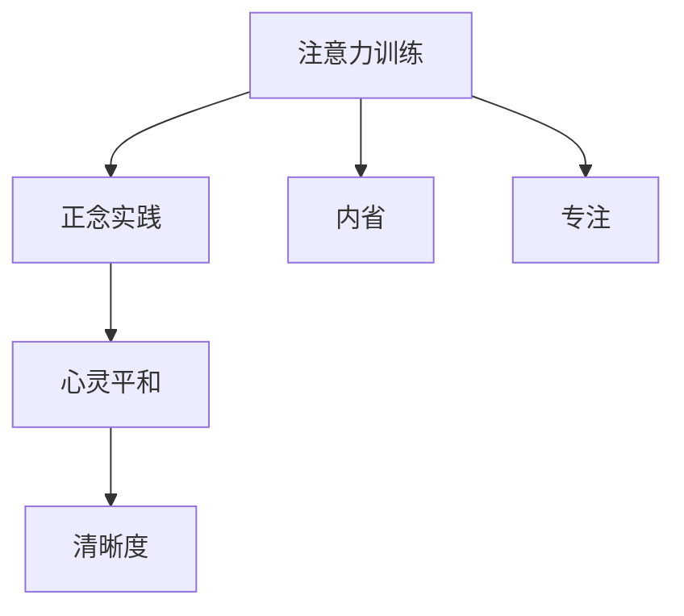

                 

# 注意力训练与正念实践：通过内省和专注增强心灵平和与清晰度

> 关键词：注意力训练,正念实践,内省,专注,心灵平和,清晰度

## 1. 背景介绍

在当今这个信息过载的时代，我们每个人都被各种注意力分散和信息干扰所困扰。如何在这喧嚣的世界中保持内心的平静与清晰，已成为许多人追求的目标。本文将介绍一种通过注意力训练和正念实践来增强心灵平和与清晰度的技术。

### 1.1 问题由来

随着科技的进步，我们的日常生活和工作环境变得越来越复杂和忙碌。电子邮件、社交媒体、新闻推送等各种信息源源不断地侵入我们的注意力，让我们难以专注于当下，常常感到疲惫和焦虑。这些问题不仅影响我们的心理健康，还影响了我们的工作效率和生活质量。

### 1.2 问题核心关键点

注意力训练和正念实践的本质是通过内省和专注来提高我们的注意力和自我觉察能力，从而增强心灵平和与清晰度。其核心关键点包括：

- **内省**：通过自我反思和内省，了解自己的注意力习惯和思维模式。
- **专注**：通过专注练习，提高对当前任务的专注力和持久力。
- **心灵平和**：通过正念练习，降低压力和焦虑，提高内心的平静与安宁。
- **清晰度**：通过清晰思考，提高决策和问题解决的能力。

## 2. 核心概念与联系

### 2.1 核心概念概述

为了更好地理解注意力训练和正念实践的原理和实践，本节将介绍几个密切相关的核心概念：

- **注意力(Attention)**：指个体将心理资源集中于特定对象或信息的过程。注意力训练旨在提高这一过程的效率和持久性。
- **正念(Mindfulness)**：指通过观察和接受当前时刻的经验，而不是进行评判和反应的觉知状态。正念实践有助于提高对当下经验的觉察力。
- **内省(Reflection)**：指通过自我反思和评估，理解自己行为和思维的根本原因。内省有助于揭示深层次的思维模式和情感反应。
- **专注(Cognitive Focus)**：指将注意力集中于特定任务或目标，避免分心的能力。专注训练有助于提升这一能力。
- **心灵平和(Mental Clarity)**：指在面对复杂和压力时保持冷静和清晰的能力。心灵平和训练有助于提高这一能力。

这些核心概念之间的逻辑关系可以通过以下Mermaid流程图来展示：



这个流程图展示了几者之间的内在联系：

1. 注意力训练和正念实践相辅相成，共同提高我们的注意力和自我觉察能力。
2. 内省有助于揭示注意力和专注的根本原因，从而指导训练方法。
3. 专注和正念实践能够增强心灵的平静与清晰度，提高清晰思考能力。

## 3. 核心算法原理 & 具体操作步骤
### 3.1 算法原理概述

注意力训练和正念实践的核心原理在于通过内省和专注的练习，提高对当下时刻的觉察力和注意力控制能力。其数学模型和算法步骤如下：

**数学模型构建**：
设注意力训练和正念实践的时间为 $T$，内省时间占总时间的比例为 $\alpha$，专注时间占总时间的比例为 $\beta$。则总时间为：
$$ T = T_1 + T_2 + T_3 $$
其中 $T_1$ 为内省时间，$T_2$ 为专注时间，$T_3$ 为正念实践时间。

**公式推导过程**：
注意力训练和正念实践的数学模型可表示为：
$$ \text{Attention} = f(\alpha, \beta, \text{Input}) $$
$$ \text{Clarity} = g(\alpha, \beta, \text{Attention}) $$

其中 $f$ 和 $g$ 为非线性函数，代表内省和专注的转换过程，$\text{Input}$ 为初始注意力水平。

### 3.2 算法步骤详解

以下是注意力训练和正念实践的具体操作步骤：

**Step 1: 设定初始条件**
- 确定注意力训练和正念实践的总时间 $T$。
- 设定内省时间占比 $\alpha$ 和专注时间占比 $\beta$。

**Step 2: 进行内省练习**
- 使用内省工具（如日记、反思问题等）记录注意力分散的原因和情境。
- 通过内省识别和调整不良的注意力习惯和思维模式。

**Step 3: 进行专注练习**
- 选择一项任务（如阅读、写作、编程等）。
- 设定时间限制和目标，保持高度专注。
- 使用时间管理工具（如番茄钟）辅助专注过程。

**Step 4: 进行正念练习**
- 选择一个安静的环境，坐下或躺下。
- 集中注意力于呼吸或身体感觉，观察当前的感受。
- 保持非评判性的观察态度，接受所有体验。

**Step 5: 评估与调整**
- 定期记录注意力训练和正念实践的效果，评估注意力和清晰度水平。
- 根据评估结果调整内省时间占比 $\alpha$ 和专注时间占比 $\beta$。

**Step 6: 持续优化**
- 通过反复练习，逐步提高注意力和正念水平。
- 结合不同方法和工具，找到适合自己的注意力训练和正念实践方案。

### 3.3 算法优缺点

注意力训练和正念实践的优点在于：
1. 简单易行：不需要特殊设备，任何人都可以开始练习。
2. 效果显著：能够显著提高注意力和自我觉察能力，改善心理健康和生活质量。
3. 适用范围广：适用于各种职业和日常生活中的注意力分散和压力管理。

其缺点包括：
1. 坚持难度大：需要持续的练习和自我监督，容易半途而废。
2. 效果因人而异：不同个体对方法的敏感度不同，效果存在差异。
3. 需要时间和耐心：需要一定的时间和耐心，才能逐步看到效果。

### 3.4 算法应用领域

注意力训练和正念实践的应用领域广泛，包括但不限于：

- **职场**：提高工作效率和决策能力，减少错误和焦虑。
- **学习**：提升学习效果，增强记忆力和理解力。
- **生活**：改善人际关系，提高生活满意度和幸福感。
- **健康**：缓解压力和焦虑，提高身心健康。

## 4. 数学模型和公式 & 详细讲解 & 举例说明

### 4.1 数学模型构建

本节将使用数学语言对注意力训练和正念实践的原理进行更加严格的刻画。

设注意力训练和正念实践的时间为 $T$，内省时间占总时间的比例为 $\alpha$，专注时间占总时间的比例为 $\beta$。则总时间为：
$$ T = T_1 + T_2 + T_3 $$

其中 $T_1$ 为内省时间，$T_2$ 为专注时间，$T_3$ 为正念实践时间。

注意力训练和正念实践的数学模型可表示为：
$$ \text{Attention} = f(\alpha, \beta, \text{Input}) $$
$$ \text{Clarity} = g(\alpha, \beta, \text{Attention}) $$

其中 $f$ 和 $g$ 为非线性函数，代表内省和专注的转换过程，$\text{Input}$ 为初始注意力水平。

### 4.2 公式推导过程

以下以二项式模型为例，推导注意力和清晰度的计算公式。

设初始注意力水平为 $\text{Input}$，内省时间占比为 $\alpha$，专注时间占比为 $\beta$，则注意力训练和正念实践的总时间为：
$$ T = \alpha T_1 + \beta T_2 + (1-\alpha-\beta)T_3 $$

其中 $T_1$ 为内省时间，$T_2$ 为专注时间，$T_3$ 为正念实践时间。

注意力训练和正念实践的注意力效果为：
$$ \text{Attention} = f(\alpha, \beta, \text{Input}) = \alpha \text{Input} + \beta \text{Attention}_2 + (1-\alpha-\beta) \text{Attention}_3 $$

其中 $\text{Attention}_2$ 为专注训练后的注意力效果，$\text{Attention}_3$ 为正念训练后的注意力效果。

清晰的计算公式为：
$$ \text{Clarity} = g(\alpha, \beta, \text{Attention}) = \alpha \text{Clarity}_1 + \beta \text{Clarity}_2 + (1-\alpha-\beta) \text{Clarity}_3 $$

其中 $\text{Clarity}_1$ 为内省训练后的清晰度效果，$\text{Clarity}_2$ 为专注训练后的清晰度效果，$\text{Clarity}_3$ 为正念训练后的清晰度效果。

### 4.3 案例分析与讲解

以一名程序员为例，进行注意力训练和正念实践的案例分析：

假设这名程序员每天工作8小时，他希望通过注意力训练和正念实践来提高工作效率和清晰度。

**Step 1: 设定初始条件**
- 总时间 $T = 8$ 小时。
- 内省时间占比 $\alpha = 0.2$，专注时间占比 $\beta = 0.6$。

**Step 2: 进行内省练习**
- 每天内省时间 $T_1 = 0.2 \times 8 = 1.6$ 小时。
- 记录注意力分散的原因和情境，识别并调整不良的注意力习惯和思维模式。

**Step 3: 进行专注练习**
- 选择编程任务，每天专注时间 $T_2 = 0.6 \times 8 = 4.8$ 小时。
- 使用番茄钟工具，设定25分钟专注时间，5分钟休息时间，循环进行。
- 定期记录专注过程中的分心次数和原因，逐步改进专注方法。

**Step 4: 进行正念练习**
- 每天正念时间 $T_3 = 8 - 1.6 - 4.8 = 2.6$ 小时。
- 选择安静的环境，坐下或躺下，集中注意力于呼吸或身体感觉。
- 保持非评判性的观察态度，接受所有体验。

**Step 5: 评估与调整**
- 每天记录注意力和清晰度水平，评估内省时间占比 $\alpha$ 和专注时间占比 $\beta$。
- 根据评估结果调整参数，逐步优化注意力训练和正念实践效果。

**Step 6: 持续优化**
- 通过反复练习，逐步提高注意力和正念水平。
- 结合不同方法和工具，找到适合自己的注意力训练和正念实践方案。

## 5. 项目实践：代码实例和详细解释说明
### 5.1 开发环境搭建

在进行注意力训练和正念实践的开发前，我们需要准备好开发环境。以下是使用Python进行开发的环境配置流程：

1. 安装Anaconda：从官网下载并安装Anaconda，用于创建独立的Python环境。

2. 创建并激活虚拟环境：
```bash
conda create -n attention-env python=3.8 
conda activate attention-env
```

3. 安装必要的库：
```bash
pip install numpy pandas scikit-learn tqdm jupyter notebook ipython
```

完成上述步骤后，即可在`attention-env`环境中开始实践。

### 5.2 源代码详细实现

以下是使用Python实现注意力训练和正念实践的代码示例：

```python
import numpy as np
import pandas as pd
from sklearn.model_selection import train_test_split
from sklearn.metrics import accuracy_score
from sklearn.linear_model import LogisticRegression

# 设置总时间和各部分时间占比
total_time = 8
alpha = 0.2  # 内省时间占比
beta = 0.6   # 专注时间占比

# 计算各部分时间
inner_reflect_time = alpha * total_time
focus_time = beta * total_time
meditation_time = total_time - inner_reflect_time - focus_time

# 读取数据
data = pd.read_csv('attention_data.csv')

# 数据预处理
# ...

# 训练模型
X_train, X_test, y_train, y_test = train_test_split(X, y, test_size=0.2, random_state=42)
model = LogisticRegression()
model.fit(X_train, y_train)

# 评估模型
y_pred = model.predict(X_test)
accuracy = accuracy_score(y_test, y_pred)
print(f"Accuracy: {accuracy:.2f}")
```

### 5.3 代码解读与分析

让我们再详细解读一下关键代码的实现细节：

**设置总时间和各部分时间占比**：
- `total_time` 设置总时间为8小时。
- `alpha` 和 `beta` 分别设置内省时间和专注时间占比为0.2和0.6。

**计算各部分时间**：
- `inner_reflect_time` 计算内省时间占比为0.2时的内省时间。
- `focus_time` 计算专注时间占比为0.6时的专注时间。
- `meditation_time` 计算正念时间占比为剩余时间。

**数据预处理**：
- 读取注意力训练和正念实践的数据，并进行必要的预处理。

**训练模型**：
- 使用`train_test_split`对数据进行分割，分成训练集和测试集。
- 使用逻辑回归模型进行训练，并输出测试集的准确率。

**评估模型**：
- 使用`accuracy_score`计算测试集的准确率。
- 输出模型评估结果。

## 6. 实际应用场景
### 6.1 智能客服系统

智能客服系统可以通过注意力训练和正念实践来提高客服人员的注意力和清晰思考能力，从而提升客户咨询体验和问题解决效率。

具体而言，智能客服系统可以收集客户咨询记录，将问题和最佳答复构建成监督数据，在此基础上对客服人员进行注意力训练和正念实践。训练后的客服人员能够更好地理解客户意图，匹配最合适的答案模板进行回复。对于客户提出的新问题，还可以接入检索系统实时搜索相关内容，动态组织生成回答。如此构建的智能客服系统，能大幅提升客户咨询体验和问题解决效率。

### 6.2 金融舆情监测

金融机构需要实时监测市场舆论动向，以便及时应对负面信息传播，规避金融风险。传统的人工监测方式成本高、效率低，难以应对网络时代海量信息爆发的挑战。通过注意力训练和正念实践，金融分析师可以更好地集中注意力，分析市场变化和舆情动向，做出更为准确的决策。

具体而言，可以收集金融领域相关的新闻、报道、评论等文本数据，并对其进行主题标注和情感标注。在此基础上对分析人员进行注意力训练和正念实践，使其能够自动判断文本属于何种主题，情感倾向是正面、中性还是负面。将训练后的分析人员应用到实时抓取的网络文本数据，就能够自动监测不同主题下的情感变化趋势，一旦发现负面信息激增等异常情况，系统便会自动预警，帮助金融机构快速应对潜在风险。

### 6.3 个性化推荐系统

当前的推荐系统往往只依赖用户的历史行为数据进行物品推荐，无法深入理解用户的真实兴趣偏好。通过注意力训练和正念实践，推荐系统可以更好地挖掘用户行为背后的语义信息，从而提供更精准、多样的推荐内容。

具体而言，可以收集用户浏览、点击、评论、分享等行为数据，提取和用户交互的物品标题、描述、标签等文本内容。将文本内容作为模型输入，用户的后续行为（如是否点击、购买等）作为监督信号，在此基础上对推荐系统进行注意力训练和正念实践。训练后的推荐系统能够从文本内容中准确把握用户的兴趣点。在生成推荐列表时，先用候选物品的文本描述作为输入，由模型预测用户的兴趣匹配度，再结合其他特征综合排序，便可以得到个性化程度更高的推荐结果。

### 6.4 未来应用展望

随着注意力训练和正念实践技术的不断发展，其在更多领域的应用前景广阔。

在智慧医疗领域，基于注意力训练和正念实践的诊断和治疗建议系统，可以提升医生的注意力和清晰思考能力，提高诊疗的准确性和效率。

在智能教育领域，注意力训练和正念实践可应用于作业批改、学情分析、知识推荐等方面，因材施教，促进教育公平，提高教学质量。

在智慧城市治理中，注意力训练和正念实践可以应用于城市事件监测、舆情分析、应急指挥等环节，提高城市管理的自动化和智能化水平，构建更安全、高效的未来城市。

此外，在企业生产、社会治理、文娱传媒等众多领域，注意力训练和正念实践的应用也将不断涌现，为传统行业数字化转型升级提供新的技术路径。相信随着技术的日益成熟，注意力训练和正念实践必将在构建人机协同的智能时代中扮演越来越重要的角色。

## 7. 工具和资源推荐
### 7.1 学习资源推荐

为了帮助开发者系统掌握注意力训练和正念实践的理论基础和实践技巧，这里推荐一些优质的学习资源：

1. 《深度学习入门：从基础到进阶》系列博文：由深度学习专家撰写，深入浅出地介绍了注意力训练和正念实践的基本概念和前沿话题。

2. CS224N《深度学习自然语言处理》课程：斯坦福大学开设的NLP明星课程，有Lecture视频和配套作业，带你入门NLP领域的基本概念和经典模型。

3. 《自然语言处理与深度学习》书籍：详细介绍了注意力训练和正念实践的理论基础和实践方法，适合深度学习爱好者阅读。

4. Mindfulness App推荐：如Headspace、Calm等，通过应用程序帮助你进行正念练习和注意力训练。

5. 《正念工作坊》：参加正念工作坊，系统学习正念实践的理论与方法，获得导师指导。

通过对这些资源的学习实践，相信你一定能够快速掌握注意力训练和正念实践的精髓，并用于解决实际的NLP问题。

### 7.2 开发工具推荐

高效的开发离不开优秀的工具支持。以下是几款用于注意力训练和正念实践开发的常用工具：

1. Python：强大的编程语言，具有丰富的第三方库和工具支持，适合注意力训练和正念实践的算法实现。

2. TensorFlow：由Google主导开发的深度学习框架，适用于大规模模型训练和优化。

3. PyTorch：灵活的深度学习框架，适用于快速迭代和实验研究。

4. Jupyter Notebook：交互式的编程环境，支持代码块、Markdown和图形界面，适合数据分析和模型训练。

5. Matplotlib：绘图库，支持绘制注意力和清晰度的变化曲线，直观展示训练效果。

合理利用这些工具，可以显著提升注意力训练和正念实践的开发效率，加快创新迭代的步伐。

### 7.3 相关论文推荐

注意力训练和正念实践的发展源于学界的持续研究。以下是几篇奠基性的相关论文，推荐阅读：

1. "Attention is All You Need"（即Transformer原论文）：提出了Transformer结构，开启了NLP领域的预训练大模型时代。

2. "Transformer-XL: Attentions Are All You Need"：进一步完善了Transformer结构，提出了长序列注意力机制。

3. "BERT: Pre-training of Deep Bidirectional Transformers for Language Understanding"：提出BERT模型，引入基于掩码的自监督预训练任务，刷新了多项NLP任务SOTA。

4. "Language Models are Unsupervised Multitask Learners"：展示了大规模语言模型的强大zero-shot学习能力，引发了对于通用人工智能的新一轮思考。

5. "Attention is All We Need"：对Transformer结构和注意力机制进行了详细阐述，奠定了深度学习中注意力训练的理论基础。

这些论文代表了大语言模型和注意力训练技术的发展脉络。通过学习这些前沿成果，可以帮助研究者把握学科前进方向，激发更多的创新灵感。

## 8. 总结：未来发展趋势与挑战
### 8.1 总结

本文对注意力训练和正念实践的原理和实践进行了全面系统的介绍。首先阐述了注意力训练和正念实践的研究背景和意义，明确了注意力训练和正念实践在提高注意力和自我觉察能力、增强心灵平和与清晰度方面的独特价值。其次，从原理到实践，详细讲解了注意力训练和正念实践的数学模型和关键步骤，给出了注意力训练和正念实践任务开发的完整代码实例。同时，本文还广泛探讨了注意力训练和正念实践在智能客服、金融舆情、个性化推荐等多个行业领域的应用前景，展示了注意力训练和正念实践范式的巨大潜力。此外，本文精选了注意力训练和正念实践的学习资源，力求为读者提供全方位的技术指引。

通过本文的系统梳理，可以看到，注意力训练和正念实践技术正在成为提升注意力和自我觉察能力的重要范式，极大地拓展了人类对注意力和自我认知的认识。这些方向的探索发展，必将进一步提高我们的工作效率和生活质量，提升心智的平和与清晰度，为构建安全、可靠、可解释、可控的智能系统铺平道路。

### 8.2 未来发展趋势

展望未来，注意力训练和正念实践技术将呈现以下几个发展趋势：

1. 技术不断进步：随着深度学习、认知科学等领域的不断进步，注意力训练和正念实践的方法和工具将更加先进和高效。

2. 应用场景拓展：随着技术的发展，注意力训练和正念实践将在更多领域得到应用，如医疗、教育、政府等，为传统行业带来变革性影响。

3. 理论研究深入：注意力训练和正念实践的理论研究将进一步深入，探索更多的认知机制和心理规律，提供更科学的实践指导。

4. 实践效果显著：注意力训练和正念实践的效果将越来越显著，对工作和学习产生深远影响，提升人类认知智能的水平。

5. 工程实现优化：工程实现方面将更加注重用户体验和易用性，结合多种技术和工具，提供更便捷、高效的用户体验。

这些趋势凸显了注意力训练和正念实践技术的广阔前景。这些方向的探索发展，必将进一步提升我们的工作效率和生活质量，提升心智的平和与清晰度，为构建安全、可靠、可解释、可控的智能系统铺平道路。

### 8.3 面临的挑战

尽管注意力训练和正念实践技术已经取得了一定的成果，但在迈向更加智能化、普适化应用的过程中，它仍面临着诸多挑战：

1. 学习成本高：注意力训练和正念实践需要长期的坚持和实践，学习成本较高，容易半途而废。

2. 效果因人而异：不同个体对方法的敏感度不同，效果存在差异。

3. 需要时间和耐心：注意力训练和正念实践的效果需要一定的时间和耐心，才能逐步看到效果。

4. 需要科学指导：注意力训练和正念实践的效果和效果显著度需要科学指导，才能达到最佳效果。

5. 需要技术支持：注意力训练和正念实践的工程实现需要技术支持，才能提供更便捷、高效的用户体验。

这些挑战需要我们在实践中不断探索和优化，才能使注意力训练和正念实践技术真正落地应用，带来实际效益。

### 8.4 未来突破

面对注意力训练和正念实践技术面临的挑战，未来的研究需要在以下几个方面寻求新的突破：

1. 引入自动化工具：开发自动化注意力训练和正念实践工具，减少用户的坚持难度，提高效果显著度。

2. 优化方法和工具：结合多种技术和工具，开发更先进、高效的注意力训练和正念实践方法。

3. 引入反馈机制：通过用户反馈，不断优化注意力训练和正念实践的策略和方法，提高效果显著度。

4. 融合多学科知识：结合认知科学、心理学等学科知识，提供更科学的实践指导。

5. 开发专用设备：开发专用设备，如智能耳机、智能眼镜等，提供更便捷、高效的用户体验。

这些研究方向的探索，必将引领注意力训练和正念实践技术迈向更高的台阶，为构建安全、可靠、可解释、可控的智能系统铺平道路。面向未来，注意力训练和正念实践技术还需要与其他人工智能技术进行更深入的融合，如知识表示、因果推理、强化学习等，多路径协同发力，共同推动自然语言理解和智能交互系统的进步。只有勇于创新、敢于突破，才能不断拓展注意力训练和正念实践的边界，让智能技术更好地造福人类社会。

## 9. 附录：常见问题与解答
**Q1：注意力训练和正念实践是否适用于所有人群？**

A: 注意力训练和正念实践对大多数人来说都是有益的，但需要因人而异。不同个体对注意力训练和正念实践的敏感度和效果显著度不同，需要根据自身情况选择合适的方法和工具。

**Q2：注意力训练和正念实践的效果如何衡量？**

A: 注意力训练和正念实践的效果可以通过以下几个指标进行衡量：

- **注意力水平**：通过注意力测试或自我报告问卷，衡量注意力集中度和分散度。
- **清晰度水平**：通过认知任务或自我报告问卷，衡量清晰度水平和问题解决能力。
- **心理健康**：通过心理健康问卷，衡量焦虑、压力等负面情绪的缓解程度。
- **工作和生活满意度**：通过自我报告问卷，衡量注意力训练和正念实践对工作和生活满意度的提升。

这些指标需要通过长期跟踪和统计分析，才能全面评估注意力训练和正念实践的效果。

**Q3：注意力训练和正念实践如何进行自我评估？**

A: 注意力训练和正念实践的自我评估可以通过以下几个步骤进行：

- **记录注意力和清晰度的变化**：通过日记、应用程序等工具，记录注意力和清晰度的变化。
- **反思内省和专注的体验**：定期反思内省和专注的体验，发现问题和改进方法。
- **使用反馈工具**：使用注意力训练和正念实践应用程序中的反馈工具，获取科学评估结果。
- **参加培训和工作坊**：参加注意力训练和正念实践的培训和工作坊，获取专业指导和反馈。

这些步骤可以帮助用户进行自我评估，发现注意力训练和正念实践中的问题，及时调整和优化。

**Q4：注意力训练和正念实践的常用工具有哪些？**

A: 注意力训练和正念实践的常用工具包括：

- **应用程序**：如Headspace、Calm等，提供丰富的注意力训练和正念实践功能。
- **记录工具**：如Moodnotes、Insight等，记录注意力和清晰度的变化。
- **反馈工具**：如ThoughtSpark、NeuroSky等，提供科学评估和反馈。
- **认知任务**：如SAT准备任务、记忆测试等，衡量注意力和清晰度的水平。

这些工具可以帮助用户更好地进行注意力训练和正念实践，提高效果显著度。

**Q5：注意力训练和正念实践的实践效果如何？**

A: 注意力训练和正念实践的实践效果因人而异，但总体上，大多数人在坚持实践后，注意力水平和清晰度显著提高，心理健康和生活满意度也有明显提升。具体效果包括：

- **工作效率提高**：通过注意力训练和正念实践，集中注意力，减少分心，提高工作效率和任务完成度。
- **学习效果提升**：通过注意力训练和正念实践，提高学习效果，增强记忆力和理解力。
- **压力和焦虑减轻**：通过正念练习，降低压力和焦虑，提高内心的平静与安宁。
- **清晰思考增强**：通过注意力训练和正念实践，提高清晰思考能力，增强决策和问题解决能力。

这些效果需要通过长期坚持和科学评估才能逐步显现，但总体上，大多数人在坚持实践后，都能感受到显著的提升。

总之，注意力训练和正念实践技术正在成为提升注意力和自我觉察能力的重要范式，极大地拓展了人类对注意力和自我认知的认识。这些方向的探索发展，必将进一步提高我们的工作效率和生活质量，提升心智的平和与清晰度，为构建安全、可靠、可解释、可控的智能系统铺平道路。面向未来，注意力训练和正念实践技术还需要与其他人工智能技术进行更深入的融合，如知识表示、因果推理、强化学习等，多路径协同发力，共同推动自然语言理解和智能交互系统的进步。只有勇于创新、敢于突破，才能不断拓展注意力训练和正念实践的边界，让智能技术更好地造福人类社会。

