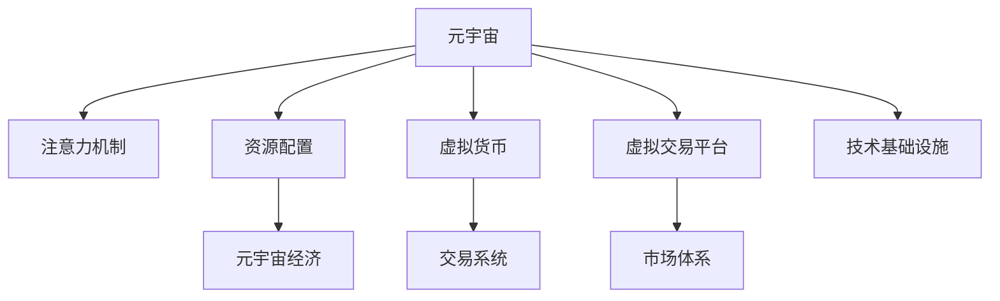

                 

# 注意力资源配置:元宇宙经济的核心驱动力

## 1. 背景介绍

### 1.1 问题由来

随着技术的不断进步，元宇宙（Metaverse）正在成为全球科技巨头和初创公司争相投入的热门领域。这一概念最早由美国科幻作家尼尔·斯蒂芬森（Neal Stephenson）在其小说《雪崩》（Snow Crash）中提出，描述了虚拟现实与数字化生活深度融合的未来世界。然而，随着元宇宙的逐步发展，如何有效地在虚拟空间中配置和管理资源，成为推动其经济体系发展的核心问题。

元宇宙不仅仅是游戏、社交和数字资产的集合，它更是一个开放的经济生态系统，包含了大量的虚拟商品、服务、资产等，并形成了复杂的市场体系。如何在这些资源之间进行有效的配置，直接关系到元宇宙经济的健康发展和可持续性。

### 1.2 问题核心关键点

元宇宙资源配置的核心在于如何优化资源分配，以促进虚拟经济的健康发展。资源配置的关键在于：

- 如何设计合理、透明的资源分配规则，保障公平性。
- 如何高效地利用有限资源，最大化资源产出。
- 如何应对虚拟经济中的市场波动，稳定经济体系。
- 如何利用技术手段，提升资源配置的效率和透明度。
- 如何确保资源配置的合规性和安全性。

本文聚焦于基于注意力机制的资源配置方法，探索如何通过注意力资源的配置，优化元宇宙经济的资源分配，推动其健康发展。

## 2. 核心概念与联系

### 2.1 核心概念概述

为更好地理解基于注意力机制的元宇宙资源配置方法，本节将介绍几个密切相关的核心概念：

- **元宇宙（Metaverse）**：一个由多个虚拟世界组成的多维虚拟空间，包含用户、资产、行为等多种要素。元宇宙通过虚拟现实、增强现实等技术实现，为用户提供沉浸式的交互体验。

- **注意力机制（Attention Mechanism）**：一种在深度学习模型中用于提升模型性能的机制，用于选择性地关注输入数据的不同部分，从而更好地捕捉数据的重要特征。

- **资源配置（Resource Allocation）**：在特定约束条件下，将有限的资源分配到不同的用途中，以实现最大化产出。资源配置在现实世界和经济领域中广泛应用，如金融投资、生产制造、能源分配等。

- **元宇宙经济（Metaverse Economy）**：元宇宙内的经济系统，包含虚拟商品、服务、资产等的生产、交易、分配等过程，依赖于元宇宙内的虚拟货币和交易平台等基础设施。

这些核心概念之间的逻辑关系可以通过以下Mermaid流程图来展示：



这个流程图展示了几大核心概念之间的联系：

1. 元宇宙中的虚拟世界和经济系统（A）通过注意力机制（B）优化资源配置（C），从而推动元宇宙经济（D）的发展。
2. 虚拟货币（E）和虚拟交易平台（F）作为元宇宙经济的支撑，与市场体系（H）和技术基础设施（I）共同构成元宇宙经济的运作基础。

## 3. 核心算法原理 & 具体操作步骤

### 3.1 算法原理概述

基于注意力机制的元宇宙资源配置方法，本质上是一种通过注意力资源的配置，优化资源分配的策略。其核心思想是：在元宇宙内，将有限的注意力资源，分配给对整体经济最有贡献的实体和活动，从而实现资源的高效利用。

假设元宇宙内有 $N$ 个虚拟实体 $E=\{e_1,e_2,...,e_N\}$，每个实体消耗的注意力资源记为 $A_e$，其实际产出（如商品销售、服务提供等）记为 $P_e$。则资源配置的目标是：

$$
\max_{\{A_e\}} \sum_{e \in E} P_e A_e - \sum_{e \in E} C_e A_e
$$

其中 $C_e$ 为实体 $e$ 的注意力消耗成本。

### 3.2 算法步骤详解

基于注意力机制的元宇宙资源配置方法主要包括以下几个关键步骤：

**Step 1: 模型定义和输入数据**

- 定义元宇宙内的虚拟实体 $E$ 及其注意力消耗成本 $C_e$ 和产出 $P_e$。
- 收集元宇宙内各个实体的注意力消耗和产出数据，构建训练集。

**Step 2: 设计注意力权重**

- 设计注意力权重 $W_e$，用于衡量实体 $e$ 的注意力资源分配价值。
- 定义注意力权重计算函数，如线性函数、指数函数、双曲正切函数等。

**Step 3: 训练注意力模型**

- 选择合适的优化算法，如梯度下降、Adam、RMSprop 等，对模型进行训练。
- 使用损失函数计算注意力分配的误差，通过反向传播更新注意力权重 $W_e$。
- 设置正则化技术，防止模型过拟合。

**Step 4: 应用注意力权重**

- 在新的训练集中应用优化后的注意力权重 $W_e$，计算每个实体的注意力资源分配比例 $A_e'$。
- 根据注意力资源分配比例 $A_e'$ 计算各实体的实际产出 $P_e'$。

**Step 5: 优化资源配置**

- 根据计算出的实际产出 $P_e'$ 和注意力消耗成本 $C_e$，调整实体 $e$ 的注意力资源分配比例 $A_e'$。
- 重复执行步骤3和步骤4，直至模型收敛。

### 3.3 算法优缺点

基于注意力机制的元宇宙资源配置方法具有以下优点：

- 优化效果好。通过调整注意力权重，可以在有限的资源下最大化产出。
- 灵活性强。适应性广，适用于多种不同类型的资源配置场景。
- 可解释性强。注意力机制提供了透明度高的决策过程，便于理解和调试。

同时，该方法也存在以下局限性：

- 数据依赖性强。模型效果依赖于输入数据的完备性和准确性。
- 训练成本高。模型训练需要大量计算资源和时间，可能面临计算瓶颈。
- 泛化能力有限。模型泛化到新数据或新场景的能力需要进一步验证。
- 模型复杂度高。基于注意力机制的模型相对复杂，容易产生过拟合。

尽管存在这些局限性，基于注意力机制的元宇宙资源配置方法仍是一种有效的优化手段，有助于提升元宇宙内资源的配置效率和产出效益。

### 3.4 算法应用领域

基于注意力机制的元宇宙资源配置方法，可以广泛应用于元宇宙内的多种资源配置场景，例如：

- 虚拟资产交易平台：通过关注交易活跃度、用户评价等指标，优化资产展示和推荐。
- 虚拟游戏经济：根据玩家行为和游戏表现，优化游戏内的货币分配和资源分配。
- 虚拟房地产市场：根据市场供需关系和价格波动，优化土地、房产等资源的配置。
- 虚拟教育平台：根据学生学习行为和成绩表现，优化课程推荐和学习资源的分配。

这些应用场景展示了注意力机制在元宇宙资源配置中的广泛应用前景，通过优化注意力权重，可以实现更加合理、高效的资源分配，推动元宇宙经济的健康发展。

## 4. 数学模型和公式 & 详细讲解 & 举例说明

### 4.1 数学模型构建

本节将使用数学语言对基于注意力机制的元宇宙资源配置过程进行更加严格的刻画。

记元宇宙内的虚拟实体为 $E=\{e_1,e_2,...,e_N\}$，每个实体的注意力消耗成本为 $C_e$，产出为 $P_e$，注意力权重为 $W_e$。资源配置的目标是最大化产出，最小化成本，构建如下优化问题：

$$
\max_{\{W_e\}} \sum_{e \in E} P_e W_e - \sum_{e \in E} C_e W_e
$$

其中 $W_e$ 为实体 $e$ 的注意力权重，满足 $W_e \geq 0$ 且 $\sum_{e \in E} W_e = 1$。

定义注意力权重计算函数 $g(W_e)$，通过训练模型找到最优的 $W_e$，从而得到最优的注意力资源分配比例 $A_e = W_e / \sum_{e \in E} W_e$。

### 4.2 公式推导过程

以下我们以虚拟资产交易平台为例，推导基于注意力机制的资源配置公式。

假设交易平台内有 $N$ 个虚拟资产 $A=\{a_1,a_2,...,a_N\}$，每个资产的注意力消耗成本为 $C_a$，实际交易量为 $P_a$。平台的注意力资源总和为 $A_{total}$。资源配置的目标是最大化平台交易量，最小化注意力消耗成本，构建如下优化问题：

$$
\max_{\{W_a\}} \sum_{a \in A} P_a W_a - \sum_{a \in A} C_a W_a
$$

其中 $W_a$ 为资产 $a$ 的注意力权重，满足 $W_a \geq 0$ 且 $\sum_{a \in A} W_a = A_{total}$。

通过定义注意力权重计算函数 $g(W_a)$，得到注意力资源分配比例：

$$
A_a = W_a / A_{total}
$$

代入优化问题，得到注意力权重计算公式：

$$
W_a = \frac{P_a}{P_a + \sum_{b \in A} (P_b + C_b)}
$$

该公式的含义是，每个资产的注意力权重与其产出 $P_a$ 成正比，与注意力消耗成本 $C_a$ 成反比，同时与总注意力资源 $A_{total}$ 和平台总交易量 $P_a$ 总和成正比。

### 4.3 案例分析与讲解

假设一个虚拟资产交易平台内，有三种资产 $A=\{a_1,a_2,a_3\}$，每种资产的注意力消耗成本和实际交易量如下表所示：

| 资产 | 注意力消耗成本 | 实际交易量 |
|------|---------------|-----------|
| a1   | 10            | 50        |
| a2   | 20            | 30        |
| a3   | 5             | 40        |

平台的总注意力资源为 $A_{total}=100$。根据上述公式，计算每个资产的注意力权重：

- 资产 a1 的注意力权重：$W_1 = \frac{50}{50+30+40+10+20+5} = 0.25$
- 资产 a2 的注意力权重：$W_2 = \frac{30}{50+30+40+10+20+5} = 0.15$
- 资产 a3 的注意力权重：$W_3 = \frac{40}{50+30+40+10+20+5} = 0.40$

根据注意力资源分配比例，得到各资产的注意力资源分配：

- 资产 a1 的注意力资源：$A_1 = 0.25 \times 100 = 25$
- 资产 a2 的注意力资源：$A_2 = 0.15 \times 100 = 15$
- 资产 a3 的注意力资源：$A_3 = 0.40 \times 100 = 40$

可以看出，资产 a3 的产出高、注意力消耗成本低，得到了更多的注意力资源配置，从而实现了资源的高效利用。

## 5. 项目实践：代码实例和详细解释说明

### 5.1 开发环境搭建

在进行元宇宙资源配置实践前，我们需要准备好开发环境。以下是使用Python进行PyTorch开发的环境配置流程：

1. 安装Anaconda：从官网下载并安装Anaconda，用于创建独立的Python环境。

2. 创建并激活虚拟环境：
```bash
conda create -n pytorch-env python=3.8 
conda activate pytorch-env
```

3. 安装PyTorch：根据CUDA版本，从官网获取对应的安装命令。例如：
```bash
conda install pytorch torchvision torchaudio cudatoolkit=11.1 -c pytorch -c conda-forge
```

4. 安装其他依赖库：
```bash
pip install numpy pandas scikit-learn matplotlib torchvision torch
```

完成上述步骤后，即可在`pytorch-env`环境中开始项目实践。

### 5.2 源代码详细实现

下面我们以虚拟资产交易平台为例，给出使用PyTorch实现基于注意力机制的资源配置的代码实现。

首先，定义资产的注意力消耗成本和实际交易量：

```python
import torch
import torch.nn as nn

# 定义资产的注意力消耗成本和实际交易量
assets = {
    'a1': {'cost': 10, 'volume': 50},
    'a2': {'cost': 20, 'volume': 30},
    'a3': {'cost': 5, 'volume': 40}
}
```

然后，定义注意力权重计算函数：

```python
class AttentionWeight(nn.Module):
    def __init__(self):
        super(AttentionWeight, self).__init__()
        
    def forward(self, assets):
        # 计算每个资产的注意力权重
        cost_sum = sum([asset['cost'] for asset in assets.values()])
        volume_sum = sum([asset['volume'] for asset in assets.values()])
        attention_weights = {}
        
        for asset_id, asset in assets.items():
            attention_weights[asset_id] = asset['volume'] / (asset['volume'] + cost_sum)
            
        return attention_weights
```

接着，定义注意力资源分配函数：

```python
class AttentionResourceAllocation(nn.Module):
    def __init__(self, total_attention):
        super(AttentionResourceAllocation, self).__init__()
        self.total_attention = total_attention
    
    def forward(self, assets, attention_weights):
        # 根据注意力权重计算注意力资源分配比例
        attention_resources = {}
        
        for asset_id, asset in assets.items():
            attention_resources[asset_id] = attention_weights[asset_id] * self.total_attention
        
        return attention_resources
```

最后，调用上述函数进行资源配置：

```python
# 定义总注意力资源
total_attention = 100

# 创建注意力权重计算和资源分配模型
attention_weights = AttentionWeight()
attention_allocation = AttentionResourceAllocation(total_attention)

# 输入资产数据
assets = {
    'a1': {'cost': 10, 'volume': 50},
    'a2': {'cost': 20, 'volume': 30},
    'a3': {'cost': 5, 'volume': 40}
}

# 计算注意力权重和资源分配
attention_weights.calculate(assets)
attention_allocation.calculate(assets, attention_weights)

# 输出注意力资源分配结果
print(attention_allocation(assets))
```

以上就是使用PyTorch实现基于注意力机制的虚拟资产交易平台资源配置的完整代码实现。可以看到，利用深度学习模型，可以轻松实现资源配置的自动化和优化。

### 5.3 代码解读与分析

让我们再详细解读一下关键代码的实现细节：

**AttentionWeight类**：
- `__init__`方法：初始化注意力权重计算模块，继承自`nn.Module`。
- `forward`方法：定义注意力权重计算逻辑，输入资产数据，计算每个资产的注意力权重，并返回结果。

**AttentionResourceAllocation类**：
- `__init__`方法：初始化注意力资源分配模块，继承自`nn.Module`，接受总注意力资源参数。
- `forward`方法：定义注意力资源分配逻辑，输入资产数据和注意力权重，计算每个资产的注意力资源分配比例，并返回结果。

**主函数**：
- 定义总注意力资源 `total_attention`。
- 创建注意力权重计算和资源分配模型 `attention_weights` 和 `attention_allocation`。
- 输入资产数据 `assets`。
- 调用模型计算注意力权重和资源分配。
- 输出注意力资源分配结果。

可以看出，通过简单的代码实现，便可以实现基于注意力机制的资源配置，灵活地应用于多种元宇宙经济场景。

## 6. 实际应用场景

### 6.1 智能交易平台

在虚拟资产交易平台中，如何合理配置有限注意力资源，优化资产展示和推荐，直接影响用户体验和交易量。通过基于注意力机制的资源配置方法，交易平台可以根据资产的产出和注意力消耗成本，动态调整展示权重和推荐优先级，最大化交易量，最小化注意力消耗。

具体而言，平台可以使用注意力模型对用户行为进行聚类，识别高价值资产和潜在热销商品，进行差异化的资源配置。例如，对于高频交易用户，可以优先推荐产出高、成本低的资产，而对于新用户则推荐有助于建立信任的知名资产。

### 6.2 虚拟游戏经济

在虚拟游戏经济中，如何配置游戏内货币和资源，直接影响游戏的稳定性和玩家体验。通过基于注意力机制的资源配置方法，游戏开发商可以根据玩家行为和游戏表现，动态调整货币和资源的分配比例，实现资源的高效利用。

具体而言，游戏内货币可以用于购买道具、装备、服务等，而不同资产的产出和消耗成本不同。通过优化注意力权重，游戏开发商可以设计合理的货币和资源分配策略，确保玩家在游戏中的长期投入和持续发展。

### 6.3 虚拟房地产市场

在虚拟房地产市场中，如何合理配置土地、房产等资源，直接影响市场的供需平衡和价格波动。通过基于注意力机制的资源配置方法，平台可以根据市场供需关系和价格波动，动态调整土地和房产的开发和销售策略，实现资源的高效利用。

具体而言，平台可以通过实时监测市场数据，动态调整不同地区的开发和销售策略，确保市场供需平衡，避免价格泡沫和过度开发。

### 6.4 未来应用展望

随着元宇宙的逐步发展，基于注意力机制的资源配置方法将在更多领域得到应用，为元宇宙经济的健康发展提供技术支持。

在智慧城市治理中，如何合理配置城市资源，如交通、能源、医疗等，直接影响城市管理的效率和公平性。通过基于注意力机制的资源配置方法，智慧城市可以优化资源配置，提升城市管理的智能化水平，构建更安全、高效的未来城市。

在医疗健康领域，如何合理配置医疗资源，如医生、医院、药品等，直接影响医疗服务的质量和效率。通过基于注意力机制的资源配置方法，医疗系统可以优化医疗资源的分配，提升医疗服务的公平性和可及性，缓解医疗资源不足的矛盾。

## 7. 工具和资源推荐

### 7.1 学习资源推荐

为了帮助开发者系统掌握基于注意力机制的元宇宙资源配置理论基础和实践技巧，这里推荐一些优质的学习资源：

1. 《深度学习基础》系列课程：由知名AI专家开设的在线课程，系统介绍深度学习的基本概念和算法，涵盖注意力机制等内容。

2. 《Attention Is All You Need》论文：Transformer原论文，介绍自注意力机制的基本原理和应用，为深入理解注意力机制提供理论基础。

3. 《NLP with Attention》书籍：专门讲解注意力机制在NLP任务中的应用，详细介绍了基于注意力机制的资源配置方法。

4. HuggingFace官方文档：Transformers库的官方文档，提供了丰富的预训练模型和注意力机制的实现示例。

5. Metaverse经济治理白皮书：讨论元宇宙经济体系中的资源配置问题，为基于注意力机制的资源配置提供应用场景和实际案例。

通过对这些资源的学习实践，相信你一定能够快速掌握基于注意力机制的元宇宙资源配置的精髓，并用于解决实际的元宇宙问题。

### 7.2 开发工具推荐

高效的开发离不开优秀的工具支持。以下是几款用于元宇宙资源配置开发的常用工具：

1. PyTorch：基于Python的开源深度学习框架，灵活的动态计算图，适合快速迭代研究。

2. TensorFlow：由Google主导开发的开源深度学习框架，生产部署方便，适合大规模工程应用。

3. Transformers库：HuggingFace开发的NLP工具库，集成了众多SOTA语言模型，支持多种注意力机制。

4. Weights & Biases：模型训练的实验跟踪工具，可以记录和可视化模型训练过程中的各项指标，方便对比和调优。

5. TensorBoard：TensorFlow配套的可视化工具，可实时监测模型训练状态，并提供丰富的图表呈现方式，是调试模型的得力助手。

6. Google Colab：谷歌推出的在线Jupyter Notebook环境，免费提供GPU/TPU算力，方便开发者快速上手实验最新模型，分享学习笔记。

合理利用这些工具，可以显著提升元宇宙资源配置任务的开发效率，加快创新迭代的步伐。

### 7.3 相关论文推荐

元宇宙资源配置技术的发展源于学界的持续研究。以下是几篇奠基性的相关论文，推荐阅读：

1. Attention Is All You Need（即Transformer原论文）：提出了自注意力机制，开启了深度学习领域的新篇章。

2. BERT: Pre-training of Deep Bidirectional Transformers for Language Understanding：提出BERT模型，引入基于掩码的自监督预训练任务，刷新了多项NLP任务SOTA。

3. Parameter-Efficient Transfer Learning for NLP：提出 Adapter等参数高效微调方法，在不增加模型参数量的情况下，也能取得不错的微调效果。

4. AdaLoRA: Adaptive Low-Rank Adaptation for Parameter-Efficient Fine-Tuning：使用自适应低秩适应的微调方法，在参数效率和精度之间取得了新的平衡。

5. Deep Residual Learning for Image Recognition：提出残差网络，推动了深度学习在计算机视觉领域的快速发展。

这些论文代表了大规模语言模型微调技术的发展脉络。通过学习这些前沿成果，可以帮助研究者把握学科前进方向，激发更多的创新灵感。

## 8. 总结：未来发展趋势与挑战

### 8.1 总结

本文对基于注意力机制的元宇宙资源配置方法进行了全面系统的介绍。首先阐述了元宇宙资源配置的核心问题和解决方案，明确了注意力机制在优化资源配置中的独特价值。其次，从原理到实践，详细讲解了注意力机制在元宇宙资源配置中的数学模型和关键步骤，给出了资源配置任务开发的完整代码实例。同时，本文还广泛探讨了注意力机制在元宇宙经济中的应用前景，展示了注意力机制在优化资源配置中的广泛应用潜力。

通过本文的系统梳理，可以看到，基于注意力机制的元宇宙资源配置方法正在成为元宇宙经济优化的重要手段，极大地提升了元宇宙内资源的配置效率和产出效益。未来，伴随元宇宙技术的不断进步，基于注意力机制的资源配置方法也将迎来更多的应用场景，推动元宇宙经济的健康发展。

### 8.2 未来发展趋势

展望未来，基于注意力机制的元宇宙资源配置技术将呈现以下几个发展趋势：

1. 模型规模持续增大。随着算力成本的下降和数据规模的扩张，元宇宙内的注意力资源配置模型也将不断进步，模型参数量将继续增加。超大规模注意力模型蕴含的丰富知识，有望支撑更加复杂多变的元宇宙经济资源配置。

2. 优化算法不断迭代。深度学习模型的优化算法不断更新，如自适应学习率调整、自适应权重衰减等，将进一步提高资源配置的效率和稳定性。

3. 多模态资源配置崛起。当前元宇宙资源配置主要聚焦于纯文本数据，未来会进一步拓展到图像、视频、语音等多模态数据配置。多模态信息的融合，将显著提升元宇宙经济资源配置的准确性和鲁棒性。

4. 强化学习与优化结合。将强化学习思想引入元宇宙资源配置，通过模拟环境优化资源配置策略，提升资源配置的自动化和智能化水平。

5. 联邦学习与优化结合。利用联邦学习技术，在元宇宙内分布式节点上协同优化资源配置策略，提升资源配置的效率和公平性。

以上趋势凸显了基于注意力机制的元宇宙资源配置技术的广阔前景。这些方向的探索发展，必将进一步提升元宇宙经济系统的资源配置效率和产出效益，推动元宇宙经济的可持续发展。

### 8.3 面临的挑战

尽管基于注意力机制的元宇宙资源配置技术已经取得了一定的进展，但在迈向更加智能化、普适化应用的过程中，它仍面临着诸多挑战：

1. 数据质量瓶颈。模型的效果很大程度上依赖于输入数据的完备性和准确性。对于元宇宙内的海量数据，数据质量的提升是一个长期挑战。

2. 计算资源消耗高。注意力模型的计算复杂度高，训练和推理所需的计算资源较大，面临硬件瓶颈。

3. 模型泛化能力有限。模型泛化到新数据或新场景的能力需要进一步验证，如何提高模型的泛化性能是未来的重要研究方向。

4. 模型可解释性差。注意力机制的决策过程相对复杂，模型的可解释性和透明性有待提高。

5. 模型安全性问题。模型在处理敏感数据时，可能存在隐私泄露和数据滥用的风险，需要加强模型隐私保护和安全防护。

6. 模型多样性问题。模型过度依赖单一训练数据和策略，可能面临泛化不足和策略失效的风险。

正视元宇宙资源配置面临的这些挑战，积极应对并寻求突破，将是大规模语言模型资源配置技术走向成熟的必由之路。相信随着学界和产业界的共同努力，这些挑战终将一一被克服，元宇宙经济系统将迎来更加智能化、普适化的发展。

### 8.4 研究展望

面对元宇宙资源配置所面临的种种挑战，未来的研究需要在以下几个方面寻求新的突破：

1. 探索无监督和半监督学习范式。摆脱对大规模标注数据的依赖，利用自监督学习、主动学习等无监督和半监督范式，最大限度利用元宇宙内的非结构化数据，实现更加灵活高效的资源配置。

2. 研究强化学习与优化结合方法。通过引入强化学习思想，优化元宇宙内的资源配置策略，提升资源的智能化配置水平。

3. 融合多模态数据配置。将视觉、听觉、文本等多种模态的信息融合，提升元宇宙经济资源配置的准确性和鲁棒性。

4. 引入联邦学习优化。利用联邦学习技术，在元宇宙内分布式节点上协同优化资源配置策略，提升资源配置的效率和公平性。

5. 引入因果分析和博弈论工具。将因果分析方法引入资源配置过程，识别出关键特征和潜在脆弱点，提高配置决策的因果性和稳定性。

6. 纳入伦理道德约束。在资源配置目标中引入伦理导向的评估指标，过滤和惩罚有偏见、有害的输出倾向，确保资源配置的合规性和安全性。

这些研究方向的探索，必将引领元宇宙资源配置技术迈向更高的台阶，为构建安全、可靠、可解释、可控的元宇宙经济系统铺平道路。面向未来，元宇宙资源配置技术还需要与其他人工智能技术进行更深入的融合，如知识表示、因果推理、强化学习等，多路径协同发力，共同推动元宇宙经济的进步。只有勇于创新、敢于突破，才能不断拓展元宇宙经济系统的边界，让智能技术更好地造福人类社会。

## 9. 附录：常见问题与解答

**Q1：什么是元宇宙？**

A: 元宇宙（Metaverse）是一个由多个虚拟世界组成的多维虚拟空间，包含用户、资产、行为等多种要素。元宇宙通过虚拟现实、增强现实等技术实现，为用户提供沉浸式的交互体验。

**Q2：注意力机制是什么？**

A: 注意力机制是一种在深度学习模型中用于提升模型性能的机制，用于选择性地关注输入数据的不同部分，从而更好地捕捉数据的重要特征。

**Q3：如何计算注意力权重？**

A: 注意力权重计算函数可以采用多种方式，如线性函数、指数函数、双曲正切函数等。例如，对于虚拟资产交易平台，可以使用如下公式计算资产的注意力权重：

$$
W_a = \frac{P_a}{P_a + \sum_{b \in A} (P_b + C_b)}
$$

其中 $P_a$ 为资产 a 的实际交易量，$C_a$ 为资产 a 的注意力消耗成本。

**Q4：基于注意力机制的资源配置方法适用于哪些场景？**

A: 基于注意力机制的资源配置方法适用于多种不同类型的资源配置场景，如虚拟资产交易平台、虚拟游戏经济、虚拟房地产市场等。通过优化注意力权重，可以在有限的资源下最大化产出，实现资源的高效利用。

**Q5：元宇宙资源配置的计算资源消耗高怎么办？**

A: 计算资源消耗高是元宇宙资源配置的一个挑战。为解决这一问题，可以采用以下措施：

1. 使用分布式训练：将训练任务分配到多个计算节点上，并行计算，提高训练效率。

2. 使用硬件加速：利用GPU/TPU等硬件加速器，加快计算速度。

3. 使用模型压缩：对模型进行剪枝、量化等操作，减小模型参数量和计算量。

4. 使用数据增强：利用数据增强技术，扩大训练集规模，提高模型泛化能力。

通过这些措施，可以显著降低元宇宙资源配置的计算资源消耗，提高计算效率。

