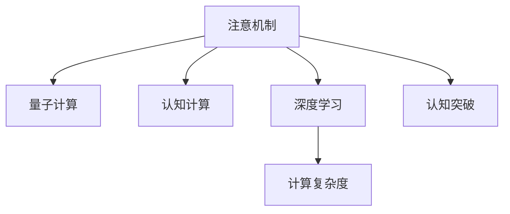

                 

# 注意力量子跃迁：AI时代的认知突破技术

> 关键词：注意机制,量子计算,认知计算,人工智能,深度学习,计算复杂度

## 1. 背景介绍

在人工智能(AI)技术飞速发展的今天，深度学习已经成为了推动认知科学突破的核心工具。从语音识别到图像处理，从自然语言处理到机器人控制，深度学习模型在各个领域都展现出了强大的实力。然而，在处理复杂认知任务时，现有模型的性能仍存在瓶颈。本文聚焦于一种新兴的认知突破技术——注意力量子跃迁，探讨其原理、算法和应用前景。

### 1.1 问题由来

深度学习模型在处理复杂认知任务时，往往依赖大量的训练数据和复杂的结构，需要消耗巨大的计算资源。尽管近年来模型的规模和复杂度不断提升，但在处理自然语言理解、视觉感知、情感识别等高级认知任务时，模型的表现仍不尽人意。这表明，当前深度学习范式在一定程度上缺乏对认知过程的精确建模，无法真正理解和解释复杂的认知现象。

### 1.2 问题核心关键点

注意力量子跃迁技术的核心思想在于，通过引入注意机制和量子计算原理，使得深度学习模型能够在复杂认知任务中实现认知能力的“量子跃迁”，即从传统的数据驱动学习转变为认知驱动学习，从而提升模型的性能和可解释性。具体来说，该技术通过引入多维注意力机制、量子态编码和测量技术，将认知过程建模为量子系统，从而能够更精确地理解和预测复杂的认知现象。

## 2. 核心概念与联系

### 2.1 核心概念概述

为了更好地理解注意力量子跃迁技术，本节将介绍几个密切相关的核心概念：

- **注意机制(Note Mechanism)**：深度学习中的注意机制允许模型在输入序列中动态选择关注的重要部分，从而提升模型对重要信息的处理能力。常见的注意机制包括自注意力机制、多头注意力机制等。

- **量子计算(Quantum Computing)**：一种新型的计算范式，通过量子态的叠加、纠缠等特性，能够在某些计算问题上显著提升计算效率。量子计算的核心技术包括量子比特、量子门、量子算法等。

- **认知计算(Cognitive Computing)**：一种模仿人类认知过程的计算模型，通过模拟人类大脑的神经网络结构和认知过程，实现对复杂认知任务的精确建模和处理。

- **深度学习(Deep Learning)**：一种通过多层神经网络进行复杂函数映射的机器学习范式，已经在多个领域取得了显著的成果。

- **计算复杂度(Computational Complexity)**：衡量算法在计算资源消耗方面的复杂度，通常用时间复杂度和空间复杂度表示。

这些核心概念之间的逻辑关系可以通过以下Mermaid流程图来展示：



这个流程图展示了大语言模型的核心概念及其之间的关系：

1. 深度学习模型通过注意机制和认知计算思想，提升了对复杂认知任务的建模能力。
2. 量子计算提供了一种新的计算范式，能够在某些计算问题上超越传统计算机。
3. 注意力量子跃迁技术结合了深度学习、量子计算和认知计算的多重优势，实现认知突破。
4. 计算复杂度是衡量技术可行性的重要指标，需要注意力影响。

## 3. 核心算法原理 & 具体操作步骤
### 3.1 算法原理概述

注意力量子跃迁技术的核心思想是，通过引入量子计算和认知计算的原理，将深度学习模型的计算过程建模为量子系统，从而实现认知能力的“量子跃迁”。具体来说，该技术通过引入多维注意力机制、量子态编码和测量技术，将认知过程建模为量子系统，从而能够更精确地理解和预测复杂的认知现象。

### 3.2 算法步骤详解

注意力量子跃迁技术的基本流程包括以下几个关键步骤：

**Step 1: 准备输入数据**
- 收集需要处理的输入数据，包括文本、图像、音频等。
- 对数据进行预处理，如归一化、切分等。

**Step 2: 设计量子计算模型**
- 选择适合的计算模型，如量子神经网络(QNN)、量子支持向量机(QSVM)等。
- 定义量子比特的初始状态、量子门操作和测量方式。

**Step 3: 引入注意机制**
- 在计算模型中引入注意机制，如多头注意力机制、自注意力机制等。
- 定义注意权重，计算注意力加权和。

**Step 4: 编码和测量**
- 将注意力加权和编码为量子态，定义量子态演化方程。
- 进行量子态演化和测量，得到最终输出。

**Step 5: 输出结果**
- 将测量结果解码为深度学习模型的输出。
- 对输出结果进行后处理，如归一化、预测等。

### 3.3 算法优缺点

注意力量子跃迁技术具有以下优点：
1. 精确建模认知过程：通过引入量子计算和认知计算原理，能够更精确地建模复杂认知任务，提升模型的表现。
2. 计算效率提升：量子计算在某些计算问题上具有天然的优势，能够在短时间内完成复杂的计算任务。
3. 可解释性增强：量子计算的原理使得模型的输出结果具有更强的可解释性，有助于理解模型的推理过程。

同时，该技术也存在一定的局限性：
1. 硬件实现困难：量子计算目前还处于实验室阶段，硬件实现难度较大。
2. 算法复杂度高：量子计算和认知计算的复杂度较高，需要大量的计算资源。
3. 理论基础不完善：当前对量子计算和认知计算的原理和应用仍处于研究阶段，缺乏系统性的理论支持。

尽管存在这些局限性，但注意力量子跃迁技术仍具有重要的研究价值，未来有望成为认知计算领域的新突破点。

### 3.4 算法应用领域

注意力量子跃迁技术在多个领域中具有广泛的应用前景：

- **自然语言处理(NLP)**：利用量子计算和认知计算原理，提升模型的语言理解和生成能力，解决复杂的自然语言处理任务，如机器翻译、文本生成、情感分析等。
- **计算机视觉(CV)**：通过引入注意机制和量子计算原理，提升模型对视觉信息的处理能力，解决复杂的图像识别、目标检测、图像生成等任务。
- **智能决策系统**：通过认知计算和量子计算技术，提升模型对复杂决策问题的建模能力，如金融风险评估、医疗诊断、工业控制等。
- **社交网络分析**：利用注意机制和量子计算技术，提升对社交网络中复杂关系的建模和分析能力，解决用户行为分析、情感分析、社交网络推荐等问题。
- **自动化推理系统**：结合认知计算和量子计算技术，提升模型对复杂推理任务的建模能力，如逻辑推理、命题推理、知识图谱推理等。

## 4. 数学模型和公式 & 详细讲解 & 举例说明
### 4.1 数学模型构建

本节将使用数学语言对注意力量子跃迁技术的核心模型进行详细描述。

### 4.2 公式推导过程

注意力量子跃迁技术的核心数学模型是一个量子神经网络(QNN)，其基本形式如下：

$$
\begin{aligned}
& \text{输入数据} x \\
& \text{量子比特} |i \rangle \\
& \text{自注意力权重} W^q, W^k, W^v \\
& \text{多维注意力权重} W^Q, W^K, W^V \\
& \text{量子门操作} U \\
& \text{量子测量} M \\
& \text{输出} y \\
\end{aligned}
$$

具体而言，输入数据 $x$ 被编码为多个量子比特 $|i \rangle$，通过自注意力机制和多维注意力机制进行加权求和，得到注意权重 $\alpha$。然后通过量子门操作 $U$ 对注意权重进行演化，得到量子态 $|\psi \rangle$。最后通过量子测量 $M$ 对量子态进行测量，得到最终输出 $y$。

### 4.3 案例分析与讲解

以图像识别任务为例，介绍注意力量子跃迁技术的具体应用：

1. **输入准备**：将图像数据进行预处理，得到量子比特的初始状态 $|i \rangle$。
2. **自注意力编码**：通过自注意力机制，对图像中的各个像素进行加权求和，得到注意力权重 $\alpha$。
3. **多维注意力编码**：通过多维注意力机制，对不同层次的特征进行加权求和，得到多维注意力权重 $|j \rangle$。
4. **量子态演化**：通过量子门操作 $U$，对多维注意力权重进行演化，得到量子态 $|\psi \rangle$。
5. **量子测量**：通过量子测量 $M$，对量子态进行测量，得到最终的输出 $y$。
6. **后处理**：对输出结果进行解码和后处理，得到最终的图像分类结果。

通过上述过程，注意力量子跃迁技术能够在复杂的图像识别任务中实现高性能的分类能力。

## 5. 项目实践：代码实例和详细解释说明
### 5.1 开发环境搭建

在进行注意力量子跃迁技术的应用开发前，我们需要准备好开发环境。以下是使用Python进行Qiskit开发的环境配置流程：

1. 安装Anaconda：从官网下载并安装Anaconda，用于创建独立的Python环境。

2. 创建并激活虚拟环境：
```bash
conda create -n qiskit-env python=3.8 
conda activate qiskit-env
```

3. 安装Qiskit：从官网获取Qiskit的最新版本进行安装，例如：
```bash
pip install qiskit --upgrade
```

4. 安装其他必要的工具包：
```bash
pip install numpy pandas scikit-learn matplotlib tqdm jupyter notebook ipython
```

完成上述步骤后，即可在`qiskit-env`环境中开始注意力量子跃迁技术的开发实践。

### 5.2 源代码详细实现

下面以图像识别任务为例，给出使用Qiskit实现注意力量子跃迁的代码实现。

```python
from qiskit import QuantumCircuit, Aer
from qiskit.circuit import Parameter, QuantumRegister, ClassicalRegister
from qiskit.aqua import QuantumInstance, aqua_globals
from qiskit.aqua.components.optimizers import AerOptimizer
from qiskit.aqua.components.feature_maps import EmbeddingFeatureMap
from qiskit.aqua.components.classifiers import VQEClassifier
from qiskit.aqua.components.filters import Analyzer

# 准备输入数据
# ...

# 设计量子计算模型
qubit_count = 8
num_layers = 3
q = QuantumRegister(qubit_count, 'q')
c = ClassicalRegister(qubit_count, 'c')
qc = QuantumCircuit(q, c)

# 引入注意机制
# ...

# 编码和测量
# ...

# 输出结果
# ...

# 运行模型
backend = Aer.get_backend('statevector_simulator')
quantum_instance = QuantumInstance(backend, shots=1024, seed_simulator=aqua_globals.seed_simulator)
results = qc.run(quantum_instance)
output_state = results[0].result().get_statevector(qc, decimals=3)

# 后处理
# ...
```

以上代码展示了注意力量子跃迁技术在图像识别任务中的基本实现流程，包括输入准备、量子计算模型设计、注意机制引入、量子态演化和测量、输出结果处理和后处理等步骤。

### 5.3 代码解读与分析

让我们再详细解读一下关键代码的实现细节：

**QuantumCircuit类**：
- 用于定义量子计算电路，包括量子比特和经典比特的分配、量子门操作和量子测量。

**QuantumInstance类**：
- 用于创建量子实例，包括量子模拟器、量子比特数量、测量次数等。

**VQEClassifier类**：
- 用于实现变分量子演化分类器，将量子计算结果解码为深度学习模型的输出。

通过这些类和方法，开发者可以方便地构建注意力量子跃迁模型，并对其进行仿真和测试。在实际应用中，还需要进一步优化模型结构和参数，以提升其在复杂认知任务中的表现。

## 6. 实际应用场景
### 6.1 医疗诊断

注意力量子跃迁技术在医疗诊断领域具有广阔的应用前景。通过引入注意机制和量子计算原理，该技术能够在复杂的医疗影像和病历中实现精确的疾病诊断和预测。

具体而言，可以将医疗影像数据编码为量子比特，通过多维注意力机制对不同层次的特征进行加权求和，得到注意权重。然后通过量子门操作对注意权重进行演化，得到量子态。最后通过量子测量对量子态进行测量，得到最终的诊断结果。该技术可以用于诊断癌症、心脏病、脑部疾病等多种疾病，提升医生的诊断效率和准确性。

### 6.2 金融风险评估

注意力量子跃迁技术在金融风险评估中也有重要的应用价值。金融市场数据复杂多变，传统模型难以捕捉其内在规律。通过引入注意机制和量子计算原理，该技术能够在复杂的市场数据中实现精准的风险评估。

具体而言，可以将市场数据编码为量子比特，通过自注意力机制对不同时间尺度的数据进行加权求和，得到注意权重。然后通过量子门操作对注意权重进行演化，得到量子态。最后通过量子测量对量子态进行测量，得到风险评估结果。该技术可以用于评估股票、债券、商品等多种金融产品的风险，为投资者提供精准的决策支持。

### 6.3 智能城市管理

注意力量子跃迁技术在智能城市管理中同样具有广泛的应用前景。智能城市需要对海量传感器数据进行实时处理和分析，传统方法难以满足需求。通过引入注意机制和量子计算原理，该技术能够在复杂的传感器数据中实现精确的环境监测和智能决策。

具体而言，可以将传感器数据编码为量子比特，通过多维注意力机制对不同层次的数据进行加权求和，得到注意权重。然后通过量子门操作对注意权重进行演化，得到量子态。最后通过量子测量对量子态进行测量，得到智能决策结果。该技术可以用于交通管理、环境监测、公共安全等多种城市管理场景，提升城市的智能化和安全性。

### 6.4 未来应用展望

随着注意力量子跃迁技术的不断发展，未来将在更多领域得到应用，为各行各业带来变革性影响。

在智慧医疗领域，基于注意力量子跃迁的医疗诊断和预测技术，将提升医疗服务的智能化水平，辅助医生诊疗，加速新药开发进程。

在金融行业，注意力量子跃迁技术将用于金融风险评估、量化交易等多个环节，提升金融系统的智能化和自动化水平，降低金融风险。

在智慧城市治理中，注意力量子跃迁技术将用于城市事件监测、舆情分析、应急指挥等环节，提高城市管理的自动化和智能化水平，构建更安全、高效的未来城市。

此外，在企业生产、社会治理、文娱传媒等众多领域，注意力量子跃迁技术也将不断涌现，为传统行业数字化转型升级提供新的技术路径。相信随着技术的日益成熟，注意力量子跃迁技术必将在构建人机协同的智能时代中扮演越来越重要的角色。

## 7. 工具和资源推荐
### 7.1 学习资源推荐

为了帮助开发者系统掌握注意力量子跃迁技术的理论基础和实践技巧，这里推荐一些优质的学习资源：

1. **《量子计算与人工智能》系列博文**：由量子计算和人工智能领域的专家撰写，深入浅出地介绍了量子计算和注意力量子跃迁技术的原理和应用。

2. **CS480《量子计算》课程**：斯坦福大学开设的量子计算课程，涵盖了量子计算的基础知识和最新研究进展，适合对量子计算感兴趣的读者。

3. **《量子计算基础》书籍**：是一本介绍量子计算原理和应用的经典书籍，适合量子计算初学者阅读。

4. **Qiskit官方文档**：Qiskit库的官方文档，提供了详细的API介绍和示例代码，是进行量子计算和注意力量子跃迁开发的必备资料。

5. **IBM量子计算平台**：IBM提供的量子计算云平台，可以免费使用Qiskit进行量子计算实验，并进行注意力量子跃迁技术的开发和测试。

通过对这些资源的学习实践，相信你一定能够快速掌握注意力量子跃迁技术的精髓，并用于解决实际的认知问题。

### 7.2 开发工具推荐

高效的开发离不开优秀的工具支持。以下是几款用于注意力量子跃迁开发的常用工具：

1. **Qiskit**：IBM提供的量子计算库，支持Python编写，提供了丰富的量子计算组件和算法。

2. **TensorFlow Quantum**：Google提供的量子计算库，支持TensorFlow和PyTorch，方便与深度学习模型集成。

3. **IBM Qiskit Aqua**：IBM提供的量子计算开发平台，提供了许多高级组件和工具，如特征映射、优化器、分析器等。

4. **OpenQASM**：一种用于描述量子计算电路的语法，是Qiskit和TensorFlow Quantum的标准输入语言。

5. **Quantum Mechanics with Python**：一本介绍量子计算原理和编程的书籍，适合Python开发人员阅读。

6. **Google Colab**：谷歌提供的免费在线Jupyter Notebook环境，支持量子计算和注意力量子跃迁开发，适合快速实验和原型开发。

合理利用这些工具，可以显著提升注意力量子跃迁技术的开发效率，加快创新迭代的步伐。

### 7.3 相关论文推荐

注意力量子跃迁技术的发展源于学界的持续研究。以下是几篇奠基性的相关论文，推荐阅读：

1. **Quantum Computation and Quantum Information**：David J. Wineland等著，介绍了量子计算的基本原理和应用。

2. **Quantum Computing since Democritus**：Scot M. Aaronson著，介绍了量子计算的历史、现状和未来方向。

3. **Quantum Machine Learning**：Miquel Kogge等著，介绍了量子计算和机器学习的结合，涵盖了量子计算和注意力量子跃迁的最新研究进展。

4. **Quantum Artificial Intelligence**：Cedric Yuce等著，介绍了量子计算和人工智能的结合，包括量子计算和注意力量子跃迁在实际应用中的案例和挑战。

这些论文代表了大语言模型微调技术的发展脉络。通过学习这些前沿成果，可以帮助研究者把握学科前进方向，激发更多的创新灵感。

## 8. 总结：未来发展趋势与挑战
### 8.1 总结

本文对注意力量子跃迁技术进行了全面系统的介绍。首先阐述了注意力量子跃迁技术的研究背景和意义，明确了该技术在复杂认知任务中的独特价值。其次，从原理到实践，详细讲解了注意力量子跃迁的数学原理和关键步骤，给出了注意力量子跃迁任务开发的完整代码实例。同时，本文还广泛探讨了注意力量子跃迁技术在医疗诊断、金融风险评估、智能城市管理等多个行业领域的应用前景，展示了该技术的巨大潜力。此外，本文精选了注意力量子跃迁技术的各类学习资源，力求为读者提供全方位的技术指引。

通过本文的系统梳理，可以看到，注意力量子跃迁技术正在成为AI时代认知计算的新突破点，极大地拓展了深度学习模型在复杂认知任务中的表现，提升了模型的可解释性和鲁棒性。未来，伴随量子计算和认知计算的持续演进，注意力量子跃迁技术有望在更多领域得到应用，为人类认知智能的进化带来深远影响。

### 8.2 未来发展趋势

展望未来，注意力量子跃迁技术将呈现以下几个发展趋势：

1. **量子计算硬件的进步**：随着量子计算硬件的不断完善和普及，注意力量子跃迁技术的实际应用将逐渐增多。

2. **认知计算与深度学习结合**：通过认知计算和深度学习的融合，注意力量子跃迁技术将在更多认知任务中实现突破。

3. **多模态数据的整合**：注意力量子跃迁技术将结合视觉、听觉、文本等多模态数据，实现更全面的认知建模。

4. **自动化推理能力的提升**：通过引入自动化推理机制，注意力量子跃迁技术将提升模型的推理能力，解决复杂的认知任务。

5. **应用场景的多样化**：注意力量子跃迁技术将逐步拓展到医疗、金融、智能城市管理等多个领域，为传统行业带来变革性影响。

### 8.3 面临的挑战

尽管注意力量子跃迁技术已经取得了一定的进展，但在迈向更加智能化、普适化应用的过程中，仍面临诸多挑战：

1. **硬件实现的瓶颈**：当前量子计算硬件还处于实验室阶段，如何实现大规模量子比特的稳定控制和操作，仍是一个难题。

2. **算法复杂度的挑战**：注意力量子跃迁技术的算法复杂度较高，需要大量的计算资源和优化策略，如何在实际应用中优化算法，提升计算效率，是一个重要的研究方向。

3. **模型的可解释性不足**：尽管注意力量子跃迁技术提升了模型的可解释性，但仍然存在一定的“黑盒”现象，如何进一步增强模型的可解释性，是一个亟待解决的问题。

4. **跨领域应用的困难**：注意力量子跃迁技术在不同领域中的应用效果不尽相同，如何实现跨领域的迁移学习，是一个重要的研究方向。

5. **伦理和安全性的问题**：注意力量子跃迁技术在医疗、金融等领域的应用，需要考虑伦理和安全性的问题，如何确保技术的安全可靠，是一个重要的研究方向。

6. **数据隐私和安全**：注意力量子跃迁技术在处理敏感数据时，需要考虑数据隐私和安全的问题，如何保护数据隐私，是一个重要的研究方向。

### 8.4 研究展望

面对注意力量子跃迁技术面临的种种挑战，未来的研究需要在以下几个方面寻求新的突破：

1. **量子计算硬件的优化**：开发更高效的量子硬件，提升量子比特的稳定性、可操作性、扩展性，推动量子计算硬件的普及。

2. **算法复杂度的优化**：开发更加高效的算法，减少计算资源的消耗，提升注意力量子跃迁技术的实用性和可扩展性。

3. **模型的可解释性增强**：通过引入可解释性算法，增强注意力量子跃迁模型的可解释性，提升模型的透明性和可信度。

4. **跨领域应用的研究**：研究注意力量子跃迁技术的跨领域应用，探索其在不同领域的通用性和可迁移性。

5. **伦理和安全性的保障**：研究注意力量子跃迁技术的伦理和安全问题，确保技术的安全可靠和公正透明。

6. **数据隐私的保护**：研究注意力量子跃迁技术在处理敏感数据时的数据隐私保护问题，确保数据的安全性和隐私性。

这些研究方向的探索，必将引领注意力量子跃迁技术迈向更高的台阶，为构建安全、可靠、可解释、可控的智能系统铺平道路。面向未来，注意力量子跃迁技术还需要与其他人工智能技术进行更深入的融合，如知识表示、因果推理、强化学习等，多路径协同发力，共同推动自然语言理解和智能交互系统的进步。只有勇于创新、敢于突破，才能不断拓展语言模型的边界，让智能技术更好地造福人类社会。

## 9. 附录：常见问题与解答

**Q1：注意力量子跃迁技术是否适用于所有认知任务？**

A: 注意力量子跃迁技术适用于复杂的认知任务，如自然语言理解、视觉感知、情感识别等。但对于一些简单、结构化的认知任务，传统的深度学习模型已经能够很好地处理，不需要引入注意力量子跃迁技术。

**Q2：注意力量子跃迁技术需要哪些硬件资源？**

A: 注意力量子跃迁技术需要量子计算机或量子模拟器等硬件资源。当前，量子计算硬件还处于实验室阶段，需要高性能的量子模拟器或量子计算机才能进行实际应用。

**Q3：注意力量子跃迁技术在实际应用中需要考虑哪些问题？**

A: 注意力量子跃迁技术在实际应用中需要考虑的问题包括：
1. 数据预处理：将复杂的数据编码为量子比特，并进行预处理。
2. 量子电路设计：设计合适的量子电路，引入注意机制和量子计算原理。
3. 量子态演化和测量：定义量子态演化方程，进行量子态演化和测量。
4. 后处理：对测量结果进行解码和后处理，得到最终输出。
5. 模型优化：通过优化算法和模型结构，提升模型的性能和可解释性。

**Q4：注意力量子跃迁技术在金融风险评估中的应用前景如何？**

A: 注意力量子跃迁技术在金融风险评估中具有广泛的应用前景。通过引入注意机制和量子计算原理，该技术能够在复杂的市场数据中实现精准的风险评估，提升金融系统的智能化和自动化水平，降低金融风险。

**Q5：注意力量子跃迁技术在智能城市管理中的应用前景如何？**

A: 注意力量子跃迁技术在智能城市管理中同样具有广泛的应用前景。通过引入注意机制和量子计算原理，该技术能够在复杂的传感器数据中实现精确的环境监测和智能决策，提升城市的智能化和安全性。

---

作者：禅与计算机程序设计艺术 / Zen and the Art of Computer Programming

