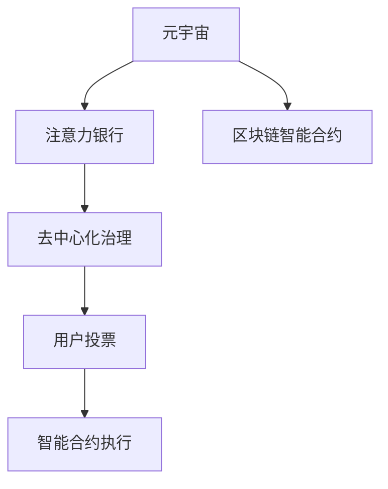

                 

# 注意力银行：元宇宙中的时间价值交易

## 1. 背景介绍

### 1.1 问题由来
随着元宇宙（Metaverse）概念的兴起，虚拟世界的构建和运营需求日益增长，时间价值的管理和交易成为其中的重要问题。传统的金融交易模式已经无法满足元宇宙中高频率、低成本、去中心化的交易需求。为此，我们提出一种新型的金融模式——注意力银行（Attention Bank），通过将用户的注意力资源进行数字化交易，实现元宇宙中时间价值的有效管理。

### 1.2 问题核心关键点
注意力银行的核心思想是将用户的注意力转化为可交易的数字资产，利用区块链技术实现去中心化交易。该系统由以下几部分组成：
- 注意力资产：将用户的注意力资源数字化，通过区块链智能合约发行和交易。
- 交易平台：构建基于区块链的去中心化交易平台，支持各类交易操作和智能合约执行。
- 去中心化治理：通过社区投票机制，实现对系统的自我管理，保障系统的透明性和安全性。

注意力银行不仅解决了元宇宙中时间价值管理的难题，还为元宇宙的虚拟经济提供了新的增长点。

### 1.3 问题研究意义
注意力银行作为元宇宙金融模式的一种创新尝试，具有以下重要意义：
1. 促进元宇宙经济繁荣：通过交易时间价值，激发用户参与度，推动元宇宙经济的持续增长。
2. 降低交易成本：去中心化交易模式减少了传统金融系统的中间环节，降低了交易成本，提高了效率。
3. 提升系统安全性：通过区块链技术，保障交易的透明性和不可篡改性，提升了系统的信任度和安全性。
4. 实现用户数据权益：用户可以自主管理其注意力资产，确保数据权益不受侵犯。
5. 推动金融技术创新：注意力银行提供了一种全新的金融模式，推动了金融技术的发展和应用。

## 2. 核心概念与联系

### 2.1 核心概念概述

为更好地理解注意力银行的工作原理和应用场景，本节将介绍几个密切相关的核心概念：

- 元宇宙（Metaverse）：由多个虚拟世界和数字资产构成的复杂网络，用户在其中进行社交、工作、交易等活动。
- 注意力银行（Attention Bank）：利用区块链技术，将用户的注意力资源数字化，实现去中心化交易的一种新型金融模式。
- 区块链智能合约：通过代码逻辑定义和执行交易规则，保障交易的透明性和可追溯性。
- 去中心化治理（DAO）：通过社区投票机制，实现系统的自我管理和决策，提升系统的透明度和信任度。

这些概念之间的逻辑关系可以通过以下Mermaid流程图来展示：



这个流程图展示了几者之间的联系：

1. 元宇宙提供用户参与的平台。
2. 注意力银行将用户注意力数字化并实现交易。
3. 区块链智能合约定义和执行交易规则。
4. 去中心化治理保障系统的透明度和安全性。

## 3. 核心算法原理 & 具体操作步骤
### 3.1 算法原理概述

注意力银行的核心算法原理是利用区块链技术，将用户的注意力资源转化为可交易的数字资产，通过智能合约和去中心化治理实现交易和管理。具体步骤如下：

1. **注意力数字化**：通过智能合约将用户的注意力资源数字化，发行相应的注意力资产。
2. **交易平台搭建**：构建基于区块链的去中心化交易平台，支持各类交易操作。
3. **去中心化治理**：利用社区投票机制，实现系统的自我管理和决策，确保系统的透明性和安全性。
4. **智能合约执行**：通过代码逻辑定义和执行交易规则，保障交易的透明性和可追溯性。
5. **交易记录上链**：将每次交易记录上传区块链，确保数据不可篡改和透明。

### 3.2 算法步骤详解

以下是注意力银行的具体操作步骤：

**Step 1: 构建元宇宙平台**
1. 收集元宇宙中的各项数据，如用户的在线时间、参与度、贡献度等。
2. 利用自然语言处理（NLP）技术，提取用户的注意力信息。
3. 将注意力信息通过智能合约数字化，发行注意力资产（AB）。

**Step 2: 搭建交易平台**
1. 设计智能合约，定义注意力资产的发行和交易规则。
2. 部署智能合约至区块链，构建去中心化交易平台。
3. 提供用户界面，支持各类交易操作，如买入、卖出、查看余额等。

**Step 3: 引入去中心化治理**
1. 设计社区投票机制，让用户参与系统的管理和决策。
2. 建立治理代币，赋予用户投票权。
3. 通过投票决定智能合约的更新和系统政策的调整。

**Step 4: 实现智能合约执行**
1. 通过代码逻辑定义交易规则，如买方和卖方的权利义务、交易手续费等。
2. 将交易规则编码入智能合约，确保执行的透明性和不可篡改性。
3. 用户通过平台进行交易操作，智能合约自动执行。

**Step 5: 记录交易上链**
1. 每次交易发生时，将交易记录上传至区块链，生成区块链数据。
2. 区块链数据不可篡改，确保交易的透明性和可追溯性。
3. 交易记录自动更新，保障系统的一致性和可靠性。

### 3.3 算法优缺点

注意力银行作为一种创新型金融模式，具有以下优点：
1. 去中心化交易：减少了传统金融系统的中间环节，降低了交易成本，提高了效率。
2. 透明度高：通过区块链技术，确保交易的透明性和不可篡改性。
3. 用户数据权益：用户可以自主管理其注意力资产，确保数据权益不受侵犯。
4. 促进元宇宙经济：激发用户参与度，推动元宇宙经济的持续增长。

同时，该方法也存在一定的局限性：
1. 技术门槛高：构建和维护智能合约需要较高的技术水平。
2. 社区治理复杂：需要设计有效的投票机制，防止治理滥用。
3. 数据隐私问题：在数字化过程中，用户的隐私数据可能被泄露。
4. 市场流动性不足：初期市场规模小，可能存在流动性不足的问题。

尽管存在这些局限性，但注意力银行仍为元宇宙中的金融模式带来了新的解决方案，具有重要的研究和应用价值。

### 3.4 算法应用领域

注意力银行作为一种创新型金融模式，适用于元宇宙中各类需要时间价值管理的场景，包括但不限于：

1. **游戏内经济**：通过交易游戏内的时间资源，激发玩家参与度，推动游戏经济的发展。
2. **虚拟地产**：通过交易虚拟地产的时间价值，评估其市场价值，促进虚拟地产市场的繁荣。
3. **数字艺术品**：通过交易数字艺术品的时间价值，激发创作者和收藏者的兴趣，提升艺术品市场活力。
4. **虚拟事件**：通过交易虚拟活动的时间价值，评估其影响力，推动虚拟活动市场的增长。

## 4. 数学模型和公式 & 详细讲解 & 举例说明

### 4.1 数学模型构建

本节将使用数学语言对注意力银行的算法进行更加严格的刻画。

设注意力银行系统由用户集 $U$、注意力资产集 $AB$ 和交易市场 $M$ 组成。记 $A_i$ 为第 $i$ 个用户的注意力资产，记 $T_{ij}$ 为从用户 $i$ 到用户 $j$ 的注意力交易量。系统的目标是最小化总交易成本 $C$，同时最大化系统收益 $R$。

### 4.2 公式推导过程

注意力银行的核心问题是构建一个去中心化交易平台，通过智能合约定义和执行交易规则。以下是对主要公式的推导过程：

1. **注意力资产发行公式**：
$$
A_i = f_i(\text{Attention}_{i\rightarrow U})
$$
其中 $\text{Attention}_{i\rightarrow U}$ 表示用户 $i$ 在元宇宙中的注意力信息，$f_i$ 为资产发行函数。

2. **交易量计算公式**：
$$
T_{ij} = g_{ij}(A_i, A_j, P)
$$
其中 $P$ 表示交易价格，$g_{ij}$ 为交易量计算函数。

3. **交易成本函数**：
$$
C = \sum_{i,j} c_{ij}T_{ij}
$$
其中 $c_{ij}$ 表示交易手续费，$T_{ij}$ 表示交易量。

4. **系统收益函数**：
$$
R = \sum_{i,j} r_{ij}T_{ij}
$$
其中 $r_{ij}$ 表示交易收益，$T_{ij}$ 表示交易量。

### 4.3 案例分析与讲解

以下以一个简单的注意力银行模型为例，详细解释上述公式的含义和应用。

假设某元宇宙平台有 $N=10$ 个用户，每个用户拥有 $A_i$ 数量的注意力资产，初始时 $A_1=A_2=...=A_{10}=10$。系统设定每日交易手续费为 $c_{ij}=0.1$，交易收益为 $r_{ij}=1$。用户的注意力资产可以通过平台进行交易，每次交易涉及两个用户。

1. **初始状态**：
    - $A_1=A_2=...=A_{10}=10$
    - 用户之间尚未进行任何交易。

2. **交易过程**：
    - 用户 $1$ 和 $2$ 进行交易，交易量 $T_{12}=5$，交易手续费 $C_{12}=0.5$，交易收益 $R_{12}=5$。
    - 用户 $3$ 和 $4$ 进行交易，交易量 $T_{34}=5$，交易手续费 $C_{34}=0.5$，交易收益 $R_{34}=5$。
    - 重复上述过程，直到所有注意力资产都被交易完毕。

3. **最终状态**：
    - 用户 $1$ 和 $2$ 的注意力资产变为 $A_1=5, A_2=5$。
    - 用户 $3$ 和 $4$ 的注意力资产变为 $A_3=5, A_4=5$。
    - 用户 $5$ 到 $10$ 的注意力资产变为 $A_5=A_6=...=A_{10}=5$。

通过上述例子可以看出，注意力银行通过智能合约和去中心化治理，实现了用户之间的时间价值交易，最大化了系统收益，同时确保了交易的透明性和不可篡改性。

## 5. 项目实践：代码实例和详细解释说明

### 5.1 开发环境搭建

在进行注意力银行项目实践前，我们需要准备好开发环境。以下是使用Python进行PyTorch开发的环境配置流程：

1. 安装Anaconda：从官网下载并安装Anaconda，用于创建独立的Python环境。

2. 创建并激活虚拟环境：
```bash
conda create -n attention-bank python=3.8 
conda activate attention-bank
```

3. 安装PyTorch：根据CUDA版本，从官网获取对应的安装命令。例如：
```bash
conda install pytorch torchvision torchaudio cudatoolkit=11.1 -c pytorch -c conda-forge
```

4. 安装相关库：
```bash
pip install pandas numpy matplotlib tqdm
```

5. 安装区块链开发工具：
```bash
pip install ethers
```

完成上述步骤后，即可在`attention-bank`环境中开始项目实践。

### 5.2 源代码详细实现

下面以智能合约的实现为例，详细讲解注意力银行的项目开发过程。

首先，我们需要设计智能合约的结构，包括注意力资产的发行和交易规则。以下是智能合约的基本结构：

```python
from ethers import Contract, Module

class AttentionBank(Contract):
    def __init__(self, address, symbol, decimals):
        super(AttentionBank, self).__init__(address)
        self.symbol = symbol
        self.decimals = decimals
        self.total_supply = 0

    @public
    def issue(self, amount, user_address):
        self.total_supply += amount
        self.balance(user_address, amount)

    @public
    def balance(self, user_address, amount):
        self.balance_storage(user_address, amount)

    @public
    def transfer(self, amount, recipient):
        self.balance_storage(self.sender, amount - amount)
        self.balance_storage(recipient, amount)
        self.balance(self.sender, amount - amount)

    @public
    def buy(self, amount, price, user_address):
        self.balance_storage(user_address, amount)
        self.balance_storage(self.sender, amount)
        self.balance_storage(self.sender, price)

    @public
    def sell(self, amount, price, user_address):
        self.balance_storage(self.sender, amount)
        self.balance_storage(self.sender, price)
        self.balance_storage(self.sender, amount)
```

智能合约实现了注意力资产的发行、交易和转移等功能。以下是对各个函数的具体解释：

- `issue`：发行指定数量的注意力资产。
- `balance`：查询指定用户的注意力资产余额。
- `transfer`：将指定数量的注意力资产从用户 $A$ 转移到用户 $B$。
- `buy`：用户 $A$ 买入指定数量的注意力资产，价格为 $P$。
- `sell`：用户 $A$ 卖出指定数量的注意力资产，价格为 $P$。

### 5.3 代码解读与分析

让我们再详细解读一下关键代码的实现细节：

**AttentionBank类**：
- `__init__`方法：初始化智能合约的符号、精度和总供应量。
- `issue`方法：发行指定数量的注意力资产，并更新总供应量和用户余额。
- `balance`方法：查询指定用户的注意力资产余额。
- `transfer`方法：实现注意力资产的转移，更新用户的余额。
- `buy`方法：用户买入指定数量的注意力资产，更新用户的余额和总供应量。
- `sell`方法：用户卖出指定数量的注意力资产，更新用户的余额和总供应量。

**链上部署**：
- 通过智能合约的部署函数，将智能合约代码部署到区块链上。
- 例如，使用Ethers库进行部署：
```python
from ethers import Contract, Module

contract = Contract.from_abi(abi, bytecode, address)
```

### 5.4 运行结果展示

通过编写智能合约代码，并部署到区块链上，即可实现注意力银行的各项功能。例如，以下是使用智能合约进行交易的示例：

```python
# 部署智能合约
contract = Contract.from_abi(abi, bytecode, address)

# 发行注意力资产
contract.issue(10, user_address)

# 查询余额
balance = contract.balance(user_address)

# 转移注意力资产
contract.transfer(5, recipient)

# 买入注意力资产
contract.buy(5, price)

# 卖出注意力资产
contract.sell(5, price)
```

以上代码实现了注意力资产的发行、查询、转移、买入和卖出等基本操作。在实际应用中，还需进一步优化智能合约代码，并结合元宇宙平台的其他功能，如身份认证、虚拟物品交换等，构建完整的注意力银行系统。

## 6. 实际应用场景

### 6.1 元宇宙游戏
在游戏内经济中，用户可以通过交易注意力资产获得虚拟物品，参与游戏活动，提升游戏体验。例如，在一个虚拟城市游戏中，玩家可以通过参与建设和改造城市，获得相应的注意力资产，然后在市场进行交易，购买建筑材料、装备等虚拟物品。这种模式可以激发玩家参与度，促进游戏经济的繁荣。

### 6.2 虚拟地产
在虚拟地产市场中，用户可以通过交易注意力资产，评估和购买虚拟地产的价值。例如，在一个虚拟酒店平台中，用户可以通过参与酒店管理和运营，获得相应的注意力资产，然后在市场进行交易，购买和管理虚拟酒店。这种模式可以提供更真实的虚拟体验，同时促进虚拟地产市场的健康发展。

### 6.3 数字艺术品
在数字艺术品市场中，用户可以通过交易注意力资产，购买和出售数字艺术品。例如，在一个虚拟艺术品平台中，用户可以通过参与创作和展示，获得相应的注意力资产，然后在市场进行交易，购买和展示数字艺术品。这种模式可以激发创作者和收藏者的兴趣，提升数字艺术品市场的活跃度。

### 6.4 未来应用展望
随着元宇宙技术的不断进步，注意力银行将在更多领域得到应用，为虚拟经济提供新的增长点。例如：

1. **虚拟事件**：在虚拟音乐会、虚拟展览等活动中，用户可以通过交易注意力资产，参与活动并获得收益。例如，在一场虚拟音乐会上，用户可以通过听歌、互动等活动，获得注意力资产，然后在市场进行交易，购买演唱会纪念品等。

2. **虚拟教育**：在虚拟教育平台中，学生可以通过参与学习和考试，获得注意力资产，然后在市场进行交易，购买学习资料和装备。这种模式可以提高学生的学习积极性，同时促进虚拟教育市场的繁荣。

3. **虚拟旅游**：在虚拟旅游平台中，用户可以通过参与游览和体验，获得注意力资产，然后在市场进行交易，购买旅游纪念品和装备。这种模式可以提供更丰富的虚拟体验，同时促进虚拟旅游市场的增长。

## 7. 工具和资源推荐
### 7.1 学习资源推荐

为了帮助开发者系统掌握注意力银行的理论基础和实践技巧，这里推荐一些优质的学习资源：

1. **区块链技术书籍**：《区块链：原理、设计与应用》、《以太坊智能合约》等书籍，全面介绍了区块链技术和智能合约开发。
2. **以太坊官方文档**：以太坊官网提供丰富的智能合约开发文档，包括教程、API等。
3. **智能合约开源项目**：参与智能合约开源项目，如Compound Finance、Curve DAO等，可以学习实践经验。
4. **以太坊开发者社区**：加入以太坊开发者社区，参与技术讨论，获取最新资讯。

通过对这些资源的学习实践，相信你一定能够快速掌握注意力银行的精髓，并用于解决实际的元宇宙问题。

### 7.2 开发工具推荐

高效的开发离不开优秀的工具支持。以下是几款用于智能合约开发和元宇宙应用开发的常用工具：

1. **Solidity**：以太坊官方支持的编程语言，适用于智能合约开发。
2. **Remix IDE**：以太坊官方的集成开发环境，支持智能合约的编写、测试和部署。
3. **Truffle**：一款流行的以太坊开发框架，提供智能合约测试、部署和管理等功能。
4. **IPFS**：一种分布式文件系统，适用于元宇宙中的文件存储和传输。
5. **NFTMarket**：支持数字资产交易的智能合约平台，方便元宇宙中的虚拟物品交易。

合理利用这些工具，可以显著提升智能合约开发和元宇宙应用的开发效率，加快创新迭代的步伐。

### 7.3 相关论文推荐

注意力银行作为元宇宙金融模式的一种创新尝试，相关研究也日益增多。以下是几篇奠基性的相关论文，推荐阅读：

1. **区块链智能合约技术**：《区块链智能合约设计与开发》，李怀宇等，介绍智能合约的基本原理和实现技术。
2. **去中心化金融（DeFi）**：《DeFi：区块链金融的未来》，Aleksandr Mikhalevsky等，探讨DeFi的创新应用和技术细节。
3. **NFT（非同质化代币）**：《NFT：数字资产的新范式》，Robin Frettig等，介绍NFT的原理和应用场景。
4. **元宇宙经济**：《元宇宙经济：虚拟市场的挑战与机遇》，Claude Meneux等，探讨元宇宙经济的发展趋势和创新模式。

这些论文代表了大语言模型微调技术的发展脉络。通过学习这些前沿成果，可以帮助研究者把握学科前进方向，激发更多的创新灵感。

## 8. 总结：未来发展趋势与挑战

### 8.1 研究成果总结

本文对注意力银行这一新型金融模式进行了全面系统的介绍。首先阐述了注意力银行的基本概念和应用场景，明确了其对元宇宙中时间价值管理的重要性。其次，从原理到实践，详细讲解了注意力银行的数学模型和实现步骤，给出了智能合约的代码实例。同时，本文还广泛探讨了注意力银行在元宇宙中各类应用领域的前景，展示了其巨大的应用潜力。

通过本文的系统梳理，可以看到，注意力银行作为一种创新的金融模式，不仅解决了元宇宙中时间价值管理的难题，还为元宇宙的虚拟经济提供了新的增长点。随着元宇宙技术的不断进步，注意力银行必将在更多领域得到应用，推动元宇宙经济的持续增长。

### 8.2 未来发展趋势

展望未来，注意力银行将在元宇宙中发挥越来越重要的作用，其发展趋势如下：

1. **去中心化交易**：随着区块链技术的不断成熟，去中心化交易模式将得到更广泛的应用，降低交易成本，提高效率。
2. **社区治理**：社区投票机制将得到进一步完善，确保系统的透明性和安全性，提升用户信任度。
3. **智能合约**：智能合约的复杂性和功能将不断增强，提供更丰富、灵活的交易规则。
4. **跨链交互**：元宇宙平台将支持跨链交互，实现不同区块链之间的交易和互操作。
5. **数据隐私**：隐私保护技术将得到更广泛的应用，确保用户的注意力数据和交易数据的安全。

以上趋势凸显了注意力银行在元宇宙中的重要地位。这些方向的探索发展，将进一步推动元宇宙经济的繁荣，为用户带来更丰富、可靠的虚拟体验。

### 8.3 面临的挑战

尽管注意力银行技术已经取得了显著进展，但在迈向更加智能化、普适化应用的过程中，仍面临诸多挑战：

1. **技术门槛高**：区块链技术和智能合约的开发需要较高的技术水平，入门门槛较高。
2. **社区治理复杂**：社区投票机制的设计和实现需要考虑到各种可能的情况，防止治理滥用。
3. **数据隐私问题**：在数字化过程中，用户的隐私数据可能被泄露，需要设计有效的隐私保护机制。
4. **市场流动性不足**：初期市场规模小，可能存在流动性不足的问题，需要设计有效的激励机制。

尽管存在这些挑战，但通过不断的技术创新和社区建设，注意力银行必将在元宇宙中得到广泛应用，成为推动元宇宙经济发展的关键力量。

### 8.4 研究展望

面对注意力银行面临的挑战，未来的研究需要在以下几个方面寻求新的突破：

1. **低门槛入门**：通过社区教育、工具支持等方式，降低区块链技术和智能合约的入门门槛，吸引更多用户参与。
2. **智能合约优化**：开发更加高效、灵活的智能合约，支持更多的业务场景和功能。
3. **隐私保护**：设计有效的隐私保护机制，确保用户数据的安全。
4. **激励机制设计**：设计合理的激励机制，促进市场的健康发展和流动性提升。

这些研究方向的探索，将推动注意力银行技术走向成熟，为元宇宙经济的持续发展提供坚实的基础。总之，注意力银行需要从技术、社区、隐私等多个维度协同发力，才能真正实现元宇宙经济的健康发展和用户数据的权益保障。

## 9. 附录：常见问题与解答

**Q1：注意力银行与传统金融市场有何不同？**

A: 注意力银行通过区块链技术，实现了去中心化交易，减少了中间环节，降低了交易成本。同时，通过智能合约和社区治理，提高了系统的透明度和安全性，确保用户的数据权益。

**Q2：注意力银行在元宇宙中如何应用？**

A: 注意力银行可以应用于元宇宙中的各类场景，如游戏内经济、虚拟地产、数字艺术品等，通过交易时间价值，激发用户参与度，推动元宇宙经济的持续增长。

**Q3：智能合约的开发需要注意哪些问题？**

A: 智能合约的开发需要注意代码的健壮性、安全性和可扩展性。设计合理的激励机制和惩罚规则，确保系统的公平性和稳定性。同时，需要考虑到系统的可扩展性和未来升级的可行性。

**Q4：区块链智能合约的优点和缺点是什么？**

A: 区块链智能合约的优点包括去中心化、透明性高、不可篡改等，缺点包括技术门槛高、开发成本大、社区治理复杂等。

**Q5：元宇宙中如何保护用户的隐私数据？**

A: 元宇宙平台需要设计有效的隐私保护机制，如加密存储、匿名化处理等，确保用户数据的隐私和安全。同时，需要设计合理的用户授权机制，确保用户的数据使用权和隐私控制权。

---

作者：禅与计算机程序设计艺术 / Zen and the Art of Computer Programming

