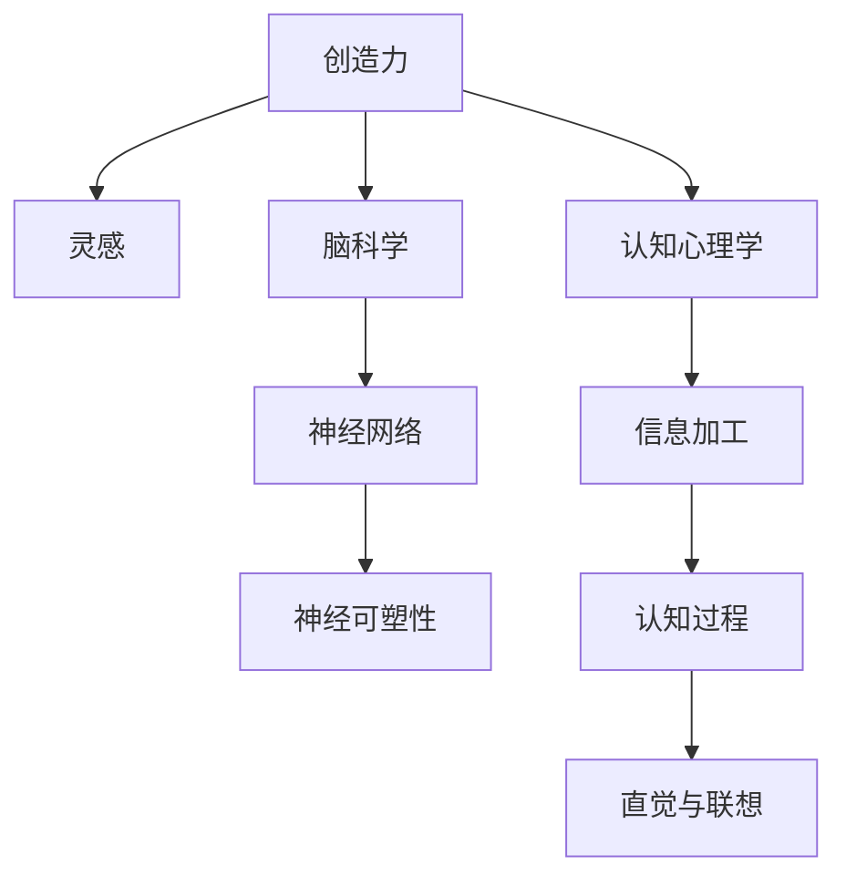

                 

# 洞察力与创造力：灵感的科学解析

> 关键词：洞察力,创造力,灵感,科学解析,脑科学,认知心理学,创新,技术发展

## 1. 背景介绍

### 1.1 问题由来
在科技快速发展的今天，创新和创造力成为推动社会进步的重要驱动力。无数科学家、工程师、艺术家通过创新的视角和思维方式，推动了人类文明的发展。但科学界对创造力的本质仍知之甚少，如何培养和激发人类的创造力，成为摆在人们面前的重要课题。

创造力一直被认为是一种复杂的、难以定义的心理现象。与常见的算法和逻辑不同，创造力涉及直觉、灵感、情感等多个维度，难以用常规的科学手段进行研究。但近年来，随着神经科学、认知心理学和脑科学研究的发展，科学家们开始在多学科交叉中寻找创造力的科学解析。

### 1.2 问题核心关键点
1. **创造力的本质**：创造力是一种认知过程，涉及信息加工、记忆、注意力、联想等多个神经过程。
2. **脑科学与创造力的关系**：大脑中的多个神经网络和区域，如前额叶皮层、海马体、杏仁核等，均可能参与创造力的生成过程。
3. **科学解析与技术应用**：通过多学科合作，对创造力的神经机制进行解析，进而开发出能激发创造力的技术工具。
4. **创造力的培养与训练**：通过科学研究，找到激发创造力的有效方法，推动教育、训练和实践中的创新应用。

## 2. 核心概念与联系

### 2.1 核心概念概述

为更好地理解创造力的科学解析，我们首先需要介绍一些核心概念及其相互关系：

- **创造力**：是指个体或群体通过创造性思维产生新的、有价值的想法、产品或解决问题方案的能力。
- **灵感**：是指在创造过程中突然出现的、具有创新性和启发性的思想或创意。
- **脑科学**：研究大脑的神经网络、神经传递物质、神经可塑性等，揭示大脑如何工作。
- **认知心理学**：研究人类心理活动的基本过程，如感知、记忆、思维、情感等。
- **神经网络**：由神经元和神经突触组成的复杂网络，负责信息传递和处理。

这些核心概念之间的逻辑关系可以通过以下Mermaid流程图来展示：



这个流程图展示了大创造力与脑科学、认知心理学之间的联系，以及创造力的生成过程。

## 3. 核心算法原理 & 具体操作步骤
### 3.1 算法原理概述

创造力的科学解析主要涉及以下几个方面的原理：

1. **信息加工理论**：创造力来源于对已有信息的重新组合和创新。脑科学研究表明，信息在大脑中进行编码、存储和检索，然后通过神经网络进行联想和创新。
2. **记忆理论**：记忆是创造力的基础，长期记忆和短期记忆的协同工作，使得信息在大脑中得以提取和整合。
3. **注意力机制**：创造力的产生需要专注于特定问题，选择性注意有助于聚焦于关键信息和可能的解决方案。
4. **联想和创新**：联想和创新是创造力的核心，神经可塑性使得大脑能够形成新的神经连接，实现信息的灵活组合。

### 3.2 算法步骤详解

基于上述理论，创造力的科学解析可以分为以下步骤：

**Step 1: 收集和整理数据**
- 收集创造力相关的脑成像数据、认知测试数据、行为实验数据等。
- 整理和预处理数据，消除噪声，提取关键特征。

**Step 2: 建立数学模型**
- 使用统计学和机器学习技术，构建创造力生成机制的数学模型。
- 模型通常涉及多元回归、逻辑回归、支持向量机、神经网络等算法。

**Step 3: 解析与验证**
- 利用脑成像技术（如fMRI、EEG等），揭示创造力背后的神经机制。
- 将模型预测结果与实际数据进行对比，验证模型的准确性和有效性。

**Step 4: 应用与优化**
- 基于科学解析结果，开发和优化激发创造力的技术工具。
- 例如，开发基于神经网络的音乐创作工具、文字生成工具等。

### 3.3 算法优缺点

创造力的科学解析方法具有以下优点：

1. **多学科融合**：结合脑科学、认知心理学等多个学科的理论，提供全面的解析视角。
2. **数据驱动**：基于大规模实验数据和脑成像数据，提供了客观的科学依据。
3. **应用广泛**：解析结果可以用于激发创新思维、训练创造力、辅助教育等领域。

同时，该方法也存在一些局限性：

1. **数据复杂性**：脑成像数据和认知测试数据复杂多样，难以标准化处理。
2. **模型复杂性**：创造力的解析涉及多种神经过程，需要复杂多变的模型。
3. **伦理问题**：实验设计涉及脑成像和认知测试，可能涉及伦理和隐私问题。

尽管存在这些局限性，但就目前而言，多学科合作解析创造力的科学方法，仍是探究创造力本质的重要手段。未来相关研究需进一步提高数据标准化和模型简化，以更高效、准确地解析创造力的神经机制。

### 3.4 算法应用领域

基于科学解析的创造力方法，已经在多个领域得到应用，例如：

1. **艺术创作**：开发基于神经网络的绘画、音乐创作工具，引导艺术家进行创新创作。
2. **教育培训**：设计创新的教学方法，激发学生的创造力，提升教育效果。
3. **企业管理**：运用创造力理论进行人力资源管理，推动企业创新。
4. **产品设计**：开发基于联想和创新的设计工具，辅助设计师进行创新设计。
5. **医学研究**：解析患者在病理过程中的创造力表现，设计更具创新性的治疗方案。

这些领域的应用展示了创造力解析的广泛潜力和深远影响。随着科学研究的不断深入，预计未来将有更多创新技术从创造力解析中诞生。

## 4. 数学模型和公式 & 详细讲解 & 举例说明

### 4.1 数学模型构建

本节将使用数学语言对创造力的科学解析进行更严格的刻画。

记创造力水平为 $C$，其生成机制涉及多个神经过程 $P_1, P_2, \cdots, P_n$。设 $C$ 与 $P_i$ 的关系为：

$$
C = f(P_1, P_2, \cdots, P_n)
$$

其中 $f$ 为 $P_i$ 的函数关系，可以表示为线性、非线性或其他复杂形式。

### 4.2 公式推导过程

为了简化计算，我们假设 $P_i$ 之间存在相互独立的关系，即：

$$
C = \alpha_1 P_1 + \alpha_2 P_2 + \cdots + \alpha_n P_n + \epsilon
$$

其中 $\alpha_i$ 为 $P_i$ 的权重系数，$\epsilon$ 为误差项。

假设 $P_i$ 的测量值为 $O_i$，则模型可以表示为：

$$
C = \alpha_1 O_1 + \alpha_2 O_2 + \cdots + \alpha_n O_n + \epsilon
$$

在实际应用中，通常使用多元线性回归或神经网络等模型进行解析。

### 4.3 案例分析与讲解

假设某创意工作者的创造力水平 $C$ 与注意力集中度 $O_1$、记忆回溯能力 $O_2$、情感刺激 $O_3$ 相关，模型参数为 $\alpha_1 = 0.5, \alpha_2 = 0.3, \alpha_3 = 0.2$，则模型为：

$$
C = 0.5 O_1 + 0.3 O_2 + 0.2 O_3 + \epsilon
$$

若 $O_1 = 0.8, O_2 = 0.7, O_3 = 0.6$，则：

$$
C = 0.5 \times 0.8 + 0.3 \times 0.7 + 0.2 \times 0.6 + \epsilon = 0.7 + \epsilon
$$

这里的 $\epsilon$ 为误差项，可以进一步计算。

## 5. 项目实践：代码实例和详细解释说明
### 5.1 开发环境搭建

在进行创造力科学解析实践前，我们需要准备好开发环境。以下是使用Python进行Scikit-learn和TensorFlow开发的环境配置流程：

1. 安装Anaconda：从官网下载并安装Anaconda，用于创建独立的Python环境。

2. 创建并激活虚拟环境：
```bash
conda create -n mind-nlp python=3.8 
conda activate mind-nlp
```

3. 安装Python依赖：
```bash
pip install pandas numpy scikit-learn tensorflow
```

4. 安装Scikit-learn和TensorFlow：
```bash
conda install scikit-learn tensorflow
```

完成上述步骤后，即可在`mind-nlp`环境中开始科学解析的实践。

### 5.2 源代码详细实现

下面以一个简单的创造力模型为例，展示如何用Python代码实现创造力的科学解析。

首先，定义模型参数和数据：

```python
import pandas as pd
import numpy as np
from sklearn.linear_model import LinearRegression
from sklearn.model_selection import train_test_split

# 定义数据
data = pd.read_csv('creativity_data.csv')

# 定义自变量和因变量
X = data[['attention', 'memory', 'emotion']]
y = data['creativity']
```

然后，构建并训练模型：

```python
# 将数据分为训练集和测试集
X_train, X_test, y_train, y_test = train_test_split(X, y, test_size=0.2)

# 定义线性回归模型
model = LinearRegression()

# 训练模型
model.fit(X_train, y_train)

# 预测测试集
y_pred = model.predict(X_test)
```

最后，评估模型性能：

```python
from sklearn.metrics import r2_score

# 计算R方值
r2 = r2_score(y_test, y_pred)
print('R方值：', r2)
```

以上就是用Python实现创造力科学解析的完整代码。可以看到，利用Scikit-learn库，可以很方便地构建和训练线性回归模型，并通过R方值评估模型的性能。

### 5.3 代码解读与分析

让我们再详细解读一下关键代码的实现细节：

**数据处理**：
- `pd.read_csv('creativity_data.csv')`：从CSV文件中读取数据，这里假设数据已经按照自变量和因变量进行标准化处理。

**模型训练**：
- `train_test_split(X, y, test_size=0.2)`：将数据划分为训练集和测试集，比例为80%训练、20%测试。
- `LinearRegression()`：定义线性回归模型。
- `model.fit(X_train, y_train)`：训练模型，最小化预测值和真实值之间的差距。

**模型评估**：
- `y_pred = model.predict(X_test)`：在测试集上进行预测，得到预测值。
- `r2_score(y_test, y_pred)`：计算预测值和真实值之间的R方值，衡量模型性能。

需要注意的是，在实际应用中，我们还需要对数据进行更多的预处理和特征工程，以提高模型的性能和稳定性。例如，可以对数据进行归一化、去除异常值等操作，提升模型的预测精度。

## 6. 实际应用场景
### 6.1 艺术创作

艺术创作中，创作者需要不断突破传统束缚，创造出新颖独特的作品。基于创造力的科学解析，可以开发出能够激发艺术家灵感的技术工具。

例如，可以使用神经网络模型分析艺术作品的风格和特征，生成具有类似风格的全新作品。这些工具可以辅助艺术家进行创作，提供新的创作灵感，提升创作效率和作品质量。

### 6.2 教育培训

教育领域中，创造力是学生的重要素质之一。科学解析创造力的方法可以帮助教育者设计更有效的教学方案，激发学生的创造力。

例如，可以根据学生的注意力集中度、记忆回溯能力和情感状态，设计针对性的教学活动。通过个性化的教学策略，帮助学生更好地发挥创造力。

### 6.3 企业管理

企业管理中，创新能力是企业竞争力的重要指标。通过科学解析创造力，企业可以设计更具创新性的管理方案。

例如，可以对员工进行创造力评估，找到最具创造力的团队和员工，进行激励和培养。同时，设计创新的工作环境和工作流程，促进员工创造力的发挥。

### 6.4 产品设计

产品设计中，创造力是设计的核心。基于创造力的科学解析，可以辅助设计师进行创新设计。

例如，可以使用联想和创新的模型分析用户需求和市场趋势，提供创意设计方案。这些工具可以辅助设计师进行创新设计，提升设计质量和用户体验。

### 6.5 医学研究

医学研究中，创新疗法和药物研发是关键。科学解析创造力的方法可以帮助研究者设计更具创新性的实验方案。

例如，可以根据患者的心理状态和生理参数，设计个性化的治疗方案。通过创新疗法，提升治疗效果，改善患者生活质量。

## 7. 工具和资源推荐
### 7.1 学习资源推荐

为了帮助开发者系统掌握创造力的科学解析的理论基础和实践技巧，这里推荐一些优质的学习资源：

1. **《脑科学入门》系列书籍**：由知名神经科学家撰写，介绍了大脑的基本结构和功能，为理解创造力奠定基础。

2. **《认知心理学》在线课程**：斯坦福大学和麻省理工学院的公开课程，全面介绍了认知心理学的基本理论和实验方法。

3. **Coursera上的《创新思维与创业》课程**：结合创业实例，深入探讨创新思维的本质和方法。

4. **Google Scholar**：搜索最新的神经科学和认知心理学研究论文，获取前沿理论和方法。

5. **Kaggle**：数据科学竞赛平台，提供大量与创造力相关的数据集和竞赛任务，实践创造力科学解析。

通过这些资源的学习实践，相信你一定能够快速掌握创造力科学解析的精髓，并用于解决实际的创新问题。

### 7.2 开发工具推荐

高效的开发离不开优秀的工具支持。以下是几款用于创造力科学解析开发的常用工具：

1. **Python**：基于Python的开源编程语言，拥有丰富的科学计算库和数据处理工具，是科学解析的常用语言。
2. **Scikit-learn**：机器学习库，提供多种算法和工具，支持数据预处理、模型训练和评估等。
3. **TensorFlow**：深度学习框架，支持神经网络的构建和训练，适用于复杂模型的实现。
4. **MATLAB**：科学计算工具，提供强大的数学建模和可视化功能，适用于复杂的模型解析。
5. **Jupyter Notebook**：交互式编程环境，支持Python、R等多种语言，方便实验记录和分享。

合理利用这些工具，可以显著提升创造力科学解析的开发效率，加快创新迭代的步伐。

### 7.3 相关论文推荐

创造力科学解析的研究涉及多个学科，涵盖了神经科学、认知心理学、信息科学等多个领域。以下是几篇奠基性的相关论文，推荐阅读：

1. **《The Role of Creativity in Problem Solving》**：探讨创造力在问题解决中的作用，分析创造力的神经机制。
2. **《Creativity: The Science》**：总结当前对创造力的研究进展，提出未来的研究方向。
3. **《The Brain Basis of Creativity》**：分析大脑不同区域在创造力生成中的作用，提供神经科学依据。
4. **《The Cognitive Neuroscience of Creativity》**：全面解析创造力的认知心理学机制，提供实验数据和模型。

这些论文代表了大创造力解析技术的发展脉络。通过学习这些前沿成果，可以帮助研究者把握学科前进方向，激发更多的创新灵感。

## 8. 总结：未来发展趋势与挑战

### 8.1 总结

本文对创造力的科学解析进行了全面系统的介绍。首先阐述了创造力的本质和科学解析的必要性，明确了解析在教育、艺术、管理等领域的广泛应用。其次，从原理到实践，详细讲解了创造力解析的数学模型和操作步骤，给出了解析任务开发的完整代码实例。同时，本文还广泛探讨了创造力解析在多个行业领域的应用前景，展示了解析范式的巨大潜力。此外，本文精选了创造力解析的各类学习资源，力求为读者提供全方位的技术指引。

通过本文的系统梳理，可以看到，创造力的科学解析正在成为推动科学和技术创新的重要手段。这些解析结果可以帮助我们更好地理解创造力的本质，探索激发创造力的方法，推动更多领域的创新应用。未来，伴随科学研究和技术发展的不断深入，创造力解析必将在更多领域得到应用，为人类认知智能的进化带来深远影响。

### 8.2 未来发展趋势

展望未来，创造力的科学解析将呈现以下几个发展趋势：

1. **多模态解析**：将视觉、听觉、触觉等多模态数据纳入解析模型，提升创造力的解析精度。
2. **个性化解析**：根据个体的特点和背景，设计个性化的解析方案，提供更有针对性的创新指导。
3. **实时解析**：开发能够实时解析创造力生成过程的工具，提高创新活动的灵活性和即时性。
4. **跨领域应用**：将创造力解析应用于更多领域，如教育、医学、工程等，推动各领域的创新发展。
5. **伦理和隐私保护**：随着解析方法的应用，如何保护数据隐私和伦理道德，成为重要的研究课题。
6. **模型优化**：开发更加高效、稳定、鲁棒的解析模型，提高解析的准确性和可解释性。

以上趋势凸显了创造力解析技术的广阔前景。这些方向的探索发展，必将进一步推动创造力的科学解析，为各领域带来更多的创新突破。

### 8.3 面临的挑战

尽管创造力的科学解析已经取得了一定的成果，但在迈向更广泛应用的过程中，仍面临诸多挑战：

1. **数据质量和数量**：解析方法依赖高质量、大规模的数据集，但目前数据收集和标注成本较高。
2. **模型复杂性**：创造力涉及多维度的神经过程，模型需要处理复杂的非线性关系，优化难度较大。
3. **伦理和隐私**：解析方法可能涉及敏感数据，如何保护隐私和伦理问题，成为重要挑战。
4. **跨学科合作**：创造力的解析需要多学科的合作，不同领域之间的沟通和协作，存在一定的障碍。
5. **技术落地**：如何将解析结果转化为实际应用，需要解决技术实现、用户接受度等实际问题。

尽管存在这些挑战，但创造力解析仍然具有广阔的应用前景。未来需要在数据质量、模型优化、跨学科合作等多个方面进行深入研究，以推动解析方法的进一步发展。

### 8.4 研究展望

面对创造力解析所面临的挑战，未来的研究需要在以下几个方面寻求新的突破：

1. **数据收集和标注**：探索更多高效、低成本的数据收集和标注方法，扩大数据集规模。
2. **模型简化和优化**：开发更加高效、鲁棒的解析模型，提高解析精度和可解释性。
3. **跨学科合作**：加强神经科学、心理学、信息科学等多学科的合作，推动解析方法的融合。
4. **技术落地**：探索创造力解析在实际应用中的落地方法，提高用户接受度和应用效果。
5. **伦理和隐私保护**：建立完善的伦理和隐私保护机制，确保数据安全和用户隐私。

这些研究方向的探索，必将引领创造力解析技术迈向更高的台阶，为各领域带来更多的创新突破。面向未来，创造力解析技术还需要与其他人工智能技术进行更深入的融合，如知识表示、因果推理、强化学习等，多路径协同发力，共同推动自然语言理解和智能交互系统的进步。只有勇于创新、敢于突破，才能不断拓展创造力的边界，让创新技术更好地造福人类社会。

## 9. 附录：常见问题与解答

**Q1：创造力的本质是什么？**

A: 创造力是指个体或群体通过创造性思维产生新的、有价值的想法、产品或解决问题方案的能力。其本质是信息在大脑中的重新组合和创新。

**Q2：科学解析创造力的过程是否科学？**

A: 科学解析创造力的方法是建立在大量实验数据和脑成像数据基础上的，具有客观性和科学性。虽然创造力本身具有一定的主观性，但通过科学解析，可以更好地理解其神经机制和生成过程。

**Q3：如何培养创造力？**

A: 培养创造力可以从多个方面入手，如多学科学习、接触新事物、增加联想能力、保持好奇心等。同时，科学解析可以帮助我们识别和优化培养创造力的环境和方法。

**Q4：创造力科学解析的应用场景有哪些？**

A: 创造力科学解析的应用场景非常广泛，如艺术创作、教育培训、企业管理、产品设计、医学研究等。解析结果可以用于设计教学方案、创新产品设计、优化企业管理、辅助医生诊断等。

**Q5：创造力科学解析的局限性有哪些？**

A: 创造力科学解析的局限性包括数据质量和数量、模型复杂性、伦理和隐私问题、跨学科合作难度、技术落地问题等。这些问题需要通过技术进步和跨学科合作来解决。

综上所述，创造力科学解析是一种多学科交叉的研究方法，具有广泛的应用前景和深远的影响。通过科学解析，我们可以更好地理解创造力的本质和生成机制，推动更多领域的创新发展。面对未来的挑战，我们需要在数据、模型、伦理等多个方面进行深入研究，推动解析技术的发展和应用。

---

作者：禅与计算机程序设计艺术 / Zen and the Art of Computer Programming

