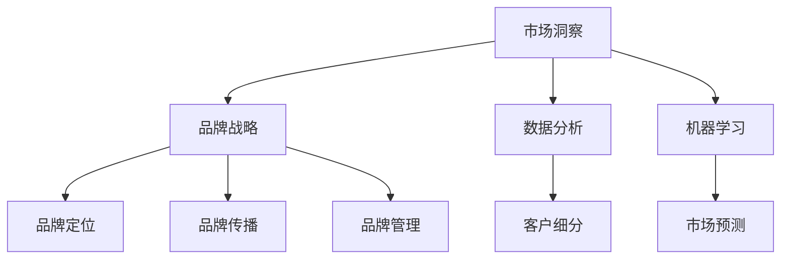

                 

# 洞察力与品牌战略：市场洞察的艺术

> 关键词：市场洞察,品牌战略,数据分析,机器学习,客户细分,市场预测

## 1. 背景介绍

### 1.1 问题由来
在当今数字化时代，品牌竞争日益激烈，企业需要不断创新以满足消费者需求，同时确保业务稳健发展。品牌战略是企业成功的关键，而洞察力则是品牌战略制定的基础。

市场洞察指的是企业通过收集和分析市场数据，理解消费者的需求、偏好和行为，进而形成战略决策的过程。市场洞察不仅能够帮助企业把握市场趋势，还能精准定位目标客户，制定有效的品牌战略。然而，传统市场洞察方法往往依赖人工分析和定性研究，数据处理效率低，分析结果难以量化和自动化，这使得企业难以应对快速变化的消费市场。

### 1.2 问题核心关键点
通过结合大数据分析和机器学习，市场洞察能够实现自动化和智能化，提升数据处理和分析效率。自动化市场洞察不仅能提供量化的分析结果，还能快速响应市场变化，为品牌战略制定提供坚实的数据支撑。

未来市场洞察的发展方向包括：
- 提升数据分析效率，降低成本
- 增强洞察的深度和广度，提供多维度分析
- 融合多数据源，构建统一的数据平台
- 引入人工智能算法，提升分析精度和灵活性
- 结合定性和定量分析，实现全面的市场理解

## 2. 核心概念与联系

### 2.1 核心概念概述

为更好地理解市场洞察的自动化方法，本节将介绍几个关键概念：

- 市场洞察(Market Insights)：企业通过数据分析、调研和竞争情报等手段，获取并理解市场信息的过程。市场洞察是品牌战略制定的基础，帮助企业把握市场动态和消费者需求。

- 品牌战略(Brand Strategy)：企业制定并实施的，旨在提升品牌价值、增加市场份额和增强消费者忠诚度的长期战略。品牌战略包括品牌定位、品牌传播、品牌管理等多个方面。

- 数据分析(Analysis)：从收集到的数据中提取有用信息，进行统计、挖掘和可视化，以支持决策过程。数据分析是市场洞察的关键技术支撑。

- 机器学习(Machine Learning)：通过数据驱动的模型训练，使计算机具备自主学习和优化能力，从而提升数据分析的精度和效率。机器学习广泛应用于市场洞察中，提供量化和自动化的分析工具。

- 客户细分(Customer Segmentation)：根据消费者的需求、行为和特征，将市场划分为不同客户群体，有助于制定有针对性的品牌战略。

- 市场预测(Market Forecasting)：基于历史数据和市场趋势，预测未来市场变化，帮助企业提前布局，抓住市场机会。

这些概念之间的逻辑关系可以通过以下Mermaid流程图来展示：



这个流程图展示了市场洞察与品牌战略之间的逻辑关系：

1. 市场洞察通过数据分析和机器学习获取信息。
2. 客户细分和市场预测基于洞察结果，对市场进行划分和预测。
3. 品牌战略的各个方面，如定位、传播和管理，都基于市场洞察和细分结果。

## 3. 核心算法原理 & 具体操作步骤
### 3.1 算法原理概述

市场洞察的自动化主要通过以下几个关键步骤实现：

1. 数据收集：从各种渠道收集市场数据，包括社交媒体、销售记录、客户反馈等。
2. 数据清洗：清洗和预处理原始数据，去除噪声和冗余信息，确保数据质量。
3. 数据分析：利用统计分析、文本挖掘、机器学习等技术，从数据中提取有价值的信息和模式。
4. 客户细分：根据分析结果将市场划分为不同的客户群体，以便制定针对性策略。
5. 市场预测：使用历史数据和模型预测未来市场趋势和变化。
6. 报告生成：将分析结果可视化，生成报告，支持决策。

### 3.2 算法步骤详解

以下是自动化市场洞察的详细步骤：

**Step 1: 数据收集与预处理**
- 确定数据来源，包括社交媒体、电商交易记录、用户反馈等。
- 使用API和数据爬虫工具，自动化收集数据。
- 清洗数据，去除重复、缺失和噪声值，保证数据质量。

**Step 2: 数据分析与模型训练**
- 选择适合的机器学习算法，如分类、聚类、回归等。
- 使用历史数据进行模型训练，调整超参数以获得最佳性能。
- 使用交叉验证等技术评估模型效果，避免过拟合。

**Step 3: 客户细分与市场预测**
- 根据分析结果，使用K-means聚类、层次聚类等算法进行客户细分。
- 利用时间序列分析、回归分析等技术，进行市场预测。

**Step 4: 报告生成与战略制定**
- 将分析结果和模型预测可视化，生成报告。
- 结合定性分析，形成品牌战略方案。
- 持续监测市场变化，动态调整战略。

### 3.3 算法优缺点

自动化市场洞察方法具有以下优点：
1. 提高数据处理效率，降低人力成本。
2. 提供量化的分析结果，增强决策依据。
3. 实时响应市场变化，保持品牌竞争力。
4. 多数据源融合，构建统一分析平台。
5. 结合机器学习，提升分析精度和灵活性。

同时，该方法也存在一些局限性：
1. 数据质量和来源多样性可能会影响分析结果。
2. 对数据处理和算法选择的要求较高。
3. 需要较高水平的团队和资源支持。
4. 自动化过程难以处理复杂的情感和主观判断。
5. 分析结果需要人工解读和调整，才能用于实际决策。

尽管存在这些局限性，但整体而言，自动化市场洞察大大提升了数据处理和分析效率，为品牌战略制定提供了坚实的数据支撑。

### 3.4 算法应用领域

自动化市场洞察广泛应用于各个行业，以下是几个典型应用领域：

- **零售业**：通过分析销售数据、消费者行为和社交媒体反馈，优化库存管理，提升客户体验，制定精准的市场营销策略。
- **金融业**：利用客户交易数据、市场趋势和新闻分析，进行风险评估，制定投资策略，优化客户关系管理。
- **制造业**：通过分析供应链数据、市场需求和竞争情报，优化生产计划，提高供应链效率，提升产品竞争力。
- **医疗健康**：结合患者数据、医疗记录和市场研究，制定个性化治疗方案，优化营销策略，提升品牌声誉。
- **旅游业**：利用旅游趋势、客户评价和地理数据，预测旅游需求，优化旅游产品，提升客户满意度。

自动化市场洞察在这些领域中得到了广泛应用，帮助企业更有效地把握市场机会，提升品牌价值。

## 4. 数学模型和公式 & 详细讲解 & 举例说明

### 4.1 数学模型构建

市场洞察的自动化通常涉及以下数学模型：

1. **客户细分**：
   - K-means聚类算法：
     - 输入：客户特征数据 $X \in \mathbb{R}^{n\times d}$，其中 $n$ 为样本数量，$d$ 为特征维度。
     - 输出：客户分组结果 $C$，每个分组的均值 $\mu$ 和协方差矩阵 $\Sigma$。
   - 公式：
     - 初始化 $K$ 个均值点 $\mu_1, \mu_2, ..., \mu_K$。
     - 对于每个样本 $x_i$，计算到每个均值点的距离 $d(x_i, \mu_k)$。
     - 将样本分配到最近的均值点分组，更新均值和协方差。
     - 迭代上述过程，直至收敛。

2. **市场预测**：
   - ARIMA时间序列模型：
     - 输入：历史市场数据 $Y_t \in \mathbb{R}^{T}$，其中 $T$ 为时间步长。
     - 输出：市场趋势 $\hat{Y}_{t+1}$。
   - 公式：
     - 自回归项 $AR(p)$：$\phi_1 Y_{t-1} + \phi_2 Y_{t-2} + ... + \phi_p Y_{t-p}$。
     - 差分项 $I(d)$：$\Delta^d Y_t = Y_t - Y_{t-1}$。
     - 移动平均项 $MA(q)$：$\theta_1 \epsilon_{t-1} + \theta_2 \epsilon_{t-2} + ... + \theta_q \epsilon_{t-q}$。
     - 时间序列 $\hat{Y}_{t+1} = \phi_1 \hat{Y}_t + \epsilon_t + \theta_1 \epsilon_{t-1} + ... + \theta_q \epsilon_{t-q}$。

### 4.2 公式推导过程

以K-means聚类算法为例，介绍其基本原理和推导过程：

K-means算法基于最小化样本到质心的距离平方和，推导过程如下：

1. **初始化**：随机选择 $K$ 个初始均值点 $\mu_1, \mu_2, ..., \mu_K$。
2. **分配**：对于每个样本 $x_i$，计算到每个均值点的距离 $d(x_i, \mu_k)$。
3. **更新**：将样本 $x_i$ 分配到最近的均值点分组，更新均值和协方差。
4. **迭代**：重复2和3，直至均值点不再变化。

其数学表达式为：
$$
\begin{aligned}
& \min_{\mu_1, \mu_2, ..., \mu_K} \sum_{i=1}^n \sum_{k=1}^K ||x_i - \mu_k||^2 \\
& \mu_k = \frac{1}{|C_k|} \sum_{i \in C_k} x_i, \quad C_k = \{x_i | x_i \in X, x_i \in C_k\}
\end{aligned}
$$

### 4.3 案例分析与讲解

**案例一：客户细分**

某电商平台通过分析用户购买数据，对用户进行细分。步骤如下：
1. 收集用户购买记录 $X = \{(x_1, y_1), (x_2, y_2), ..., (x_n, y_n)\}$，其中 $x_i$ 为特征向量，$y_i$ 为购买行为标签。
2. 使用K-means算法对特征向量进行聚类，得到客户分组 $C$。
3. 分析每个分组的特征和购买行为，制定针对性营销策略。

**案例二：市场预测**

某银行利用历史贷款数据 $Y_t = \{y_1, y_2, ..., y_{T-1}\}$ 进行市场预测，步骤如下：
1. 收集历史贷款数据，并添加时间项 $t = 1, 2, ..., T$。
2. 使用ARIMA模型对数据进行拟合，得到时间序列 $\hat{Y}_t$。
3. 分析预测结果，制定贷款投放策略。

## 5. 项目实践：代码实例和详细解释说明

### 5.1 开发环境搭建

进行市场洞察的自动化实践，需要以下环境配置：

1. 安装Python：从官网下载并安装Python，版本为3.6或以上。
2. 安装Anaconda：从官网下载并安装Anaconda，用于创建独立的Python环境。
3. 创建并激活虚拟环境：
```bash
conda create -n market_insights python=3.7 
conda activate market_insights
```
4. 安装相关库：
```bash
pip install pandas numpy scikit-learn matplotlib seaborn
```

完成上述步骤后，即可在`market_insights`环境中开始市场洞察的实践。

### 5.2 源代码详细实现

以下是一个简单的客户分群的代码实现，包括数据处理、模型训练和可视化：

```python
import pandas as pd
import numpy as np
from sklearn.cluster import KMeans
import matplotlib.pyplot as plt

# 加载数据
df = pd.read_csv('customer_data.csv')

# 数据预处理
# 假设特征为 ['age', 'income', 'spending']，购买行为为 ['1', '0']
# 将标签转换为数值形式
df['purchase'] = df['purchase'].map({'1': 1, '0': 0})

# 特征选择
X = df[['age', 'income', 'spending']]

# 计算K-means模型
kmeans = KMeans(n_clusters=3, random_state=42)
kmeans.fit(X)

# 可视化
colors = ['red', 'green', 'blue']
labels = kmeans.labels_
plt.scatter(X['age'], X['income'], c=labels, cmap=colors)
plt.xlabel('Age')
plt.ylabel('Income')
plt.show()
```

### 5.3 代码解读与分析

代码实现中，我们首先加载数据，并对数据进行预处理。通过特征选择，得到客户年龄、收入和消费特征。使用K-means算法对特征进行聚类，并将结果可视化。

具体分析如下：
- `pandas`：用于数据处理和分析。
- `numpy`：用于数值计算和矩阵操作。
- `scikit-learn`：提供K-means聚类算法，用于客户细分。
- `matplotlib`：用于绘制可视化图形。

在实际应用中，我们通常需要对数据进行更多处理，如数据清洗、特征工程等。同时，需要结合具体的业务场景选择合适的算法和参数设置。

## 6. 实际应用场景

### 6.1 零售业

**场景一：客户细分与个性化推荐**

某零售公司通过分析历史购买数据和社交媒体反馈，使用K-means聚类算法对客户进行细分。通过分析每个客户群体的特征和购买行为，制定针对性推荐策略。例如，针对高收入客户群体，推荐高端品牌和定制服务；针对年轻消费者，推荐时尚潮品和新品。

**场景二：库存管理与需求预测**

某电商平台利用历史销售数据和市场趋势，使用ARIMA模型预测未来销售需求。通过分析预测结果，优化库存管理和供应链安排，确保热门商品有足够库存，避免缺货和过剩库存。

### 6.2 金融业

**场景一：风险评估与信贷审批**

某银行利用客户交易数据和市场趋势，使用随机森林算法进行风险评估。通过分析模型结果，评估客户的信用风险，制定精准的信贷审批策略。同时，利用机器学习算法预测客户违约概率，优化贷款定价和逾期处理。

**场景二：客户关系管理与营销**

某金融机构利用客户交易数据和市场趋势，使用聚类算法进行客户细分。通过分析不同客户群体的需求和行为，制定有针对性的营销策略，提升客户满意度和忠诚度。

### 6.3 制造业

**场景一：供应链优化与需求预测**

某制造公司利用历史销售数据和市场趋势，使用时间序列分析算法预测市场需求。通过分析预测结果，优化生产计划和供应链安排，确保及时供货，避免生产过剩和库存积压。

**场景二：设备维护与故障预测**

某汽车公司利用设备维护记录和市场趋势，使用机器学习算法预测设备故障。通过分析预测结果，提前进行设备维护和更换，减少故障率，提升设备利用率。

### 6.4 未来应用展望

未来市场洞察技术将进一步向自动化和智能化发展，主要体现在以下几个方面：

1. **多数据源融合**：结合多种数据源，如社交媒体、新闻、市场调研等，构建统一的数据平台，提供多维度的分析支持。

2. **深度学习应用**：引入深度学习算法，如CNN、RNN等，提升数据分析的深度和精度。

3. **实时数据处理**：采用流式计算和实时数据处理技术，及时响应市场变化，提供实时的洞察报告。

4. **个性化分析**：结合客户行为和社交网络数据，提供个性化的市场洞察报告，帮助企业制定精准的营销策略。

5. **可视化与交互**：通过可视化工具和交互式界面，提升市场洞察报告的易用性和可读性。

6. **跨领域应用**：将市场洞察技术与更多行业场景结合，如医疗健康、旅游业等，提供更加广泛的分析支持。

市场洞察技术的不断演进，将为企业提供更全面、准确的市场洞察，提升品牌竞争力，实现可持续发展。

## 7. 工具和资源推荐

### 7.1 学习资源推荐

为了帮助开发者系统掌握市场洞察的自动化方法，这里推荐一些优质的学习资源：

1. 《市场洞察：从数据到战略》：介绍市场洞察的基础概念和常用技术，结合实际案例讲解市场分析方法。
2. 《机器学习实战》：通过具体案例，展示机器学习在市场分析中的应用，包括分类、聚类、回归等算法。
3. 《Python数据科学手册》：全面介绍Python在数据处理和分析中的应用，包括数据清洗、特征工程、模型评估等。
4. 《深入理解TensorFlow》：深入解析TensorFlow的使用方法和最佳实践，结合市场洞察项目讲解深度学习模型。

通过对这些资源的学习实践，相信你一定能够快速掌握市场洞察的自动化技术，并用于解决实际的业务问题。

### 7.2 开发工具推荐

高效的开发离不开优秀的工具支持。以下是几款用于市场洞察自动化开发的常用工具：

1. Python：广泛应用的数据科学语言，具有丰富的第三方库和框架支持，适合数据分析和建模。
2. R：统计分析和可视化工具，适合数据处理和探索性分析。
3. SQL：关系型数据库语言，适合数据管理和查询。
4. Tableau：数据可视化工具，适合创建交互式报告和仪表盘。
5. TensorBoard：TensorFlow的可视化工具，适合模型训练和调优。

合理利用这些工具，可以显著提升市场洞察自动化任务的开发效率，加快创新迭代的步伐。

### 7.3 相关论文推荐

市场洞察技术的快速发展离不开学界的持续研究。以下是几篇奠基性的相关论文，推荐阅读：

1. "Customer Segmentation with K-means Clustering"（K-means聚类算法）：介绍K-means聚类算法的原理和应用，提供了市场细分的基础方法。
2. "Time Series Forecasting Using ARIMA"（ARIMA时间序列模型）：介绍ARIMA模型的基本原理和实现方法，展示了市场预测的常见应用。
3. "Machine Learning for Business Intelligence"：讨论机器学习在商业智能中的应用，展示了市场洞察的最新研究进展。

这些论文代表了大语言模型微调技术的发展脉络。通过学习这些前沿成果，可以帮助研究者把握学科前进方向，激发更多的创新灵感。

## 8. 总结：未来发展趋势与挑战

### 8.1 总结

本文对市场洞察的自动化方法进行了全面系统的介绍。首先阐述了市场洞察和品牌战略的核心概念，明确了市场洞察在品牌战略制定中的基础作用。其次，从原理到实践，详细讲解了市场洞察的自动化流程，包括数据收集、预处理、分析和报告生成等关键步骤。最后，通过案例分析，展示了市场洞察在多个行业中的应用，展望了未来发展方向。

通过本文的系统梳理，可以看到，市场洞察的自动化技术正在逐步成熟，为品牌战略制定提供了坚实的数据支撑。未来，伴随技术的不断演进，市场洞察技术将更加智能化和高效化，进一步提升企业的市场响应能力和竞争优势。

### 8.2 未来发展趋势

展望未来，市场洞察技术将呈现以下几个发展趋势：

1. **自动化程度提升**：随着自动化技术的发展，市场洞察的自动化水平将进一步提升，能够提供更快速、更准确的数据分析结果。

2. **深度学习应用普及**：深度学习技术将广泛应用于市场洞察中，提升分析的深度和精度，提供更加全面的市场理解。

3. **多数据源融合**：结合多种数据源，构建统一的数据平台，提供多维度的分析支持，提升数据处理效率。

4. **实时数据处理**：采用流式计算和实时数据处理技术，及时响应市场变化，提供实时的洞察报告。

5. **跨领域应用拓展**：将市场洞察技术与更多行业场景结合，如医疗健康、旅游业等，提供更加广泛的分析支持。

这些趋势凸显了市场洞察技术的广阔前景。这些方向的探索发展，必将进一步提升市场洞察的能力和应用范围，为品牌战略制定提供更加坚实的数据基础。

### 8.3 面临的挑战

尽管市场洞察自动化技术已经取得了不小的进展，但在迈向更加智能化、普适化应用的过程中，它仍面临着诸多挑战：

1. **数据质量和多样性**：不同数据源的数据质量和格式差异较大，难以进行有效的融合和分析。

2. **算法复杂度**：深度学习和复杂算法需要大量的计算资源和时间，难以实时处理大规模数据。

3. **模型可解释性**：复杂的机器学习模型难以解释其决策过程，对模型的理解和调整带来挑战。

4. **数据隐私和安全**：大规模数据收集和处理带来了数据隐私和安全风险，需要采取严格的保护措施。

5. **业务结合度**：市场洞察技术需要与业务场景紧密结合，才能真正发挥其作用，否则容易陷入技术空转。

6. **人才短缺**：高质量的市场洞察分析师和数据科学家供给不足，难以支持大规模的市场洞察项目。

这些挑战需要学术界和工业界共同努力，不断优化技术、改进工具和强化人才队伍，才能将市场洞察技术推向新的高度。

### 8.4 研究展望

面对市场洞察自动化所面临的种种挑战，未来的研究需要在以下几个方面寻求新的突破：

1. **数据质量提升**：开发更高效的数据清洗和预处理技术，提高数据质量和一致性。

2. **算法优化**：改进和优化现有算法，提升模型效率和可解释性，支持实时处理大规模数据。

3. **多数据源融合**：开发统一的数据平台，支持多数据源的融合和分析，提供全面的市场洞察。

4. **跨领域应用**：将市场洞察技术与其他技术结合，如知识图谱、自然语言处理等，提供更全面的分析支持。

5. **人才队伍建设**：加强数据科学和市场分析人才的培养，提升整体市场洞察能力。

这些研究方向将推动市场洞察技术向更加智能化、普适化的方向发展，为品牌战略制定提供更加坚实的技术基础。

## 9. 附录：常见问题与解答

**Q1：如何进行市场数据收集和预处理？**

A: 市场数据收集和预处理是市场洞察的基础，以下是常见步骤：
1. 确定数据来源，包括社交媒体、销售记录、市场调研等。
2. 使用API和数据爬虫工具，自动化收集数据。
3. 清洗数据，去除重复、缺失和噪声值，确保数据质量。

**Q2：如何选择和训练合适的模型？**

A: 选择和训练模型是市场洞察的关键，以下是常见步骤：
1. 根据数据特征和任务需求，选择合适的机器学习算法，如分类、聚类、回归等。
2. 使用历史数据进行模型训练，调整超参数以获得最佳性能。
3. 使用交叉验证等技术评估模型效果，避免过拟合。

**Q3：如何可视化市场洞察结果？**

A: 市场洞察结果的可视化是重要的一环，以下是常见方法：
1. 使用数据可视化工具，如Matplotlib、Seaborn、Tableau等，生成图表和报告。
2. 结合业务场景，设计直观易懂的可视化方案，帮助用户理解分析结果。
3. 创建交互式仪表盘，支持用户自由探索和调整参数。

**Q4：如何结合市场洞察结果，制定品牌战略？**

A: 结合市场洞察结果，制定品牌战略的步骤如下：
1. 分析市场洞察结果，提取关键信息和趋势。
2. 结合业务需求，制定具体的品牌战略方案，如市场定位、营销策略、产品开发等。
3. 持续监测市场变化，动态调整品牌战略，确保其适应性和有效性。

通过这些常见问题的解答，相信你能够更好地掌握市场洞察的自动化技术，并应用于实际的业务场景中。

---

作者：禅与计算机程序设计艺术 / Zen and the Art of Computer Programming

