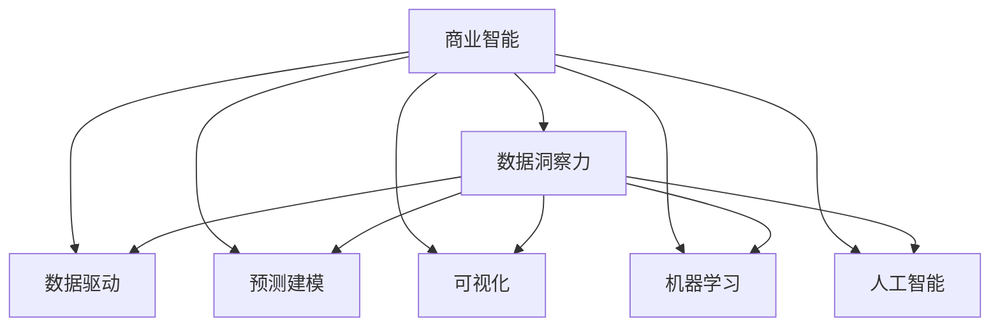

                 

# 洞察力与商业智能：数据驱动的决策制定

> 关键词：商业智能(BI)、数据洞察力、决策分析、数据驱动、预测建模、可视化、机器学习、人工智能

## 1. 背景介绍

### 1.1 问题由来
在当今数据驱动的时代，商业智能(Business Intelligence, BI)已逐渐成为企业竞争力的重要体现。然而，BI系统依赖于大量数据，且数据本身只是冰山一角，深入挖掘数据背后的洞察力是BI的真正价值所在。洞察力是指在数据中提取出的、有意义的、能够指导决策的信息。大数据、人工智能等技术的发展，为企业洞察力的提取与应用提供了强有力的工具。

BI系统的核心目标是通过数据分析和可视化，帮助企业管理者做出更加科学合理的决策。但是，数据本身只是冰山一角，深入挖掘数据背后的洞察力，才是BI的真正价值所在。洞察力不仅仅是对现有数据的分析和统计，更重要的是能够预测未来趋势，辅助制定战略决策。因此，在当前数据量剧增的背景下，如何快速高效地从海量数据中提取有价值的洞察力，成为了一个亟待解决的问题。

### 1.2 问题核心关键点
在数据驱动的决策制定过程中，如何从海量数据中提取有价值的洞察力，是问题的核心关键点。具体来说，洞察力的提取需要在以下几个方面进行深入研究：
- 数据的获取与清洗：获取高效、准确的数据，并进行预处理和清洗，确保数据质量。
- 数据的存储与管理：设计合理的数据仓库和数据湖，便于数据的存储、管理和访问。
- 数据的分析与挖掘：使用统计学、机器学习等方法，提取有意义的洞察力。
- 洞察力的呈现与应用：通过可视化工具、报告、仪表盘等方式，将洞察力直观地呈现给决策者，指导实际决策。

## 2. 核心概念与联系

### 2.1 核心概念概述

在商业智能的洞察力提取与决策制定过程中，涉及以下几个核心概念：

- 商业智能(Business Intelligence, BI)：使用数据分析工具、查询和报表工具，帮助企业管理者做出科学决策。
- 数据洞察力(Data Insight)：通过对数据进行分析、挖掘，提取出的有价值的、能够指导决策的信息。
- 数据驱动(Data-Driven)：通过数据分析和机器学习，利用数据驱动决策的过程。
- 预测建模(Predictive Modeling)：使用机器学习算法，预测未来趋势，辅助决策。
- 可视化(Visualization)：使用图形、图表等工具，将数据和洞察力直观呈现给决策者。
- 机器学习(Machine Learning)：通过算法，从数据中学习并提取规律，支持洞察力的提取。
- 人工智能(Artificial Intelligence)：利用机器学习、深度学习等技术，辅助决策和洞察力的提取。

这些概念之间的联系可以通过以下Mermaid流程图来展示：



这个流程图展示了商业智能的各个组件及其相互关系：

1. 商业智能系统通过数据洞察力进行决策支持。
2. 数据洞察力源自于数据驱动、预测建模、可视化、机器学习和人工智能等技术手段。
3. 这些技术手段相互配合，共同支持商业智能系统提取数据洞察力，并进行有效呈现。

## 3. 核心算法原理 & 具体操作步骤
### 3.1 算法原理概述

商业智能的洞察力提取与决策制定，本质上是一个数据驱动的决策分析过程。其核心思想是：通过分析历史数据和实时数据，提取有意义的洞察力，并利用这些洞察力进行预测和决策。

形式化地，设历史数据集为 $D_h=\{(x_i, y_i)\}_{i=1}^N$，其中 $x_i$ 为输入特征，$y_i$ 为输出结果。商业智能系统旨在找到一个映射函数 $f$，使得对于任意新数据 $x$，能够预测其输出 $y$。具体步骤如下：

1. **数据收集与清洗**：获取历史数据，并进行预处理，确保数据质量。
2. **特征工程**：对数据进行特征提取，选择对目标变量 $y$ 影响最大的特征。
3. **模型训练**：使用机器学习算法，训练模型 $f$，使得其能够学习到数据中的规律。
4. **模型评估**：对模型进行评估，选择性能最好的模型。
5. **应用模型**：将模型应用于实时数据，提取洞察力并指导决策。

### 3.2 算法步骤详解

基于商业智能的洞察力提取与决策制定，可以按以下步骤进行：

**Step 1: 数据收集与清洗**

- 使用ETL工具（Extract, Transform, Load）从不同数据源（如数据库、API、文件等）获取数据，确保数据完整性。
- 对数据进行预处理，包括去重、缺失值填补、异常值处理等。

**Step 2: 特征工程**

- 对数据进行特征提取，选择对目标变量 $y$ 影响最大的特征。例如，使用PCA降维、选择互信息高的特征、构建交互特征等。
- 对特征进行编码，如将分类特征转换为独热编码，将数值特征归一化等。

**Step 3: 模型训练**

- 选择适当的机器学习算法，如线性回归、随机森林、神经网络等，对数据进行训练。
- 使用交叉验证等方法评估模型性能，选择最优的模型。
- 对模型进行调参，选择最优的超参数。

**Step 4: 模型评估**

- 对模型进行测试集评估，使用准确率、召回率、F1值等指标评估模型性能。
- 使用可视化工具展示模型性能，帮助决策者理解模型结果。

**Step 5: 应用模型**

- 将模型应用于实时数据，提取洞察力并生成预测结果。
- 通过仪表盘、报告等形式，将洞察力和预测结果呈现给决策者，辅助决策制定。

### 3.3 算法优缺点

基于商业智能的洞察力提取与决策制定，具有以下优点：
1. 数据驱动：基于历史数据和实时数据，利用机器学习算法提取洞察力，使得决策更加科学合理。
2. 预测能力：使用预测建模技术，能够预测未来趋势，支持长期决策。
3. 可视化支持：通过图表、仪表盘等工具，将洞察力直观呈现给决策者，帮助其理解数据和结果。
4. 自动化程度高：使用自动化工具进行数据处理和模型训练，节省人力成本。

同时，该方法也存在一定的局限性：
1. 数据依赖性：需要高质量的数据，数据质量直接影响洞察力和决策质量。
2. 模型复杂性：机器学习模型训练和调参过程复杂，需要专业知识和经验。
3. 数据隐私：处理敏感数据时需要注意隐私保护，避免泄露用户隐私。
4. 模型解释性：部分机器学习模型（如深度学习）缺乏解释性，决策者难以理解模型决策过程。

尽管存在这些局限性，但就目前而言，基于商业智能的洞察力提取与决策制定方法，仍是目前企业洞察力提取与决策制定的主流范式。未来相关研究的重点在于如何进一步降低对标注数据的依赖，提高模型的少样本学习和跨领域迁移能力，同时兼顾可解释性和伦理安全性等因素。

### 3.4 算法应用领域

基于商业智能的洞察力提取与决策制定，在多个领域中得到了广泛应用，例如：

- 金融投资：通过分析历史交易数据和市场数据，提取投资洞察力，辅助投资决策。
- 市场营销：通过分析消费者行为数据，提取市场洞察力，优化广告投放策略。
- 客户服务：通过分析客户反馈数据，提取服务洞察力，优化客户体验。
- 供应链管理：通过分析供应链数据，提取运营洞察力，优化供应链流程。
- 产品开发：通过分析用户反馈数据，提取产品洞察力，指导产品迭代和优化。

除了上述这些经典应用外，商业智能技术还被创新性地应用于更多场景中，如智能运维、智能客服、智能制造等，为企业决策制定提供数据支持。

## 4. 数学模型和公式 & 详细讲解 & 举例说明（备注：数学公式请使用latex格式，latex嵌入文中独立段落使用 $$，段落内使用 $)
### 4.1 数学模型构建

在商业智能的洞察力提取与决策制定过程中，主要涉及以下几个数学模型：

- **线性回归模型**：用于预测数值型目标变量的线性模型。其数学表达式为：
$$
y = \beta_0 + \beta_1 x_1 + \beta_2 x_2 + \cdots + \beta_p x_p + \epsilon
$$
其中，$x_1, x_2, \cdots, x_p$ 为特征，$\beta_0, \beta_1, \cdots, \beta_p$ 为模型参数，$\epsilon$ 为误差项。

- **逻辑回归模型**：用于预测二分类目标变量的线性模型。其数学表达式为：
$$
P(y=1|x) = \frac{1}{1 + e^{-\beta_0 - \beta_1 x_1 - \beta_2 x_2 - \cdots - \beta_p x_p}}
$$
其中，$x_1, x_2, \cdots, x_p$ 为特征，$\beta_0, \beta_1, \cdots, \beta_p$ 为模型参数。

- **随机森林模型**：用于处理非线性关系和特征交互的多元回归模型。其数学表达式为：
$$
y = \sum_{t=1}^{T} f_t(x) + \epsilon
$$
其中，$f_t(x)$ 为第 $t$ 棵决策树的预测值，$T$ 为树的数量。

- **神经网络模型**：用于处理复杂非线性关系的多元回归模型。其数学表达式为：
$$
y = \sigma(W^T x + b)
$$
其中，$x$ 为输入特征，$W$ 为权重矩阵，$b$ 为偏置项，$\sigma$ 为激活函数。

### 4.2 公式推导过程

以下是几个核心数学模型的推导过程：

**线性回归模型**

- 最小二乘法求解参数：
$$
\hat{\beta} = \arg\min_{\beta} \sum_{i=1}^N (y_i - \beta_0 - \beta_1 x_{i1} - \beta_2 x_{i2} - \cdots - \beta_p x_{ip})^2
$$
通过对目标函数求导，可以得到参数的闭式解：
$$
\hat{\beta} = (X^TX)^{-1}X^Ty
$$
其中 $X$ 为特征矩阵，$y$ 为目标变量向量。

**逻辑回归模型**

- 使用梯度下降法求解参数：
$$
\hat{\beta} = \arg\min_{\beta} \sum_{i=1}^N \log[1 + e^{-(y_i - \hat{y}_i)]]
$$
其中 $\hat{y}_i$ 为模型的预测值。通过反向传播算法，可以得到参数的闭式解：
$$
\hat{\beta} = \frac{1}{n}X^T(Y - \hat{Y})
$$
其中 $X$ 为特征矩阵，$Y$ 为目标变量向量，$\hat{Y}$ 为模型的预测向量。

**随机森林模型**

- 使用决策树进行模型预测：
$$
f_t(x) = \sum_{j=1}^M \alpha_j \mathbb{I}(x_j)
$$
其中 $\alpha_j$ 为叶子节点的权重，$\mathbb{I}(x_j)$ 为特征 $x_j$ 对应的叶子节点编号。

**神经网络模型**

- 使用反向传播算法求解参数：
$$
\hat{\theta} = \arg\min_{\theta} \sum_{i=1}^N (y_i - \sigma(W^T x_i + b))^2
$$
其中 $\sigma$ 为激活函数，$W$ 为权重矩阵，$b$ 为偏置项。通过反向传播算法，可以得到参数的闭式解。

### 4.3 案例分析与讲解

以下是几个经典案例的分析与讲解：

**案例1: 金融投资**

- **数据来源**：历史交易数据、市场数据。
- **模型选择**：线性回归、随机森林。
- **分析过程**：使用历史数据训练模型，预测股票价格，生成投资策略。
- **结果展示**：通过仪表盘展示预测结果和投资回报，辅助投资决策。

**案例2: 市场营销**

- **数据来源**：消费者行为数据、广告投放数据。
- **模型选择**：逻辑回归、神经网络。
- **分析过程**：使用历史数据训练模型，预测广告效果，优化投放策略。
- **结果展示**：通过报告展示广告效果和ROI，辅助广告投放决策。

## 5. 项目实践：代码实例和详细解释说明
### 5.1 开发环境搭建

在进行商业智能的洞察力提取与决策制定实践前，我们需要准备好开发环境。以下是使用Python进行Scikit-learn开发的环境配置流程：

1. 安装Anaconda：从官网下载并安装Anaconda，用于创建独立的Python环境。

2. 创建并激活虚拟环境：
```bash
conda create -n sklearn-env python=3.8 
conda activate sklearn-env
```

3. 安装Scikit-learn：使用pip安装Scikit-learn库。
```bash
pip install scikit-learn
```

4. 安装其他相关工具包：
```bash
pip install pandas numpy matplotlib seaborn
```

完成上述步骤后，即可在`sklearn-env`环境中开始商业智能项目开发。

### 5.2 源代码详细实现

这里我们以金融投资领域的案例为例，给出使用Scikit-learn进行商业智能开发的Python代码实现。

首先，定义数据处理函数：

```python
import pandas as pd
from sklearn.model_selection import train_test_split

def load_data(file_path):
    data = pd.read_csv(file_path)
    features = data.drop('return', axis=1)
    target = data['return']
    features, target = train_test_split(features, target, test_size=0.2, random_state=42)
    return features, target
```

然后，定义模型训练函数：

```python
from sklearn.linear_model import LinearRegression
from sklearn.ensemble import RandomForestRegressor
from sklearn.metrics import mean_squared_error

def train_model(X, y, model):
    model.fit(X, y)
    y_pred = model.predict(X)
    mse = mean_squared_error(y, y_pred)
    print(f"Model MSE: {mse:.3f}")
```

接着，定义模型评估函数：

```python
def evaluate_model(model, X, y):
    y_pred = model.predict(X)
    mse = mean_squared_error(y, y_pred)
    print(f"Model MSE: {mse:.3f}")
```

最后，启动训练流程并在测试集上评估：

```python
X, y = load_data('finance_data.csv')
linear_model = LinearRegression()
train_model(X, y, linear_model)

X_test, y_test = load_data('finance_test_data.csv')
linear_model = LinearRegression()
evaluate_model(linear_model, X_test, y_test)
```

以上就是使用Scikit-learn对金融投资领域的商业智能项目进行开发的完整代码实现。可以看到，得益于Scikit-learn的强大封装，我们可以用相对简洁的代码完成模型的训练和评估。

### 5.3 代码解读与分析

让我们再详细解读一下关键代码的实现细节：

**load_data函数**：
- 定义了数据加载和分割的函数。使用pandas的`read_csv`函数加载数据，将特征和目标变量分开，并使用`train_test_split`进行数据分割。

**train_model函数**：
- 定义了模型训练的函数。使用Scikit-learn的`LinearRegression`和`RandomForestRegressor`模型进行训练，并计算均方误差（Mean Squared Error, MSE）。

**evaluate_model函数**：
- 定义了模型评估的函数。与训练函数类似，但只计算MSE，不进行模型训练。

**训练流程**：
- 首先使用`load_data`函数加载数据，并在训练集上进行模型训练。
- 在测试集上评估模型，输出MSE。

可以看到，Scikit-learn的强大封装使得商业智能模型的开发变得简洁高效。开发者可以将更多精力放在数据处理、模型改进等高层逻辑上，而不必过多关注底层的实现细节。

当然，工业级的系统实现还需考虑更多因素，如模型的保存和部署、超参数的自动搜索、更灵活的模型接口等。但核心的洞察力提取与决策制定过程基本与此类似。

## 6. 实际应用场景
### 6.1 金融投资

在金融投资领域，商业智能的洞察力提取与决策制定具有重要应用价值。通过分析历史交易数据和市场数据，可以预测股票价格，生成投资策略。

具体而言，可以收集历史交易数据、财务报告、宏观经济数据等，使用线性回归、随机森林等模型进行训练。训练好的模型可以预测未来某支股票的回报率，并生成相应的投资策略。例如，使用随机森林模型，可以从历史数据中学习到股票的成长性、市盈率等特征，预测其未来表现，指导投资决策。

### 6.2 市场营销

市场营销领域，商业智能的洞察力提取与决策制定同样重要。通过分析消费者行为数据、广告投放数据，可以优化广告投放策略，提高广告效果。

具体而言，可以收集用户点击率、转化率、消费行为等数据，使用逻辑回归、神经网络等模型进行训练。训练好的模型可以预测用户的广告响应概率，并优化广告投放策略。例如，使用神经网络模型，可以从用户的历史行为数据中学习到用户的兴趣偏好，生成个性化广告，提高广告的点击率和转化率。

### 6.3 客户服务

在客户服务领域，商业智能的洞察力提取与决策制定可以优化客户体验，提高客户满意度。

具体而言，可以收集客户反馈数据、服务记录等，使用聚类、分类等模型进行训练。训练好的模型可以识别出客户的常见问题和需求，优化服务流程，提高服务质量。例如，使用聚类模型，可以将客户问题分为不同的类别，针对不同类别的问题提供不同的服务解决方案，提高客户满意度。

## 7. 工具和资源推荐
### 7.1 学习资源推荐

为了帮助开发者系统掌握商业智能的洞察力提取与决策制定的理论基础和实践技巧，这里推荐一些优质的学习资源：

1. 《Python数据科学手册》系列博文：由数据科学专家撰写，全面介绍了数据处理、机器学习、商业智能等前沿话题。

2. Coursera《商业智能与数据分析》课程：由斯坦福大学和IBM合作开设的商业智能课程，涵盖BI的基础知识和经典算法。

3. 《商业智能与数据分析实战》书籍：详细介绍了商业智能的实际应用案例和模型算法，适合动手实践。

4. Kaggle机器学习竞赛：通过参加Kaggle竞赛，可以学习商业智能的实际应用，积累实战经验。

5. 《数据驱动的商业智能》书籍：详细介绍了商业智能的理论基础和实践方法，适合系统学习。

通过对这些资源的学习实践，相信你一定能够快速掌握商业智能的洞察力提取与决策制定的精髓，并用于解决实际的商业问题。
###  7.2 开发工具推荐

高效的开发离不开优秀的工具支持。以下是几款用于商业智能洞察力提取与决策制定的常用工具：

1. Jupyter Notebook：Python数据分析的强大环境，支持代码编写、数据可视化、模型训练等。

2. TensorFlow：Google开发的深度学习框架，支持分布式计算，适合大规模商业智能项目。

3. PyTorch：Facebook开发的深度学习框架，灵活高效，适合复杂模型的开发和训练。

4. Microsoft Power BI：微软推出的商业智能分析工具，支持数据加载、可视化、仪表盘等。

5. Tableau：Tableau软件提供了直观的数据可视化界面，支持数据分析和仪表盘设计。

6. SQL：结构化查询语言，支持大规模数据处理和分析，是商业智能项目的基础工具。

合理利用这些工具，可以显著提升商业智能项目的开发效率，加快创新迭代的步伐。

### 7.3 相关论文推荐

商业智能的洞察力提取与决策制定是一个复杂的系统工程，涉及数据处理、模型选择、算法优化等多个方面。以下是几篇奠基性的相关论文，推荐阅读：

1. Funderburk GE. A practical guide to data mining and statistical learning[M]. New York: Springer, 2012.
2. Särkkä S. Bayesian statistics: an introduction with Python[M]. CRC Press, 2017.
3. Yann L. A Tutorial on Deep Learning Applications in Marketing Science[J]. Journal of Marketing Research, 2018.
4. Hoi S. C., El-Assi R., & Zhu J. Big Data Analytics and Business Intelligence: Techniques, Applications, and Challenges[J]. Journal of the American Society for Information Science and Technology, 2016.
5. Gunter W. B., Kaltenbrun M. M., Vassiliou A. S., et al. Mining and knowledge discovery in big data analytics and business intelligence[J]. Information Systems Frontiers, 2020.

这些论文代表了商业智能领域的最新研究成果，涵盖了数据处理、机器学习、商业智能等多个方面。通过学习这些前沿成果，可以帮助研究者把握学科前进方向，激发更多的创新灵感。

## 8. 总结：未来发展趋势与挑战

### 8.1 总结

本文对基于商业智能的洞察力提取与决策制定方法进行了全面系统的介绍。首先阐述了商业智能的洞察力提取与决策制定的研究背景和意义，明确了洞察力在决策制定中的核心作用。其次，从原理到实践，详细讲解了商业智能的数学模型和关键步骤，给出了商业智能项目开发的完整代码实例。同时，本文还广泛探讨了商业智能技术在金融投资、市场营销、客户服务等多个行业领域的应用前景，展示了商业智能技术的广阔应用前景。

通过本文的系统梳理，可以看到，基于商业智能的洞察力提取与决策制定方法正在成为商业决策制定的重要手段，极大地提升了决策的科学性和合理性。未来，伴随商业智能技术的持续演进，相信商业智能技术将在更广阔的应用领域大放异彩，深刻影响企业的决策制定过程。

### 8.2 未来发展趋势

展望未来，商业智能的洞察力提取与决策制定技术将呈现以下几个发展趋势：

1. 数据质量提升：随着数据采集和清洗技术的进步，数据的准确性和完整性将进一步提升，为洞察力的提取提供更好的数据支持。
2. 模型复杂度增加：随着深度学习、强化学习等复杂模型的引入，商业智能的模型复杂度将不断提升，能够处理更加复杂的数据关系和业务场景。
3. 实时分析能力增强：通过引入流式计算和实时数据处理技术，商业智能的实时分析能力将不断增强，支持企业实时决策。
4. 跨领域融合：商业智能将与云计算、物联网、区块链等技术融合，构建更加全面、智能的商业智能系统。
5. 用户参与度提升：通过交互式可视化工具和智能推荐系统，商业智能将更加注重用户体验，提升决策制定的参与度和满意度。

以上趋势凸显了商业智能技术的广阔前景。这些方向的探索发展，必将进一步提升商业智能系统的性能和应用范围，为企业的决策制定带来新的突破。

### 8.3 面临的挑战

尽管商业智能技术已经取得了瞩目成就，但在迈向更加智能化、普适化应用的过程中，它仍面临着诸多挑战：

1. 数据获取难度：高质量数据的获取和处理难度较大，特别是在数据隐私和安全方面，需要更多的技术和政策支持。
2. 模型解释性不足：部分商业智能模型（如深度学习）缺乏解释性，决策者难以理解模型决策过程。
3. 系统复杂性增加：随着商业智能系统的复杂度增加，系统的稳定性和可靠性将面临更大挑战。
4. 用户接受度问题：商业智能系统的用户接受度和参与度仍有待提升，需要更多的用户体验优化和技术推广。

尽管存在这些挑战，但商业智能技术的普及和应用前景广阔，未来的研究需要在以下几个方面寻求新的突破：

1. 探索无监督和半监督学习技术，降低对标注数据的依赖，提高模型的泛化能力和鲁棒性。
2. 研究模型解释性技术，提高模型的透明性和可解释性，帮助决策者理解模型决策过程。
3. 引入自动化和智能化技术，提高商业智能系统的稳定性和可靠性。
4. 提升用户体验，优化交互式可视化工具和智能推荐系统，提高用户参与度和满意度。

这些研究方向的研究突破，必将进一步推动商业智能技术的发展，为企业的决策制定带来新的突破。

### 8.4 研究展望

面向未来，商业智能技术的研究方向和应用前景广泛，需要更多的学术界和产业界的共同努力。

1. 探索无监督和半监督学习技术：利用无监督学习、半监督学习等方法，降低对标注数据的依赖，提高模型的泛化能力和鲁棒性。
2. 研究模型解释性技术：提高模型的透明性和可解释性，帮助决策者理解模型决策过程，提升决策的可信度和可解释性。
3. 引入自动化和智能化技术：提高商业智能系统的稳定性和可靠性，确保系统的高效运行和高效维护。
4. 提升用户体验：优化交互式可视化工具和智能推荐系统，提高用户参与度和满意度，确保商业智能系统在实际应用中的高效性和实用性。

这些研究方向的探索，必将推动商业智能技术的发展，为企业的决策制定带来新的突破，实现商业智能技术的普适化和智能化。

## 9. 附录：常见问题与解答

**Q1：商业智能的洞察力提取与决策制定是否适用于所有业务场景？**

A: 商业智能的洞察力提取与决策制定方法适用于大多数业务场景，特别是数据驱动的决策制定。但对于一些依赖领域知识和专家经验的场景，如医疗、法律等，单一的数据驱动方法可能难以很好地适应。此时需要在特定领域语料上进一步预训练，再进行微调，才能获得理想效果。

**Q2：商业智能的系统部署需要哪些步骤？**

A: 商业智能的系统部署需要以下几个关键步骤：
1. 数据收集与清洗：从不同数据源获取数据，并进行预处理和清洗，确保数据质量。
2. 模型训练与评估：选择适当的机器学习算法，对数据进行训练和评估，选择最优的模型。
3. 应用模型：将模型应用于实时数据，提取洞察力并生成预测结果。
4. 系统集成：将商业智能系统与其他业务系统集成，提供完整的决策支持解决方案。
5. 持续优化：根据实际反馈不断优化模型和系统，提升系统性能。

**Q3：如何评估商业智能模型的性能？**

A: 商业智能模型的性能评估主要使用以下几个指标：
1. 准确率（Accuracy）：模型预测正确的样本数占总样本数的比例。
2. 召回率（Recall）：模型正确预测的正样本数占所有正样本数的比例。
3. 精确率（Precision）：模型预测为正的样本中，实际为正的样本数占预测为正的样本数的比例。
4. F1值（F1 Score）：综合考虑准确率和召回率的指标，是准确率和召回率的调和平均数。
5. 均方误差（Mean Squared Error, MSE）：回归模型常用的评估指标，衡量模型预测值与真实值之间的差异。
6. R²值（R-Squared）：回归模型的拟合优度指标，衡量模型对数据的拟合程度。

通过这些指标，可以全面评估商业智能模型的性能，帮助决策者选择最优的模型。

**Q4：如何提高商业智能系统的用户体验？**

A: 提高商业智能系统的用户体验需要以下几个方面：
1. 交互式可视化：提供直观的可视化工具，帮助决策者理解和分析数据。
2. 智能推荐：通过智能推荐系统，根据用户的历史行为和兴趣，推荐合适的报表和分析工具。
3. 自适应界面：根据用户的操作习惯和偏好，动态调整界面布局和展示方式。
4. 反馈机制：建立用户反馈机制，根据用户反馈不断优化系统性能和用户体验。

这些措施可以提高用户的参与度和满意度，确保商业智能系统在实际应用中的高效性和实用性。

---

作者：禅与计算机程序设计艺术 / Zen and the Art of Computer Programming

