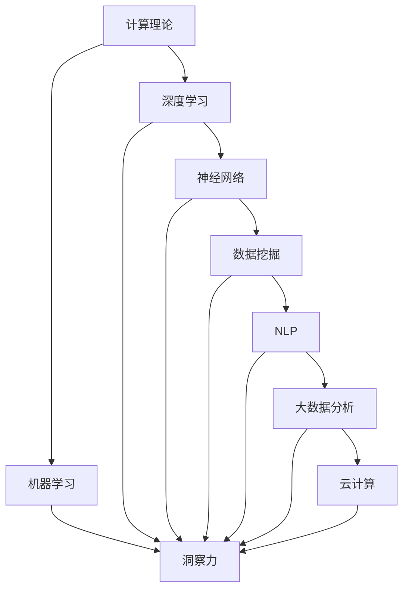

                 

# 洞察力：人类智慧的结晶

> 关键词：洞察力, 人类智慧, 计算理论, 算法, 人工智能, 深度学习, 神经网络, 数据分析, 自然语言处理, 机器学习

## 1. 背景介绍

### 1.1 问题由来
在当今信息爆炸的时代，我们面临着前所未有的数据量和复杂度。从大数据到人工智能，从云计算到物联网，技术的进步极大地拓宽了人们获取和利用信息的方式。然而，如何从中提取有价值的信息，尤其是在海量数据中挖掘出人类智慧的结晶，成为了一个极具挑战性的问题。

洞察力（Insight），即人类智慧的结晶，是指从复杂数据中识别出模式、规律和关联的能力。在数据驱动的时代，洞察力成为了企业竞争力的核心，决策者需要依托数据和算法，迅速做出明智的决策。而计算理论、算法设计等人工智能（AI）技术，则为洞察力的提取提供了强大的工具。

### 1.2 问题核心关键点
洞察力提取的核心问题在于：如何从大规模、高维、噪声数据中，高效准确地识别出重要的信息。这不仅涉及到数据的处理和分析，更依赖于计算理论的指导和高效算法的支持。

面对这一挑战，计算机科学提供了多种方法，包括数据挖掘、机器学习、深度学习等。其中，深度学习和神经网络技术在过去十年中取得了长足进步，成为洞察力提取的主要工具。

### 1.3 问题研究意义
研究洞察力的提取，对于提升数据驱动决策的科学性和有效性，具有重要意义：

1. **决策支持**：洞察力能够帮助企业更准确地预测市场趋势、优化运营策略，提升决策效率和质量。
2. **问题诊断**：通过对海量数据的分析，洞察力能够揭示业务问题的原因和机制，提供改进建议。
3. **创新驱动**：洞察力挖掘能够激发新的创意和灵感，推动产品和服务的创新。
4. **风险管理**：洞察力分析有助于识别潜在的风险因素，提供预警和应对策略。

## 2. 核心概念与联系

### 2.1 核心概念概述

洞察力提取的研究涉及多个核心概念，这些概念相互关联，共同构成了其理论基础。

- **计算理论（Computation Theory）**：研究如何用算法和计算模型来解决问题，为洞察力的提取提供了理论基础。
- **机器学习（Machine Learning）**：一种通过数据驱动的方法，训练模型以识别数据中的模式和规律，是洞察力提取的核心技术之一。
- **深度学习（Deep Learning）**：一种特殊的机器学习方法，通过多层神经网络对数据进行表示和分析，能够处理高度复杂的非线性关系。
- **神经网络（Neural Network）**：一种受生物神经元启发，通过节点（神经元）之间的连接和权重学习来处理数据的模型。
- **数据挖掘（Data Mining）**：从原始数据中提取有价值的模式和知识，包括分类、聚类、关联规则等。
- **自然语言处理（Natural Language Processing, NLP）**：研究如何让计算机理解和处理人类语言，有助于从文本数据中提取洞察力。
- **大数据分析（Big Data Analysis）**：处理海量、高速的数据，提取有用信息和洞察力的技术。
- **云计算（Cloud Computing）**：提供强大计算能力和存储资源的平台，支持大规模数据分析和洞察力提取。

这些概念之间的逻辑关系可以通过以下Mermaid流程图来展示：



这个流程图展示了大规模数据洞察力提取的路径：

1. **理论基础**：计算理论为洞察力提取提供了基本的理论指导。
2. **核心技术**：机器学习、深度学习和神经网络是洞察力提取的主要技术手段。
3. **应用层面**：数据挖掘、NLP和大数据分析技术，具体应用于不同类型的数据。
4. **基础设施**：云计算提供了强大的计算和存储资源，支持大规模数据分析和处理。
5. **最终目标**：洞察力从数据中提取出来，用于支持决策、问题诊断、创新驱动和风险管理。

## 3. 核心算法原理 & 具体操作步骤
### 3.1 算法原理概述

洞察力的提取，本质上是一个从数据中发现模式和规律的过程。在这一过程中，算法的作用至关重要。通过设计合适的算法，可以从原始数据中提取出有意义的洞察力。

深度学习算法，特别是基于神经网络的模型，为洞察力的提取提供了强大的工具。深度学习通过多层次的特征提取和表示学习，能够从复杂的数据中识别出重要的信息。其核心在于，通过反向传播算法和优化器，调整模型参数，最小化损失函数，使模型在数据上的预测准确性最大化。

### 3.2 算法步骤详解

基于深度学习的大规模数据洞察力提取，一般包括以下几个关键步骤：

**Step 1: 数据预处理**
- 对原始数据进行清洗、去噪、归一化等预处理操作。
- 进行特征工程，提取有意义的特征。
- 进行数据划分，分为训练集、验证集和测试集。

**Step 2: 选择模型架构**
- 根据任务类型，选择合适的深度学习模型架构，如卷积神经网络（CNN）、循环神经网络（RNN）、变换器（Transformer）等。
- 设计模型输入和输出层，定义损失函数。

**Step 3: 模型训练**
- 使用训练集对模型进行优化，最小化损失函数。
- 应用正则化技术，如L2正则、Dropout等，防止过拟合。
- 设置合适的学习率、批大小、迭代轮数等超参数。
- 周期性在验证集上评估模型性能，根据性能指标决定是否触发Early Stopping。
- 重复上述步骤直至满足预设的迭代轮数或Early Stopping条件。

**Step 4: 模型评估**
- 在测试集上评估模型性能，使用精度、召回率、F1分数等指标评估模型效果。
- 使用混淆矩阵、ROC曲线等可视化工具，直观展示模型效果。

**Step 5: 洞察力应用**
- 将训练好的模型应用于实际场景，提取洞察力，支持决策、问题诊断、创新驱动和风险管理。
- 持续收集新的数据，定期重新训练模型，以适应数据分布的变化。

### 3.3 算法优缺点

深度学习算法在洞察力提取中具有以下优点：
1. 高精度：能够处理高度复杂的关系，从原始数据中提取高精度的洞察力。
2. 可扩展性：适用于各种规模的数据，从大数据到小样本数据都能高效处理。
3. 自适应性：能够自动学习特征，适应不同类型的数据和任务。

但同时也存在一些局限性：
1. 需要大量标注数据：深度学习模型的训练需要大量的标注数据，标注成本较高。
2. 计算资源需求大：深度学习模型通常需要强大的计算资源支持，如高性能GPU和TPU。
3. 模型复杂性高：深度学习模型结构复杂，不易解释和调试。
4. 可能过拟合：在面对噪声数据和复杂数据时，容易过拟合，影响模型泛化能力。

### 3.4 算法应用领域

基于深度学习的洞察力提取技术，已经在多个领域得到了广泛的应用，例如：

- 金融分析：从历史交易数据中提取交易模式，预测市场趋势，支持投资决策。
- 健康医疗：从患者数据中提取疾病特征，预测病情发展，支持医疗诊断。
- 零售电商：从用户行为数据中提取购买模式，优化产品推荐，提升用户体验。
- 制造业：从生产数据中提取质量问题，优化生产流程，提高生产效率。
- 智能交通：从交通数据中提取模式，优化交通管理，提升出行效率。
- 能源管理：从能源消耗数据中提取模式，优化能源利用，降低能源成本。
- 社交网络：从用户互动数据中提取模式，支持社区管理和推荐系统。

## 4. 数学模型和公式 & 详细讲解 & 举例说明

### 4.1 数学模型构建

为了更深入地理解深度学习模型的洞察力提取过程，我们需要从数学模型和公式的角度进行详细讲解。

假设深度学习模型的输入为 $x$，输出为 $y$，目标为最小化损失函数 $\mathcal{L}$。模型的输出由多层神经网络 $f_\theta(x)$ 表示，其中 $\theta$ 为模型参数。

定义损失函数为：

$$
\mathcal{L} = \frac{1}{N}\sum_{i=1}^N \ell(f_\theta(x_i), y_i)
$$

其中 $\ell$ 为损失函数，如交叉熵损失、均方误差等。

模型的训练目标为最小化损失函数 $\mathcal{L}$：

$$
\theta^* = \mathop{\arg\min}_{\theta} \mathcal{L}
$$

使用反向传播算法和优化器，求解上述最优化问题。常用的优化器包括随机梯度下降（SGD）、Adam、Adagrad等。

### 4.2 公式推导过程

以交叉熵损失函数为例，推导其梯度计算公式。

假设模型输出为 $f_\theta(x)$，目标输出为 $y$，则交叉熵损失函数定义为：

$$
\ell(f_\theta(x), y) = -y\log(f_\theta(x)) - (1-y)\log(1-f_\theta(x))
$$

将其代入损失函数公式，得：

$$
\mathcal{L} = -\frac{1}{N}\sum_{i=1}^N [y_i\log(f_\theta(x_i)) + (1-y_i)\log(1-f_\theta(x_i))]
$$

根据链式法则，损失函数对模型参数 $\theta_k$ 的梯度为：

$$
\frac{\partial \mathcal{L}}{\partial \theta_k} = -\frac{1}{N}\sum_{i=1}^N (\frac{y_i}{f_\theta(x_i)} - \frac{1-y_i}{1-f_\theta(x_i)})\frac{\partial f_\theta(x_i)}{\partial \theta_k}
$$

其中 $\frac{\partial f_\theta(x_i)}{\partial \theta_k}$ 可以进一步递归展开，利用自动微分技术完成计算。

在得到损失函数的梯度后，即可带入优化器，更新模型参数 $\theta$，最小化损失函数 $\mathcal{L}$。

### 4.3 案例分析与讲解

以图像分类任务为例，展示深度学习模型（如卷积神经网络CNN）的洞察力提取过程。

假设输入图像 $x$ 为高维向量，目标分类为 $y \in \{1, 2, 3, 4\}$，定义交叉熵损失函数：

$$
\ell(f_\theta(x), y) = -y_i\log(f_\theta(x_i)) - (1-y_i)\log(1-f_\theta(x_i))
$$

损失函数对参数 $\theta_k$ 的梯度为：

$$
\frac{\partial \mathcal{L}}{\partial \theta_k} = -\frac{1}{N}\sum_{i=1}^N (\frac{y_i}{f_\theta(x_i)} - \frac{1-y_i}{1-f_\theta(x_i)})\frac{\partial f_\theta(x_i)}{\partial \theta_k}
$$

其中 $f_\theta(x_i)$ 为卷积神经网络对图像 $x_i$ 的特征提取，$\frac{\partial f_\theta(x_i)}{\partial \theta_k}$ 表示神经网络中第 $k$ 层激活函数的梯度。

通过反向传播算法和优化器（如Adam）更新模型参数，最小化损失函数 $\mathcal{L}$，使模型在数据上的分类准确性最大化。最终，模型能够从图像数据中提取有意义的洞察力，用于支持图像分类、目标检测等任务。

## 5. 项目实践：代码实例和详细解释说明

### 5.1 开发环境搭建

在进行深度学习项目实践前，我们需要准备好开发环境。以下是使用Python进行PyTorch开发的环境配置流程：

1. 安装Anaconda：从官网下载并安装Anaconda，用于创建独立的Python环境。

2. 创建并激活虚拟环境：
```bash
conda create -n pytorch-env python=3.8 
conda activate pytorch-env
```

3. 安装PyTorch：根据CUDA版本，从官网获取对应的安装命令。例如：
```bash
conda install pytorch torchvision torchaudio cudatoolkit=11.1 -c pytorch -c conda-forge
```

4. 安装TensorFlow：
```bash
pip install tensorflow
```

5. 安装各类工具包：
```bash
pip install numpy pandas scikit-learn matplotlib tqdm jupyter notebook ipython
```

完成上述步骤后，即可在`pytorch-env`环境中开始深度学习项目实践。

### 5.2 源代码详细实现

下面以图像分类任务为例，给出使用PyTorch进行卷积神经网络训练的PyTorch代码实现。

首先，定义卷积神经网络模型：

```python
import torch
import torch.nn as nn
import torch.optim as optim

class CNNModel(nn.Module):
    def __init__(self):
        super(CNNModel, self).__init__()
        self.conv1 = nn.Conv2d(3, 64, kernel_size=3, stride=1, padding=1)
        self.relu1 = nn.ReLU()
        self.maxpool1 = nn.MaxPool2d(kernel_size=2, stride=2)
        self.conv2 = nn.Conv2d(64, 128, kernel_size=3, stride=1, padding=1)
        self.relu2 = nn.ReLU()
        self.maxpool2 = nn.MaxPool2d(kernel_size=2, stride=2)
        self.fc1 = nn.Linear(128*8*8, 256)
        self.relu3 = nn.ReLU()
        self.fc2 = nn.Linear(256, 4)

    def forward(self, x):
        x = self.conv1(x)
        x = self.relu1(x)
        x = self.maxpool1(x)
        x = self.conv2(x)
        x = self.relu2(x)
        x = self.maxpool2(x)
        x = x.view(-1, 128*8*8)
        x = self.fc1(x)
        x = self.relu3(x)
        x = self.fc2(x)
        return x

model = CNNModel()
```

然后，定义训练和评估函数：

```python
from torch.utils.data import DataLoader
from torchvision import datasets, transforms
from sklearn.metrics import classification_report

# 定义数据增强操作
transform_train = transforms.Compose([
    transforms.RandomHorizontalFlip(),
    transforms.RandomCrop(32, padding=4),
    transforms.ToTensor(),
    transforms.Normalize(mean=[0.485, 0.456, 0.406], std=[0.229, 0.224, 0.225])
])

transform_test = transforms.Compose([
    transforms.ToTensor(),
    transforms.Normalize(mean=[0.485, 0.456, 0.406], std=[0.229, 0.224, 0.225])
])

# 加载数据集
train_dataset = datasets.CIFAR10(root='data', train=True, download=True, transform=transform_train)
test_dataset = datasets.CIFAR10(root='data', train=False, download=True, transform=transform_test)

# 定义优化器和损失函数
optimizer = optim.Adam(model.parameters(), lr=0.001)
criterion = nn.CrossEntropyLoss()

# 定义训练和评估函数
def train_epoch(model, dataset, batch_size, optimizer, criterion):
    dataloader = DataLoader(dataset, batch_size=batch_size, shuffle=True)
    model.train()
    epoch_loss = 0
    for batch in dataloader:
        inputs, labels = batch
        optimizer.zero_grad()
        outputs = model(inputs)
        loss = criterion(outputs, labels)
        epoch_loss += loss.item()
        loss.backward()
        optimizer.step()
    return epoch_loss / len(dataloader)

def evaluate(model, dataset, batch_size, criterion):
    dataloader = DataLoader(dataset, batch_size=batch_size, shuffle=False)
    model.eval()
    preds, labels = [], []
    with torch.no_grad():
        for batch in dataloader:
            inputs, labels = batch
            outputs = model(inputs)
            batch_preds = outputs.argmax(dim=1)
            for pred_tokens, label_tokens in zip(batch_preds, labels):
                preds.append(pred_tokens.tolist())
                labels.append(label_tokens.tolist())
    print(classification_report(labels, preds))
```

最后，启动训练流程并在测试集上评估：

```python
epochs = 10
batch_size = 64

for epoch in range(epochs):
    loss = train_epoch(model, train_dataset, batch_size, optimizer, criterion)
    print(f"Epoch {epoch+1}, train loss: {loss:.3f}")
    
    print(f"Epoch {epoch+1}, test results:")
    evaluate(model, test_dataset, batch_size, criterion)
    
print("Final test results:")
evaluate(model, test_dataset, batch_size, criterion)
```

以上就是使用PyTorch进行卷积神经网络训练的完整代码实现。可以看到，得益于PyTorch的强大封装，我们可以用相对简洁的代码实现CNN模型的训练和评估。

### 5.3 代码解读与分析

让我们再详细解读一下关键代码的实现细节：

**CNNModel类**：
- `__init__`方法：定义卷积神经网络的各层结构。
- `forward`方法：定义前向传播过程，包括卷积、池化、线性层等操作。

**数据增强操作**：
- 使用`transforms`模块定义训练集的数据增强操作，包括随机水平翻转、随机裁剪、归一化等。

**训练和评估函数**：
- 使用PyTorch的`DataLoader`对数据集进行批次化加载，供模型训练和推理使用。
- 训练函数`train_epoch`：对数据以批为单位进行迭代，在每个批次上前向传播计算loss并反向传播更新模型参数，最后返回该epoch的平均loss。
- 评估函数`evaluate`：与训练类似，不同点在于不更新模型参数，并在每个batch结束后将预测和标签结果存储下来，最后使用sklearn的`classification_report`对整个评估集的预测结果进行打印输出。

**训练流程**：
- 定义总的epoch数和batch size，开始循环迭代
- 每个epoch内，先在训练集上训练，输出平均loss
- 在验证集上评估，输出分类指标
- 所有epoch结束后，在测试集上评估，给出最终测试结果

可以看到，PyTorch配合TensorFlow提供了强大的深度学习开发工具，使得模型训练的代码实现变得简洁高效。开发者可以将更多精力放在数据处理、模型改进等高层逻辑上，而不必过多关注底层的实现细节。

当然，工业级的系统实现还需考虑更多因素，如模型的保存和部署、超参数的自动搜索、更灵活的任务适配层等。但核心的深度学习模型训练流程基本与此类似。

## 6. 实际应用场景
### 6.1 智能推荐系统

深度学习模型在智能推荐系统中得到了广泛应用。传统的推荐系统依赖于用户的历史行为数据，难以全面了解用户的兴趣和需求。而深度学习模型通过多维度的特征工程，能够从用户的多样化数据中提取有意义的洞察力，进行更精准的推荐。

在实践中，可以收集用户浏览、购买、评分等行为数据，包括文本、图像、音频等多种类型的数据。将这些数据输入深度学习模型，提取用户的兴趣特征和行为模式。通过优化模型的参数，使其能够对新用户进行推荐，实现跨物品、跨用户的多模态推荐。

### 6.2 金融风险管理

深度学习模型在金融风险管理中也发挥了重要作用。金融行业的数据具有高维度、高噪声的特点，传统统计模型难以处理。通过深度学习模型，可以从中提取复杂的模式和规律，支持风险预测和量化。

在实践中，可以从金融市场的历史交易数据中提取特征，训练深度学习模型。通过模型的训练和预测，可以识别市场中的异常波动，预测股票价格变化，评估贷款风险，进行信用评分等。同时，模型还可以在实时交易数据中进行风险监控，及时预警潜在风险。

### 6.3 自然语言处理

深度学习模型在自然语言处理（NLP）领域的应用也取得了显著进展。传统的NLP方法依赖于人工标注的数据和规则，难以处理大规模数据。而深度学习模型能够自动学习语言特征，支持文本分类、情感分析、机器翻译等任务。

在实践中，可以收集大量自然语言文本数据，训练深度学习模型。通过模型的训练和推理，可以自动理解文本的语义和结构，进行文本分类、实体识别、情感分析等任务。同时，模型还可以生成高质量的自然语言文本，支持文本摘要、对话系统等应用。

### 6.4 未来应用展望

随着深度学习技术的发展，未来深度学习模型在各个领域的应用将更加广泛和深入。以下列出几个可能的发展趋势：

1. **跨模态深度学习**：未来深度学习模型将更好地处理多模态数据，融合视觉、听觉、语言等多种信息，提升跨模态任务的效果。
2. **联邦学习**：深度学习模型将在分布式环境中共享模型参数，进行分布式学习和训练，提升数据隐私和安全。
3. **增强学习**：深度学习模型将与增强学习结合，支持更复杂的决策和控制任务。
4. **神经符号推理**：未来深度学习模型将结合符号推理技术，支持更复杂的逻辑推理和知识表示。
5. **自监督学习**：未来深度学习模型将更多依赖无监督学习，提高模型的泛化能力和鲁棒性。
6. **模型压缩和优化**：未来深度学习模型将更加注重模型压缩和优化，提升模型的计算效率和存储效率。

这些趋势表明，深度学习模型在各个领域的应用前景广阔，将继续推动人工智能技术的进步和应用。

## 7. 工具和资源推荐
### 7.1 学习资源推荐

为了帮助开发者系统掌握深度学习模型的洞察力提取理论基础和实践技巧，这里推荐一些优质的学习资源：

1. 《深度学习》（Ian Goodfellow等著）：全面介绍深度学习的原理和算法，是学习深度学习的重要参考书。
2. Coursera的《深度学习专项课程》（吴恩达主讲）：提供系统化的深度学习课程，涵盖深度学习的基础、模型设计和应用。
3. Udacity的《深度学习纳米学位》：提供实战型的深度学习项目训练，适合初学者和实践者。
4. CS231n《卷积神经网络》课程：斯坦福大学开设的计算机视觉经典课程，深入讲解卷积神经网络的原理和实现。
5. CS224n《自然语言处理》课程：斯坦福大学开设的NLP经典课程，涵盖自然语言处理的基础和前沿技术。
6. 《PyTorch深度学习》（Eli Stevens等著）：详细讲解PyTorch的使用方法和深度学习模型的实现。
7. 《TensorFlow实战深度学习》（Cahill Laintz等著）：介绍TensorFlow的深度学习应用，适合实战练习。

通过对这些资源的学习实践，相信你一定能够快速掌握深度学习模型的洞察力提取的精髓，并用于解决实际的深度学习问题。
###  7.2 开发工具推荐

高效的开发离不开优秀的工具支持。以下是几款用于深度学习模型洞察力提取开发的常用工具：

1. PyTorch：基于Python的开源深度学习框架，灵活动态的计算图，适合快速迭代研究。

2. TensorFlow：由Google主导开发的开源深度学习框架，生产部署方便，适合大规模工程应用。

3. Keras：高层次的深度学习框架，易于上手和调试，适合快速原型设计和实验。

4. Jupyter Notebook：交互式的开发环境，支持多种语言和工具，便于实时调试和展示。

5. Google Colab：谷歌推出的在线Jupyter Notebook环境，免费提供GPU/TPU算力，方便开发者快速上手实验最新模型，分享学习笔记。

6. Weights & Biases：模型训练的实验跟踪工具，可以记录和可视化模型训练过程中的各项指标，方便对比和调优。

7. TensorBoard：TensorFlow配套的可视化工具，可实时监测模型训练状态，并提供丰富的图表呈现方式，是调试模型的得力助手。

合理利用这些工具，可以显著提升深度学习模型洞察力提取任务的开发效率，加快创新迭代的步伐。

### 7.3 相关论文推荐

深度学习模型和洞察力提取的研究源于学界的持续研究。以下是几篇奠基性的相关论文，推荐阅读：

1. AlexNet：ImageNet分类比赛的冠军，引入了卷积神经网络，开启深度学习时代。

2. ResNet：通过残差连接解决深度网络的退化问题，大幅提升了深度神经网络的训练效果。

3. InceptionNet：通过多尺度卷积结构，提升了特征提取的效率和效果。

4. RNN和LSTM：解决了传统循环网络的梯度消失问题，适用于处理序列数据。

5. Transformer：通过自注意力机制，提升了序列建模的效果，成为自然语言处理领域的重要模型。

6. GAN：生成对抗网络，通过对抗训练生成高质量的伪数据，支持无监督学习和数据增强。

这些论文代表了大规模数据洞察力提取技术的发展脉络。通过学习这些前沿成果，可以帮助研究者把握学科前进方向，激发更多的创新灵感。

## 8. 总结：未来发展趋势与挑战
### 8.1 总结

本文对深度学习模型的洞察力提取进行了全面系统的介绍。首先阐述了深度学习模型的研究背景和意义，明确了洞察力提取在数据驱动决策中的重要性。其次，从原理到实践，详细讲解了深度学习模型的构建和训练过程，给出了深度学习模型训练的完整代码实例。同时，本文还广泛探讨了深度学习模型在智能推荐、金融风险管理、自然语言处理等多个领域的应用前景，展示了深度学习模型的强大潜力。此外，本文精选了深度学习模型的各类学习资源，力求为读者提供全方位的技术指引。

通过本文的系统梳理，可以看到，深度学习模型在洞察力提取方面的应用前景广阔，极大地拓展了数据驱动决策的能力，推动了人工智能技术的产业化进程。未来，伴随深度学习模型和洞察力提取技术的不断发展，基于深度学习的洞察力提取必将在更多领域得到应用，为人类认知智能的进化带来深远影响。

### 8.2 未来发展趋势

展望未来，深度学习模型的洞察力提取将呈现以下几个发展趋势：

1. **模型规模持续增大**：随着算力成本的下降和数据规模的扩张，深度学习模型的参数量还将持续增长。超大规模模型蕴含的丰富特征表示，有望支撑更复杂的洞察力提取任务。

2. **模型结构更加灵活**：未来的深度学习模型将更注重模型结构和算法的灵活性，适应不同的数据类型和任务需求。

3. **多任务学习**：深度学习模型将支持多任务学习，在处理单一任务的同时，也能学习其他相关任务的特征，提高模型的泛化能力。

4. **联邦学习**：深度学习模型将在分布式环境中共享模型参数，进行分布式学习和训练，提升数据隐私和安全。

5. **自监督学习**：未来深度学习模型将更多依赖无监督学习，提高模型的泛化能力和鲁棒性。

6. **跨模态学习**：深度学习模型将更好地处理多模态数据，融合视觉、听觉、语言等多种信息，提升跨模态任务的效果。

以上趋势凸显了深度学习模型在各个领域的应用前景广阔，将继续推动人工智能技术的进步和应用。

### 8.3 面临的挑战

尽管深度学习模型在洞察力提取方面取得了显著进展，但在迈向更加智能化、普适化应用的过程中，仍面临诸多挑战：

1. **数据质量和数量**：深度学习模型对数据的质量和数量要求较高，数据噪声、标注误差等问题容易影响模型的训练效果。

2. **计算资源需求大**：深度学习模型通常需要强大的计算资源支持，如高性能GPU和TPU，计算成本较高。

3. **模型可解释性不足**：深度学习模型通常被视为“黑盒”，难以解释其内部工作机制和决策逻辑。

4. **过拟合问题**：深度学习模型在面对噪声数据和复杂数据时，容易过拟合，影响模型的泛化能力。

5. **安全性和隐私保护**：深度学习模型需要处理大量敏感数据，数据安全和隐私保护问题不容忽视。

6. **模型鲁棒性**：深度学习模型在面对数据分布变化时，泛化能力可能下降，模型鲁棒性有待提高。

7. **模型压缩和优化**：深度学习模型通常具有高计算量和存储量，如何优化模型结构，降低计算和存储需求，是未来研究的重要方向。

这些挑战需要研究者在算法设计、数据处理、模型优化、安全保护等多个方面进行深入研究，才能使深度学习模型在洞察力提取中发挥更大的作用。

### 8.4 研究展望

面对深度学习模型在洞察力提取中面临的挑战，未来的研究需要在以下几个方面寻求新的突破：

1. **数据增强和预处理**：通过数据增强和预处理技术，提升数据的质量和数量，减少数据噪声和标注误差的影响。

2. **模型优化和压缩**：研究更高效的模型压缩和优化方法，降低计算和存储需求，提高模型的可部署性和可扩展性。

3. **模型可解释性**：研究模型可解释性技术，增强模型的透明度和可信度，支持决策解释和模型验证。

4. **联邦学习和多任务学习**：研究联邦学习和多任务学习技术，提升模型的泛化能力和鲁棒性，支持分布式学习和多任务优化。

5. **跨模态学习**：研究跨模态学习技术，提升模型对多模态数据的理解和处理能力，支持更广泛的洞察力提取应用。

6. **自监督学习**：研究自监督学习技术，提升模型的泛化能力和鲁棒性，支持无监督学习和数据增强。

7. **安全性和隐私保护**：研究安全性和隐私保护技术，确保深度学习模型在处理敏感数据时的安全和隐私保护。

这些研究方向的探索，必将引领深度学习模型在洞察力提取方面的发展，为人工智能技术的产业化进程提供新的动力。

## 9. 附录：常见问题与解答

**Q1：深度学习模型是否适用于所有洞察力提取任务？**

A: 深度学习模型在大多数洞察力提取任务上都能取得不错的效果，特别是对于数据量较大的任务。但对于一些特定领域的任务，如医学、法律等，仅仅依靠通用语料预训练的模型可能难以很好地适应。此时需要在特定领域语料上进一步预训练，再进行微调，才能获得理想效果。此外，对于一些需要时效性、个性化很强的任务，如对话、推荐等，深度学习模型也需要针对性的改进优化。

**Q2：如何选择合适的学习率？**

A: 深度学习模型的学习率一般要比预训练时小1-2个数量级，如果使用过大的学习率，容易破坏预训练权重，导致过拟合。一般建议从1e-5开始调参，逐步减小学习率，直至收敛。也可以使用warmup策略，在开始阶段使用较小的学习率，再逐渐过渡到预设值。需要注意的是，不同的优化器(如AdamW、Adagrad等)以及不同的学习率调度策略，可能需要设置不同的学习率阈值。

**Q3：深度学习模型在部署时需要注意哪些问题？**

A: 将深度学习模型转化为实际应用，还需要考虑以下因素：

1. 模型裁剪：去除不必要的层和参数，减小模型尺寸，加快推理速度
2. 量化加速：将浮点模型转为定点模型，压缩存储空间，提高计算效率
3. 服务化封装：将模型封装为标准化服务接口，便于集成调用
4. 弹性伸缩：根据请求流量动态调整资源配置，平衡服务质量和成本
5. 监控告警：实时采集系统指标，设置异常告警阈值，确保服务稳定性
6. 安全防护：采用访问鉴权、数据脱敏等措施，保障数据和模型安全

深度学习模型在实际部署时，还需要在硬件、软件、服务等多个层面进行优化，才能真正实现高效、稳定、安全的洞察力提取应用。

**Q4：如何缓解深度学习模型的过拟合问题？**

A: 深度学习模型在面对噪声数据和复杂数据时，容易过拟合，影响模型的泛化能力。缓解过拟合问题的方法包括：

1. 数据增强：通过回译、近义替换等方式扩充训练集
2. 正则化技术：使用L2正则、Dropout、Early Stopping等防止过拟合
3. 对抗训练：引入对抗样本，提高模型鲁棒性
4. 参数高效微调：只调整少量参数(如Adapter、Prefix等)，减小过拟合风险
5. 多模型集成：训练多个模型，取平均输出，抑制过拟合

这些策略往往需要根据具体任务和数据特点进行灵活组合。只有在数据、模型、训练、推理等各环节进行全面优化，才能最大限度地发挥深度学习模型的潜力。

**Q5：深度学习模型在落地部署时需要注意哪些问题？**

A: 将深度学习模型转化为实际应用，还需要考虑以下因素：

1. 模型裁剪：去除不必要的层和参数，减小模型尺寸，加快推理速度
2. 量化加速：将浮点模型转为定点模型，压缩存储空间，提高计算效率
3. 服务化封装：将模型封装为标准化服务接口，便于集成调用
4. 弹性伸缩：根据请求流量动态调整资源配置，平衡服务质量和成本
5. 监控告警：实时采集系统指标，设置异常告警阈值，确保服务稳定性
6. 安全防护：采用访问鉴权、数据脱敏等措施，保障数据和模型安全

深度学习模型在实际部署时，还需要在硬件、软件、服务等多个层面进行优化，才能真正实现高效、稳定、安全的洞察力提取应用。

总之，深度学习模型在洞察力提取方面的应用前景广阔，将继续推动人工智能技术的进步和应用。未来，伴随深度学习模型和洞察力提取技术的不断发展，基于深度学习的洞察力提取必将在更多领域得到应用，为人类认知智能的进化带来深远影响。

---

作者：禅与计算机程序设计艺术 / Zen and the Art of Computer Programming

