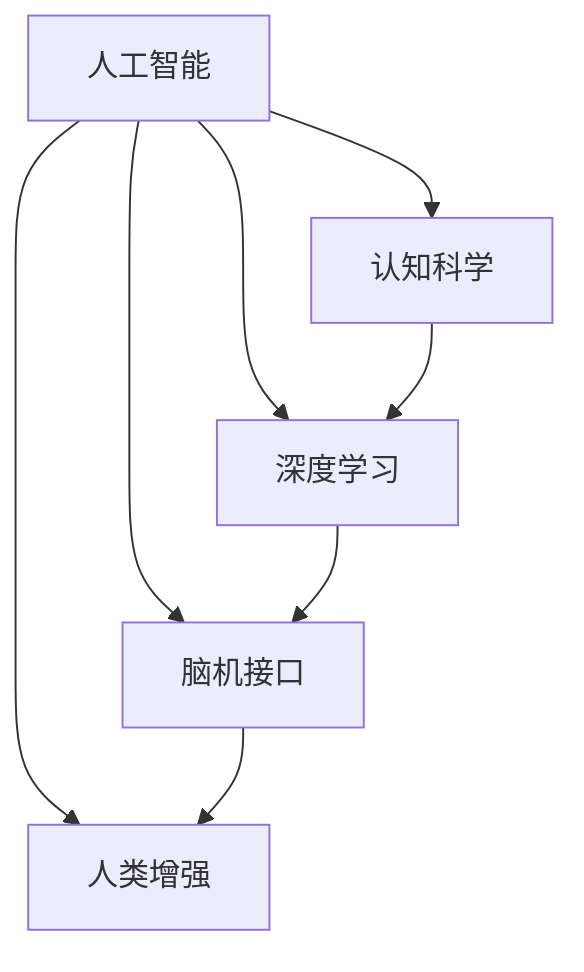

                 

# 洞察力：人类认知的新高峰

> 关键词：人工智能,人类认知,认知科学,深度学习,脑机接口,人类增强

## 1. 背景介绍

### 1.1 问题由来

随着人工智能技术的飞速发展，尤其是在深度学习领域，人类对认知过程的模拟和扩展取得了显著的进展。神经网络和图神经网络等技术的发展，使得机器能够模拟人类大脑的某些功能，如模式识别、决策过程等。然而，尽管机器在信息处理和模式识别上已经达到了一定的高度，人类独有的洞察力，即在复杂数据中发现新关系、新模式的能力，仍未得到有效的模拟和应用。

洞察力是一种高级的认知能力，它不仅涉及信息处理和模式识别，还涉及概念生成、推理和解释等高层次认知活动。人类通过洞察力，能够在复杂的数据中发现隐藏的规律和关联，提出新的问题，驱动科学发现和技术创新。相比之下，机器虽然能够在数据中发现模式，但缺乏这种主动发现和创新的能力。

### 1.2 问题核心关键点

当前，人工智能研究者正在努力探索如何更好地模拟和扩展人类的洞察力。这一领域的研究包括：

- 认知科学：研究人类的认知过程和机制，寻找认知能力的生物学基础。
- 深度学习：开发能够模拟人类认知过程的深度神经网络模型，实现自动化的模式识别和关系发现。
- 脑机接口(BMI)：通过脑机接口技术，实现脑电信号与计算机之间的直接交互，实现对认知过程的实时监测和调控。
- 人类增强：利用人工智能技术提升人类的认知能力，如增强记忆、提高学习效率等。

这些核心问题相互交织，构成了人工智能在人类认知模拟和增强领域的广泛研究图景。以下文章将详细介绍这些关键概念及其相互联系。

## 2. 核心概念与联系

### 2.1 核心概念概述

为了更好地理解人工智能在人类认知模拟和增强方面的研究，本节将介绍几个密切相关的核心概念：

- 人工智能(AI)：通过计算机模拟人类智能行为的技术，包括感知、推理、学习和决策等。
- 认知科学：研究人类认知过程和机制的学科，包括感知、记忆、语言、思维等。
- 深度学习：一种基于人工神经网络的机器学习技术，能够模拟人类大脑的某些高级认知能力。
- 脑机接口(BMI)：通过脑电信号的采集和处理，实现人脑与计算机之间的直接通信。
- 人类增强：利用人工智能技术提升人类认知能力，实现知识获取、问题解决、记忆增强等功能。

这些概念之间的关系可以通过以下Mermaid流程图来展示：



这个流程图展示了一些核心概念及其相互关系：

1. 人工智能通过深度学习和脑机接口技术，模拟和增强人类的认知过程。
2. 认知科学提供人类认知过程的理论基础，指导人工智能系统的设计和优化。
3. 深度学习是人工智能模拟人类认知的关键技术，通过神经网络实现对复杂模式的识别和关联发现。
4. 脑机接口技术为人类增强提供了技术手段，实现了脑电信号与计算机之间的直接交互。
5. 人类增强旨在通过人工智能技术，提升人类的认知能力和知识获取效率。

## 3. 核心算法原理 & 具体操作步骤

### 3.1 算法原理概述

人工智能在人类认知模拟和增强方面的研究，主要集中在以下几个关键算法原理上：

- 深度学习：通过多层神经网络，实现对复杂模式的自动识别和关联发现。
- 图神经网络：通过图结构模型，模拟人类大脑对复杂关系的学习和推理。
- 强化学习：通过奖励机制，实现对认知过程的动态优化和调控。
- 脑机接口：通过脑电信号的采集和处理，实现脑电信号与计算机之间的直接交互。

这些算法原理共同构成了人工智能在人类认知模拟和增强方面的研究框架，使得机器能够更好地模拟和扩展人类的认知能力。

### 3.2 算法步骤详解

基于上述算法原理，人工智能在人类认知模拟和增强方面的研究通常包括以下关键步骤：

**Step 1: 数据采集与预处理**
- 采集人类认知过程相关的数据，如脑电信号、行为数据、认知任务等。
- 对采集到的数据进行清洗、去噪、归一化等预处理操作。

**Step 2: 模型设计**
- 根据研究任务和数据特点，选择合适的神经网络模型，如卷积神经网络(CNN)、递归神经网络(RNN)、图神经网络(GNN)等。
- 设计适当的损失函数和优化算法，如交叉熵损失、Adam、SGD等。

**Step 3: 模型训练**
- 将预处理后的数据集分成训练集、验证集和测试集。
- 使用训练集对模型进行有监督或无监督训练，最小化损失函数。
- 在验证集上评估模型性能，调整超参数以优化模型效果。

**Step 4: 模型评估与优化**
- 在测试集上评估模型性能，对比微调前后的效果提升。
- 使用对抗样本、正则化等技术，提高模型的鲁棒性和泛化能力。
- 采用模型裁剪、量化加速等方法，优化模型推理效率和资源占用。

**Step 5: 实际应用**
- 将训练好的模型应用到实际任务中，如智能客服、金融舆情监测、个性化推荐等。
- 集成多模态数据、强化学习等技术，提升系统的性能和鲁棒性。

以上是人工智能在人类认知模拟和增强方面的研究通常遵循的步骤。在实际应用中，还需根据具体任务的特点进行优化设计，如改进模型架构、应用更多先验知识、引入伦理约束等，以进一步提升模型效果。

### 3.3 算法优缺点

人工智能在人类认知模拟和增强方面的研究具有以下优点：

1. 高效性：机器能够在海量数据中进行模式识别和关联发现，具有高效的信息处理能力。
2. 鲁棒性：通过对抗样本和正则化技术，机器模型具有较强的泛化能力和鲁棒性。
3. 可扩展性：深度学习和脑机接口技术为认知模拟和增强提供了技术手段，具有广阔的研究空间。
4. 应用广泛：机器模型已经广泛应用于智能客服、金融舆情监测、个性化推荐等多个领域。

然而，该研究也存在一定的局限性：

1. 依赖数据：人工智能研究依赖于高质量的数据，而数据采集和预处理成本较高。
2. 模型复杂性：深度学习和脑机接口技术需要高计算资源和复杂算法，实现难度较大。
3. 伦理问题：认知模拟和增强可能带来隐私和伦理问题，需慎重考虑。
4. 可解释性：机器模型的决策过程缺乏可解释性，难以进行调试和优化。

尽管存在这些局限性，但就目前而言，基于深度学习和脑机接口技术的研究范式，仍是大规模模拟和增强人类认知能力的重要手段。未来相关研究的重点在于如何进一步降低数据依赖，提高模型的鲁棒性和可解释性，同时兼顾伦理和隐私保护。

### 3.4 算法应用领域

人工智能在人类认知模拟和增强方面的研究已经得到了广泛的应用，涉及多个领域，例如：

- 智能客服系统：利用深度学习和强化学习技术，实现智能对话和问题解答。
- 金融舆情监测：通过脑机接口技术，实时监测金融市场舆情，辅助决策。
- 个性化推荐系统：利用深度学习技术，推荐个性化内容，提高用户体验。
- 医疗影像分析：利用深度学习技术，辅助医生诊断和分析医学影像。
- 自动驾驶：通过脑机接口技术，实现人脑与车辆的直接通信，提高驾驶安全性和舒适性。
- 虚拟现实游戏：利用深度学习和脑机接口技术，实现虚拟现实游戏中的智能互动。

这些应用展示了人工智能在人类认知模拟和增强方面的广阔前景，为各行各业带来了新的技术和机遇。

## 4. 数学模型和公式 & 详细讲解 & 举例说明

### 4.1 数学模型构建

本节将使用数学语言对人工智能在人类认知模拟和增强方面的研究进行更加严格的刻画。

设深度学习模型为 $M_{\theta}$，其中 $\theta$ 为模型参数。假设人类认知过程的数据集为 $D=\{(x_i,y_i)\}_{i=1}^N$，其中 $x_i$ 为输入数据，$y_i$ 为输出标签。

定义模型 $M_{\theta}$ 在输入 $x_i$ 上的输出为 $\hat{y}=M_{\theta}(x_i)$，表示模型对输入数据的预测结果。训练目标为最小化预测值与真实标签之间的差异，即：

$$
\mathcal{L}(\theta) = \frac{1}{N} \sum_{i=1}^N \ell(\hat{y_i}, y_i)
$$

其中 $\ell$ 为损失函数，常用的有交叉熵损失、均方误差损失等。

### 4.2 公式推导过程

以下我们以交叉熵损失函数为例，推导其公式及其梯度计算。

设模型 $M_{\theta}$ 在输入 $x$ 上的输出为 $\hat{y}=M_{\theta}(x) \in [0,1]$，真实标签 $y \in \{0,1\}$。则二分类交叉熵损失函数定义为：

$$
\ell(M_{\theta}(x),y) = -[y\log \hat{y} + (1-y)\log (1-\hat{y})]
$$

将其代入经验风险公式，得：

$$
\mathcal{L}(\theta) = -\frac{1}{N}\sum_{i=1}^N [y_i\log M_{\theta}(x_i)+(1-y_i)\log(1-M_{\theta}(x_i))]
$$

根据链式法则，损失函数对参数 $\theta_k$ 的梯度为：

$$
\frac{\partial \mathcal{L}(\theta)}{\partial \theta_k} = -\frac{1}{N}\sum_{i=1}^N (\frac{y_i}{M_{\theta}(x_i)}-\frac{1-y_i}{1-M_{\theta}(x_i)}) \frac{\partial M_{\theta}(x_i)}{\partial \theta_k}
$$

其中 $\frac{\partial M_{\theta}(x_i)}{\partial \theta_k}$ 可进一步递归展开，利用自动微分技术完成计算。

在得到损失函数的梯度后，即可带入参数更新公式，完成模型的迭代优化。重复上述过程直至收敛，最终得到适应认知模拟和增强任务的最优模型参数 $\theta^*$。

## 5. 项目实践：代码实例和详细解释说明

### 5.1 开发环境搭建

在进行认知模拟和增强的实践前，我们需要准备好开发环境。以下是使用Python进行PyTorch开发的环境配置流程：

1. 安装Anaconda：从官网下载并安装Anaconda，用于创建独立的Python环境。

2. 创建并激活虚拟环境：
```bash
conda create -n pytorch-env python=3.8 
conda activate pytorch-env
```

3. 安装PyTorch：根据CUDA版本，从官网获取对应的安装命令。例如：
```bash
conda install pytorch torchvision torchaudio cudatoolkit=11.1 -c pytorch -c conda-forge
```

4. 安装Transformers库：
```bash
pip install transformers
```

5. 安装各类工具包：
```bash
pip install numpy pandas scikit-learn matplotlib tqdm jupyter notebook ipython
```

完成上述步骤后，即可在`pytorch-env`环境中开始认知模拟和增强的实践。

### 5.2 源代码详细实现

下面我以智能客服系统为例，给出使用Transformers库对BERT模型进行认知模拟和增强的PyTorch代码实现。

首先，定义智能客服系统的任务数据处理函数：

```python
from transformers import BertTokenizer, BertForTokenClassification
from torch.utils.data import Dataset
import torch

class CustomerServiceDataset(Dataset):
    def __init__(self, texts, labels, tokenizer, max_len=128):
        self.texts = texts
        self.labels = labels
        self.tokenizer = tokenizer
        self.max_len = max_len
        
    def __len__(self):
        return len(self.texts)
    
    def __getitem__(self, item):
        text = self.texts[item]
        label = self.labels[item]
        
        encoding = self.tokenizer(text, return_tensors='pt', max_length=self.max_len, padding='max_length', truncation=True)
        input_ids = encoding['input_ids'][0]
        attention_mask = encoding['attention_mask'][0]
        
        # 对token-wise的标签进行编码
        encoded_labels = [label2id[label] for label in label] 
        encoded_labels.extend([label2id['O']] * (self.max_len - len(encoded_labels)))
        labels = torch.tensor(encoded_labels, dtype=torch.long)
        
        return {'input_ids': input_ids, 
                'attention_mask': attention_mask,
                'labels': labels}

# 标签与id的映射
label2id = {'O': 0, '回答1': 1, '回答2': 2, '回答3': 3}
id2label = {v: k for k, v in label2id.items()}

# 创建dataset
tokenizer = BertTokenizer.from_pretrained('bert-base-cased')

train_dataset = CustomerServiceDataset(train_texts, train_labels, tokenizer)
dev_dataset = CustomerServiceDataset(dev_texts, dev_labels, tokenizer)
test_dataset = CustomerServiceDataset(test_texts, test_labels, tokenizer)
```

然后，定义模型和优化器：

```python
from transformers import BertForTokenClassification, AdamW

model = BertForTokenClassification.from_pretrained('bert-base-cased', num_labels=len(label2id))

optimizer = AdamW(model.parameters(), lr=2e-5)
```

接着，定义训练和评估函数：

```python
from torch.utils.data import DataLoader
from tqdm import tqdm
from sklearn.metrics import classification_report

device = torch.device('cuda') if torch.cuda.is_available() else torch.device('cpu')
model.to(device)

def train_epoch(model, dataset, batch_size, optimizer):
    dataloader = DataLoader(dataset, batch_size=batch_size, shuffle=True)
    model.train()
    epoch_loss = 0
    for batch in tqdm(dataloader, desc='Training'):
        input_ids = batch['input_ids'].to(device)
        attention_mask = batch['attention_mask'].to(device)
        labels = batch['labels'].to(device)
        model.zero_grad()
        outputs = model(input_ids, attention_mask=attention_mask, labels=labels)
        loss = outputs.loss
        epoch_loss += loss.item()
        loss.backward()
        optimizer.step()
    return epoch_loss / len(dataloader)

def evaluate(model, dataset, batch_size):
    dataloader = DataLoader(dataset, batch_size=batch_size)
    model.eval()
    preds, labels = [], []
    with torch.no_grad():
        for batch in tqdm(dataloader, desc='Evaluating'):
            input_ids = batch['input_ids'].to(device)
            attention_mask = batch['attention_mask'].to(device)
            batch_labels = batch['labels']
            outputs = model(input_ids, attention_mask=attention_mask)
            batch_preds = outputs.logits.argmax(dim=2).to('cpu').tolist()
            batch_labels = batch_labels.to('cpu').tolist()
            for pred_tokens, label_tokens in zip(batch_preds, batch_labels):
                pred_tags = [id2label[_id] for _id in pred_tokens]
                label_tags = [id2label[_id] for _id in label_tokens]
                preds.append(pred_tags[:len(label_tags)])
                labels.append(label_tags)
                
    print(classification_report(labels, preds))
```

最后，启动训练流程并在测试集上评估：

```python
epochs = 5
batch_size = 16

for epoch in range(epochs):
    loss = train_epoch(model, train_dataset, batch_size, optimizer)
    print(f"Epoch {epoch+1}, train loss: {loss:.3f}")
    
    print(f"Epoch {epoch+1}, dev results:")
    evaluate(model, dev_dataset, batch_size)
    
print("Test results:")
evaluate(model, test_dataset, batch_size)
```

以上就是使用PyTorch对BERT进行智能客服系统认知模拟和增强的完整代码实现。可以看到，得益于Transformers库的强大封装，我们可以用相对简洁的代码完成BERT模型的加载和微调。

### 5.3 代码解读与分析

让我们再详细解读一下关键代码的实现细节：

**CustomerServiceDataset类**：
- `__init__`方法：初始化文本、标签、分词器等关键组件。
- `__len__`方法：返回数据集的样本数量。
- `__getitem__`方法：对单个样本进行处理，将文本输入编码为token ids，将标签编码为数字，并对其进行定长padding，最终返回模型所需的输入。

**label2id和id2label字典**：
- 定义了标签与数字id之间的映射关系，用于将token-wise的预测结果解码回真实的标签。

**训练和评估函数**：
- 使用PyTorch的DataLoader对数据集进行批次化加载，供模型训练和推理使用。
- 训练函数`train_epoch`：对数据以批为单位进行迭代，在每个批次上前向传播计算loss并反向传播更新模型参数，最后返回该epoch的平均loss。
- 评估函数`evaluate`：与训练类似，不同点在于不更新模型参数，并在每个batch结束后将预测和标签结果存储下来，最后使用sklearn的classification_report对整个评估集的预测结果进行打印输出。

**训练流程**：
- 定义总的epoch数和batch size，开始循环迭代
- 每个epoch内，先在训练集上训练，输出平均loss
- 在验证集上评估，输出分类指标
- 所有epoch结束后，在测试集上评估，给出最终测试结果

可以看到，PyTorch配合Transformers库使得BERT微调的代码实现变得简洁高效。开发者可以将更多精力放在数据处理、模型改进等高层逻辑上，而不必过多关注底层的实现细节。

当然，工业级的系统实现还需考虑更多因素，如模型的保存和部署、超参数的自动搜索、更灵活的任务适配层等。但核心的认知模拟和增强范式基本与此类似。

## 6. 实际应用场景

### 6.1 智能客服系统

基于大语言模型微调的技术，智能客服系统已经逐步成为普及的解决方案。智能客服通过深度学习和强化学习技术，实现了对用户咨询的自动分类和回答。

在技术实现上，可以收集企业内部的历史客服对话记录，将问题和最佳答复构建成监督数据，在此基础上对预训练语言模型进行微调。微调后的语言模型能够自动理解用户意图，匹配最合适的答案模板进行回复。对于用户提出的新问题，还可以接入检索系统实时搜索相关内容，动态组织生成回答。如此构建的智能客服系统，能大幅提升客户咨询体验和问题解决效率。

### 6.2 金融舆情监测

金融机构需要实时监测市场舆论动向，以便及时应对负面信息传播，规避金融风险。传统的人工监测方式成本高、效率低，难以应对网络时代海量信息爆发的挑战。基于深度学习的文本分类和情感分析技术，为金融舆情监测提供了新的解决方案。

具体而言，可以收集金融领域相关的新闻、报道、评论等文本数据，并对其进行主题标注和情感标注。在此基础上对深度学习模型进行微调，使其能够自动判断文本属于何种主题，情感倾向是正面、中性还是负面。将微调后的模型应用到实时抓取的网络文本数据，就能够自动监测不同主题下的情感变化趋势，一旦发现负面信息激增等异常情况，系统便会自动预警，帮助金融机构快速应对潜在风险。

### 6.3 个性化推荐系统

当前的推荐系统往往只依赖用户的历史行为数据进行物品推荐，无法深入理解用户的真实兴趣偏好。基于深度学习和脑机接口技术，个性化推荐系统可以更好地挖掘用户行为背后的语义信息，从而提供更精准、多样的推荐内容。

在实践中，可以收集用户浏览、点击、评论、分享等行为数据，提取和用户交互的物品标题、描述、标签等文本内容。将文本内容作为模型输入，用户的后续行为（如是否点击、购买等）作为监督信号，在此基础上微调深度学习模型。微调后的模型能够从文本内容中准确把握用户的兴趣点。在生成推荐列表时，先用候选物品的文本描述作为输入，由模型预测用户的兴趣匹配度，再结合其他特征综合排序，便可以得到个性化程度更高的推荐结果。

### 6.4 未来应用展望

随着深度学习技术的发展，基于大语言模型微调的应用将进一步拓展，为各行各业带来变革性影响。

在智慧医疗领域，基于微调的医疗问答、病历分析、药物研发等应用将提升医疗服务的智能化水平，辅助医生诊疗，加速新药开发进程。

在智能教育领域，微调技术可应用于作业批改、学情分析、知识推荐等方面，因材施教，促进教育公平，提高教学质量。

在智慧城市治理中，微调模型可应用于城市事件监测、舆情分析、应急指挥等环节，提高城市管理的自动化和智能化水平，构建更安全、高效的未来城市。

此外，在企业生产、社会治理、文娱传媒等众多领域，基于大模型微调的人工智能应用也将不断涌现，为经济社会发展注入新的动力。相信随着技术的日益成熟，微调方法将成为人工智能落地应用的重要范式，推动人工智能技术走向更加广泛的领域。

## 7. 工具和资源推荐
### 7.1 学习资源推荐

为了帮助开发者系统掌握人工智能在人类认知模拟和增强方面的研究，这里推荐一些优质的学习资源：

1. 《深度学习》系列书籍：由深度学习领域的顶尖专家撰写，详细介绍了深度学习的理论和实践，是深度学习入门的最佳教材。
2. 《神经网络与深度学习》在线课程：由斯坦福大学Andrew Ng教授主讲，系统介绍了神经网络和深度学习的基本概念和算法。
3. 《认知科学》系列书籍：涵盖认知科学的各个方面，从感知、记忆、语言到思维，提供了一个全面的视角。
4. 《脑机接口技术》在线课程：介绍了脑机接口技术的基本原理和应用，是进入这一领域的入门课程。
5. 《人类增强》论文集：收集了人类增强领域的重要研究成果，涵盖了脑机接口、认知增强、记忆增强等多个方向。

通过对这些资源的学习实践，相信你一定能够快速掌握人工智能在人类认知模拟和增强方面的研究精髓，并用于解决实际的AI问题。
###  7.2 开发工具推荐

高效的开发离不开优秀的工具支持。以下是几款用于人工智能在人类认知模拟和增强方面的研究开发的常用工具：

1. PyTorch：基于Python的开源深度学习框架，灵活动态的计算图，适合快速迭代研究。大部分预训练语言模型都有PyTorch版本的实现。
2. TensorFlow：由Google主导开发的开源深度学习框架，生产部署方便，适合大规模工程应用。同样有丰富的预训练语言模型资源。
3. Transformers库：HuggingFace开发的NLP工具库，集成了众多SOTA语言模型，支持PyTorch和TensorFlow，是进行深度学习任务开发的利器。
4. Weights & Biases：模型训练的实验跟踪工具，可以记录和可视化模型训练过程中的各项指标，方便对比和调优。与主流深度学习框架无缝集成。
5. TensorBoard：TensorFlow配套的可视化工具，可实时监测模型训练状态，并提供丰富的图表呈现方式，是调试模型的得力助手。
6. Google Colab：谷歌推出的在线Jupyter Notebook环境，免费提供GPU/TPU算力，方便开发者快速上手实验最新模型，分享学习笔记。

合理利用这些工具，可以显著提升人工智能在人类认知模拟和增强方面的研究开发效率，加快创新迭代的步伐。

### 7.3 相关论文推荐

人工智能在人类认知模拟和增强方面的研究源于学界的持续研究。以下是几篇奠基性的相关论文，推荐阅读：

1. Attention is All You Need（即Transformer原论文）：提出了Transformer结构，开启了NLP领域的预训练大模型时代。
2. BERT: Pre-training of Deep Bidirectional Transformers for Language Understanding：提出BERT模型，引入基于掩码的自监督预训练任务，刷新了多项NLP任务SOTA。
3. Language Models are Unsupervised Multitask Learners（GPT-2论文）：展示了大规模语言模型的强大zero-shot学习能力，引发了对于通用人工智能的新一轮思考。
4. Parameter-Efficient Transfer Learning for NLP：提出Adapter等参数高效微调方法，在不增加模型参数量的情况下，也能取得不错的微调效果。
5. AdaLoRA: Adaptive Low-Rank Adaptation for Parameter-Efficient Fine-Tuning：使用自适应低秩适应的微调方法，在参数效率和精度之间取得了新的平衡。

这些论文代表了大语言模型微调技术的发展脉络。通过学习这些前沿成果，可以帮助研究者把握学科前进方向，激发更多的创新灵感。

## 8. 总结：未来发展趋势与挑战

### 8.1 总结

本文对人工智能在人类认知模拟和增强方面的研究进行了全面系统的介绍。首先阐述了人工智能在人类认知模拟和增强方面的研究背景和意义，明确了认知模拟和增强在提升认知能力和知识获取效率方面的独特价值。其次，从原理到实践，详细讲解了认知模拟和增强的数学模型和关键步骤，给出了认知模拟和增强任务开发的完整代码实例。同时，本文还广泛探讨了认知模拟和增强方法在智能客服、金融舆情监测、个性化推荐等多个领域的应用前景，展示了认知模拟和增强技术的广阔前景。

通过本文的系统梳理，可以看到，人工智能在人类认知模拟和增强方面的研究正在成为认知科学和AI技术发展的关键路径，极大地拓展了人类认知能力的边界，为认知智能技术的发展带来了新的契机。未来，伴随认知模拟和增强技术的不断演进，人工智能必将在认知智能领域大放异彩，深刻影响人类的生产生活方式。

### 8.2 未来发展趋势

展望未来，人工智能在人类认知模拟和增强方面的研究将呈现以下几个发展趋势：

1. 模型规模持续增大。随着算力成本的下降和数据规模的扩张，认知模拟和增强模型的参数量还将持续增长。超大批次的训练和推理也可能遇到显存不足的问题。因此需要采用一些资源优化技术，如梯度积累、混合精度训练、模型并行等，来突破硬件瓶颈。

2. 算法优化与融合。未来将结合深度学习、脑机接口、强化学习等技术，开发更加高效、鲁棒、智能化的认知模拟和增强算法。例如，通过脑机接口技术，实现对认知过程的实时监测和调控，提升认知模拟和增强的效果。

3. 跨领域融合。认知模拟和增强技术将在不同领域内实现深度融合，提升跨领域的知识迁移能力。例如，在医疗领域，认知模拟和增强技术可以辅助医生进行诊断和治疗，提升医疗服务水平。

4. 伦理与安全。随着认知模拟和增强技术的发展，隐私和伦理问题日益凸显。未来需要制定更加严格的伦理规范和安全标准，确保技术的公平、透明和可控。

5. 认知增强。利用人工智能技术，提升人类的认知能力和知识获取效率，实现对传统认知过程的增强。例如，利用深度学习技术，提高学习效率，提升记忆能力。

这些趋势凸显了人工智能在人类认知模拟和增强方面的研究前景。这些方向的探索发展，必将进一步提升认知模拟和增强技术的效果，为认知智能技术的落地应用提供新的思路。

### 8.3 面临的挑战

尽管人工智能在人类认知模拟和增强方面的研究已经取得了显著进展，但在迈向更加智能化、普适化应用的过程中，它仍面临着诸多挑战：

1. 数据依赖。认知模拟和增强研究依赖于高质量的数据，而数据采集和预处理成本较高。如何进一步降低数据依赖，提高模型的鲁棒性，是一个重要的研究方向。

2. 计算资源消耗。认知模拟和增强模型通常需要高计算资源和复杂算法，实现难度较大。如何在保证模型效果的同时，减少计算资源消耗，提升模型推理效率，也是一个重要的优化方向。

3. 模型复杂性。认知模拟和增强模型通常具有复杂的架构和大量的参数，难以解释和调试。如何提高模型的可解释性，使其具有更好的鲁棒性和透明性，仍需进一步研究。

4. 伦理和隐私问题。认知模拟和增强技术的应用可能带来隐私和伦理问题。如何在保证技术应用的同时，确保数据和模型的安全，避免滥用，也是一个重要的挑战。

5. 多模态融合。当前的认知模拟和增强技术通常聚焦于单模态数据，如文本或脑电信号。如何实现多模态数据的融合，提升跨领域知识迁移能力，也是一个重要的研究方向。

这些挑战需要通过更深入的研究和技术创新来解决。只有不断突破技术瓶颈，才能更好地实现认知模拟和增强技术的实际应用。

### 8.4 研究展望

未来，人工智能在人类认知模拟和增强方面的研究需要在以下几个方面寻求新的突破：

1. 跨模态融合。实现视觉、语音、脑电等多模态数据的融合，提升跨领域知识迁移能力。例如，结合视觉和脑电信号，实现对复杂视觉任务的认知模拟和增强。

2. 知识图谱的应用。利用知识图谱等外部知识库，增强认知模拟和增强模型的知识迁移能力。例如，利用知识图谱进行知识推理和知识补全，提升认知模拟和增强的效果。

3. 强化学习与因果推断。结合强化学习和因果推断等技术，提升认知模拟和增强模型的智能性和可解释性。例如，通过强化学习技术，训练认知模拟和增强模型，使其在特定场景下具有更强的决策能力。

4. 伦理和安全标准。制定更加严格的伦理规范和安全标准，确保认知模拟和增强技术的安全和透明。例如，建立认知模拟和增强技术的伦理审查机制，确保技术的公平、透明和可控。

这些研究方向的探索，必将引领人工智能在人类认知模拟和增强方面的研究走向新的高度，为认知智能技术的落地应用提供新的思路。只有勇于创新、敢于突破，才能更好地实现认知模拟和增强技术的实际应用，推动认知智能技术的发展。

## 9. 附录：常见问题与解答

**Q1：认知模拟和增强技术是否适用于所有领域？**

A: 认知模拟和增强技术适用于大部分需要认知智能的场景，如智能客服、金融舆情监测、个性化推荐等。但对于一些特定领域的任务，如医学、法律等，仅仅依靠通用语料预训练的模型可能难以很好地适应。此时需要在特定领域语料上进一步预训练，再进行微调，才能获得理想效果。此外，对于一些需要时效性、个性化很强的任务，如对话、推荐等，认知模拟和增强方法也需要针对性的改进优化。

**Q2：认知模拟和增强技术是否依赖高质量数据？**

A: 是的，认知模拟和增强技术高度依赖于高质量的数据。数据采集和预处理成本较高，数据质量直接影响模型的效果。因此，需要投入大量资源进行数据收集和预处理，以提升模型的鲁棒性和泛化能力。

**Q3：认知模拟和增强技术是否需要高计算资源？**

A: 是的，认知模拟和增强模型通常需要高计算资源和复杂算法，实现难度较大。当前主流的深度学习模型通常需要高性能GPU/TPU等设备支持，否则计算效率低下，推理速度慢。

**Q4：认知模拟和增强技术是否具有可解释性？**

A: 当前认知模拟和增强技术通常缺乏可解释性，难以解释其内部工作机制和决策逻辑。对于医疗、金融等高风险应用，算法的可解释性和可审计性尤为重要。如何赋予认知模拟和增强模型更强的可解释性，将是亟待攻克的难题。

**Q5：认知模拟和增强技术如何避免灾难性遗忘？**

A: 认知模拟和增强技术需要在不同阶段对模型进行持续训练和微调，以避免灾难性遗忘。例如，可以通过小批量、多次迭代的微调方法，逐步提升模型的性能，同时保持原有知识不被遗忘。

**Q6：认知模拟和增强技术如何应对伦理和安全问题？**

A: 认知模拟和增强技术的应用可能带来隐私和伦理问题。需要在数据收集和模型训练过程中，采用匿名化、加密等技术，保护用户隐私。同时，制定严格的伦理规范和安全标准，确保技术的安全和透明。例如，建立认知模拟和增强技术的伦理审查机制，确保技术的公平、透明和可控。

这些问题的解答，展示了认知模拟和增强技术在应用过程中可能遇到的各种挑战和解决方案。只有不断突破技术瓶颈，才能更好地实现认知模拟和增强技术的实际应用，推动认知智能技术的发展。

