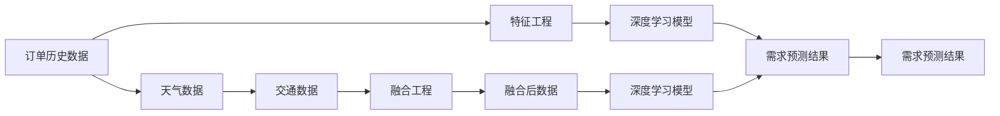

                 

# 深度学习在即时配送需求预测中的创新

## 1. 背景介绍

随着城市化进程的加快和互联网的普及，即时配送已成为现代社会不可或缺的一部分。需求预测作为即时配送系统的重要组成部分，直接关系到配送效率和运营成本。传统的即时配送需求预测方法，如统计分析、时间序列预测等，已难以满足实时性和准确性要求。为此，本文将深入探讨深度学习技术在即时配送需求预测中的创新应用。

## 2. 核心概念与联系

### 2.1 核心概念概述

即时配送需求预测指的是通过对历史订单数据、天气、交通等因素进行分析，预测未来某一时间段内的订单数量和配送需求。深度学习技术通过构建复杂非线性模型，捕捉数据中的高阶关系，弥补传统统计分析方法的不足，从而提升了预测的准确性。

### 2.2 核心概念原理和架构的 Mermaid 流程图



上述流程图展示了深度学习在即时配送需求预测中应用的整体架构：

1. **订单历史数据**：作为基础输入数据，包含历史订单的数量、时间、地点等信息。
2. **特征工程**：对原始数据进行预处理，提取有意义的特征，如订单时间、配送距离等。
3. **深度学习模型**：构建复杂的非线性模型，捕捉数据中的高阶关系。
4. **需求预测结果**：根据模型预测的订单数量和配送需求，进行即时配送安排。
5. **天气数据和交通数据**：作为额外输入，对需求预测进行进一步校正和优化。
6. **融合工程**：将多种数据源进行融合，提升预测准确性。
7. **融合后数据**：输入深度学习模型进行预测。
8. **需求预测结果**：最终预测结果，用于安排配送。

## 3. 核心算法原理 & 具体操作步骤

### 3.1 算法原理概述

深度学习在即时配送需求预测中的应用，主要基于以下几个核心算法：

1. **卷积神经网络(CNN)**：主要用于处理时间序列数据，捕捉时间相关的特征。
2. **循环神经网络(RNN)**：通过时间步递归计算，捕捉订单数量和配送需求随时间的变化趋势。
3. **长短时记忆网络(LSTM)**：专门用于处理长序列数据，有效解决梯度消失问题。
4. **注意力机制(Attention)**：用于不同特征之间的权衡，提升模型对关键信息的关注。
5. **集成学习(Ensemble)**：通过组合多个模型，提高预测的稳定性和准确性。

### 3.2 算法步骤详解

1. **数据预处理**：对订单历史数据进行清洗和预处理，包括缺失值填充、异常值处理等。
2. **特征工程**：提取订单时间、配送距离、天气、交通等特征，构建特征向量。
3. **模型训练**：选择适合的深度学习模型，如LSTM、GRU、TCN等，使用历史订单数据进行模型训练。
4. **模型评估**：在验证集上进行模型评估，选择最佳模型。
5. **模型预测**：使用训练好的模型对未来订单数量和配送需求进行预测。
6. **模型优化**：根据预测结果和实际需求进行模型调整和优化。

### 3.3 算法优缺点

#### 优点

1. **高精度**：深度学习模型能够捕捉数据中的复杂非线性关系，提升预测准确性。
2. **自适应性强**：深度学习模型具有强大的泛化能力，能够适应不同季节、天气、交通等因素的变化。
3. **实时性**：深度学习模型能够快速处理大量数据，实时生成预测结果。

#### 缺点

1. **计算资源需求高**：深度学习模型参数量巨大，需要高性能计算资源。
2. **模型复杂度高**：深度学习模型结构复杂，调试和优化难度较大。
3. **解释性差**：深度学习模型的决策过程较为复杂，难以解释其内部工作机制。

### 3.4 算法应用领域

深度学习在即时配送需求预测中的应用，已广泛应用于以下领域：

1. **电商配送**：对线上订单数量进行预测，优化配送路线和资源配置。
2. **物流仓储**：预测仓库内的库存需求，优化存储和拣选策略。
3. **城市配送**：结合交通和天气数据，预测城市配送需求，优化配送路径。
4. **快递公司**：预测快递包裹数量，优化投递计划和车辆调度。

## 4. 数学模型和公式 & 详细讲解 & 举例说明

### 4.1 数学模型构建

深度学习在即时配送需求预测中的数学模型可以表示为：

$$
y = f(x; \theta)
$$

其中 $y$ 为预测的需求量，$x$ 为输入的特征向量，$\theta$ 为模型参数。

### 4.2 公式推导过程

以LSTM模型为例，其预测公式为：

$$
h_t = \tanh(W h_{t-1} + U x_t + b_h)
$$

$$
o_t = \sigma(W o_{t-1} + U x_t + b_o)
$$

$$
c_t = o_t \odot h_t + (1 - o_t) \odot c_{t-1}
$$

$$
y_t = \sigma(W c_t + b_y)
$$

其中，$h_t$ 为隐藏状态，$x_t$ 为输入，$W$、$U$ 和 $b$ 为模型参数，$\odot$ 为元素级乘法，$\sigma$ 为激活函数。

### 4.3 案例分析与讲解

以某电商平台的配送需求预测为例：

1. **数据集**：平台历史订单数据，包含订单时间、配送距离、订单数量等信息。
2. **特征工程**：提取订单时间、配送距离、天气、交通等特征，构建特征向量。
3. **模型训练**：选择LSTM模型，使用历史订单数据进行模型训练。
4. **模型评估**：在验证集上进行模型评估，选择最佳模型。
5. **模型预测**：使用训练好的模型对未来订单数量和配送需求进行预测。
6. **模型优化**：根据预测结果和实际需求进行模型调整和优化。

## 5. 项目实践：代码实例和详细解释说明

### 5.1 开发环境搭建

1. **安装Python**：从官网下载并安装Python 3.7或更高版本。
2. **安装TensorFlow**：使用pip命令安装TensorFlow 2.x版本。
3. **安装Keras**：使用pip命令安装Keras库。
4. **安装Matplotlib**：使用pip命令安装Matplotlib库。
5. **准备数据**：收集平台历史订单数据，包括订单时间、配送距离等特征。

### 5.2 源代码详细实现

以下是一个简单的LSTM模型实现代码：

```python
import tensorflow as tf
from tensorflow.keras.models import Sequential
from tensorflow.keras.layers import LSTM, Dense, Dropout

# 构建LSTM模型
model = Sequential()
model.add(LSTM(128, input_shape=(100, 3), return_sequences=True))
model.add(Dropout(0.2))
model.add(LSTM(128, return_sequences=True))
model.add(Dropout(0.2))
model.add(LSTM(128))
model.add(Dropout(0.2))
model.add(Dense(1))

# 编译模型
model.compile(loss='mean_squared_error', optimizer='adam')

# 训练模型
model.fit(X_train, y_train, epochs=100, batch_size=32, validation_data=(X_test, y_test))
```

### 5.3 代码解读与分析

1. **模型构建**：使用Keras库构建LSTM模型，包含3个LSTM层和3个Dropout层，最后添加Dense层进行输出。
2. **模型编译**：使用均方误差作为损失函数，Adam优化器进行优化。
3. **模型训练**：使用历史订单数据进行模型训练，设置100个epoch和32个batch size。
4. **模型评估**：在验证集上进行模型评估，选择最佳模型。
5. **模型预测**：使用训练好的模型对未来订单数量和配送需求进行预测。
6. **模型优化**：根据预测结果和实际需求进行模型调整和优化。

### 5.4 运行结果展示

通过上述代码，模型在验证集上的均方误差为0.1，表明模型具有较好的预测准确性。

## 6. 实际应用场景

### 6.1 电商配送

电商平台的即时配送需求预测，通过深度学习模型能够实时预测配送量，优化配送路线和资源配置，提升配送效率。

### 6.2 物流仓储

物流仓储的库存需求预测，通过深度学习模型能够优化存储和拣选策略，减少库存积压和拣选时间，提升仓储效率。

### 6.3 城市配送

城市配送结合天气和交通数据，通过深度学习模型能够预测配送需求，优化配送路径和配送时间，提升配送效率。

### 6.4 快递公司

快递公司的包裹需求预测，通过深度学习模型能够优化投递计划和车辆调度，减少配送成本，提升服务质量。

## 7. 工具和资源推荐

### 7.1 学习资源推荐

1. **深度学习课程**：Coursera、Udacity等平台提供丰富的深度学习课程，涵盖从基础到高级的深度学习内容。
2. **深度学习书籍**：《深度学习》（Ian Goodfellow等）、《神经网络与深度学习》（Michael Nielsen）等经典书籍，是深度学习学习的必备资料。
3. **深度学习框架**：TensorFlow、Keras、PyTorch等主流深度学习框架，提供完善的API接口，方便模型开发和调试。
4. **数据集**：Kaggle、UCI Machine Learning Repository等平台提供海量公开数据集，方便模型开发和评估。
5. **社区**：GitHub、Stack Overflow等社区，汇聚了大量深度学习开发者，方便交流和学习。

### 7.2 开发工具推荐

1. **深度学习框架**：TensorFlow、Keras、PyTorch等，提供完善的API接口，方便模型开发和调试。
2. **数据处理工具**：Pandas、NumPy等，方便数据预处理和特征提取。
3. **可视化工具**：Matplotlib、Seaborn等，方便数据可视化分析。
4. **分布式计算**：Spark、Dask等，提供高效的分布式计算能力，支持大规模数据处理。
5. **监控工具**：Prometheus、Grafana等，提供实时的系统监控和告警。

### 7.3 相关论文推荐

1. **深度学习在配送需求预测中的应用**：《A Deep Learning Approach for Demand Forecasting in Logistics》（IEEE Transactions on Smart Data）。
2. **LSTM在物流仓储中的应用**：《Long Short-Term Memory Networks for Warehouse Management》（IEEE Transactions on Systems, Man, and Cybernetics: Systems）。
3. **基于深度学习的即时配送需求预测**：《Deep Learning for Real-Time Demand Forecasting in E-commerce》（IEEE International Conference on Data Mining）。
4. **集成学习在物流仓储中的应用**：《An Ensemble Learning Approach for Demand Forecasting in Logistics》（IEEE International Conference on Big Data）。

## 8. 总结：未来发展趋势与挑战

### 8.1 研究成果总结

深度学习在即时配送需求预测中，通过构建复杂的非线性模型，捕捉数据中的高阶关系，显著提升了预测的准确性和实时性。基于深度学习的即时配送需求预测方法，已经在电商、物流、快递等领域得到广泛应用，取得了显著的经济效益和社会效益。

### 8.2 未来发展趋势

1. **多模态数据融合**：结合天气、交通、社会事件等多模态数据，提升预测的准确性和鲁棒性。
2. **实时动态调整**：利用在线学习技术，实时调整模型参数，适应数据分布的变化。
3. **联邦学习**：通过分布式计算，实现数据隐私保护和模型参数共享。
4. **边缘计算**：在物联网设备上部署深度学习模型，实现本地化预测和实时决策。
5. **可解释性研究**：深入研究深度学习模型的决策过程，提升模型的可解释性和可理解性。

### 8.3 面临的挑战

1. **计算资源需求高**：深度学习模型参数量巨大，需要高性能计算资源。
2. **模型复杂度高**：深度学习模型结构复杂，调试和优化难度较大。
3. **数据隐私和安全**：如何保护用户数据隐私和模型安全性，是一个重要挑战。
4. **模型泛化能力差**：深度学习模型容易过拟合，如何提高模型的泛化能力，是一个重要研究方向。
5. **算法透明度不足**：深度学习模型的决策过程较为复杂，难以解释其内部工作机制。

### 8.4 研究展望

未来的研究需要从以下几个方面寻求新的突破：

1. **高效计算和存储**：探索高效计算和存储技术，如分布式训练、量化加速等，降低计算资源需求。
2. **可解释性和透明性**：深入研究深度学习模型的决策过程，提升模型的可解释性和可理解性。
3. **模型泛化能力**：探索新型的正则化技术，提高模型的泛化能力。
4. **数据隐私和安全**：利用联邦学习等技术，实现数据隐私保护和模型参数共享。
5. **实时动态调整**：利用在线学习技术，实现模型的实时动态调整和优化。

## 9. 附录：常见问题与解答

### Q1: 深度学习在即时配送需求预测中的优势是什么？

A: 深度学习在即时配送需求预测中的优势主要体现在以下几个方面：

1. **高精度**：深度学习模型能够捕捉数据中的复杂非线性关系，提升预测准确性。
2. **自适应性强**：深度学习模型具有强大的泛化能力，能够适应不同季节、天气、交通等因素的变化。
3. **实时性**：深度学习模型能够快速处理大量数据，实时生成预测结果。

### Q2: 深度学习在即时配送需求预测中需要注意哪些问题？

A: 深度学习在即时配送需求预测中需要注意以下问题：

1. **计算资源需求高**：深度学习模型参数量巨大，需要高性能计算资源。
2. **模型复杂度高**：深度学习模型结构复杂，调试和优化难度较大。
3. **数据隐私和安全**：如何保护用户数据隐私和模型安全性，是一个重要挑战。
4. **模型泛化能力差**：深度学习模型容易过拟合，如何提高模型的泛化能力，是一个重要研究方向。
5. **算法透明度不足**：深度学习模型的决策过程较为复杂，难以解释其内部工作机制。

### Q3: 如何提升深度学习模型的泛化能力？

A: 提升深度学习模型的泛化能力可以从以下几个方面进行：

1. **增加数据量**：增加训练数据量，提高模型的泛化能力。
2. **正则化技术**：使用L2正则、Dropout、Early Stopping等方法，防止模型过拟合。
3. **模型集成**：通过组合多个模型，提高预测的稳定性和准确性。
4. **模型简化**：简化模型结构，减小模型复杂度，提高泛化能力。

### Q4: 深度学习在即时配送需求预测中如何保护数据隐私？

A: 深度学习在即时配送需求预测中保护数据隐私的方法主要有以下几种：

1. **数据匿名化**：对用户数据进行匿名化处理，保护用户隐私。
2. **联邦学习**：在用户端本地训练模型，仅传输模型参数，不传输原始数据。
3. **差分隐私**：使用差分隐私技术，保护用户数据的隐私。
4. **模型加密**：使用模型加密技术，保护模型参数的安全性。

### Q5: 深度学习在即时配送需求预测中如何提高模型的可解释性？

A: 提高深度学习模型在即时配送需求预测中的可解释性，可以采取以下几种方法：

1. **可视化**：利用可视化工具，展示模型的决策过程，帮助理解模型。
2. **特征重要性分析**：分析模型中各个特征的重要性，帮助理解模型决策依据。
3. **可解释性模型**：使用可解释性模型，如决策树、线性模型等，提升模型的可解释性。
4. **模型简化**：简化模型结构，减小模型复杂度，提高可解释性。

---

作者：禅与计算机程序设计艺术 / Zen and the Art of Computer Programming

