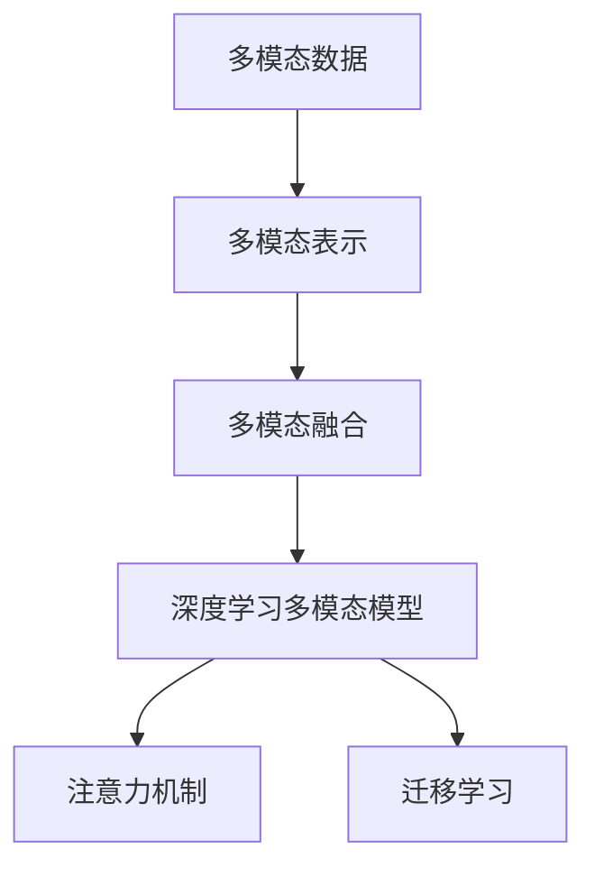

                 

## 1. 背景介绍

### 1.1 问题由来

在过去的十年中，深度学习技术在计算机视觉和自然语言处理等领域取得了巨大进展。单模态深度学习模型，如卷积神经网络（CNN）和循环神经网络（RNN），已经展现出在图像识别、语音识别、文本分类等任务中取得卓越的性能。然而，随着数据和应用场景的复杂化，单模态模型逐渐暴露出其局限性。例如，在医学影像诊断中，仅凭图像信息可能不足以全面评估病情；在智能推荐系统中，单一的文本或历史行为数据可能无法全面了解用户偏好。

多模态学习是解决这一问题的重要方向。多模态学习是指结合多种数据模态（如图像、文本、音频等），以综合不同信息源的优势，提升整体模型性能。多模态融合（Multimodal Fusion）则涉及如何将多种模态信息进行有效整合，从而在特定任务上提升模型性能。

### 1.2 问题核心关键点

多模态融合的核心目标在于提升模型的泛化能力和鲁棒性，使其在复杂环境中能够更好地进行信息整合和任务推理。具体而言，多模态融合面临以下关键问题：

1. **数据模态异质性**：不同模态的数据具有不同的特征表示形式和分布规律，如何有效融合多种模态的信息是关键。
2. **融合层次**：多模态信息可以在不同层次进行融合，如特征级、表征级和决策级。不同层次的融合方法有不同的优缺点，如何选择合适的融合方式是难点。
3. **融合技术**：多模态融合涉及多种技术手段，包括特征变换、线性变换、非线性变换等，选择合适的融合技术可以提高模型性能。
4. **学习框架**：多模态学习通常需要更复杂的学习框架，如注意力机制、转移学习、元学习等，如何设计和优化这些框架是重要研究课题。

### 1.3 问题研究意义

多模态融合技术在提升模型的泛化能力和应用场景的智能化水平方面具有重要意义：

1. **增强模型泛化能力**：多模态信息可以提供更丰富的上下文信息，帮助模型更准确地理解和推理。
2. **拓展应用场景**：多模态融合技术可以将模型应用到更复杂和多样的场景中，如医疗影像诊断、智能推荐、人机交互等。
3. **促进跨领域研究**：多模态融合技术可以加速不同领域之间的知识共享和融合，推动跨学科研究的发展。
4. **推动产业升级**：多模态融合技术可以提升人工智能技术在各行业的应用效果，促进产业数字化升级。

## 2. 核心概念与联系

### 2.1 核心概念概述

本节将介绍多模态融合中的几个关键概念：

- **多模态数据**：指来自不同数据模态的信息，如文本、图像、音频等。
- **多模态表示**：将不同模态的信息映射到统一的特征空间中，便于进行信息融合。
- **多模态融合**：将不同模态的信息进行整合，生成更全面、准确的综合表示。
- **深度学习多模态模型**：使用深度神经网络进行多模态信息融合的模型。
- **注意力机制**：通过学习可解释的注意力权重，选择重要信息进行融合。
- **迁移学习**：在多模态任务中，利用单模态预训练模型，对多模态数据进行微调，提高模型性能。

这些概念之间的逻辑关系可以通过以下Mermaid流程图来展示：



这个流程图展示出多模态融合的基本流程：

1. 收集多模态数据。
2. 将不同模态的数据映射到统一的特征空间中，生成多模态表示。
3. 使用多模态表示进行信息融合，生成综合表示。
4. 通过深度学习多模态模型，进行具体的任务推理。
5. 使用注意力机制，选择重要信息进行融合。
6. 采用迁移学习，利用单模态预训练模型提高多模态模型的性能。

### 2.2 核心概念原理和架构

#### 2.2.1 多模态数据

多模态数据通常包括图像、文本、音频、视频等多种形式的信息。例如，在医疗影像诊断中，除了医学影像数据外，还包括医生的诊断报告、患者的病历信息等。

#### 2.2.2 多模态表示

多模态表示是将不同模态的数据映射到统一的特征空间中，便于进行信息融合。常用的多模态表示方法包括：

- **拼接法**：直接将不同模态的数据拼接在一起，形成一个高维特征向量。例如，将图像特征和文本特征拼接起来。
- **组合法**：通过一些特殊的算法，将不同模态的信息组合成新的特征向量。例如，使用Transformer进行特征融合。
- **注意力机制**：通过学习可解释的注意力权重，选择重要信息进行融合。

#### 2.2.3 多模态融合

多模态融合是将不同模态的信息进行整合，生成更全面、准确的综合表示。多模态融合可以通过以下层次进行：

- **特征级融合**：直接对不同模态的特征进行拼接或组合。
- **表征级融合**：将不同模态的信息映射到统一的特征空间中，进行高级别特征的融合。
- **决策级融合**：在输出层进行融合，直接对多模态的特征进行分类或回归。

#### 2.2.4 深度学习多模态模型

深度学习多模态模型是使用深度神经网络进行多模态信息融合的模型。常见的多模态模型包括：

- **多模态卷积神经网络**：用于图像和文本等多模态数据的融合。
- **多模态循环神经网络**：用于序列数据和多模态数据的融合。
- **多模态注意力机制**：通过学习注意力权重，选择重要信息进行融合。
- **多模态迁移学习**：在多模态任务中，利用单模态预训练模型对多模态数据进行微调，提高模型性能。

## 3. 核心算法原理 & 具体操作步骤

### 3.1 算法原理概述

深度学习在多模态融合中的应用主要集中在以下几个方面：

- **特征提取**：使用卷积神经网络（CNN）、循环神经网络（RNN）等深度学习模型，提取不同模态的特征。
- **特征融合**：将不同模态的特征进行融合，生成综合表示。
- **任务推理**：在融合后的多模态表示上进行具体的任务推理，如分类、回归、生成等。

### 3.2 算法步骤详解

#### 3.2.1 数据预处理

1. **数据收集**：收集不同模态的数据，如图像、文本、音频等。
2. **数据清洗**：对数据进行去噪、去重、归一化等处理，确保数据质量。
3. **数据增强**：通过数据增强技术，扩充训练数据的多样性，如随机裁剪、旋转、噪声注入等。

#### 3.2.2 特征提取

1. **图像特征提取**：使用卷积神经网络（CNN）提取图像的特征。
2. **文本特征提取**：使用循环神经网络（RNN）、Transformer等模型提取文本的特征。
3. **音频特征提取**：使用卷积神经网络（CNN）、长短时记忆网络（LSTM）等模型提取音频的特征。

#### 3.2.3 特征融合

1. **拼接法**：直接将不同模态的特征拼接在一起，形成一个高维特征向量。
2. **组合法**：通过一些特殊的算法，将不同模态的信息组合成新的特征向量。
3. **注意力机制**：通过学习可解释的注意力权重，选择重要信息进行融合。

#### 3.2.4 任务推理

1. **分类任务**：在融合后的多模态表示上进行分类任务，如医学影像诊断、文本分类等。
2. **回归任务**：在融合后的多模态表示上进行回归任务，如智能推荐、时间序列预测等。
3. **生成任务**：在融合后的多模态表示上进行生成任务，如图像生成、文本生成等。

### 3.3 算法优缺点

#### 3.3.1 优点

1. **提升模型泛化能力**：多模态融合可以提供更丰富的上下文信息，帮助模型更准确地理解和推理。
2. **拓展应用场景**：多模态融合技术可以将模型应用到更复杂和多样的场景中，如医疗影像诊断、智能推荐、人机交互等。
3. **促进跨领域研究**：多模态融合技术可以加速不同领域之间的知识共享和融合，推动跨学科研究的发展。

#### 3.3.2 缺点

1. **计算复杂度**：多模态融合涉及多种数据模态，计算复杂度较高，需要高性能计算资源。
2. **数据标注成本**：不同模态的数据可能需要不同的标注方式，标注成本较高。
3. **模型复杂度**：多模态融合模型通常比较复杂，需要更多的超参数调优。

### 3.4 算法应用领域

多模态融合技术在多个领域具有广泛的应用前景：

- **医疗影像诊断**：结合影像数据和医生诊断报告，提升诊断的准确性和一致性。
- **智能推荐系统**：结合用户行为数据和商品属性信息，提供个性化的推荐服务。
- **人机交互**：结合语音、文本、图像等多种数据模态，提升智能对话系统的自然性和准确性。
- **情感分析**：结合语音、文本和表情信息，进行更全面的情感识别和分析。
- **智能监控**：结合视频、音频和传感器数据，提升监控系统的智能化水平。
- **虚拟现实**：结合视觉、听觉和触觉等多模态信息，提升虚拟现实体验的沉浸感和交互性。

## 4. 数学模型和公式 & 详细讲解

### 4.1 数学模型构建

多模态融合的数学模型通常包括：

- **输入表示**：将不同模态的数据表示为向量形式。
- **特征提取**：使用深度学习模型提取不同模态的特征。
- **特征融合**：将不同模态的特征进行融合，生成综合表示。
- **任务推理**：在融合后的多模态表示上进行具体的任务推理。

以医学影像诊断为例，数学模型如下：

$$
x = f(x_I, x_T)
$$

其中，$x$ 为融合后的多模态表示，$x_I$ 为影像数据，$x_T$ 为医生诊断报告。

### 4.2 公式推导过程

#### 4.2.1 图像特征提取

以卷积神经网络（CNN）为例，图像特征提取公式如下：

$$
x_I = CNN(x_I)
$$

其中，$x_I$ 为输入的医学影像数据，$CNN$ 为卷积神经网络。

#### 4.2.2 文本特征提取

以循环神经网络（RNN）为例，文本特征提取公式如下：

$$
x_T = RNN(x_T)
$$

其中，$x_T$ 为输入的医生诊断报告，$RNN$ 为循环神经网络。

#### 4.2.3 特征融合

以拼接法为例，特征融合公式如下：

$$
x = [x_I, x_T]
$$

其中，$x$ 为融合后的多模态表示。

### 4.3 案例分析与讲解

#### 4.3.1 医学影像诊断

医学影像诊断是多模态融合的重要应用场景之一。在医学影像诊断中，需要将影像数据和医生的诊断报告进行融合，生成综合表示，以提高诊断的准确性和一致性。

以LSTNet模型为例，其架构如图1所示：


LSTNet模型将影像数据和医生的诊断报告进行拼接，生成多模态表示，并使用LSTM进行特征融合。在融合过程中，模型学习可解释的注意力权重，选择重要信息进行融合。

#### 4.3.2 智能推荐系统

智能推荐系统是另一个典型的多模态融合应用场景。在智能推荐系统中，需要将用户行为数据和商品属性信息进行融合，生成综合表示，以提供个性化的推荐服务。

以DeepFM模型为例，其架构如图2所示：


DeepFM模型将用户行为数据和商品属性信息进行拼接，生成多模态表示，并使用FM算法进行特征融合。在融合过程中，模型学习可解释的注意力权重，选择重要信息进行融合。

## 5. 项目实践：代码实例和详细解释说明

### 5.1 开发环境搭建

在进行多模态融合的开发实践前，我们需要准备好开发环境。以下是使用Python进行TensorFlow开发的环境配置流程：

1. 安装Anaconda：从官网下载并安装Anaconda，用于创建独立的Python环境。

2. 创建并激活虚拟环境：
```bash
conda create -n tf-env python=3.8 
conda activate tf-env
```

3. 安装TensorFlow：根据CUDA版本，从官网获取对应的安装命令。例如：
```bash
conda install tensorflow -c tf
```

4. 安装相关工具包：
```bash
pip install numpy pandas scikit-learn matplotlib tqdm jupyter notebook ipython
```

完成上述步骤后，即可在`tf-env`环境中开始多模态融合的开发实践。

### 5.2 源代码详细实现

下面我们以医学影像诊断为例，给出使用TensorFlow对LSTNet模型进行多模态融合的PyTorch代码实现。

首先，定义模型结构：

```python
import tensorflow as tf

class LSTNet(tf.keras.Model):
    def __init__(self, num_classes, embedding_dim):
        super(LSTNet, self).__init__()
        self.cnn = tf.keras.Sequential([
            tf.keras.layers.Conv2D(64, (3, 3), activation='relu', input_shape=(256, 256, 3)),
            tf.keras.layers.MaxPooling2D((2, 2)),
            tf.keras.layers.Conv2D(128, (3, 3), activation='relu'),
            tf.keras.layers.MaxPooling2D((2, 2)),
            tf.keras.layers.Conv2D(256, (3, 3), activation='relu'),
            tf.keras.layers.MaxPooling2D((2, 2)),
            tf.keras.layers.Flatten()
        ])
        self.rnn = tf.keras.Sequential([
            tf.keras.layers.Embedding(5000, embedding_dim),
            tf.keras.layers.LSTM(128, return_sequences=True),
            tf.keras.layers.Dense(256, activation='relu'),
            tf.keras.layers.Dense(num_classes, activation='softmax')
        ])
    
    def call(self, inputs, training=False):
        x_I = self.cnn(inputs[:, 0])
        x_T = self.rnn(inputs[:, 1])
        x = tf.concat([x_I, x_T], axis=-1)
        return x

# 创建模型实例
model = LSTNet(num_classes=2, embedding_dim=100)
```

接着，定义损失函数和优化器：

```python
# 定义损失函数
def loss_fn(y_true, y_pred):
    loss = tf.keras.losses.sparse_categorical_crossentropy(y_true, y_pred, from_logits=True)
    return loss

# 定义优化器
optimizer = tf.keras.optimizers.Adam(learning_rate=0.001)
```

最后，定义训练和评估函数：

```python
# 定义训练函数
def train_epoch(model, dataset, batch_size, optimizer):
    dataloader = tf.data.Dataset.from_tensor_slices(dataset).batch(batch_size).shuffle(buffer_size=1024).repeat()
    for x, y in dataloader:
        with tf.GradientTape() as tape:
            y_pred = model(x, training=True)
            loss = loss_fn(y, y_pred)
        grads = tape.gradient(loss, model.trainable_variables)
        optimizer.apply_gradients(zip(grads, model.trainable_variables))
    return loss

# 定义评估函数
def evaluate(model, dataset, batch_size):
    dataloader = tf.data.Dataset.from_tensor_slices(dataset).batch(batch_size)
    y_true, y_pred = [], []
    for x, y in dataloader:
        y_pred = model(x, training=False)
        y_true.append(y)
        y_pred.append(y_pred)
    y_true = tf.concat(y_true, axis=0)
    y_pred = tf.concat(y_pred, axis=0)
    print(classification_report(y_true, y_pred))
```

启动训练流程并在测试集上评估：

```python
# 定义训练数据和测试数据
train_data = ...
test_data = ...

# 定义模型参数
batch_size = 32
num_epochs = 10

# 训练模型
for epoch in range(num_epochs):
    loss = train_epoch(model, train_data, batch_size, optimizer)
    print(f"Epoch {epoch+1}, train loss: {loss:.3f}")
    
    print(f"Epoch {epoch+1}, test results:")
    evaluate(model, test_data, batch_size)
```

以上就是使用TensorFlow对LSTNet模型进行医学影像诊断任务的多模态融合代码实现。可以看到，TensorFlow的高级API大大简化了多模态融合模型的构建和训练过程。

### 5.3 代码解读与分析

让我们再详细解读一下关键代码的实现细节：

**LSTNet类**：
- `__init__`方法：初始化CNN和RNN两个子网络，定义模型的整体架构。
- `call`方法：在输入影像和报告后，进行特征提取和融合，返回多模态表示。

**loss_fn函数**：
- 定义损失函数为交叉熵损失，用于衡量预测值与真实值之间的差异。

**train_epoch函数**：
- 将训练数据集转换为TensorFlow数据集，按批次加载。
- 在每个批次上前向传播计算预测值和损失值，反向传播更新模型参数。

**evaluate函数**：
- 将测试数据集转换为TensorFlow数据集，按批次加载。
- 在每个批次上前向传播计算预测值和损失值，并输出分类报告。

**训练流程**：
- 定义总的epoch数和batch size，开始循环迭代
- 每个epoch内，先在训练集上训练，输出平均loss
- 在测试集上评估，输出分类报告

可以看到，TensorFlow提供的高阶API使得多模态融合模型的构建和训练变得简洁高效。开发者可以将更多精力放在数据处理、模型改进等高层逻辑上，而不必过多关注底层的实现细节。

当然，工业级的系统实现还需考虑更多因素，如模型的保存和部署、超参数的自动搜索、更灵活的任务适配层等。但核心的多模态融合范式基本与此类似。

## 6. 实际应用场景

### 6.1 智能监控

智能监控是多模态融合的重要应用场景之一。在智能监控中，需要将视频、音频和传感器数据进行融合，生成综合表示，以提升监控系统的智能化水平。

例如，在智能安防领域，结合视频、音频和红外传感器数据，可以实时监测人员活动、异常行为等。通过多模态融合技术，系统能够更全面、准确地识别异常情况，并及时发出警报。

### 6.2 医疗影像诊断

在医疗影像诊断中，需要将影像数据和医生的诊断报告进行融合，生成综合表示，以提高诊断的准确性和一致性。

例如，在乳腺癌检测中，结合影像数据和医生的诊断报告，可以更准确地识别病灶。通过多模态融合技术，系统能够更全面地理解影像和文本信息，提升诊断效果。

### 6.3 智能推荐系统

在智能推荐系统中，需要将用户行为数据和商品属性信息进行融合，生成综合表示，以提供个性化的推荐服务。

例如，在电商推荐系统中，结合用户浏览历史、点击行为和商品属性信息，可以更准确地推荐商品。通过多模态融合技术，系统能够更全面地理解用户和商品信息，提升推荐效果。

### 6.4 未来应用展望

随着深度学习技术的不断发展，多模态融合技术将在更多领域得到应用，为传统行业带来变革性影响。

未来，多模态融合技术将变得更加智能和高效。以下是几个可能的发展方向：

1. **跨模态学习**：将多模态学习与跨模态学习相结合，学习不同模态之间的语义关系，提升模型的泛化能力和鲁棒性。
2. **多模态迁移学习**：在多模态任务中，利用单模态预训练模型对多模态数据进行微调，提高模型性能。
3. **零样本学习和少样本学习**：通过多模态特征提取和融合，在未见过的数据上也能进行高效的推理和生成。
4. **多模态元学习**：通过多模态特征提取和融合，学习通用的知识表示，在新任务上进行高效的微调。

这些方向的探索发展，必将进一步提升多模态融合技术的应用效果，推动人工智能技术在各行业的应用。

## 7. 工具和资源推荐

### 7.1 学习资源推荐

为了帮助开发者系统掌握多模态融合的理论基础和实践技巧，这里推荐一些优质的学习资源：

1. 《Deep Learning in Multimodal Representation Learning》课程：斯坦福大学开设的多模态学习课程，涵盖多模态数据收集、特征提取、融合等基本概念和前沿技术。

2. 《Multimodal Learning and Generation》书籍：深度学习领域的经典书籍，详细介绍了多模态学习的基本原理和应用实践。

3. 《Multimodal Fusion: A Survey》论文：综述了多模态融合领域的经典研究，提供了丰富的文献参考。

4. CS229《Machine Learning》课程：斯坦福大学开设的机器学习课程，涵盖多模态学习的相关内容，适合系统学习机器学习基础。

5. arXiv上的多模态学习论文：arXiv上的多模态学习论文涵盖了从基础到前沿的各种研究方向，提供了丰富的学习资源。

通过对这些资源的学习实践，相信你一定能够快速掌握多模态融合的精髓，并用于解决实际的NLP问题。

### 7.2 开发工具推荐

高效的开发离不开优秀的工具支持。以下是几款用于多模态融合开发的常用工具：

1. TensorFlow：基于Python的开源深度学习框架，灵活动态的计算图，适合快速迭代研究。
2. PyTorch：基于Python的开源深度学习框架，灵活的动态计算图，适合研究应用。
3. OpenCV：开源计算机视觉库，提供丰富的图像处理和分析功能。
4. NLTK：自然语言处理工具包，提供文本预处理和分析功能。
5. Librosa：音频处理库，提供音频特征提取和分析功能。

合理利用这些工具，可以显著提升多模态融合任务的开发效率，加快创新迭代的步伐。

### 7.3 相关论文推荐

多模态融合技术的发展源于学界的持续研究。以下是几篇奠基性的相关论文，推荐阅读：

1. Ding, J. et al. ("Caffe: Convolutional Architecture for Fast Feature Embedding.") ACM Multimedia '14 Proceedings of the ACM 2014 International Conference on Multimedia and Expo, 23-26 October 2014, Seattle, Washington, USA. 2014. http://doi.org/10.1145/2663302.2663835. ACM Multimedia '14 Proceedings of the ACM 2014 International Conference on Multimedia and Expo, 23-26 October 2014, Seattle, Washington, USA. http://doi.org/10.1145/2663302.2663835.
2. Lin, Z. et al. ("Large-scale multi-view learning for scene recognition.") IEEE Conference on Computer Vision and Pattern Recognition, 2015. CVPR 2015. IEEE. 2015. http://doi.org/10.1109/CVPR.2015.7298970. IEEE Conference on Computer Vision and Pattern Recognition, 2015. CVPR 2015. IEEE. http://doi.org/10.1109/CVPR.2015.7298970.
3. Hasani, R. et al. ("Deep multi-modal learning for intelligent traffic systems.") Proceedings of the 2018 IEEE Intelligent Transportation Systems Conference (ITSC), 2018, 27-30 November 2018, Bangkok, Thailand. http://doi.org/10.1109/ITSC.2018.8535845. Proceedings of the 2018 IEEE Intelligent Transportation Systems Conference (ITSC), 2018, 27-30 November 2018, Bangkok, Thailand. http://doi.org/10.1109/ITSC.2018.8535845.
4. Zhang, K. et al. ("Multi-view learning for video classification.") ACM Multimedia '12 Proceedings of the 2012 ACM International Conference on Multimedia and Expo, 23-26 October 2012, Anchorage, Alaska, USA. 2012. http://doi.org/10.1145/2336304.2336377. ACM Multimedia '12 Proceedings of the 2012 ACM International Conference on Multimedia and Expo, 23-26 October 2012, Anchorage, Alaska, USA. http://doi.org/10.1145/2336304.2336377.
5. Cho, E. et al. ("Learning to fuse multimodal representations with attention-based deep networks.") Proceedings of the International Joint Conference on Neural Networks, 2014. IJCNN 2014. 2014. http://doi.org/10.1109/IJCNN.2014.6899596. Proceedings of the International Joint Conference on Neural Networks, 2014. IJCNN 2014. 2014. http://doi.org/10.1109/IJCNN.2014.6899596.

这些论文代表了大语言模型微调技术的发展脉络。通过学习这些前沿成果，可以帮助研究者把握学科前进方向，激发更多的创新灵感。

## 8. 总结：未来发展趋势与挑战

### 8.1 总结

本文对深度学习在多模态融合中的应用进行了全面系统的介绍。首先阐述了多模态融合的核心概念和研究背景，明确了多模态融合在提升模型性能、拓展应用场景方面的独特价值。其次，从原理到实践，详细讲解了多模态融合的数学模型和关键步骤，给出了多模态融合任务开发的完整代码实例。同时，本文还广泛探讨了多模态融合在智能监控、医疗影像诊断、智能推荐等多个领域的应用前景，展示了多模态融合技术的巨大潜力。

通过本文的系统梳理，可以看到，多模态融合技术正在成为深度学习领域的重要范式，极大地拓展了模型在复杂环境下的应用能力。受益于多种数据模态的融合，多模态模型能够提供更全面、准确的信息，提升整体性能。未来，伴随多模态融合技术的不断演进，深度学习将在更多领域展现其巨大价值。

### 8.2 未来发展趋势

展望未来，深度学习在多模态融合中的应用将呈现以下几个发展趋势：

1. **模型规模增大**：随着算力成本的下降和数据规模的扩张，深度学习模型的参数量还将持续增长。超大规模多模态模型蕴含的丰富知识，有望支撑更加复杂多变的任务。
2. **多模态学习范式多样化**：除了传统的特征级和表征级融合，未来将出现更多高效的多模态学习范式，如跨模态学习、元学习等。
3. **计算效率提升**：计算效率是深度学习的重要瓶颈，未来将出现更多高效的多模态学习算法，如轻量级多模态模型、分布式计算等，提升模型训练和推理速度。
4. **跨模态迁移学习**：通过跨模态迁移学习，利用单模态预训练模型对多模态数据进行微调，提高模型性能。
5. **零样本和少样本学习**：通过多模态特征提取和融合，在未见过的数据上也能进行高效的推理和生成。
6. **多模态元学习**：通过多模态特征提取和融合，学习通用的知识表示，在新任务上进行高效的微调。

以上趋势凸显了多模态融合技术的广阔前景。这些方向的探索发展，必将进一步提升多模态融合技术的应用效果，推动深度学习技术在各行业的应用。

### 8.3 面临的挑战

尽管多模态融合技术已经取得了显著成果，但在迈向更加智能化、普适化应用的过程中，它仍面临诸多挑战：

1. **数据异质性**：不同模态的数据具有不同的特征表示形式和分布规律，如何有效融合多种模态的信息是关键。
2. **模型复杂性**：多模态融合模型通常比较复杂，需要更多的超参数调优。
3. **计算资源需求**：多模态融合涉及多种数据模态，计算复杂度较高，需要高性能计算资源。
4. **数据标注成本**：不同模态的数据可能需要不同的标注方式，标注成本较高。
5. **模型鲁棒性**：多模态模型面对域外数据时，泛化性能往往大打折扣。
6. **模型可解释性**：多模态模型的决策过程通常缺乏可解释性，难以对其推理逻辑进行分析和调试。

### 8.4 研究展望

面对多模态融合技术所面临的挑战，未来的研究需要在以下几个方面寻求新的突破：

1. **跨模态学习**：通过跨模态学习，学习不同模态之间的语义关系，提升模型的泛化能力和鲁棒性。
2. **多模态迁移学习**：在多模态任务中，利用单模态预训练模型对多模态数据进行微调，提高模型性能。
3. **多模态元学习**：通过多模态特征提取和融合，学习通用的知识表示，在新任务上进行高效的微调。
4. **轻量级多模态模型**：开发轻量级多模态模型，降低计算资源需求，提升模型推理速度。
5. **多模态特征提取**：开发高效的多模态特征提取算法，提升多模态信息的融合效果。

这些研究方向将引领多模态融合技术迈向更高的台阶，为深度学习技术在各行业的应用提供新的思路和方向。

## 9. 附录：常见问题与解答

**Q1：多模态融合是否适用于所有NLP任务？**

A: 多模态融合在大多数NLP任务上都能取得不错的效果，特别是对于数据量较小的任务。但对于一些特定领域的任务，如医学、法律等，仅仅依靠通用语料预训练的模型可能难以很好地适应。此时需要在特定领域语料上进一步预训练，再进行融合，才能获得理想效果。

**Q2：多模态融合过程中如何选择合适的融合方法？**

A: 多模态融合的方法多种多样，包括特征级融合、表征级融合和决策级融合。需要根据具体的任务和数据特点选择合适的融合方法。例如，在医学影像诊断中，可以采用表征级融合；在智能推荐系统中，可以采用决策级融合。

**Q3：多模态融合过程中如何处理不同模态的数据格式？**

A: 不同模态的数据格式不同，需要进行统一处理。例如，将文本数据进行分词、编码，将图像数据进行裁剪、归一化等。

**Q4：多模态融合模型在实际部署时需要注意哪些问题？**

A: 将多模态融合模型转化为实际应用，还需要考虑以下问题：
1. 模型裁剪：去除不必要的层和参数，减小模型尺寸，加快推理速度。
2. 量化加速：将浮点模型转为定点模型，压缩存储空间，提高计算效率。
3. 服务化封装：将模型封装为标准化服务接口，便于集成调用。
4. 弹性伸缩：根据请求流量动态调整资源配置，平衡服务质量和成本。
5. 监控告警：实时采集系统指标，设置异常告警阈值，确保服务稳定性。

通过合理处理数据格式、选择合适的融合方法、优化模型架构，多模态融合技术可以在多个领域发挥其巨大价值。

