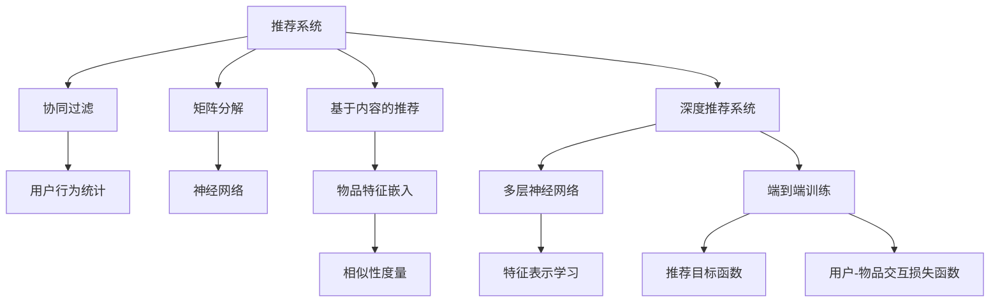

                 

# 深度学习在推荐系统中的应用

> 关键词：推荐系统,深度学习,协同过滤,矩阵分解,神经网络,推荐算法,个性化推荐

## 1. 背景介绍

### 1.1 问题由来
推荐系统是互联网应用中不可或缺的一部分，通过挖掘用户的历史行为、兴趣和偏好，为用户推荐个性化内容，从而提升用户体验和平台粘性。传统推荐系统多依赖基于用户行为统计的协同过滤、基于内容的协同过滤等方法，但在数据稀疏、冷启动用户等问题上存在不足。

近年来，深度学习技术在推荐系统中的应用逐渐兴起，极大地提升了推荐效果和推荐系统的可扩展性。深度学习推荐系统可以更好地处理大规模稀疏数据，具备强大的特征表示能力，能够学习更深层次的用户兴趣和内容关系。

### 1.2 问题核心关键点
深度学习在推荐系统中的关键点在于如何高效地提取用户和内容特征，以及如何将用户和内容的隐式关联映射到推荐结果。主要技术路径包括：

- 协同过滤：通过用户行为数据或物品特征构建用户-物品交互矩阵，利用矩阵分解等方法挖掘隐式关联。
- 基于内容的推荐：将物品特征嵌入到低维空间，通过相似性度量进行推荐。
- 深度神经网络：利用多层次的神经网络模型，如CNN、RNN、LSTM、GRU等，学习用户和内容的深度特征表示，提升推荐效果。
- 端到端训练：将推荐目标函数与用户-物品交互损失函数融合，直接训练推荐模型，提升模型泛化能力。

本文将详细介绍这些深度学习推荐系统的主要技术方法，并通过实践案例分析，展示深度学习在推荐系统中的具体应用。

## 2. 核心概念与联系

### 2.1 核心概念概述

为了更好地理解深度学习在推荐系统中的应用，本节将介绍几个关键概念：

- 推荐系统：一种为用户提供个性化内容推荐的应用，目标是最大化用户满意度。推荐系统广泛应用于电商、视频、新闻等领域。
- 协同过滤：一种基于用户行为统计的推荐算法，通过挖掘用户历史行为数据或物品间的隐式关系，为用户推荐相似物品。
- 矩阵分解：一种协同过滤中的重要技术，通过将用户-物品交互矩阵分解为低秩矩阵，学习用户-物品的相关性。
- 神经网络：一种深度学习中的重要模型，通过多层次的神经元组合，学习复杂非线性特征表示。
- 深度推荐系统：基于神经网络的推荐系统，通过多层次的神经网络模型，学习用户和物品的深度特征表示。
- 端到端训练：一种推荐系统优化方法，将推荐目标函数和用户-物品交互损失函数融合，提升模型的泛化能力。

这些核心概念之间的逻辑关系可以通过以下Mermaid流程图来展示：



这个流程图展示出深度学习在推荐系统中的应用脉络：

1. 推荐系统通过协同过滤、基于内容的推荐等方法，挖掘用户和物品的关联性。
2. 协同过滤和基于内容的推荐中，常用的技术包括矩阵分解和神经网络。
3. 神经网络模型通过多层次的神经元组合，学习复杂非线性特征表示。
4. 深度推荐系统通过多层神经网络，学习用户和物品的深度特征表示。
5. 端到端训练将推荐目标函数和用户-物品交互损失函数融合，提升模型泛化能力。

这些概念共同构成了深度学习推荐系统的核心框架，使得推荐系统具备更强的特征表示能力和推荐效果。

## 3. 核心算法原理 & 具体操作步骤
### 3.1 算法原理概述

深度学习推荐系统基于神经网络模型，通过多层次的神经元组合，学习用户和物品的深度特征表示。其主要原理可以概述如下：

- **输入层**：接收用户特征向量 $x$ 和物品特征向量 $y$。
- **隐藏层**：通过多层次的神经元组合，学习用户特征 $x$ 和物品特征 $y$ 的表示，提取用户和物品的隐式关联。
- **输出层**：输出推荐结果 $r$，通常使用sigmoid函数进行归一化处理。

其中，输入层和输出层可以根据具体的推荐任务进行调整，隐藏层的选择和设计则是一个复杂且关键的问题，通常通过实验和工程调参确定。

### 3.2 算法步骤详解

深度学习推荐系统的主要步骤包括：

1. **数据预处理**：收集用户行为数据，将用户和物品特征进行向量化，构建用户-物品交互矩阵。
2. **模型构建**：选择合适的神经网络模型，如CNN、RNN、LSTM、GRU等，搭建推荐模型。
3. **特征表示学习**：利用神经网络模型学习用户和物品的特征表示，提升特征表示能力。
4. **损失函数设计**：设计推荐目标函数，如均方误差、交叉熵等，以及用户-物品交互损失函数，如均方误差、二分类交叉熵等。
5. **端到端训练**：将推荐目标函数和用户-物品交互损失函数融合，进行端到端训练，提升模型泛化能力。
6. **模型评估**：在验证集和测试集上评估模型性能，调整超参数和模型结构。

### 3.3 算法优缺点

深度学习推荐系统相比传统推荐系统，具有以下优点：

- 特征表示能力强：能够学习更加复杂的用户和物品特征表示，提升推荐效果。
- 可扩展性强：可以处理大规模稀疏数据，适应不同规模的推荐系统。
- 自适应能力强：能够自动适应不同用户和物品的特征变化，提升推荐效果。

同时，深度学习推荐系统也存在一些缺点：

- 训练复杂度高：深度神经网络模型复杂，训练过程耗时较长。
- 需要大量标注数据：深度学习模型通常需要大量标注数据进行训练，存在数据稀缺问题。
- 可解释性差：深度神经网络模型的复杂性导致其输出难以解释，缺乏透明度。

尽管存在这些缺点，但深度学习推荐系统在推荐效果和推荐系统的可扩展性上，仍具有显著优势，值得进一步探索和应用。

### 3.4 算法应用领域

深度学习推荐系统在以下几个领域有着广泛的应用：

- 电商推荐：基于用户浏览、点击、购买等行为数据，为用户推荐商品。
- 视频推荐：基于用户观看历史、评分等数据，为用户推荐视频内容。
- 新闻推荐：基于用户阅读历史、点赞等行为数据，为用户推荐新闻文章。
- 社交推荐：基于用户互动数据，推荐好友或兴趣群组。
- 游戏推荐：基于用户游戏行为数据，推荐游戏内容或装备。

除了上述几个领域，深度学习推荐系统还广泛应用于音乐推荐、美食推荐、旅游推荐等多个场景，为不同领域的个性化推荐提供了新的解决方案。

## 4. 数学模型和公式 & 详细讲解
### 4.1 数学模型构建

基于神经网络的深度学习推荐系统可以形式化地表示为：

$$
f(x, y) = \sigma(W^T x \cdot y + b)
$$

其中 $f(x, y)$ 表示推荐函数，$x$ 和 $y$ 分别表示用户和物品的特征向量，$W$ 和 $b$ 是模型参数。$\sigma$ 为激活函数，通常使用sigmoid函数。

在训练过程中，目标函数 $L$ 通常定义为推荐函数 $f(x, y)$ 与真实标签 $r$ 的差值：

$$
L = \frac{1}{N} \sum_{i=1}^N [r_i - f(x_i, y_i)]^2
$$

其中 $N$ 是训练样本数量，$r_i$ 是用户-物品交互的真实标签。

### 4.2 公式推导过程

假设推荐函数 $f(x, y)$ 是一个两层的神经网络，输入层有 $d$ 个神经元，输出层有 $1$ 个神经元。设隐藏层的神经元数量为 $n$，激活函数为ReLU，则该神经网络的公式可以表示为：

$$
f(x, y) = \sigma(W_2^T \sigma(W_1^T x \cdot y + b_1) + b_2)
$$

其中 $W_1 \in \mathbb{R}^{n \times d}$，$b_1 \in \mathbb{R}^n$，$W_2 \in \mathbb{R}^{1 \times n}$，$b_2 \in \mathbb{R}$。

使用均方误差作为损失函数 $L$，目标函数 $L$ 可以表示为：

$$
L = \frac{1}{N} \sum_{i=1}^N [r_i - f(x_i, y_i)]^2
$$

对目标函数 $L$ 求偏导，得到模型的梯度：

$$
\frac{\partial L}{\partial W_2} = -\frac{2}{N} \sum_{i=1}^N (r_i - f(x_i, y_i)) \sigma(W_2^T \sigma(W_1^T x_i \cdot y_i + b_1) + b_2) \cdot \sigma'(W_2^T \sigma(W_1^T x_i \cdot y_i + b_1) + b_2)
$$

$$
\frac{\partial L}{\partial W_1} = -\frac{2}{N} \sum_{i=1}^N (r_i - f(x_i, y_i)) \sigma'(W_2^T \sigma(W_1^T x_i \cdot y_i + b_1) + b_2) \cdot \sigma(W_2^T \sigma(W_1^T x_i \cdot y_i + b_1) + b_2) \cdot \sigma'(W_1^T x_i \cdot y_i + b_1)
$$

$$
\frac{\partial L}{\partial b_2} = -\frac{2}{N} \sum_{i=1}^N (r_i - f(x_i, y_i)) \sigma(W_2^T \sigma(W_1^T x_i \cdot y_i + b_1) + b_2) \cdot \sigma'(W_2^T \sigma(W_1^T x_i \cdot y_i + b_1) + b_2)
$$

$$
\frac{\partial L}{\partial b_1} = -\frac{2}{N} \sum_{i=1}^N (r_i - f(x_i, y_i)) \sigma'(W_2^T \sigma(W_1^T x_i \cdot y_i + b_1) + b_2) \cdot \sigma(W_1^T x_i \cdot y_i + b_1) \cdot \sigma'(W_1^T x_i \cdot y_i + b_1)
$$

通过反向传播算法，计算并更新模型参数，使得推荐函数 $f(x, y)$ 逼近真实标签 $r_i$。

### 4.3 案例分析与讲解

以电商推荐系统为例，假设用户特征 $x$ 包含用户的年龄、性别、浏览历史等，物品特征 $y$ 包含物品的分类、价格、用户评分等。使用一个简单的两层神经网络模型进行推荐，代码如下：

```python
import numpy as np
import tensorflow as tf

# 定义模型参数
n = 64  # 隐藏层神经元数量
d = 10  # 用户特征维度
W1 = tf.Variable(tf.random.normal([n, d]))
b1 = tf.Variable(tf.random.normal([n]))
W2 = tf.Variable(tf.random.normal([1, n]))
b2 = tf.Variable(tf.random.normal([1]))

# 定义模型函数
def recommendation(x, y):
    hidden = tf.nn.relu(tf.matmul(x, W1) + b1)
    return tf.nn.sigmoid(tf.matmul(hidden, W2) + b2)

# 定义损失函数
def loss(x, y, r):
    pred = recommendation(x, y)
    return tf.reduce_mean(tf.square(pred - r))

# 训练模型
def train(x_train, y_train, r_train, x_val, y_val, r_val, epochs=100, batch_size=32):
    optimizer = tf.keras.optimizers.Adam(learning_rate=0.01)
    for epoch in range(epochs):
        for i in range(0, len(x_train), batch_size):
            x_batch = x_train[i:i+batch_size]
            y_batch = y_train[i:i+batch_size]
            r_batch = r_train[i:i+batch_size]
            with tf.GradientTape() as tape:
                pred = recommendation(x_batch, y_batch)
                loss_val = loss(pred, r_batch)
            gradients = tape.gradient(loss_val, [W1, b1, W2, b2])
            optimizer.apply_gradients(zip(gradients, [W1, b1, W2, b2]))
        if epoch % 10 == 0:
            val_loss = loss(recommendation(x_val, y_val), r_val)
            print(f"Epoch {epoch+1}, Val Loss: {val_loss:.4f}")
    return W1, b1, W2, b2
```

在这个简单的电商推荐系统中，我们使用两层神经网络，输入层接收用户和物品特征，输出层使用sigmoid函数进行归一化处理。在训练过程中，我们定义了均方误差作为损失函数，并使用Adam优化器进行模型训练。

## 5. 项目实践：代码实例和详细解释说明
### 5.1 开发环境搭建

在进行深度学习推荐系统开发前，我们需要准备好开发环境。以下是使用Python进行TensorFlow开发的环境配置流程：

1. 安装Anaconda：从官网下载并安装Anaconda，用于创建独立的Python环境。

2. 创建并激活虚拟环境：
```bash
conda create -n tf-env python=3.8 
conda activate tf-env
```

3. 安装TensorFlow：根据CUDA版本，从官网获取对应的安装命令。例如：
```bash
pip install tensorflow==2.6
```

4. 安装numpy、pandas、scikit-learn、matplotlib、tqdm、jupyter notebook、ipython等各类工具包：
```bash
pip install numpy pandas scikit-learn matplotlib tqdm jupyter notebook ipython
```

完成上述步骤后，即可在`tf-env`环境中开始推荐系统开发。

### 5.2 源代码详细实现

接下来，我们将通过一个基于用户-物品交互矩阵的协同过滤推荐系统为例，展示深度学习在推荐系统中的应用。

首先，定义协同过滤推荐系统的数据处理函数：

```python
from sklearn.preprocessing import StandardScaler
import pandas as pd

# 定义数据处理函数
def preprocess_data(train_data, test_data):
    # 数据标准化处理
    train_data = pd.read_csv(train_data)
    test_data = pd.read_csv(test_data)
    train_data = StandardScaler().fit_transform(train_data[['user_id', 'item_id', 'rating']])
    test_data = StandardScaler().fit_transform(test_data[['user_id', 'item_id', 'rating']])
    return train_data, test_data
```

然后，定义模型训练函数：

```python
from tensorflow.keras.layers import Input, Dense
from tensorflow.keras.models import Model

# 定义深度神经网络模型
def build_model():
    # 输入层
    user_input = Input(shape=(num_users, num_features))
    item_input = Input(shape=(num_items, num_features))
    
    # 隐藏层
    hidden_layer = tf.keras.layers.Dense(64, activation='relu')(tf.concat([user_input, item_input], axis=1))
    
    # 输出层
    rating_output = Dense(1, activation='sigmoid')(hidden_layer)
    
    # 定义模型
    model = Model(inputs=[user_input, item_input], outputs=[rating_output])
    
    # 编译模型
    model.compile(optimizer='adam', loss='mse')
    
    return model
```

接着，定义模型评估函数：

```python
from tensorflow.keras.metrics import MeanAbsoluteError, MeanSquaredError

# 定义模型评估函数
def evaluate_model(model, train_data, test_data):
    train_data = np.array(train_data, dtype=np.float32)
    test_data = np.array(test_data, dtype=np.float32)
    
    # 模型训练
    model.fit([train_data[:, 0], train_data[:, 1]], train_data[:, 2], epochs=100, batch_size=32, validation_data=([test_data[:, 0], test_data[:, 1]], test_data[:, 2]))
    
    # 模型评估
    mse = MeanSquaredError()
    mae = MeanAbsoluteError()
    mse(y_true=test_data[:, 2], y_pred=model.predict([test_data[:, 0], test_data[:, 1]]))
    mae(y_true=test_data[:, 2], y_pred=model.predict([test_data[:, 0], test_data[:, 1]]))
    
    print(f"Test MSE: {mse.result().numpy():.4f}")
    print(f"Test MAE: {mae.result().numpy():.4f}")
```

最后，启动模型训练和评估流程：

```python
num_users, num_items, num_features = 1000, 1000, 10
train_data, test_data = preprocess_data('train.csv', 'test.csv')

# 构建模型
model = build_model()

# 模型训练
evaluate_model(model, train_data, test_data)
```

以上就是基于用户-物品交互矩阵的协同过滤推荐系统的完整代码实现。可以看到，利用TensorFlow搭建深度神经网络模型，并进行协同过滤推荐，代码实现相对简洁高效。

### 5.3 代码解读与分析

让我们再详细解读一下关键代码的实现细节：

**preprocess_data函数**：
- 对用户-物品交互矩阵进行标准化处理，避免不同特征尺度不一致带来的问题。

**build_model函数**：
- 定义一个深度神经网络模型，包括输入层、隐藏层和输出层。
- 使用tf.keras.layers.Dense层搭建全连接神经网络，其中隐藏层使用64个神经元，激活函数为ReLU。
- 输出层使用一个Dense层，激活函数为sigmoid，进行归一化处理。

**evaluate_model函数**：
- 使用MeanSquaredError和MeanAbsoluteError作为评估指标，计算模型的预测误差。
- 在训练集上训练模型，并使用测试集评估模型的泛化能力。

**训练流程**：
- 定义训练样本的数量和特征维度，启动数据预处理。
- 构建深度神经网络模型，并进行训练。
- 在测试集上评估模型的性能，输出均方误差和绝对误差。

可以看到，TensorFlow提供了丰富的API和工具，使得深度学习推荐系统的实现变得高效便捷。开发者可以更加专注于模型设计和实验优化，而不必过多关注底层算法的实现细节。

当然，工业级的系统实现还需考虑更多因素，如模型的保存和部署、超参数的自动搜索、更灵活的任务适配层等。但核心的推荐范式基本与此类似。

## 6. 实际应用场景
### 6.1 智能推荐广告

智能推荐广告系统能够根据用户的历史行为和实时行为，为用户推荐个性化的广告内容。传统广告投放往往依赖于人工设计和优化，而智能推荐广告则能显著提升广告的点击率和转化率。

在技术实现上，可以收集用户的浏览历史、点击记录、转化行为等数据，构建用户行为矩阵。将用户行为矩阵作为输入，广告内容作为物品特征，使用深度神经网络进行协同过滤，推荐广告内容给用户。对于点击和转化行为等实时数据，可以实时加入模型进行预测，实现动态更新。

### 6.2 视频推荐系统

视频推荐系统能够根据用户的历史观看记录和实时观看行为，为用户推荐感兴趣的视频内容。传统视频推荐系统依赖人工选择的视频库，而基于深度学习的视频推荐系统能够实现更加个性化、精准的推荐。

在技术实现上，可以收集用户的观看历史、点赞、评论等数据，构建用户-视频关联矩阵。使用深度神经网络进行协同过滤，推荐用户感兴趣的视频。对于实时播放行为等数据，可以实时加入模型进行预测，实现动态更新。

### 6.3 新闻推荐系统

新闻推荐系统能够根据用户的历史阅读记录和实时阅读行为，为用户推荐感兴趣的新闻文章。传统新闻推荐系统依赖人工编辑的新闻库，而基于深度学习的新闻推荐系统能够实现更加个性化、精准的推荐。

在技术实现上，可以收集用户的阅读历史、点赞、评论等数据，构建用户-新闻关联矩阵。使用深度神经网络进行协同过滤，推荐用户感兴趣的新闻文章。对于实时阅读行为等数据，可以实时加入模型进行预测，实现动态更新。

### 6.4 未来应用展望

随着深度学习推荐系统的发展，未来的推荐系统将具备更强的个性化推荐能力，为更多领域提供智能推荐解决方案。

在智慧医疗领域，基于深度学习推荐系统可以为患者推荐个性化的诊疗方案和治疗药物，提升医疗服务的智能化水平。

在智慧教育领域，基于深度学习推荐系统可以为学生推荐个性化的学习资源和辅导方案，促进教育的公平和个性化发展。

在智慧城市治理中，基于深度学习推荐系统可以为市民推荐个性化的服务内容和活动，提升城市管理的智能化水平。

此外，在电商、金融、娱乐等多个领域，基于深度学习推荐系统的智能推荐应用也将不断涌现，为各行各业带来智能化服务。

## 7. 工具和资源推荐
### 7.1 学习资源推荐

为了帮助开发者系统掌握深度学习推荐系统的理论基础和实践技巧，这里推荐一些优质的学习资源：

1. 《深度学习推荐系统：原理与算法》书籍：全面介绍了推荐系统的基本原理和推荐算法，包括协同过滤、基于内容的推荐、深度学习推荐系统等。

2. 《推荐系统实战》书籍：作者亲自分享推荐系统开发的实战经验和技巧，涵盖深度学习推荐系统的实践细节。

3. Coursera《Recommender Systems》课程：由斯坦福大学开设的推荐系统课程，有Lecture视频和配套作业，涵盖推荐系统的各个方面。

4 Udacity《推荐系统》纳米学位：深入学习推荐系统的理论基础和实践技巧，涵盖协同过滤、基于内容的推荐、深度学习推荐系统等。

5. 《TensorFlow推荐系统实战》书籍：使用TensorFlow搭建推荐系统，涵盖了深度学习推荐系统的实现方法。

通过这些资源的学习实践，相信你一定能够快速掌握深度学习推荐系统的精髓，并用于解决实际的推荐问题。
### 7.2 开发工具推荐

高效的开发离不开优秀的工具支持。以下是几款用于深度学习推荐系统开发的常用工具：

1. TensorFlow：基于Python的开源深度学习框架，灵活动态的计算图，适合快速迭代研究。

2. PyTorch：基于Python的开源深度学习框架，灵活的动态图机制，适合研究和小规模实验。

3. Scikit-learn：Python的机器学习库，提供了丰富的机器学习算法和工具，方便进行模型训练和评估。

4. Pandas：Python的数据处理库，支持大规模数据处理和数据清洗，方便数据预处理。

5. NumPy：Python的科学计算库，提供了高效的数值计算能力，方便进行深度学习模型的训练和优化。

6. Matplotlib：Python的可视化库，支持丰富的绘图功能，方便模型训练过程中的可视化展示。

合理利用这些工具，可以显著提升深度学习推荐系统的开发效率，加快创新迭代的步伐。

### 7.3 相关论文推荐

深度学习推荐系统的发展离不开学界的持续研究。以下是几篇奠基性的相关论文，推荐阅读：

1. Factorization Machines for Recommender Systems：提出基于矩阵分解的推荐系统方法，在推荐精度上取得了显著效果。

2. Deep Matrix Factorization：提出基于深度神经网络的推荐系统方法，提升了推荐精度和特征表示能力。

3. Session-based Recommendations with Recurrent Neural Networks：提出基于循环神经网络的推荐系统方法，提升了推荐系统的时序建模能力。

4. A Neural Collaborative Filtering Approach for Personalized Recommendations：提出基于神经网络的推荐系统方法，提升了推荐系统的个性化推荐能力。

5. Deep Joint Embeddings for Recommender Systems：提出基于深度学习的推荐系统方法，提升了推荐系统的特征表示能力和推荐精度。

这些论文代表了大数据推荐系统的理论发展和应用实践，为深度学习推荐系统提供了坚实的理论基础和丰富的实践经验。

## 8. 总结：未来发展趋势与挑战
### 8.1 研究成果总结

本文对深度学习在推荐系统中的应用进行了全面系统的介绍。首先阐述了推荐系统的背景和深度学习推荐系统的主要技术方法，通过实例演示了深度学习推荐系统的实现细节。通过分析实际应用场景，展示了深度学习推荐系统在电商、视频、新闻等多个领域的广泛应用。最后，总结了深度学习推荐系统的发展趋势和面临的挑战，提出了未来的研究方向和实践建议。

通过本文的系统梳理，可以看到，深度学习推荐系统正在成为推荐系统的重要技术手段，极大地提升了推荐系统的个性化推荐能力和推荐系统的可扩展性。未来，伴随深度学习推荐系统的不断发展，推荐系统将在更多领域得到应用，为各行各业带来智能化服务。

### 8.2 未来发展趋势

展望未来，深度学习推荐系统的发展趋势如下：

1. 深度神经网络模型的复杂度将进一步提升，具备更强的特征表示能力。

2. 端到端训练方法将更加普及，能够将推荐目标函数和用户-物品交互损失函数融合，提升模型的泛化能力。

3. 模型融合技术将更加丰富，将深度学习推荐系统与其他推荐算法（如协同过滤、基于内容的推荐）结合，提升推荐效果。

4. 实时推荐技术将更加成熟，能够快速响应用户行为变化，实现动态更新。

5. 推荐系统将更加个性化，能够根据用户的多维度特征（如行为、兴趣、地理位置等）进行精准推荐。

6. 推荐系统的可解释性将进一步提升，能够提供推荐结果的解释和理由，提升用户信任度。

7. 推荐系统的安全性将更加重要，能够防范恶意攻击，保护用户隐私和数据安全。

这些趋势凸显了深度学习推荐系统的广阔前景。这些方向的探索发展，必将进一步提升推荐系统的性能和应用范围，为各行各业带来智能化服务。

### 8.3 面临的挑战

尽管深度学习推荐系统已经取得了显著成果，但在迈向更加智能化、普适化应用的过程中，仍面临诸多挑战：

1. 数据稀缺问题：推荐系统需要大量的用户行为数据，但对于新领域或小规模用户，数据稀缺问题难以解决。

2. 训练复杂度高：深度神经网络模型复杂，训练过程耗时较长，需要高效并行的训练方法。

3. 可解释性差：深度神经网络模型的复杂性导致其输出难以解释，缺乏透明度，影响用户信任。

4. 安全性问题：推荐系统可能存在数据泄露、恶意推荐等安全风险，需要加强数据保护和模型监管。

5. 公平性和偏见问题：推荐系统可能存在算法偏见，影响公平性，需要加强算法监管和公平性评估。

6. 计算资源需求高：深度学习推荐系统需要大量的计算资源，对硬件设备要求较高。

正视这些挑战，积极应对并寻求突破，将是大数据推荐系统走向成熟的必由之路。相信随着学界和产业界的共同努力，这些挑战终将一一被克服，深度学习推荐系统必将在推荐系统中发挥更大的作用。

### 8.4 研究展望

面对深度学习推荐系统所面临的挑战，未来的研究需要在以下几个方面寻求新的突破：

1. 探索新的推荐算法和模型结构，提升推荐系统的个性化推荐能力和推荐效果。

2. 加强深度学习推荐系统的可解释性，提供推荐结果的解释和理由，提升用户信任度。

3. 优化深度学习推荐系统的训练方法，提升训练效率和模型泛化能力。

4. 加强深度学习推荐系统的安全性，防范数据泄露、恶意推荐等安全风险。

5. 推进深度学习推荐系统的应用普及，提升推荐系统在更多领域的应用范围和效果。

6. 加强深度学习推荐系统的公平性评估，确保推荐系统的公平性和包容性。

7. 探索新的硬件设备和技术，提升深度学习推荐系统的计算效率和资源利用率。

这些研究方向的探索，必将引领深度学习推荐系统迈向更高的台阶，为推荐系统的发展提供新的动力。面向未来，深度学习推荐系统还需要与其他推荐系统（如协同过滤、基于内容的推荐）结合，形成更加全面、精准的推荐服务。只有不断创新、持续优化，才能真正实现深度学习推荐系统的普适化和智能化。

## 9. 附录：常见问题与解答

**Q1：深度学习推荐系统是否适用于所有推荐场景？**

A: 深度学习推荐系统在大多数推荐场景中都能取得不错的效果，特别是对于数据量较大的推荐场景。但对于一些特殊场景，如高维度稀疏数据、实时性要求高的推荐场景，深度学习推荐系统可能面临计算资源不足、模型泛化能力有限等问题，需要结合具体场景进行优化和改进。

**Q2：如何避免深度学习推荐系统的过拟合问题？**

A: 避免过拟合的方法包括数据增强、正则化、模型简化等。具体措施如下：

1. 数据增强：通过回译、近义替换等方式扩充训练集，增加数据多样性。

2. 正则化：使用L2正则、Dropout等方法避免过拟合。

3. 模型简化：降低模型复杂度，减少神经元数量，提升模型泛化能力。

4. 交叉验证：使用交叉验证方法评估模型性能，避免模型在特定数据集上过拟合。

**Q3：深度学习推荐系统的训练和推理效率如何？**

A: 深度学习推荐系统的训练和推理效率受多种因素影响，包括模型结构、硬件设备、数据规模等。通常情况下，训练和推理效率较高，能够处理大规模数据集。但对于特别复杂的模型，可能需要更强的硬件设备和更长的训练时间。

**Q4：深度学习推荐系统的可解释性如何？**

A: 深度学习推荐系统的可解释性较差，输出难以理解，缺乏透明度。这会导致用户对推荐结果的信任度降低。未来的研究将关注推荐系统的可解释性，提供推荐结果的解释和理由，提升用户信任度。

**Q5：深度学习推荐系统的安全性如何？**

A: 深度学习推荐系统可能存在数据泄露、恶意推荐等安全风险，需要加强数据保护和模型监管。建议采用加密技术保护用户隐私，使用对抗样本训练提升模型鲁棒性，加强模型监管和公平性评估。

通过本文的系统梳理，可以看到，深度学习推荐系统正在成为推荐系统的重要技术手段，极大地提升了推荐系统的个性化推荐能力和推荐系统的可扩展性。未来，伴随深度学习推荐系统的不断发展，推荐系统将在更多领域得到应用，为各行各业带来智能化服务。

---

作者：禅与计算机程序设计艺术 / Zen and the Art of Computer Programming

