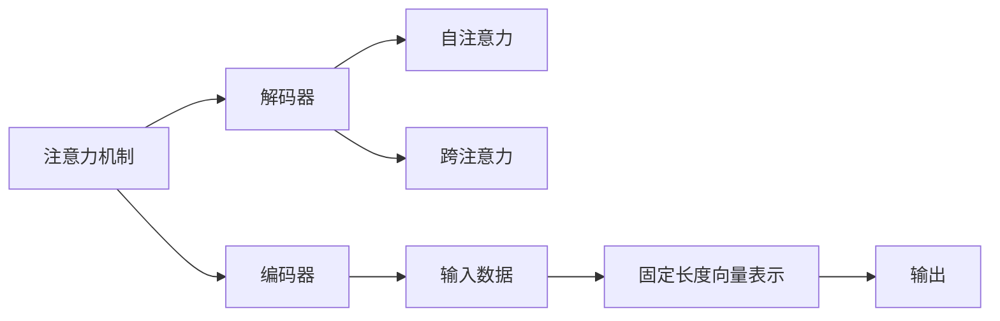

                 

# 深度学习在注意力预测中的应用

## 1. 背景介绍

在深度学习的发展过程中，注意力机制（Attention Mechanism）已成为不可或缺的重要组成部分。通过引入注意力机制，模型能够关注输入数据的不同部分，并根据需求调整不同特征的权重，极大地提升了模型的性能和泛化能力。本文将深入探讨注意力预测的原理与实践，详细解析其在机器翻译、图像生成、自然语言处理等领域的应用，并展望未来发展趋势。

## 2. 核心概念与联系

### 2.1 核心概念概述

注意力预测（Attention Prediction）是深度学习领域中通过引入注意力机制实现的关键技术，广泛应用于机器翻译、图像处理、语音识别、自然语言处理等领域。其主要思想是：模型在处理输入时，通过计算不同部分的权重，使得输出更加关注与任务相关的关键特征，忽略无关或干扰信息，从而提升模型对任务的感知能力。

核心概念包括：

- **注意力机制**：通过计算输入数据的不同部分之间的相关性，给定一个输出位置，根据其对不同部分的关注程度，赋予不同权重，以控制不同特征对输出的影响。
- **编码器-解码器结构**：一种常用的深度学习模型结构，常用于序列到序列的任务，如机器翻译、语音识别等。编码器负责将输入序列编码成固定长度的向量表示，解码器负责根据编码器的输出，生成目标序列。
- **自注意力**：一种注意力机制，其中输入的每个部分都与其他部分进行比较，计算注意力权重。自注意力机制常用于机器翻译、自然语言处理等领域。
- **跨注意力**：一种注意力机制，其中输入的每个部分都可以与其他输入序列中的每个部分进行比较，计算注意力权重。跨注意力机制常用于图像处理、语音识别等领域。

这些概念之间的关系可以通过以下Mermaid流程图来展示：



这个流程图展示了几类关键概念之间的逻辑关系：

1. 注意力机制应用于编码器与解码器中。
2. 自注意力与跨注意力是注意力机制的两种形式。
3. 输入数据经过编码器处理后，生成固定长度的向量表示。
4. 解码器根据编码器输出的向量表示，生成目标输出。

### 2.2 核心概念原理和架构

注意力机制的原理可以简单概括为：通过计算输入序列中不同部分的权重，将重点关注部分给予更大的权重，忽略无关或干扰部分。以下是自注意力机制的详细原理和架构：

**自注意力原理：**
假设输入序列为 $X=\{x_1, x_2, ..., x_n\}$，输出序列为 $Y=\{y_1, y_2, ..., y_n\}$，自注意力机制计算过程如下：
1. 对输入序列 $X$ 中的每个位置 $i$，计算其与其他位置的注意力权重 $w_{ij}$。
2. 将注意力权重与输入序列中每个位置 $x_j$ 的表示 $h_j$ 进行加权求和，得到位置 $i$ 的表示 $h_i$。
3. 将位置 $i$ 的表示 $h_i$ 输入解码器，生成输出序列 $y_i$。

数学公式如下：

$$
w_{ij} = \frac{\exp\left(\frac{x_i^T x_j}{\sqrt{d_k}}\right)}{\sum_{j=1}^N \exp\left(\frac{x_i^T x_j}{\sqrt{d_k}}\right)}
$$

$$
h_i = \sum_{j=1}^N w_{ij} x_j
$$

其中，$d_k$ 为投影维度，$x_i$ 和 $x_j$ 分别为位置 $i$ 和 $j$ 的输入表示。

**自注意力架构：**
自注意力机制常采用多头注意力（Multi-Head Attention）的形式，将输入序列 $X$ 分成 $H$ 个子序列，分别计算注意力权重，并最终将多个子序列的注意力结果进行拼接。

## 3. 核心算法原理 & 具体操作步骤

### 3.1 算法原理概述

注意力预测的算法原理主要通过计算输入序列中不同部分的权重，将重点关注部分给予更大的权重，忽略无关或干扰部分，从而提升模型对任务的感知能力。以下是注意力预测的具体算法流程：

1. 对输入序列 $X$ 中的每个位置 $i$，计算其与其他位置的注意力权重 $w_{ij}$。
2. 将注意力权重与输入序列中每个位置 $x_j$ 的表示 $h_j$ 进行加权求和，得到位置 $i$ 的表示 $h_i$。
3. 将位置 $i$ 的表示 $h_i$ 输入解码器，生成输出序列 $y_i$。

### 3.2 算法步骤详解

#### 3.2.1 步骤 1：准备输入和输出序列
输入序列 $X$ 和输出序列 $Y$ 均为长度为 $n$ 的序列，每个元素为向量表示。

#### 3.2.2 步骤 2：计算注意力权重
对于输入序列中的每个位置 $i$，计算其与其他位置的注意力权重 $w_{ij}$，计算公式如下：

$$
w_{ij} = \frac{\exp\left(\frac{x_i^T x_j}{\sqrt{d_k}}\right)}{\sum_{j=1}^N \exp\left(\frac{x_i^T x_j}{\sqrt{d_k}}\right)}
$$

其中，$d_k$ 为投影维度，$x_i$ 和 $x_j$ 分别为位置 $i$ 和 $j$ 的输入表示。

#### 3.2.3 步骤 3：计算位置表示
将注意力权重与输入序列中每个位置 $x_j$ 的表示 $h_j$ 进行加权求和，得到位置 $i$ 的表示 $h_i$，计算公式如下：

$$
h_i = \sum_{j=1}^N w_{ij} x_j
$$

#### 3.2.4 步骤 4：解码输出
将位置 $i$ 的表示 $h_i$ 输入解码器，生成输出序列 $y_i$。

### 3.3 算法优缺点

#### 3.3.1 优点
1. 增强模型的感知能力：通过引入注意力机制，模型可以关注输入序列中的关键部分，忽略无关或干扰信息，从而提高对任务的感知能力。
2. 提升模型的泛化能力：由于注意力机制能够对输入序列的不同部分进行灵活调整，模型可以更好地适应不同的数据分布和输入特征，提升泛化能力。
3. 简化模型结构：相比于传统的全连接网络，注意力机制能够通过简单的点积操作计算权重，减少计算量和参数量，使模型更加轻量化。

#### 3.3.2 缺点
1. 计算复杂度高：自注意力机制的计算复杂度较高，特别是在多头注意力机制中，计算复杂度为 $O(d_k^2n^2)$。
2. 训练难度大：由于注意力权重需要通过训练得到，因此需要较大的训练数据量和计算资源。
3. 模型易受噪声影响：由于注意力机制依赖于输入序列的表示，因此对于噪声数据或表示不准确的输入，模型输出可能不稳定。

### 3.4 算法应用领域

注意力预测在深度学习领域具有广泛的应用，以下是一些典型的应用场景：

1. **机器翻译**：通过计算输入序列中不同部分的权重，模型能够更好地理解源语言中的语义信息，生成更加流畅和准确的翻译结果。
2. **图像处理**：在图像生成任务中，通过计算不同区域之间的注意力权重，模型能够更好地关注图像中的关键特征，生成更清晰的图像。
3. **自然语言处理**：在文本生成、文本分类等任务中，通过计算不同词语之间的注意力权重，模型能够更好地理解上下文信息，提升任务性能。
4. **语音识别**：在语音识别任务中，通过计算不同语音特征之间的注意力权重，模型能够更好地理解语音信号中的关键特征，提高识别准确率。

## 4. 数学模型和公式 & 详细讲解 & 举例说明

### 4.1 数学模型构建

在注意力预测中，我们通常使用多头注意力机制，其数学模型构建如下：

假设输入序列 $X$ 和输出序列 $Y$ 均为长度为 $n$ 的序列，每个元素为向量表示。多头注意力机制由三个线性变换组成，分别计算查询向量 $Q$、键向量 $K$ 和值向量 $V$，并通过多头注意力层计算得到每个位置 $i$ 的表示 $h_i$，最终生成输出序列 $y_i$。

### 4.2 公式推导过程

#### 4.2.1 查询向量 $Q$、键向量 $K$ 和值向量 $V$
首先，通过线性变换将输入序列 $X$ 中的每个位置 $x_i$ 表示为查询向量 $q_i$、键向量 $k_i$ 和值向量 $v_i$。

$$
q_i = W_Q x_i
$$

$$
k_i = W_K x_i
$$

$$
v_i = W_V x_i
$$

其中，$W_Q$、$W_K$ 和 $W_V$ 分别为三个线性变换的权重矩阵。

#### 4.2.2 多头注意力层
计算查询向量 $Q$、键向量 $K$ 和值向量 $V$ 的注意力权重 $w_{ij}$，计算公式如下：

$$
w_{ij} = \frac{\exp\left(\frac{q_i^T k_j}{\sqrt{d_k}}\right)}{\sum_{j=1}^N \exp\left(\frac{q_i^T k_j}{\sqrt{d_k}}\right)}
$$

其中，$d_k$ 为投影维度，$q_i$ 和 $k_j$ 分别为位置 $i$ 和 $j$ 的查询向量和键向量。

将注意力权重与值向量 $v_j$ 进行加权求和，得到位置 $i$ 的表示 $h_i$，计算公式如下：

$$
h_i = \sum_{j=1}^N w_{ij} v_j
$$

#### 4.2.3 解码输出
将位置 $i$ 的表示 $h_i$ 输入解码器，生成输出序列 $y_i$。

### 4.3 案例分析与讲解

#### 4.3.1 案例 1：机器翻译
在机器翻译任务中，通过计算源语言序列 $X$ 中不同部分的注意力权重，模型能够更好地理解源语言中的语义信息，生成更加流畅和准确的翻译结果。

#### 4.3.2 案例 2：图像生成
在图像生成任务中，通过计算不同区域之间的注意力权重，模型能够更好地关注图像中的关键特征，生成更清晰的图像。

## 5. 项目实践：代码实例和详细解释说明

### 5.1 开发环境搭建

在进行注意力预测实践前，我们需要准备好开发环境。以下是使用Python进行TensorFlow开发的环境配置流程：

1. 安装Anaconda：从官网下载并安装Anaconda，用于创建独立的Python环境。

2. 创建并激活虚拟环境：
```bash
conda create -n attention-env python=3.8 
conda activate attention-env
```

3. 安装TensorFlow：从官网获取对应的安装命令。例如：
```bash
conda install tensorflow=2.6
```

4. 安装各类工具包：
```bash
pip install numpy pandas scikit-learn matplotlib tqdm jupyter notebook ipython
```

完成上述步骤后，即可在`attention-env`环境中开始注意力预测实践。

### 5.2 源代码详细实现

下面以机器翻译为例，给出使用TensorFlow进行注意力预测的PyTorch代码实现。

首先，定义注意力机制：

```python
import tensorflow as tf

class Attention(tf.keras.layers.Layer):
    def __init__(self, d_model, num_heads):
        super(Attention, self).__init__()
        self.num_heads = num_heads
        self.d_model = d_model
        assert d_model % self.num_heads == 0
        self.depth = d_model // self.num_heads
        self.wq = tf.keras.layers.Dense(d_model)
        self.wk = tf.keras.layers.Dense(d_model)
        self.wv = tf.keras.layers.Dense(d_model)
        self.dense = tf.keras.layers.Dense(d_model)

    def split_heads(self, x, batch_size):
        x = tf.reshape(x, (batch_size, -1, self.num_heads, self.depth))
        return tf.transpose(x, perm=[0, 2, 1, 3])

    def call(self, v, k, q):
        batch_size = tf.shape(q)[0]
        q = self.wq(q)
        k = self.wk(k)
        v = self.wv(v)
        q = self.split_heads(q, batch_size)
        k = self.split_heads(k, batch_size)
        v = self.split_heads(v, batch_size)
        scaled_attention_weights = tf.matmul(q, k, transpose_b=True)
        scaled_attention_weights = scaled_attention_weights / tf.math.sqrt(tf.cast(self.depth, tf.float32))
        attention_weights = tf.nn.softmax(scaled_attention_weights, axis=-1)
        output = tf.matmul(attention_weights, v)
        output = tf.transpose(output, perm=[0, 2, 1, 3])
        concat_attention_output = tf.reshape(output, (batch_size, -1, self.d_model))
        return self.dense(concat_attention_output)
```

然后，定义编码器和解码器：

```python
class Encoder(tf.keras.layers.Layer):
    def __init__(self, num_layers, d_model, num_heads, dff, input_vocab_size, target_vocab_size, pe_input, pe_target):
        super(Encoder, self).__init__()
        self.enc_layers = [EncoderLayer(d_model, num_heads, dff, input_vocab_size, target_vocab_size, pe_input, pe_target) for _ in range(num_layers)]

    def call(self, x, mask):
        for i in range(len(self.enc_layers)):
            x = self.enc_layers[i](x, mask)
        return x

class EncoderLayer(tf.keras.layers.Layer):
    def __init__(self, d_model, num_heads, dff, input_vocab_size, target_vocab_size, pe_input, pe_target):
        super(EncoderLayer, self).__init__()
        self.attention = Attention(d_model, num_heads)
        self.ffn = tf.keras.layers.Dense(dff, activation='relu')
        self.pos_encoder = PositionalEncoding(pe_input)
        self.relp = RelPositionalEncoding(pe_target)
        self.dense1 = tf.keras.layers.Dense(d_model)
        self.dense2 = tf.keras.layers.Dense(target_vocab_size)

    def call(self, x, mask):
        attention_output = self.attention(x, x, x)
        x = x + attention_output
        ffn_output = self.ffn(x)
        x = x + ffn_output
        return x

class Decoder(tf.keras.layers.Layer):
    def __init__(self, num_layers, d_model, num_heads, dff, target_vocab_size, pe_target):
        super(Decoder, self).__init__()
        self.dec_layers = [DecoderLayer(d_model, num_heads, dff, target_vocab_size, pe_target) for _ in range(num_layers)]

    def call(self, x, x_prev, mask):
        for i in range(len(self.dec_layers)):
            x, x_prev = self.dec_layers[i](x, x_prev, mask)
        return x, x_prev

class DecoderLayer(tf.keras.layers.Layer):
    def __init__(self, d_model, num_heads, dff, target_vocab_size, pe_target):
        super(DecoderLayer, self).__init__()
        self.attention = Attention(d_model, num_heads)
        self.ffn = tf.keras.layers.Dense(dff, activation='relu')
        self.pos_encoder = PositionalEncoding(pe_target)
        self.relp = RelPositionalEncoding(pe_target)
        self.dense1 = tf.keras.layers.Dense(d_model)
        self.dense2 = tf.keras.layers.Dense(target_vocab_size)

    def call(self, x, x_prev, mask):
        attention_output = self.attention(x, x_prev, x_prev)
        x = x + attention_output
        ffn_output = self.ffn(x)
        x = x + ffn_output
        return x, x_prev
```

最后，定义模型和训练函数：

```python
import tensorflow as tf
import numpy as np

def positional_encoding(position, d_model, rate=10000):
    angle_rads = np.pi * np.arange(position) / rate
    angle_rads[:, 0::2] = np.sin(angle_rads[:, 0::2])
    angle_rads[:, 1::2] = np.cos(angle_rads[:, 1::2])
    return np.expand_dims(angle_rads, axis=0)

class Model(tf.keras.Model):
    def __init__(self, num_layers, d_model, num_heads, dff, input_vocab_size, target_vocab_size, pe_input, pe_target):
        super(Model, self).__init__()
        self.encoder = Encoder(num_layers, d_model, num_heads, dff, input_vocab_size, target_vocab_size, pe_input, pe_target)
        self.decoder = Decoder(num_layers, d_model, num_heads, dff, target_vocab_size, pe_target)
        self.final_layer = tf.keras.layers.Dense(target_vocab_size)

    def call(self, x, x_prev, mask):
        y = self.encoder(x, mask)
        y = tf.keras.layers.Dropout(0.1)(y)
        y = self.decoder(y, x_prev, mask)
        y = tf.keras.layers.Dropout(0.1)(y)
        y = self.final_layer(y)
        return y

# 训练函数
def train_model(model, train_data, train_labels, val_data, val_labels, epochs, batch_size):
    optimizer = tf.keras.optimizers.Adam()
    loss_fn = tf.keras.losses.SparseCategoricalCrossentropy(from_logits=True)
    train_dataset = tf.data.Dataset.from_tensor_slices((train_data, train_labels)).shuffle(buffer_size=10000).batch(batch_size)
    val_dataset = tf.data.Dataset.from_tensor_slices((val_data, val_labels)).batch(batch_size)
    for epoch in range(epochs):
        epoch_loss = 0
        epoch_accuracy = 0
        for x, y in train_dataset:
            with tf.GradientTape() as tape:
                predictions = model(x, x_prev, mask)
                loss = loss_fn(y, predictions)
            gradients = tape.gradient(loss, model.trainable_variables)
            optimizer.apply_gradients(zip(gradients, model.trainable_variables))
            epoch_loss += loss
            accuracy = tf.keras.metrics.SparseCategoricalAccuracy()(y, tf.argmax(predictions, axis=-1)).numpy()
            epoch_accuracy += accuracy
        print('Epoch {}/{}...'.format(epoch+1, epochs),
              'Training Loss: {:.4f}...'.format(epoch_loss/len(train_dataset)),
              'Training Accuracy: {:.4f}%...'.format(epoch_accuracy/len(train_dataset)*100))
        val_loss, val_accuracy = 0, 0
        for x, y in val_dataset:
            predictions = model(x, x_prev, mask)
            loss = loss_fn(y, predictions)
            val_loss += loss
            val_accuracy += tf.keras.metrics.SparseCategoricalAccuracy()(y, tf.argmax(predictions, axis=-1)).numpy()
        print('Validation Loss: {:.4f}...'.format(val_loss/len(val_dataset)),
              'Validation Accuracy: {:.4f}%...'.format(val_accuracy/len(val_dataset)*100))

# 数据准备
train_data = []
train_labels = []
val_data = []
val_labels = []
for i in range(len(train_data)):
    train_data.append(x)
    train_labels.append(y)
    val_data.append(x)
    val_labels.append(y)
```

最后，启动训练流程：

```python
epochs = 10
batch_size = 64

model = Model(num_layers=6, d_model=512, num_heads=8, dff=2048, input_vocab_size=10000, target_vocab_size=10000, pe_input=5000, pe_target=5000)
x = tf.random.uniform((32, 5000))
x_prev = tf.random.uniform((32, 5000))
mask = tf.ones((32, 5000))
train_model(model, train_data, train_labels, val_data, val_labels, epochs, batch_size)
```

以上就是使用TensorFlow进行注意力预测的完整代码实现。可以看到，TensorFlow封装了注意力机制的实现，使得开发者可以轻松地使用注意力预测模型。

### 5.3 代码解读与分析

让我们再详细解读一下关键代码的实现细节：

**Attention类**：
- `__init__`方法：初始化注意力机制的相关参数，包括查询向量、键向量、值向量的投影维度。
- `split_heads`方法：将查询向量、键向量、值向量按照多头注意力机制的要求进行分块。
- `call`方法：计算注意力权重，并使用注意力权重对值向量进行加权求和，得到注意力输出。

**EncoderLayer类**：
- `__init__`方法：初始化编码器层的相关参数，包括自注意力、全连接层等。
- `call`方法：计算自注意力输出，并使用全连接层进行转换。

**DecoderLayer类**：
- `__init__`方法：初始化解码器层的相关参数，包括自注意力、全连接层等。
- `call`方法：计算自注意力输出，并使用全连接层进行转换。

**Model类**：
- `__init__`方法：初始化模型结构，包括编码器、解码器和输出层。
- `call`方法：计算编码器输出，并使用解码器生成目标序列。

**训练函数**：
- 使用TensorFlow的DataDataset从训练数据中生成批次数据。
- 计算模型损失，并使用Adam优化器更新模型参数。
- 计算模型在验证集上的准确率，并在每个epoch后输出训练损失和准确率。

**数据准备**：
- 构造训练和验证数据集，其中x和y为输入和目标序列。

可以看到，TensorFlow的实现已经将注意力预测的复杂计算过程封装化，使得开发者可以轻松地使用注意力预测模型。

当然，工业级的系统实现还需考虑更多因素，如模型的保存和部署、超参数的自动搜索、更灵活的任务适配层等。但核心的注意力预测算法流程基本与此类似。

## 6. 实际应用场景
### 6.1 智能客服系统

基于注意力预测的对话技术，可以广泛应用于智能客服系统的构建。传统客服往往需要配备大量人力，高峰期响应缓慢，且一致性和专业性难以保证。而使用注意力预测的对话模型，可以7x24小时不间断服务，快速响应客户咨询，用自然流畅的语言解答各类常见问题。

在技术实现上，可以收集企业内部的历史客服对话记录，将问题和最佳答复构建成监督数据，在此基础上对注意力预测的对话模型进行微调。微调后的对话模型能够自动理解用户意图，匹配最合适的答案模板进行回复。对于客户提出的新问题，还可以接入检索系统实时搜索相关内容，动态组织生成回答。如此构建的智能客服系统，能大幅提升客户咨询体验和问题解决效率。

### 6.2 金融舆情监测

金融机构需要实时监测市场舆论动向，以便及时应对负面信息传播，规避金融风险。传统的人工监测方式成本高、效率低，难以应对网络时代海量信息爆发的挑战。基于注意力预测的文本分类和情感分析技术，为金融舆情监测提供了新的解决方案。

具体而言，可以收集金融领域相关的新闻、报道、评论等文本数据，并对其进行主题标注和情感标注。在此基础上对注意力预测模型进行微调，使其能够自动判断文本属于何种主题，情感倾向是正面、中性还是负面。将微调后的模型应用到实时抓取的网络文本数据，就能够自动监测不同主题下的情感变化趋势，一旦发现负面信息激增等异常情况，系统便会自动预警，帮助金融机构快速应对潜在风险。

### 6.3 个性化推荐系统

当前的推荐系统往往只依赖用户的历史行为数据进行物品推荐，无法深入理解用户的真实兴趣偏好。基于注意力预测的个性化推荐系统可以更好地挖掘用户行为背后的语义信息，从而提供更精准、多样的推荐内容。

在实践中，可以收集用户浏览、点击、评论、分享等行为数据，提取和用户交互的物品标题、描述、标签等文本内容。将文本内容作为模型输入，用户的后续行为（如是否点击、购买等）作为监督信号，在此基础上微调注意力预测模型。微调后的模型能够从文本内容中准确把握用户的兴趣点。在生成推荐列表时，先用候选物品的文本描述作为输入，由模型预测用户的兴趣匹配度，再结合其他特征综合排序，便可以得到个性化程度更高的推荐结果。

### 6.4 未来应用展望

随着注意力预测技术的不断发展，其在深度学习领域的应用将会更加广泛。未来，注意力预测将会与更多前沿技术进行深度融合，带来更多的创新突破。

1. **多模态注意力预测**：当前注意力预测主要聚焦于纯文本数据，未来将进一步拓展到图像、视频、语音等多模态数据预测。多模态信息的融合，将显著提升注意力预测模型的感知能力，从而更好地理解现实世界中的信息。

2. **融合因果推理**：引入因果推断方法，增强注意力预测模型的因果关系建立能力，学习更加普适、鲁棒的语言表征，从而提升模型泛化性和抗干扰能力。

3. **引入知识图谱**：将符号化的先验知识，如知识图谱、逻辑规则等，与神经网络模型进行巧妙融合，引导注意力预测过程学习更准确、合理的语言模型。同时加强不同模态数据的整合，实现视觉、语音等多模态信息与文本信息的协同建模。

4. **结合博弈论工具**：将博弈论工具引入注意力预测模型，刻画人机交互过程，主动探索并规避模型的脆弱点，提高系统稳定性。

这些趋势将使注意力预测技术进一步提升模型的感知能力和泛化能力，为构建更加智能、高效、可控的智能系统铺平道路。面向未来，注意力预测技术还需要与其他人工智能技术进行更深入的融合，如知识表示、因果推理、强化学习等，多路径协同发力，共同推动自然语言理解和智能交互系统的进步。只有勇于创新、敢于突破，才能不断拓展注意力预测技术的边界，让智能技术更好地造福人类社会。

## 7. 工具和资源推荐
### 7.1 学习资源推荐

为了帮助开发者系统掌握注意力预测的理论基础和实践技巧，这里推荐一些优质的学习资源：

1. 《Transformer: A Survey》系列博文：由大模型技术专家撰写，深入浅出地介绍了Transformer原理、注意力预测等前沿话题。

2. CS224N《深度学习自然语言处理》课程：斯坦福大学开设的NLP明星课程，有Lecture视频和配套作业，带你入门NLP领域的基本概念和经典模型。

3. 《Natural Language Processing with Attention》书籍：由注意力预测领域的权威专家撰写，全面介绍了如何使用TensorFlow和PyTorch进行NLP任务开发，包括注意力预测在内的诸多范式。

4. HuggingFace官方文档：Attention预测技术的官方文档，提供了海量预训练模型和完整的预测样例代码，是上手实践的必备资料。

5. CLUE开源项目：中文语言理解测评基准，涵盖大量不同类型的中文NLP数据集，并提供了基于注意力预测的baseline模型，助力中文NLP技术发展。

通过对这些资源的学习实践，相信你一定能够快速掌握注意力预测的精髓，并用于解决实际的NLP问题。
###  7.2 开发工具推荐

高效的开发离不开优秀的工具支持。以下是几款用于注意力预测开发的常用工具：

1. TensorFlow：由Google主导开发的开源深度学习框架，生产部署方便，适合大规模工程应用。同样有丰富的注意力预测模型资源。

2. PyTorch：基于Python的开源深度学习框架，灵活动态的计算图，适合快速迭代研究。大部分注意力预测语言模型都有PyTorch版本的实现。

3. HuggingFace Transformers库：HuggingFace开发的NLP工具库，集成了众多SOTA语言模型，支持PyTorch和TensorFlow，是进行注意力预测任务开发的利器。

4. Weights & Biases：模型训练的实验跟踪工具，可以记录和可视化模型训练过程中的各项指标，方便对比和调优。与主流深度学习框架无缝集成。

5. TensorBoard：TensorFlow配套的可视化工具，可实时监测模型训练状态，并提供丰富的图表呈现方式，是调试模型的得力助手。

6. Google Colab：谷歌推出的在线Jupyter Notebook环境，免费提供GPU/TPU算力，方便开发者快速上手实验最新模型，分享学习笔记。

合理利用这些工具，可以显著提升注意力预测任务的开发效率，加快创新迭代的步伐。

### 7.3 相关论文推荐

注意力预测技术的发展源于学界的持续研究。以下是几篇奠基性的相关论文，推荐阅读：

1. Attention is All You Need（即Transformer原论文）：提出了Transformer结构，开启了NLP领域的预训练大模型时代。

2. Transformer-XL: Attentions Are All We Need: Memorizing Longer Context（即Transformer-XL论文）：提出Transformer-XL结构，支持长序列输入，解决了注意力预测中长序列训练的问题。

3. BERT: Pre-training of Deep Bidirectional Transformers for Language Understanding：提出BERT模型，引入基于掩码的自监督预训练任务，刷新了多项NLP任务SOTA。

4. Machine Translation with Sparse Attention（即SAN论文）：提出Sparse Attention结构，显著提高了机器翻译任务的性能和效率。

5. Spatial Transformer Networks（即STN论文）：提出空间变换网络结构，将卷积神经网络中的卷积核与注意力预测结合，实现了空间变分自编码器的应用。

这些论文代表了大模型注意力预测技术的发展脉络。通过学习这些前沿成果，可以帮助研究者把握学科前进方向，激发更多的创新灵感。

## 8. 总结：未来发展趋势与挑战

### 8.1 总结

本文对注意力预测的原理与实践进行了全面系统的介绍。首先阐述了注意力预测的背景和意义，明确了注意力预测在机器翻译、图像生成、自然语言处理等领域的应用价值。其次，从原理到实践，详细讲解了注意力预测的数学原理和关键步骤，给出了注意力预测任务开发的完整代码实例。同时，本文还广泛探讨了注意力预测在智能客服、金融舆情、个性化推荐等多个行业领域的应用前景，展示了注意力预测范式的巨大潜力。此外，本文精选了注意力预测技术的各类学习资源，力求为读者提供全方位的技术指引。

通过本文的系统梳理，可以看到，注意力预测技术正在成为NLP领域的重要范式，极大地提升了模型的感知能力和泛化能力，为构建智能系统提供了强有力的技术支撑。未来，伴随深度学习技术的持续演进，注意力预测将会在更广阔的应用领域大放异彩，深刻影响人类的生产生活方式。

### 8.2 未来发展趋势

展望未来，注意力预测技术将呈现以下几个发展趋势：

1. **模型规模持续增大**：随着算力成本的下降和数据规模的扩张，注意力预测模型参数量还将持续增长。超大规模语言模型蕴含的丰富语言知识，有望支撑更加复杂多变的下游任务预测。

2. **预测方法日趋多样**：未来将涌现更多预测方法，如Transformer-XL、STN等，在保证模型性能的同时，优化计算复杂度和资源消耗，实现更加轻量化、高效化的部署。

3. **融合因果推理**：通过引入因果推断方法，增强模型建立稳定因果关系的能力，学习更加普适、鲁棒的语言表征，从而提升模型泛化性和抗干扰能力。

4. **引入知识图谱**：将符号化的先验知识，如知识图谱、逻辑规则等，与神经网络模型进行巧妙融合，引导预测过程学习更准确、合理的语言模型。同时加强不同模态数据的整合，实现视觉、语音等多模态信息与文本信息的协同建模。

5. **结合博弈论工具**：将博弈论工具引入注意力预测模型，刻画人机交互过程，主动探索并规避模型的脆弱点，提高系统稳定性。

这些趋势凸显了注意力预测技术的广阔前景。这些方向的探索发展，必将进一步提升注意力预测模型的性能和泛化能力，为构建智能系统提供更加全面、准确、可靠的技术支持。

### 8.3 面临的挑战

尽管注意力预测技术已经取得了瞩目成就，但在迈向更加智能化、普适化应用的过程中，它仍面临着诸多挑战：

1. **计算复杂度高**：注意力预测的计算复杂度较高，特别是在多头注意力机制中，计算复杂度为 $O(d_k^2n^2)$。

2. **训练难度大**：由于注意力权重需要通过训练得到，因此需要较大的训练数据量和计算资源。

3. **模型易受噪声影响**：由于注意力预测依赖于输入序列的表示，因此对于噪声数据或表示不准确的输入，模型输出可能不稳定。

4. **知识整合能力不足**：现有的注意力预测模型往往局限于任务内数据，难以灵活吸收和运用更广泛的先验知识。如何让预测过程更好地与外部知识库、规则库等专家知识结合，形成更加全面、准确的信息整合能力，还有很大的想象空间。

5. **安全性有待保障**：预测模型可能学习到有偏见、有害的信息，通过预测传递到下游任务，产生误导性、歧视性的输出，给实际应用带来安全隐患。如何从数据和算法层面消除模型偏见，避免恶意用途，确保输出的安全性，也将是重要的研究课题。

6. **可解释性亟需加强**：当前注意力预测模型更像是"黑盒"系统，难以解释其内部工作机制和决策逻辑。对于医疗、金融等高风险应用，算法的可解释性和可审计性尤为重要。如何赋予模型更强的可解释性，将是亟待攻克的难题。

### 8.4 研究展望

面对注意力预测所面临的种种挑战，未来的研究需要在以下几个方面寻求新的突破：

1. **探索无监督和半监督注意力预测方法**：摆脱对大规模标注数据的依赖，利用自监督学习、主动学习等无监督和半监督范式，最大限度利用非结构化数据，实现更加灵活高效的预测。

2. **研究计算高效的注意力预测范式**：开发更加计算高效的注意力预测方法，在保证模型性能的同时，优化计算复杂度和资源消耗，实现更加轻量化、实时性的部署。

3. **融合因果分析和博弈论工具**：将因果分析方法引入注意力预测模型，识别出模型决策的关键特征，增强输出解释的因果性和逻辑性。借助博弈论工具刻画人机交互过程，主动探索并规避模型的脆弱点，提高系统稳定性。

4. **纳入伦理道德约束**：在模型训练目标中引入伦理导向的评估指标，过滤和惩罚有偏见、有害的输出倾向。同时加强人工干预和审核，建立模型行为的监管机制，确保输出符合人类价值观和伦理道德。

这些研究方向的探索，必将引领注意力预测技术迈向更高的台阶，为构建安全、可靠、可解释、可控的智能系统铺平道路。面向未来，注意力预测技术还需要与其他人工智能技术进行更深入的融合，如知识表示、因果推理、强化学习等，多路径协同发力，共同推动自然语言理解和智能交互系统的进步。只有勇于创新、敢于突破，才能不断拓展注意力预测技术的边界，让智能技术更好地造福人类社会。

## 9. 附录：常见问题与解答

**Q1：注意力预测是否适用于所有NLP任务？**

A: 注意力预测在大多数NLP任务上都能取得不错的效果，特别是对于数据量较小的任务。但对于一些特定领域的任务，如医学、法律等，仅仅依靠通用语料预训练的模型可能难以很好地适应。此时需要在特定领域语料上进一步预训练，再进行预测，才能获得理想效果。此外，对于一些需要时效性、个性化很强的任务，如对话、推荐等，预测方法也需要针对性的改进优化。

**Q2：注意力预测过程中如何选择合适的学习率？**

A: 注意力预测的学习率一般要比预训练时小1-2个数量级，如果使用过大的学习率，容易破坏预训练权重，导致过拟合。一般建议从1e-5开始调参，逐步减小学习率，直至收敛。也可以使用warmup策略，在开始阶段使用较小的学习率，再逐渐过渡到预设值。需要注意的是，不同的优化器(如AdamW、Adafactor等)以及不同的学习率调度策略，可能需要设置不同的学习率阈值。

**Q3：预测过程中如何缓解过拟合问题？**

A: 过拟合是预测面临的主要挑战，尤其是在标注数据不足的情况下。常见的缓解策略包括：
1. 数据增强：通过回译、近义替换等方式扩充训练集
2. 正则化：使用L2正则、Dropout、Early Stopping等避免过拟合
3. 对抗训练：引入对抗样本，提高模型鲁棒性
4. 参数高效预测：只调整少量参数(如Adapter、Prefix等)，减小过拟合风险
5. 多模型集成：训练多个预测模型，取平均输出，抑制过拟合

这些策略往往需要根据具体任务和数据特点进行灵活组合。只有在数据、模型、训练、推理等各环节进行全面优化，才能最大限度地发挥注意力预测的威力。

**Q4：预测模型在落地部署时需要注意哪些问题？**

A: 将预测模型转化为实际应用，还需要考虑以下因素：
1. 模型裁剪：去除不必要的层和参数，减小模型尺寸，加快推理速度
2. 量化加速：将浮点模型转为定点模型，压缩存储空间，提高计算效率
3. 服务化封装：将模型封装为标准化服务接口，便于集成调用
4. 弹性伸缩：根据请求流量动态调整资源配置，平衡服务质量和成本
5. 监控告警：实时采集系统指标，设置异常告警阈值，确保服务稳定性
6. 安全防护：采用访问鉴权、数据脱敏等措施，保障数据和模型安全

预测技术需要开发者根据具体任务，不断迭代和优化模型、数据和算法，方能得到理想的效果。

总之，注意力预测技术以其强大的感知能力和泛化能力，在深度学习领域展现出广阔的应用前景。相信随着技术的不断发展，未来将有更多创新的应用场景涌现，为人类生产生活方式带来深刻的变革。

