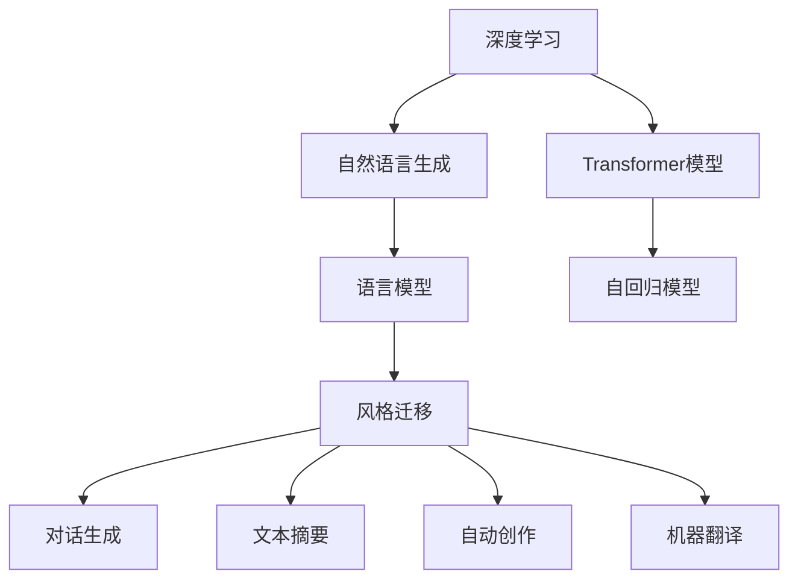

                 

# 深度学习在自然语言生成中的前沿技术

> 关键词：深度学习,自然语言生成(NLG),神经网络,Transformer,自回归模型,生成对抗网络(GAN),语言模型,风格迁移,对话生成,机器翻译

## 1. 背景介绍

### 1.1 问题由来

自然语言生成(Natural Language Generation, NLG)是人工智能领域的重要研究方向之一，旨在使机器能够自动生成流畅、自然的语言文本。深度学习技术的发展为NLG带来了革命性的变革，使得大规模语言模型能够自主地生成高质量的自然语言。

目前，基于深度学习的NLG技术在多个应用场景中已展现出了显著的优越性，如智能客服、翻译系统、文本摘要、自动创作、语音合成等。特别是Transformer结构的出现，使得深度学习模型在语言生成任务上取得了突破性进展。

Transformer模型以其自注意力机制，有效克服了传统RNN模型中的梯度消失问题，并且能够并行计算，大幅提升了模型训练和推理的速度。基于此，Transformer成为了目前主流的大规模语言模型结构，广泛应用于预训练和微调任务中。

然而，随着深度学习技术的不断演进，新兴的前沿技术正在推动NLG应用的边界进一步拓展。本文将从算法原理、操作步骤、应用场景等多个角度，全面系统地介绍深度学习在自然语言生成领域的前沿技术。

## 2. 核心概念与联系

### 2.1 核心概念概述

为更好地理解深度学习在自然语言生成中的应用，本节将介绍几个关键概念：

- **深度学习**：通过多个神经网络层来学习数据表示的高级特征，适用于复杂模式的建模。深度学习在图像、语音、自然语言处理等多个领域展现了卓越的表现。

- **自然语言生成**：利用深度学习模型，自动将输入的文本、语音等信息转换为自然语言输出。是自然语言处理(NLP)的一个重要分支，涉及到语言模型、对话生成、文本摘要、自动创作等任务。

- **Transformer模型**：一种基于自注意力机制的神经网络结构，用于处理序列数据。Transformer模型以高效并行、长距离依赖建模等优点，在语言生成任务中表现出色。

- **自回归模型**：一种经典序列生成模型，先输出序列的当前元素，然后根据已生成的元素预测下一个元素。自回归模型包括RNN、LSTM、GRU等结构。

- **生成对抗网络(GAN)**：一种生成模型与判别模型对抗训练的框架，用于生成逼真的数据样本。GAN在图像生成、文本生成等任务上展示了显著的效果。

- **语言模型**：用于预测文本序列中下一个词的概率分布，是自然语言生成任务的基础。包括基于规则的统计模型和基于深度学习的神经网络模型。

- **风格迁移**：将一段文本转换为特定风格的语言表达，如文学风格、语言风格、口音等。风格迁移技术使得深度学习模型能够进行语言风格的控制生成。

这些核心概念之间具有紧密的联系，构成了深度学习在自然语言生成领域的知识体系。掌握这些概念，将有助于更好地理解和应用深度学习技术。

### 2.2 核心概念原理和架构的 Mermaid 流程图



这个流程图展示了深度学习在自然语言生成中各个概念之间的联系：

1. **深度学习**是**自然语言生成**的基础。
2. **Transformer模型**是当前**自然语言生成**的核心，它基于自注意力机制，解决了长距离依赖问题。
3. **语言模型**作为**自然语言生成**的基石，用于预测下一个词的概率。
4. **自回归模型**是**语言模型**的一种，采用传统的RNN、LSTM等结构。
5. **生成对抗网络**用于**风格迁移**，能够生成特定风格的文本。
6. **对话生成、文本摘要、自动创作、机器翻译**等任务均基于**自然语言生成**。

这些概念共同构成了深度学习在自然语言生成领域的应用框架，为各类任务提供了有力支持。

## 3. 核心算法原理 & 具体操作步骤
### 3.1 算法原理概述

深度学习在自然语言生成中的核心算法主要是基于Transformer模型的自注意力机制，通过编码器-解码器框架实现序列数据的生成。其基本思想是通过自注意力机制捕捉输入序列和输出序列之间的依赖关系，生成自然流畅的语言文本。

具体而言，深度学习在自然语言生成中的算法原理包括以下几个关键步骤：

1. **编码器**：对输入序列进行编码，生成上下文表示。编码器通常由多层Transformer组成，通过自注意力机制捕捉输入序列中的长距离依赖。
2. **解码器**：根据编码器的上下文表示，生成目标序列。解码器同样由多层Transformer组成，通过自注意力机制和位置编码生成与输入序列相关的文本。
3. **生成目标**：利用softmax层输出每个可能的目标词的概率分布，选择概率最大的词汇作为下一个生成的词。
4. **训练**：通过最大似然估计等方法，优化模型参数，使得模型能够生成符合语法和语义规则的自然语言文本。

### 3.2 算法步骤详解

深度学习在自然语言生成中的操作步骤主要包括以下几个步骤：

**Step 1: 准备数据集**

自然语言生成任务需要大量的文本数据作为训练集。通常，可以从公开的数据集或自定义的数据集中获取。常用的数据集包括维基百科、新闻、书评等。

**Step 2: 数据预处理**

将原始文本数据进行分词、去除停用词、标记化等预处理操作，生成模型所需的输入和目标序列。例如，对于英语文本，可以将每个单词转化为一个单独的token。

**Step 3: 构建模型架构**

选择合适的深度学习模型架构，如Transformer模型、LSTM模型等。例如，对于自然语言生成任务，通常使用编码器-解码器结构，并添加softmax层进行预测。

**Step 4: 训练模型**

将准备好的数据集输入模型进行训练，通过反向传播算法和梯度下降法优化模型参数，使得模型能够生成高质量的自然语言文本。训练过程中，可以使用不同的损失函数，如交叉熵损失、序列生成损失等。

**Step 5: 评估和测试**

在测试集上对模型进行评估，计算生成文本的质量指标，如BLEU、ROUGE等，评估模型的性能。

**Step 6: 应用**

将训练好的模型应用于实际应用场景中，如智能客服、机器翻译、文本摘要等，生成自然流畅的语言文本。

### 3.3 算法优缺点

深度学习在自然语言生成中的算法具有以下优点：

- **生成自然流畅的文本**：深度学习模型能够学习到语言的高级语法和语义特征，生成自然流畅的语言文本。
- **长距离依赖建模**：Transformer模型通过自注意力机制，能够有效地捕捉输入序列和输出序列之间的长距离依赖关系。
- **高效并行计算**：Transformer模型的自注意力机制可以通过并行计算加速训练过程。
- **适应性强**：深度学习模型能够适应各种类型的自然语言生成任务，如对话生成、文本摘要、机器翻译等。

同时，深度学习在自然语言生成中也存在一些缺点：

- **数据依赖性强**：深度学习模型需要大量的标注数据进行训练，数据稀缺的情况下，模型性能可能受到影响。
- **模型复杂度高**：深度学习模型通常包含大量的参数，训练和推理过程需要高性能的计算资源。
- **对抗样本脆弱**：深度学习模型可能受到对抗样本的攻击，生成不自然的语言文本。
- **解释性不足**：深度学习模型生成文本的过程难以解释，缺乏可解释性。

尽管存在这些缺点，深度学习在自然语言生成中的应用依然广泛，为多个领域带来了革命性的变革。未来，相关的研究将进一步探索如何降低数据依赖性、提高模型的鲁棒性和可解释性，使得深度学习在自然语言生成中的性能更加强大。

### 3.4 算法应用领域

深度学习在自然语言生成中的算法广泛应用于多个领域，包括：

- **对话生成**：如智能客服、聊天机器人等，通过深度学习模型生成自然流畅的对话文本。
- **文本摘要**：如新闻摘要、科技文章摘要等，生成简洁准确的摘要文本。
- **自动创作**：如诗歌创作、文章写作等，生成富有创意和文学性的文本。
- **机器翻译**：将一种语言的文本翻译成另一种语言的文本，生成自然流畅的翻译结果。
- **语音合成**：如TTS系统，将文本转换为自然流畅的语音。

此外，深度学习在自然语言生成中的算法还应用于情感分析、文本分类、推荐系统等多个领域，推动了人工智能技术的全面发展。

## 4. 数学模型和公式 & 详细讲解  
### 4.1 数学模型构建

自然语言生成任务的数学模型可以表示为：

$$
P(x_t | x_{<t}, \theta) = \frac{\exp\left(\sum_{i=1}^n \log p(x_t | x_{<t}, \theta_i)\right)}{\sum_{x_{<t}} \exp\left(\sum_{i=1}^n \log p(x_t | x_{<t}, \theta_i)\right)}
$$

其中，$x_t$ 表示序列中的第 $t$ 个元素，$x_{<t}$ 表示 $x_{<t}$ 序列的所有元素，$\theta$ 为模型参数，$p$ 为概率分布。

### 4.2 公式推导过程

以自回归语言模型为例，假设输入序列为 $x_1, x_2, ..., x_t$，目标序列为 $y_1, y_2, ..., y_t$，模型的参数为 $\theta$。根据自回归模型的定义，目标序列 $y_t$ 的生成过程可以表示为：

$$
p(y_t | y_{<t}, x_{<t}, \theta) = \prod_{i=1}^t p(y_i | y_{<i}, x_{<t}, \theta)
$$

通过最大似然估计，优化模型参数 $\theta$，使得 $p(y_t | y_{<t}, x_{<t}, \theta)$ 最大。具体而言，可以使用交叉熵损失函数来计算模型和真实数据之间的差异：

$$
L(y_t, \hat{y_t}) = -\log p(y_t | y_{<t}, x_{<t}, \theta)
$$

通过反向传播算法，计算梯度并更新模型参数 $\theta$，最小化损失函数 $L$。

### 4.3 案例分析与讲解

以机器翻译为例，假设输入序列为英语句子 "I love you"，目标序列为法语句子 "J'aime toi"。使用Transformer模型进行机器翻译，具体步骤如下：

1. 将输入序列和目标序列分别进行分词，生成token序列。
2. 使用Transformer模型进行编码，生成上下文表示。
3. 使用Transformer模型进行解码，生成目标序列的概率分布。
4. 选择概率最大的词汇，作为下一个生成的词。
5. 重复步骤2-4，直至生成完整的翻译结果。

通过对Transformer模型的训练和测试，可以发现其能够生成高质量的翻译结果。通过调整模型参数和训练策略，可以实现不同语言之间的翻译。

## 5. 项目实践：代码实例和详细解释说明
### 5.1 开发环境搭建

在进行自然语言生成项目的开发之前，需要准备好开发环境。以下是使用Python进行PyTorch开发的环境配置流程：

1. 安装Anaconda：从官网下载并安装Anaconda，用于创建独立的Python环境。

2. 创建并激活虚拟环境：
```bash
conda create -n pytorch-env python=3.8 
conda activate pytorch-env
```

3. 安装PyTorch：根据CUDA版本，从官网获取对应的安装命令。例如：
```bash
conda install pytorch torchvision torchaudio cudatoolkit=11.1 -c pytorch -c conda-forge
```

4. 安装各类工具包：
```bash
pip install numpy pandas scikit-learn matplotlib tqdm jupyter notebook ipython
```

完成上述步骤后，即可在`pytorch-env`环境中开始开发实践。

### 5.2 源代码详细实现

这里我们以机器翻译任务为例，给出使用PyTorch进行Transformer模型微调的PyTorch代码实现。

首先，定义机器翻译任务的数据处理函数：

```python
import torch
import torch.nn as nn
import torch.optim as optim
from torchtext.datasets import Multi30k
from torchtext.data import Field, BucketIterator

class MachineTranslationDataset:
    def __init__(self, train, test, tokenizer):
        self.train = train
        self.test = test
        self.tokenizer = tokenizer
        
        # 定义tokenizer处理方式
        self.train = self._tokenize(self.train)
        self.test = self._tokenize(self.test)
        
        # 定义token id的映射
        self.token_id = self._build_token_id()
        
    def _tokenize(self, dataset):
        text = []
        for i in range(len(dataset)):
            src, tgt = dataset[i][0], dataset[i][1]
            text.append((src, tgt))
        return text
            
    def _build_token_id(self):
        token_id = []
        for i in range(len(self.train)):
            src, tgt = self.train[i]
            token_id.append({'src': [self.tokenizer.tokenize(token) for token in src], 'tgt': [self.tokenizer.tokenize(token) for token in tgt]})
        return token_id
```

然后，定义模型和优化器：

```python
class Transformer(nn.Module):
    def __init__(self, src_vocab_size, tgt_vocab_size, d_model, nhead, nhid, nlayers):
        super(Transformer, self).__init__()
        
        # 定义编码器
        self.encoder = nn.Transformer(encoder_layer=nn.TransformerEncoderLayer(d_model, nhead, nhid, dropout=0.1), nlayer=nlayers, norm=nn.LayerNorm(d_model))
        
        # 定义解码器
        self.decoder = nn.TransformerDecoderLayer(d_model, nhead, nhid, dropout=0.1, bias=True)
        
        # 定义softmax层
        self.softmax = nn.Linear(d_model, tgt_vocab_size)
        
    def forward(self, src, tgt, mask):
        # 编码器
        src = self.encoder(src)
        
        # 解码器
        tgt = self.decoder(tgt, src, src, mask)
        
        # softmax层
        tgt = self.softmax(tgt)
        
        return tgt

model = Transformer(src_vocab_size=10000, tgt_vocab_size=10000, d_model=512, nhead=8, nhid=2048, nlayers=6)
optimizer = optim.Adam(model.parameters(), lr=0.001)
criterion = nn.CrossEntropyLoss()
```

接着，定义训练和评估函数：

```python
def train_epoch(model, data_loader, optimizer, criterion, device):
    model.train()
    epoch_loss = 0
    for batch in data_loader:
        src, tgt, mask = batch
        src, tgt, mask = src.to(device), tgt.to(device), mask.to(device)
        model.zero_grad()
        output = model(src, tgt, mask)
        loss = criterion(output, tgt.view(-1))
        loss.backward()
        optimizer.step()
        epoch_loss += loss.item()
    return epoch_loss / len(data_loader)

def evaluate(model, data_loader, device):
    model.eval()
    total_loss = 0
    with torch.no_grad():
        for batch in data_loader:
            src, tgt, mask = batch
            src, tgt, mask = src.to(device), tgt.to(device), mask.to(device)
            output = model(src, tgt, mask)
            loss = criterion(output, tgt.view(-1))
            total_loss += loss.item()
    return total_loss / len(data_loader)
```

最后，启动训练流程并在测试集上评估：

```python
device = torch.device('cuda' if torch.cuda.is_available() else 'cpu')

train_dataset = MachineTranslationDataset(train_data, tokenizer)
test_dataset = MachineTranslationDataset(test_data, tokenizer)
batch_size = 32
train_loader = BucketIterator(train_dataset, batch_size=batch_size, device=device)
test_loader = BucketIterator(test_dataset, batch_size=batch_size, device=device)

epochs = 10
for epoch in range(epochs):
    loss = train_epoch(model, train_loader, optimizer, criterion, device)
    print(f"Epoch {epoch+1}, train loss: {loss:.3f}")
    
    print(f"Epoch {epoch+1}, test results:")
    evaluate(model, test_loader, device)
    
print("Training finished.")
```

以上就是使用PyTorch进行Transformer模型微调的完整代码实现。可以看到，Transformer模型的微调代码实现较为简洁，主要涉及编码器、解码器和softmax层的定义，以及优化器、损失函数的配置。

### 5.3 代码解读与分析

让我们再详细解读一下关键代码的实现细节：

**MachineTranslationDataset类**：
- `__init__`方法：初始化训练集和测试集，并定义tokenizer处理方式和token id的映射。
- `_tokenize`方法：将数据集中的源语和目标语文本进行分词，生成token序列。
- `_build_token_id`方法：将token序列转化为token id，并构建token id的映射关系。

**Transformer模型**：
- `__init__`方法：定义Transformer模型，包括编码器、解码器和softmax层。
- `forward`方法：实现模型前向传播的过程，包括编码器、解码器和softmax层的计算。

**train_epoch和evaluate函数**：
- `train_epoch`方法：在训练集上进行迭代，计算损失函数并更新模型参数。
- `evaluate`方法：在测试集上进行评估，计算模型的平均损失。

**训练流程**：
- 定义总的epoch数，开始循环迭代。
- 每个epoch内，先在训练集上训练，输出平均损失。
- 在测试集上评估，输出测试结果。
- 所有epoch结束后，训练完成。

可以看出，PyTorch结合Transformer模型，使得机器翻译等自然语言生成任务的开发过程较为简洁高效。开发者可以快速搭建模型，并在大量数据上训练优化。

当然，工业级的系统实现还需考虑更多因素，如模型的保存和部署、超参数的自动搜索、更灵活的任务适配层等。但核心的微调范式基本与此类似。

## 6. 实际应用场景
### 6.1 智能客服系统

基于深度学习的自然语言生成技术，可以广泛应用于智能客服系统的构建。传统客服往往需要配备大量人力，高峰期响应缓慢，且一致性和专业性难以保证。而使用自然语言生成技术，可以构建7x24小时不间断的智能客服系统，快速响应客户咨询，用自然流畅的语言解答各类常见问题。

在技术实现上，可以收集企业内部的历史客服对话记录，将问题和最佳答复构建成监督数据，在此基础上对自然语言生成模型进行微调。微调后的模型能够自动理解用户意图，匹配最合适的答复。对于客户提出的新问题，还可以接入检索系统实时搜索相关内容，动态组织生成回答。如此构建的智能客服系统，能大幅提升客户咨询体验和问题解决效率。

### 6.2 金融舆情监测

金融机构需要实时监测市场舆论动向，以便及时应对负面信息传播，规避金融风险。传统的人工监测方式成本高、效率低，难以应对网络时代海量信息爆发的挑战。基于深度学习的自然语言生成技术，可以为金融舆情监测提供新的解决方案。

具体而言，可以收集金融领域相关的新闻、报道、评论等文本数据，并对其进行主题标注和情感标注。在此基础上对自然语言生成模型进行微调，使其能够自动判断文本属于何种主题，情感倾向是正面、中性还是负面。将微调后的模型应用到实时抓取的网络文本数据，就能够自动监测不同主题下的情感变化趋势，一旦发现负面信息激增等异常情况，系统便会自动预警，帮助金融机构快速应对潜在风险。

### 6.3 个性化推荐系统

当前的推荐系统往往只依赖用户的历史行为数据进行物品推荐，无法深入理解用户的真实兴趣偏好。基于深度学习的自然语言生成技术，个性化推荐系统可以更好地挖掘用户行为背后的语义信息，从而提供更精准、多样的推荐内容。

在实践中，可以收集用户浏览、点击、评论、分享等行为数据，提取和用户交互的物品标题、描述、标签等文本内容。将文本内容作为模型输入，用户的后续行为（如是否点击、购买等）作为监督信号，在此基础上微调自然语言生成模型。微调后的模型能够从文本内容中准确把握用户的兴趣点。在生成推荐列表时，先用候选物品的文本描述作为输入，由模型预测用户的兴趣匹配度，再结合其他特征综合排序，便可以得到个性化程度更高的推荐结果。

### 6.4 未来应用展望

随着深度学习技术的不断演进，自然语言生成技术的未来应用前景广阔。以下是几个可能的未来应用方向：

1. **多模态自然语言生成**：将文本、图像、语音等不同模态的数据融合，生成更加丰富和自然的语言文本。例如，自动生成具有视觉元素的描述性文本。

2. **跨语言自然语言生成**：将不同语言之间的自然语言生成任务进行跨语言迁移，实现多语言文本的自动生成。

3. **零样本和少样本自然语言生成**：通过提示学习和迁移学习等方法，在只有少量样本的情况下，生成高质量的自然语言文本。

4. **对话生成**：构建更加智能、自然的对话系统，使得机器能够更好地理解人类语言，并生成更加自然的对话内容。

5. **情感生成**：自动生成情感丰富、表达多样的文本，例如诗歌、小说等，增强自然语言生成系统的创造力。

6. **跨领域自然语言生成**：将自然语言生成技术应用于医学、法律、教育等多个领域，生成领域相关的专业文本，如医学报告、法律文书、教学材料等。

7. **生成对抗网络**：结合生成对抗网络，生成更加逼真、多样化的文本样本，用于训练和测试自然语言生成模型。

未来，深度学习在自然语言生成领域的应用将更加广泛和深入，带来更多创新和突破，为人类认知智能的发展贡献力量。

## 7. 工具和资源推荐
### 7.1 学习资源推荐

为了帮助开发者系统掌握深度学习在自然语言生成中的应用，这里推荐一些优质的学习资源：

1. **《深度学习》书籍**：由Ian Goodfellow等人合著的经典书籍，全面介绍了深度学习的基本概念和应用，是深度学习领域的必读书籍。

2. **《自然语言处理综论》书籍**：Stanford大学开设的NLP课程，由Christopher Manning等人合著，详细介绍了NLP的基本概念和技术。

3. **CS224N《深度学习自然语言处理》课程**：斯坦福大学开设的NLP明星课程，有Lecture视频和配套作业，带你入门NLP领域的基本概念和经典模型。

4. **《Transformer from Basics to Practical》博客**：大模型技术专家撰写的系列博文，深入浅出地介绍了Transformer原理、BERT模型、微调技术等前沿话题。

5. **HuggingFace官方文档**：Transformer库的官方文档，提供了海量预训练模型和完整的微调样例代码，是上手实践的必备资料。

6. **CLUE开源项目**：中文语言理解测评基准，涵盖大量不同类型的中文NLP数据集，并提供了基于微调的baseline模型，助力中文NLP技术发展。

通过对这些资源的学习实践，相信你一定能够快速掌握深度学习在自然语言生成中的精髓，并用于解决实际的NLP问题。

### 7.2 开发工具推荐

高效的开发离不开优秀的工具支持。以下是几款用于深度学习在自然语言生成领域开发的常用工具：

1. **PyTorch**：基于Python的开源深度学习框架，灵活动态的计算图，适合快速迭代研究。Transformer模型的实现主要是基于PyTorch。

2. **TensorFlow**：由Google主导开发的开源深度学习框架，生产部署方便，适合大规模工程应用。Transformer模型的实现同样可以基于TensorFlow。

3. **Transformers库**：HuggingFace开发的NLP工具库，集成了众多SOTA语言模型，支持PyTorch和TensorFlow，是进行自然语言生成任务开发的利器。

4. **Weights & Biases**：模型训练的实验跟踪工具，可以记录和可视化模型训练过程中的各项指标，方便对比和调优。与主流深度学习框架无缝集成。

5. **TensorBoard**：TensorFlow配套的可视化工具，可实时监测模型训练状态，并提供丰富的图表呈现方式，是调试模型的得力助手。

6. **Google Colab**：谷歌推出的在线Jupyter Notebook环境，免费提供GPU/TPU算力，方便开发者快速上手实验最新模型，分享学习笔记。

合理利用这些工具，可以显著提升深度学习在自然语言生成任务的开发效率，加快创新迭代的步伐。

### 7.3 相关论文推荐

深度学习在自然语言生成领域的发展源于学界的持续研究。以下是几篇奠基性的相关论文，推荐阅读：

1. **Attention is All You Need**：Transformer模型的原论文，提出了自注意力机制，用于处理序列数据，实现了Transformer模型。

2. **Neural Machine Translation by Jointly Learning to Align and Translate**：提出了基于序列到序列的模型，用于机器翻译任务，取得了显著的性能提升。

3. **The Unsupervised Learning of Image Captions**：提出了使用卷积神经网络进行图像描述生成，为多模态自然语言生成技术提供了重要参考。

4. **Neural Story Generation**：提出使用Transformer模型进行故事生成任务，能够自动生成具有连贯性、情感丰富的故事文本。

5. **Sequence to Sequence Learning with Neural Networks**：提出了序列到序列的模型，用于机器翻译、对话生成等任务，展示了深度学习在自然语言生成中的潜力。

这些论文代表了大语言生成技术的发展脉络。通过学习这些前沿成果，可以帮助研究者把握学科前进方向，激发更多的创新灵感。

## 8. 总结：未来发展趋势与挑战
### 8.1 研究成果总结

深度学习在自然语言生成领域的研究成果丰硕，主要体现在以下几个方面：

1. **Transformer模型的提出**：自注意力机制的使用，使得模型能够高效地处理长距离依赖关系，推动了自然语言生成技术的突破性进展。

2. **基于Transformer的语言模型**：Transformer模型在预训练和微调任务中展现了显著的优势，成为目前主流的大规模语言模型。

3. **生成对抗网络的应用**：GAN技术在自然语言生成中的应用，能够生成更加逼真、多样化的文本，提高了自然语言生成系统的表现力。

4. **多模态自然语言生成**：将文本、图像、语音等不同模态的数据融合，生成更加丰富和自然的语言文本，拓展了自然语言生成任务的应用场景。

5. **跨语言自然语言生成**：结合语言迁移学习技术，实现了多语言文本的自动生成，提高了自然语言生成系统的普适性。

6. **生成对抗网络**：GAN技术在自然语言生成中的应用，能够生成更加逼真、多样化的文本，提高了自然语言生成系统的表现力。

这些成果为深度学习在自然语言生成领域的应用提供了坚实的基础，推动了技术的不断进步和突破。

### 8.2 未来发展趋势

展望未来，深度学习在自然语言生成领域的发展趋势如下：

1. **模型规模持续增大**：随着算力成本的下降和数据规模的扩张，预训练语言模型的参数量还将持续增长。超大规模语言模型蕴含的丰富语言知识，有望支撑更加复杂多变的自然语言生成任务。

2. **生成模型的多样化**：除了Transformer模型，未来将涌现更多生成模型的架构，如GAN、VQ-VAE等，满足不同应用场景的需求。

3. **生成对抗网络的改进**：未来将探索更加高效的生成对抗网络结构，如ImagenetGAN、CycleGAN等，生成更加逼真、多样化的文本。

4. **多模态自然语言生成**：结合视觉、听觉等多模态数据，生成更加丰富、自然的语言文本，拓展了自然语言生成任务的应用场景。

5. **跨语言自然语言生成**：结合语言迁移学习技术，实现多语言文本的自动生成，提高自然语言生成系统的普适性。

6. **生成对抗网络的改进**：未来将探索更加高效的生成对抗网络结构，如ImagenetGAN、CycleGAN等，生成更加逼真、多样化的文本。

这些趋势凸显了深度学习在自然语言生成领域的应用前景，推动了技术的不断进步和突破。

### 8.3 面临的挑战

尽管深度学习在自然语言生成领域的应用取得了显著进展，但在迈向更加智能化、普适化应用的过程中，它仍面临诸多挑战：

1. **数据依赖性强**：深度学习模型需要大量的标注数据进行训练，数据稀缺的情况下，模型性能可能受到影响。如何降低数据依赖性，探索无监督和半监督学习方法，是未来研究的重要方向。

2. **模型鲁棒性不足**：深度学习模型在对抗样本的攻击下，容易产生生成不自然的文本。如何提高模型的鲁棒性，避免灾难性遗忘，还需要更多理论和实践的积累。

3. **推理效率有待提高**：深度学习模型虽然精度高，但在实际部署时往往面临推理速度慢、内存占用大等效率问题。如何提高推理效率，简化模型结构，优化资源占用，将是重要的优化方向。

4. **可解释性不足**：深度学习模型生成文本的过程难以解释，缺乏可解释性。如何赋予模型更强的可解释性，提高模型的透明度，将是重要的研究方向。

5. **安全性有待保障**：预训练语言模型难免会学习到有偏见、有害的信息，通过自然语言生成传递到下游任务，产生误导性、歧视性的输出。如何从数据和算法层面消除模型偏见，避免恶意用途，确保输出的安全性，也将是重要的研究课题。

6. **知识整合能力不足**：现有的自然语言生成模型往往局限于任务内数据，难以灵活吸收和运用更广泛的先验知识。如何让自然语言生成过程更好地与外部知识库、规则库等专家知识结合，形成更加全面、准确的信息整合能力，还有很大的想象空间。

这些挑战凸显了深度学习在自然语言生成领域的应用前景，推动了技术的不断进步和突破。

### 8.4 研究展望

面对深度学习在自然语言生成领域面临的诸多挑战，未来的研究需要在以下几个方面寻求新的突破：

1. **探索无监督和半监督学习**：摆脱对大规模标注数据的依赖，利用自监督学习、主动学习等无监督和半监督范式，最大限度利用非结构化数据，实现更加灵活高效的自然语言生成。

2. **开发参数高效和计算高效的生成模型**：开发更加参数高效的生成模型，在固定大部分生成参数的同时，只更新极少量的任务相关参数。同时优化生成模型的计算图，减少前向传播和反向传播的资源消耗，实现更加轻量级、实时性的部署。

3. **引入因果推断和对比学习范式**：通过引入因果推断和对比学习思想，增强生成模型建立稳定因果关系的能力，学习更加普适、鲁棒的语言表征，从而提升模型泛化性和抗干扰能力。

4. **结合知识图谱和逻辑规则**：将符号化的先验知识，如知识图谱、逻辑规则等，与神经网络模型进行巧妙融合，引导生成过程学习更准确、合理的语言模型。同时加强不同模态数据的整合，实现视觉、语音等多模态信息与文本信息的协同建模。

5. **纳入伦理道德约束**：在模型训练目标中引入伦理导向的评估指标，过滤和惩罚有偏见、有害的输出倾向。同时加强人工干预和审核，建立模型行为的监管机制，确保输出符合人类价值观和伦理道德。

这些研究方向的探索，必将引领深度学习在自然语言生成领域走向更高的台阶，为构建安全、可靠、可解释、可控的智能系统铺平道路。面向未来，深度学习在自然语言生成领域的研究还需要与其他人工智能技术进行更深入的融合，如知识表示、因果推理、强化学习等，多路径协同发力，共同推动自然语言理解和智能交互系统的进步。只有勇于创新、敢于突破，才能不断拓展语言模型的边界，让智能技术更好地造福人类社会。

## 9. 附录：常见问题与解答

**Q1: 深度学习在自然语言生成中有什么优缺点？**

A: 深度学习在自然语言生成中的优点包括：

1. **生成自然流畅的文本**：深度学习模型能够学习到语言的高级语法和语义特征，生成自然流畅的语言文本。

2. **长距离依赖建模**：Transformer模型通过自注意力机制，能够有效地捕捉输入序列和输出序列之间的长距离依赖关系。

3. **高效并行计算**：Transformer模型的自注意力机制可以通过并行计算加速训练过程。

4. **适应性强**：深度学习模型能够适应各种类型的自然语言生成任务，如对话生成、文本摘要、机器翻译等。

深度学习在自然语言生成中的缺点包括：

1. **数据依赖性强**：深度学习模型需要大量的标注数据进行训练，数据稀缺的情况下，模型性能可能受到影响。

2. **模型鲁棒性不足**：深度学习模型在对抗样本的攻击下，容易产生生成不自然的文本。

3. **推理效率有待提高**：深度学习模型虽然精度高，但在实际部署时往往面临推理速度慢、内存占用大等效率问题。

4. **可解释性不足**：深度学习模型生成文本的过程难以解释，缺乏可解释性。

5. **安全性有待保障**：预训练语言模型难免会学习到有偏见、有害的信息，通过自然语言生成传递到下游任务，产生误导性、歧视性的输出。

尽管存在这些缺点，深度学习在自然语言生成中的应用依然广泛，为多个领域带来了革命性的变革。未来，相关的研究将进一步探索如何降低数据依赖性、提高模型的鲁棒性和可解释性，使得深度学习在自然语言生成中的性能更加强大。

**Q2: 如何降低深度学习在自然语言生成中的数据依赖性？**

A: 降低深度学习在自然语言生成中的数据依赖性，可以通过以下几种方法：

1. **自监督学习**：利用未标注的数据进行自监督学习，学习语言的高级特征和语法规则。例如，使用语言建模任务、掩码语言建模任务等自监督学习任务。

2. **主动学习**：在标注数据不足的情况下，通过主动学习的方式，有针对性地选择标注样本，提高标注数据的使用效率。

3. **弱监督学习**：结合弱监督数据，如知网标注、情感标注等，辅助深度学习模型的训练。

4. **生成对抗网络**：利用生成对抗网络，生成大量高质量的文本数据，作为模型的训练数据。

5. **迁移学习**：将在大规模数据上预训练的模型迁移应用于小规模数据集，提高模型的泛化能力。

6. **多模态学习**：结合视觉、音频等多模态数据，提高模型的适应性和鲁棒性。

这些方法可以结合使用，根据具体任务和数据特点，选择最适合的数据依赖性降低策略。

**Q3: 如何提高深度学习在自然语言生成中的推理效率？**

A: 提高深度学习在自然语言生成中的推理效率，可以通过以下几种方法：

1. **模型压缩**：对深度学习模型进行量化、剪枝等操作，减少模型参数量和计算量，提高推理效率。

2. **模型并行**：采用模型并行、数据并行等技术，提高模型的并行计算能力，加速推理过程。

3. **矩阵优化**：优化模型矩阵计算，减少矩阵乘法等高耗时操作的次数，提高计算效率。

4. **缓存优化**：利用缓存技术，减少重复计算，提高模型的推理速度。

5. **硬件加速**：利用GPU、TPU等硬件加速器，提高模型的计算速度和效率。

6. **分布式训练**：采用分布式训练技术，将模型分布在多个节点上进行训练，提高训练速度。

这些方法可以结合使用，根据具体任务和硬件资源，选择最适合的推理效率提高策略。

**Q4: 深度学习在自然语言生成中的可解释性不足怎么办？**

A: 深度学习在自然语言生成中的可解释性不足，可以通过以下几种方法进行改进：

1. **模型可视化**：利用模型可视化工具，如TensorBoard、Weights & Biases等，可视化模型内部参数和中间结果，帮助理解模型的生成过程。

2. **特征可视化**：利用特征可视化技术，如t-SNE、UMAP等，可视化模型输入和输出的特征分布，理解模型的生成模式。

3. **解释模型**：利用解释模型技术，如LIME、SHAP等，生成模型的局部解释，解释模型的生成过程。

4. **知识图谱融合**：将知识图谱等外部知识与自然语言生成模型进行融合，增强模型的可解释性。

5. **可控生成**：利用可控生成技术，如StyleGAN、GAN等，生成符合特定规则或样式的文本，增强模型的可解释性。

这些方法可以结合使用，根据具体任务和需求，选择最适合的可解释性改进策略。

**Q5: 如何提高深度学习在自然语言生成中的鲁棒性？**

A: 提高深度学习在自然语言生成中的鲁棒性，可以通过以下几种方法：

1. **对抗样本训练**：利用对抗样本训练技术，增强模型对对抗样本的鲁棒性。

2. **正则化技术**：利用正则化技术，如L2正则、Dropout等，增强模型的鲁棒性。

3. **数据增强**：利用数据增强技术，如回译、近义词替换等，增强模型的鲁棒性。

4. **模型优化**：优化模型结构和参数，减少模型的泛化误差，增强模型的鲁棒性。

5. **模型融合**：利用模型融合技术，结合多个模型的优点，增强模型的鲁棒性。

这些方法可以结合使用，根据具体任务和需求，选择最适合的鲁棒性提高策略。

总之，深度学习在自然语言生成领域的应用前景广阔，但也面临着数据依赖性强、模型鲁棒性不足、推理效率有待提高、可解释性不足、安全性有待保障、知识整合能力不足等诸多挑战。未来，深度学习在自然语言生成领域的研究还需要在数据依赖性降低、模型鲁棒性提高、推理效率优化、可解释性增强、安全性保障、知识整合能力提升等方面进行深入探索，推动自然语言生成技术的不断进步和突破。

---

作者：禅与计算机程序设计艺术 / Zen and the Art of Computer Programming

