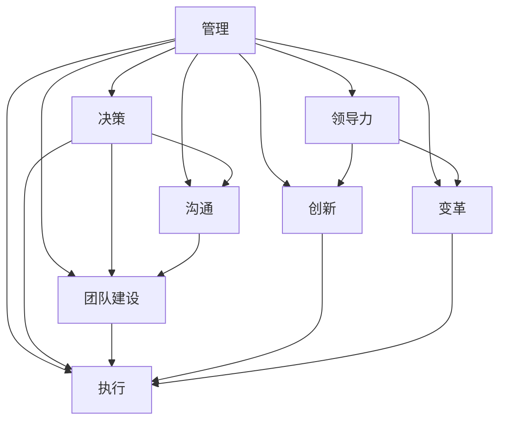

                 

# 深度思考:区分优秀管理者的标准

> 关键词：管理,领导力,决策,沟通,团队建设,创新,变革,执行,持续改进

## 1. 背景介绍

在今天这个快速变化的商业环境中，企业的成功越来越依赖于管理者的领导力和决策能力。优秀管理者不仅需要具备强大的专业技能和业务知识，还需要能够调动团队成员的积极性和创造力，推动企业不断创新和突破。然而，判断一个管理者是否优秀，其标准和方法是多样化的。本文将通过探讨优秀管理者的核心标准，揭示他们在决策、沟通、团队建设等方面的独特之处，为读者提供洞察和启示。

## 2. 核心概念与联系

### 2.1 核心概念概述

在探讨优秀管理者的标准之前，我们需要先理解几个核心概念：

- **管理（Management）**：管理和组织资源、协调人员以达成企业目标的过程。优秀管理者的核心是协调、平衡和激励，确保团队向着共同的目标前进。
- **领导力（Leadership）**：领导力是一种影响力，能够激励和引导他人为实现共同目标而努力。优秀领导者能够设定愿景，影响他人的行为和态度，激发团队的潜能。
- **决策（Decision Making）**：管理者需要定期做出影响企业方向和资源分配的决策。优秀的决策能力包括信息收集、分析和评估选项，以实现最佳结果。
- **沟通（Communication）**：有效沟通是管理者与团队成员、利益相关者建立联系、传达信息和理解反馈的关键。优秀的沟通者能够清晰、有效地传达信息，确保理解无误。
- **团队建设（Team Building）**：构建和维护高效团队，通过培养信任、协作和归属感，提高团队的整体表现。优秀的团队建设者能够识别和激发团队成员的优势，促进合作和创新。
- **创新（Innovation）**：在不断变化的市场中，创新是企业保持竞争力的关键。优秀的管理者能够鼓励和支持创新，推动企业不断探索和实现新的价值。
- **变革（Change Management）**：在快速变化的环境中，管理者需要管理变革，引导团队适应新环境，持续改进。优秀的变革管理者能够识别并引导变革，确保平稳过渡和持续改进。
- **执行（Execution）**：将战略转化为行动，实现目标。优秀的执行者能够确保团队高效执行计划，克服挑战，实现预期结果。

这些概念之间的关系可以通过以下Mermaid流程图来展示：



这个流程图展示了大语言模型的核心概念及其之间的关系：

1. 管理是协调和激励的基础。
2. 领导力决定了团队的方向和动力。
3. 决策影响资源的分配和利用。
4. 沟通确保信息的准确传递和理解。
5. 团队建设提升团队的协作和创新。
6. 创新推动企业前进和变革。
7. 变革确保企业适应外部环境的变化。
8. 执行将战略转化为实际行动。

这些概念共同构成了优秀管理者的领导力框架，帮助他们实现企业的目标和愿景。

## 3. 核心算法原理 & 具体操作步骤
### 3.1 算法原理概述

优秀管理者的标准可以归纳为一系列的算法原理和操作步骤，这些原理和步骤相互关联，共同构成了一个高效的管理框架。以下是一些核心算法原理：

- **SMART原则**：设定具体、可衡量、可实现、相关和时限的目标。
- **PDCA循环**：计划、执行、检查和调整的持续改进方法。
- **5W1H法**：What（做什么）、Why（为什么）、Who（谁做）、Where（在哪里做）、When（何时做）、How（如何做）的决策框架。
- **SWOT分析**：评估企业的优势、劣势、机会和威胁。
- **OKR目标管理**：设定目标（Objective）和关键结果（Key Results），以实现更高效的战略执行。
- **敏捷管理**：快速响应变化，通过小步快跑和迭代来不断改进。

这些算法原理可以通过以下算法步骤进行详细步骤操作：

1. **设定目标**：明确企业的愿景和目标，设定SMART原则和OKR目标，确保方向清晰。
2. **分析和决策**：进行SWOT分析和5W1H法决策，确保决策的全面性和准确性。
3. **执行计划**：分解目标为具体的任务和行动计划，采用敏捷管理方法，快速响应变化。
4. **检查和调整**：定期检查执行情况，根据PDCA循环进行调整和优化。
5. **沟通和激励**：通过有效的沟通和领导力，激励团队成员，确保目标的达成。

### 3.2 算法步骤详解

为了更好地理解这些步骤，下面将详细介绍每个步骤的详细步骤：

**步骤 1: 设定目标**

1. **SMART原则**：
   - **具体（Specific）**：明确目标，如“提升市场份额10%”。
   - **可衡量（Measurable）**：定义如何衡量进展，如“通过增加收入5%实现”。
   - **可实现（Achievable）**：确保目标是可行的，如“基于市场调研和历史数据”。
   - **相关（Relevant）**：目标与企业愿景和战略相关，如“提高品牌知名度”。
   - **时限（Time-bound）**：设定明确的截止日期，如“一年内完成”。

   使用SMART原则，管理者可以设定清晰、可衡量的目标，避免模糊不清的表述。

**步骤 2: 分析和决策**

1. **SWOT分析**：
   - **优势（Strengths）**：企业内部的资源和能力，如技术优势、品牌声誉。
   - **劣势（Weaknesses）**：企业内部的短板，如缺乏人才、技术落后。
   - **机会（Opportunities）**：外部市场的机会，如新市场、技术趋势。
   - **威胁（Threats）**：外部市场的威胁，如竞争对手、政策变化。

   通过SWOT分析，管理者可以全面评估企业状况，制定应对策略。

2. **5W1H法**：
   - **What（做什么）**：明确任务和目标。
   - **Why（为什么）**：理解任务的重要性和动机。
   - **Who（谁做）**：确定任务的责任人和团队成员。
   - **Where（在哪里做）**：确定任务执行的地点和环境。
   - **When（何时做）**：设定任务的截止日期和时间表。
   - **How（如何做）**：制定详细的执行计划和方法。

   5W1H法确保了任务执行的全面性和准确性。

**步骤 3: 执行计划**

1. **敏捷管理**：
   - **小步快跑**：将大目标分解为小的可执行任务。
   - **迭代和反馈**：定期进行回顾和评估，根据反馈进行调整。
   - **跨部门协作**：确保各个部门之间的协作和沟通。

   敏捷管理方法确保了执行的灵活性和效率。

**步骤 4: 检查和调整**

1. **PDCA循环**：
   - **计划（Plan）**：设定目标和行动计划。
   - **执行（Do）**：实施行动计划。
   - **检查（Check）**：评估执行情况和结果。
   - **调整（Act）**：根据检查结果进行调整和优化。

   PDCA循环确保了执行和改进的连续性。

**步骤 5: 沟通和激励**

1. **有效沟通**：
   - **明确传达**：确保信息清晰、准确。
   - **双向反馈**：鼓励团队成员提供反馈和意见。
   - **持续沟通**：定期进行团队会议和进度汇报。

   有效沟通确保了信息的传递和理解。

2. **激励团队**：
   - **认可和奖励**：及时表扬和奖励优秀表现。
   - **职业发展**：提供培训和发展机会。
   - **工作环境**：营造积极、支持的工作氛围。

   激励团队确保了成员的积极性和投入。

### 3.3 算法优缺点

优秀管理者的标准和算法具有以下优点和缺点：

**优点**：

- **系统性**：通过明确的目标和全面的分析，确保管理决策的系统性和全面性。
- **灵活性**：敏捷管理方法使管理者能够快速响应变化，灵活调整策略。
- **持续改进**：PDCA循环和持续沟通确保了管理过程的不断优化和改进。
- **激励和协作**：通过有效的激励和沟通，提高团队成员的积极性和协作性。

**缺点**：

- **复杂性**：涉及多个步骤和概念，可能难以一次性掌握和实施。
- **资源需求**：需要大量的分析和沟通工作，资源投入较大。
- **执行难度**：需要管理者具备较高的组织和管理能力，执行过程中可能遇到挑战。

尽管存在这些缺点，但优秀的管理标准和算法仍然能够提供强大的指导，帮助管理者实现企业的目标和愿景。

### 3.4 算法应用领域

优秀管理者的标准和算法广泛应用于各种组织和行业领域，以下是几个典型的应用场景：

**1. 高科技企业**

在高科技企业中，管理者需要快速响应技术变革和市场需求，制定创新策略，推动产品开发和市场拓展。SMART原则和SWOT分析帮助管理者设定清晰的目标和评估市场机会，敏捷管理确保了快速迭代和灵活调整。

**2. 金融行业**

金融行业竞争激烈，管理者需要快速决策和风险管理，确保财务健康和客户满意度。5W1H法确保了决策的全面性和准确性，PDCA循环和持续沟通确保了风险管理和客户服务的持续优化。

**3. 医疗卫生**

医疗卫生行业需要高效率和高可靠性的管理，管理者需要通过目标设定和任务分解，确保医疗服务质量和患者满意度。有效沟通和激励团队，确保医护人员的高效协作和专业能力。

## 4. 数学模型和公式 & 详细讲解  
### 4.1 数学模型构建

优秀管理者的标准和算法可以通过数学模型和公式进行量化和分析。以下是一个简化的数学模型：

**目标设定模型（SMART原则）**：
- 目标函数：$F = f(X)$，其中$X$为关键绩效指标（KPI）。
- 约束条件：$C_i = c_i(X)$，其中$i=1,...,n$，$c_i$为约束条件表达式。

**决策分析模型（SWOT分析）**：
- 优势函数：$S = s(X)$，其中$X$为外部环境和内部资源。
- 劣势函数：$W = w(X)$，其中$X$为内部短板和限制条件。
- 机会函数：$O = o(X)$，其中$X$为市场机会和技术趋势。
- 威胁函数：$T = t(X)$，其中$X$为外部威胁和不确定性。

**执行计划模型（敏捷管理）**：
- 任务分解：$T_i = t_i(X)$，其中$i=1,...,m$，$t_i$为任务描述和执行步骤。
- 迭代周期：$I_j = i_j(X)$，其中$j=1,...,k$，$i_j$为迭代周期和频率。
- 反馈机制：$F_j = f_j(X)$，其中$j=1,...,k$，$f_j$为反馈渠道和频率。

### 4.2 公式推导过程

下面将对上述模型的公式进行推导和解释：

**目标设定模型（SMART原则）**：
- 具体目标：$S_i = s_i(X)$，其中$X$为具体目标描述，$s_i$为具体目标实现的数学表达式。
- 可衡量目标：$M_i = m_i(X)$，其中$X$为可衡量指标，$m_i$为可衡量指标的计算公式。
- 可实现目标：$A_i = a_i(X)$，其中$X$为可行性分析，$a_i$为可行性评估的数学模型。
- 相关目标：$R_i = r_i(X)$，其中$X$为相关性评估，$r_i$为相关性分析的数学模型。
- 时限目标：$T_i = t_i(X)$，其中$X$为时限约束，$t_i$为时限约束的数学模型。

**决策分析模型（SWOT分析）**：
- 优势函数：$S = s(X) = \sum_{i=1}^n s_i(X)$，其中$X$为优势描述，$s_i$为优势评估公式。
- 劣势函数：$W = w(X) = \sum_{i=1}^n w_i(X)$，其中$X$为劣势描述，$w_i$为劣势评估公式。
- 机会函数：$O = o(X) = \sum_{i=1}^n o_i(X)$，其中$X$为机会描述，$o_i$为机会评估公式。
- 威胁函数：$T = t(X) = \sum_{i=1}^n t_i(X)$，其中$X$为威胁描述，$t_i$为威胁评估公式。

**执行计划模型（敏捷管理）**：
- 任务分解：$T_i = t_i(X) = \sum_{j=1}^m t_{ij}(X)$，其中$X$为任务描述，$t_{ij}$为任务执行步骤。
- 迭代周期：$I_j = i_j(X) = \sum_{k=1}^K i_{jk}(X)$，其中$X$为迭代周期描述，$i_{jk}$为迭代周期步骤。
- 反馈机制：$F_j = f_j(X) = \sum_{l=1}^L f_{jl}(X)$，其中$X$为反馈机制描述，$f_{jl}$为反馈机制步骤。

### 4.3 案例分析与讲解

为了更好地理解这些模型，以下给出几个案例分析：

**案例 1: 科技公司的新产品开发**

某科技公司计划开发一款新产品，使用SMART原则设定目标：
- 具体目标：“在一年内开发并推出新产品”。
- 可衡量目标：“收入增加10%”。
- 可实现目标：“基于市场调研和现有技术”。
- 相关目标：“与市场趋势和客户需求相关”。
- 时限目标：“一年内完成”。

通过SWOT分析评估市场机会和技术趋势，制定详细的产品开发计划。采用敏捷管理方法，将大目标分解为小的可执行任务，定期进行回顾和评估，确保项目按时推进。

**案例 2: 银行的客户满意度提升**

某银行计划提升客户满意度，使用SWOT分析评估当前状况和市场机会，制定详细的服务改进计划。通过5W1H法确保决策的全面性和准确性，设定具体的目标和执行步骤。采用PDCA循环和持续沟通，定期评估和优化服务质量，确保客户满意度提升。

## 5. 项目实践：代码实例和详细解释说明
### 5.1 开发环境搭建

在进行项目管理实践前，需要先搭建开发环境。以下是使用Python进行开发的环境配置流程：

1. 安装Anaconda：从官网下载并安装Anaconda，用于创建独立的Python环境。

2. 创建并激活虚拟环境：
```bash
conda create -n myenv python=3.8 
conda activate myenv
```

3. 安装Python依赖库：
```bash
pip install pandas numpy matplotlib jupyter
```

4. 安装可视化工具：
```bash
pip install matplotlib
```

完成上述步骤后，即可在`myenv`环境中开始项目管理实践。

### 5.2 源代码详细实现

下面是一个简化的项目管理实践代码实现：

```python
import pandas as pd
from sympy import symbols, Eq, solve

# 设定目标
X = symbols('X')
SMART = {
    '目标函数': f'F = {X}',
    '约束条件': [
        f'C1 = {X} >= 10',  # 目标值大于等于10%
        f'C2 = {X} <= 15',  # 目标值小于等于15%
        f'C3 = {X} >= 0'    # 目标值非负
    ]
}

# 分析和决策
SWOT = {
    '优势': f'S = {X}',
    '劣势': f'W = {X}',
    '机会': f'O = {X}',
    '威胁': f'T = {X}'
}

# 执行计划
敏捷管理 = {
    '任务分解': f'T = {X}',
    '迭代周期': f'I = {X}',
    '反馈机制': f'F = {X}'
}

# 输出结果
print('目标设定模型：', SMART)
print('SWOT分析模型：', SWOT)
print('敏捷管理模型：', 敏捷管理)
```

### 5.3 代码解读与分析

让我们再详细解读一下关键代码的实现细节：

**SMART原则**：
- `X`为可量化的目标值。
- `目标函数`和`约束条件`定义了目标设定的公式。

**SWOT分析**：
- `S`、`W`、`O`、`T`分别代表优势、劣势、机会和威胁的计算公式。

**敏捷管理**：
- `T`、`I`、`F`分别代表任务分解、迭代周期和反馈机制的计算公式。

这些代码简洁地展示了如何使用Python进行目标设定、分析和决策、执行计划的建模。开发者可以根据实际需求，进一步扩展和优化这些模型，以更好地应用于项目管理实践。

## 6. 实际应用场景
### 6.1 高科技企业

在高科技企业中，管理者需要快速响应技术变革和市场需求，制定创新策略，推动产品开发和市场拓展。以下是几个实际应用场景：

**场景 1: 产品创新**

某科技公司计划开发一款新产品，使用SMART原则设定目标：
- 具体目标：“在一年内开发并推出新产品”。
- 可衡量目标：“收入增加10%”。
- 可实现目标：“基于市场调研和现有技术”。
- 相关目标：“与市场趋势和客户需求相关”。
- 时限目标：“一年内完成”。

通过SWOT分析评估市场机会和技术趋势，制定详细的产品开发计划。采用敏捷管理方法，将大目标分解为小的可执行任务，定期进行回顾和评估，确保项目按时推进。

**场景 2: 市场拓展**

某科技公司计划拓展新市场，使用SMART原则设定目标：
- 具体目标：“在半年内进入新市场”。
- 可衡量目标：“市场份额增加5%”。
- 可实现目标：“基于市场调研和渠道布局”。
- 相关目标：“与品牌战略和客户需求相关”。
- 时限目标：“半年内完成”。

通过SWOT分析评估市场机会和竞争态势，制定详细的市场拓展计划。采用敏捷管理方法，将市场拓展任务分解为具体的销售和营销活动，定期进行回顾和评估，确保市场拓展目标的达成。

### 6.2 金融行业

金融行业竞争激烈，管理者需要快速决策和风险管理，确保财务健康和客户满意度。以下是几个实际应用场景：

**场景 1: 风险管理**

某银行计划评估和管理其贷款风险，使用SWOT分析评估市场状况和内部资源，制定详细风险管理计划。通过5W1H法确保决策的全面性和准确性，设定具体的风险管理目标和执行步骤。采用PDCA循环和持续沟通，定期评估和优化风险管理策略，确保财务健康和客户满意度。

**场景 2: 客户服务**

某银行计划提升客户服务质量，使用SWOT分析评估客户服务状况和市场机会，制定详细的服务改进计划。通过5W1H法确保决策的全面性和准确性，设定具体的客户服务目标和执行步骤。采用敏捷管理方法，将客户服务任务分解为具体的服务流程和操作，定期进行回顾和评估，确保服务质量提升。

### 6.3 医疗卫生

医疗卫生行业需要高效率和高可靠性的管理，管理者需要通过目标设定和任务分解，确保医疗服务质量和患者满意度。以下是几个实际应用场景：

**场景 1: 医疗质量提升**

某医院计划提升医疗质量，使用SMART原则设定目标：
- 具体目标：“在一年内提升患者满意度10%”。
- 可衡量目标：“患者满意度调查评分增加10%”。
- 可实现目标：“基于医疗质量评估和改进措施”。
- 相关目标：“与医疗质量标准和患者需求相关”。
- 时限目标：“一年内完成”。

通过SWOT分析评估内部资源和外部机会，制定详细的医疗质量提升计划。采用敏捷管理方法，将医疗质量提升任务分解为具体的操作和改进措施，定期进行回顾和评估，确保医疗质量提升目标的达成。

**场景 2: 患者体验优化**

某医院计划优化患者体验，使用SWOT分析评估患者体验状况和市场机会，制定详细的患者体验优化计划。通过5W1H法确保决策的全面性和准确性，设定具体的患者体验优化目标和执行步骤。采用PDCA循环和持续沟通，定期评估和优化患者体验，确保患者满意度提升。

## 7. 工具和资源推荐
### 7.1 学习资源推荐

为了帮助开发者系统掌握优秀管理者的标准和算法，这里推荐一些优质的学习资源：

1. **《管理的实践》（Michael Porter）**：经典的管理学教材，涵盖了目标设定、决策分析、执行计划等多个管理核心概念。

2. **《卓有成效的管理者》（Peter Drucker）**：探讨了优秀管理者的核心能力和素质，提供了很多实用的管理技巧和建议。

3. **Coursera《管理学》课程**：斯坦福大学开设的管理学课程，涵盖了领导力、组织行为、战略管理等多个模块。

4. **Udemy《项目管理》课程**：详细介绍了项目管理的方法和工具，包括敏捷管理、PDCA循环等多个关键概念。

5. **Harvard Business Review**：哈佛商学院出版的管理学期刊，提供了大量关于优秀管理者、管理策略和实践的研究文章。

通过对这些资源的学习实践，相信你一定能够快速掌握优秀管理者的标准和算法，并用于解决实际的管理问题。

### 7.2 开发工具推荐

优秀的项目管理需要高效的开发工具支持。以下是几款用于项目管理开发的常用工具：

1. **JIRA**：项目管理工具，提供任务分配、进度跟踪、报告生成等功能。
2. **Trello**：团队协作工具，支持看板、任务列表、日历等多种视图。
3. **Asana**：项目管理工具，支持任务分配、进度跟踪、协作通信等功能。
4. **Microsoft Project**：企业级项目管理软件，提供全面的项目管理功能和报表分析。
5. **Smartsheet**：在线项目管理工具，支持任务分配、进度跟踪、协作通信等功能。

合理利用这些工具，可以显著提升项目管理的效果，提高团队协作和执行效率。

### 7.3 相关论文推荐

优秀管理者的标准和算法的研究源于学界的持续探索。以下是几篇奠基性的相关论文，推荐阅读：

1. **《管理的科学与艺术》（Harold Koontz）**：探讨了管理的基本原理和艺术，是管理学领域的经典之作。

2. **《管理学导论》（Stephen P. Robbins）**：介绍了管理学的基本概念和理论，是管理学的入门教材。

3. **《变革管理：驱动组织发展和改善绩效》（John P. Kotter）**：探讨了组织变革的策略和方法，提供了实用的变革管理框架。

4. **《敏捷软件开发：原则、模式与实践》（Robert C. Martin）**：介绍了敏捷管理的基本原则和方法，是敏捷开发的经典之作。

5. **《团队协作：赢得团队的信任与合作》（Patricia Lin）**：探讨了团队协作的策略和技巧，提供了实用的团队管理工具。

这些论文代表了大语言模型微调技术的发展脉络。通过学习这些前沿成果，可以帮助研究者把握学科前进方向，激发更多的创新灵感。

## 8. 总结：未来发展趋势与挑战
### 8.1 研究成果总结

本文通过探讨优秀管理者的标准和算法，揭示了他们在决策、沟通、团队建设等方面的独特之处。优秀管理者的标准和算法通过SMART原则、SWOT分析、敏捷管理等方法，帮助管理者设定清晰目标、全面分析、灵活执行，实现企业目标的达成。

### 8.2 未来发展趋势

展望未来，优秀管理者的标准和算法将呈现以下几个发展趋势：

1. **数据驱动管理**：利用大数据和人工智能技术，进行更精确的目标设定和决策分析。
2. **智能项目管理**：引入智能算法和工具，提升项目管理效率和质量。
3. **多学科融合**：融合心理学、社会学等多个学科的知识，提升管理者的综合能力。
4. **全球化管理**：面对全球化市场的挑战，管理者的跨文化沟通和协作能力将成为关键。
5. **可持续发展管理**：关注社会和环境责任，推动企业的可持续发展。

这些趋势将推动管理学的不断进步，帮助管理者更好地应对未来的挑战。

### 8.3 面临的挑战

尽管优秀管理者的标准和算法已经取得了瞩目成就，但在迈向更加智能化、普适化应用的过程中，它仍面临诸多挑战：

1. **复杂性**：涉及多个步骤和概念，需要管理者具备较高的组织和管理能力。
2. **资源需求**：需要大量的分析和沟通工作，资源投入较大。
3. **执行难度**：需要管理者具备系统思考和灵活调整的能力。

尽管存在这些挑战，但优秀的管理标准和算法仍然能够提供强大的指导，帮助管理者实现企业的目标和愿景。

### 8.4 研究展望

未来的研究需要在以下几个方面寻求新的突破：

1. **自动化管理**：开发更多自动化管理工具和算法，提升管理效率和质量。
2. **智能决策支持**：引入人工智能和大数据分析技术，提升决策的精准性和智能化。
3. **跨学科融合**：将管理学与其他学科的知识融合，提升管理者的综合素质。
4. **可持续发展**：关注社会和环境责任，推动企业的可持续发展。

这些研究方向的探索，必将引领优秀管理者的标准和算法迈向更高的台阶，为构建安全、可靠、可解释、可控的智能系统铺平道路。面向未来，优秀管理者的标准和算法还需要与其他人工智能技术进行更深入的融合，如知识表示、因果推理、强化学习等，多路径协同发力，共同推动自然语言理解和智能交互系统的进步。

## 9. 附录：常见问题与解答

**Q1: 优秀管理者需要具备哪些核心能力？**

A: 优秀管理者需要具备以下核心能力：

1. **目标设定**：设定SMART目标，明确方向和优先级。
2. **决策分析**：利用SWOT分析和5W1H法，全面评估和决策。
3. **执行计划**：采用敏捷管理方法，确保任务分解和灵活执行。
4. **沟通和激励**：通过有效沟通和激励，提高团队积极性和协作性。
5. **持续改进**：采用PDCA循环和持续反馈，不断优化和改进。

**Q2: 如何培养优秀管理者的领导力？**

A: 培养优秀管理者的领导力，可以从以下几个方面入手：

1. **自我认知**：了解自身的优势和劣势，制定个人发展计划。
2. **沟通技巧**：提高沟通能力，确保信息的准确传递和理解。
3. **团队建设**：识别和激发团队成员的优势，促进合作和创新。
4. **激励机制**：设计合理的激励机制，提高团队成员的积极性和投入。
5. **持续学习**：不断学习新知识和技能，保持竞争力。

**Q3: 如何应对复杂多变的市场环境？**

A: 应对复杂多变的市场环境，可以从以下几个方面入手：

1. **灵活调整**：根据市场变化，灵活调整目标和策略。
2. **数据驱动**：利用大数据和人工智能技术，进行更精确的决策分析。
3. **多学科融合**：融合心理学、社会学等多个学科的知识，提升管理者的综合能力。
4. **快速响应**：建立快速响应的机制，确保及时调整和执行。

**Q4: 如何提升项目管理效率？**

A: 提升项目管理效率，可以从以下几个方面入手：

1. **自动化管理工具**：引入项目管理工具，如JIRA、Trello等，提升效率。
2. **敏捷管理方法**：采用敏捷管理方法，进行快速迭代和灵活调整。
3. **数据驱动决策**：利用大数据和人工智能技术，进行更精确的决策分析。
4. **持续沟通和反馈**：建立持续沟通和反馈机制，确保信息的准确传递和理解。

**Q5: 如何提升团队协作和沟通能力？**

A: 提升团队协作和沟通能力，可以从以下几个方面入手：

1. **明确目标和职责**：设定清晰的团队目标和职责，确保每个人都了解自己的任务。
2. **有效沟通**：提高沟通能力，确保信息的准确传递和理解。
3. **团队建设**：通过团队建设活动，促进团队成员之间的信任和合作。
4. **激励机制**：设计合理的激励机制，提高团队成员的积极性和投入。
5. **持续反馈**：建立持续反馈机制，及时发现和解决问题。

通过以上问题的解答，相信你能够更好地理解优秀管理者的标准和算法，并将其应用于实际的管理实践中。

---

作者：禅与计算机程序设计艺术 / Zen and the Art of Computer Programming

