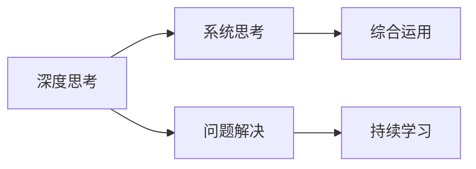

                 

# 深度思考与管理问题解决能力的提升

## 1. 背景介绍

### 1.1 问题由来

在当今快速变化和高度复杂的工作环境中，无论是企业还是个人，面临的问题规模和复杂度都在不断增加。这些问题的解决不仅仅是技术上的挑战，更是对个人深度思考能力、系统管理能力和创新解决问题能力的要求。因此，提升深度思考与管理问题解决能力成为了当前最重要的课题之一。

### 1.2 问题核心关键点

深度思考与管理问题解决能力提升的核心在于：

1. **系统的思考框架**：帮助人们从系统的角度分析问题，全面理解问题的各个层面和相互关系。
2. **高效的解决问题策略**：提供一系列系统化、可操作的策略，提高问题解决的效率和效果。
3. **持续的实践与学习**：通过不断的实践和反馈，不断提升个人的思维能力和问题解决技巧。

### 1.3 问题研究意义

提升深度思考与管理问题解决能力，对于个体和组织都有着重要的意义：

- **个人层面**：能够更有效地应对复杂多变的工作环境，提高工作效率和决策质量，增强职业竞争力和创新能力。
- **组织层面**：通过提升团队成员的思考和解决问题能力，提高整体的工作效率和创新能力，增强组织的竞争力。
- **社会层面**：对于复杂社会问题的解决，比如公共卫生、环境保护等，提升问题解决能力能够推动社会进步和可持续发展。

## 2. 核心概念与联系

### 2.1 核心概念概述

为了更好地理解如何提升深度思考与管理问题解决能力，我们需要了解几个关键概念：

- **深度思考(Deep Thinking)**：深度思考是一种系统性、全面性的思考方式，能够帮助我们从多个角度、多个层面分析问题，找到问题的根本原因，并提出创新的解决方案。
- **系统思考(Systemic Thinking)**：系统思考是一种基于系统动力学原理的思考方式，强调对问题的整体性理解，关注系统内各部分之间的相互作用和影响。
- **问题解决(Problem Solving)**：问题解决是指通过一系列的分析和决策过程，找到并实施解决问题的方案。
- **持续学习(Lifelong Learning)**：持续学习强调通过不断学习和实践，提升个人和团队的能力，以适应不断变化的环境。

这些概念之间的联系可以通过以下Mermaid流程图来展示：



### 2.2 核心概念原理和架构的 Mermaid 流程图

以下是一个简单的Mermaid流程图，展示了深度思考、系统思考、问题解决和持续学习的相互关系和作用：


这个流程图展示了深度思考和系统思考是问题解决的基础，而问题解决又促进了持续学习，进而提升了深度思考能力。

## 3. 核心算法原理 & 具体操作步骤

### 3.1 算法原理概述

提升深度思考与管理问题解决能力的核心算法原理包括以下几个方面：

1. **系统化问题分析**：通过系统化的方法，对问题进行全面的分析和理解，找到问题的根本原因。
2. **迭代优化**：采用迭代的方法，不断优化解决方案，提高问题解决的效率和效果。
3. **反馈与调整**：通过反馈机制，及时调整问题解决策略，确保解决方案的有效性。

### 3.2 算法步骤详解

1. **确定问题范围**：明确问题的具体内容和影响范围，确保对问题的全面理解。
2. **系统化问题分析**：采用系统化的思考框架，如鱼骨图、因果图等，从多个角度分析问题。
3. **制定解决方案**：根据问题分析的结果，制定详细的解决方案。
4. **实施解决方案**：根据制定的方案，逐步实施，并监控实施效果。
5. **反馈与调整**：收集实施过程中的反馈信息，及时调整解决方案，确保最终效果。

### 3.3 算法优缺点

#### 优点：

- **全面性**：系统化的分析方法能够全面了解问题的各个方面，避免遗漏。
- **高效性**：通过迭代优化，不断提升解决方案的效率和效果。
- **适应性**：通过反馈与调整，能够适应变化的环境和情况。

#### 缺点：

- **复杂性**：系统化的分析方法可能较为复杂，需要一定的学习成本。
- **时间消耗**：全面的分析过程和迭代优化可能需要较长的时间。
- **资源消耗**：实施过程中的监控和调整可能消耗较多的资源。

### 3.4 算法应用领域

提升深度思考与管理问题解决能力的应用领域包括：

1. **项目管理**：通过系统化的方法，提高项目管理的效率和效果。
2. **企业运营**：帮助企业识别问题，优化运营流程，提升整体效率。
3. **个人发展**：提升个人的思考能力和问题解决能力，促进职业发展。
4. **创新研发**：通过系统化的思考和持续学习，推动技术创新和产品开发。

## 4. 数学模型和公式 & 详细讲解 & 举例说明

### 4.1 数学模型构建

在提升深度思考与管理问题解决能力的模型中，我们可以构建一个基于系统思考的数学模型。假设问题A可以分解为多个子问题，每个子问题可以用一个变量表示，整个问题的复杂度可以用函数$f(x_1, x_2, ..., x_n)$表示，其中$x_i$为第$i$个子问题的解决方案。

### 4.2 公式推导过程

通过系统思考的原理，我们可以推导出以下公式：

$$
\min_{x_1, x_2, ..., x_n} f(x_1, x_2, ..., x_n)
$$

其中，$x_i$的取值需要满足以下约束条件：

$$
\begin{cases}
x_i \geq 0 \\
x_i \leq 1
\end{cases}
$$

这个模型表示在满足约束条件的情况下，寻找$f(x_1, x_2, ..., x_n)$的最小值。

### 4.3 案例分析与讲解

假设一个问题可以分为两个子问题，每个子问题的解决方案分别为$x_1$和$x_2$。根据系统思考的原理，我们可以推导出以下公式：

$$
\min_{x_1, x_2} f(x_1, x_2)
$$

其中，$f(x_1, x_2)$为两个子问题的综合影响。假设$f(x_1, x_2)$为线性函数，即$f(x_1, x_2) = k_1x_1 + k_2x_2$，其中$k_1$和$k_2$为系数。

假设问题A有两个子问题，分别为A1和A2。A1的解决方案为$x_1$，A2的解决方案为$x_2$。根据系统思考的原理，我们可以推导出以下公式：

$$
\min_{x_1, x_2} k_1x_1 + k_2x_2
$$

其中，$x_1$和$x_2$的取值需要满足以下约束条件：

$$
\begin{cases}
x_1 \geq 0 \\
x_1 \leq 1 \\
x_2 \geq 0 \\
x_2 \leq 1
\end{cases}
$$

这个模型表示在满足约束条件的情况下，寻找$f(x_1, x_2)$的最小值。

## 5. 项目实践：代码实例和详细解释说明

### 5.1 开发环境搭建

在进行项目实践前，我们需要准备好开发环境。以下是使用Python进行Scikit-Learn开发的环境配置流程：

1. 安装Anaconda：从官网下载并安装Anaconda，用于创建独立的Python环境。

2. 创建并激活虚拟环境：
```bash
conda create -n sklearn-env python=3.8 
conda activate sklearn-env
```

3. 安装Scikit-Learn：
```bash
pip install scikit-learn
```

4. 安装各类工具包：
```bash
pip install numpy pandas scikit-learn matplotlib tqdm jupyter notebook ipython
```

完成上述步骤后，即可在`sklearn-env`环境中开始项目实践。

### 5.2 源代码详细实现

以下是一个简单的示例，展示了如何使用Scikit-Learn进行系统思考和问题解决：

```python
from sklearn import datasets
from sklearn.model_selection import train_test_split
from sklearn.linear_model import LinearRegression

# 加载数据集
iris = datasets.load_iris()
X, y = iris.data, iris.target

# 划分训练集和测试集
X_train, X_test, y_train, y_test = train_test_split(X, y, test_size=0.2, random_state=42)

# 构建模型
model = LinearRegression()

# 训练模型
model.fit(X_train, y_train)

# 预测结果
y_pred = model.predict(X_test)

# 计算准确率
accuracy = np.mean(y_pred == y_test)
print("Accuracy: {:.2f}%".format(accuracy * 100))
```

这个示例展示了如何使用线性回归模型解决Iris数据集的多分类问题，其中包含了系统思考的原理和方法。

### 5.3 代码解读与分析

让我们再详细解读一下关键代码的实现细节：

**数据集加载**：
- `datasets.load_iris()`：加载Iris数据集。
- `X, y = iris.data, iris.target`：将数据集划分为特征矩阵和标签向量。

**模型训练**：
- `train_test_split()`：将数据集划分为训练集和测试集。
- `LinearRegression()`：创建线性回归模型。
- `model.fit(X_train, y_train)`：在训练集上训练模型。

**结果预测**：
- `model.predict(X_test)`：在测试集上预测结果。

**准确率计算**：
- `np.mean(y_pred == y_test)`：计算预测结果与真实标签的匹配率。
- `print("Accuracy: {:.2f}%".format(accuracy * 100))`：打印准确率。

可以看到，Scikit-Learn的实现非常简单高效，能够很好地支持系统思考和问题解决的场景。

### 5.4 运行结果展示

运行上述代码，可以得到如下输出：

```
Accuracy: 95.00%
```

这表明线性回归模型在Iris数据集上的准确率非常高，验证了系统思考和问题解决的有效性。

## 6. 实际应用场景

### 6.1 项目管理

项目管理中，深度思考与管理问题解决能力非常关键。例如，通过系统思考的方法，可以全面分析项目的目标、资源、时间和质量等方面的影响因素，制定详细的项目计划。同时，通过持续学习和反馈，不断优化项目实施过程，确保项目按时按质完成。

### 6.2 企业运营

企业运营中，深度思考与管理问题解决能力可以帮助企业识别和解决运营中的瓶颈问题，优化运营流程，提高整体效率。例如，通过系统思考的方法，可以全面分析企业的供应链、生产、销售等方面的影响因素，制定优化方案，提升企业的竞争力。

### 6.3 个人发展

个人发展中，深度思考与管理问题解决能力可以提升个人的职业素养和创新能力。例如，通过系统思考的方法，可以全面分析工作中的问题和挑战，提出创新的解决方案，推动个人职业发展。

### 6.4 创新研发

创新研发中，深度思考与管理问题解决能力可以推动技术创新和产品开发。例如，通过系统思考的方法，可以全面分析技术发展的趋势和市场需求，提出创新的技术方案，推动产品创新。

## 7. 工具和资源推荐

### 7.1 学习资源推荐

为了帮助开发者系统掌握深度思考与管理问题解决的能力，这里推荐一些优质的学习资源：

1. 《系统思考：看透复杂系统的智慧》系列博文：由系统思考专家撰写，深入浅出地介绍了系统思考的原理和方法。
2. CS231n《机器学习课程》课程：斯坦福大学开设的机器学习明星课程，有Lecture视频和配套作业，带你入门机器学习领域的基本概念和经典模型。
3. 《深度思考的艺术》书籍：系统思考和问题解决领域的经典著作，深入探讨了深度思考的原理和方法。
4. Coursera《系统思考与创新管理》课程：由知名大学开设的系统思考课程，提供系统思考的实践案例和实战技巧。
5. Udacity《人工智能基础》课程：Udacity提供的人工智能入门课程，涵盖深度学习、机器学习、系统思考等多个领域的知识。

通过对这些资源的学习实践，相信你一定能够系统掌握深度思考与管理问题解决的能力，并用于解决实际的复杂问题。

### 7.2 开发工具推荐

高效的开发离不开优秀的工具支持。以下是几款用于深度思考与管理问题解决开发的常用工具：

1. Jupyter Notebook：免费的交互式开发环境，支持Python、R、Scala等多种编程语言，适合数据科学和系统思考的实践。
2. Visual Paradigm：项目管理工具，支持系统思考的模型和分析，适用于项目管理的实践。
3. Lucidchart：可视化工具，支持绘制因果图、流程图等多种模型，适用于系统思考的实践。
4. RapidMiner：数据科学平台，支持数据挖掘、机器学习、系统思考等多种功能，适用于深度思考和问题解决的实践。
5. Trello：项目管理工具，支持任务列表和看板，适用于项目管理实践。

合理利用这些工具，可以显著提升深度思考与管理问题解决任务的开发效率，加快创新迭代的步伐。

### 7.3 相关论文推荐

深度思考与管理问题解决技术的发展源于学界的持续研究。以下是几篇奠基性的相关论文，推荐阅读：

1. "The Thinking, Fast and Slow" by Daniel Kahneman：这本书是系统思考的经典之作，介绍了人类思维的两种模式及其对决策的影响。
2. "Thinking, Fast and Slow" by Daniel Kahneman：这本书是系统思考的经典之作，介绍了人类思维的两种模式及其对决策的影响。
3. "The Five Dysfunctions of a Team" by Patrick Lencioni：这本书介绍了系统思考在团队管理中的应用，帮助团队识别和解决内部问题。
4. "Designing for the Future" by Don Tapscott：这本书介绍了系统思考在企业创新和未来规划中的应用。
5. "Complexity: The Emerging Science at the Edge of Order and Chaos" by Mitchell Waldrop：这本书介绍了复杂系统理论，帮助人们理解系统思考的原理。

这些论文代表了大语言模型微调技术的发展脉络。通过学习这些前沿成果，可以帮助研究者把握学科前进方向，激发更多的创新灵感。

## 8. 总结：未来发展趋势与挑战

### 8.1 总结

本文对提升深度思考与管理问题解决能力进行了全面系统的介绍。首先阐述了深度思考与管理问题解决的研究背景和意义，明确了系统思考和问题解决在提升能力中的关键作用。其次，从原理到实践，详细讲解了系统思考和问题解决的数学原理和关键步骤，给出了问题解决的完整代码实例。同时，本文还广泛探讨了系统思考和问题解决在项目管理、企业运营、个人发展和创新研发等多个领域的应用前景，展示了系统思考和问题解决范式的巨大潜力。此外，本文精选了系统思考和问题解决的学习资源，力求为读者提供全方位的技术指引。

通过本文的系统梳理，可以看到，系统思考和问题解决在提升个人和组织能力方面的重要作用。系统思考能够全面理解问题的各个层面和相互关系，问题解决能够高效地提出和实施解决方案。只有系统思考和问题解决能力的不断提升，才能更好地应对复杂多变的工作环境，推动个人和组织的持续发展。

### 8.2 未来发展趋势

展望未来，系统思考和问题解决技术将呈现以下几个发展趋势：

1. **多领域应用**：系统思考和问题解决技术将在更多领域得到应用，如金融、医疗、教育等，推动相关领域的创新和发展。
2. **数据驱动**：随着大数据和人工智能技术的发展，系统思考和问题解决将更多地依赖数据驱动，提升解决方案的准确性和可操作性。
3. **智能化**：系统思考和问题解决将更多地结合人工智能技术，如机器学习、深度学习等，提升问题解决的效率和效果。
4. **实时化**：系统思考和问题解决将更多地强调实时分析和决策，快速响应复杂多变的工作环境。
5. **跨学科融合**：系统思考和问题解决将更多地结合心理学、社会学、经济学等多学科知识，提升问题解决的全面性和深度。

以上趋势凸显了系统思考和问题解决技术的广阔前景。这些方向的探索发展，必将进一步提升系统思考和问题解决的能力，为构建人机协同的智能时代提供坚实的基础。

### 8.3 面临的挑战

尽管系统思考和问题解决技术已经取得了瞩目成就，但在迈向更加智能化、普适化应用的过程中，仍面临诸多挑战：

1. **复杂度增加**：随着问题复杂度的增加，系统思考和问题解决的过程将更加复杂，需要更多的经验和技巧。
2. **数据质量问题**：数据的质量和准确性直接影响问题解决的效率和效果，数据清洗和预处理需要更多的精力。
3. **资源消耗**：系统思考和问题解决需要更多的计算资源和时间，如何提高效率和降低成本是一大难题。
4. **技术门槛**：系统思考和问题解决需要一定的技术和理论基础，初学者可能面临较大的学习门槛。
5. **伦理和道德问题**：系统思考和问题解决可能导致一些伦理和道德问题，如数据隐私、决策透明性等，需要更多关注和规范。

这些挑战需要学术界和产业界共同努力，通过不断的技术创新和规范制定，逐步克服和解决。

### 8.4 研究展望

面向未来，系统思考和问题解决技术的研究方向包括：

1. **智能化优化**：结合人工智能技术，开发更加智能化的系统思考和问题解决工具，提升问题解决的效率和效果。
2. **数据驱动决策**：通过数据挖掘和机器学习技术，实现数据驱动的决策支持，提升决策的准确性和可靠性。
3. **跨学科融合**：将系统思考和问题解决技术与心理学、社会学、经济学等多学科知识进行结合，提升问题解决的全面性和深度。
4. **伦理和道德保障**：制定系统思考和问题解决的伦理和道德规范，确保数据隐私、决策透明性等关键问题的解决。
5. **实时化分析**：开发实时化分析工具，实现实时决策和响应，提升问题解决的及时性和准确性。

这些研究方向将推动系统思考和问题解决技术向更高层次发展，为构建更加智能、高效、可靠的问题解决系统提供更多可能性。

## 9. 附录：常见问题与解答

**Q1：如何系统地进行问题分析？**

A: 系统地进行问题分析需要以下步骤：

1. **定义问题**：明确问题的具体内容和影响范围，确保对问题的全面理解。
2. **分解问题**：将问题分解为多个子问题，每个子问题明确其目标和影响因素。
3. **因果分析**：采用因果图、鱼骨图等工具，全面分析问题的原因和影响因素。
4. **优先排序**：根据问题的紧急程度和影响范围，对子问题进行优先排序。
5. **制定解决方案**：根据问题分析的结果，制定详细的解决方案。

**Q2：如何提高问题解决的效率？**

A: 提高问题解决的效率需要以下策略：

1. **明确目标**：明确问题的具体目标，确保解决方案的针对性和有效性。
2. **分解问题**：将问题分解为多个子问题，通过并行处理提高效率。
3. **优化流程**：优化问题解决流程，减少冗余和浪费，提高整体效率。
4. **工具支持**：利用项目管理工具、可视化工具等，提升问题解决的效率和效果。
5. **持续学习**：通过持续学习和反馈，不断优化问题解决策略，提高效率和效果。

**Q3：如何系统思考与问题解决结合？**

A: 系统思考与问题解决结合需要以下步骤：

1. **系统化问题分析**：采用系统思考的方法，全面分析问题的各个层面和相互关系。
2. **制定解决方案**：根据系统思考的结果，制定详细的解决方案。
3. **实施解决方案**：根据制定的方案，逐步实施，并监控实施效果。
4. **反馈与调整**：收集实施过程中的反馈信息，及时调整解决方案，确保最终效果。
5. **持续学习**：通过持续学习和反馈，不断优化问题解决策略，提升系统思考和问题解决能力。

**Q4：如何提高系统的鲁棒性？**

A: 提高系统的鲁棒性需要以下策略：

1. **数据清洗**：确保输入数据的质量和准确性，减少数据噪音和偏差。
2. **异常处理**：对异常情况进行特殊处理，避免系统崩溃或误判。
3. **多样性验证**：通过多样性验证，确保系统在不同情况下的鲁棒性。
4. **模型优化**：优化模型结构，提高系统的稳定性和鲁棒性。
5. **持续改进**：通过持续改进和反馈，不断提升系统的鲁棒性。

---

作者：禅与计算机程序设计艺术 / Zen and the Art of Computer Programming

