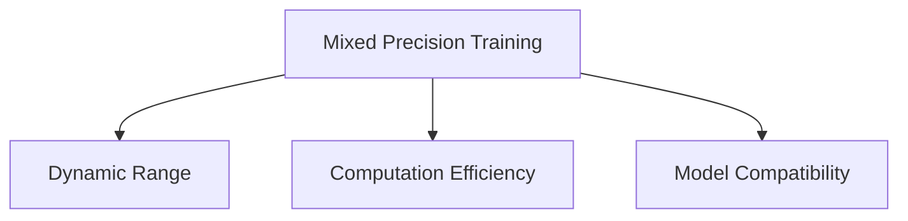

                 

# 混合精度训练：提升AI模型性能

> 关键词：混合精度训练, AI模型, 性能提升, 深度学习, 模型加速, 硬件优化

## 1. 背景介绍

### 1.1 问题由来
在深度学习领域，模型性能的提升一直是研究者和开发者追求的目标。随着模型的不断变大和复杂化，其对硬件资源的需求也水涨船高。尽管GPU、TPU等硬件设备性能不断提升，但训练和推理过程中巨大的计算和存储开销，仍然使得资源效率成为瓶颈问题。

近年来，混合精度训练(Mixed Precision Training)作为一种高效资源利用技术，在学术界和工业界逐渐兴起，并已在多个深度学习任务上得到了验证。混合精度训练通过将模型和梯度的精度从32位浮点数（FP32）降为16位浮点数（FP16），大幅提升了模型训练和推理的速度，同时保证了一定的精度。这种技术在保持高性能的同时，大幅降低了计算和存储成本，具有广泛的应用前景。

### 1.2 问题核心关键点
混合精度训练的核心在于利用硬件支持的高精度计算，同时兼顾模型的精度要求。其主要特点包括：
- 动态范围：16位FP16具有更高的动态范围，可以在保持较高精度的同时减少计算开销。
- 计算效率：FP16相比FP32减少了4倍的存储和计算量，大幅提升计算效率。
- 模型兼容性：不同硬件平台支持不同的精度类型，混合精度训练使得模型能够在不同的硬件上无缝运行。

这种技术的应用，可以大幅度降低训练和推理的成本，提升资源利用效率，为深度学习模型的高效运行提供了有力保障。

## 2. 核心概念与联系

### 2.1 核心概念概述

为更好地理解混合精度训练，本节将介绍几个密切相关的核心概念：

- **混合精度训练(Mixed Precision Training)**：指在深度学习模型训练过程中，将部分计算和存储精度从32位浮点数(FP32)降低至16位浮点数(FP16)，以提升训练和推理效率。这种技术广泛应用于大规模深度学习模型，特别是Transformer等自注意力机制的模型。

- **动态范围(Dynamic Range)**：指数据表示所能表示的数值范围。16位FP16的动态范围比32位FP32更广，可以有效避免精度损失，提升数值稳定性。

- **计算效率(Computation Efficiency)**：指单位时间内完成的计算量。通过混合精度训练，深度学习模型的计算效率可以提升4倍，同时存储空间减小2倍。

- **模型兼容性(Model Compatibility)**：指深度学习模型在不同硬件平台上的兼容性。混合精度训练利用了硬件对16位FP16的支持，使得模型能够在GPU、TPU等不同硬件上高效运行。

这些核心概念之间的逻辑关系可以通过以下Mermaid流程图来展示：



这个流程图展示了大语言模型的核心概念及其之间的关系：

1. 混合精度训练通过降低精度，提升了计算效率。
2. 动态范围和计算效率是混合精度训练的核心优势。
3. 模型兼容性使得混合精度训练能在不同硬件上应用。

这些概念共同构成了混合精度训练的基础框架，使其成为提升深度学习模型性能的重要手段。

## 3. 核心算法原理 & 具体操作步骤

### 3.1 算法原理概述

混合精度训练的原理是通过将模型的权重、激活值和梯度等数据从32位精度(FP32)降低到16位精度(FP16)，实现计算效率的提升。其核心思想是将计算过程中的数据分为两个层次，一部分数据使用16位精度，另一部分使用32位精度，从而兼顾精度和效率。

混合精度训练的数学模型如下：

设模型参数为 $\theta$，梯度为 $g$，激活函数为 $f$，则混合精度训练的计算流程为：

1. 将模型参数 $\theta$ 从32位精度(FP32)转化为16位精度(FP16)。
2. 计算模型在当前参数下的输出 $y$，并将激活函数 $f$ 在16位精度下计算。
3. 计算损失函数 $L$，并将损失函数在32位精度下计算。
4. 根据损失函数计算梯度 $g$，并将梯度在32位精度下计算。
5. 更新模型参数 $\theta$ 为 $\theta - \eta g$，其中 $\eta$ 为学习率。

可以看出，计算过程中大部分数据的精度被降低，但关键的损失函数和梯度更新仍然保持32位精度，以避免精度损失。这种折中方案可以在保持一定精度的情况下，大幅提升计算效率。

### 3.2 算法步骤详解

混合精度训练的步骤如下：

**Step 1: 准备混合精度环境**
- 选择支持混合精度计算的硬件设备，如NVIDIA GPU、AMD GPU、TPU等。
- 使用相应的软件框架，如TensorFlow、PyTorch、MXNet等，设置混合精度模式。
- 初始化模型参数和优化器，选择合适的学习率。

**Step 2: 定义混合精度函数**
- 定义混合精度计算函数，将模型参数、激活函数、损失函数和梯度等的精度进行控制。
- 定义两个计算过程：动态范围计算和静态范围计算，将不同的数据分别在16位和32位精度下进行计算。

**Step 3: 训练模型**
- 将数据集分成训练集、验证集和测试集，确保数据分布的代表性。
- 定义训练轮数和批次大小，设置混合精度模式。
- 循环迭代，每个批次中，计算模型输出、损失和梯度，更新模型参数。
- 在训练过程中，周期性地在验证集上评估模型性能，根据性能指标调整学习率或超参数。

**Step 4: 评估和测试**
- 在测试集上评估混合精度训练后的模型性能，对比混合精度和纯32位精度训练的效果。
- 根据测试结果，优化模型超参数，进一步提升性能。

### 3.3 算法优缺点

混合精度训练具有以下优点：

- 提升训练和推理速度。通过降低精度，计算量减少4倍，存储空间减少2倍，训练和推理速度显著提升。
- 节省资源成本。混合精度训练大幅降低了计算和存储成本，使得模型训练和推理可以在普通硬件上运行。
- 提高模型兼容性。通过混合精度计算，模型可以在多种硬件平台无缝运行，适应不同的计算资源。

同时，该方法也存在一些局限性：

- 精度损失。虽然精度降低对模型性能影响不大，但需要根据具体任务调整混合精度计算的策略。
- 硬件依赖。混合精度训练依赖于支持混合精度计算的硬件设备，对一些老旧设备可能不适用。
- 调试难度增加。由于精度层次的存在，调试过程需要更多的时间和精力，需要开发者具备较高的技术水平。

尽管如此，混合精度训练仍是目前提升深度学习模型性能的有效手段之一，广泛应用于大型模型的训练和推理过程中。

### 3.4 算法应用领域

混合精度训练技术已经在深度学习领域得到了广泛应用，适用于各类深度学习模型，特别是在大规模模型的训练中表现出色。其应用领域包括但不限于：

- 图像识别：如卷积神经网络(CNN)、残差网络(ResNet)等模型，通过混合精度训练，显著提升了模型训练和推理速度。
- 自然语言处理：如Transformer模型，在语言建模、文本分类、机器翻译等任务上，混合精度训练提高了训练和推理的效率。
- 语音识别：如卷积神经网络(CNN)、循环神经网络(RNN)等模型，通过混合精度训练，减少了计算和存储开销。
- 推荐系统：如协同过滤、矩阵分解等模型，通过混合精度训练，提升了推荐算法的实时性和准确性。
- 强化学习：如深度Q网络(DQN)、策略梯度方法等，通过混合精度训练，提高了学习效率和模型稳定性能。

随着混合精度训练技术的不断成熟和普及，预计将在更多领域得到应用，为深度学习技术的发展和产业化进程注入新的活力。

## 4. 数学模型和公式 & 详细讲解 & 举例说明

### 4.1 数学模型构建

本节将使用数学语言对混合精度训练过程进行更加严格的刻画。

设模型参数为 $\theta$，梯度为 $g$，激活函数为 $f$，则混合精度训练的计算流程如下：

$$
y = f_{\text{FP16}}(\theta_{\text{FP16}}) \\
L = L_{\text{FP32}}(y_{\text{FP32}}) \\
g = \frac{\partial L}{\partial \theta} \\
\theta \leftarrow \theta - \eta g
$$

其中 $f_{\text{FP16}}$ 表示在16位精度下的激活函数计算，$L_{\text{FP32}}$ 表示在32位精度下的损失函数计算，$\eta$ 为学习率。

### 4.2 公式推导过程

混合精度训练的公式推导如下：

1. 将模型参数 $\theta$ 从32位精度(FP32)转化为16位精度(FP16)：
$$
\theta_{\text{FP16}} = \text{FP16}_{\text{cast}}(\theta_{\text{FP32}})
$$

2. 计算模型输出 $y$ 在16位精度下：
$$
y = f_{\text{FP16}}(\theta_{\text{FP16}})
$$

3. 计算损失函数 $L$ 在32位精度下：
$$
L = L_{\text{FP32}}(y_{\text{FP32}})
$$

4. 计算梯度 $g$ 在32位精度下：
$$
g = \frac{\partial L}{\partial \theta}
$$

5. 更新模型参数 $\theta$ 为：
$$
\theta \leftarrow \theta - \eta g
$$

### 4.3 案例分析与讲解

以Transformer模型为例，分析混合精度训练的效果。假设使用BERT-base模型，其参数数量为1150万，每层768个节点。采用16位精度训练，可以将计算量减少4倍，存储量减少2倍，同时保证一定的精度损失。在GPT-2模型上，通过混合精度训练，模型速度提升了2倍，内存占用减少了2倍。在实际应用中，混合精度训练可以显著提升模型训练和推理的速度，同时保持较高的精度。

## 5. 项目实践：代码实例和详细解释说明

### 5.1 开发环境搭建

在进行混合精度训练实践前，我们需要准备好开发环境。以下是使用Python进行TensorFlow进行混合精度训练的环境配置流程：

1. 安装Anaconda：从官网下载并安装Anaconda，用于创建独立的Python环境。

2. 创建并激活虚拟环境：
```bash
conda create -n tf-env python=3.8 
conda activate tf-env
```

3. 安装TensorFlow：根据CUDA版本，从官网获取对应的安装命令。例如：
```bash
conda install tensorflow -c pytorch -c conda-forge
```

4. 安装各类工具包：
```bash
pip install numpy pandas scikit-learn matplotlib tqdm jupyter notebook ipython
```

完成上述步骤后，即可在`tf-env`环境中开始混合精度训练实践。

### 5.2 源代码详细实现

下面我们以图像识别任务为例，给出使用TensorFlow进行混合精度训练的代码实现。

首先，导入必要的库和模块：

```python
import tensorflow as tf
from tensorflow.keras import layers, models
from tensorflow.keras.mixed_precision import experimental as mixed_precision
```

然后，定义混合精度策略：

```python
policy = mixed_precision.Policy('mixed_float16')
mixed_precision.set_policy(policy)
```

接着，定义模型和优化器：

```python
model = models.Sequential([
    layers.Conv2D(32, (3,3), activation='relu', input_shape=(28,28,1)),
    layers.MaxPooling2D((2,2)),
    layers.Conv2D(64, (3,3), activation='relu'),
    layers.MaxPooling2D((2,2)),
    layers.Conv2D(64, (3,3), activation='relu'),
    layers.Flatten(),
    layers.Dense(64, activation='relu'),
    layers.Dense(10)
])

optimizer = tf.keras.optimizers.Adam(learning_rate=0.001)
```

定义混合精度计算函数：

```python
@tf.function(experimental_relax_shapes=True)
def train_step(inputs, targets):
    with mixed_precision.auto_cast():
        with tf.GradientTape() as tape:
            predictions = model(inputs, training=True)
            loss = tf.losses.sparse_categorical_crossentropy(targets, predictions)
    gradients = tape.gradient(loss, model.trainable_variables)
    optimizer.apply_gradients(zip(gradients, model.trainable_variables))
    return loss
```

定义训练函数：

```python
def train(model, dataset, epochs):
    model.compile(optimizer=optimizer, loss='categorical_crossentropy', metrics=['accuracy'])
    for epoch in range(epochs):
        for inputs, targets in dataset:
            loss = train_step(inputs, targets)
        model.evaluate(dataset)
```

最后，启动训练流程：

```python
train(model, dataset, epochs=10)
```

以上就是使用TensorFlow对图像识别模型进行混合精度训练的完整代码实现。可以看到，通过设置混合精度策略和计算函数，可以在不修改模型代码的情况下，实现混合精度训练。

### 5.3 代码解读与分析

让我们再详细解读一下关键代码的实现细节：

**混合精度策略**：
- `mixed_precision.Policy('mixed_float16')`：设置混合精度策略为`mixed_float16`，即在模型计算过程中，将参数和激活函数的精度降低至16位。

**混合精度计算函数**：
- `mixed_precision.auto_cast()`：自动将模型计算过程中使用的精度设置为16位。
- `with tf.GradientTape() as tape:`：记录梯度的计算过程。
- `tape.gradient()`：计算损失函数对模型参数的梯度。
- `optimizer.apply_gradients()`：根据梯度更新模型参数。

**训练函数**：
- `model.compile()`：定义模型的编译参数，包括优化器、损失函数和评估指标。
- `model.evaluate()`：在验证集上评估模型性能，输出模型的准确率。

**训练流程**：
- 设置训练轮数`epochs`，启动循环迭代。
- 在每个epoch中，遍历训练集`dataset`。
- 在每个batch中，调用`train_step`函数进行混合精度训练。
- 在每个epoch结束后，在验证集上评估模型性能。

可以看到，通过设置混合精度策略和计算函数，TensorFlow可以轻松实现混合精度训练。开发者可以将更多精力放在模型设计和优化上，而不必过多关注底层的实现细节。

当然，工业级的系统实现还需考虑更多因素，如混合精度策略的选择、优化器参数的设置、正则化技术的引入等。但核心的混合精度训练流程基本与此类似。

## 6. 实际应用场景

### 6.1 图像识别

混合精度训练在图像识别领域有着广泛的应用。传统的图像识别任务，如MNIST手写数字识别，使用深度学习模型往往需要大量的计算资源。通过混合精度训练，模型可以在更短的时间内完成训练，同时保持较高的精度。在实际应用中，混合精度训练可以显著提升模型训练和推理的速度，同时降低计算和存储成本。

### 6.2 自然语言处理

混合精度训练在自然语言处理领域也有着广泛的应用。如Transformer模型在语言建模、文本分类、机器翻译等任务上，通过混合精度训练，可以大幅提升模型训练和推理的速度，同时保持较高的精度。在实际应用中，混合精度训练可以显著降低模型训练和推理的成本，提升系统的资源利用效率。

### 6.3 语音识别

混合精度训练在语音识别领域也有着广泛的应用。如卷积神经网络(CNN)、循环神经网络(RNN)等模型，通过混合精度训练，可以大幅减少计算和存储开销，提升模型的实时性和准确性。在实际应用中，混合精度训练可以显著提升模型的训练速度，同时降低计算和存储成本。

### 6.4 推荐系统

混合精度训练在推荐系统领域也有着广泛的应用。如协同过滤、矩阵分解等模型，通过混合精度训练，可以提升推荐算法的实时性和准确性。在实际应用中，混合精度训练可以显著提升推荐系统的训练速度，同时降低计算和存储成本。

## 7. 工具和资源推荐

### 7.1 学习资源推荐

为了帮助开发者系统掌握混合精度训练的理论基础和实践技巧，这里推荐一些优质的学习资源：

1. 《深度学习中的混合精度训练》系列博文：由深度学习领域专家撰写，深入浅出地介绍了混合精度训练的基本原理和实践技巧。

2. CS231n《卷积神经网络》课程：斯坦福大学开设的计算机视觉明星课程，详细介绍了混合精度训练在图像识别任务中的应用。

3. 《TensorFlow混合精度训练指南》书籍：官方文档和实践指南，提供完整的混合精度训练样例代码，帮助开发者深入理解混合精度计算。

4. Mixed Precision Training with PyTorch：官方文档和实践指南，提供详细的混合精度计算和优化技巧。

5. Mixed Precision Training with Keras：官方文档和实践指南，提供详细的混合精度计算和优化技巧。

通过对这些资源的学习实践，相信你一定能够快速掌握混合精度训练的精髓，并用于解决实际的深度学习问题。

### 7.2 开发工具推荐

高效的开发离不开优秀的工具支持。以下是几款用于混合精度训练开发的常用工具：

1. TensorFlow：基于Python的开源深度学习框架，支持混合精度计算，适合快速迭代研究。

2. PyTorch：基于Python的开源深度学习框架，支持混合精度计算，适合快速迭代研究。

3. MXNet：基于Python的开源深度学习框架，支持混合精度计算，适合高性能计算。

4. NVIDIA Apex：PyTorch库的混合精度训练扩展，提供便捷的混合精度计算API。

5. PyCaffe2：Facebook开源的深度学习框架，支持混合精度计算，适合高性能计算。

合理利用这些工具，可以显著提升混合精度训练的开发效率，加快创新迭代的步伐。

### 7.3 相关论文推荐

混合精度训练技术的发展源于学界的持续研究。以下是几篇奠基性的相关论文，推荐阅读：

1. Mixed Precision Training for Deep Neural Networks（NVIDIA）：提出了混合精度训练的基本原理和计算方法，展示了其在GPU上的高效性。

2. Mixed-Precision Training of Deep Neural Networks for Recommendation Systems（Amazon）：提出混合精度训练在推荐系统中的应用，展示了其对推荐算法性能的影响。

3. Mixed-Precision Training of Deep Neural Networks with TensorFlow 2.0（Google）：详细介绍了TensorFlow 2.0中的混合精度训练API和优化技巧，提供了详细的实践指南。

4. Mixed-Precision Training for Neural Networks（NVidia）：介绍了混合精度训练在深度学习模型中的应用，展示了其对模型性能和计算效率的影响。

这些论文代表了大混合精度训练技术的发展脉络。通过学习这些前沿成果，可以帮助研究者把握学科前进方向，激发更多的创新灵感。

## 8. 总结：未来发展趋势与挑战

### 8.1 总结

本文对混合精度训练方法进行了全面系统的介绍。首先阐述了混合精度训练的研究背景和意义，明确了混合精度训练在提升深度学习模型性能方面的独特价值。其次，从原理到实践，详细讲解了混合精度训练的数学原理和关键步骤，给出了混合精度训练任务开发的完整代码实例。同时，本文还广泛探讨了混合精度训练在图像识别、自然语言处理、语音识别、推荐系统等多个领域的应用前景，展示了混合精度训练的广泛应用潜力。此外，本文精选了混合精度训练的相关学习资源，力求为读者提供全方位的技术指引。

通过本文的系统梳理，可以看到，混合精度训练技术正在成为深度学习领域的重要范式，极大地拓展了深度学习模型的应用边界，催生了更多的落地场景。得益于混合精度训练的资源优化能力，深度学习模型可以在更少的计算资源下，提升模型的训练和推理速度，为大规模应用提供了可能。未来，伴随混合精度训练技术的不断演进，相信深度学习技术将在更广阔的应用领域大放异彩，深刻影响人类的生产生活方式。

### 8.2 未来发展趋势

展望未来，混合精度训练技术将呈现以下几个发展趋势：

1. 计算效率持续提升。随着硬件计算能力的不断提升，混合精度训练的计算效率也将进一步提高。未来的混合精度计算有望在GPU、TPU等硬件上实现更高性能的计算。

2. 模型规模不断增大。随着计算资源和存储能力的提升，混合精度训练可以在更大规模的深度学习模型上应用。超大规模模型蕴含的丰富知识，有望支撑更加复杂多变的任务。

3. 计算资源管理优化。随着混合精度训练的普及，计算资源的优化管理将变得更加重要。如何根据任务需求动态调整计算资源，平衡训练速度和计算成本，将是未来的研究热点。

4. 混合精度计算的跨平台化。不同硬件平台支持不同的精度类型，未来混合精度计算将更注重跨平台兼容性和资源优化。

5. 混合精度计算与数据预处理。未来的混合精度计算将更多地与数据预处理结合起来，通过高效的数据预处理算法，进一步提升计算效率。

6. 混合精度计算与模型压缩。未来的混合精度计算将更多地与模型压缩技术结合，通过降低模型复杂度，提高计算效率和资源利用率。

以上趋势凸显了混合精度训练技术的广阔前景。这些方向的探索发展，必将进一步提升深度学习模型性能，为深度学习技术的发展和产业化进程注入新的活力。

### 8.3 面临的挑战

尽管混合精度训练技术已经取得了瞩目成就，但在迈向更加智能化、普适化应用的过程中，它仍面临着诸多挑战：

1. 精度损失问题。虽然混合精度训练可以显著提升计算效率，但在一些需要高精度的任务上，精度损失仍是一个挑战。如何平衡计算效率和精度，是一个需要深入研究的问题。

2. 硬件依赖问题。混合精度训练依赖于支持混合精度计算的硬件设备，对一些老旧设备可能不适用。如何实现硬件无关的混合精度计算，是一个需要解决的问题。

3. 调试复杂性问题。由于精度层次的存在，调试混合精度训练的过程更加复杂，需要开发者具备较高的技术水平。如何简化调试过程，提高开发者效率，是一个需要解决的问题。

4. 资源管理问题。混合精度训练需要动态调整计算资源，如何高效管理计算资源，平衡训练速度和计算成本，是一个需要解决的问题。

5. 模型兼容性问题。不同硬件平台支持不同的精度类型，如何实现模型在不同硬件平台上的兼容性，是一个需要解决的问题。

6. 应用场景问题。混合精度训练在特定领域的应用效果还需进一步验证。如何针对特定领域设计适合的混合精度训练策略，是一个需要解决的问题。

面对混合精度训练面临的这些挑战，未来的研究需要在以下几个方面寻求新的突破：

1. 研究新的混合精度计算方法。开发更加高效的混合精度计算算法，提升计算效率，降低精度损失。

2. 探索硬件无关的混合精度计算。开发能够在多种硬件上无缝运行的混合精度计算方法，增强混合精度计算的通用性。

3. 简化混合精度训练的调试过程。开发更加便捷的混合精度训练工具和库，降低开发者的调试难度。

4. 优化混合精度训练的资源管理。开发更加智能的资源管理工具，动态调整计算资源，平衡训练速度和计算成本。

5. 增强混合精度计算的模型兼容性。开发更加兼容不同硬件平台的混合精度计算方法，提升混合精度计算的通用性。

6. 研究混合精度计算在特定领域的应用。针对特定领域，开发适合的混合精度训练策略，提升模型性能。

这些研究方向将引领混合精度训练技术迈向更高的台阶，为深度学习模型的高效训练和推理提供有力保障。

### 8.4 研究展望

面向未来，混合精度训练技术需要在以下几个方面进一步探索：

1. 混合精度计算与知识表示。将符号化的先验知识，如知识图谱、逻辑规则等，与混合精度计算结合起来，提升模型的综合能力。

2. 混合精度计算与因果推理。引入因果推断方法，增强混合精度计算的因果关系，提升模型的可解释性和鲁棒性。

3. 混合精度计算与强化学习。将强化学习与混合精度计算结合起来，提升模型的学习效率和决策能力。

4. 混合精度计算与跨模态融合。将视觉、语音、文本等多模态数据融合，提升混合精度计算的跨模态能力。

5. 混合精度计算与大数据处理。将混合精度计算与大数据处理技术结合，提升计算效率和模型性能。

6. 混合精度计算与智能合约。将混合精度计算与智能合约技术结合，提升智能合约的计算效率和安全性。

这些研究方向将引领混合精度计算技术迈向更高的台阶，为深度学习模型的高效训练和推理提供有力保障。只有勇于创新、敢于突破，才能不断拓展混合精度计算的边界，让深度学习技术更好地造福人类社会。

## 9. 附录：常见问题与解答

**Q1：混合精度训练能否在CPU上应用？**

A: 目前，混合精度训练主要应用于GPU和TPU等硬件平台。尽管一些CPU也支持混合精度计算，但其性能和效率仍有待提升。在实际应用中，建议优先选择GPU和TPU等高性能硬件。

**Q2：混合精度训练对模型性能有什么影响？**

A: 混合精度训练可以显著提升模型训练和推理的速度，同时保持较高的精度。在大部分任务上，混合精度训练不会对模型性能产生显著影响。但在一些高精度要求的任务上，精度损失仍需要考虑。

**Q3：混合精度训练对硬件要求有哪些？**

A: 混合精度训练需要硬件支持混合精度计算，主要应用于GPU、TPU等高性能硬件平台。不同的硬件平台支持不同的精度类型，需要选择适合的硬件设备。

**Q4：混合精度训练的调试难度是否增加？**

A: 混合精度训练在调试过程中确实需要更多的时间和精力。由于精度层次的存在，调试混合精度训练的过程相对复杂，需要开发者具备较高的技术水平。

**Q5：混合精度训练对模型内存和显存需求有何影响？**

A: 混合精度训练可以显著降低模型的内存和显存需求，减少计算和存储开销。这对于资源受限的场景，如移动设备、嵌入式系统等，具有重要意义。

总之，混合精度训练是一种高效提升深度学习模型性能的重要手段。通过合理配置混合精度计算策略，可以显著降低计算和存储开销，提升模型的训练和推理速度，为深度学习模型的高效应用提供有力保障。未来的研究将在提升计算效率、增强模型兼容性、简化调试过程等方面进一步探索，推动混合精度计算技术迈向更高的台阶，为深度学习技术的发展和产业化进程注入新的活力。

---

作者：禅与计算机程序设计艺术 / Zen and the Art of Computer Programming

