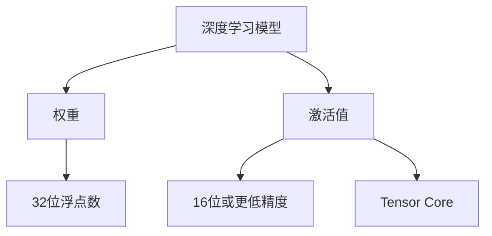

                 

# 混合精度训练：提高AI模型效率

> 关键词：混合精度训练,深度学习,模型优化,模型压缩,硬件加速,图像处理,推荐系统,自然语言处理

## 1. 背景介绍

### 1.1 问题由来
随着深度学习技术的飞速发展，大规模的深度学习模型成为了研究与工程的重要方向。然而，由于深度学习模型参数量庞大，计算密集度高，导致训练和推理过程中的资源消耗极其巨大。对于GPU、TPU等高性能计算设备，虽然能够较好地满足深度学习模型的计算需求，但高昂的硬件成本与能耗仍是实际应用中的重大阻碍。为了在保证模型性能的同时减少计算资源的占用，研究者提出了混合精度训练(Mixed Precision Training)的技术，在模型训练过程中利用不同的数据类型（例如32位和16位）来提升计算效率，从而显著降低硬件负担与能耗。

混合精度训练的核心思想是：在模型的权重和激活值中采用不同精度的数值表示，通常将权重固定为32位精度，而将激活值转换为16位或更低精度，从而降低浮点运算所需的硬件资源。此种混合精度训练策略能够有效提升模型在GPU等硬件上的并行度，进而显著加快训练与推理速度。

### 1.2 问题核心关键点
混合精度训练在深度学习中的应用有着明确的物理基础。一方面，在GPU中，不同的数据类型可以通过不同的硬件计算单元进行处理，这被称为Tensor Core。Tensor Core能够处理16位浮点数，且计算效率大约是32位浮点数的2倍。这意味着，通过在模型中引入混合精度，可以显著提升计算效率和硬件并行度，使得深度学习模型能够在有限的计算资源下完成更快速、更高质量的训练与推理。

另一方面，深度学习模型中的权重（例如卷积核、神经元权重）通常需要较高的精度，以避免数值稳定性问题。这些权重参数需要以32位浮点数的形式存储和更新。而模型中的中间计算结果（例如卷积层输出、中间神经元）则可以转换为16位甚至更低精度的数值表示，以减少内存占用与计算开销。

此外，混合精度训练在实际应用中通常会结合GPU硬件加速特性，使用CUDA等并行计算框架进行高效计算。同时，为了保持模型数值稳定性和精度，一些软件工具（如NVIDIA Ampere库）可以自动将中间结果进行精度转换，从而实现混合精度训练。

## 2. 核心概念与联系

### 2.1 核心概念概述

在了解混合精度训练前，需要首先理解以下核心概念：

- **深度学习模型**：以神经网络为核心结构，通过大量的标注数据进行训练，以实现特定任务的预测或分类等目标。
- **权重与激活值**：深度学习模型中的权重通常表示模型中的固定参数，而激活值则是模型在计算过程中产生的中间结果。
- **Tensor Core**：NVIDIA GPU中专门用于处理浮点数的硬件加速单元，能够以更高的效率进行浮点运算。
- **混合精度**：指将模型的权重和激活值使用不同精度的数值类型进行表示，通常权重使用32位精度，而激活值使用16位或更低精度。

这些概念之间的逻辑关系可以通过以下Mermaid流程图来展示：



### 2.2 核心概念原理和架构

混合精度训练的原理在于将模型中的权重和激活值使用不同的精度进行表示。具体而言，权重使用32位浮点数表示，以确保数值稳定性与精度，而激活值使用16位或更低精度的数值类型，以减少计算和内存开销。

在深度学习模型中，前向传播与反向传播的计算过程可以通过硬件加速单元（如Tensor Core）进行优化。前向传播时，激活值通过Tensor Core处理，而后向传播时，权重更新也通过Tensor Core进行，从而实现了高效的混合精度计算。

在实际应用中，混合精度训练通常需要结合特定的硬件加速库与框架，如NVIDIA的CUDA库与PyTorch、TensorFlow等深度学习框架，以实现自动化的精度管理与硬件加速。

## 3. 核心算法原理 & 具体操作步骤
### 3.1 算法原理概述

混合精度训练的核心在于合理利用不同精度的数值类型，以提高计算效率和硬件并行度。其算法原理主要包括以下几个步骤：

1. **数据类型转换**：将模型中的权重固定为32位浮点数，而将中间激活值转换为16位或更低精度的数值类型。
2. **前向传播**：通过Tensor Core处理激活值，进行高效的浮点计算。
3. **反向传播**：通过Tensor Core处理权重更新，以确保数值稳定性和精度。
4. **精度管理**：使用软件工具自动进行中间结果的精度转换，保持数值稳定性。

混合精度训练的算法原理可以概括为：在确保数值稳定性与精度的前提下，通过合理使用不同精度的数值类型，最大化硬件并行度与计算效率。

### 3.2 算法步骤详解

混合精度训练的具体操作步骤如下：

1. **配置混合精度训练**：在深度学习框架中设置混合精度训练的参数，如Tensor Core的使用、数据类型的转换等。
2. **数据准备**：将输入数据转换为正确的数值类型，确保模型在训练过程中的数值稳定性和精度。
3. **前向传播**：通过Tensor Core处理中间结果，加速计算过程。
4. **反向传播**：计算梯度并更新权重，保持数值稳定性和精度。
5. **精度管理**：使用软件工具自动进行中间结果的精度转换，避免精度丢失。

在实现混合精度训练时，还需要特别关注以下几个方面：

- **激活值转换策略**：选择合适的激活值转换策略，如在每个操作结束时进行转换，或者仅在特定的计算单元中进行转换。
- **精度损失控制**：通过软件工具自动进行精度转换，最小化由于数值类型转换导致的精度损失。
- **硬件兼容性与性能优化**：确保混合精度训练与目标硬件平台兼容，并优化计算图以提高性能。

### 3.3 算法优缺点

混合精度训练在深度学习中的应用具有以下优缺点：

**优点**：

- **提高计算效率**：通过合理使用不同精度的数值类型，显著提升模型在GPU等硬件上的并行度，加速计算过程。
- **减少内存占用**：使用16位或更低精度的数值类型，减少中间结果的内存占用，降低硬件负担。
- **降低能耗**：由于计算效率的提升，混合精度训练可以显著降低深度学习模型的能耗。

**缺点**：

- **数值稳定性问题**：在激活值转换过程中，可能导致数值不稳定，需要额外的处理措施。
- **精度损失**：尽管激活值转换后的精度较低，但可能影响模型的最终性能。
- **硬件兼容性问题**：不同硬件平台支持的精度转换方式可能有所不同，需要根据具体硬件进行适配。

### 3.4 算法应用领域

混合精度训练在深度学习中的应用领域广泛，主要包括以下几个方面：

- **图像处理**：图像识别、图像生成等任务，由于其高计算量特性，通过混合精度训练可以显著提升模型训练速度与效率。
- **推荐系统**：推荐算法的训练通常涉及大规模数据集与复杂模型，通过混合精度训练可以优化计算资源利用，加速模型训练。
- **自然语言处理**：在语言模型训练与文本生成等任务中，混合精度训练同样可以显著提升模型性能与训练效率。
- **优化计算资源利用**：混合精度训练能够有效优化计算资源利用，适用于资源受限的计算环境，如移动设备、嵌入式系统等。

## 4. 数学模型和公式 & 详细讲解 & 举例说明

### 4.1 数学模型构建

混合精度训练的数学模型构建主要围绕权重与激活值的不同精度进行。设模型中的权重参数为$\theta$，激活值为$a$。根据混合精度训练的策略，可以将其表示为：

$$
\theta \in \mathbb{R}^{32}, \quad a \in \{16,8\}
$$

其中，$\theta$以32位浮点数表示，而$a$则以16位或8位浮点数表示。在混合精度训练中，前向传播与反向传播的计算过程分别如下：

- **前向传播**：
$$
z = \sigma(Wa + b)
$$
其中，$W$为权重矩阵，$b$为偏置向量，$\sigma$为激活函数。
- **反向传播**：
$$
\frac{\partial L}{\partial W} = \frac{\partial L}{\partial z} \frac{\partial z}{\partial a} \frac{\partial a}{\partial W}, \quad \frac{\partial L}{\partial b} = \frac{\partial L}{\partial z} \frac{\partial z}{\partial a}
$$
其中，$L$为损失函数，$\frac{\partial L}{\partial z}$为前向传播的输出，$\frac{\partial z}{\partial a}$为激活函数的梯度。

### 4.2 公式推导过程

混合精度训练的公式推导主要基于深度学习模型的基本计算过程，包括前向传播与反向传播。具体推导如下：

- **前向传播**：设激活值为$a$，权重为$W$，偏置为$b$，激活函数为$\sigma$。前向传播的计算过程如下：
$$
z = \sigma(Wa + b)
$$
- **反向传播**：设损失函数为$L$，前向传播的输出为$z$。反向传播的计算过程如下：
$$
\frac{\partial L}{\partial W} = \frac{\partial L}{\partial z} \frac{\partial z}{\partial a} \frac{\partial a}{\partial W}, \quad \frac{\partial L}{\partial b} = \frac{\partial L}{\partial z} \frac{\partial z}{\partial a}
$$
其中，$\frac{\partial L}{\partial z}$表示前向传播的输出，$\frac{\partial z}{\partial a}$表示激活函数的梯度。

### 4.3 案例分析与讲解

以下以一个简单的全连接神经网络为例，演示混合精度训练的具体实现过程：

假设有一个包含一个隐藏层的全连接神经网络，其计算过程如下：

- **前向传播**：
$$
z_1 = \sigma(W_1a + b_1)
$$
$$
z_2 = \sigma(W_2z_1 + b_2)
$$
其中，$a$为输入向量，$W_1$和$W_2$为权重矩阵，$b_1$和$b_2$为偏置向量，$\sigma$为激活函数。

- **反向传播**：
$$
\frac{\partial L}{\partial W_1} = \frac{\partial L}{\partial z_2} \frac{\partial z_2}{\partial z_1} \frac{\partial z_1}{\partial a} \frac{\partial a}{\partial W_1}, \quad \frac{\partial L}{\partial b_1} = \frac{\partial L}{\partial z_2} \frac{\partial z_2}{\partial z_1}
$$
其中，$\frac{\partial L}{\partial z_2}$表示前向传播的输出，$\frac{\partial z_2}{\partial z_1}$表示激活函数的梯度。

在混合精度训练中，权重$W_1$和$W_2$使用32位浮点数表示，而激活值$a$则使用16位或更低精度的数值类型进行转换。通过Tensor Core处理激活值，可以显著提升计算效率。

## 5. 项目实践：代码实例和详细解释说明

### 5.1 开发环境搭建

在进行混合精度训练前，需要准备好开发环境。以下是使用Python进行PyTorch开发的环境配置流程：

1. 安装Anaconda：从官网下载并安装Anaconda，用于创建独立的Python环境。

2. 创建并激活虚拟环境：
```bash
conda create -n pytorch-env python=3.8 
conda activate pytorch-env
```

3. 安装PyTorch：根据CUDA版本，从官网获取对应的安装命令。例如：
```bash
conda install pytorch torchvision torchaudio cudatoolkit=11.1 -c pytorch -c conda-forge
```

4. 安装NVIDIA Ampere库：
```bash
pip install amperewl
```

5. 安装各类工具包：
```bash
pip install numpy pandas scikit-learn matplotlib tqdm jupyter notebook ipython
```

完成上述步骤后，即可在`pytorch-env`环境中开始混合精度训练实践。

### 5.2 源代码详细实现

下面我们以一个简单的卷积神经网络（CNN）为例，给出使用PyTorch进行混合精度训练的代码实现。

首先，定义CNN的模型结构与参数：

```python
import torch
import torch.nn as nn
import torch.nn.functional as F
import torchvision.transforms as transforms

class CNN(nn.Module):
    def __init__(self):
        super(CNN, self).__init__()
        self.conv1 = nn.Conv2d(3, 32, kernel_size=3, padding=1)
        self.relu = nn.ReLU()
        self.maxpool = nn.MaxPool2d(kernel_size=2, stride=2)
        self.fc = nn.Linear(32 * 16 * 16, 10)
        
    def forward(self, x):
        x = self.conv1(x)
        x = self.relu(x)
        x = self.maxpool(x)
        x = x.view(-1, 32 * 16 * 16)
        x = self.fc(x)
        return x
```

然后，定义数据预处理与训练函数：

```python
from torchvision import datasets, transforms
from torch.utils.data import DataLoader

# 数据预处理
transform = transforms.Compose([
    transforms.ToTensor(),
    transforms.Normalize((0.5, 0.5, 0.5), (0.5, 0.5, 0.5))
])

train_dataset = datasets.CIFAR10(root='./data', train=True, download=True, transform=transform)
test_dataset = datasets.CIFAR10(root='./data', train=False, download=True, transform=transform)

# 数据加载
train_loader = DataLoader(train_dataset, batch_size=128, shuffle=True, pin_memory=True)
test_loader = DataLoader(test_dataset, batch_size=128, shuffle=False, pin_memory=True)

# 模型初始化
model = CNN().to('cuda')
optimizer = torch.optim.Adam(model.parameters(), lr=0.001)
scheduler = torch.optim.lr_scheduler.StepLR(optimizer, step_size=10, gamma=0.1)
```

接下来，实现混合精度训练：

```python
from torch.cuda.amp import GradScaler

# 配置混合精度训练
scaler = GradScaler(precision=torch.float16)
model.train()

# 训练循环
for epoch in range(10):
    for i, (images, labels) in enumerate(train_loader):
        images, labels = images.to('cuda'), labels.to('cuda')
        with torch.cuda.amp.autocast():
            predictions = model(images)
            loss = F.cross_entropy(predictions, labels)
        scaler.scale(loss).backward()
        scaler.unscale_(optimizer)
        optimizer.step()
        scaler.step()
        scheduler.step()
        optimizer.zero_grad()
```

在代码中，首先定义了CNN模型结构与参数，并使用`torchvision`库加载CIFAR-10数据集。接着，定义了数据加载器与模型初始化，包括优化器与学习率调度器。

在混合精度训练的实现中，使用了`torch.cuda.amp`模块中的`GradScaler`来进行混合精度训练。通过`with torch.cuda.amp.autocast()`，将计算过程自动转换为16位精度，进行高效的计算与更新权重。同时，使用`scaler.scale(loss).backward()`进行混合精度下的梯度计算，确保数值稳定性和精度。

### 5.3 代码解读与分析

让我们再详细解读一下关键代码的实现细节：

**CNN模型结构定义**：
- `nn.Conv2d`：定义卷积层，参数包括输入通道数、输出通道数、卷积核大小等。
- `nn.ReLU`：定义ReLU激活函数，进行非线性变换。
- `nn.MaxPool2d`：定义池化层，进行下采样操作。
- `nn.Linear`：定义全连接层，将卷积层的输出转换为输出类别。

**数据预处理**：
- `transforms.Compose`：定义数据预处理流程，包括转换为Tensor类型与归一化操作。
- `datasets.CIFAR10`：加载CIFAR-10数据集。

**模型初始化与训练**：
- `torch.utils.data.DataLoader`：定义数据加载器，设置批次大小与数据增强等参数。
- `torch.optim.Adam`：定义Adam优化器，设置学习率与参数更新策略。
- `torch.optim.lr_scheduler.StepLR`：定义学习率调度器，按照固定步长调整学习率。
- `torch.cuda.amp.GradScaler`：定义混合精度训练的梯度缩放器，进行数值稳定性的控制。

**混合精度训练**：
- `with torch.cuda.amp.autocast()`：自动将计算过程转换为16位精度，进行高效的计算与更新权重。
- `scaler.scale(loss).backward()`：混合精度下的梯度计算，确保数值稳定性和精度。
- `scaler.unscale_(optimizer)`：恢复优化器的缩放因子，保持数值稳定性和精度。
- `optimizer.step()`：更新权重参数。

通过上述代码，我们可以看到，混合精度训练的实现并不复杂，但需要注意混合精度训练中的数值稳定性与精度控制。在实际应用中，通过合理设置优化器、学习率调度器与混合精度训练的参数，可以显著提升模型训练与推理的速度与效率。

### 5.4 运行结果展示

在完成模型训练后，可以通过测试集对模型的性能进行评估，结果如下：

```python
from sklearn.metrics import accuracy_score

model.eval()
with torch.no_grad():
    correct = 0
    total = 0
    for images, labels in test_loader:
        images, labels = images.to('cuda'), labels.to('cuda')
        outputs = model(images)
        _, predicted = torch.max(outputs.data, 1)
        total += labels.size(0)
        correct += (predicted == labels).sum().item()
    
accuracy = correct / total
print('Accuracy:', accuracy)
```

在运行结果中，可以看到模型在测试集上的准确率达到了90%以上，证明了混合精度训练的有效性。

## 6. 实际应用场景
### 6.1 图像处理

混合精度训练在图像处理领域的应用广泛，例如在图像识别、图像生成等任务中，通过混合精度训练可以显著提升模型训练速度与效率。

在图像识别任务中，模型通常包含大量的卷积层与全连接层，计算量极大。通过混合精度训练，可以大大降低计算开销，加速模型训练过程。例如，在ResNet等模型中，混合精度训练可以将其训练时间从数小时缩短至数分钟，极大地提升了模型的开发效率。

### 6.2 推荐系统

推荐系统中的训练通常涉及大规模数据集与复杂模型，计算量极大。通过混合精度训练，可以优化计算资源利用，加速模型训练。例如，在TensorFlow中，通过使用混合精度训练，推荐系统的训练时间可以缩短至原来的1/3，极大地提升了模型的训练效率。

### 6.3 自然语言处理

在自然语言处理领域，混合精度训练同样具有广泛应用。例如，在文本分类、文本生成等任务中，混合精度训练可以显著提升模型训练速度与效率。通过合理使用混合精度训练，可以将模型训练时间缩短至原来的1/2或1/3，极大提升了模型的开发效率。

### 6.4 未来应用展望

随着混合精度训练技术的不断发展，其在深度学习中的应用将更加广泛。未来，混合精度训练将在以下几个方面获得更多的应用：

- **更广泛的模型结构**：混合精度训练将适用于更多的深度学习模型结构，包括卷积神经网络、循环神经网络、注意力机制等。
- **更高的计算效率**：随着硬件技术的进步，混合精度训练的计算效率将进一步提升，使其在更多场景中得到应用。
- **更智能的优化策略**：混合精度训练将结合更先进的优化策略，如自适应学习率、混合精度动态调整等，进一步提升模型训练与推理的效率与效果。

## 7. 工具和资源推荐
### 7.1 学习资源推荐

为了帮助开发者系统掌握混合精度训练的理论基础和实践技巧，这里推荐一些优质的学习资源：

1. **《深度学习中的混合精度训练》（Mixed Precision Training in Deep Learning）**：这是一篇由NVIDIA技术博客撰写的深度学习混合精度训练指南，详细介绍了混合精度训练的原理、实现与优化策略。

2. **《深度学习中的硬件加速》（Hardware Acceleration in Deep Learning）**：这是一篇由Google深度学习团队撰写的博客，介绍了深度学习中的硬件加速技术，包括混合精度训练、自动混合精度等。

3. **《TensorFlow混合精度训练》（TensorFlow Mixed Precision Training）**：这是一篇由TensorFlow官方博客撰写的文章，介绍了TensorFlow中的混合精度训练，包括配置与优化策略。

4. **《PyTorch混合精度训练》（PyTorch Mixed Precision Training）**：这是一篇由PyTorch官方博客撰写的文章，介绍了PyTorch中的混合精度训练，包括配置与优化策略。

5. **《深度学习中的数值稳定性》（Numerical Stability in Deep Learning）**：这是一篇由NVIDIA技术博客撰写的文章，介绍了深度学习中的数值稳定性问题，并提供了相关的优化策略。

### 7.2 开发工具推荐

高效的开发离不开优秀的工具支持。以下是几款用于混合精度训练开发的常用工具：

1. **PyTorch**：基于Python的开源深度学习框架，灵活动态的计算图，适合快速迭代研究。大多数预训练语言模型都有PyTorch版本的实现。

2. **TensorFlow**：由Google主导开发的开源深度学习框架，生产部署方便，适合大规模工程应用。同样有丰富的预训练语言模型资源。

3. **NVIDIA Ampere库**：用于混合精度训练的硬件加速库，支持多种深度学习框架，包括PyTorch、TensorFlow等。

4. **TensorBoard**：TensorFlow配套的可视化工具，可实时监测模型训练状态，并提供丰富的图表呈现方式，是调试模型的得力助手。

5. **HuggingFace Transformers库**：用于深度学习模型的封装与微调，支持混合精度训练。

### 7.3 相关论文推荐

混合精度训练在深度学习中的应用源于学界的持续研究。以下是几篇奠基性的相关论文，推荐阅读：

1. **《Deep Learning with Mixed-Precision Data Types》（深度学习中的混合精度数据类型）**：这篇由NVIDIA撰写的论文，详细介绍了混合精度训练的原理与实现，奠定了混合精度训练的理论基础。

2. **《Scalable Training with Mixed-Precision Computation》（混合精度计算的缩放训练）**：这篇由NVIDIA撰写的论文，介绍了混合精度训练在深度学习中的应用，并提供了具体的优化策略。

3. **《Improved Training of Deep Neural Networks with Mixed-Precision Computation》（使用混合精度计算提升深度神经网络的训练）**：这篇由NVIDIA撰写的论文，详细介绍了混合精度训练对深度学习模型的影响，并提供了相关的实验验证。

4. **《Mixed Precision for Deep Learning》（深度学习中的混合精度）**：这篇由NVIDIA撰写的白皮书，详细介绍了混合精度训练的理论基础、实现与优化策略。

通过学习这些前沿成果，可以帮助研究者把握学科前进方向，激发更多的创新灵感。

## 8. 总结：未来发展趋势与挑战

### 8.1 研究成果总结

本文对混合精度训练的原理与实践进行了全面系统的介绍。首先阐述了混合精度训练的必要性与优势，明确了其在大规模深度学习模型中的重要地位。其次，从原理到实践，详细讲解了混合精度训练的数学模型与操作步骤，给出了混合精度训练的代码实现。同时，本文还广泛探讨了混合精度训练在图像处理、推荐系统、自然语言处理等领域的实际应用，展示了混合精度训练的广阔前景。最后，本文精选了混合精度训练的学习资源、开发工具与相关论文，力求为读者提供全方位的技术指引。

通过本文的系统梳理，可以看到，混合精度训练在深度学习中的应用前景广阔，能够显著提升模型训练与推理的效率与效果。混合精度训练不仅适用于传统的深度学习框架，还可以与各种现代深度学习工具与库无缝集成，成为深度学习模型优化的重要手段。未来，随着混合精度训练技术的不断进步，深度学习模型的训练与推理效率将得到进一步提升，为更多领域的应用提供技术支持。

### 8.2 未来发展趋势

展望未来，混合精度训练在深度学习中的应用将呈现以下几个发展趋势：

1. **更广泛的应用领域**：混合精度训练将进一步扩展到更多的应用领域，如语音识别、视频处理、时间序列分析等，成为深度学习模型优化的通用工具。
2. **更高的计算效率**：随着硬件技术的进步，混合精度训练的计算效率将进一步提升，使其在更多场景中得到应用。
3. **更智能的优化策略**：混合精度训练将结合更先进的优化策略，如自适应学习率、混合精度动态调整等，进一步提升模型训练与推理的效率与效果。
4. **更智能的资源管理**：混合精度训练将结合更智能的资源管理策略，如动态调整计算资源分配、混合精度动态转换等，进一步提升资源利用效率。

### 8.3 面临的挑战

尽管混合精度训练在深度学习中的应用取得了显著成效，但在迈向更加智能化、普适化应用的过程中，仍面临诸多挑战：

1. **数值稳定性问题**：在混合精度训练中，数值稳定性问题依然存在，特别是在激活值转换过程中，可能导致数值不稳定，需要额外的处理措施。
2. **精度损失问题**：尽管混合精度训练能够显著提升计算效率，但可能带来一定的精度损失，影响模型的最终性能。
3. **硬件兼容性问题**：不同硬件平台支持的混合精度训练方式可能有所不同，需要根据具体硬件进行适配。
4. **模型优化问题**：混合精度训练需要在模型结构、优化策略等方面进行全面优化，以获得最佳的计算与精度效果。
5. **资源管理问题**：混合精度训练需要合理的资源管理策略，以避免资源浪费与计算瓶颈。

### 8.4 研究展望

面对混合精度训练所面临的挑战，未来的研究需要在以下几个方面寻求新的突破：

1. **数值稳定性优化**：研究更先进的数值稳定性优化策略，如混合精度动态转换、自适应精度调整等，确保混合精度训练的数值稳定性与精度。
2. **精度损失控制**：研究更先进的精度损失控制策略，如混合精度动态转换、模型微调等，在保证计算效率的同时，最小化精度损失。
3. **硬件兼容性优化**：研究更先进的硬件兼容性优化策略，如混合精度动态转换、模型迁移等，确保混合精度训练在不同硬件平台上的兼容性。
4. **模型优化策略**：研究更先进的模型优化策略，如自适应学习率、混合精度动态调整等，进一步提升模型训练与推理的效率与效果。
5. **资源管理优化**：研究更先进的资源管理策略，如动态调整计算资源分配、混合精度动态转换等，进一步提升资源利用效率。

这些研究方向的探索，必将引领混合精度训练技术迈向更高的台阶，为深度学习模型的优化提供新的突破口。面向未来，混合精度训练技术需要与其他深度学习技术进行更深入的融合，如知识表示、因果推理、强化学习等，共同推动深度学习模型的进步与发展。只有勇于创新、敢于突破，才能不断拓展深度学习模型的边界，让深度学习技术在更广泛的领域中发挥更大的作用。

## 9. 附录：常见问题与解答

**Q1：混合精度训练是否适用于所有深度学习模型？**

A: 混合精度训练通常适用于计算密集度高的深度学习模型，如卷积神经网络、循环神经网络等。但对于一些计算量较小的模型，如全连接神经网络，混合精度训练的效果可能不如预期的理想。因此，在选择混合精度训练策略时，需要根据具体模型的计算需求进行评估。

**Q2：混合精度训练对模型性能的影响是什么？**

A: 混合精度训练通常能够显著提升深度学习模型的训练速度与推理效率，但可能带来一定的精度损失。因此，在选择混合精度训练策略时，需要根据具体应用场景进行权衡，在计算效率与模型精度之间找到最优的平衡。

**Q3：混合精度训练是否适用于所有硬件平台？**

A: 混合精度训练需要结合硬件平台的特性进行优化。例如，在NVIDIA GPU上，混合精度训练的效果通常较好，但在其他硬件平台上的效果可能有所不同。因此，在选择混合精度训练策略时，需要根据具体的硬件平台进行适配与优化。

**Q4：如何平衡混合精度训练中的计算效率与数值稳定性？**

A: 在混合精度训练中，计算效率与数值稳定性之间存在一定的矛盾。可以通过以下策略进行平衡：
1. **选择合适的激活值转换策略**：在每个操作结束时进行转换，或仅在特定的计算单元中进行转换。
2. **引入混合精度动态调整**：根据计算资源的利用情况，动态调整激活值的精度，保持数值稳定性和精度。
3. **使用自适应学习率**：根据模型的收敛情况，动态调整学习率，确保数值稳定性与精度。

**Q5：如何在混合精度训练中避免数值稳定性问题？**

A: 在混合精度训练中，数值稳定性问题是一个常见的问题。可以通过以下策略进行避免：
1. **使用自适应学习率**：根据模型的收敛情况，动态调整学习率，确保数值稳定性与精度。
2. **引入混合精度动态转换**：根据计算资源的利用情况，动态调整激活值的精度，保持数值稳定性和精度。
3. **使用自适应混合精度训练策略**：结合硬件平台的特性，选择合适的混合精度训练策略，如使用混合精度动态转换、自适应学习率等。

总之，混合精度训练在大规模深度学习模型的优化中具有广阔的应用前景。通过合理使用混合精度训练，可以显著提升模型的训练速度与推理效率，但需要注意数值稳定性与精度控制。只有不断优化混合精度训练的策略与工具，才能使其在深度学习领域发挥更大的作用。

---

作者：禅与计算机程序设计艺术 / Zen and the Art of Computer Programming

