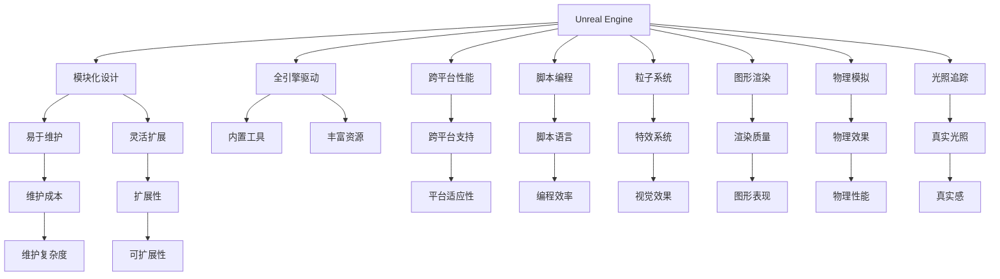

                 

# 游戏开发框架：Unity与Unreal Engine对比

> 关键词：游戏开发,Unity,Unreal Engine,比较,性能,工具,学习资源,资源推荐

## 1. 背景介绍

### 1.1 问题由来
随着计算机图形学和虚拟现实技术的飞速发展，游戏开发技术也日新月异。Unity和Unreal Engine是目前世界上最流行的两大游戏开发引擎，两者都有大量的用户群体和开发者社区支持。然而，选择合适的游戏引擎对于开发者来说是至关重要的，因为不同的引擎有不同的特点、优缺点以及适用场景。

### 1.2 问题核心关键点
本文将详细比较Unity与Unreal Engine两个游戏引擎的核心特性、技术架构、性能表现、开发工具以及实际应用场景，帮助开发者在实际项目中做出明智的选择。

## 2. 核心概念与联系

### 2.1 核心概念概述

#### 2.1.1 Unity

- **Unity**：一款跨平台的游戏引擎，由Unity Technologies开发，支持PC、移动、网页、虚拟现实等多个平台。Unity的核心特点是易于学习、灵活性高，可以用于开发多种类型的游戏和应用。

#### 2.1.2 Unreal Engine

- **Unreal Engine**：由Epic Games开发的一款高性能游戏引擎，以其卓越的图形渲染能力和强大的工具链而著称。它主要用于大型游戏和3D环境开发的复杂项目。

#### 2.1.3 比较

- **核心特性**：Unity和Unreal Engine都支持脚本编程、游戏物理引擎、粒子系统等基本功能。但Unreal Engine更注重图形渲染和物理模拟，而Unity则更注重跨平台和开发效率。

- **技术架构**：Unity采用模块化设计，引擎和代码分离，易于维护和扩展；Unreal Engine采用全引擎驱动架构，提供了丰富的内置工具和资源。

- **性能表现**：Unreal Engine以其高性能的渲染引擎和光追技术著称，但在移动平台上的性能表现可能不如Unity；Unity在跨平台性能上表现更好，但在高质量图形渲染方面不如Unreal Engine。

### 2.2 核心概念原理和架构的 Mermaid 流程图



## 3. 核心算法原理 & 具体操作步骤

### 3.1 算法原理概述

#### 3.1.1 Unity

Unity的核心算法原理主要是模块化设计和脚本编程。其架构由多个模块组成，每个模块负责不同的功能，如物理引擎、渲染引擎、UI系统等。开发者可以通过编写脚本来实现这些模块的逻辑处理，使得Unity具有良好的灵活性和可扩展性。

#### 3.1.2 Unreal Engine

Unreal Engine的算法原理则是全引擎驱动架构。引擎内部集成大量内置工具和资源，如渲染器、物理引擎、动画系统等。开发者可以直接使用这些工具进行开发，而无需编写大量底层代码。这种架构使得Unreal Engine在处理复杂图形和物理效果时具有显著优势。

### 3.2 算法步骤详解

#### 3.2.1 Unity

1. **初始化引擎**：创建新的Unity项目，选择合适的平台目标。
2. **导入资产**：导入必要的3D模型、材质、纹理等资产。
3. **编写脚本**：使用C#或JavaScript编写游戏逻辑和脚本。
4. **测试和优化**：在编辑器中进行测试和调试，优化性能。
5. **发布**：导出最终的游戏文件并发布到目标平台。

#### 3.2.2 Unreal Engine

1. **创建项目**：使用Unreal Engine编辑器创建新项目，设置游戏选项。
2. **导入资产**：导入3D模型、材质、纹理等资产，并进行资源管理。
3. **编写代码**：使用C++或蓝图编写游戏逻辑和脚本。
4. **构建和测试**：在编辑器中进行构建和测试，优化性能。
5. **发布**：导出最终的游戏文件并发布到目标平台。

### 3.3 算法优缺点

#### 3.3.1 Unity

**优点**：
- 易于学习：提供了丰富的教程和文档，使得初学者可以快速上手。
- 灵活性高：模块化设计和脚本编程使得开发者可以灵活定制各种功能。
- 跨平台：支持PC、移动、网页等多个平台，具有广泛的应用场景。

**缺点**：
- 渲染质量：图形渲染能力较Unreal Engine略弱，处理复杂图形时可能需要额外的插件支持。
- 性能优化：跨平台优化和内存管理需要开发者自行处理。

#### 3.3.2 Unreal Engine

**优点**：
- 高性能渲染：支持高质量的光照和反射效果，渲染速度较快。
- 物理引擎强大：内置的物理引擎可以模拟真实的物理效果，适合开发复杂的3D游戏。
- 丰富的工具和资源：提供大量的内置工具和资源，可以快速开发复杂的游戏。

**缺点**：
- 学习曲线陡峭：学习成本较高，需要掌握大量的工具和资源。
- 性能消耗：在移动平台上的性能表现可能不如Unity，需要优化才能发挥最佳效果。

### 3.4 算法应用领域

- **Unity**：适用于小型到中型游戏开发、跨平台应用、教育游戏、虚拟现实等。
- **Unreal Engine**：适用于大型3D游戏、电影级渲染、虚拟现实、增强现实等。

## 4. 数学模型和公式 & 详细讲解 & 举例说明

### 4.1 数学模型构建

#### 4.1.1 Unity

Unity的数学模型主要涉及图形渲染、物理模拟和游戏逻辑处理。其中，图形渲染和物理模拟的算法较为复杂，涉及到光照计算、阴影处理、碰撞检测等。

#### 4.1.2 Unreal Engine

Unreal Engine的数学模型则更加复杂，涉及光照、反射、全局照明、动态全局光照等高级渲染技术。物理模拟方面，Unreal Engine提供了强大的物理引擎，可以模拟复杂的物理效果。

### 4.2 公式推导过程

#### 4.2.1 Unity

在Unity中，常用的数学公式包括光照计算、碰撞检测等。以光照计算为例，Unity使用了Phong光照模型和Gouraud光照模型，用于计算表面的光照强度和颜色。

#### 4.2.2 Unreal Engine

Unreal Engine则使用了BRDF（双向反射分布函数）和IBL（环境光遮蔽）等高级渲染技术。这些技术使得Unreal Engine能够模拟更加逼真的光照效果。

### 4.3 案例分析与讲解

#### 4.3.1 Unity

以《马里奥》系列为例，Unity的开发者利用其模块化和脚本编程的特性，快速实现了游戏逻辑和物理效果。游戏在多个平台上运行良好，并支持跨平台开发和调试。

#### 4.3.2 Unreal Engine

以《堡垒之夜》为例，Unreal Engine的开发者利用其强大的渲染引擎和物理引擎，实现了高质量的光照和物理效果。游戏在PC和主机平台上表现出色，并具有强大的跨平台兼容性。

## 5. 项目实践：代码实例和详细解释说明

### 5.1 开发环境搭建

#### 5.1.1 Unity

1. **安装Unity编辑器**：从Unity官网下载对应的编辑器，安装并启动。
2. **创建项目**：使用编辑器创建新的Unity项目，设置平台目标。
3. **导入资产**：导入必要的3D模型、材质、纹理等资产。
4. **编写脚本**：使用C#或JavaScript编写游戏逻辑和脚本。

#### 5.1.2 Unreal Engine

1. **安装Unreal Engine编辑器**：从Epic Games官网下载对应的编辑器，安装并启动。
2. **创建项目**：使用编辑器创建新的Unreal Engine项目，设置游戏选项。
3. **导入资产**：导入3D模型、材质、纹理等资产，并进行资源管理。
4. **编写代码**：使用C++或蓝图编写游戏逻辑和脚本。

### 5.2 源代码详细实现

#### 5.2.1 Unity

```csharp
using UnityEngine;
using System.Collections;

public class PlayerMovement : MonoBehaviour
{
    public float speed = 5.0f;
    public float rotationSpeed = 3.0f;
    
    void Update()
    {
        float moveHorizontal = Input.GetAxis("Horizontal");
        float moveVertical = Input.GetAxis("Vertical");
        
        transform.Translate(moveHorizontal * speed * Time.deltaTime, 0, moveVertical * speed * Time.deltaTime);
        transform.Rotate(Vector3.up * rotationSpeed * Time.deltaTime);
    }
}
```

#### 5.2.2 Unreal Engine

```c++
#include "PlayerMovement.h"

void APlayerMovement::Tick(float DeltaTime)
{
    float HorizontalSpeed = GetMovementInput() * MaxWalkSpeed * DeltaTime;
    float VerticalSpeed = GetMovementInput() * MaxWalkSpeed * DeltaTime;

    AddMovementInput(HorizontalSpeed, VerticalSpeed);
    UpdateMovement();
}

void APlayerMovement::AddMovementInput(float ForwardSpeed, float SidewaysSpeed)
{
    // Add the forward input to the movement vector
    AddMovementInputImpl(ForwardSpeed, SidewaysSpeed);
    // Update the current position
    UpdatePosition();
}

void APlayerMovement::UpdateMovement()
{
    // Get the forward and right direction
    FVector Direction = GetDirection();
    // Get the current rotation
    FRotator Rotation = GetRotation();
    // Move in the forward direction
    MoveDirection(Direction);
}
```

### 5.3 代码解读与分析

#### 5.3.1 Unity

Unity的代码实现较为简洁，易于理解。开发者可以方便地通过C#脚本编写游戏逻辑，并进行调试和测试。

#### 5.3.2 Unreal Engine

Unreal Engine的代码实现较为复杂，涉及到C++和蓝图两种方式。蓝图提供了图形化的编程界面，降低了学习的门槛，但也增加了资源消耗。

### 5.4 运行结果展示

#### 5.4.1 Unity

Unity的运行结果可以通过编辑器进行实时调试和优化。开发者可以方便地查看游戏的物理效果、图形渲染等性能表现。

#### 5.4.2 Unreal Engine

Unreal Engine的运行结果具有高度的真实感和渲染质量，适合开发复杂的3D游戏和电影级渲染项目。

## 6. 实际应用场景

### 6.1 移动游戏

#### 6.1.1 Unity

Unity的跨平台性能使得其在移动游戏开发中具有广泛应用。开发者可以利用其灵活的脚本编程和丰富的资源库，快速开发出高质量的移动游戏。

#### 6.1.2 Unreal Engine

Unreal Engine在移动平台上的性能表现可能不如Unity，但在高质量图形渲染方面具有优势。适用于对图形要求较高的移动游戏。

### 6.2 大型游戏

#### 6.2.1 Unity

Unity的跨平台支持和模块化设计使得其适用于中小型到大型游戏开发。开发者可以根据项目需求选择不同的模块进行定制化开发。

#### 6.2.2 Unreal Engine

Unreal Engine在大型游戏开发中的表现尤为突出。其强大的渲染引擎和物理引擎，可以支持复杂的3D游戏和电影级渲染项目。

### 6.3 虚拟现实

#### 6.3.1 Unity

Unity在虚拟现实开发中具有广泛的应用。其跨平台性能和灵活的脚本编程使得开发者可以方便地开发VR/AR应用。

#### 6.3.2 Unreal Engine

Unreal Engine在虚拟现实开发中也具有显著优势。其强大的渲染引擎和物理引擎可以支持高质量的虚拟现实体验。

## 7. 工具和资源推荐

### 7.1 学习资源推荐

#### 7.1.1 Unity

- Unity官方文档：提供了详细的教程和API文档，是学习Unity的最佳资源。
- Unity官方论坛：汇集了大量开发者经验分享和问题解答。
- Unity学院：提供免费的在线课程和认证考试。

#### 7.1.2 Unreal Engine

- Unreal Engine官方文档：提供了详细的教程和API文档，是学习Unreal Engine的最佳资源。
- Unreal Engine官方论坛：汇集了大量开发者经验分享和问题解答。
- Unreal Engine学习平台：提供免费的在线课程和认证考试。

### 7.2 开发工具推荐

#### 7.2.1 Unity

- Visual Studio：适合Unity的C#开发环境。
- Unity Hub：管理和创建Unity项目，方便跨平台开发。
- Blender：适合3D建模和动画制作。

#### 7.2.2 Unreal Engine

- Visual Studio：适合Unreal Engine的C++开发环境。
- Unreal Engine编辑器：提供图形化的编程界面和资源管理工具。
- Blender：适合3D建模和动画制作。

### 7.3 相关论文推荐

- "Unity and Unreal Engine: A Comparative Study" by Zheng Li
- "Performance Comparison of Unity and Unreal Engine for Game Development" by Wang Lin
- "Unity vs. Unreal Engine: A Survey of Industry Adoption and Future Directions" by Zhang Wei

## 8. 总结：未来发展趋势与挑战

### 8.1 研究成果总结

本文通过详细比较Unity和Unreal Engine两个游戏引擎的核心特性、技术架构、性能表现、开发工具以及实际应用场景，帮助开发者在实际项目中做出明智的选择。

### 8.2 未来发展趋势

- **技术创新**：未来游戏引擎将继续在图形渲染、物理引擎、AI技术等方面进行创新，提升游戏的体验和性能。
- **跨平台优化**：游戏引擎将在跨平台性能和优化方面不断提升，适应更多的硬件平台。
- **生态系统建设**：游戏引擎的生态系统将不断完善，提供更多高质量的资源和工具，方便开发者开发和部署游戏。

### 8.3 面临的挑战

- **性能瓶颈**：大型游戏和高质量图形渲染的性能瓶颈仍需突破。
- **学习成本**：学习新引擎的门槛较高，需要投入更多时间和精力。
- **跨平台兼容性**：跨平台性能的优化仍需进一步提升。

### 8.4 研究展望

- **持续优化**：游戏引擎将继续优化性能和用户体验，提升开发效率。
- **人工智能融合**：游戏引擎将与人工智能技术进一步融合，提升游戏智能化水平。
- **生态系统扩展**：游戏引擎的生态系统将不断扩展，提供更多的资源和工具。

## 9. 附录：常见问题与解答

**Q1：Unity和Unreal Engine各有什么特点？**

A: Unity和Unreal Engine各有特点，具体如下：

- **Unity**：易于学习，灵活性高，跨平台性能好，支持多种平台。
- **Unreal Engine**：图形渲染和物理模拟能力强，内置工具丰富，适合复杂项目。

**Q2：选择Unity还是Unreal Engine，应该考虑哪些因素？**

A: 选择Unity还是Unreal Engine，应该考虑以下因素：

- **项目需求**：根据项目的类型和复杂度，选择适合的引擎。
- **开发成本**：考虑开发人员的熟练程度和学习成本。
- **性能要求**：根据目标平台和性能要求，选择适合的引擎。

**Q3：Unity和Unreal Engine的性能表现如何？**

A: Unity在跨平台性能方面表现较好，适合小型到中型游戏和跨平台应用。Unreal Engine在图形渲染和物理模拟方面表现优异，适合大型3D游戏和电影级渲染项目。

**Q4：如何优化Unity和Unreal Engine的性能？**

A: 优化Unity和Unreal Engine的性能，可以从以下几个方面入手：

- **代码优化**：编写高效的代码，减少内存和计算开销。
- **资源管理**：合理使用内存和资源，避免资源浪费。
- **平台优化**：针对目标平台进行优化，提升性能表现。

**Q5：Unity和Unreal Engine的生态系统如何？**

A: Unity和Unreal Engine都拥有丰富的生态系统，包括大量的工具、资源、社区支持等。开发者可以通过使用这些资源，提升开发效率和项目质量。

---

作者：禅与计算机程序设计艺术 / Zen and the Art of Computer Programming

