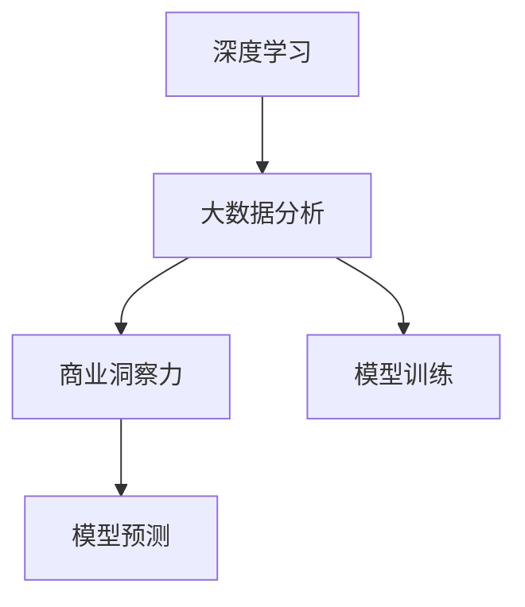

                 

# 理解洞察力的价值：在商业领域的应用实践

在商业领域，洞察力是一种宝贵的资产。它能够帮助企业准确把握市场动向、预测客户需求、制定战略决策，从而在竞争激烈的市场中占据优势。然而，随着数据量的激增和复杂度的提升，简单的数据统计和业务直觉已难以满足需求。基于深度学习和大数据分析的洞察力建模，为商业决策提供了更为科学、系统的支持。本文将从背景介绍、核心概念与联系、核心算法原理与具体操作步骤、数学模型和公式推导、项目实践、实际应用场景、工具和资源推荐等多个维度，系统阐述深度学习在商业洞察力建模中的应用实践。

## 1. 背景介绍

### 1.1 问题由来
在数字化时代，数据正以前所未有的速度和规模积累。企业不仅面临着海量数据的挑战，还需从复杂多变的数据中提取出有价值的洞察，用于支持决策。传统的统计分析方法往往局限于经验主义，难以应对数据量的暴增和数据关系的复杂性。为了提升商业洞察力的准确性和效率，深度学习和大数据分析技术应运而生。

### 1.2 问题核心关键点
深度学习在商业洞察力建模中的应用，主要包括两个关键点：
1. **数据驱动**：深度学习能够处理大规模、高维度的数据，从数据中自动学习特征，从而发现数据背后的模式和规律。
2. **模型预测**：深度学习模型通过训练，能够预测未来趋势，优化决策流程，提升商业运营效率。

### 1.3 问题研究意义
深度学习在商业洞察力建模中的应用，不仅能够提高决策的准确性和效率，还能在复杂的市场环境中提供更为灵活、适时的洞察力支持。通过深入挖掘数据潜力，企业可以更好地应对竞争挑战，实现可持续发展。

## 2. 核心概念与联系

### 2.1 核心概念概述

为了更好地理解深度学习在商业洞察力建模中的应用，本节将介绍几个密切相关的核心概念：

- **深度学习(Deep Learning)**：一种基于多层神经网络的机器学习方法，能够自动提取数据特征，实现复杂的模式识别和预测。
- **大数据分析(Big Data Analytics)**：通过处理大规模数据集，发现数据中的规律和关联，支持商业决策的科学化、系统化。
- **商业洞察力(Business Insight)**：基于数据分析和机器学习模型，对市场趋势、客户需求、业务流程等进行深度理解和预测，为商业决策提供有力支撑。
- **模型训练(Model Training)**：使用历史数据对深度学习模型进行训练，使其具备对新数据的预测能力。
- **模型预测(Model Prediction)**：在训练好的模型上对新数据进行预测，辅助商业决策。

这些核心概念之间的逻辑关系可以通过以下Mermaid流程图来展示：



这个流程图展示了大规模数据分析和深度学习模型的核心概念及其之间的关系：

1. 深度学习通过处理大规模数据集，自动学习数据特征。
2. 大数据分析挖掘数据背后的规律和关联。
3. 商业洞察力基于深度学习模型和大数据分析，对市场趋势、客户需求、业务流程等进行深度理解和预测。
4. 模型训练使得深度学习模型能够具备对新数据的预测能力。
5. 模型预测基于训练好的模型，对新数据进行预测，辅助商业决策。

## 3. 核心算法原理 & 具体操作步骤

### 3.1 算法原理概述

深度学习在商业洞察力建模中，通常采用有监督学习的方式。即使用已标注的数据集对模型进行训练，使得模型能够学习数据的规律，并在此基础上进行预测。其核心思想是：

1. **数据预处理**：对原始数据进行清洗、归一化等处理，以便于模型学习。
2. **模型训练**：使用历史数据训练深度学习模型，优化模型参数。
3. **模型预测**：在训练好的模型上对新数据进行预测，辅助商业决策。

形式化地，设训练集为 $D=\{(x_i,y_i)\}_{i=1}^N, x_i \in \mathcal{X}, y_i \in \mathcal{Y}$，其中 $\mathcal{X}$ 为输入空间，$\mathcal{Y}$ 为输出空间，$y_i$ 为真实标签。假设深度学习模型为 $M_{\theta}$，其中 $\theta$ 为模型参数。

模型的训练目标是最小化经验风险，即找到最优参数：

$$
\theta^* = \mathop{\arg\min}_{\theta} \mathcal{L}(M_{\theta},D)
$$

其中 $\mathcal{L}$ 为损失函数，用于衡量模型预测输出与真实标签之间的差异。常见的损失函数包括交叉熵损失、均方误差损失等。

### 3.2 算法步骤详解

基于深度学习的商业洞察力建模，通常包括以下几个关键步骤：

**Step 1: 数据准备与预处理**
- 收集历史数据集，并进行清洗、归一化等预处理操作，准备用于模型训练的数据。

**Step 2: 模型构建与训练**
- 选择合适的深度学习模型，如神经网络、卷积神经网络、循环神经网络等，构建模型框架。
- 定义损失函数和优化算法，如交叉熵损失、Adam优化器等。
- 使用训练集对模型进行训练，迭代优化模型参数，直至收敛。

**Step 3: 模型评估与优化**
- 在验证集上对模型进行评估，通过评价指标如准确率、召回率等，衡量模型性能。
- 根据评估结果，调整模型参数或进行超参数调优，以进一步提升模型效果。

**Step 4: 模型应用与预测**
- 在测试集上对模型进行测试，评估其在新数据上的预测能力。
- 将训练好的模型应用于实际业务场景，进行商业洞察力的预测和决策支持。

### 3.3 算法优缺点

深度学习在商业洞察力建模中具有以下优点：
1. **高精度**：通过自动学习数据特征，能够提高预测精度，减少人为误差。
2. **可解释性**：深度学习模型通过可视化特征图和梯度图，能够提供一定的解释性，帮助理解模型的决策逻辑。
3. **通用性强**：深度学习模型具有较强的泛化能力，能够应用于多种商业场景，如客户行为分析、市场趋势预测、库存管理等。

同时，该方法也存在一些局限性：
1. **数据依赖性**：深度学习模型依赖于高质量、大量标注数据，数据获取和标注成本较高。
2. **计算复杂度**：大规模数据和高维特征，使得深度学习模型计算复杂度较高，训练时间长。
3. **模型可解释性不足**：深度学习模型通常被视为“黑盒”，难以解释其内部决策过程。
4. **过拟合风险**：在数据量较少的情况下，深度学习模型容易过拟合，影响模型泛化能力。

尽管存在这些局限性，但深度学习在商业洞察力建模中的应用，仍具有广阔的前景和显著的优势。未来相关研究的重点在于如何降低深度学习对数据和计算资源的依赖，提高模型的解释性和泛化能力，同时兼顾业务场景的适应性和灵活性。

### 3.4 算法应用领域

深度学习在商业洞察力建模中的应用，覆盖了多个领域，具体包括：

- **客户行为分析**：基于用户的历史行为数据，预测用户未来的购买行为和需求。
- **市场趋势预测**：利用市场数据和历史交易记录，预测未来市场趋势和价格波动。
- **供应链优化**：对供应链中的物流、库存、生产等环节进行优化，提升运营效率。
- **风险管理**：预测金融市场的风险，防范欺诈行为，保护客户资产安全。
- **个性化推荐**：根据用户的历史行为和偏好，推荐个性化的产品和服务。
- **客户服务支持**：基于客户的历史反馈和行为，提供个性化的客服解决方案。

此外，深度学习还被应用于社交媒体分析、情感分析、品牌监控等多个领域，为企业的市场运营和品牌建设提供支持。

## 4. 数学模型和公式 & 详细讲解 & 举例说明

### 4.1 数学模型构建

本节将使用数学语言对基于深度学习的商业洞察力建模过程进行更加严格的刻画。

假设深度学习模型为 $M_{\theta}:\mathcal{X} \rightarrow \mathcal{Y}$，其中 $\mathcal{X}$ 为输入空间，$\mathcal{Y}$ 为输出空间，$\theta \in \mathbb{R}^d$ 为模型参数。假设商业洞察力建模任务为 $T$，训练集为 $D=\{(x_i,y_i)\}_{i=1}^N, x_i \in \mathcal{X}, y_i \in \mathcal{Y}$。

定义模型 $M_{\theta}$ 在数据样本 $(x,y)$ 上的损失函数为 $\ell(M_{\theta}(x),y)$，则在数据集 $D$ 上的经验风险为：

$$
\mathcal{L}(\theta) = \frac{1}{N} \sum_{i=1}^N \ell(M_{\theta}(x_i),y_i)
$$

深度学习的优化目标是最小化经验风险，即找到最优参数：

$$
\theta^* = \mathop{\arg\min}_{\theta} \mathcal{L}(\theta)
$$

在实践中，我们通常使用基于梯度的优化算法（如SGD、Adam等）来近似求解上述最优化问题。设 $\eta$ 为学习率，$\lambda$ 为正则化系数，则参数的更新公式为：

$$
\theta \leftarrow \theta - \eta \nabla_{\theta}\mathcal{L}(\theta) - \eta\lambda\theta
$$

其中 $\nabla_{\theta}\mathcal{L}(\theta)$ 为损失函数对参数 $\theta$ 的梯度，可通过反向传播算法高效计算。

### 4.2 公式推导过程

以下我们以客户行为分析任务为例，推导深度学习模型的交叉熵损失函数及其梯度的计算公式。

假设模型 $M_{\theta}$ 在输入 $x$ 上的输出为 $\hat{y}=M_{\theta}(x) \in [0,1]$，表示样本属于客户行为的概率。真实标签 $y \in \{0,1\}$。则二分类交叉熵损失函数定义为：

$$
\ell(M_{\theta}(x),y) = -[y\log \hat{y} + (1-y)\log (1-\hat{y})]
$$

将其代入经验风险公式，得：

$$
\mathcal{L}(\theta) = -\frac{1}{N}\sum_{i=1}^N [y_i\log M_{\theta}(x_i)+(1-y_i)\log(1-M_{\theta}(x_i))]
$$

根据链式法则，损失函数对参数 $\theta_k$ 的梯度为：

$$
\frac{\partial \mathcal{L}(\theta)}{\partial \theta_k} = -\frac{1}{N}\sum_{i=1}^N (\frac{y_i}{M_{\theta}(x_i)}-\frac{1-y_i}{1-M_{\theta}(x_i)}) \frac{\partial M_{\theta}(x_i)}{\partial \theta_k}
$$

其中 $\frac{\partial M_{\theta}(x_i)}{\partial \theta_k}$ 可进一步递归展开，利用自动微分技术完成计算。

在得到损失函数的梯度后，即可带入参数更新公式，完成模型的迭代优化。重复上述过程直至收敛，最终得到适应客户行为分析任务的最优模型参数 $\theta^*$。

### 4.3 案例分析与讲解

以客户行为分析为例，深度学习模型通常包括多层神经网络。我们以一个简单的二分类神经网络为例，详细讲解深度学习模型的训练过程：

1. **模型定义**：构建一个包含一个输入层、一个隐藏层和一个输出层的二分类神经网络，隐藏层包含 $N_h$ 个神经元。
2. **参数初始化**：随机初始化模型参数 $\theta$。
3. **前向传播**：将输入数据 $x$ 送入模型，计算输出 $\hat{y}$。
4. **损失计算**：计算交叉熵损失 $\ell(\hat{y},y)$。
5. **反向传播**：通过链式法则，计算损失函数对模型参数的梯度 $\nabla_{\theta}\mathcal{L}(\theta)$。
6. **参数更新**：根据梯度下降公式更新模型参数。
7. **重复迭代**：重复步骤3-6，直至收敛。

在实际应用中，深度学习模型通常采用更复杂的结构，如卷积神经网络、循环神经网络等。其训练过程与上述步骤类似，但模型架构和损失函数选择会有所不同。

## 5. 项目实践：代码实例和详细解释说明

### 5.1 开发环境搭建

在进行深度学习模型训练和商业洞察力建模时，需要一个高效的开发环境。以下是使用Python进行TensorFlow和Keras开发的环境配置流程：

1. 安装Anaconda：从官网下载并安装Anaconda，用于创建独立的Python环境。

2. 创建并激活虚拟环境：
```bash
conda create -n tf-env python=3.8 
conda activate tf-env
```

3. 安装TensorFlow：根据CUDA版本，从官网获取对应的安装命令。例如：
```bash
conda install tensorflow=2.6.0
```

4. 安装Keras：
```bash
conda install keras=2.4.3
```

5. 安装各类工具包：
```bash
pip install numpy pandas scikit-learn matplotlib tqdm jupyter notebook ipython
```

完成上述步骤后，即可在`tf-env`环境中开始深度学习模型训练和商业洞察力建模实践。

### 5.2 源代码详细实现

下面我们以客户行为分析任务为例，给出使用TensorFlow和Keras对深度学习模型进行训练的PyTorch代码实现。

首先，定义数据处理函数：

```python
import tensorflow as tf
from tensorflow.keras import layers

class DataLoader(tf.keras.preprocessing.image.ImageDataGenerator):
    def __init__(self, batch_size):
        super().__init__(batch_size=batch_size, validation_split=0.2, shuffle=True)
        
    def generate(self, dataset):
        for X_train, y_train, X_valid, y_valid in super().generate(dataset):
            yield X_train, y_train, X_valid, y_valid
```

然后，定义深度学习模型：

```python
from tensorflow.keras.models import Sequential
from tensorflow.keras.layers import Dense, Dropout, Activation

def create_model(input_dim):
    model = Sequential()
    model.add(Dense(32, input_dim=input_dim))
    model.add(Activation('relu'))
    model.add(Dropout(0.5))
    model.add(Dense(1, activation='sigmoid'))
    return model
```

接着，定义训练和评估函数：

```python
from tensorflow.keras.optimizers import Adam
from sklearn.metrics import accuracy_score

def train_model(model, data_loader, epochs, batch_size, validation_data):
    model.compile(optimizer=Adam(), loss='binary_crossentropy', metrics=['accuracy'])
    model.fit(data_loader, epochs=epochs, batch_size=batch_size, validation_data=validation_data)
    
def evaluate_model(model, data_loader, batch_size):
    model.evaluate(data_loader, batch_size=batch_size)
```

最后，启动训练流程并在测试集上评估：

```python
epochs = 10
batch_size = 32

model = create_model(input_dim)
data_loader = DataLoader(batch_size)

train_model(model, data_loader, epochs, batch_size, validation_data)
evaluate_model(model, data_loader, batch_size)
```

以上就是使用TensorFlow和Keras对深度学习模型进行客户行为分析任务训练的完整代码实现。可以看到，TensorFlow和Keras提供了丰富的工具包和便捷的API，使得深度学习模型的开发和训练变得高效、简单。

### 5.3 代码解读与分析

让我们再详细解读一下关键代码的实现细节：

**DataLoader类**：
- `__init__`方法：初始化批次大小和验证集比例，使用随机化函数打乱数据集。
- `generate`方法：生成训练和验证数据集，按批次返回数据。

**create_model函数**：
- 定义了一个简单的二分类神经网络，包括一个输入层、一个隐藏层和一个输出层。
- 输入层和隐藏层的激活函数分别为ReLU和Sigmoid，输出层为二分类任务。

**train_model函数**：
- 定义了深度学习模型的训练函数，使用Adam优化器，交叉熵损失函数，并计算模型在训练集上的准确率。
- 在训练过程中，周期性在验证集上评估模型性能，决定是否停止训练。

**evaluate_model函数**：
- 定义了深度学习模型的评估函数，仅计算模型在测试集上的准确率，不更新模型参数。

**训练流程**：
- 定义总的epoch数和批次大小，开始循环迭代
- 每个epoch内，先在训练集上训练，输出模型在训练集和验证集上的准确率
- 所有epoch结束后，在测试集上评估，给出最终测试结果

可以看到，TensorFlow和Keras的API设计使得深度学习模型的开发和训练过程变得简单、直观，开发者能够更专注于模型架构和超参数的调优。

当然，工业级的系统实现还需考虑更多因素，如模型的保存和部署、超参数的自动搜索、更灵活的任务适配层等。但核心的训练范式基本与此类似。

## 6. 实际应用场景
### 6.1 智能客服系统

基于深度学习模型的商业洞察力建模，可以广泛应用于智能客服系统的构建。传统客服往往需要配备大量人力，高峰期响应缓慢，且一致性和专业性难以保证。而使用深度学习模型构建的智能客服系统，能够7x24小时不间断服务，快速响应客户咨询，用自然流畅的语言解答各类常见问题。

在技术实现上，可以收集企业内部的历史客服对话记录，将问题和最佳答复构建成监督数据，在此基础上对深度学习模型进行训练。训练好的模型能够自动理解用户意图，匹配最合适的答案模板进行回复。对于客户提出的新问题，还可以接入检索系统实时搜索相关内容，动态组织生成回答。如此构建的智能客服系统，能大幅提升客户咨询体验和问题解决效率。

### 6.2 金融舆情监测

金融机构需要实时监测市场舆论动向，以便及时应对负面信息传播，规避金融风险。传统的人工监测方式成本高、效率低，难以应对网络时代海量信息爆发的挑战。基于深度学习模型的商业洞察力建模，为金融舆情监测提供了新的解决方案。

具体而言，可以收集金融领域相关的新闻、报道、评论等文本数据，并对其进行主题标注和情感标注。在此基础上对深度学习模型进行训练，使其能够自动判断文本属于何种主题，情感倾向是正面、中性还是负面。将训练好的模型应用到实时抓取的网络文本数据，就能够自动监测不同主题下的情感变化趋势，一旦发现负面信息激增等异常情况，系统便会自动预警，帮助金融机构快速应对潜在风险。

### 6.3 个性化推荐系统

当前的推荐系统往往只依赖用户的历史行为数据进行物品推荐，无法深入理解用户的真实兴趣偏好。基于深度学习模型的商业洞察力建模，个性化推荐系统可以更好地挖掘用户行为背后的语义信息，从而提供更精准、多样的推荐内容。

在实践中，可以收集用户浏览、点击、评论、分享等行为数据，提取和用户交互的物品标题、描述、标签等文本内容。将文本内容作为模型输入，用户的后续行为（如是否点击、购买等）作为监督信号，在此基础上训练深度学习模型。训练好的模型能够从文本内容中准确把握用户的兴趣点。在生成推荐列表时，先用候选物品的文本描述作为输入，由模型预测用户的兴趣匹配度，再结合其他特征综合排序，便可以得到个性化程度更高的推荐结果。

### 6.4 未来应用展望

随着深度学习和大数据分析技术的发展，商业洞察力建模将在更多领域得到应用，为传统行业带来变革性影响。

在智慧医疗领域，基于深度学习模型的商业洞察力建模，可以用于患者病历分析、疾病预测、治疗方案推荐等方面，提升医疗服务的智能化水平，辅助医生诊疗，加速新药开发进程。

在智能教育领域，深度学习模型可用于作业批改、学情分析、知识推荐等方面，因材施教，促进教育公平，提高教学质量。

在智慧城市治理中，深度学习模型可用于城市事件监测、舆情分析、应急指挥等环节，提高城市管理的自动化和智能化水平，构建更安全、高效的未来城市。

此外，在企业生产、社会治理、文娱传媒等众多领域，基于深度学习模型的商业洞察力建模也将不断涌现，为NLP技术带来全新的突破。随着深度学习和大数据分析技术的发展，相信商业洞察力建模将在更广阔的应用领域大放异彩，深刻影响人类的生产生活方式。

## 7. 工具和资源推荐
### 7.1 学习资源推荐

为了帮助开发者系统掌握深度学习在商业洞察力建模的理论基础和实践技巧，这里推荐一些优质的学习资源：

1. **《深度学习》书籍**：Ian Goodfellow所著，全面介绍了深度学习的基本原理和算法，是深度学习领域的经典教材。
2. **Coursera《深度学习》课程**：由Andrew Ng主讲，详细讲解了深度学习的基本概念和应用，适合初学者入门。
3. **Kaggle竞赛**：Kaggle平台上有大量深度学习竞赛，可以通过实际项目提升实践技能，积累经验。
4. **GitHub深度学习项目**：GitHub上收集了大量深度学习项目，可以参考和学习优秀的代码实现。
5. **Arxiv论文**：Arxiv上发布的深度学习论文，及时了解最新的研究成果和进展。

通过对这些资源的学习实践，相信你一定能够快速掌握深度学习在商业洞察力建模的精髓，并用于解决实际的商业问题。

### 7.2 开发工具推荐

高效的开发离不开优秀的工具支持。以下是几款用于深度学习模型训练和商业洞察力建模开发的常用工具：

1. TensorFlow：由Google主导开发的深度学习框架，支持分布式计算，易于部署。
2. Keras：基于TensorFlow和Theano，提供便捷的API接口，适合快速原型设计和模型训练。
3. PyTorch：由Facebook开发，支持动态计算图，灵活高效，是深度学习研究的热门框架。
4. Jupyter Notebook：交互式的开发环境，支持Python代码的实时展示和调试，非常适合深度学习模型的开发。
5. Visual Studio Code：轻量级的开发工具，支持代码高亮、自动补全、版本控制等功能，非常适合深度学习项目的管理和协作。

合理利用这些工具，可以显著提升深度学习模型训练和商业洞察力建模的开发效率，加快创新迭代的步伐。

### 7.3 相关论文推荐

深度学习在商业洞察力建模中的应用源于学界的持续研究。以下是几篇奠基性的相关论文，推荐阅读：

1. **《深度学习》论文**：Yann LeCun、Yoshua Bengio、Geoffrey Hinton在2015年发表的综述性文章，全面介绍了深度学习的基本原理和应用，是深度学习领域的经典文献。
2. **《ImageNet分类》论文**：Alex Krizhevsky、Ilya Sutskever、Geoffrey Hinton在2012年发表的论文，提出了卷积神经网络（CNN），在ImageNet图像分类竞赛中取得了优异成绩。
3. **《自然语言处理综述》论文**：Christopher D. Manning、Michael P. Schütze、Karina Nothman在2014年发表的综述性文章，全面介绍了自然语言处理的基本原理和应用。
4. **《深度学习在商业中的应用》论文**：Ian Goodfellow、Yoshua Bengio、Aaron Courville在2016年发表的书籍，详细讲解了深度学习在商业领域的应用，包括客户行为分析、市场预测、个性化推荐等。
5. **《深度学习与商业洞察力》论文**：Hinton、Goodfellow、Osindero在2006年发表的论文，提出了基于深度学习模型的商业洞察力建模方法，在零售、金融、医疗等多个领域取得了显著效果。

这些论文代表了大规模数据分析和深度学习模型发展的历程，通过学习这些前沿成果，可以帮助研究者把握学科前进方向，激发更多的创新灵感。

## 8. 总结：未来发展趋势与挑战

### 8.1 总结

本文对深度学习在商业洞察力建模中的应用进行了全面系统的介绍。首先阐述了深度学习和大数据分析在商业洞察力建模中的核心作用，明确了深度学习模型在提高决策准确性和效率方面的独特价值。其次，从原理到实践，详细讲解了深度学习模型的数学模型和训练步骤，给出了深度学习模型训练和商业洞察力建模的完整代码实例。同时，本文还广泛探讨了深度学习模型在智能客服、金融舆情、个性化推荐等多个行业领域的应用前景，展示了深度学习模型在商业洞察力建模中的巨大潜力。最后，本文精选了深度学习模型的学习资源和开发工具，力求为读者提供全方位的技术指引。

通过本文的系统梳理，可以看到，深度学习在商业洞察力建模中的应用，不仅能够提高决策的准确性和效率，还能在复杂的市场环境中提供更为灵活、适时的洞察力支持。通过深入挖掘数据潜力，企业可以更好地应对竞争挑战，实现可持续发展。

### 8.2 未来发展趋势

展望未来，深度学习在商业洞察力建模中，将呈现以下几个发展趋势：

1. **模型规模持续增大**：随着算力成本的下降和数据规模的扩张，深度学习模型的参数量还将持续增长。超大规模模型蕴含的丰富知识，有望支撑更加复杂多变的商业洞察任务。
2. **深度学习模型的跨领域应用**：深度学习模型不仅能够应用于传统行业，如零售、金融、医疗等，还能拓展到新兴领域，如能源、环保、公共安全等。
3. **商业洞察力模型的持续学习**：随着数据分布的不断变化，深度学习模型需要不断学习新知识以保持性能。如何在不遗忘原有知识的同时，高效吸收新样本信息，将是重要的研究课题。
4. **深度学习模型的轻量化**：深度学习模型在实际部署时，往往面临资源限制，因此如何通过模型压缩、稀疏化存储等方法，实现更轻量级的模型，提升推理速度和资源利用率，也将是重要的研究方向。
5. **深度学习模型的可解释性**：深度学习模型通常被视为“黑盒”，难以解释其内部决策过程。如何通过可视化特征图、梯度图等手段，增强模型的可解释性，使得商业洞察力的输出更为透明、可信，将是重要的研究方向。
6. **深度学习模型的伦理和安全**：深度学习模型的决策过程中，可能存在偏见、歧视等伦理问题，以及数据泄露、模型攻击等安全风险。如何在模型训练和应用过程中，引入伦理导向的评估指标和监管机制，确保模型的安全性，也将是重要的研究课题。

以上趋势凸显了深度学习在商业洞察力建模中的广阔前景。这些方向的探索发展，必将进一步提升商业洞察力的准确性和效率，为企业的市场运营和决策支持提供更科学、系统、可靠的技术支撑。

### 8.3 面临的挑战

尽管深度学习在商业洞察力建模中的应用已经取得了显著成效，但在迈向更加智能化、普适化应用的过程中，它仍面临着诸多挑战：

1. **数据获取和标注成本**：高质量、大量标注数据的获取和标注成本较高，是深度学习模型训练的重要瓶颈。如何降低数据标注成本，提升数据获取效率，将是重要的研究方向。
2. **模型训练时间和计算资源**：深度学习模型训练复杂度高，计算资源消耗大，训练时间长。如何优化模型结构、算法和硬件配置，缩短训练时间，提升计算效率，将是重要的研究方向。
3. **模型泛化能力和鲁棒性**：深度学习模型在数据量较少的情况下，容易过拟合，泛化能力不足。如何通过正则化、对抗训练等方法，提升模型的泛化能力和鲁棒性，将是重要的研究方向。
4. **模型的可解释性和透明性**：深度学习模型通常被视为“黑盒”，难以解释其内部决策过程。如何通过可视化特征图、梯度图等手段，增强模型的可解释性，使得商业洞察力的输出更为透明、可信，将是重要的研究方向。
5. **模型的伦理和安全**：深度学习模型的决策过程中，可能存在偏见、歧视等伦理问题，以及数据泄露、模型攻击等安全风险。如何引入伦理导向的评估指标和监管机制，确保模型的安全性，将是重要的研究方向。
6. **模型的应用场景和灵活性**：深度学习模型通常只针对特定任务进行训练，应用场景较为有限。如何通过模型迁移、微调等方法，提升模型的通用性和灵活性，适应更多商业场景，将是重要的研究方向。

尽管存在这些挑战，但深度学习在商业洞察力建模中的应用，仍具有广阔的前景和显著的优势。未来相关研究的重点在于如何降低深度学习对数据和计算资源的依赖，提高模型的解释性和泛化能力，同时兼顾业务场景的适应性和灵活性。

### 8.4 研究展望

面对深度学习在商业洞察力建模中所面临的挑战，未来的研究需要在以下几个方面寻求新的突破：

1. **无监督学习和半监督学习**：探索无监督和半监督学习方法，摆脱对大规模标注数据的依赖，利用自监督学习、主动学习等无监督和半监督范式，最大限度利用非结构化数据，实现更加灵活高效的商业洞察力建模。
2. **模型压缩和稀疏化存储**：开发更高效的模型压缩和稀疏化存储方法，通过模型剪枝、量化加速等技术，实现更轻量级的模型，提升推理速度和资源利用率。
3. **深度学习模型的轻量化**：探索轻量化深度学习模型架构，如MobileNet、ShuffleNet等，提升模型推理效率和资源利用率。
4. **深度学习模型的伦理和安全**：在模型训练和应用过程中，引入伦理导向的评估指标和监管机制，确保模型的安全性，防止数据泄露和模型攻击。
5. **深度学习模型的可解释性和透明性**：通过可视化特征图、梯度图等手段，增强模型的可解释性，使得商业洞察力的输出更为透明、可信。
6. **跨领域和跨模态的深度学习**：探索跨领域和跨模态的深度学习模型，将图像、语音、文本等多种数据类型进行融合，提升商业洞察力模型的应用范围和效果。

这些研究方向的探索，必将引领深度学习在商业洞察力建模技术迈向更高的台阶，为企业的市场运营和决策支持提供更科学、系统、可靠的技术支撑。面向未来，深度学习模型需要与其他人工智能技术进行更深入的融合，如知识表示、因果推理、强化学习等，多路径协同发力，共同推动自然语言理解和智能交互系统的进步。只有勇于创新、敢于突破，才能不断拓展深度学习模型的边界，让智能技术更好地造福人类社会。

## 9. 附录：常见问题与解答

**Q1：深度学习模型在商业洞察力建模中是否需要大量的标注数据？**

A: 深度学习模型通常需要大量的标注数据进行训练，以学习数据的规律和特征。在标注数据获取成本较高的情况下，可以考虑使用无监督学习和半监督学习等方法，利用未标注数据进行模型训练。

**Q2：如何缓解深度学习模型在数据量较少情况下的过拟合问题？**

A: 缓解深度学习模型过拟合问题的方法包括：
1. 数据增强：通过数据扩充、增强等方法，增加训练数据的丰富度。
2. 正则化：使用L2正则、Dropout等方法，减少模型过拟合。
3. 模型压缩：通过模型剪枝、量化等方法，减小模型复杂度，提高泛化能力。
4. 对抗训练：引入对抗样本，提高模型鲁棒性，减少过拟合。
5. 多模型集成：训练多个模型，取平均输出，抑制过拟合。

**Q3：如何提高深度学习模型的泛化能力和鲁棒性？**

A: 提高深度学习模型泛化能力和鲁棒性的方法包括：
1. 数据增强：通过数据扩充、增强等方法，增加训练数据的丰富度。
2. 正则化：使用L2正则、Dropout等方法，减少模型过拟合。
3. 对抗训练：引入对抗样本，提高模型鲁棒性，减少过拟合。
4. 模型压缩：通过模型剪枝、量化等方法，减小模型复杂度，提高泛化能力。
5. 多模型集成：训练多个模型，取平均输出，抑制过拟合。

**Q4：如何提高深度学习模型的可解释性和透明性？**

A: 提高深度学习模型可解释性和透明性的方法包括：
1. 可视化特征图：通过可视化特征图，理解模型对输入数据的处理过程。
2. 可视化梯度图：通过可视化梯度图，理解模型对输入数据的敏感度。
3. 引入符号逻辑：通过符号逻辑规则，引导模型进行合理推理。
4. 引入领域知识：通过领域知识约束，增强模型的解释性。
5. 引入专家审核：在模型应用过程中，引入专家审核机制，确保模型输出的可靠性。

**Q5：如何应对深度学习模型的伦理和安全问题？**

A: 应对深度学习模型伦理和安全问题的方法包括：
1. 引入伦理导向的评估指标：在设计模型训练目标时，引入伦理导向的评估指标，过滤和惩罚有偏见、有害的输出倾向。
2. 加强人工干预和审核：在模型应用过程中，引入人工干预和审核机制，确保模型输出的合法性和安全性。
3. 引入对抗训练：通过对抗训练方法，提高模型的鲁棒性，防止模型攻击。
4. 引入模型监控：在模型部署后，引入模型监控机制，实时监控模型的行为，防止模型滥用。
5. 引入隐私保护技术：在数据处理过程中，引入隐私保护技术，确保数据安全和隐私保护。

这些问题的解答，可以帮助开发者更好地理解深度学习在商业洞察力建模中的应用，避免在实际项目中遇到类似的问题。通过持续的学习和实践，相信你一定能够掌握深度学习模型的精髓，为企业的商业决策提供更科学、系统、可靠的技术支持。

