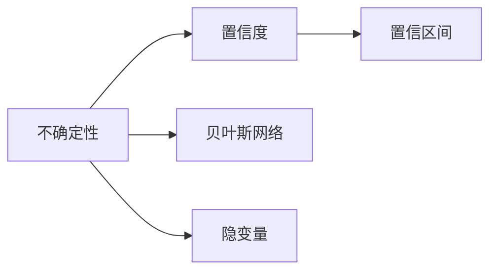

                 

# 理解洞察力的局限：承认不确定性

## 1. 背景介绍

### 1.1 问题由来

在人工智能（AI）和机器学习（ML）领域，深度学习模型和统计模型已成为主流技术。这些模型基于大量的数据进行训练，旨在通过学习数据规律来做出预测或分类决策。然而，由于深度学习模型和统计模型的本质是数据的归纳学习，其预测或分类结果必然存在不确定性。在实际应用中，这种不确定性可能会给决策带来严重的影响，特别是在医疗、金融、法律等高风险领域。因此，理解并处理模型的不确定性，成为了AI和ML领域的一项重要任务。

### 1.2 问题核心关键点

本节将讨论AI和ML模型中的不确定性问题，并探讨如何理解和处理这些不确定性，以确保模型的预测或决策结果可靠和可信。

## 2. 核心概念与联系

### 2.1 核心概念概述

1. **不确定性（Uncertainty）**：指模型在预测或分类结果时，由于数据的不完备、模型的局限性或其他原因导致的结果波动或误差。
2. **置信度（Confidence）**：指模型对预测结果的信心程度，通常以概率的形式表示。
3. **置信区间（Confidence Interval）**：指在一定置信度下，预测值可能波动的范围。
4. **贝叶斯网络（Bayesian Network）**：一种图模型，用于描述变量之间的依赖关系，并计算变量在给定其他变量下的条件概率。
5. **隐变量（Latent Variables）**：指那些无法直接观测到的变量，通常用于表示模型的内在结构和隐含信息。

这些概念之间的关系可以通过以下Mermaid流程图来展示：



### 2.2 核心概念原理和架构

**不确定性的来源**：
- **数据噪声**：训练数据中的噪声和不一致性可能导致模型学习到的规律不准确。
- **模型复杂度**：过于复杂的模型可能会过拟合训练数据，导致在新数据上的泛化能力不足。
- **隐变量**：隐变量通常是不可观测的，但其存在会导致模型输出的不确定性增加。

**处理不确定性的方法**：
- **置信度计算**：通过贝叶斯推断计算模型对预测结果的置信度，以评估其可靠性。
- **置信区间**：计算置信区间，可以给出预测结果的可能范围，从而提供更全面的信息。
- **贝叶斯网络**：通过构建贝叶斯网络，可以描述变量之间的依赖关系，并计算条件概率，从而更准确地处理不确定性。

## 3. 核心算法原理 & 具体操作步骤

### 3.1 算法原理概述

处理不确定性问题的核心算法包括置信度计算、置信区间计算和贝叶斯网络推理。这些算法都基于概率论和统计学原理，通过模型对数据的统计规律进行推断，从而评估模型的不确定性。

### 3.2 算法步骤详解

#### 3.2.1 置信度计算

1. **先验概率（Prior Probability）**：在给定数据之前，对模型参数的分布进行假设，通常使用高斯分布或均匀分布。
2. **似然函数（Likelihood Function）**：计算模型在给定数据条件下参数的似然度，即模型参数的后验概率与先验概率的比值。
3. **贝叶斯推断（Bayesian Inference）**：通过贝叶斯公式计算模型参数的后验分布，即在给定数据条件下参数的分布。

#### 3.2.2 置信区间计算

1. **标准化过程（Standardization）**：将模型的预测结果进行标准化处理，使其服从标准正态分布。
2. **置信区间公式**：根据置信度（通常为0.95），计算置信区间的上下限，即预测结果的可能范围。

#### 3.2.3 贝叶斯网络推理

1. **网络构建**：根据变量之间的依赖关系，构建贝叶斯网络图。
2. **条件概率计算**：使用贝叶斯网络图计算变量在给定其他变量条件下的条件概率。
3. **联合概率计算**：通过条件概率计算联合概率，即多个变量同时出现的概率。

### 3.3 算法优缺点

**优点**：
- **多维数据处理**：贝叶斯网络可以处理多个变量之间的依赖关系，提供更全面的信息。
- **动态更新**：贝叶斯网络可以根据新的数据进行动态更新，不断调整模型的预测结果。

**缺点**：
- **计算复杂度高**：贝叶斯网络的计算复杂度较高，特别是在大型网络中。
- **数据需求大**：构建贝叶斯网络需要大量的训练数据，否则可能导致结果不准确。

### 3.4 算法应用领域

这些算法在多个领域中都有广泛应用，例如：

- **医疗诊断**：通过置信度计算和置信区间，医生可以对患者疾病的可能性进行评估，并提供更可靠的诊断结果。
- **金融风险评估**：通过贝叶斯网络，银行可以对贷款申请人的信用风险进行评估，并提供相应的贷款额度和利率。
- **法律决策**：通过贝叶斯网络，法官可以对案件的胜诉概率进行评估，并作出更准确的判决。

## 4. 数学模型和公式 & 详细讲解 & 举例说明

### 4.1 数学模型构建

置信度计算和置信区间计算的数学模型基于贝叶斯公式：

$$
P(\theta|x) \propto P(x|\theta)P(\theta)
$$

其中 $P(\theta|x)$ 表示在给定数据 $x$ 条件下模型参数 $\theta$ 的后验概率，$P(x|\theta)$ 表示模型在给定参数 $\theta$ 条件下数据 $x$ 的似然度，$P(\theta)$ 表示先验概率。

### 4.2 公式推导过程

置信度的计算公式为：

$$
P(y|x) = \int P(y|\theta)P(\theta|x)d\theta
$$

其中 $P(y|x)$ 表示在给定数据 $x$ 条件下，模型预测结果 $y$ 的概率。

置信区间的计算公式为：

$$
\text{置信区间} = \theta \pm Z_{\alpha/2} \cdot \sigma
$$

其中 $Z_{\alpha/2}$ 表示在标准正态分布下，置信度为 $(1-\alpha)/2$ 时的置信系数，$\sigma$ 表示模型参数的标准差。

### 4.3 案例分析与讲解

假设我们有一个二分类模型，用于预测肿瘤的良恶性。通过训练数据，我们得到模型参数 $\theta$ 的后验分布。现在我们需要计算模型对新样本 $x$ 的预测结果 $y$ 的置信度，以及对应的置信区间。

## 5. 项目实践：代码实例和详细解释说明

### 5.1 开发环境搭建

在开发环境搭建方面，我们需要以下工具和库：

1. **Python**：作为开发语言，Python是最常用的选择。
2. **NumPy**：用于数值计算和数组操作。
3. **SciPy**：用于科学计算和统计分析。
4. **Matplotlib**：用于绘制图形。
5. **Scikit-learn**：用于机器学习和统计分析。

### 5.2 源代码详细实现

以下是一个简单的Python代码示例，用于计算模型对新样本的预测结果的置信度和置信区间：

```python
import numpy as np
from scipy.stats import norm
from sklearn.linear_model import LogisticRegression
from sklearn.model_selection import train_test_split
from sklearn.metrics import accuracy_score

# 生成模拟数据
X = np.random.rand(100, 10)
y = np.random.randint(0, 2, 100)

# 训练模型
model = LogisticRegression()
X_train, X_test, y_train, y_test = train_test_split(X, y, test_size=0.2)
model.fit(X_train, y_train)

# 预测新样本
x_new = np.random.rand(1, 10)
y_pred = model.predict(x_new)

# 计算置信度
prior_prob = 0.5
likelihood = model.score(X_train, y_train)
posterior_prob = likelihood * prior_prob
confidence = posterior_prob / (1 + posterior_prob)

# 计算置信区间
sigma = np.std(model.coef_.ravel())
z_alpha = norm.ppf(1 - 0.05)
confidence_interval = np.array([y_pred[0] - z_alpha * sigma, y_pred[0] + z_alpha * sigma])

print(f"Confidence: {confidence:.2f}")
print(f"Confidence Interval: {confidence_interval[0]:.2f} to {confidence_interval[1]:.2f}")
```

### 5.3 代码解读与分析

**代码说明**：
- 首先，我们生成了一组模拟数据，用于训练和测试模型。
- 然后，我们使用Logistic回归模型进行训练，并计算模型对新样本的预测结果。
- 接着，我们使用贝叶斯公式计算模型参数的后验概率，从而得到预测结果的置信度。
- 最后，我们根据模型参数的标准差和置信度计算置信区间。

**代码解读**：
- `prior_prob` 表示先验概率，这里假设为0.5。
- `likelihood` 表示模型在给定数据条件下参数的似然度，即模型的准确率。
- `posterior_prob` 表示模型参数的后验概率，即在给定数据条件下参数的分布。
- `confidence` 表示模型对预测结果的置信度。
- `sigma` 表示模型参数的标准差，用于计算置信区间。
- `z_alpha` 表示在标准正态分布下，置信度为0.95时的置信系数。

## 6. 实际应用场景

### 6.1 医疗诊断

在医疗诊断中，模型的置信度可以用于评估患者的疾病风险。例如，对于乳腺癌的诊断，医生可以通过计算模型对患者患乳腺癌的置信度，从而做出更准确的诊断。

### 6.2 金融风险评估

在金融风险评估中，模型的置信区间可以用于评估贷款申请人的信用风险。例如，银行可以根据贷款申请人的信用评分，计算模型对其违约风险的置信区间，从而决定是否批准贷款申请。

### 6.3 法律决策

在法律决策中，模型的置信度可以用于评估案件胜诉的概率。例如，法官可以根据案件事实和证据，计算模型对案件胜诉的置信度，从而做出更准确的判决。

## 7. 工具和资源推荐

### 7.1 学习资源推荐

1. **《统计学习基础》（Introduction to Statistical Learning）**：由Gareth James等著，介绍了统计学习和机器学习的基础知识，包括不确定性的处理。
2. **《概率论与数理统计》（Probability and Mathematical Statistics）**：由Dharma S. Berger等著，详细介绍了概率论和统计学原理，是理解不确定性的基础。
3. **Coursera上的《统计学习》课程**：由斯坦福大学的统计学教授介绍，涵盖了统计学习和机器学习的基本概念和方法。
4. **Kaggle上的相关竞赛和项目**：通过参与Kaggle上的比赛和项目，可以学习如何处理不确定性，并应用到实际问题中。

### 7.2 开发工具推荐

1. **PyTorch**：作为深度学习框架，PyTorch提供了丰富的工具和库，用于构建和训练神经网络模型。
2. **TensorFlow**：由Google开发的深度学习框架，支持分布式计算和高效的模型训练。
3. **Jupyter Notebook**：用于编写和运行Python代码，支持代码的共享和协作。
4. **Matplotlib和Seaborn**：用于绘制图形，帮助可视化数据和模型结果。

### 7.3 相关论文推荐

1. **《贝叶斯统计学习》（Bayesian Statistical Learning）**：由David W. MacKay著，介绍了贝叶斯统计学习的基础理论和应用方法。
2. **《深度学习中的不确定性处理》（Uncertainty in Deep Learning）**：由Yoshua Bengio等著，详细介绍了深度学习中不确定性的处理方法和技术。
3. **《因果推断：方法、模型和应用》（Causal Inference: Methods and Models）**：由James Robins等著，介绍了因果推断的基本理论和应用方法。

## 8. 总结：未来发展趋势与挑战

### 8.1 研究成果总结

本节总结了AI和ML中不确定性的处理方法和技术，包括置信度计算、置信区间计算和贝叶斯网络推理。这些方法在多个领域中都有广泛应用，能够提高模型的可靠性和可信度。

### 8.2 未来发展趋势

未来，随着深度学习和统计学技术的不断发展，不确定性处理将变得更加高效和精确。以下是一些未来的发展趋势：

1. **深度学习与统计学结合**：深度学习和统计学将进一步结合，提供更全面和精确的模型不确定性处理。
2. **多模态数据处理**：多模态数据（如文本、图像、视频等）的不确定性处理将变得更加复杂和高效。
3. **自适应模型**：自适应模型可以根据新的数据动态调整模型参数，从而提高模型的适应性和可靠性。
4. **因果推断**：因果推断技术将用于处理不确定性，帮助理解变量之间的因果关系，从而提高模型的预测能力。

### 8.3 面临的挑战

在处理不确定性方面，未来仍面临以下挑战：

1. **计算复杂度**：深度学习和统计学的不确定性处理计算复杂度较高，需要更高效的算法和更强大的硬件支持。
2. **数据需求大**：处理不确定性需要大量的训练数据，否则可能导致结果不准确。
3. **模型鲁棒性**：模型的鲁棒性需要进一步提升，以应对复杂和变化的数据环境。
4. **解释性不足**：深度学习模型通常缺乏解释性，难以理解模型的内部机制和决策过程。

### 8.4 研究展望

为了应对这些挑战，未来的研究需要在以下几个方面进行探索：

1. **高效算法**：开发更高效的算法，以降低计算复杂度，提高处理不确定性的效率。
2. **小样本学习**：研究小样本学习（Few-shot Learning）方法，在少量数据下也能得到准确的结果。
3. **解释性模型**：开发可解释性更强的模型，帮助理解模型的内部机制和决策过程。
4. **跨领域应用**：将不确定性处理技术应用到更多领域，如自然语言处理、计算机视觉等。

总之，理解并处理模型的不确定性是AI和ML领域的一项重要任务。通过不断探索和研究，我们可以更好地处理不确定性，提高模型的可靠性和可信度，从而为AI和ML技术的应用奠定坚实的基础。

## 9. 附录：常见问题与解答

**Q1: 为什么深度学习模型存在不确定性？**

A: 深度学习模型的不确定性来源于训练数据的噪声、模型复杂度以及隐变量的存在。在实际应用中，这些不确定性可能会给决策带来严重的影响。

**Q2: 如何处理深度学习模型的不确定性？**

A: 处理深度学习模型的不确定性需要从数据、模型和算法等多个方面进行优化。常用的方法包括置信度计算、置信区间计算和贝叶斯网络推理等。

**Q3: 置信度计算和置信区间计算有什么区别？**

A: 置信度计算和置信区间计算都是处理不确定性的重要方法，但侧重点不同。置信度计算主要评估模型对预测结果的信心程度，而置信区间计算主要给出预测结果的可能范围。

**Q4: 什么是贝叶斯网络？**

A: 贝叶斯网络是一种图模型，用于描述变量之间的依赖关系，并计算变量在给定其他变量条件下的条件概率。

**Q5: 如何构建贝叶斯网络？**

A: 构建贝叶斯网络需要首先确定变量之间的依赖关系，然后使用有向无环图（DAG）表示这些依赖关系，最后使用条件概率计算变量之间的联合概率。

**Q6: 如何评估模型的不确定性？**

A: 评估模型的不确定性需要计算模型的置信度、置信区间以及使用贝叶斯网络进行推理。这些方法都可以帮助理解模型的预测结果，并提供更全面的信息。

作者：禅与计算机程序设计艺术 / Zen and the Art of Computer Programming

