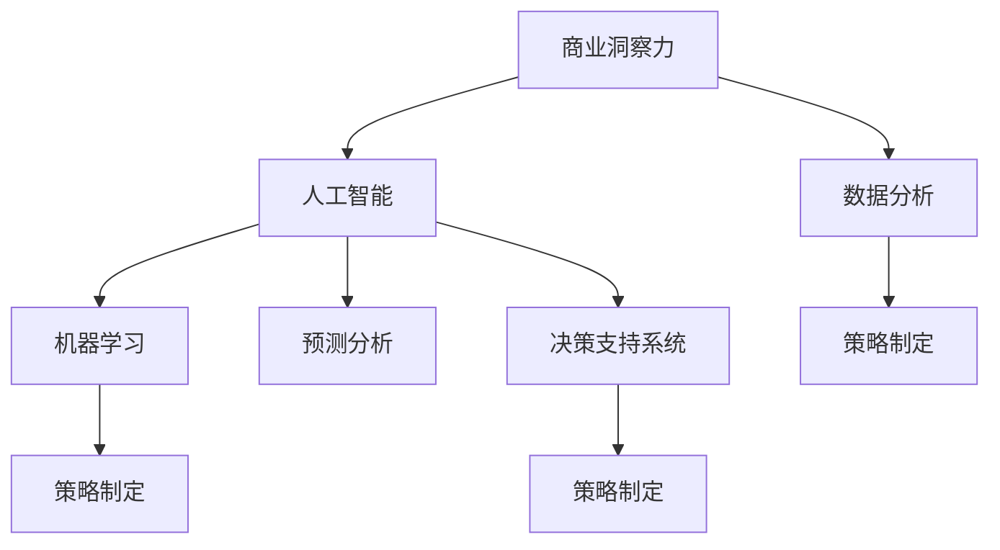

                 

# 理解洞察力的应用：在商业策略中的实践

> 关键词：商业洞察力,策略制定,数据分析,人工智能,机器学习,预测分析,决策支持

## 1. 背景介绍

### 1.1 问题由来
在商业决策过程中，洞察力至关重要。传统上，洞察力获取依赖于经验、直觉和手动分析。然而，随着数据量呈指数级增长，手动分析的方法已经难以满足需求。人工智能（AI）和大数据分析技术的出现，为洞察力的获取提供了新的解决方案。

### 1.2 问题核心关键点
本文聚焦于如何利用人工智能和大数据分析技术，提升商业决策中的洞察力。通过深入理解商业问题，分析大量数据，并运用机器学习等算法，可以有效提升决策质量，优化商业策略。

### 1.3 问题研究意义
研究商业洞察力的应用，对提升企业决策效率、优化策略制定、降低风险、提高市场竞争力具有重要意义：

1. 提升决策效率：通过数据驱动的洞察力分析，可以快速找到最优解决方案，缩短决策周期。
2. 优化策略制定：洞察力分析能够揭示市场趋势和消费者行为，帮助企业制定更加精准的战略。
3. 降低风险：数据分析可以识别潜在风险和机会，提前做好准备。
4. 提高市场竞争力：洞察力帮助企业抓住先机，保持领先地位。
5. 赋能智能决策：AI和数据分析技术将复杂的决策过程简化为可操作的洞察力，使得决策更加科学合理。

## 2. 核心概念与联系

### 2.1 核心概念概述

为更好地理解商业洞察力的应用，本节将介绍几个密切相关的核心概念：

- 商业洞察力(Commercial Insight)：基于数据分析得出的，对商业环境和策略制定的深刻理解和洞见。
- 数据分析(Analytics)：通过统计学和机器学习等方法，从大量数据中提取有价值的信息和模式。
- 人工智能(AI)：模拟人类智能过程的计算机系统，包括机器学习、深度学习、自然语言处理等技术。
- 策略制定(Strategy Development)：基于数据分析和洞察力，制定公司战略和行动计划的过程。
- 机器学习(Machine Learning)：让机器通过数据训练，自动学习和改进算法，实现高效决策。
- 预测分析(Predictive Analytics)：使用统计和机器学习模型，预测未来趋势和结果。
- 决策支持系统(Decision Support Systems, DSS)：辅助决策者进行决策分析的系统，提供数据支持和决策建议。

这些核心概念之间的逻辑关系可以通过以下Mermaid流程图来展示：



这个流程图展示了一系列核心概念及其之间的关系：

1. 商业洞察力通过数据分析和人工智能获取。
2. 机器学习和预测分析是人工智能的重要组成部分。
3. 决策支持系统整合了数据分析、人工智能和策略制定的功能。
4. 数据分析、人工智能和决策支持系统共同支持策略制定。

这些概念共同构成了商业洞察力的应用框架，使其能够高效地辅助企业进行策略制定和决策。

## 3. 核心算法原理 & 具体操作步骤
### 3.1 算法原理概述

商业洞察力的应用通常依赖于数据驱动的分析和预测。通过机器学习算法，可以从大量数据中提取出有用的模式和趋势，为商业决策提供依据。

具体而言，商业洞察力的获取包括以下几个步骤：

1. **数据收集**：收集与商业活动相关的各类数据，包括客户交易数据、市场趋势、竞争信息等。
2. **数据预处理**：清洗数据，处理缺失值，进行特征工程，以确保数据的可用性和准确性。
3. **数据分析**：运用统计学和机器学习技术，对数据进行探索性分析和建模。
4. **洞察力生成**：从分析结果中提取有意义的洞见，形成商业洞察力报告。
5. **策略制定**：基于商业洞察力报告，制定相应的商业策略。

### 3.2 算法步骤详解

以下是详细的商业洞察力获取和应用的算法步骤：

**Step 1: 数据收集**
- 确定所需的数据类型，包括结构化数据（如销售记录、财务报表）和非结构化数据（如社交媒体评论、客户反馈）。
- 使用API、爬虫、数据库查询等方式获取数据。
- 存储和管理数据，确保数据安全和隐私。

**Step 2: 数据预处理**
- 清洗数据，去除噪声和异常值。
- 处理缺失值，填补或删除缺失数据。
- 进行特征工程，提取和构造有用的特征。
- 使用数据可视化工具进行探索性分析，了解数据分布和关系。

**Step 3: 数据分析**
- 选择合适的分析方法，包括描述性统计、聚类分析、关联规则挖掘等。
- 运用机器学习模型，如线性回归、决策树、随机森林、神经网络等，进行预测和分类。
- 对分析结果进行验证和评估，确保模型性能和鲁棒性。

**Step 4: 洞察力生成**
- 从模型输出中提取关键指标和洞见，如趋势、关联、异常等。
- 制作商业洞察力报告，包括可视化图表、统计摘要和建议。
- 与业务专家讨论，确保洞察力的实用性和可操作性。

**Step 5: 策略制定**
- 基于商业洞察力报告，制定具体的商业策略。
- 明确目标、关键指标和行动计划。
- 跟踪和评估策略实施效果，进行迭代优化。

### 3.3 算法优缺点

商业洞察力的应用具有以下优点：

1. 数据驱动：通过大数据和AI技术，全面、准确地分析商业环境。
2. 快速响应：快速获取洞察力，及时调整策略。
3. 全面覆盖：涵盖各个业务领域，确保策略的全面性。
4. 精准决策：基于数据和算法，提升决策质量。
5. 自动化：减少手动分析和决策，提高效率。

同时，该方法也存在以下局限性：

1. 数据质量要求高：数据分析结果依赖于数据的质量和完整性。
2. 技术门槛高：需要专业的数据分析和AI技能。
3. 模型复杂度高：构建高精度模型需要大量计算资源。
4. 结果解释性不足：AI模型结果难以完全解释，影响决策信心。
5. 隐私风险：商业洞察力涉及大量敏感信息，需注意隐私保护。

尽管存在这些局限性，但商业洞察力的应用是大数据和AI技术的重要应用场景，能够显著提升企业的决策效率和市场竞争力。

### 3.4 算法应用领域

商业洞察力的应用广泛涉及多个领域，如：

- **市场营销**：通过分析客户数据和市场趋势，制定精准营销策略。
- **客户管理**：基于客户行为和反馈，优化客户关系管理。
- **供应链优化**：分析供应链数据，提升运营效率和成本控制。
- **风险管理**：识别潜在风险和机会，制定风险应对策略。
- **产品开发**：分析市场和客户需求，指导产品开发和创新。
- **财务分析**：通过财务数据，优化投资和财务决策。
- **人力资源**：分析员工数据，优化人力资源管理和招聘策略。

这些领域都是商业洞察力应用的典型场景，展示了其广泛的应用价值。

## 4. 数学模型和公式 & 详细讲解  
### 4.1 数学模型构建

商业洞察力的应用通常基于统计学和机器学习模型。以下是一个简单的示例：

假设有一家电子商务公司，需要基于历史销售数据预测未来销售趋势。可以使用线性回归模型进行预测分析，构建数学模型：

$$
y = \beta_0 + \beta_1x_1 + \beta_2x_2 + ... + \beta_nx_n + \epsilon
$$

其中，$y$ 表示未来销售额，$x_i$ 表示影响销售的不同因素（如季节、促销活动、竞争对手等），$\beta_i$ 表示各因素的系数，$\epsilon$ 表示随机误差。

### 4.2 公式推导过程

线性回归模型的推导过程如下：

设有一组训练数据集 $\{(x_1, y_1), (x_2, y_2), ..., (x_m, y_m)\}$，目标是最小化预测误差 $\epsilon$。根据最小二乘法，可以将目标函数定义为：

$$
\min_{\beta} \sum_{i=1}^m (y_i - (\beta_0 + \beta_1x_{i1} + ... + \beta_nx_{in}))^2
$$

通过求导和简化，可以得到系数 $\beta$ 的求解公式：

$$
\beta = (X^TX)^{-1}X^Ty
$$

其中，$X$ 为自变量矩阵，$y$ 为因变量向量。

### 4.3 案例分析与讲解

假设某电商平台历史销售数据如下：

| 月份 | 销售额 | 季节性因素 | 促销活动 | 竞争对手价格 |
|------|--------|------------|----------|---------------|
| 1    | 100    | 0.5        | 1        | 0.2           |
| 2    | 110    | 0.8        | 0        | 0.1           |
| ...  | ...    | ...        | ...      | ...           |

可以使用上述线性回归模型进行预测。首先，将数据标准化：

$$
x_1' = \frac{x_1 - \mu_1}{\sigma_1}, x_2' = \frac{x_2 - \mu_2}{\sigma_2}, ..., x_n' = \frac{x_n - \mu_n}{\sigma_n}
$$

然后，构建自变量矩阵 $X$ 和因变量向量 $y$，求解 $\beta$。最后将预测结果标准化回原始数据：

$$
y' = \beta_0 + \beta_1x_1' + ... + \beta_nx_n'
$$

## 5. 项目实践：代码实例和详细解释说明
### 5.1 开发环境搭建

在进行商业洞察力的应用开发前，我们需要准备好开发环境。以下是使用Python进行项目开发的环境配置流程：

1. 安装Anaconda：从官网下载并安装Anaconda，用于创建独立的Python环境。

2. 创建并激活虚拟环境：
```bash
conda create -n insight-env python=3.8 
conda activate insight-env
```

3. 安装必要的Python包：
```bash
pip install pandas numpy scikit-learn seaborn matplotlib statsmodels
```

4. 安装Python数据分析包：
```bash
pip install matplotlib statsmodels pandas scikit-learn
```

5. 安装Python机器学习包：
```bash
pip install scikit-learn
```

完成上述步骤后，即可在`insight-env`环境中开始项目实践。

### 5.2 源代码详细实现

下面我们以销售数据分析为例，给出使用Python进行商业洞察力获取的完整代码实现。

首先，定义数据预处理和分析函数：

```python
import pandas as pd
import numpy as np
from sklearn.linear_model import LinearRegression
from sklearn.metrics import mean_squared_error
from sklearn.model_selection import train_test_split
from sklearn.preprocessing import StandardScaler

# 数据预处理
def preprocess_data(data, target):
    X = data.drop(columns=[target])
    y = data[target]
    X_train, X_test, y_train, y_test = train_test_split(X, y, test_size=0.2, random_state=42)
    scaler = StandardScaler()
    X_train = scaler.fit_transform(X_train)
    X_test = scaler.transform(X_test)
    return X_train, X_test, y_train, y_test

# 线性回归模型
def linear_regression(X, y):
    model = LinearRegression()
    model.fit(X, y)
    y_pred = model.predict(X)
    return model, y_pred

# 模型评估
def evaluate_model(model, y_test, y_pred):
    mse = mean_squared_error(y_test, y_pred)
    print(f"Mean Squared Error: {mse}")
```

然后，定义数据加载和洞察力生成函数：

```python
# 加载数据
data = pd.read_csv('sales_data.csv')

# 预处理数据
X_train, X_test, y_train, y_test = preprocess_data(data, 'sales')

# 训练模型
model, y_pred = linear_regression(X_train, y_train)

# 评估模型
evaluate_model(model, y_test, y_pred)

# 生成洞察力报告
report = pd.DataFrame({'Month': data['Month'],
                      'Sales': data['Sales'],
                      'Predicted Sales': y_pred})
report.to_csv('insight_report.csv', index=False)
```

最后，启动数据预处理和模型训练流程：

```python
# 数据预处理
X_train, X_test, y_train, y_test = preprocess_data(data, 'sales')

# 训练模型
model, y_pred = linear_regression(X_train, y_train)

# 评估模型
evaluate_model(model, y_test, y_pred)

# 生成洞察力报告
report = pd.DataFrame({'Month': data['Month'],
                      'Sales': data['Sales'],
                      'Predicted Sales': y_pred})
report.to_csv('insight_report.csv', index=False)
```

以上就是使用Python进行商业洞察力获取的完整代码实现。可以看到，代码实现了数据预处理、模型训练和洞察力报告生成的全流程，展示了商业洞察力获取的基本步骤。

### 5.3 代码解读与分析

让我们再详细解读一下关键代码的实现细节：

**preprocess_data函数**：
- 将数据拆分为训练集和测试集，进行特征工程，包括标准化、训练/测试集的划分等。
- 使用sklearn库中的LinearRegression模型，进行线性回归模型训练。
- 评估模型性能，计算均方误差。

**linear_regression函数**：
- 将预处理后的数据用于训练模型，并预测未来销售额。
- 评估模型性能，输出均方误差。

**evaluate_model函数**：
- 根据测试集的真实标签和预测标签，计算均方误差，输出模型性能。

**代码实现分析**：
- 数据预处理步骤包括数据加载、数据拆分、标准化、训练/测试集划分等。
- 模型训练步骤包括使用LinearRegression模型进行回归分析，并输出预测结果。
- 模型评估步骤包括计算均方误差，输出模型性能指标。
- 洞察力报告生成步骤包括将数据和预测结果整理成DataFrame格式，并保存为CSV文件。

## 6. 实际应用场景
### 6.1 智能客服系统

商业洞察力的应用在智能客服系统中有广泛应用。传统的客服系统依赖人工处理客户查询，效率低下且难以标准化。通过商业洞察力，可以分析客户查询的常见问题和趋势，优化客服策略，提升客户满意度。

具体而言，可以收集客服历史数据，分析客户最常询问的问题、常见问题解答和回答质量等指标，生成洞察力报告。基于报告中的洞察，调整客服策略，如增加常见问题的自动回复，优化回答质量评估标准等，提升客服系统的自动化和智能化水平。

### 6.2 市场营销

在市场营销中，商业洞察力可以通过分析客户数据和市场趋势，制定精准的营销策略。例如，可以分析客户购买行为、历史偏好和行为数据，预测客户未来的购买意愿，定制个性化的营销方案。

具体流程如下：
1. 收集客户购买数据、行为数据和反馈数据。
2. 进行数据清洗和预处理，提取有用的特征。
3. 使用机器学习模型，如聚类分析、分类模型等，分析客户行为和偏好。
4. 生成洞察力报告，包括客户细分、购买趋势等。
5. 基于洞察力报告，制定精准的营销策略，如个性化推荐、定制化广告等。

### 6.3 供应链优化

供应链优化是商业洞察力应用的重要领域。通过分析供应链数据，可以优化供应链流程，降低成本，提高效率。例如，可以分析供应商数据、库存数据和订单数据，预测需求变化，优化库存和配送策略。

具体流程如下：
1. 收集供应链数据，包括供应商数据、库存数据和订单数据。
2. 进行数据清洗和预处理，提取有用的特征。
3. 使用机器学习模型，如时间序列分析、回归模型等，分析供应链趋势和变化。
4. 生成洞察力报告，包括供应链效率、库存水平等。
5. 基于洞察力报告，优化供应链策略，如调整库存水平、优化配送路径等。

### 6.4 未来应用展望

随着商业洞察力技术的不断进步，其在更多领域的应用前景将更加广阔。未来，商业洞察力将与更多前沿技术结合，如区块链、物联网、人工智能等，形成更加全面、精准的洞察力应用。

例如，结合区块链技术，可以实时追踪供应链数据，确保数据透明和不可篡改，提高供应链的信任度和效率。结合物联网技术，可以实时监测库存和配送状态，优化供应链管理。结合人工智能技术，可以预测市场需求和趋势，制定更加精准的营销策略。

## 7. 工具和资源推荐
### 7.1 学习资源推荐

为了帮助开发者系统掌握商业洞察力的应用，这里推荐一些优质的学习资源：

1. 《数据分析与商业洞察力》系列博文：由数据科学专家撰写，深入浅出地介绍了数据分析和商业洞察力的基本概念和方法。

2. 《商业洞察力与决策支持系统》课程：哈佛大学商学院开设的商业洞察力与决策支持系统课程，涵盖数据分析、商业洞察力和决策支持系统的基本概念和实践。

3. 《机器学习实战》书籍：斯坦福大学教授编写，全面介绍了机器学习的基本概念和实践，包括商业洞察力的应用。

4. Kaggle平台：数据科学和机器学习竞赛平台，提供大量数据集和实战案例，有助于实践商业洞察力的应用。

5. Coursera平台：提供商业洞察力和数据分析相关的在线课程，涵盖统计学、机器学习、数据可视化等技术。

通过对这些资源的学习实践，相信你一定能够快速掌握商业洞察力的应用，并用于解决实际的商业问题。

### 7.2 开发工具推荐

高效的开发离不开优秀的工具支持。以下是几款用于商业洞察力应用开发的常用工具：

1. Python：基于Python的开源数据科学平台，提供丰富的数据处理和机器学习库，如Pandas、NumPy、Scikit-Learn等。

2. R语言：基于R的开源数据科学平台，提供丰富的统计分析和可视化工具，如ggplot2、dplyr等。

3. Tableau：数据可视化工具，支持多维度数据分析和交互式可视化，帮助生成商业洞察力报告。

4. Power BI：微软推出的商业智能工具，支持数据导入、可视化和分析，适合商业决策支持。

5. Jupyter Notebook：开源的交互式编程环境，支持Python、R等多种语言，适合数据科学和机器学习实践。

合理利用这些工具，可以显著提升商业洞察力应用的开发效率，加快创新迭代的步伐。

### 7.3 相关论文推荐

商业洞察力的应用源于学界的持续研究。以下是几篇奠基性的相关论文，推荐阅读：

1. "Data Mining: Concepts and Techniques" 书籍：Witten等人著，介绍了数据挖掘的基本概念和算法，包括商业洞察力的应用。

2. "Predictive Analytics for Business" 书籍：Smith等人著，全面介绍了预测分析在商业中的应用，包括数据预处理、模型构建和结果解释等。

3. "Applied Predictive Modeling" 书籍：Tibshirani等人著，介绍了预测建模的实用方法，包括数据清洗、特征工程和模型评估等。

4. "Data Mining for Business Analytics" 课程：宾夕法尼亚大学开设的商业数据分析课程，涵盖数据挖掘和商业洞察力的基本概念和实践。

这些论文代表了大数据分析和商业洞察力研究的发展脉络。通过学习这些前沿成果，可以帮助研究者把握学科前进方向，激发更多的创新灵感。

## 8. 总结：未来发展趋势与挑战

### 8.1 总结

本文对商业洞察力的应用进行了全面系统的介绍。首先阐述了商业洞察力的重要性，明确了其在商业决策和策略制定中的核心地位。其次，从原理到实践，详细讲解了商业洞察力的获取方法和关键步骤，给出了商业洞察力获取的完整代码实例。同时，本文还广泛探讨了商业洞察力在智能客服、市场营销、供应链优化等多个领域的应用前景，展示了其广泛的应用价值。

通过本文的系统梳理，可以看到，商业洞察力在提升企业决策效率、优化策略制定、降低风险、提高市场竞争力方面具有重要意义。商业洞察力能够基于数据分析和机器学习，全面、准确地分析商业环境和策略制定，为商业决策提供科学依据。

### 8.2 未来发展趋势

展望未来，商业洞察力的应用将呈现以下几个发展趋势：

1. 数据融合与整合：通过整合多源数据，提升洞察力的全面性和深度。
2. 实时分析和预测：实时处理和分析数据，快速响应商业变化。
3. 自动化和智能化：结合AI和自动化技术，提升洞察力的获取和应用效率。
4. 跨领域应用：将商业洞察力应用于更多垂直行业，如金融、医疗、制造等。
5. 智能决策支持：基于洞察力报告，生成决策建议和行动计划。
6. 智能数据管理：通过AI技术，优化数据管理和隐私保护。

以上趋势凸显了商业洞察力应用技术的广阔前景。这些方向的探索发展，必将进一步提升商业决策的效率和精准度，为企业的数字化转型提供新动力。

### 8.3 面临的挑战

尽管商业洞察力的应用已经取得了瞩目成就，但在迈向更加智能化、普适化应用的过程中，它仍面临着诸多挑战：

1. 数据质量瓶颈：数据来源复杂，数据质量难以保证，影响洞察力结果的准确性。
2. 技术复杂度高：商业洞察力的获取需要高水平的技术支持和专业知识。
3. 模型复杂性：构建高精度模型需要大量计算资源和专业知识。
4. 结果解释性不足：AI模型结果难以完全解释，影响决策信心。
5. 隐私风险：商业洞察力涉及大量敏感信息，需注意隐私保护。

尽管存在这些挑战，但商业洞察力作为大数据和AI技术的重要应用场景，能够显著提升企业的决策效率和市场竞争力。通过不断技术创新和实践优化，这些挑战终将逐步克服。

### 8.4 研究展望

面对商业洞察力应用所面临的挑战，未来的研究需要在以下几个方面寻求新的突破：

1. 探索无监督和半监督学习：摆脱对大规模标注数据的依赖，利用自监督学习、主动学习等无监督和半监督范式，最大限度利用非结构化数据，实现更加灵活高效的洞察力获取。

2. 研究参数高效和计算高效的洞察力获取方法：开发更加参数高效的洞察力获取方法，在固定大部分预训练参数的同时，只更新极少量的任务相关参数。同时优化洞察力获取模型的计算图，减少前向传播和反向传播的资源消耗，实现更加轻量级、实时性的部署。

3. 引入更多先验知识：将符号化的先验知识，如知识图谱、逻辑规则等，与神经网络模型进行巧妙融合，引导洞察力获取过程学习更准确、合理的语言模型。同时加强不同模态数据的整合，实现视觉、语音等多模态信息与文本信息的协同建模。

4. 结合因果分析和博弈论工具：将因果分析方法引入洞察力获取模型，识别出模型决策的关键特征，增强输出解释的因果性和逻辑性。借助博弈论工具刻画人机交互过程，主动探索并规避模型的脆弱点，提高系统稳定性。

5. 纳入伦理道德约束：在模型训练目标中引入伦理导向的评估指标，过滤和惩罚有偏见、有害的输出倾向。同时加强人工干预和审核，建立模型行为的监管机制，确保输出符合人类价值观和伦理道德。

这些研究方向的探索，必将引领商业洞察力应用技术迈向更高的台阶，为构建安全、可靠、可解释、可控的智能系统铺平道路。面向未来，商业洞察力需要与其他人工智能技术进行更深入的融合，如知识表示、因果推理、强化学习等，多路径协同发力，共同推动商业决策的智能化进程。只有勇于创新、敢于突破，才能不断拓展商业洞察力的边界，让智能技术更好地服务商业决策，创造更大价值。

## 9. 附录：常见问题与解答

**Q1：商业洞察力是否适用于所有商业场景？**

A: 商业洞察力在大多数商业场景中都有广泛应用，特别是对于数据驱动的决策。但对于一些高度依赖经验或定制化的场景，如餐饮服务、手工艺品等，商业洞察力的作用可能有限。

**Q2：商业洞察力是否会影响业务流程的自动化？**

A: 商业洞察力并不直接影响业务流程的自动化。商业洞察力主要应用于决策支持，帮助企业理解市场趋势、识别机会和风险，从而优化业务流程。通过商业洞察力，企业可以更有效地制定和执行自动化流程。

**Q3：如何平衡商业洞察力和业务决策者的直觉？**

A: 商业洞察力和业务决策者的直觉可以互补。商业洞察力提供数据驱动的洞察，帮助企业理解和量化业务决策的依据。业务决策者可以通过商业洞察力提供的洞见，结合其专业经验和直觉，做出更加科学的决策。

**Q4：商业洞察力是否会影响数据隐私？**

A: 商业洞察力的应用需要大量的数据，可能涉及敏感信息。因此，在使用商业洞察力时，需要严格遵守数据隐私和保护法规，确保数据使用的合法性和安全性。

**Q5：如何评估商业洞察力的效果？**

A: 评估商业洞察力的效果通常需要多个指标，包括：
1. 准确性：洞察力报告中预测结果与实际结果的匹配程度。
2. 相关性：洞察力报告中发现的洞见是否与实际业务需求相关。
3. 实用性：洞察力报告中提供的建议和策略是否可行和有效。
4. 时效性：洞察力报告的更新频率和响应速度。

通过综合评估这些指标，可以全面了解商业洞察力的效果和价值。

---

作者：禅与计算机程序设计艺术 / Zen and the Art of Computer Programming

