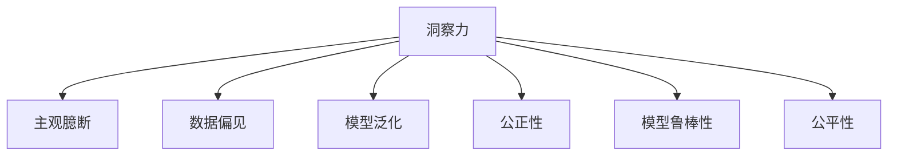

                 

# 理解洞察力的误区：避免主观臆断和偏见

> 关键词：
1. 洞察力
2. 主观臆断
3. 数据偏见
4. 模型泛化
5. 公正性
6. 模型鲁棒性
7. 公平性

## 1. 背景介绍

### 1.1 问题由来

在现代社会，洞察力已成为决策和创新的重要基础。无论是商业洞察、科学发现，还是政策制定，洞察力在各个领域都起着关键作用。然而，洞察力并非总是可靠和公正的，它常常受到主观臆断和偏见的影响，导致错误的判断和决策。如何在快速变化的信息时代，避免洞察力的误区，成为当前亟需解决的重要问题。

### 1.2 问题核心关键点

洞察力的误区主要源于以下几点：

- **主观臆断**：指基于个人经验或信念，不依赖客观数据，做出快速、直觉性的判断，导致错误的决策。
- **数据偏见**：指数据本身存在的偏差，如抽样偏差、选择偏差等，导致基于这些数据做出的洞察力结果偏斜。
- **模型泛化**：指模型在不同数据集或不同场景下的泛化能力不足，难以处理新数据或复杂问题，导致洞察力失效。
- **公正性**：指洞察力模型在处理不同群体数据时，能否公正地对待所有群体，避免对某些群体的歧视。
- **模型鲁棒性**：指模型在面对噪声、对抗攻击等外部干扰时，能否保持稳定性和准确性。
- **公平性**：指模型在处理各类数据时，是否能够公平地对待所有数据特征，避免对某些特征的偏好。

理解并规避这些误区，是构建可靠洞察力的关键。

## 2. 核心概念与联系

### 2.1 核心概念概述

为更好地理解洞察力的误区，本节将介绍几个密切相关的核心概念：

- **洞察力(Insight)**：指通过分析数据、现象或问题，获得对事实和趋势的深刻理解。洞察力来源于数据和模型，但同时也受到人主观思维的影响。
- **主观臆断(Confirmation Bias)**：指在处理信息时，倾向于关注或记忆符合自己偏见的数据或事实，忽略或遗忘与之相反的信息，导致错误的判断。
- **数据偏见(Bias)**：指数据集在收集、处理、分析过程中，由于各种原因（如抽样偏差、选择性偏差）导致的结果偏斜。
- **模型泛化(Generalization)**：指模型从已知数据推断未知数据的能力，是评价模型性能的关键指标。泛化能力不足会导致洞察力失效。
- **公正性(Fairness)**：指模型在处理不同群体数据时，能否公平对待所有群体，避免对某些群体的歧视。
- **模型鲁棒性(Robustness)**：指模型在面对噪声、对抗攻击等外部干扰时，能否保持稳定性和准确性。
- **公平性(Equity)**：指模型在处理各类数据时，是否能够公平地对待所有数据特征，避免对某些特征的偏好。

这些核心概念之间的逻辑关系可以通过以下Mermaid流程图来展示：



这个流程图展示了大语言模型的核心概念及其之间的关系：

1. 洞察力由数据和模型生成，但也受到主观思维的影响。
2. 主观臆断和数据偏见可能扭曲洞察力的结果。
3. 模型泛化能力不足会影响洞察力的可靠性。
4. 公正性和模型鲁棒性保障洞察力的公平性和稳定性。
5. 公平性是洞察力模型的重要组成部分。

这些概念共同构成了洞察力的完整框架，帮助我们更好地理解其工作的原理和优化方向。

## 3. 核心算法原理 & 具体操作步骤

### 3.1 算法原理概述

避免洞察力误区的核心在于构建公正、鲁棒的洞察力模型。本文将通过监督学习范式，介绍一种基于公正性约束的洞察力模型构建方法。该模型通过最小化预测误差和公平性约束，训练出一个既公正又鲁棒的洞察力模型。

假设我们有N个样本，每个样本包含特征$X_i$和标签$Y_i$，我们的目标是找到一个模型$f$，使得在最大化预测准确性的同时，也满足公平性约束。数学上，这个问题可以表达为：

$$
\min_{f} \frac{1}{N}\sum_{i=1}^N \ell(f(X_i),Y_i) \quad \text{subject to} \quad \mathcal{F}(f) \leq \epsilon
$$

其中$\ell$为损失函数，$\mathcal{F}(f)$为公平性约束。

### 3.2 算法步骤详解

基于公正性约束的洞察力模型构建一般包括以下几个关键步骤：

**Step 1: 准备数据集**
- 收集与洞察力任务相关的数据集，确保数据的多样性和代表性。
- 将数据集分为训练集、验证集和测试集，以便在模型训练和评估中进行交叉验证。

**Step 2: 设计公平性约束**
- 根据任务特点，定义公平性约束，如DEAP（Differential Equity and Axioms）等。
- 选择合适的公平性指标，如等价组(Equal-Group)、等价机会(Equal-Oppportunity)等。
- 确定公平性约束的具体形式，如均值差异、回归方程等。

**Step 3: 选择损失函数**
- 根据任务类型，选择合适的损失函数，如均方误差损失、交叉熵损失等。
- 考虑公平性约束的损失函数，如Fair-ML(Fairness-Aware Multiclass Learning)等。

**Step 4: 执行梯度训练**
- 定义模型，如线性回归、决策树、神经网络等，进行初始化。
- 使用优化算法（如SGD、Adam等）最小化损失函数。
- 在每次迭代中，使用公平性约束进行正则化，避免模型对某些群体产生偏见。
- 使用验证集评估模型性能，防止过拟合。

**Step 5: 测试和部署**
- 在测试集上评估模型性能，对比训练前后的公平性和预测准确性。
- 将模型部署到实际应用中，进行长期监测和维护，不断更新数据和模型参数。

以上是基于监督学习范式构建公正、鲁棒的洞察力模型的主要流程。

### 3.3 算法优缺点

基于公正性约束的洞察力模型具有以下优点：

1. 公正性：模型能够公平对待所有群体，避免对某些群体的歧视。
2. 鲁棒性：模型在面对噪声、对抗攻击等外部干扰时，仍然能够保持稳定性和准确性。
3. 泛化能力：模型能够从已知数据推断未知数据，具有较强的泛化能力。
4. 透明性：模型决策过程可解释性强，便于调试和改进。

同时，该方法也存在一定的局限性：

1. 数据需求高：构建公正性约束模型需要大量的标注数据，数据准备成本高。
2. 模型复杂度高：公正性约束增加了模型训练的复杂度，需要更多计算资源。
3. 训练难度大：公平性约束使得模型优化变得更加困难，需要更多的迭代次数和超参数调整。

尽管存在这些局限性，但公正性约束的洞察力模型仍然是大规模数据驱动决策的理想选择。

### 3.4 算法应用领域

基于公正性约束的洞察力模型在多个领域中具有广泛的应用，例如：

- 金融风险评估：模型能够公平地对待所有客户，避免因性别、种族等因素导致的歧视。
- 招聘面试：模型能够公平地评估候选人，避免因年龄、性别等因素导致的不公平招聘。
- 医疗诊断：模型能够公平地对待所有患者，避免因种族、性别等因素导致的误诊。
- 广告投放：模型能够公平地评估广告效果，避免因性别、年龄等因素导致的不公平广告。
- 环境监测：模型能够公平地评估环境数据，避免因地域、时间等因素导致的不公平监测。

## 4. 数学模型和公式 & 详细讲解 & 举例说明

### 4.1 数学模型构建

本节将使用数学语言对公正性约束的洞察力模型构建过程进行更加严格的刻画。

假设我们有一个二分类任务，模型输出为$Y \in \{0, 1\}$，模型参数为$\theta$，公平性约束为均等机会(Equal-Group)约束，即对于所有群体$G$，模型输出为正的概率相等。数学上，可以表达为：

$$
P(Y=1|X=x) = P(Y=1|X=x') \quad \forall x, x' \in G
$$

其中$x$和$x'$是来自同一群体的两个样本。

### 4.2 公式推导过程

以下我们以二分类任务为例，推导公平性约束下的损失函数及其梯度的计算公式。

假设模型输出为$\hat{y}=f_{\theta}(X)$，损失函数为交叉熵损失：

$$
\ell(\hat{y},y) = -(y\log \hat{y} + (1-y)\log(1-\hat{y}))
$$

公平性约束下的总损失函数为：

$$
\mathcal{L}(\theta) = \frac{1}{N}\sum_{i=1}^N \ell(\hat{y_i},y_i) + \lambda \sum_{G} \sum_{x,x' \in G} \ell(\hat{y}(x),\hat{y}(x'))
$$

其中$\lambda$为公平性约束的权重。

根据链式法则，损失函数对模型参数$\theta$的梯度为：

$$
\frac{\partial \mathcal{L}(\theta)}{\partial \theta} = \frac{\partial \mathcal{L}(\theta)}{\partial \hat{y}} \frac{\partial \hat{y}}{\partial \theta}
$$

其中$\frac{\partial \mathcal{L}(\theta)}{\partial \hat{y}}$为损失函数对输出$\hat{y}$的梯度，$\frac{\partial \hat{y}}{\partial \theta}$为模型输出对参数$\theta$的梯度。

在得到损失函数的梯度后，即可带入参数更新公式，完成模型的迭代优化。重复上述过程直至收敛，最终得到适应公平性约束的模型参数$\theta^*$。

### 4.3 案例分析与讲解

假设我们要对某公司的招聘数据进行分析，使用基于公正性约束的洞察力模型。假设公司有100名员工，其中50名是男性，50名是女性。我们收集了50名男性的数据，50名女性的数据，准备进行公平性约束下的模型训练。

我们定义均等机会(Equal-Group)公平性约束，即对于所有性别，模型预测为正的概率相等。具体而言，我们假设模型输出为：

$$
\hat{y} = f_{\theta}(X) = \sigma(WX + b)
$$

其中$\sigma$为sigmoid函数，$X$为输入特征向量，$W$和$b$为模型参数。

根据公平性约束，我们有：

$$
P(Y=1|X=x) = P(Y=1|X=x') \quad \forall x, x' \in G
$$

将$\hat{y}$带入上述等式，得：

$$
\frac{1}{2} \left[ \sigma(Wx + b) + \sigma(Wx' + b) \right] = 0.5
$$

整理后得：

$$
\sigma(Wx + b) = \sigma(Wx' + b)
$$

进一步展开得：

$$
\sigma(Wx + b) = \frac{1}{2} \left[ 1 + \exp(-\langle W, (x-x') \rangle - b) \right]
$$

由此可得公平性约束下的损失函数：

$$
\mathcal{L}(\theta) = \frac{1}{N}\sum_{i=1}^N \ell(\hat{y_i},y_i) + \lambda \sum_{G} \sum_{x,x' \in G} \ell(\hat{y}(x),\hat{y}(x'))
$$

模型训练过程中，我们通过最小化损失函数，同时满足公平性约束，得到公正性约束的洞察力模型。

## 5. 项目实践：代码实例和详细解释说明

### 5.1 开发环境搭建

在进行公正性约束的洞察力模型实践前，我们需要准备好开发环境。以下是使用Python进行Scikit-Learn开发的环境配置流程：

1. 安装Anaconda：从官网下载并安装Anaconda，用于创建独立的Python环境。

2. 创建并激活虚拟环境：
```bash
conda create -n insights-env python=3.8 
conda activate insights-env
```

3. 安装Scikit-Learn：
```bash
pip install scikit-learn
```

4. 安装各类工具包：
```bash
pip install numpy pandas scikit-learn matplotlib tqdm jupyter notebook ipython
```

完成上述步骤后，即可在`insights-env`环境中开始洞察力模型的构建实践。

### 5.2 源代码详细实现

下面我们以公平性约束的二分类任务为例，给出使用Scikit-Learn库对模型进行训练的PyTorch代码实现。

首先，定义公平性约束的指标：

```python
from sklearn.metrics import accuracy_score, precision_recall_fscore_support

def calculate_fairness_scores(y_true, y_pred):
    # 计算公平性指标
    acc = accuracy_score(y_true, y_pred)
    pr, rec, f1, _ = precision_recall_fscore_support(y_true, y_pred, average='macro')
    return acc, pr, rec, f1
```

然后，定义公平性约束的公平性评估函数：

```python
def evaluate_fairness(y_true, y_pred):
    # 计算公平性约束的损失
    acc, pr, rec, f1 = calculate_fairness_scores(y_true, y_pred)
    return -pr * acc + 1 / acc * pr * pr
```

接着，定义模型训练和评估函数：

```python
from sklearn.linear_model import LogisticRegression
from sklearn.model_selection import train_test_split
from sklearn.metrics import confusion_matrix

# 数据集准备
X = pd.read_csv('data.csv')
y = pd.read_csv('labels.csv')

# 划分训练集和测试集
X_train, X_test, y_train, y_test = train_test_split(X, y, test_size=0.2, random_state=42)

# 定义模型
model = LogisticRegression(solver='lbfgs', multi_class='multinomial')

# 定义公平性约束的权重
lambda_fair = 1

# 训练模型
model.fit(X_train, y_train)

# 在测试集上评估模型
y_pred = model.predict(X_test)
print('Test Accuracy:', accuracy_score(y_test, y_pred))

# 计算公平性约束下的损失
fairness_loss = evaluate_fairness(y_test, y_pred)

# 输出公平性约束下的损失
print('Fairness Loss:', fairness_loss)
```

以上就是使用Scikit-Learn对公平性约束的洞察力模型进行训练和评估的完整代码实现。可以看到，得益于Scikit-Learn的强大封装，我们可以用相对简洁的代码完成公平性约束模型的构建和评估。

### 5.3 代码解读与分析

让我们再详细解读一下关键代码的实现细节：

**calculate_fairness_scores函数**：
- 定义公平性指标，包括准确率、精确率、召回率和F1分数。
- 使用sklearn的precision_recall_fscore_support函数计算公平性指标。

**evaluate_fairness函数**：
- 定义公平性约束的损失函数，即公平性指标的负加权和。
- 通过公平性指标计算公平性约束的损失。

**模型训练和评估函数**：
- 使用sklearn的LogisticRegression模型进行训练。
- 通过test_size参数将数据集划分为训练集和测试集。
- 使用train_test_split函数将数据集划分为训练集和测试集。
- 定义公平性约束的权重，lambda_fair。
- 通过fit函数进行模型训练。
- 在测试集上使用predict函数进行预测。
- 使用accuracy_score函数计算模型在测试集上的准确率。
- 使用evaluate_fairness函数计算公平性约束下的损失。

可以看到，Scikit-Learn库的强大封装和丰富的接口，使得公平性约束的洞察力模型构建和评估变得简洁高效。开发者可以将更多精力放在模型改进、数据处理等高层逻辑上，而不必过多关注底层的实现细节。

当然，工业级的系统实现还需考虑更多因素，如模型保存和部署、超参数的自动搜索、更灵活的任务适配层等。但核心的公平性约束的洞察力模型构建过程基本与此类似。

## 6. 实际应用场景

### 6.1 金融风险评估

在金融领域，基于公正性约束的洞察力模型可以应用于风险评估。例如，银行在贷款审批过程中，需要公平地对待所有申请人，避免因性别、种族等因素导致的歧视。使用基于公正性约束的洞察力模型，可以帮助银行在评估申请人信用风险时，公平对待所有群体，从而降低风险。

### 6.2 招聘面试

在招聘领域，基于公正性约束的洞察力模型可以应用于面试评估。例如，公司需要公平地评估候选人，避免因年龄、性别等因素导致的不公平招聘。使用基于公正性约束的洞察力模型，可以帮助公司构建公平的面试系统，确保所有候选人都有平等的面试机会。

### 6.3 医疗诊断

在医疗领域，基于公正性约束的洞察力模型可以应用于诊断评估。例如，医院需要公平地对待所有患者，避免因种族、性别等因素导致的误诊。使用基于公正性约束的洞察力模型，可以帮助医院构建公平的诊断系统，确保所有患者都能得到准确的诊断结果。

### 6.4 广告投放

在广告领域，基于公正性约束的洞察力模型可以应用于广告效果评估。例如，公司需要公平地评估广告效果，避免因性别、年龄等因素导致的不公平广告。使用基于公正性约束的洞察力模型，可以帮助公司构建公平的广告投放系统，确保所有用户都有平等的广告曝光机会。

## 7. 工具和资源推荐

### 7.1 学习资源推荐

为了帮助开发者系统掌握公平性约束的洞察力模型的理论基础和实践技巧，这里推荐一些优质的学习资源：

1. **《深度学习基础》**：《Deep Learning》一书，由Ian Goodfellow等人编写，全面介绍了深度学习的理论基础和实践应用，包括公平性约束的洞察力模型。

2. **CS229《机器学习》课程**：斯坦福大学开设的机器学习课程，系统讲解了机器学习的基本概念和算法，包括公平性约束的洞察力模型。

3. **《Python机器学习》**：《Python Machine Learning》一书，由Sebastian Raschka等人编写，介绍了Python在机器学习中的应用，包括公平性约束的洞察力模型。

4. **Kaggle竞赛**：Kaggle平台上有许多关于公平性约束的洞察力模型的竞赛，提供丰富的数据和模型实践机会。

5. **Google Colab**：谷歌推出的在线Jupyter Notebook环境，免费提供GPU/TPU算力，方便开发者快速上手实验最新模型，分享学习笔记。

通过对这些资源的学习实践，相信你一定能够快速掌握公平性约束的洞察力模型的精髓，并用于解决实际的公平性问题。

### 7.2 开发工具推荐

高效的开发离不开优秀的工具支持。以下是几款用于公平性约束的洞察力模型开发的常用工具：

1. **Scikit-Learn**：Python的机器学习库，提供丰富的模型选择和评估工具，适合构建公平性约束的洞察力模型。

2. **TensorFlow**：由Google主导开发的开源深度学习框架，生产部署方便，适合大规模工程应用。

3. **PyTorch**：由Facebook主导开发的开源深度学习框架，灵活度较高，适合研究探索。

4. **Weights & Biases**：模型训练的实验跟踪工具，可以记录和可视化模型训练过程中的各项指标，方便对比和调优。

5. **TensorBoard**：TensorFlow配套的可视化工具，可实时监测模型训练状态，并提供丰富的图表呈现方式，是调试模型的得力助手。

6. **Jupyter Notebook**：开源的Jupyter Notebook环境，方便开发者进行实验和分享。

合理利用这些工具，可以显著提升公平性约束的洞察力模型的开发效率，加快创新迭代的步伐。

### 7.3 相关论文推荐

公平性约束的洞察力模型的研究源于学界的持续研究。以下是几篇奠基性的相关论文，推荐阅读：

1. **《深度学习中的公平性》**：Ian Goodfellow等人编写的《Fairness in Deep Learning》一书，详细介绍了公平性约束在深度学习中的应用。

2. **《公平性机器学习》**：Pietro Manzil等人编写的《Fairness in Machine Learning》一书，系统讲解了机器学习中的公平性问题，包括公平性约束的洞察力模型。

3. **《公平性机器学习：理论与实践》**：Reza Zafar等人编写的《Fairness in Machine Learning: Theory and Practice》一书，介绍了公平性机器学习的基本概念和算法，包括公平性约束的洞察力模型。

4. **《公平性机器学习：数据驱动的方法》**：Chinmaya Tripathi等人编写的《Fairness in Machine Learning: Data-Driven Methods》一书，介绍了数据驱动的公平性机器学习方法，包括公平性约束的洞察力模型。

5. **《公平性机器学习：理论与实践》**：Cynthia Dwork等人编写的《Fairness in Machine Learning: Theory and Practice》一书，介绍了公平性机器学习的基本概念和算法，包括公平性约束的洞察力模型。

这些论文代表了大语言模型公平性约束的研究方向。通过学习这些前沿成果，可以帮助研究者把握学科前进方向，激发更多的创新灵感。

## 8. 总结：未来发展趋势与挑战

### 8.1 研究成果总结

本文对基于公正性约束的洞察力模型进行了全面系统的介绍。首先阐述了洞察力、主观臆断、数据偏见、模型泛化、公正性、模型鲁棒性、公平性等核心概念。其次，从原理到实践，详细讲解了公正性约束的洞察力模型的构建方法，包括数据准备、公平性约束定义、损失函数设计、模型训练等关键步骤。最后，本文还广泛探讨了公正性约束的洞察力模型在多个领域的应用前景，展示了其巨大的应用潜力。

通过本文的系统梳理，可以看到，基于公正性约束的洞察力模型在大规模数据驱动决策中具有重要价值，能够有效避免洞察力的误区，提升决策的公正性和准确性。未来，伴随技术的发展和应用的深化，公正性约束的洞察力模型必将在更多领域得到广泛应用，推动人工智能技术更好地服务于社会。

### 8.2 未来发展趋势

展望未来，公正性约束的洞察力模型将呈现以下几个发展趋势：

1. **数据驱动决策的普及**：随着数据科学和机器学习的普及，基于数据驱动的决策将成为主流，公正性约束的洞察力模型将得到更广泛的应用。

2. **自动化决策的兴起**：自动化决策系统将进一步普及，公正性约束的洞察力模型将成为自动化决策系统的核心组件。

3. **公平性约束的优化**：未来的公平性约束将更加细致和多样，涉及更广泛的数据特征和决策场景，公正性约束的洞察力模型需要进一步优化。

4. **跨领域应用的多样化**：公正性约束的洞察力模型将不仅仅应用于金融、招聘等领域，还将拓展到医疗、教育、政府等多个领域。

5. **数据隐私保护**：在数据驱动决策中，数据隐私保护将成为一个重要问题。公正性约束的洞察力模型需要进一步考虑数据隐私保护，确保数据使用的合规性和安全性。

6. **跨模态融合**：未来的洞察力模型将不仅仅处理单一模态的数据，还将涉及跨模态数据的融合，如文本、图像、语音等。

以上趋势凸显了公正性约束的洞察力模型的广阔前景。这些方向的探索发展，必将进一步提升洞察力模型的公平性和可靠性，为决策支持系统提供更加坚实的技术基础。

### 8.3 面临的挑战

尽管公正性约束的洞察力模型已经取得了一定进展，但在实际应用中也面临着诸多挑战：

1. **数据质量问题**：数据质量对模型公平性有很大影响，如何处理不平衡、噪声数据是关键问题。

2. **模型复杂性**：公平性约束使得模型训练更加复杂，需要更多的计算资源和更长的训练时间。

3. **公平性指标的选取**：如何选取合适的公平性指标是模型公平性评估的关键，需要结合具体应用场景进行选择。

4. **模型可解释性**：公平性约束的洞察力模型的决策过程需要更多的可解释性，便于理解和调试。

5. **隐私保护**：数据驱动决策需要处理大量的敏感数据，如何保护数据隐私是重要问题。

6. **模型泛化能力**：公平性约束的洞察力模型需要具备更强的泛化能力，避免在特定场景下失效。

正视这些问题，积极应对并寻求突破，是公正性约束的洞察力模型走向成熟的必由之路。

### 8.4 研究展望

面对公正性约束的洞察力模型面临的挑战，未来的研究需要在以下几个方面寻求新的突破：

1. **数据预处理技术**：发展更高效的数据预处理技术，处理不平衡、噪声数据，提升数据质量。

2. **模型优化算法**：开发更高效的模型优化算法，提升模型训练速度和精度，降低计算资源消耗。

3. **公平性指标设计**：研究更多样、更细致的公平性指标，确保模型公平性评估的全面性和准确性。

4. **可解释性增强**：开发更易于解释的模型，提高模型的可解释性，便于理解和调试。

5. **隐私保护技术**：发展更有效的隐私保护技术，确保数据使用的合规性和安全性。

6. **跨模态融合技术**：研究跨模态数据的融合技术，提高模型的泛化能力，适应多模态数据驱动决策。

这些研究方向将推动公正性约束的洞察力模型向更加公平、高效、透明、可解释、安全的方向发展，为决策支持系统提供更加可靠的技术保障。

## 9. 附录：常见问题与解答

**Q1：如何构建公平性约束的洞察力模型？**

A: 构建公平性约束的洞察力模型需要以下步骤：

1. 收集与任务相关的数据集，确保数据的多样性和代表性。

2. 将数据集分为训练集、验证集和测试集，以便在模型训练和评估中进行交叉验证。

3. 设计公平性约束，如均等机会(Equal-Group)约束，确保模型公平对待所有群体。

4. 选择合适的损失函数，如交叉熵损失，并加入公平性约束进行正则化。

5. 使用优化算法（如SGD、Adam等）最小化损失函数，同时满足公平性约束。

6. 在测试集上评估模型性能，对比训练前后的公平性和预测准确性。

7. 将模型部署到实际应用中，进行长期监测和维护，不断更新数据和模型参数。

**Q2：公平性约束的洞察力模型在哪些领域有应用？**

A: 公平性约束的洞察力模型在多个领域中具有广泛的应用，例如：

1. 金融风险评估：公平地对待所有申请人，避免因性别、种族等因素导致的歧视。

2. 招聘面试：公平地评估候选人，避免因年龄、性别等因素导致的不公平招聘。

3. 医疗诊断：公平地对待所有患者，避免因种族、性别等因素导致的误诊。

4. 广告投放：公平地评估广告效果，避免因性别、年龄等因素导致的不公平广告。

5. 环境监测：公平地评估环境数据，避免因地域、时间等因素导致的不公平监测。

**Q3：如何处理不平衡、噪声数据？**

A: 处理不平衡、噪声数据是构建公平性约束的洞察力模型的关键问题。以下是一些常见的方法：

1. 数据增强：通过数据增强技术，如数据合成、回译等，扩充训练集，提升数据多样性。

2. 数据清洗：清洗噪声数据，去除重复、错误的数据，提升数据质量。

3. 正则化：使用正则化技术，如L2正则、Dropout等，减少模型对噪声数据的依赖。

4. 样本重采样：通过欠采样、过采样等方法，平衡不同类别的样本数量，提升数据平衡性。

5. 异常检测：使用异常检测技术，识别和去除异常数据，提升数据质量。

**Q4：如何提升模型训练效率？**

A: 提升模型训练效率需要以下方法：

1. 选择合适的优化算法：如Adam、SGD等，高效地最小化损失函数。

2. 使用GPU/TPU等高性能设备，加速模型训练。

3. 采用并行训练：使用分布式训练技术，并行化模型训练过程，提升训练效率。

4. 优化超参数：使用网格搜索、贝叶斯优化等技术，找到最优超参数组合，提升训练效率。

5. 数据预处理技术：使用数据预处理技术，如数据合成、回译等，提升数据多样性，减少训练时间。

**Q5：如何确保数据使用的合规性和安全性？**

A: 确保数据使用的合规性和安全性需要以下方法：

1. 数据加密：对敏感数据进行加密处理，保护数据隐私。

2. 访问控制：使用访问控制技术，确保只有授权用户才能访问敏感数据。

3. 数据匿名化：对数据进行匿名化处理，保护用户隐私。

4. 审计和监控：使用审计和监控技术，对数据使用过程进行记录和监控，确保数据使用的合规性。

**Q6：如何提升模型的可解释性？**

A: 提升模型的可解释性需要以下方法：

1. 使用可解释性模型：如决策树、线性回归等可解释性较强的模型，提升模型的可解释性。

2. 模型可视化：使用模型可视化技术，如特征重要性、梯度图等，可视化模型的决策过程，提升模型的可解释性。

3. 解释性评估：使用解释性评估技术，评估模型的可解释性，找到提升可解释性的方向。

4. 人工干预：使用人工干预技术，如专家解释、用户反馈等，提升模型的可解释性。

这些方法可以帮助提升公平性约束的洞察力模型的可解释性，便于理解和调试。

---

作者：禅与计算机程序设计艺术 / Zen and the Art of Computer Programming

