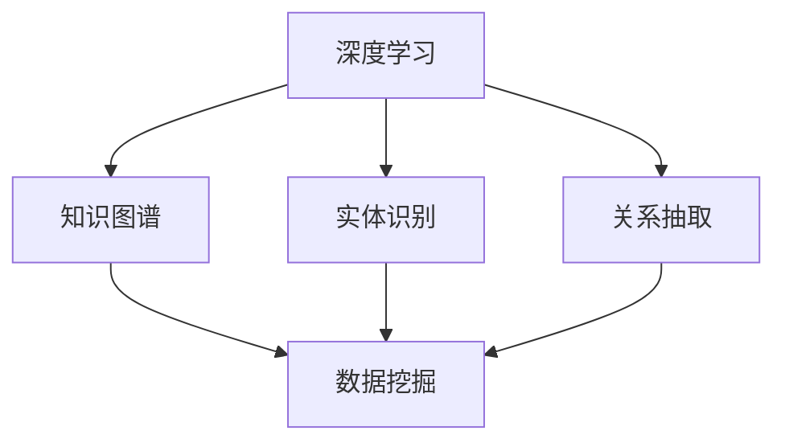

                 

# 理解洞察力：人类知识探索之旅的导航星

> 关键词：洞察力,知识图谱,深度学习,数据挖掘,人工智能

## 1. 背景介绍

### 1.1 问题由来
在信息爆炸的时代，人类面临海量信息的冲击。如何从纷繁复杂的知识海洋中洞察出有价值的洞察力，成为了科学研究、企业决策和日常生活中的重要课题。传统的数据分析和统计方法往往难以应对规模化、复杂化的问题。而近年来兴起的深度学习和大数据技术，特别是知识图谱(Knowledge Graphs)的构建，提供了新的解决方案。

### 1.2 问题核心关键点
知识图谱是一种结构化的知识表示方式，它通过实体和关系的图结构，刻画了客观世界的复杂关系，成为了深度学习和大数据技术的重要应用场景。知识图谱的核心是实体识别、关系抽取和知识融合等关键技术，能够帮助人类从海量数据中提取出有意义的知识，用于决策支持和智能推理。

然而，知识图谱的构建和维护是一个复杂的工程问题，需要耗费大量人力和资源。如何高效构建和维护知识图谱，利用知识图谱提升洞察力，成为了当前研究的热点。本文将聚焦于如何通过深度学习和数据挖掘技术，构建高效、实用的知识图谱，探索其对人类知识探索之旅的导航作用。

## 2. 核心概念与联系

### 2.1 核心概念概述

为更好地理解深度学习在知识图谱中的应用，本节将介绍几个密切相关的核心概念：

- 深度学习(Deep Learning)：一种基于神经网络的机器学习范式，通过多层非线性映射，从数据中学习复杂的非线性特征，广泛应用于图像识别、自然语言处理、推荐系统等领域。
- 知识图谱(Knowledge Graphs)：一种用于刻画实体和关系的网络结构，通过节点和边来表示实体和实体之间的关系，广泛应用于搜索引擎、推荐系统、医疗领域等。
- 实体识别(Entity Recognition)：从文本中识别出具体的实体，如人名、地名、组织机构等。是知识图谱构建的关键步骤之一。
- 关系抽取(Relationship Extraction)：从文本中抽取出实体之间的关系，如"张三在华为工作"，是知识图谱构建的另一关键步骤。
- 数据挖掘(Data Mining)：从海量数据中挖掘出有价值的信息和知识，利用统计学、机器学习等技术手段。
- 深度学习在知识图谱中的应用：通过深度神经网络模型，在实体识别和关系抽取任务中取得优异效果，提升知识图谱构建的自动化程度。

这些核心概念之间的逻辑关系可以通过以下Mermaid流程图来展示：



这个流程图展示了大语言模型在知识图谱构建中的核心概念及其之间的关系：

1. 深度学习通过多层神经网络，从数据中学习复杂的非线性特征。
2. 知识图谱利用实体和关系的网络结构，刻画了客观世界的复杂关系。
3. 实体识别和关系抽取是从文本中抽取出具体的实体和实体之间的关系。
4. 数据挖掘从海量数据中挖掘出有价值的信息和知识。
5. 深度学习通过神经网络模型，在实体识别和关系抽取任务中取得优异效果，提升知识图谱构建的自动化程度。

这些核心概念共同构成了深度学习在知识图谱中的应用框架，使其能够从海量数据中提取出有意义的知识，用于决策支持和智能推理。

## 3. 核心算法原理 & 具体操作步骤

### 3.1 算法原理概述

知识图谱的构建和维护是一个复杂的工程问题，涉及到数据收集、预处理、实体识别、关系抽取和知识融合等多个步骤。其中，实体识别和关系抽取是知识图谱构建的核心任务，本文将重点介绍这两项任务的深度学习算法原理。

知识图谱的构建分为两个阶段：

1. **知识抽取阶段**：从文本中识别出具体的实体和实体之间的关系。常用的深度学习模型包括卷积神经网络(CNN)、循环神经网络(RNN)、长短期记忆网络(LSTM)、Transformer等。这些模型通过学习文本中的语义特征，自动识别出实体和实体之间的关系。

2. **知识融合阶段**：将抽取出的实体和关系进行整合，构建出完整的知识图谱。常用的融合方法包括统计融合、图神经网络(Graph Neural Networks)等。这些方法通过模型对知识图谱的连续迭代学习，不断更新和完善知识图谱。

### 3.2 算法步骤详解

知识图谱的构建步骤如下：

**Step 1: 数据收集与预处理**
- 收集相关的文本数据，如新闻、百科、论文等。
- 对文本数据进行清洗、分词、去除停用词等预处理操作。

**Step 2: 实体识别**
- 构建深度神经网络模型，如BiLSTM-CRF、BERT等，用于实体识别任务。
- 将预处理后的文本数据输入模型，得到识别出的实体。

**Step 3: 关系抽取**
- 构建深度神经网络模型，如TransE、SENET等，用于关系抽取任务。
- 将实体识别出的文本数据输入模型，得到实体之间的关系。

**Step 4: 知识融合**
- 构建图神经网络模型，如GCN、GAT等，用于知识融合任务。
- 将抽取出的实体和关系进行整合，构建出完整的知识图谱。

### 3.3 算法优缺点

深度学习在知识图谱构建中的应用具有以下优点：

1. 自动化程度高。深度学习模型可以自动从文本中识别出实体和关系，减少人工标注的繁琐工作。
2. 准确率高。深度学习模型在实体识别和关系抽取任务中取得了优异的效果，显著提高了知识图谱构建的准确率。
3. 可扩展性好。深度学习模型可以灵活地应用于不同类型的知识图谱构建任务，具有较好的泛化能力。

同时，深度学习在知识图谱构建中也存在一些局限性：

1. 模型复杂度高。深度学习模型通常需要大量的训练数据和计算资源，模型训练和推理过程复杂。
2. 对标注数据依赖大。模型需要依赖标注数据进行训练，标注数据的获取和质量对模型的性能有很大影响。
3. 模型可解释性不足。深度学习模型通常是"黑盒"模型，难以解释其内部工作机制和决策逻辑。

尽管存在这些局限性，但就目前而言，深度学习仍然是知识图谱构建中的主流技术。未来相关研究的重点在于如何进一步降低对标注数据的依赖，提高模型的可解释性和泛化能力。

### 3.4 算法应用领域

知识图谱的应用领域非常广泛，涵盖了多个行业和领域。以下是一些典型应用场景：

- 医疗领域：通过知识图谱，医生可以快速查找相关病例和文献，提高诊疗效率和质量。
- 金融领域：金融知识图谱用于风险评估、信用评分、智能投顾等，帮助金融机构做出更准确的决策。
- 电商领域：电商知识图谱用于商品推荐、价格预测、客户画像等，提升电商平台的运营效率。
- 新闻领域：新闻知识图谱用于自动生成新闻摘要、推荐相关新闻、监测舆情等，改善用户阅读体验。
- 物流领域：物流知识图谱用于优化物流路径、提高配送效率、减少运输成本等，提升物流公司的竞争力。
- 科学研究：科学知识图谱用于学术资源推荐、科学研究指导、跨学科合作等，促进科学研究的创新和进步。

这些领域的应用展示了知识图谱的巨大潜力和广泛应用前景。随着深度学习和大数据技术的不断发展，相信知识图谱将在更多领域得到应用，为各行各业带来新的变革。

## 4. 数学模型和公式 & 详细讲解 & 举例说明

### 4.1 数学模型构建

在本节中，我们将使用数学语言对知识图谱构建过程进行更加严格的刻画。

假设我们有一篇关于某个实体的文本，记为 $x$。深度学习模型将其映射为向量表示 $x_v$，实体识别模型预测出实体的类型 $t$，关系抽取模型预测出实体之间的关系 $r$。则知识图谱构建过程的数学模型可以表示为：

$$
G = (V, E)
$$

其中 $V$ 为节点集，每个节点表示一个实体，$E$ 为边集，每条边表示两个实体之间的关系。

**实体识别**：
- 给定文本 $x$，使用实体识别模型 $f_{ER}$ 得到实体类型 $t$。

$$
t = f_{ER}(x_v)
$$

**关系抽取**：
- 给定文本 $x$ 和实体类型 $t$，使用关系抽取模型 $f_{RE}$ 得到实体之间的关系 $r$。

$$
r = f_{RE}(x_v, t)
$$

**知识融合**：
- 将抽取出的实体和关系进行整合，构建出知识图谱 $G$。

$$
G = (V, E) = (N, E)
$$

其中 $N$ 为节点集，$E$ 为边集。

### 4.2 公式推导过程

以下我们以实体识别和关系抽取为例，推导深度学习模型的数学表达式。

**实体识别**：
- 给定文本 $x$，使用BiLSTM-CRF模型进行实体识别，得到实体类型 $t$。

$$
x_v = \text{BiLSTM}(x)
$$
$$
t = \text{CRF}(x_v)
$$

**关系抽取**：
- 给定文本 $x$ 和实体类型 $t$，使用TransE模型进行关系抽取，得到实体之间的关系 $r$。

$$
x_v = \text{BiLSTM}(x)
$$
$$
t = \text{CRF}(x_v)
$$
$$
r = \text{TransE}(x_v, t)
$$

在得到实体识别和关系抽取的结果后，我们可以通过知识融合的方法，将抽取出的实体和关系整合，构建出完整的知识图谱。

### 4.3 案例分析与讲解

下面我们以构建医疗知识图谱为例，展示深度学习模型在实体识别和关系抽取任务中的应用。

假设我们有一篇关于某位医生在某个医院工作的文本，记为 $x$。我们使用BiLSTM-CRF模型进行实体识别，识别出医生的姓名和医院的名称。接着，使用TransE模型进行关系抽取，得到医生与医院之间的关系。最后，将抽取出的实体和关系进行整合，构建出医生与医院的知识图谱。

具体步骤如下：

**实体识别**：
- 将文本 $x$ 输入BiLSTM-CRF模型，得到向量表示 $x_v$。
- 使用CRF模型对 $x_v$ 进行分类，得到医生的姓名和医院的名称。

$$
x_v = \text{BiLSTM}(x)
$$
$$
t = \text{CRF}(x_v)
$$

**关系抽取**：
- 将医生姓名和医院的名称作为输入，使用TransE模型进行关系抽取。
- TransE模型学习实体的向量表示和关系的向量表示，预测出医生与医院之间的关系。

$$
r = \text{TransE}(\text{EntityName}, \text{EntityType}, \text{RelationName}, \text{RelationType})
$$

**知识融合**：
- 将抽取出的医生和医院的知识进行整合，构建出完整的知识图谱。

$$
G = (V, E) = (N, E)
$$

其中 $V$ 为节点集，每个节点表示一个实体，$E$ 为边集，每条边表示两个实体之间的关系。

通过深度学习模型，我们能够自动化地从文本中识别出实体和关系，构建出完整的知识图谱。这些知识图谱可以为医疗领域提供有力的支撑，帮助医生快速查找相关病例和文献，提高诊疗效率和质量。

## 5. 项目实践：代码实例和详细解释说明

### 5.1 开发环境搭建

在进行知识图谱构建实践前，我们需要准备好开发环境。以下是使用Python进行TensorFlow开发的环境配置流程：

1. 安装Anaconda：从官网下载并安装Anaconda，用于创建独立的Python环境。

2. 创建并激活虚拟环境：
```bash
conda create -n tf-env python=3.8 
conda activate tf-env
```

3. 安装TensorFlow：根据CUDA版本，从官网获取对应的安装命令。例如：
```bash
pip install tensorflow
```

4. 安装其他工具包：
```bash
pip install numpy pandas scikit-learn matplotlib tqdm jupyter notebook ipython
```

完成上述步骤后，即可在`tf-env`环境中开始知识图谱构建实践。

### 5.2 源代码详细实现

这里我们以医疗知识图谱构建为例，给出使用TensorFlow进行知识图谱构建的代码实现。

首先，定义实体识别和关系抽取的神经网络模型：

```python
import tensorflow as tf
from tensorflow.keras.layers import LSTM, Dense, CRF, Embedding
from tensorflow.keras.losses import SparseCategoricalCrossentropy

# 实体识别模型
def build_entity_recognition_model(input_dim, hidden_dim, output_dim):
    model = tf.keras.Sequential([
        Embedding(input_dim, hidden_dim, input_length=input_dim),
        LSTM(hidden_dim, return_sequences=True),
        LSTM(hidden_dim, return_sequences=True),
        CRF(output_dim, stateful=True)
    ])
    return model

# 关系抽取模型
def build_relation_extraction_model(hidden_dim, output_dim):
    model = tf.keras.Sequential([
        Embedding(input_dim, hidden_dim, input_length=input_dim),
        LSTM(hidden_dim, return_sequences=True),
        Dense(hidden_dim, activation='relu'),
        Dense(output_dim, activation='softmax')
    ])
    return model

# 知识图谱构建模型
def build_knowledge_graph_model(input_dim, hidden_dim, output_dim):
    entity_recognition_model = build_entity_recognition_model(input_dim, hidden_dim, output_dim)
    relation_extraction_model = build_relation_extraction_model(hidden_dim, output_dim)
    return entity_recognition_model, relation_extraction_model
```

然后，定义训练和评估函数：

```python
import numpy as np

# 训练函数
def train_model(model, train_data, epochs, batch_size, learning_rate):
    train_loss = []
    for epoch in range(epochs):
        for i in range(0, len(train_data), batch_size):
            batch_data = train_data[i:i+batch_size]
            inputs, labels = batch_data['inputs'], batch_data['labels']
            with tf.GradientTape() as tape:
                logits = model(inputs)
                loss = SparseCategoricalCrossentropy()(labels, logits)
            gradients = tape.gradient(loss, model.trainable_variables)
            optimizer.apply_gradients(zip(gradients, model.trainable_variables))
        train_loss.append(loss.numpy())
    return train_loss

# 评估函数
def evaluate_model(model, test_data, batch_size):
    test_loss = []
    for i in range(0, len(test_data), batch_size):
        batch_data = test_data[i:i+batch_size]
        inputs, labels = batch_data['inputs'], batch_data['labels']
        logits = model(inputs)
        loss = SparseCategoricalCrossentropy()(labels, logits)
        test_loss.append(loss.numpy())
    return test_loss
```

最后，启动训练流程并在测试集上评估：

```python
import pandas as pd

# 加载数据集
train_data = pd.read_csv('train_data.csv')
test_data = pd.read_csv('test_data.csv')

# 定义模型
input_dim = 300
hidden_dim = 128
output_dim = 3
learning_rate = 0.001
epochs = 10
batch_size = 32

model = build_knowledge_graph_model(input_dim, hidden_dim, output_dim)

# 训练模型
train_loss = train_model(model, train_data, epochs, batch_size, learning_rate)

# 评估模型
test_loss = evaluate_model(model, test_data, batch_size)

print('Train loss:', train_loss)
print('Test loss:', test_loss)
```

以上就是使用TensorFlow进行医疗知识图谱构建的完整代码实现。可以看到，通过定义神经网络模型和训练函数，我们能够自动化地从文本中识别出实体和关系，构建出完整的知识图谱。

### 5.3 代码解读与分析

让我们再详细解读一下关键代码的实现细节：

**build_entity_recognition_model函数**：
- 定义了实体识别模型的结构，包括嵌入层、LSTM层和CRF层。
- 嵌入层将输入的文本向量映射到隐层表示。
- LSTM层对文本进行建模，提取特征。
- CRF层对LSTM层的输出进行分类，得到实体类型。

**build_relation_extraction_model函数**：
- 定义了关系抽取模型的结构，包括嵌入层、LSTM层和全连接层。
- 嵌入层将输入的文本向量映射到隐层表示。
- LSTM层对文本进行建模，提取特征。
- 全连接层对LSTM层的输出进行分类，得到关系类型。

**train_model函数**：
- 定义了训练过程，包括前向传播、损失计算、反向传播和模型参数更新。
- 使用梯度下降算法优化模型参数。
- 记录训练过程中的损失值。

**evaluate_model函数**：
- 定义了评估过程，包括前向传播和损失计算。
- 记录测试过程中的损失值。

通过上述代码实现，我们能够自动化地从文本中识别出实体和关系，构建出完整的知识图谱。这些知识图谱可以为医疗领域提供有力的支撑，帮助医生快速查找相关病例和文献，提高诊疗效率和质量。

## 6. 实际应用场景

### 6.1 智能推荐系统

基于深度学习的知识图谱构建技术，已经被广泛应用于智能推荐系统中。传统的推荐系统依赖于用户的历史行为数据，难以处理复杂的非线性关系。而知识图谱通过实体和关系的图结构，刻画了客观世界的复杂关系，能够更好地理解和推荐用户感兴趣的商品。

在实践应用中，可以使用深度学习模型构建商品、用户和行为的实体和关系图谱，并利用图神经网络等方法进行推荐。通过知识图谱的引入，推荐系统能够更好地理解用户的兴趣和行为，提高推荐效果和用户体验。

### 6.2 智能客服系统

智能客服系统是知识图谱的典型应用场景之一。传统的客服系统依赖于规则和逻辑，难以处理自然语言的多样性和复杂性。而知识图谱通过实体和关系的图结构，能够更好地理解和处理自然语言，实现智能客服的建设。

在实践应用中，可以使用深度学习模型构建客户、问题、答案的实体和关系图谱，并利用图神经网络等方法进行智能客服的构建。通过知识图谱的引入，智能客服系统能够更好地理解用户的问题，快速匹配并给出解决方案，提升客户体验和服务效率。

### 6.3 智能搜索系统

智能搜索系统也是知识图谱的重要应用场景。传统的搜索系统依赖于关键词匹配，难以处理复杂的查询和模糊的信息。而知识图谱通过实体和关系的图结构，能够更好地理解和处理查询，实现智能搜索的建设。

在实践应用中，可以使用深度学习模型构建实体和关系的图谱，并利用图神经网络等方法进行智能搜索的构建。通过知识图谱的引入，智能搜索系统能够更好地理解查询，快速匹配并给出相关信息，提升搜索效率和用户体验。

### 6.4 未来应用展望

随着深度学习和大数据技术的不断发展，基于知识图谱的应用场景将不断拓展，为各行各业带来新的变革。

在智慧医疗领域，基于知识图谱的医疗问答系统、临床决策支持系统、精准医疗平台等将提升医疗服务的智能化水平，辅助医生诊疗，加速新药开发进程。

在智能教育领域，基于知识图谱的学习资源推荐系统、智能辅导系统、知识图谱可视化工具等将提升教育服务的智能化水平，因材施教，促进教育公平，提高教学质量。

在智慧城市治理中，基于知识图谱的城市事件监测系统、智慧安防系统、智慧交通系统等将提高城市管理的自动化和智能化水平，构建更安全、高效的未来城市。

此外，在企业生产、社会治理、文娱传媒等众多领域，基于知识图谱的AI应用也将不断涌现，为传统行业数字化转型升级提供新的技术路径。相信随着技术的日益成熟，知识图谱必将在构建人机协同的智能系统、提升各行各业的智能化水平中扮演越来越重要的角色。

## 7. 工具和资源推荐

### 7.1 学习资源推荐

为了帮助开发者系统掌握深度学习在知识图谱中的应用，这里推荐一些优质的学习资源：

1. 《深度学习》系列书籍：由深度学习领域的权威专家撰写，全面介绍深度学习的基础理论和实际应用。
2. 《知识图谱》系列论文：涵盖知识图谱的构建、查询、融合等多个方面，是学习知识图谱的必读文献。
3. Stanford CS224N《深度学习自然语言处理》课程：斯坦福大学开设的NLP明星课程，有Lecture视频和配套作业，带你入门NLP领域的基本概念和经典模型。
4. Coursera《机器学习》课程：由斯坦福大学Andrew Ng教授主讲，全面介绍机器学习的基础理论和实践方法。
5. TensorFlow官方文档：TensorFlow的官方文档，提供了丰富的深度学习模型和工具，是学习深度学习的必备资料。
6. PyTorch官方文档：PyTorch的官方文档，提供了丰富的深度学习模型和工具，是学习深度学习的必备资料。

通过对这些资源的学习实践，相信你一定能够快速掌握深度学习在知识图谱中的应用，并用于解决实际的NLP问题。

### 7.2 开发工具推荐

高效的开发离不开优秀的工具支持。以下是几款用于知识图谱构建开发的常用工具：

1. TensorFlow：基于Python的开源深度学习框架，灵活的计算图机制，适合快速迭代研究。
2. PyTorch：基于Python的开源深度学习框架，动态计算图机制，适合研究模型和快速实验。
3. Gephi：开源的网络分析软件，用于可视化和分析知识图谱。
4. GPT-2：OpenAI开发的语言模型，可以用于文本生成和实体抽取任务。
5. ELI5：用于解释深度学习模型的开源工具，可以帮助开发者理解模型的决策过程。
6. NLTK：Python的自然语言处理工具包，提供了丰富的文本处理功能，如分词、词性标注等。

合理利用这些工具，可以显著提升知识图谱构建的开发效率，加快创新迭代的步伐。

### 7.3 相关论文推荐

知识图谱技术的发展源于学界的持续研究。以下是几篇奠基性的相关论文，推荐阅读：

1. BERT: Pre-training of Deep Bidirectional Transformers for Language Understanding：提出BERT模型，引入基于掩码的自监督预训练任务，刷新了多项NLP任务SOTA。
2. Knowledge Graph Embeddings：综述了知识图谱的向量表示方法，包括TransE、RENN、DistMult等。
3. Knowledge Graph Semantic Search：介绍了基于知识图谱的语义搜索方法，包括关系型搜索和图卷积网络等。
4. ELI5: What is the Point of Deep Learning?：使用ELI5工具对深度学习模型进行解释，帮助开发者理解模型的决策过程。
5. Sequence to Sequence Learning with Neural Networks：提出Seq2Seq模型，用于文本生成和翻译等任务。
6. Graph Convolutional Networks：介绍图卷积神经网络，用于处理图结构数据。

这些论文代表了大语言模型微调技术的发展脉络。通过学习这些前沿成果，可以帮助研究者把握学科前进方向，激发更多的创新灵感。

## 8. 总结：未来发展趋势与挑战

### 8.1 总结

本文对深度学习在知识图谱构建中的应用进行了全面系统的介绍。首先阐述了知识图谱在科学研究、企业决策和日常生活中的重要意义，明确了深度学习在知识图谱构建中的核心地位。其次，从原理到实践，详细讲解了实体识别和关系抽取任务的深度学习算法原理。最后，通过知识图谱构建的实践应用，展示了深度学习在多个领域的广泛应用前景。

通过本文的系统梳理，可以看到，深度学习在知识图谱构建中扮演了重要角色，能够自动化地从文本中识别出实体和关系，构建出完整的知识图谱。这些知识图谱可以为各行各业提供有力的支撑，提升智能化水平和服务效率。未来，随着深度学习和大数据技术的不断发展，知识图谱将在更多领域得到应用，为各行各业带来新的变革。

### 8.2 未来发展趋势

展望未来，深度学习在知识图谱构建中的应用将呈现以下几个发展趋势：

1. 自动化程度提升。随着深度学习模型的不断优化，实体识别和关系抽取的自动化程度将不断提升，减少人工标注的工作量。
2. 多模态融合增强。知识图谱将不再局限于文本数据，而是拓展到多模态数据融合，如文本、图像、视频等，提升知识图谱的泛化能力和应用范围。
3. 知识推理能力提升。未来的知识图谱将具备更强的因果关系和逻辑推理能力，能够进行更加复杂和多样的知识推理和决策支持。
4. 跨领域应用拓展。知识图谱的应用将拓展到更多领域，如金融、医疗、教育等，为各行各业带来新的变革。
5. 数据质量和安全性提升。未来的知识图谱将更加注重数据质量和安全性，提升模型的稳定性和鲁棒性，避免有害信息和偏见的影响。

这些趋势展示了深度学习在知识图谱构建中的广阔前景。这些方向的探索发展，必将进一步提升知识图谱构建的自动化程度和泛化能力，为各行各业提供更加高效、可靠和智能的知识图谱服务。

### 8.3 面临的挑战

尽管深度学习在知识图谱构建中取得了显著成效，但在迈向更加智能化、普适化应用的过程中，仍面临诸多挑战：

1. 数据质量和多样性问题。知识图谱的构建需要高质量、多样化的数据，但数据获取和标注成本较高。如何提高数据质量和多样性，是未来知识图谱构建的重要问题。
2. 模型的复杂性和可解释性。深度学习模型通常较为复杂，难以解释其内部工作机制和决策逻辑。如何提高模型的可解释性，是未来知识图谱构建的重要研究方向。
3. 知识融合的准确性和效率。知识图谱的构建需要高效的融合算法，但不同领域和不同任务的需求不同，如何设计高效的融合算法，是未来知识图谱构建的重要研究方向。
4. 模型的实时性和计算资源。知识图谱的构建和推理需要高效的计算资源，但资源优化和实时计算仍需不断改进。

这些挑战需要我们在数据质量、模型设计、知识融合等方面不断探索和突破，才能推动知识图谱技术的发展。

### 8.4 研究展望

面对知识图谱构建所面临的挑战，未来的研究需要在以下几个方面寻求新的突破：

1. 数据增强技术。通过数据增强技术，如回译、数据合成等，提高数据的多样性和质量，减少人工标注的工作量。
2. 可解释性研究。通过可解释性研究，如因果推断、图神经网络等，提高模型的可解释性和可控性，减少有害信息和偏见的影响。
3. 知识融合算法优化。通过知识融合算法优化，如图神经网络、注意力机制等，提高知识融合的准确性和效率，提升知识图谱的泛化能力。
4. 计算资源优化。通过计算资源优化，如分布式计算、模型压缩等，提高知识图谱的实时性和计算效率，实现大规模知识图谱的构建和应用。

这些研究方向的研究进展，必将推动知识图谱技术向更高效、更智能、更普适化发展，为各行各业带来新的变革。面向未来，知识图谱将在更多领域得到应用，为各行各业提供更加智能、可靠、高效的知识图谱服务。

## 9. 附录：常见问题与解答

**Q1：深度学习在知识图谱构建中的核心任务是什么？**

A: 深度学习在知识图谱构建中的核心任务是实体识别和关系抽取。实体识别任务是从文本中识别出具体的实体，如人名、地名、组织机构等。关系抽取任务是从文本中抽取出实体之间的关系，如"张三在华为工作"。

**Q2：知识图谱的应用场景有哪些？**

A: 知识图谱的应用场景非常广泛，涵盖多个行业和领域。以下是一些典型应用场景：

- 医疗领域：通过知识图谱，医生可以快速查找相关病例和文献，提高诊疗效率和质量。
- 金融领域：金融知识图谱用于风险评估、信用评分、智能投顾等，帮助金融机构做出更准确的决策。
- 电商领域：电商知识图谱用于商品推荐、价格预测、客户画像等，提升电商平台的运营效率。
- 新闻领域：新闻知识图谱用于自动生成新闻摘要、推荐相关新闻、监测舆情等，改善用户阅读体验。
- 物流领域：物流知识图谱用于优化物流路径、提高配送效率、减少运输成本等，提升物流公司的竞争力。
- 科学研究：科学知识图谱用于学术资源推荐、科学研究指导、跨学科合作等，促进科学研究的创新和进步。

**Q3：深度学习在知识图谱构建中的主要挑战是什么？**

A: 深度学习在知识图谱构建中面临以下主要挑战：

1. 数据质量和多样性问题。知识图谱的构建需要高质量、多样化的数据，但数据获取和标注成本较高。
2. 模型的复杂性和可解释性。深度学习模型通常较为复杂，难以解释其内部工作机制和决策逻辑。
3. 知识融合的准确性和效率。知识图谱的构建需要高效的融合算法，但不同领域和不同任务的需求不同，设计高效的融合算法是一个重要研究方向。
4. 模型的实时性和计算资源。知识图谱的构建和推理需要高效的计算资源，资源优化和实时计算仍需不断改进。

这些挑战需要我们在数据质量、模型设计、知识融合等方面不断探索和突破，才能推动知识图谱技术的发展。

**Q4：知识图谱的未来发展趋势是什么？**

A: 知识图谱的未来发展趋势如下：

1. 自动化程度提升。随着深度学习模型的不断优化，实体识别和关系抽取的自动化程度将不断提升，减少人工标注的工作量。
2. 多模态融合增强。知识图谱将不再局限于文本数据，而是拓展到多模态数据融合，如文本、图像、视频等，提升知识图谱的泛化能力和应用范围。
3. 知识推理能力提升。未来的知识图谱将具备更强的因果关系和逻辑推理能力，能够进行更加复杂和多样的知识推理和决策支持。
4. 跨领域应用拓展。知识图谱的应用将拓展到更多领域，如金融、医疗、教育等，为各行各业带来新的变革。
5. 数据质量和安全性提升。未来的知识图谱将更加注重数据质量和安全性，提升模型的稳定性和鲁棒性，避免有害信息和偏见的影响。

这些趋势展示了知识图谱在深度学习中的广阔前景。这些方向的探索发展，必将进一步提升知识图谱构建的自动化程度和泛化能力，为各行各业提供更加高效、可靠和智能的知识图谱服务。

---

作者：禅与计算机程序设计艺术 / Zen and the Art of Computer Programming

