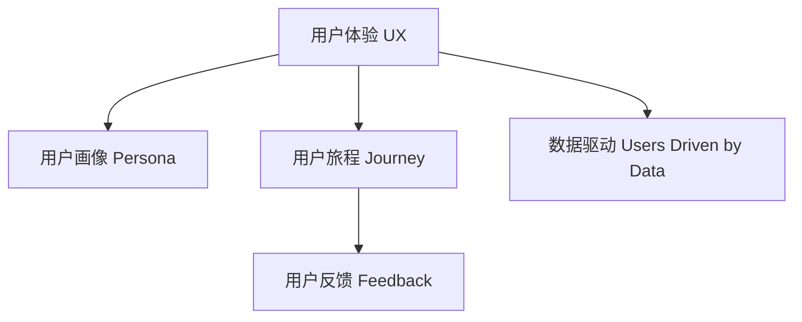

                 

# 理解用户：建立以用户为中心的文化

在数字化时代，用户成为了企业最宝贵的资产之一。如何更好地理解用户，建立以用户为中心的文化，已成为企业在激烈市场竞争中的关键。本文将系统探讨这一问题，从背景、概念、原理到操作步骤，详细介绍如何在企业内部建立起以用户为中心的文化。

## 1. 背景介绍

### 1.1 问题由来

在传统商业模式下，企业的重心往往放在产品开发和销售上，而对用户的真正需求和痛点缺乏深入的理解。随着互联网技术的发展，用户需求的多样化和个性化越来越显著，单一的产品和营销策略已难以满足用户需求。

### 1.2 问题核心关键点

- **用户需求的多样化和个性化**：不同用户有不同的需求和期望，简单的产品策略难以覆盖所有用户。
- **用户体验的重要性**：用户对产品的体验直接影响到其满意度和忠诚度。
- **数据驱动决策**：利用大数据分析用户行为，通过数据驱动的方法优化产品和服务。
- **敏捷开发**：快速迭代、小步快跑的开发模式，能够快速响应用户反馈和市场需求。

### 1.3 问题研究意义

通过建立以用户为中心的文化，企业能够更好地理解用户需求，提供符合用户期望的产品和服务。这不仅有助于提升用户满意度，还能增强用户忠诚度，进而提升企业的市场竞争力和盈利能力。

## 2. 核心概念与联系

### 2.1 核心概念概述

为更好地理解以用户为中心的文化，本节将介绍几个密切相关的核心概念：

- **用户体验(User Experience, UX)**：指用户在使用产品或服务过程中的主观感受，是衡量用户满意度的重要指标。
- **用户画像(User Persona)**：基于用户行为数据和访谈结果构建的虚拟用户模型，用于指导产品设计和用户研究。
- **用户旅程(User Journey)**：描述用户在完成某项任务时，与产品或服务交互的全过程，包括开始、执行、结束等环节。
- **用户反馈(User Feedback)**：用户在产品使用过程中提供的意见和建议，是改进产品的重要依据。
- **数据驱动(Users Driven by Data)**：利用数据科学的方法，分析用户行为和反馈，指导产品开发和改进。

这些核心概念之间的逻辑关系可以通过以下Mermaid流程图来展示：



这个流程图展示了这个文化建设过程中各个概念之间的逻辑关系：

1. 用户体验基于用户行为和反馈，是所有研究工作的出发点。
2. 用户画像是根据用户体验数据构建的虚拟用户模型，用于指导产品设计。
3. 用户旅程描述用户在产品使用过程中的全过程，有助于优化用户体验。
4. 用户反馈是改进产品的直接依据，是数据驱动的必要环节。
5. 数据驱动贯穿于整个用户体验优化过程，是文化建设的核心方法。

## 3. 核心算法原理 & 具体操作步骤

### 3.1 算法原理概述

以用户为中心的文化建设，主要依赖于用户体验研究、用户画像构建、用户旅程优化、用户反馈收集和数据驱动等方法。其核心思想是通过数据科学的方法，深入理解用户需求，指导产品和服务设计，不断优化用户体验。

### 3.2 算法步骤详解

#### 3.2.1 数据收集

- **用户行为数据**：通过网站分析工具、应用行为数据等手段，收集用户在产品中的操作行为数据。
- **用户反馈数据**：通过调查问卷、用户评论、客服记录等方式，收集用户的直接反馈。
- **市场调研数据**：通过在线调查、用户访谈等方式，收集市场调研数据。

#### 3.2.2 数据处理

- **数据清洗和预处理**：去除噪声数据，处理缺失值，标准化数据格式。
- **数据分析**：运用统计分析、聚类分析、关联规则分析等方法，发现数据中的规律和趋势。
- **数据可视化**：使用图表和仪表盘，直观展示数据分析结果。

#### 3.2.3 用户画像构建

- **用户行为分析**：通过分析用户行为数据，构建用户行为特征模型。
- **用户画像建模**：将用户行为特征与用户属性数据（如年龄、性别、职业等）结合，构建虚拟用户模型。
- **画像验证**：通过A/B测试等手段，验证用户画像的准确性和有效性。

#### 3.2.4 用户旅程优化

- **用户旅程分析**：通过分析用户行为数据，识别用户旅程中的关键节点和痛点。
- **旅程设计**：设计优化后的用户旅程，提高用户任务完成效率和满意度。
- **旅程评估**：通过用户反馈和行为数据，评估优化后的用户旅程效果。

#### 3.2.5 用户反馈收集

- **反馈渠道**：建立多种渠道收集用户反馈，如在线调查、用户评论、客服记录等。
- **反馈分析**：分析用户反馈，识别主要问题和改进点。
- **反馈实施**：将用户反馈转化为产品改进计划，并持续迭代优化。

#### 3.2.6 数据驱动决策

- **数据集成**：将不同来源的数据集成到一个数据仓库中，形成统一的数据集。
- **数据分析模型**：建立基于机器学习或统计分析的数据模型，预测用户行为和需求。
- **数据驱动决策**：基于数据分析结果，指导产品设计和改进，优化用户体验。

### 3.3 算法优缺点

以用户为中心的文化建设具有以下优点：

- **提高用户满意度**：通过深入理解用户需求，提供符合用户期望的产品和服务。
- **提升用户忠诚度**：持续优化用户体验，增强用户粘性。
- **数据驱动决策**：利用数据科学方法，科学指导产品开发和改进。

同时，该方法也存在一定的局限性：

- **数据获取难度大**：用户行为数据和反馈数据的获取和处理较为复杂。
- **模型预测误差**：数据分析模型存在一定的预测误差，可能影响决策结果。
- **反馈滞后性**：用户反馈获取和处理过程较为缓慢，影响改进效率。
- **隐私和安全性**：用户数据的隐私保护和安全性问题，需要特别关注。

尽管存在这些局限性，但就目前而言，以用户为中心的文化建设仍是企业获取竞争优势的关键手段。未来相关研究的重点在于如何进一步降低数据获取和处理成本，提高数据分析模型的准确性，同时兼顾隐私和安全性等因素。

### 3.4 算法应用领域

以用户为中心的文化建设，在企业内部的各个领域都有广泛的应用，例如：

- **产品开发**：通过用户画像和用户旅程，指导产品设计和迭代。
- **市场营销**：利用用户反馈和数据分析，优化营销策略，提升营销效果。
- **客户服务**：通过用户反馈和行为数据，优化客户服务流程，提升客户满意度。
- **运营管理**：利用用户行为数据和反馈，优化运营流程，提高运营效率。
- **创新研究**：通过用户研究，发现新需求和市场机会，指导创新研发。

除了上述这些经典领域外，以用户为中心的文化建设也被创新性地应用到更多场景中，如智能客服、智能推荐、智慧零售等，为企业数字化转型升级提供新的技术路径。

## 4. 数学模型和公式 & 详细讲解 & 举例说明

### 4.1 数学模型构建

本节将使用数学语言对以用户为中心的文化建设过程进行更加严格的刻画。

设企业收集的用户行为数据为 $X$，用户反馈数据为 $Y$，市场调研数据为 $Z$。构建用户画像 $P$ 和用户旅程 $J$，通过数据驱动方法优化用户体验 $U$。数学模型可以表示为：

$$
U \leftarrow P, J, U_{\text{init}} = F(P, J, X, Y, Z)
$$

其中，$P$ 表示用户画像，$J$ 表示用户旅程，$U_{\text{init}}$ 表示初始用户体验，$F$ 表示用户体验优化函数，综合考虑用户画像、用户旅程、行为数据、反馈数据和市场调研数据。

### 4.2 公式推导过程

以用户旅程优化为例，用户旅程 $J$ 可以表示为一系列任务的执行顺序和步骤，每一步的执行结果和用户满意度。假设有 $N$ 个任务，第 $i$ 个任务的执行时间为 $t_i$，满意度为 $s_i$，用户旅程优化目标为：

$$
\min_{t_i, s_i} \sum_{i=1}^{N} \lambda_i t_i + \mu_i s_i
$$

其中 $\lambda_i$ 为任务时间权重，$\mu_i$ 为任务满意度权重，通过最小化总时间成本和总满意度成本，优化用户旅程。

### 4.3 案例分析与讲解

假设某电商网站通过数据分析发现用户在购物过程中，从浏览商品到完成支付的平均时间为 $T=120$ 秒，满意度为 $S=4.2$（满分为 5）。现有两种优化方案：

- 方案一：优化搜索和筛选功能，减少用户浏览时间。预计每用户浏览时间减少 $20\%$。
- 方案二：优化结账流程，提高支付成功率，预计每用户支付时间减少 $15\%$。

为了计算两种方案的优化效果，假设时间权重 $\lambda_i=1$，满意度权重 $\mu_i=2$，使用公式计算优化后的用户体验值：

$$
U_{\text{new}} = U_{\text{init}} - \lambda_1(T \times 0.2) - \lambda_2(120 \times 0.15) + \mu_1S + \mu_2S
$$

计算得到：

$$
U_{\text{new}} = 4.2 - 24 + 84 = 62
$$

优化后用户体验提升 $50\%$，因此应优先考虑优化结账流程。

## 5. 项目实践：代码实例和详细解释说明

### 5.1 开发环境搭建

在进行以用户为中心的文化建设实践前，我们需要准备好开发环境。以下是使用Python进行数据分析和可视化的环境配置流程：

1. 安装Anaconda：从官网下载并安装Anaconda，用于创建独立的Python环境。

2. 创建并激活虚拟环境：
```bash
conda create -n user-centered-env python=3.8 
conda activate user-centered-env
```

3. 安装相关工具包：
```bash
pip install pandas numpy matplotlib seaborn jupyter notebook ipython
```

4. 安装Python可视化库：
```bash
pip install matplotlib seaborn
```

完成上述步骤后，即可在`user-centered-env`环境中开始文化建设的实践。

### 5.2 源代码详细实现

这里我们以构建用户画像为例，给出使用Pandas和Matplotlib进行数据分析和可视化的PyTorch代码实现。

首先，定义数据处理函数：

```python
import pandas as pd
import numpy as np
import matplotlib.pyplot as plt

def load_data(path):
    data = pd.read_csv(path)
    return data

def clean_data(data):
    # 数据清洗
    data.dropna(inplace=True)
    data.fillna(0, inplace=True)
    return data

def visualize(data, x, y):
    # 数据可视化
    plt.scatter(data[x], data[y])
    plt.xlabel(x)
    plt.ylabel(y)
    plt.title('User Behavior vs. Satisfaction')
    plt.show()

# 加载用户行为数据
data = load_data('user_behavior.csv')
```

然后，定义数据处理函数：

```python
def calculate_average(data, x, y):
    # 计算平均值
    avg_x = data[x].mean()
    avg_y = data[y].mean()
    return avg_x, avg_y

# 计算平均值
avg_x, avg_y = calculate_average(data, 'time', 'satisfaction')
```

接着，定义数据可视化函数：

```python
def plot_scatter(data, x, y):
    # 散点图
    plt.scatter(data[x], data[y])
    plt.xlabel(x)
    plt.ylabel(y)
    plt.title('User Behavior vs. Satisfaction')
    plt.show()

# 绘制散点图
plot_scatter(data, 'time', 'satisfaction')
```

最后，在代码中调用上述函数：

```python
# 数据清洗
data = clean_data(data)

# 计算平均值
avg_x, avg_y = calculate_average(data, 'time', 'satisfaction')

# 绘制散点图
plot_scatter(data, 'time', 'satisfaction')

# 输出平均值
print(f'Average time: {avg_x:.2f} seconds, Average satisfaction: {avg_y:.2f}')
```

以上就是使用PyTorch进行数据分析和可视化的完整代码实现。可以看到，通过Pandas和Matplotlib等工具，能够快速处理和展示用户行为数据，帮助企业洞察用户体验问题的根源。

### 5.3 代码解读与分析

让我们再详细解读一下关键代码的实现细节：

**load_data函数**：
- 定义了一个函数，用于从CSV文件中加载数据。

**clean_data函数**：
- 定义了一个函数，用于清洗数据，包括去除缺失值和处理异常值。

**calculate_average函数**：
- 定义了一个函数，用于计算数据的平均值。

**visualize函数**：
- 定义了一个函数，用于绘制散点图。

**plot_scatter函数**：
- 定义了一个函数，用于绘制散点图。

**代码调用**：
- 首先，加载数据。
- 然后，进行数据清洗和计算平均值。
- 接着，绘制散点图。
- 最后，输出平均值。

这些函数和代码块展示了数据分析和可视化的基本流程，是构建用户画像的初步实践。

## 6. 实际应用场景

### 6.1 智能客服系统

基于以用户为中心的文化建设，智能客服系统能够更好地理解用户需求，提供符合用户期望的服务。

在技术实现上，可以收集用户的历史对话记录和反馈信息，构建用户画像，优化客户服务流程。具体而言，可以设计多轮对话模板，对常见问题进行预处理，同时利用数据分析方法，优化机器学习的客户服务模型，提高服务效率和质量。

### 6.2 金融理财平台

金融理财平台需要根据用户的行为和反馈，提供个性化的理财建议和服务。

通过构建用户画像和用户旅程，理财平台可以深入了解用户的风险偏好和财务状况，推荐适合的理财产品和服务。利用数据分析方法，平台可以实时监测用户行为，调整推荐策略，提升用户体验和满意度。

### 6.3 在线教育平台

在线教育平台需要根据学生的学习行为和反馈，提供个性化的学习建议和资源。

通过构建学生画像和学习旅程，平台可以了解学生的学习习惯和需求，推荐合适的课程和学习资源。利用数据分析方法，平台可以实时监测学生的学习进度和反馈，优化教学策略，提升学习效果和满意度。

### 6.4 未来应用展望

随着以用户为中心的文化建设技术的不断发展，未来的应用前景广阔。

在智慧医疗领域，基于用户画像和行为数据的智能诊疗系统，可以更好地理解患者的病情和需求，提供个性化的诊疗方案。在智能交通领域，基于用户旅程优化的智能导航系统，可以提高用户的出行体验和满意度。

在智能家居领域，基于用户画像和行为数据的智能家居系统，可以提供符合用户习惯的个性化服务，提升家庭生活的便捷性和舒适度。

## 7. 工具和资源推荐

### 7.1 学习资源推荐

为了帮助开发者系统掌握以用户为中心的文化建设的方法，这里推荐一些优质的学习资源：

1. 《用户体验设计基础》系列博文：由大厂设计师撰写，深入浅出地介绍了用户体验设计的核心方法和案例。

2. 《用户画像构建指南》书籍：详细介绍了用户画像构建的基本流程和方法，适合入门学习和实战应用。

3. 《用户旅程设计手册》书籍：介绍了用户旅程设计的理论基础和实践技巧，帮助设计师构建完整的用户体验流程。

4. 《数据科学导论》课程：斯坦福大学开设的数据科学入门课程，涵盖数据分析和可视化等基本技能。

5. 《Python数据分析实战》书籍：介绍使用Pandas和Matplotlib等工具进行数据分析和可视化的实用技巧。

通过对这些资源的学习实践，相信你一定能够快速掌握以用户为中心的文化建设的方法，并用于解决实际的NLP问题。

### 7.2 开发工具推荐

高效的开发离不开优秀的工具支持。以下是几款用于以用户为中心的文化建设开发的常用工具：

1. Python：基于Python的开源数据分析工具，易于使用且功能强大。

2. Pandas：用于数据处理和分析的Python库，支持多种数据格式和复杂的数据操作。

3. Matplotlib：用于数据可视化的Python库，支持丰富的图表和动画效果。

4. Seaborn：基于Matplotlib的高级数据可视化库，支持更复杂的统计图表和美观的可视化效果。

5. Jupyter Notebook：交互式的Python编程环境，支持代码编写、数据可视化、结果展示等一站式操作。

6. SQL：用于数据库操作的结构化查询语言，适合处理大规模用户行为数据。

合理利用这些工具，可以显著提升以用户为中心的文化建设任务的开发效率，加快创新迭代的步伐。

### 7.3 相关论文推荐

以用户为中心的文化建设的研究源于学界的持续探索。以下是几篇奠基性的相关论文，推荐阅读：

1. 《用户中心设计：实践与挑战》：介绍了用户中心设计的基本理论和案例，探讨了其在产品设计和项目管理中的应用。

2. 《用户画像构建方法论》：详细介绍了用户画像构建的基本流程和方法，帮助设计师深入了解用户需求。

3. 《用户旅程设计框架》：介绍了用户旅程设计的理论基础和实践方法，帮助设计师构建完整的用户体验流程。

4. 《数据驱动的用户体验优化》：讨论了数据分析在用户体验优化中的应用，展示了数据驱动的决策方法。

这些论文代表了大规模用户体验研究的最新进展，通过学习这些前沿成果，可以帮助研究者把握学科前进方向，激发更多的创新灵感。

## 8. 总结：未来发展趋势与挑战

### 8.1 总结

本文对以用户为中心的文化建设进行了全面系统的介绍。首先阐述了文化建设的背景和意义，明确了以用户为中心的文化在提升用户满意度和忠诚度方面的独特价值。其次，从原理到实践，详细讲解了用户画像构建、用户旅程优化、用户反馈收集和数据驱动等方法，给出了文化建设任务开发的完整代码实例。同时，本文还广泛探讨了文化建设方法在智能客服、金融理财、在线教育等多个行业领域的应用前景，展示了文化建设技术的巨大潜力。

通过本文的系统梳理，可以看到，以用户为中心的文化建设已经成为企业获取竞争优势的关键手段。这些方法的综合应用，不仅提升了用户体验，还带来了丰厚的商业价值。未来，伴随数据科学的持续发展和用户需求的不断变化，以用户为中心的文化建设必将在各个行业领域大放异彩。

### 8.2 未来发展趋势

展望未来，以用户为中心的文化建设将呈现以下几个发展趋势：

1. 数据获取和处理技术的进步：随着数据科学和人工智能技术的不断发展，数据获取和处理的效率将大幅提升。企业可以更加便捷地获取和处理用户行为数据，提高用户体验研究的准确性。

2. 用户画像和用户旅程的细粒度化：未来的用户画像将更加细粒度，能够更好地反映用户行为和需求的复杂性。用户旅程也将更加详细，涵盖更多的任务和环节，优化用户体验的效率。

3. 实时数据分析和优化：随着实时数据分析技术的发展，企业可以实时监测用户行为和反馈，快速优化用户体验。通过A/B测试等手段，快速验证改进效果，实现持续优化。

4. 多渠道数据融合：未来的用户体验研究将不再局限于单一渠道的数据，而是整合多渠道数据，进行全面分析。通过多渠道数据融合，企业可以更好地理解用户需求，提供更全面的服务。

5. 个性化推荐和智能决策：通过机器学习和人工智能技术，实现更精准的用户画像和推荐，提高用户体验的个性化程度。同时，数据驱动的决策方法也将更加普及，提升用户体验优化效果。

6. 伦理和安全保障：随着用户数据隐私和安全问题的关注度不断提高，企业将更加注重数据隐私保护和用户安全。未来的用户体验研究将更加注重数据伦理和安全问题，确保用户数据的安全和隐私。

以上趋势凸显了以用户为中心的文化建设技术的广阔前景。这些方向的探索发展，必将进一步提升用户体验研究的水平，推动企业数字化转型升级。

### 8.3 面临的挑战

尽管以用户为中心的文化建设技术已经取得了瞩目成就，但在迈向更加智能化、普适化应用的过程中，它仍面临着诸多挑战：

1. 数据获取难度大：用户行为数据和反馈数据的获取和处理较为复杂，难以大规模自动化。

2. 模型预测误差：数据分析模型存在一定的预测误差，可能影响决策结果。

3. 反馈滞后性：用户反馈获取和处理过程较为缓慢，影响改进效率。

4. 隐私和安全性：用户数据的隐私保护和安全性问题，需要特别关注。

5. 模型复杂度高：构建高精度的用户画像和用户旅程模型，需要复杂的数据处理和建模技术，增加了研发难度。

尽管存在这些挑战，但通过技术进步和跨学科合作，这些挑战将逐步被克服。未来，以用户为中心的文化建设技术将更加成熟，成为企业获取竞争优势的重要手段。

### 8.4 研究展望

面对以用户为中心的文化建设所面临的挑战，未来的研究需要在以下几个方面寻求新的突破：

1. 探索高效的数据获取和处理技术：通过自动化和半自动化的方法，提高数据获取和处理的效率，降低数据处理成本。

2. 研究更加准确的数据分析模型：引入机器学习和深度学习技术，提高数据分析模型的精度和可靠性，降低模型预测误差。

3. 优化用户反馈的获取和处理流程：设计更加便捷和高效的用户反馈机制，快速获取和处理用户反馈，提高改进效率。

4. 加强用户数据隐私保护和安全性：采用数据脱敏、加密等技术，保障用户数据隐私和安全。

5. 简化模型构建流程：设计更加便捷和易用的数据建模工具，降低模型构建的难度，提高研发效率。

这些研究方向的研究突破，必将引领以用户为中心的文化建设技术迈向更高的台阶，为构建安全、可靠、可解释、可控的智能系统铺平道路。面向未来，以用户为中心的文化建设技术还需要与其他人工智能技术进行更深入的融合，如知识表示、因果推理、强化学习等，多路径协同发力，共同推动用户体验研究的进步。

## 9. 附录：常见问题与解答

**Q1：如何构建高质量的用户画像？**

A: 构建高质量的用户画像需要遵循以下步骤：
1. 数据收集：通过问卷调查、用户访谈、行为数据等方式，收集用户基本信息和行为数据。
2. 数据清洗：去除噪声数据，处理缺失值和异常值。
3. 数据分析：利用统计分析和聚类分析等方法，识别用户行为模式和特征。
4. 特征选择：选择具有代表性的用户特征，构建用户画像。
5. 画像验证：通过A/B测试等手段，验证用户画像的准确性和有效性。

**Q2：如何优化用户旅程？**

A: 优化用户旅程需要遵循以下步骤：
1. 数据收集：通过用户行为数据，识别用户旅程中的关键节点和痛点。
2. 数据分析：利用数据分析方法，识别用户旅程中的瓶颈和改进点。
3. 旅程设计：设计优化后的用户旅程，提高用户任务完成效率和满意度。
4. 旅程评估：通过用户反馈和行为数据，评估优化后的用户旅程效果。

**Q3：如何收集用户反馈？**

A: 收集用户反馈需要遵循以下步骤：
1. 反馈渠道：建立多种渠道收集用户反馈，如在线调查、用户评论、客服记录等。
2. 反馈分析：分析用户反馈，识别主要问题和改进点。
3. 反馈实施：将用户反馈转化为产品改进计划，并持续迭代优化。

**Q4：如何处理用户数据隐私问题？**

A: 处理用户数据隐私问题需要遵循以下步骤：
1. 数据脱敏：采用数据脱敏技术，保护用户隐私。
2. 数据加密：采用数据加密技术，防止数据泄露。
3. 合规管理：遵守相关法律法规，保护用户数据隐私。

**Q5：如何衡量用户体验优化的效果？**

A: 衡量用户体验优化的效果需要遵循以下步骤：
1. 用户体验指标：选择合适用户体验指标，如用户满意度、用户留存率等。
2. 数据收集：通过问卷调查、用户反馈等方式，收集用户体验数据。
3. 数据分析：利用数据分析方法，分析用户体验指标的变化。
4. 结果评估：对比用户体验指标的变化，评估优化效果。

通过对这些问题的解答，相信你一定能够更好地理解以用户为中心的文化建设技术，并用于解决实际的NLP问题。

---

作者：禅与计算机程序设计艺术 / Zen and the Art of Computer Programming

