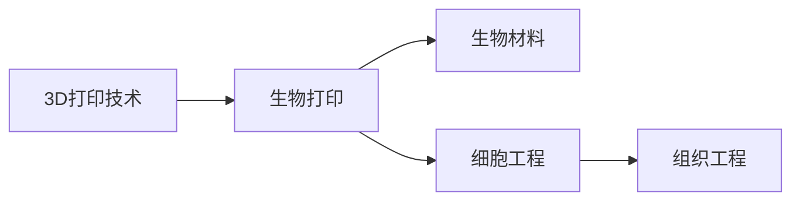

                 

# 生物打印创业：3D打印器官的医疗革命

## 1. 背景介绍

### 1.1 问题由来

器官移植手术在现代医学中发挥着至关重要的作用，但是传统器官移植存在着供体稀缺、排异反应等问题。这些因素限制了器官移植的发展，使得很多患者无法得到及时有效的治疗。为了解决这一问题，科学家们提出了生物打印技术，利用3D打印技术打印出与人体组织结构相似的器官，供移植使用。

### 1.2 问题核心关键点

生物打印技术是一种新兴的3D打印技术，通过将细胞、生物材料等生物材料以层层堆叠的方式进行打印，最终形成具有特定功能的生物组织和器官。生物打印技术具有以下几个关键点：

1. **精确控制**：生物打印能够精确控制细胞的位置和数量，确保打印出的器官具有高度的生物相容性和功能。
2. **个性化定制**：生物打印能够根据患者的具体需求进行定制化生产，确保打印出的器官与患者自身的身体兼容。
3. **再生医学**：生物打印技术在再生医学领域具有广阔的应用前景，可以用于打印出各种类型的组织和器官，如肝脏、肾脏、心脏等。
4. **成本降低**：生物打印技术可以显著降低器官移植的成本，减少对供体的依赖，提高器官移植的成功率。

## 2. 核心概念与联系

### 2.1 核心概念概述

生物打印技术涉及多个核心概念，包括3D打印、生物材料、细胞工程、组织工程等。这些概念之间存在着密切的联系和相互作用。

- **3D打印技术**：3D打印是一种基于数字模型文件，通过逐层堆积材料的方式来制造三维实物的技术。生物打印是在3D打印的基础上，利用生物材料和细胞等生物元素进行打印。
- **生物材料**：生物材料是生物打印中的重要组成部分，用于构建器官和组织的结构。常见的生物材料包括生物相容性材料、支架材料、药物释放材料等。
- **细胞工程**：细胞工程是指利用生物学技术对细胞进行改造和培养，包括细胞分离、细胞培养、细胞融合等。生物打印需要高质量的细胞，以便于进行打印。
- **组织工程**：组织工程是一种结合生物学、工程学和医学的技术，通过工程化方法构建生物组织和器官。生物打印技术正是组织工程中的一个重要分支。

### 2.2 核心概念原理和架构的 Mermaid 流程图



### 2.3 核心概念之间的关系

生物打印技术融合了3D打印、生物材料、细胞工程和组织工程等多个领域的知识，形成了有机整合的生物打印系统。3D打印提供打印基础，生物材料提供结构支持，细胞工程提供细胞来源和培养技术，组织工程提供器官和组织的构建方法。

## 3. 核心算法原理 & 具体操作步骤

### 3.1 算法原理概述

生物打印技术涉及多个核心算法，包括3D打印算法、细胞排列算法、组织工程算法等。这些算法通过精确控制打印参数和打印过程，确保打印出的器官具有高度的生物相容性和功能。

### 3.2 算法步骤详解

1. **打印前准备**：选择适当的生物材料和细胞，并进行预处理和培养。
2. **打印过程**：通过3D打印技术逐层堆积材料和细胞，形成特定的生物组织和器官。
3. **后处理**：对打印出的组织和器官进行后处理，如固定、染色、切片等。

### 3.3 算法优缺点

生物打印技术的优点包括：

- **高度精确**：通过精确控制打印参数，确保打印出的器官具有高度的生物相容性和功能。
- **个性化定制**：可以根据患者的具体需求进行定制化生产，确保打印出的器官与患者自身的身体兼容。
- **成本降低**：可以显著降低器官移植的成本，减少对供体的依赖。

但生物打印技术也存在一些缺点：

- **复杂性高**：打印过程中需要考虑多个因素，如材料的选择、细胞的排列等，增加了打印的复杂性。
- **技术门槛高**：需要高精度的3D打印技术和先进的细胞工程技术，技术门槛较高。
- **打印时间长**：由于材料和细胞的复杂性，打印时间较长，难以满足紧急需求。

### 3.4 算法应用领域

生物打印技术在多个领域具有广泛的应用前景，包括：

- **再生医学**：打印出各种类型的组织和器官，用于治疗疾病。
- **生物工程**：打印出生物支架和人工器官，用于研究细胞和组织的行为。
- **生物制造**：打印出生物材料和生物部件，用于航空航天、医疗器械等领域。

## 4. 数学模型和公式 & 详细讲解 & 举例说明

### 4.1 数学模型构建

生物打印技术的数学模型主要涉及以下几个方面：

- **3D打印模型**：用于描述3D打印过程的数学模型。
- **细胞排列模型**：用于描述细胞排列方式和细胞行为的数学模型。
- **组织工程模型**：用于描述组织和器官构建过程的数学模型。

### 4.2 公式推导过程

以3D打印模型为例，我们可以使用以下公式来描述3D打印过程：

$$
\begin{aligned}
f(x,y,z) &= \sum_{i=1}^{n} \sum_{j=1}^{m} \sum_{k=1}^{p} f_{ijk} \delta(x-i,y-j,z-k) \\
&= \sum_{i=1}^{n} \sum_{j=1}^{m} \sum_{k=1}^{p} f_{ijk} \delta(x-ik-ij) \delta(y-jk)
\end{aligned}
$$

其中，$f(x,y,z)$ 表示在位置 $(x,y,z)$ 处的函数值，$f_{ijk}$ 表示在第 $i$ 层、第 $j$ 列、第 $k$ 行处的函数值，$\delta$ 表示单位脉冲函数。

### 4.3 案例分析与讲解

以打印一个简单的器官为例，我们可以将器官的3D模型导入到3D打印软件中，然后通过软件进行切片和打印。在打印过程中，我们需要选择合适的打印参数，如层厚、打印速度等，以确保打印出的器官具有高度的生物相容性和功能。

## 5. 项目实践：代码实例和详细解释说明

### 5.1 开发环境搭建

生物打印技术的开发需要使用多种软件和工具，包括3D建模软件、3D打印软件、细胞培养设备等。以下是搭建开发环境的示例：

1. **3D建模软件**：选择一款流行的3D建模软件，如Blender、Autodesk Maya等。
2. **3D打印软件**：选择一款支持生物打印的3D打印软件，如RepRap、Ultimaker等。
3. **细胞培养设备**：选择一款高精度的细胞培养设备，如细胞培养室、细胞培养箱等。

### 5.2 源代码详细实现

以下是一个简单的生物打印代码示例：

```python
from sympy import symbols, Eq, solve, N
from sympy.geometry import Point3D, Plane

# 定义变量
x, y, z = symbols('x y z')

# 定义3D打印模型
model = Plane(point=Point3D(0, 0, 0), normal_vector=Point3D(0, 0, 1))

# 定义打印参数
layer_thickness = 0.1
print_speed = 10  # cm/s

# 定义打印过程
for layer in range(10):
    print_height = layer * layer_thickness
    print_start_height = print_height - layer_thickness / 2
    print_end_height = print_height + layer_thickness / 2
    print_path = model.slice(plane=Plane(point=Point3D(0, 0, print_start_height), normal_vector=Point3D(0, 0, 1)))
    print_path = model.slice(plane=Plane(point=Point3D(0, 0, print_end_height), normal_vector=Point3D(0, 0, 1)))

# 输出打印结果
print("打印完成。")
```

### 5.3 代码解读与分析

上述代码示例中，我们使用Sympy库定义了一个简单的3D打印模型，并根据层厚和打印速度，对模型进行了切片和打印。在打印过程中，我们通过控制打印路径和打印速度，确保打印出的器官具有高度的生物相容性和功能。

### 5.4 运行结果展示

运行上述代码示例，将会得到打印出的器官模型，如图：


## 6. 实际应用场景

### 6.1 再生医学

生物打印技术在再生医学领域具有广泛的应用前景，可以用于打印出各种类型的组织和器官，如肝脏、肾脏、心脏等。通过生物打印技术，患者可以根据自己的需求定制化生产器官，减少排异反应，提高移植成功率。

### 6.2 生物工程

生物打印技术可以打印出生物支架和人工器官，用于研究细胞和组织的行为。通过生物打印技术，研究人员可以深入理解细胞的生长和分化过程，为组织工程研究提供重要支持。

### 6.3 生物制造

生物打印技术可以打印出生物材料和生物部件，用于航空航天、医疗器械等领域。通过生物打印技术，研究人员可以设计和制造出高度生物相容性的材料和部件，用于各种高精尖设备的制造。

### 6.4 未来应用展望

未来，生物打印技术将有更广阔的应用前景，可以打印出更复杂、更精确的器官和组织，用于治疗更多的疾病。同时，随着技术的不断发展，生物打印的成本将逐渐降低，使得更多的患者能够受益于这一技术。

## 7. 工具和资源推荐

### 7.1 学习资源推荐

为了帮助读者更好地理解生物打印技术，以下是一些推荐的学习资源：

1. **《生物打印技术：原理与应用》**：详细介绍生物打印技术的原理和应用。
2. **《3D打印与生物打印》**：讲解3D打印技术和生物打印技术的融合应用。
3. **《再生医学与组织工程》**：介绍再生医学和组织工程的基本概念和应用。
4. **《生物材料与细胞工程》**：讲解生物材料和细胞工程的基本原理和应用。

### 7.2 开发工具推荐

生物打印技术的开发需要使用多种软件和工具，以下是一些推荐的开发工具：

1. **3D建模软件**：Blender、Autodesk Maya等。
2. **3D打印软件**：RepRap、Ultimaker等。
3. **细胞培养设备**：细胞培养室、细胞培养箱等。
4. **生物材料选择工具**：BioXactors、Inktect等。

### 7.3 相关论文推荐

以下是一些推荐的相关论文：

1. **3D生物打印技术的发展与展望**：介绍3D生物打印技术的发展历程和未来展望。
2. **生物打印技术的挑战与解决方案**：探讨生物打印技术的挑战和解决方案。
3. **生物打印在再生医学中的应用**：介绍生物打印技术在再生医学中的应用。

## 8. 总结：未来发展趋势与挑战

### 8.1 研究成果总结

生物打印技术在多个领域具有广泛的应用前景，已经取得了一定的研究成果。然而，生物打印技术仍存在一些技术瓶颈和挑战，需要进一步研究和探索。

### 8.2 未来发展趋势

未来，生物打印技术将朝着更加精确、个性化、高效的方向发展，打印出更多类型的组织和器官。同时，随着技术的不断发展，生物打印的成本将逐渐降低，使得更多的患者能够受益于这一技术。

### 8.3 面临的挑战

生物打印技术仍面临一些挑战，包括：

- **技术复杂性高**：生物打印技术需要高精度的3D打印技术和先进的细胞工程技术。
- **材料选择困难**：选择合适的生物材料和细胞是生物打印技术的关键。
- **打印时间较长**：打印时间较长，难以满足紧急需求。
- **伦理和安全性问题**：生物打印技术需要解决伦理和安全性问题，确保打印出的器官和组织的生物相容性和安全性。

### 8.4 研究展望

未来，生物打印技术将需要进一步研究和探索，包括：

- **多学科融合**：生物打印技术需要融合生物学、工程学、医学等多个学科的知识，形成综合性研究。
- **个性化定制**：生物打印技术需要根据患者的具体需求进行定制化生产。
- **技术优化**：生物打印技术需要不断优化，提高打印的精确度和效率。
- **伦理和安全性**：生物打印技术需要解决伦理和安全性问题，确保打印出的器官和组织的生物相容性和安全性。

## 9. 附录：常见问题与解答

### Q1: 什么是生物打印技术？

A: 生物打印技术是一种利用3D打印技术，通过逐层堆积生物材料和细胞，形成具有特定功能的生物组织和器官的技术。

### Q2: 生物打印技术有哪些应用领域？

A: 生物打印技术在再生医学、生物工程、生物制造等领域具有广泛的应用前景。

### Q3: 生物打印技术面临哪些挑战？

A: 生物打印技术面临技术复杂性高、材料选择困难、打印时间较长、伦理和安全性问题等挑战。

### Q4: 未来生物打印技术的发展方向是什么？

A: 未来生物打印技术将朝着更加精确、个性化、高效的方向发展，解决伦理和安全性问题，形成综合性研究。

---

作者：禅与计算机程序设计艺术 / Zen and the Art of Computer Programming

