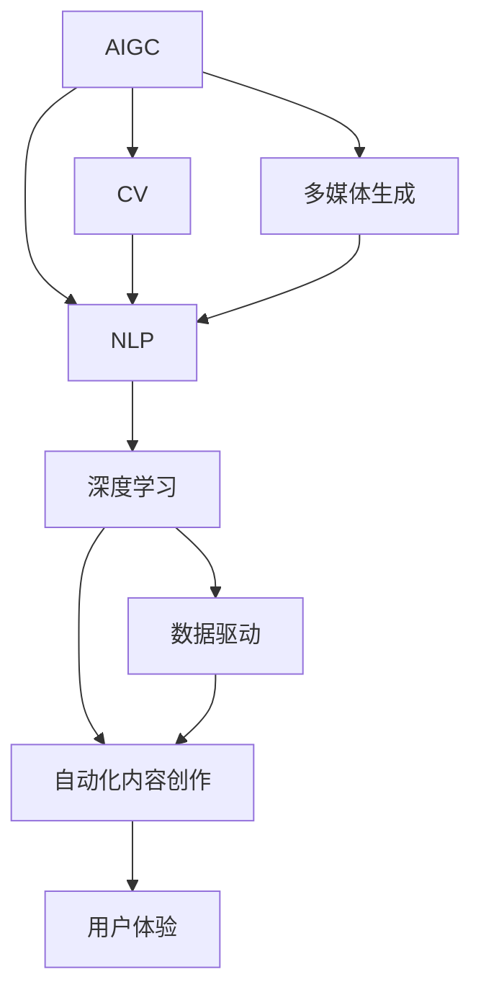

                 

# 用户对AIGC的使用现状

> 关键词：人工智能生成内容(AIGC), 自然语言处理(NLP), 计算机视觉(CV), 多媒体生成, 深度学习, 数据驱动, 自动化内容创作, 用户体验

## 1. 背景介绍

随着人工智能技术的迅猛发展，人工智能生成内容(AIGC)已逐渐从科研实验走向商业应用。通过深度学习和模型驱动的方法，AIGC技术在图像生成、文本创作、视频制作等领域取得了显著的进展，为人们的生活、工作和娱乐提供了丰富的新体验。

AIGC的兴起源于深度学习技术的突破和海量数据的积累。以GPT-4、DALL·E2、Imagen等知名模型为例，它们在预训练和微调过程中分别使用了数十亿乃至数千亿条数据，极大地提升了模型的泛化能力和生成质量。这些模型在自然语言处理(NLP)、计算机视觉(CV)和多媒体生成等方面展现出了强大的能力，为内容生成带来了前所未有的高效性和创造性。

用户对AIGC的接受度在不断提升。许多用户已经体验到AIGC在各个领域的优势，从文本生成、图片创作到视频制作，用户对AIGC的期待和接受度都在提高。随着AIGC技术在各行业的深入应用，它将进一步影响和改变人们的生活和工作方式。

## 2. 核心概念与联系

### 2.1 核心概念概述

为更好地理解AIGC的使用现状，本节将介绍几个密切相关的核心概念：

- **人工智能生成内容(AIGC)**：通过深度学习模型生成内容的技术，涵盖文本生成、图像生成、视频生成等多个领域。

- **自然语言处理(NLP)**：使用机器学习技术处理和理解人类语言，如文本生成、情感分析、机器翻译等。

- **计算机视觉(CV)**：使用机器学习技术识别、分类和生成视觉数据，如图像生成、目标检测、图像编辑等。

- **多媒体生成**：将多种媒体形式融合生成新的内容，如视频生成、交互式多媒体、虚拟现实等。

- **深度学习**：基于神经网络进行训练，提升模型复杂度，解决传统机器学习方法难以处理的问题。

- **数据驱动**：基于大规模数据训练模型，提升模型的泛化能力和生成质量。

- **自动化内容创作**：通过AIGC技术自动生成文本、图像、视频等内容，减少人工创作成本。

- **用户体验**：基于AIGC生成的内容对用户体验的影响，如自然度、真实感、互动性等。

这些核心概念之间的逻辑关系可以通过以下Mermaid流程图来展示：



这个流程图展示了大语言模型的核心概念及其之间的关系：

1. AIGC技术通过深度学习模型生成内容，可以应用于NLP、CV和多媒体生成等领域。
2. 深度学习提升了模型的复杂度和泛化能力。
3. 数据驱动通过海量数据训练模型，提升了生成内容的真实性和多样性。
4. 自动化内容创作利用AIGC技术自动生成内容，减少人工创作成本。
5. 用户体验关注AIGC内容对用户感知的影响，如自然度、真实感、互动性等。

## 3. 核心算法原理 & 具体操作步骤
### 3.1 算法原理概述

AIGC的核心算法原理基于深度学习模型的结构，通常采用Transformer模型或类似的结构，通过自监督预训练和下游任务微调进行内容生成。

形式化地，设预训练模型为 $M_{\theta}$，其中 $\theta$ 为预训练得到的模型参数。给定生成任务 $T$ 的训练集 $D=\{(x_i,y_i)\}_{i=1}^N$，AIGC的目标是找到新的模型参数 $\hat{\theta}$，使得模型能够生成高质量的 $y_i$。

微调的目标函数通常为：

$$
\hat{\theta}=\mathop{\arg\min}_{\theta} \mathcal{L}(M_{\theta},D)
$$

其中 $\mathcal{L}$ 为针对生成任务 $T$ 设计的损失函数，用于衡量模型生成的内容与真实标签之间的差异。常见的损失函数包括交叉熵损失、均方误差损失等。

### 3.2 算法步骤详解

AIGC的生成过程包括以下几个关键步骤：

**Step 1: 准备预训练模型和数据集**
- 选择合适的预训练语言模型 $M_{\theta}$ 作为初始化参数，如 GPT、DALL·E等。
- 准备生成任务 $T$ 的训练集 $D$，划分为训练集、验证集和测试集。一般要求训练数据与预训练数据的分布不要差异过大。

**Step 2: 定义生成模型**
- 根据生成任务类型，在预训练模型顶层设计合适的生成器或解码器，以生成任务标签。
- 对于文本生成，通常使用语言模型的解码器输出概率分布，并以负对数似然为损失函数。
- 对于图像生成，通常使用生成对抗网络(GAN)或变分自编码器(VAE)等模型生成图像。

**Step 3: 设置生成超参数**
- 选择合适的优化算法及其参数，如 AdamW、SGD 等，设置学习率、批大小、迭代轮数等。
- 设置正则化技术及强度，包括权重衰减、Dropout、Early Stopping 等。
- 确定冻结预训练参数的策略，如仅微调顶层，或全部参数都参与微调。

**Step 4: 执行生成训练**
- 将训练集数据分批次输入模型，前向传播计算损失函数。
- 反向传播计算参数梯度，根据设定的优化算法和学习率更新模型参数。
- 周期性在验证集上评估模型性能，根据性能指标决定是否触发 Early Stopping。
- 重复上述步骤直到满足预设的迭代轮数或 Early Stopping 条件。

**Step 5: 测试和部署**
- 在测试集上评估生成后模型 $M_{\hat{\theta}}$ 的性能，对比生成前后的质量提升。
- 使用生成后的模型对新样本进行推理预测，集成到实际的应用系统中。
- 持续收集新的数据，定期重新生成模型，以适应数据分布的变化。

以上是AIGC的生成流程。在实际应用中，还需要针对具体任务的特点，对生成过程的各个环节进行优化设计，如改进训练目标函数，引入更多的正则化技术，搜索最优的超参数组合等，以进一步提升生成内容的质量和多样性。

### 3.3 算法优缺点

AIGC技术在生成内容方面具有以下优点：
1. 高效性。利用深度学习模型，可以在短时间内生成大量高质量内容。
2. 创造性。深度学习模型具备强大的泛化能力，能够生成多样化的内容。
3. 灵活性。可以针对不同的生成任务进行微调，适应不同的需求。
4. 自动性。自动生成内容，减少人工创作的工作量。

同时，该技术也存在一定的局限性：
1. 依赖高质量数据。生成质量受训练数据质量的影响，高质量的数据集是生成高性能内容的基础。
2. 生成内容多样性。生成的内容可能存在重复和偏差，缺乏多样性。
3. 可解释性不足。生成的内容难以解释其内部逻辑和生成机制。
4. 隐私风险。生成的内容可能包含敏感信息，需要特别关注隐私保护。

尽管存在这些局限性，但就目前而言，AIGC技术仍是大规模内容生成的重要手段。未来相关研究的重点在于如何进一步降低生成对数据的依赖，提高生成内容的多样性，同时兼顾可解释性和伦理安全性等因素。

### 3.4 算法应用领域

AIGC技术在NLP、CV和多媒体生成等领域均有广泛应用，例如：

- **文本生成**：如对话生成、文章创作、摘要生成等。
- **图像生成**：如人脸生成、场景生成、艺术作品生成等。
- **视频生成**：如动画制作、虚拟主播、实时特效等。

除了这些经典任务外，AIGC技术还被创新性地应用到更多场景中，如自动驾驶模拟、游戏生成、智能客服对话等，为各行业带来了全新的内容创作方式。随着AIGC技术的不断进步，相信其在更多领域的应用将进一步拓展，为各行业带来更多的价值。

## 4. 数学模型和公式 & 详细讲解 & 举例说明
### 4.1 数学模型构建

AIGC技术在生成文本、图像、视频等内容的数学模型构建中，通常采用深度学习模型，如 Transformer、GAN、VAE 等。这里以 Transformer 模型为例，进行详细说明。

设预训练模型为 $M_{\theta}=\{\theta_i\}_{i=1}^n$，其中 $\theta_i$ 为第 $i$ 层的模型参数。设生成任务 $T$ 的训练集为 $D=\{(x_i,y_i)\}_{i=1}^N$，其中 $x_i$ 为输入，$y_i$ 为生成的标签。

AIGC的生成模型为 $G_{\phi}:\mathcal{X} \rightarrow \mathcal{Y}$，其中 $\mathcal{X}$ 为输入空间，$\mathcal{Y}$ 为生成空间，$\phi$ 为生成模型的参数。

生成模型的损失函数为：

$$
\mathcal{L}(\phi)=\frac{1}{N}\sum_{i=1}^N \ell(G_{\phi}(x_i),y_i)
$$

其中 $\ell$ 为生成任务的损失函数，如交叉熵损失。

### 4.2 公式推导过程

以生成文本为例，假设模型在输入 $x$ 上的输出为 $\hat{y}=G_{\phi}(x) \in [0,1]$，表示样本属于正类的概率。真实标签 $y \in \{0,1\}$。则二分类交叉熵损失函数定义为：

$$
\ell(G_{\phi}(x),y) = -[y\log \hat{y} + (1-y)\log (1-\hat{y})]
$$

将其代入经验风险公式，得：

$$
\mathcal{L}(\phi) = -\frac{1}{N}\sum_{i=1}^N [y_i\log G_{\phi}(x_i)+(1-y_i)\log(1-G_{\phi}(x_i))]
$$

根据链式法则，损失函数对参数 $\phi_k$ 的梯度为：

$$
\frac{\partial \mathcal{L}(\phi)}{\partial \phi_k} = -\frac{1}{N}\sum_{i=1}^N (\frac{y_i}{G_{\phi}(x_i)}-\frac{1-y_i}{1-G_{\phi}(x_i)}) \frac{\partial G_{\phi}(x_i)}{\partial \phi_k}
$$

其中 $\frac{\partial G_{\phi}(x_i)}{\partial \phi_k}$ 可进一步递归展开，利用自动微分技术完成计算。

在得到损失函数的梯度后，即可带入参数更新公式，完成模型的迭代优化。重复上述过程直至收敛，最终得到适应生成任务的最优模型参数 $\phi^*$。

## 5. 项目实践：代码实例和详细解释说明
### 5.1 开发环境搭建

在进行AIGC实践前，我们需要准备好开发环境。以下是使用Python进行PyTorch开发的环境配置流程：

1. 安装Anaconda：从官网下载并安装Anaconda，用于创建独立的Python环境。

2. 创建并激活虚拟环境：
```bash
conda create -n pytorch-env python=3.8 
conda activate pytorch-env
```

3. 安装PyTorch：根据CUDA版本，从官网获取对应的安装命令。例如：
```bash
conda install pytorch torchvision torchaudio cudatoolkit=11.1 -c pytorch -c conda-forge
```

4. 安装Transformers库：
```bash
pip install transformers
```

5. 安装各类工具包：
```bash
pip install numpy pandas scikit-learn matplotlib tqdm jupyter notebook ipython
```

完成上述步骤后，即可在`pytorch-env`环境中开始AIGC实践。

### 5.2 源代码详细实现

这里以文本生成任务为例，给出使用Transformers库对GPT-4模型进行生成文本的PyTorch代码实现。

首先，定义文本生成任务的数据处理函数：

```python
from transformers import GPT4Tokenizer, GPT4ForCausalLM
import torch

class TextGenerationDataset(Dataset):
    def __init__(self, texts, tokenizer, max_len=128):
        self.texts = texts
        self.tokenizer = tokenizer
        self.max_len = max_len
        
    def __len__(self):
        return len(self.texts)
    
    def __getitem__(self, item):
        text = self.texts[item]
        encoding = self.tokenizer(text, return_tensors='pt', max_length=self.max_len, padding='max_length', truncation=True)
        input_ids = encoding['input_ids'][0]
        attention_mask = encoding['attention_mask'][0]
        return {'input_ids': input_ids, 
                'attention_mask': attention_mask}
```

然后，定义模型和优化器：

```python
from transformers import GPT4ForCausalLM, AdamW

model = GPT4ForCausalLM.from_pretrained('gpt4')
optimizer = AdamW(model.parameters(), lr=2e-5)
```

接着，定义训练和评估函数：

```python
from torch.utils.data import DataLoader
from tqdm import tqdm
from sklearn.metrics import accuracy_score

device = torch.device('cuda') if torch.cuda.is_available() else torch.device('cpu')
model.to(device)

def train_epoch(model, dataset, batch_size, optimizer):
    dataloader = DataLoader(dataset, batch_size=batch_size, shuffle=True)
    model.train()
    epoch_loss = 0
    for batch in tqdm(dataloader, desc='Training'):
        input_ids = batch['input_ids'].to(device)
        attention_mask = batch['attention_mask'].to(device)
        model.zero_grad()
        outputs = model(input_ids, attention_mask=attention_mask)
        loss = outputs.loss
        epoch_loss += loss.item()
        loss.backward()
        optimizer.step()
    return epoch_loss / len(dataloader)

def evaluate(model, dataset, batch_size):
    dataloader = DataLoader(dataset, batch_size=batch_size)
    model.eval()
    preds, labels = [], []
    with torch.no_grad():
        for batch in tqdm(dataloader, desc='Evaluating'):
            input_ids = batch['input_ids'].to(device)
            attention_mask = batch['attention_mask'].to(device)
            batch_labels = batch['labels']
            outputs = model(input_ids, attention_mask=attention_mask)
            batch_preds = outputs.logits.argmax(dim=2).to('cpu').tolist()
            batch_labels = batch_labels.to('cpu').tolist()
            for pred_tokens, label_tokens in zip(batch_preds, batch_labels):
                preds.append(pred_tokens[:len(label_tokens)])
                labels.append(label_tokens)
                
    print(accuracy_score(labels, preds))
```

最后，启动训练流程并在测试集上评估：

```python
epochs = 5
batch_size = 16

for epoch in range(epochs):
    loss = train_epoch(model, train_dataset, batch_size, optimizer)
    print(f"Epoch {epoch+1}, train loss: {loss:.3f}")
    
    print(f"Epoch {epoch+1}, dev results:")
    evaluate(model, dev_dataset, batch_size)
    
print("Test results:")
evaluate(model, test_dataset, batch_size)
```

以上就是使用PyTorch对GPT-4进行文本生成任务的完整代码实现。可以看到，得益于Transformers库的强大封装，我们可以用相对简洁的代码完成GPT-4模型的加载和微调。

### 5.3 代码解读与分析

让我们再详细解读一下关键代码的实现细节：

**TextGenerationDataset类**：
- `__init__`方法：初始化文本、分词器等关键组件。
- `__len__`方法：返回数据集的样本数量。
- `__getitem__`方法：对单个样本进行处理，将文本输入编码为token ids，并将注意力掩码作为输入。

**训练和评估函数**：
- 使用PyTorch的DataLoader对数据集进行批次化加载，供模型训练和推理使用。
- 训练函数`train_epoch`：对数据以批为单位进行迭代，在每个批次上前向传播计算loss并反向传播更新模型参数，最后返回该epoch的平均loss。
- 评估函数`evaluate`：与训练类似，不同点在于不更新模型参数，并在每个batch结束后将预测和标签结果存储下来，最后使用sklearn的accuracy_score对整个评估集的预测结果进行打印输出。

**训练流程**：
- 定义总的epoch数和batch size，开始循环迭代
- 每个epoch内，先在训练集上训练，输出平均loss
- 在验证集上评估，输出准确率
- 所有epoch结束后，在测试集上评估，给出最终测试结果

可以看到，PyTorch配合Transformers库使得AIGC的代码实现变得简洁高效。开发者可以将更多精力放在数据处理、模型改进等高层逻辑上，而不必过多关注底层的实现细节。

当然，工业级的系统实现还需考虑更多因素，如模型的保存和部署、超参数的自动搜索、更灵活的任务适配层等。但核心的生成范式基本与此类似。

## 6. 实际应用场景
### 6.1 智能客服系统

基于AIGC的智能客服系统可以极大地提升客户咨询的效率和体验。传统客服系统往往需要大量的人工客服来处理用户请求，高峰期容易出现响应迟缓、服务质量不高等问题。通过AIGC技术，智能客服系统可以24小时不间断地为用户提供自然流畅的对话体验。

具体而言，可以将用户的查询输入转换为文本形式，通过预训练的语言模型生成合适的回答，或者结合检索系统实时搜索相关内容，动态组织生成回答。如此构建的智能客服系统，不仅能快速响应客户需求，还能减少人工客服的负担，提高服务效率。

### 6.2 金融舆情监测

金融行业需要实时监测网络舆情，以便及时应对潜在的风险。传统的人工舆情监测方法成本高、效率低，难以满足网络时代海量信息的需求。通过AIGC技术，金融行业可以实现自动化的舆情监测，提升信息处理的效率和准确性。

具体而言，可以将金融领域的实时新闻、评论、论坛帖子等文本数据作为输入，使用预训练的语言模型生成舆情摘要，再通过自然语言处理技术进行情感分析，判断舆情走向。当发现舆情异常时，系统便会自动预警，帮助金融机构及时采取应对措施，防范金融风险。

### 6.3 个性化推荐系统

当前的推荐系统往往只依赖用户的历史行为数据进行物品推荐，无法深入理解用户的真实兴趣和偏好。通过AIGC技术，个性化推荐系统可以更好地挖掘用户行为背后的语义信息，从而提供更精准、多样的推荐内容。

具体而言，可以收集用户浏览、点击、评论、分享等行为数据，提取和用户交互的物品标题、描述、标签等文本内容。将文本内容作为模型输入，用户的后续行为（如是否点击、购买等）作为监督信号，在此基础上微调预训练语言模型。微调后的模型能够从文本内容中准确把握用户的兴趣点。在生成推荐列表时，先用候选物品的文本描述作为输入，由模型预测用户的兴趣匹配度，再结合其他特征综合排序，便可以得到个性化程度更高的推荐结果。

### 6.4 未来应用展望

随着AIGC技术的发展，其在更多领域的应用前景将更加广阔。

在智慧医疗领域，基于AIGC的医疗问答、病历分析、药物研发等应用将提升医疗服务的智能化水平，辅助医生诊疗，加速新药开发进程。

在智能教育领域，AIGC技术可应用于作业批改、学情分析、知识推荐等方面，因材施教，促进教育公平，提高教学质量。

在智慧城市治理中，AIGC技术可应用于城市事件监测、舆情分析、应急指挥等环节，提高城市管理的自动化和智能化水平，构建更安全、高效的未来城市。

此外，在企业生产、社会治理、文娱传媒等众多领域，AIGC技术也将不断涌现，为各行业带来更多的价值。

## 7. 工具和资源推荐
### 7.1 学习资源推荐

为了帮助开发者系统掌握AIGC的理论基础和实践技巧，这里推荐一些优质的学习资源：

1. 《深度学习入门》系列书籍：深入浅出地介绍了深度学习的基本概念和算法，适合初学者入门。
2. 《Python深度学习》课程：由李沐等人开设的深度学习课程，涵盖深度学习基础和高级应用，讲解详实。
3. 《GPT-4系列博客》：作者Dario Amodei等人撰写的博客，介绍了GPT-4模型的原理、训练方法和应用场景。
4. CS229《机器学习》课程：斯坦福大学开设的机器学习明星课程，内容全面，适合进阶学习。
5. HuggingFace官方文档：提供丰富的预训练模型和代码示例，是AIGC开发的重要参考资料。

通过对这些资源的学习实践，相信你一定能够快速掌握AIGC的精髓，并用于解决实际的生成问题。

### 7.2 开发工具推荐

高效的开发离不开优秀的工具支持。以下是几款用于AIGC开发常用的工具：

1. PyTorch：基于Python的开源深度学习框架，灵活动态的计算图，适合快速迭代研究。大部分预训练语言模型都有PyTorch版本的实现。
2. TensorFlow：由Google主导开发的开源深度学习框架，生产部署方便，适合大规模工程应用。同样有丰富的预训练语言模型资源。
3. Transformers库：HuggingFace开发的NLP工具库，集成了众多SOTA语言模型，支持PyTorch和TensorFlow，是AIGC开发的重要工具。
4. Weights & Biases：模型训练的实验跟踪工具，可以记录和可视化模型训练过程中的各项指标，方便对比和调优。与主流深度学习框架无缝集成。
5. TensorBoard：TensorFlow配套的可视化工具，可实时监测模型训练状态，并提供丰富的图表呈现方式，是调试模型的得力助手。
6. Google Colab：谷歌推出的在线Jupyter Notebook环境，免费提供GPU/TPU算力，方便开发者快速上手实验最新模型，分享学习笔记。

合理利用这些工具，可以显著提升AIGC的开发效率，加快创新迭代的步伐。

### 7.3 相关论文推荐

AIGC技术的发展离不开学界的持续研究。以下是几篇奠基性的相关论文，推荐阅读：

1. Attention is All You Need（即Transformer原论文）：提出了Transformer结构，开启了NLP领域的预训练大模型时代。
2. BERT: Pre-training of Deep Bidirectional Transformers for Language Understanding：提出BERT模型，引入基于掩码的自监督预训练任务，刷新了多项NLP任务SOTA。
3. GPT-4: A Scalable Text Generation Model：展示了大规模预训练生成模型的进步，达到了新的生成质量和技术突破。
4. DEGAN: Improved Unsupervised Representation Learning with Self-Similarity-BASED Generative Adversarial Networks：通过生成对抗网络改进生成模型，提升生成内容的真实性和多样性。
5. CLIP: A Simple yet Strong Method for Pre-Training Vision and Language Models：将图像和文本结合，提出了CLIP模型，提高了视觉和语言任务的泛化能力。

这些论文代表了大语言模型生成技术的发展脉络。通过学习这些前沿成果，可以帮助研究者把握学科前进方向，激发更多的创新灵感。

## 8. 总结：未来发展趋势与挑战
### 8.1 总结

本文对AIGC技术的使用现状进行了全面系统的介绍。首先阐述了AIGC技术的兴起背景和应用价值，明确了AIGC在生成内容、文本处理、图像生成等领域的应用潜力。其次，从原理到实践，详细讲解了AIGC的数学模型和训练流程，给出了AIGC任务开发的完整代码实现。同时，本文还探讨了AIGC技术在智能客服、金融舆情、个性化推荐等实际应用场景中的具体应用，展示了AIGC技术的多样化应用前景。最后，本文推荐了AIGC技术的学习资源、开发工具和相关论文，为读者提供了全面的学习指引。

通过本文的系统梳理，可以看到，AIGC技术在各领域的应用已经取得了显著成果，正在逐步改变人们的生活方式和工作方式。随着技术的不断进步，相信AIGC技术将带来更多的创新和变革，成为构建智能社会的关键力量。

### 8.2 未来发展趋势

展望未来，AIGC技术的发展将呈现以下几个趋势：

1. **规模化提升**：随着算力资源的增长，预训练模型的规模将继续扩大，生成内容的精度和多样性也将进一步提升。

2. **多样化应用**：AIGC技术将更加广泛地应用于文本、图像、视频等多个领域，为各行业提供更全面、深入的内容生成解决方案。

3. **个性化定制**：通过用户反馈和数据采集，AIGC技术将能够实现更加个性化、定制化的内容生成，提升用户体验。

4. **跨模态融合**：结合视觉、听觉等多模态数据，AIGC技术将能够生成更加丰富、立体化的内容，进一步提升生成内容的真实感和互动性。

5. **自动化优化**：利用机器学习和自动化技术，AIGC系统将能够自动调整生成参数，提升生成效率和质量。

6. **伦理和隐私保护**：随着AIGC技术的应用扩展，其带来的伦理和隐私问题也逐渐显现。未来需要在生成内容的设计和应用中加强隐私保护和伦理引导。

这些趋势展示了AIGC技术的广阔前景。未来AIGC技术需要在模型规模、应用多样性、个性化定制、跨模态融合等方面不断进步，同时关注伦理和隐私保护，才能真正实现其在各行业的广泛应用。

### 8.3 面临的挑战

尽管AIGC技术已经取得了瞩目成就，但在迈向更加智能化、普适化应用的过程中，它仍面临着诸多挑战：

1. **数据依赖**：AIGC的生成质量高度依赖于训练数据的质量和多样性。高质量、大规模的数据集是生成高质量内容的基础。
2. **生成多样性**：生成的内容可能存在重复和偏差，缺乏多样性。如何在生成过程中引入更多变化，增强生成内容的独特性，是一个重要问题。
3. **可解释性不足**：AIGC系统通常被视为“黑盒”模型，难以解释其生成内容的内部逻辑和机制。如何在生成过程中提供可解释性，增强用户信任，是一个关键挑战。
4. **伦理和隐私保护**：生成的内容可能包含敏感信息，需要特别关注隐私保护。如何在生成过程中避免有害内容，确保生成的内容符合伦理和法律要求，是一个重要问题。
5. **计算资源消耗**：大规模生成内容需要耗费大量的计算资源，如何在保持生成质量的同时，降低计算成本，是一个重要研究方向。

这些挑战需要AIGC技术在数据、算法、伦理、隐私等多个方面进行深入探索和优化。只有综合考虑这些因素，才能真正实现AIGC技术的广泛应用和深入发展。

### 8.4 研究展望

面对AIGC技术面临的挑战，未来的研究需要在以下几个方面寻求新的突破：

1. **数据采集和预处理**：通过自动化和多样化数据采集技术，获取更多高质量、多领域的训练数据，提升生成内容的泛化能力和多样性。
2. **生成模型优化**：通过改进生成模型结构和训练策略，提升生成内容的真实性、多样性和自然性。
3. **生成过程可解释**：引入可解释性技术，如特征可视化、模型诊断等，增强生成内容的解释性和可信度。
4. **隐私和伦理保护**：设计隐私保护机制，避免有害内容和敏感信息的生成。引入伦理引导，确保生成内容符合社会价值观和伦理道德。
5. **跨模态生成**：结合视觉、听觉等多模态数据，提升生成内容的立体感和互动性。
6. **自动化优化**：利用机器学习和自动化技术，实现生成过程的自动调整和优化，提升生成效率和质量。

这些研究方向的探索，必将引领AIGC技术迈向更高的台阶，为构建更加智能、普适、可靠的内容生成系统提供坚实的基础。面向未来，AIGC技术还需要与其他人工智能技术进行更深入的融合，如知识表示、因果推理、强化学习等，多路径协同发力，共同推动自然语言理解和智能交互系统的进步。只有勇于创新、敢于突破，才能不断拓展AIGC技术的边界，让智能技术更好地造福人类社会。

## 9. 附录：常见问题与解答

**Q1：AIGC与传统生成技术有何区别？**

A: AIGC与传统生成技术的主要区别在于其背后的技术原理和方法。传统生成技术多采用基于规则、模板等固定模式生成内容，而AIGC技术则利用深度学习模型，通过大规模数据预训练和微调，生成更加自然、多样、复杂的内容。AIGC技术能够根据不同的生成任务和需求，灵活调整模型参数，生成更符合期望的输出。

**Q2：如何提升AIGC生成内容的自然度？**

A: 提升AIGC生成内容的自然度可以从多个方面入手：
1. 数据质量：选择高质量、多样化的训练数据，确保生成的内容与真实世界的语境更加接近。
2. 模型设计：采用先进的网络结构和训练策略，如Transformer、BERT等，提升模型的泛化能力和生成质量。
3. 训练技巧：利用数据增强、对抗训练等技巧，增强模型的鲁棒性和多样性。
4. 后处理：通过后处理技术，如平滑化、去噪声等，进一步提升生成内容的自然度和可读性。

**Q3：AIGC技术在落地应用时面临哪些挑战？**

A: 在落地应用时，AIGC技术面临以下挑战：
1. 数据依赖：高质量数据的获取和处理是一个挑战，需要考虑数据多样性和代表性。
2. 模型规模：大规模模型的训练和推理需要大量的计算资源，如何优化模型结构和降低计算成本是一个重要研究方向。
3. 伦理和隐私：生成的内容可能包含敏感信息，需要特别关注隐私保护和伦理引导。
4. 可解释性：AIGC系统通常被视为“黑盒”模型，难以解释其内部逻辑和机制，需要在生成过程中引入可解释性技术，增强用户信任。
5. 多样性和个性化：生成的内容可能存在重复和偏差，需要考虑多样性和个性化定制，提升用户体验。

这些挑战需要AIGC技术在数据、算法、伦理、隐私等多个方面进行深入探索和优化。只有综合考虑这些因素，才能真正实现AIGC技术的广泛应用和深入发展。

**Q4：如何设计高效的AIGC生成系统？**

A: 设计高效的AIGC生成系统可以从以下几个方面入手：
1. 数据驱动：选择高质量、多样化的训练数据，确保生成的内容与真实世界的语境更加接近。
2. 模型优化：采用先进的网络结构和训练策略，如Transformer、BERT等，提升模型的泛化能力和生成质量。
3. 技术融合：结合知识表示、因果推理、强化学习等技术，提升生成内容的合理性和可解释性。
4. 自动化优化：利用机器学习和自动化技术，实现生成过程的自动调整和优化，提升生成效率和质量。
5. 用户体验：考虑用户需求和反馈，设计灵活、可定制的生成系统，提升用户体验。

只有从数据、算法、技术、用户体验等多个维度进行全面优化，才能设计出高效、可靠、智能的AIGC生成系统。

