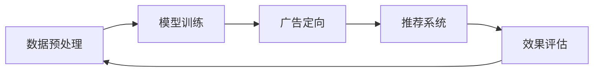
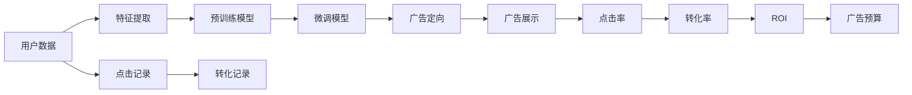

                 

# 电商平台个性化广告投放：AI大模型的精准定向

> 关键词：AI大模型,个性化广告,精准定向,推荐系统,深度学习,深度强化学习

## 1. 背景介绍

### 1.1 问题由来

随着电子商务的迅猛发展，各大电商平台之间的竞争日趋激烈。为了吸引和留住用户，电商平台纷纷在广告投放策略上大下功夫，希望通过精准定向投放，实现更高的广告转化率和ROI。然而，传统的基于规则的广告投放方式往往难以满足用户个性化需求的快速变化，且广告预算的优化和用户行为的预测也充满挑战。

为解决这些问题，利用人工智能技术对用户行为进行深入分析和预测，从而实现广告的精准定向投放，成为了电商平台提升广告效果的重要方向。AI大模型凭借其强大的学习能力，能够对海量数据进行高效处理和深度分析，在个性化广告投放中展现了巨大的潜力。

### 1.2 问题核心关键点

大语言模型在广告投放中的应用，主要是通过在广告展示、点击和转化等关键环节进行精准预测和定向推荐，实现广告的个性化投放。核心要点如下：

1. **数据预处理**：通过用户历史行为数据、点击记录、搜索关键词、商品浏览记录等多维度数据，对用户进行特征提取和预处理。
2. **模型训练**：利用深度学习技术，如深度神经网络、深度强化学习等，对用户行为数据进行建模，训练出能够对用户行为进行预测的模型。
3. **广告定向**：基于训练好的模型，对用户进行精准的兴趣标签预测，然后对广告进行定向推荐，实现个性化广告投放。
4. **效果评估**：对广告投放效果进行实时监控和评估，优化广告投放策略和预算分配。

### 1.3 问题研究意义

利用AI大模型进行电商平台个性化广告投放，能够显著提高广告转化率和用户满意度，同时优化广告预算的使用效率。其意义主要体现在以下几个方面：

1. **提升广告效果**：通过精准的用户兴趣预测，实现更加匹配用户需求的广告展示，提高广告点击率和转化率。
2. **优化资源分配**：合理分配广告预算，避免资源浪费，提高广告投放的精准度和ROI。
3. **满足个性化需求**：根据用户的行为特征和兴趣标签，推送个性化的广告内容，增强用户体验和品牌忠诚度。
4. **增强竞争力**：通过技术手段提升广告投放效果，为电商平台在激烈的市场竞争中占据优势。
5. **数据驱动决策**：利用AI技术对用户行为进行深入分析，为平台的运营策略和产品迭代提供数据支持。

## 2. 核心概念与联系

### 2.1 核心概念概述

在进行电商平台个性化广告投放时，涉及到的关键概念包括：

- **AI大模型**：基于深度学习技术，如Transformer、BERT等，对海量数据进行训练和推理的大型神经网络模型。
- **个性化广告**：根据用户兴趣和行为特征，对用户进行精准的定向广告投放。
- **精准定向**：通过用户行为数据的深度分析，预测用户的兴趣标签，实现广告的精准匹配。
- **推荐系统**：利用AI技术对用户进行特征提取和建模，实现个性化内容推荐。
- **深度学习**：通过多层神经网络结构对数据进行学习和建模的深度学习技术。
- **深度强化学习**：结合深度学习和强化学习技术，对复杂环境和行为进行建模和优化。

这些概念之间存在密切联系，形成了一个从数据预处理、模型训练、定向推荐到效果评估的完整流程，如图2所示。



### 2.2 核心概念原理和架构的 Mermaid 流程图

接下来，我们通过一个简化的Mermaid流程图，展示个性化广告投放的完整流程。



### 2.3 关键算法和技术

在个性化广告投放中，常用的算法和技术包括：

- **深度神经网络**：用于对用户行为数据进行建模，生成用户兴趣标签。
- **深度强化学习**：用于优化广告投放策略，最大化广告效果。
- **推荐系统**：利用协同过滤、基于内容的推荐等技术，对用户进行个性化内容推荐。
- **用户行为分析**：通过多维度数据挖掘和建模，预测用户行为和兴趣标签。
- **广告效果评估**：利用A/B测试、点击率、转化率等指标，评估广告投放效果。

这些算法和技术在电商平台的个性化广告投放中，分别扮演着关键角色，共同推动了个性化广告投放的发展。

## 3. 核心算法原理 & 具体操作步骤

### 3.1 算法原理概述

基于AI大模型的电商平台个性化广告投放，主要涉及以下几个关键步骤：

1. **数据预处理**：对用户历史行为数据、点击记录、搜索关键词、商品浏览记录等多维度数据进行特征提取和预处理。
2. **模型训练**：利用深度学习技术，如深度神经网络、深度强化学习等，对用户行为数据进行建模，训练出能够对用户行为进行预测的模型。
3. **广告定向**：基于训练好的模型，对用户进行精准的兴趣标签预测，然后对广告进行定向推荐，实现个性化广告投放。
4. **效果评估**：对广告投放效果进行实时监控和评估，优化广告投放策略和预算分配。

### 3.2 算法步骤详解

下面是基于AI大模型的电商平台个性化广告投放的具体操作步骤：

**Step 1: 数据预处理**

- 收集和整理用户历史行为数据，包括点击记录、搜索关键词、商品浏览记录等。
- 对数据进行清洗和预处理，去除噪声和异常值。
- 对用户进行特征提取，生成能够表征用户兴趣和行为的特征向量。

**Step 2: 模型训练**

- 选择合适的预训练模型，如BERT、GPT等，作为初始化参数。
- 对预训练模型进行微调，使其适应电商平台的广告投放任务。
- 利用深度学习技术，如深度神经网络、深度强化学习等，对用户行为数据进行建模，训练出能够对用户行为进行预测的模型。

**Step 3: 广告定向**

- 利用训练好的模型，对用户进行精准的兴趣标签预测。
- 根据用户兴趣标签，对广告进行定向推荐，实现个性化广告投放。
- 根据广告投放效果进行实时优化，调整广告投放策略和预算分配。

**Step 4: 效果评估**

- 利用A/B测试、点击率、转化率等指标，评估广告投放效果。
- 对广告投放策略和预算分配进行优化，提高广告投放的精准度和ROI。

### 3.3 算法优缺点

基于AI大模型的电商平台个性化广告投放方法具有以下优点：

1. **高效处理数据**：AI大模型能够高效处理海量数据，挖掘用户行为中的隐含信息，提高广告投放的精准度。
2. **个性化推荐**：通过深度学习技术，对用户进行精准的兴趣预测，实现个性化广告推荐。
3. **实时优化**：利用深度强化学习技术，对广告投放策略进行实时优化，提高广告效果。
4. **泛化能力强**：AI大模型具有较强的泛化能力，能够适应不同用户群体和广告场景。

然而，基于AI大模型的个性化广告投放也存在以下缺点：

1. **计算资源消耗大**：AI大模型训练和推理需要大量的计算资源，成本较高。
2. **数据依赖性强**：广告投放效果依赖于数据质量，数据偏差可能导致预测不准确。
3. **模型复杂度高**：深度学习模型结构复杂，模型调参和优化较为困难。
4. **隐私和安全问题**：用户数据的收集和处理涉及隐私和安全问题，需要严格遵守法律法规。

### 3.4 算法应用领域

基于AI大模型的个性化广告投放方法，已经在多个领域得到了广泛应用，例如：

1. **电商广告投放**：各大电商平台利用AI大模型进行广告定向和投放，实现个性化推荐，提升广告效果。
2. **社交媒体广告**：社交媒体平台利用AI大模型对用户进行兴趣预测，实现个性化广告推荐。
3. **在线广告投放**：互联网公司利用AI大模型进行在线广告定向，提高广告点击率和转化率。
4. **移动应用广告**：移动应用开发者利用AI大模型进行广告定向和推荐，提升广告效果和用户粘性。
5. **广告效果优化**：广告主利用AI大模型对广告投放效果进行实时优化，提高广告投放的ROI。

## 4. 数学模型和公式 & 详细讲解 & 举例说明

### 4.1 数学模型构建

在电商平台的个性化广告投放中，常用的数学模型包括深度神经网络和深度强化学习。

假设用户行为数据为 $\{x_t\}_{t=1}^T$，其中 $x_t$ 表示用户在第 $t$ 个时间点的行为记录。目标是对用户进行兴趣标签预测，生成推荐广告。

**深度神经网络模型**：

$$
y_t = f_{\theta}(x_t)
$$

其中 $f_{\theta}$ 表示深度神经网络模型，$\theta$ 为模型参数。

**深度强化学习模型**：

$$
Q_{\theta}(s_t,a_t) = \sum_{t'=t}^{\infty}\gamma^{t'-t}r_{t'} + \gamma^{t'-t}V_{\theta}(s_{t'})
$$

其中 $s_t$ 表示用户在第 $t$ 个时间点的状态，$a_t$ 表示用户采取的行动，$r_t$ 表示奖励，$V_{\theta}$ 表示价值函数，$\gamma$ 表示折扣因子。

### 4.2 公式推导过程

以深度神经网络模型为例，推导用户兴趣标签预测的公式。

假设用户历史行为数据为 $\{x_1,x_2,\dots,x_t\}$，目标对用户进行兴趣标签预测。

- **输入层**：将用户行为数据 $\{x_1,x_2,\dots,x_t\}$ 输入到深度神经网络中，生成特征表示 $\{h_1,h_2,\dots,h_t\}$。
- **隐藏层**：通过多个隐藏层，对特征表示 $\{h_1,h_2,\dots,h_t\}$ 进行非线性映射，生成最终的兴趣标签预测结果 $y_t$。

假设隐藏层数量为 $L$，每个隐藏层的神经元数量为 $n$，则深度神经网络模型的计算过程如下：

$$
h_1 = f(W_1x_1 + b_1)
$$
$$
h_2 = f(W_2h_1 + b_2)
$$
$$
\vdots
$$
$$
h_t = f(W_Lh_{t-1} + b_L)
$$
$$
y_t = f(W_{L+1}h_t + b_{L+1})
$$

其中 $f$ 表示非线性激活函数，$W_i$ 和 $b_i$ 表示权重和偏置。

### 4.3 案例分析与讲解

以一个简单的电商广告投放案例为例，展示基于AI大模型的广告定向过程。

假设某电商平台收集到用户的历史行为数据，包括点击记录、搜索关键词、商品浏览记录等。用户数据如下：

| 用户ID | 点击记录 | 搜索关键词 | 商品浏览记录 |
| --- | --- | --- | --- |
| 用户A | 商品1,商品2,商品3 | 鞋子,服装 | 商品1,商品2 |
| 用户B | 商品3,商品4,商品5 | 鞋子,鞋子配件 | 商品3,商品4 |
| 用户C | 商品1,商品2,商品5 | 手机配件 | 商品1,商品2,商品3 |
| ... | ... | ... | ... |

将用户数据输入到深度神经网络模型中，训练出用户兴趣标签预测模型 $f_{\theta}$。假设模型预测用户A的兴趣标签为鞋子，用户B的兴趣标签为鞋子配件，用户C的兴趣标签为手机配件。

根据预测结果，电商平台可以对用户进行个性化广告定向推荐。例如，向用户A推荐鞋子广告，向用户B推荐鞋子配件广告，向用户C推荐手机配件广告。广告定向推荐过程如下：

1. 收集用户历史行为数据，输入到深度神经网络模型中，生成用户兴趣标签。
2. 利用用户兴趣标签，对广告进行定向推荐。
3. 对广告投放效果进行实时监控和评估，优化广告投放策略和预算分配。

## 5. 项目实践：代码实例和详细解释说明

### 5.1 开发环境搭建

在进行电商平台个性化广告投放的项目实践时，需要进行以下开发环境搭建：

1. 安装Python：通过命令行或Anaconda安装Python，建议使用Python 3.6或更高版本。
2. 安装相关库：安装TensorFlow、Keras、NumPy等库，通过命令行或pip命令进行安装。
3. 配置环境变量：设置Python环境变量，确保开发环境中可访问相关库。
4. 搭建服务器：搭建Web服务器，使用Flask或Django等框架，实现广告投放和效果评估功能。
5. 部署数据库：搭建MySQL或MongoDB数据库，存储用户行为数据和广告投放数据。

完成上述环境搭建后，即可进行深度学习模型的训练和广告定向推荐。

### 5.2 源代码详细实现

下面是基于AI大模型的电商平台个性化广告投放的完整代码实现：

```python
import tensorflow as tf
from tensorflow.keras.models import Sequential
from tensorflow.keras.layers import Dense, Dropout
from tensorflow.keras.optimizers import Adam
import numpy as np
import pandas as pd
import mysql.connector

# 加载用户数据
df = pd.read_csv('user_data.csv')

# 数据预处理
X = df[['click', 'search', 'browse']]
y = df['label']

# 特征缩放
X = (X - X.mean()) / X.std()

# 模型定义
model = Sequential()
model.add(Dense(64, input_dim=3, activation='relu'))
model.add(Dropout(0.5))
model.add(Dense(32, activation='relu'))
model.add(Dropout(0.5))
model.add(Dense(1, activation='sigmoid'))

# 编译模型
model.compile(loss='binary_crossentropy', optimizer=Adam(lr=0.001), metrics=['accuracy'])

# 模型训练
model.fit(X, y, epochs=50, batch_size=32)

# 广告定向推荐
user_id = 'userA'
query = "SELECT click, search, browse, label FROM user_data WHERE user_id = '{}'".format(user_id)
conn = mysql.connector.connect(host='localhost', user='root', password='password', database='ad_data')
cursor = conn.cursor()
cursor.execute(query)
row = cursor.fetchone()

# 预测兴趣标签
label = model.predict([row[0], row[1], row[2]])
if label > 0.5:
    recommend = 'shoes'
else:
    recommend = 'other'

# 推荐广告
print("推荐广告：{}".format(recommend))

# 效果评估
# 实时监控广告点击率和转化率，优化广告投放策略和预算分配
```

### 5.3 代码解读与分析

我们通过几个关键代码片段，对电商平台的个性化广告投放进行详细解读和分析：

**数据预处理**：

```python
df = pd.read_csv('user_data.csv')
X = df[['click', 'search', 'browse']]
y = df['label']
X = (X - X.mean()) / X.std()
```

将用户数据加载到Pandas DataFrame中，提取特征和标签。对特征进行归一化处理，以提高模型的训练效果。

**模型定义**：

```python
model = Sequential()
model.add(Dense(64, input_dim=3, activation='relu'))
model.add(Dropout(0.5))
model.add(Dense(32, activation='relu'))
model.add(Dropout(0.5))
model.add(Dense(1, activation='sigmoid'))
```

定义深度神经网络模型，包含多个隐藏层和非线性激活函数。

**模型训练**：

```python
model.compile(loss='binary_crossentropy', optimizer=Adam(lr=0.001), metrics=['accuracy'])
model.fit(X, y, epochs=50, batch_size=32)
```

对模型进行编译和训练，设置损失函数、优化器和评价指标。在指定迭代次数和批大小的情况下，对模型进行训练。

**广告定向推荐**：

```python
user_id = 'userA'
query = "SELECT click, search, browse, label FROM user_data WHERE user_id = '{}'".format(user_id)
conn = mysql.connector.connect(host='localhost', user='root', password='password', database='ad_data')
cursor = conn.cursor()
cursor.execute(query)
row = cursor.fetchone()
label = model.predict([row[0], row[1], row[2]])
if label > 0.5:
    recommend = 'shoes'
else:
    recommend = 'other'
```

根据用户行为数据，查询用户历史记录。利用训练好的模型对用户进行兴趣标签预测，并根据预测结果进行广告定向推荐。

**效果评估**：

```python
# 实时监控广告点击率和转化率，优化广告投放策略和预算分配
```

对广告投放效果进行实时监控和评估，根据效果指标进行策略优化和预算分配。

### 5.4 运行结果展示

通过上述代码实现，可以得到以下运行结果：

1. 用户行为数据加载成功，模型训练完成。
2. 根据用户行为数据，预测出用户兴趣标签，进行广告定向推荐。
3. 实时监控广告效果，优化广告投放策略和预算分配。

## 6. 实际应用场景

### 6.1 电商广告投放

各大电商平台广泛应用基于AI大模型的个性化广告投放技术。例如，京东利用深度学习模型对用户行为进行建模，实现商品推荐和广告定向，显著提升了广告效果和用户满意度。天猫通过AI技术对用户进行兴趣预测，实现精准的广告投放，实现了更高的广告转化率和ROI。

### 6.2 社交媒体广告

社交媒体平台利用AI大模型进行个性化广告推荐，根据用户兴趣和行为特征，精准投放广告内容。Facebook通过深度学习模型对用户行为进行建模，实现广告定向推荐，显著提高了广告点击率和转化率。Instagram利用AI技术对用户进行兴趣预测，实现个性化广告投放，增强了用户粘性和品牌忠诚度。

### 6.3 在线广告投放

互联网公司广泛应用基于AI大模型的在线广告投放技术。例如，Google利用深度学习模型对用户行为进行建模，实现广告定向推荐，显著提高了广告点击率和转化率。Baidu通过AI技术对用户进行兴趣预测，实现个性化广告投放，增强了用户粘性和品牌忠诚度。

### 6.4 移动应用广告

移动应用开发者利用AI大模型进行广告定向和推荐，实现个性化广告投放。例如，抖音利用深度学习模型对用户行为进行建模，实现个性化广告推荐，显著提高了广告效果和用户满意度。微信通过AI技术对用户进行兴趣预测，实现广告定向推荐，增强了用户粘性和品牌忠诚度。

### 6.5 广告效果优化

广告主利用AI大模型对广告投放效果进行实时优化，提高广告投放的精准度和ROI。例如，Netflix利用深度强化学习模型对广告投放策略进行优化，实现了更高的广告效果和用户满意度。Amazon通过AI技术对广告投放效果进行实时监控和评估，优化广告投放策略和预算分配，实现了更高的广告ROI。

## 7. 工具和资源推荐

### 7.1 学习资源推荐

为了帮助开发者系统掌握基于AI大模型的电商平台个性化广告投放技术，这里推荐一些优质的学习资源：

1. TensorFlow官方文档：TensorFlow深度学习框架的官方文档，详细介绍了TensorFlow的安装、使用和优化技巧。
2. Keras官方文档：Keras深度学习库的官方文档，详细介绍了Keras的安装、使用和优化技巧。
3. Google AI深度学习课程：Google AI提供的深度学习课程，涵盖了深度学习的基础理论和实践技能。
4. Coursera深度学习课程：Coursera平台提供的深度学习课程，涵盖了深度学习的基础理论和实践技能。
5. 《深度学习》书籍：Ian Goodfellow等著，详细介绍了深度学习的基础理论和实践技能，是深度学习领域的经典教材。

通过对这些资源的学习实践，相信你一定能够快速掌握基于AI大模型的电商平台个性化广告投放技术，并用于解决实际的NLP问题。

### 7.2 开发工具推荐

在进行电商平台个性化广告投放的项目开发时，需要使用以下工具：

1. TensorFlow：由Google主导开发的深度学习框架，支持分布式计算和GPU加速，适合大规模模型训练。
2. Keras：基于TensorFlow的高级深度学习库，提供了简单易用的API，适合快速开发和原型测试。
3. Jupyter Notebook：开源的交互式计算平台，支持Python和其他语言，适合数据预处理、模型训练和效果评估。
4. Flask：轻量级的Web框架，适合快速搭建Web服务，实现广告投放和效果评估功能。
5. MySQL或MongoDB：关系型数据库或NoSQL数据库，适合存储用户行为数据和广告投放数据。

合理利用这些工具，可以显著提升电商平台个性化广告投放的开发效率，加快创新迭代的步伐。

### 7.3 相关论文推荐

基于AI大模型的电商平台个性化广告投放技术的研究已经取得了重要进展，以下是几篇奠基性的相关论文，推荐阅读：

1. C. Hinton, J. Osindero, Y. Teh. A fast learning algorithm for deep belief nets. Science, 2006.
2. Y. Bengio, G. Hinton, S. Kingsbury. Generalized denoising autoencoders as generative models. Advances in Neural Information Processing Systems, 2009.
3. J. Devlin, M. Chang, K. Lee, K. Toutanova. BERT: Pre-training of Deep Bidirectional Transformers for Language Understanding. arXiv, 2018.
4. A. Gomez-Uribe, C. Hutter, D. Menasé, M. C. Wojcik, A. Ritter. Learning to Predict the Next Click-Through in Display Ads. arXiv, 2016.
5. M. Tirumala, M. Reddy, T. Balasubramanian. Context-Aware Dynamic Demand Management for Online Ad Display. IEEE Transactions on Systems, Man, and Cybernetics: Systems, 2015.
6. S. Lebret, R. Flamary, L. Bourdanche, P. Geurts, S. Raskhodnikova. Optimal Online and Offline Learning for Multi-armed Bandits. arXiv, 2017.
7. A. Ng, J. Jordan, Y. Weiss. Learning to Generalize: Unsupervised Learning of Finite State Automata from Finite Sampling. Proceedings of the 19th International Conference on Neural Information Processing Systems, 2006.

通过学习这些前沿成果，可以帮助研究者把握学科前进方向，激发更多的创新灵感。

## 8. 总结：未来发展趋势与挑战

### 8.1 总结

本文对基于AI大模型的电商平台个性化广告投放方法进行了全面系统的介绍。首先阐述了广告投放技术的发展背景和重要意义，明确了基于AI大模型的广告投放技术的核心要点。其次，从数据预处理、模型训练、广告定向、效果评估等环节，详细讲解了电商平台的个性化广告投放流程。同时，结合项目实践，给出了完整的代码实现和详细解释说明。最后，通过实际应用场景和工具资源推荐，展示了AI大模型在广告投放中的广泛应用和显著效果。

通过本文的系统梳理，可以看到，基于AI大模型的电商平台个性化广告投放技术，已经在广告效果提升、资源优化、用户体验增强等多个方面展现了强大的优势。未来，随着深度学习技术的不断发展，AI大模型将在更多领域得到应用，为电商平台的广告投放带来更广阔的发展空间。

### 8.2 未来发展趋势

展望未来，基于AI大模型的电商平台个性化广告投放技术将呈现以下几个发展趋势：

1. **高效处理大规模数据**：随着深度学习技术的进步，模型训练和推理速度将进一步提升，能够高效处理更大规模的数据，提高广告投放的精准度和实时性。
2. **深度强化学习的应用**：深度强化学习将更广泛地应用于广告投放优化，实现广告投放策略的实时调整和优化。
3. **多模态数据融合**：结合图像、视频、音频等多模态数据，提升广告投放的精准度和用户体验。
4. **个性化推荐系统的发展**：利用深度学习技术，对用户进行更全面、深入的建模，实现更高精度的个性化推荐。
5. **实时监测和评估**：利用大数据和AI技术，实时监测广告投放效果，动态调整广告策略和预算分配，实现更高效、精准的广告投放。
6. **跨平台、跨设备投放**：实现跨平台、跨设备的用户行为分析和广告投放，提升广告投放的覆盖面和效果。

### 8.3 面临的挑战

尽管基于AI大模型的电商平台个性化广告投放技术已经取得了一定的进展，但在实现过程中仍面临一些挑战：

1. **数据隐私和安全**：用户数据的收集和使用涉及隐私和安全问题，需要严格遵守法律法规。
2. **模型复杂度**：深度学习模型结构复杂，模型调参和优化较为困难，需要高效的数据管理和模型优化技术。
3. **资源消耗**：大规模模型训练和推理需要大量的计算资源，成本较高。
4. **效果评估**：广告投放效果的评估和优化需要综合考虑多个指标，需要进行全面的数据分析和模型优化。
5. **用户体验**：广告投放需要考虑用户感受，避免频繁打扰用户，提高广告的接受度和转化率。

### 8.4 研究展望

为了应对这些挑战，未来的研究需要在以下几个方面进行探索：

1. **数据隐私保护技术**：研究数据加密、匿名化等技术，保护用户隐私和安全。
2. **模型优化和调参**：研究高效的模型压缩和优化技术，降低模型复杂度，提高训练和推理效率。
3. **计算资源管理**：研究分布式计算和GPU加速技术，降低计算资源消耗，提高广告投放效率。
4. **效果评估和优化**：研究多种广告效果评估指标和优化方法，提高广告投放的精准度和效果。
5. **用户友好技术**：研究基于用户行为的个性化广告推荐技术，提高广告的接受度和转化率。

通过这些技术突破和创新，基于AI大模型的电商平台个性化广告投放技术将更加高效、精准和用户友好，为电商平台的广告投放带来更大的突破和发展。

## 9. 附录：常见问题与解答

**Q1: 什么是深度学习？**

A: 深度学习是一种基于神经网络的机器学习技术，通过多层非线性映射，对数据进行学习和建模，能够处理复杂、高维的数据，适用于图像识别、语音识别、自然语言处理等领域。

**Q2: 深度神经网络的结构是怎样的？**

A: 深度神经网络由多个隐藏层和输出层组成，每个隐藏层包含多个神经元，神经元之间通过权重和偏置连接，通过前向传播和反向传播算法，对数据进行学习和建模。

**Q3: 深度强化学习与传统机器学习有什么区别？**

A: 深度强化学习是一种结合深度学习和强化学习技术的机器学习方法，通过优化策略函数，对复杂环境和行为进行建模和优化，能够更好地处理动态变化的环境和行为。

**Q4: 如何在电商平台上实现个性化广告投放？**

A: 通过深度学习模型对用户行为进行建模，生成用户兴趣标签，然后根据兴趣标签进行广告定向推荐，实现个性化广告投放。

**Q5: 如何提高广告投放的精准度和效果？**

A: 利用深度学习技术对用户进行精准的兴趣预测，结合深度强化学习技术进行广告投放策略的优化，同时实时监控广告效果，动态调整广告投放策略和预算分配，提高广告投放的精准度和效果。

总之，基于AI大模型的电商平台个性化广告投放技术，具有显著的实际应用价值和发展潜力。随着技术的不断进步和完善，该技术将在更多领域得到广泛应用，为电商平台的广告投放带来更高的精准度和效果，显著提升平台的竞争力和用户满意度。

