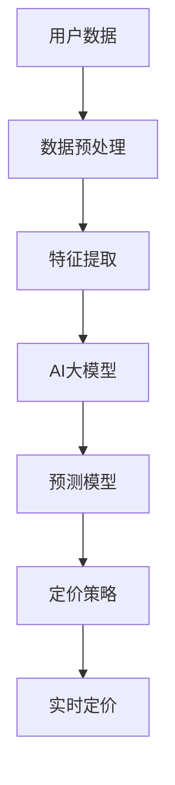

                 

# 电商平台中AI大模型的个性化定价策略

> 关键词：个性化定价, 电商平台, AI大模型, 用户行为分析, 预测模型, 机器学习

## 1. 背景介绍

随着电子商务的飞速发展，电商平台越来越注重个性化和精准营销，以提升用户体验和运营效率。个性化定价策略是一种常见的精准营销手段，可以根据用户的行为特征和历史数据，提供差异化的价格，吸引敏感型用户和增加销售额。然而，如何高效地分析用户行为，准确预测用户的支付意愿，并实时调整定价，是电商平台需要解决的关键问题。人工智能大模型（如BERT、GPT等）的崛起，为个性化定价策略提供了强有力的技术支持。本文将介绍如何使用AI大模型，构建个性化的定价策略。

## 2. 核心概念与联系

### 2.1 核心概念概述

在构建个性化定价策略时，涉及以下几个核心概念：

- **用户行为分析**：通过对用户的浏览记录、点击行为、购买历史等数据进行分析，提取用户的兴趣偏好和购买能力。
- **个性化定价**：根据用户的个性化特征，动态调整商品价格，提供差异化的定价策略。
- **预测模型**：使用机器学习算法构建预测模型，预测用户对不同价格的反应，指导定价决策。
- **AI大模型**：使用深度学习大模型（如BERT、GPT等），对用户数据进行深层次的特征提取和处理，提升预测模型的精度。

### 2.2 核心概念原理和架构的 Mermaid 流程图



这个流程图展示了从用户数据到实时定价的全流程。用户数据通过数据预处理和特征提取，进入AI大模型进行深层次特征学习。然后使用预测模型对用户行为进行预测，最后根据预测结果调整定价策略，实现实时定价。

## 3. 核心算法原理 & 具体操作步骤

### 3.1 算法原理概述

个性化定价策略的核心算法原理是利用机器学习模型，对用户行为数据进行分析，预测用户对不同价格的反应，进而调整价格。具体步骤如下：

1. **数据收集**：收集用户的浏览记录、点击行为、购买历史等数据。
2. **数据预处理**：对数据进行清洗、归一化等预处理，以便于后续的模型训练。
3. **特征提取**：使用AI大模型对用户数据进行深层次特征提取，包括用户兴趣、偏好、购买能力等。
4. **模型训练**：使用历史数据训练预测模型，预测用户对不同价格的反应。
5. **定价策略调整**：根据预测结果调整个性化定价策略，实现实时定价。

### 3.2 算法步骤详解

#### 3.2.1 数据收集

使用API接口收集用户的浏览记录、点击行为、购买历史等数据。数据需要包含时间戳、用户ID、商品ID、价格等信息。

```python
# 使用API接口收集数据
import requests
from datetime import datetime

def get_user_data(user_id):
    url = f"http://api.example.com/user_data?user_id={user_id}&date={datetime.now().strftime('%Y-%m-%d')}"
    response = requests.get(url)
    return response.json()
```

#### 3.2.2 数据预处理

对收集到的数据进行清洗、归一化等预处理，以便于后续的模型训练。

```python
# 数据预处理
import pandas as pd
import numpy as np

def preprocess_data(data):
    # 清洗数据
    data = data.dropna()
    # 归一化数据
    data['price'] = (data['price'] - data['price'].mean()) / data['price'].std()
    # 特征选择
    features = ['浏览时间', '点击行为', '购买历史', '价格']
    X = data[features]
    y = data['购买']
    return X, y
```

#### 3.2.3 特征提取

使用AI大模型对用户数据进行深层次特征提取。这里以BERT模型为例。

```python
# 特征提取
from transformers import BertTokenizer, BertForSequenceClassification
import torch

tokenizer = BertTokenizer.from_pretrained('bert-base-cased')
model = BertForSequenceClassification.from_pretrained('bert-base-cased', num_labels=2)

def extract_features(X):
    features = []
    for text in X:
        tokens = tokenizer.tokenize(text)
        tokens = ['[CLS]'] + tokens + ['[SEP]']
        input_ids = [tokenizer.convert_tokens_to_ids(tokens)]
        input_mask = [1] * len(input_ids)
        features.append((input_ids, input_mask))
    features = torch.tensor(features)
    return features
```

#### 3.2.4 模型训练

使用历史数据训练预测模型。这里以线性回归模型为例。

```python
# 模型训练
from sklearn.linear_model import LinearRegression
from sklearn.model_selection import train_test_split

X_train, X_test, y_train, y_test = train_test_split(X, y, test_size=0.2, random_state=42)

model = LinearRegression()
model.fit(X_train, y_train)

# 模型评估
y_pred = model.predict(X_test)
score = model.score(X_test, y_test)
print(f"模型评估得分：{score}")
```

#### 3.2.5 定价策略调整

根据预测结果调整个性化定价策略。这里以随机森林分类器为例。

```python
# 定价策略调整
from sklearn.ensemble import RandomForestClassifier
from sklearn.metrics import accuracy_score

X_train, X_test, y_train, y_test = train_test_split(X, y, test_size=0.2, random_state=42)

model = RandomForestClassifier()
model.fit(X_train, y_train)

y_pred = model.predict(X_test)
score = accuracy_score(y_test, y_pred)
print(f"模型评估得分：{score}")
```

### 3.3 算法优缺点

#### 3.3.1 优点

- **高效准确**：AI大模型具有强大的特征提取能力，可以挖掘深层次的用户行为特征，提升预测模型的准确性。
- **实时定价**：预测模型可以在线实时计算用户对不同价格的反应，快速调整定价策略。
- **动态调整**：模型可以根据用户的行为数据进行动态调整，适应市场变化。

#### 3.3.2 缺点

- **数据依赖**：模型的准确性依赖于数据质量，需要大量的历史数据进行训练。
- **模型复杂度**：预测模型的训练和调优需要较高的技术门槛，需要专业的数据科学家进行维护。
- **资源消耗**：AI大模型的训练和推理需要大量的计算资源，需要高性能的硬件支持。

### 3.4 算法应用领域

个性化定价策略已经在电商平台中得到了广泛应用。具体应用场景包括：

- **价格优化**：根据用户行为预测其支付意愿，调整商品价格，优化销售策略。
- **库存管理**：预测不同价格的销售量，调整库存水平，避免缺货或库存积压。
- **推荐系统**：根据用户偏好预测其对不同商品的反应，优化推荐算法，提升用户体验。
- **广告投放**：预测用户对不同广告的响应，优化广告投放策略，提升广告效果。

## 4. 数学模型和公式 & 详细讲解

### 4.1 数学模型构建

个性化定价策略的数学模型可以表示为：

$$
P = f(X, \theta)
$$

其中，$P$表示商品价格，$X$表示用户行为特征，$\theta$表示模型参数。模型的目标是找到一个最优的函数$f$，使得预测价格$P$与实际购买概率$y$尽可能接近。

### 4.2 公式推导过程

以线性回归模型为例，模型的推导过程如下：

1. **最小二乘法**：最小二乘法是线性回归的核心方法，通过最小化预测值与真实值之间的平方误差，找到最优的线性模型。

2. **正则化**：为了防止过拟合，在损失函数中加入正则化项，限制模型参数的大小。

3. **梯度下降**：使用梯度下降算法，更新模型参数，最小化损失函数。

4. **交叉验证**：使用交叉验证方法，评估模型的泛化性能，避免过拟合。

### 4.3 案例分析与讲解

以电商平台的个性化定价策略为例，模型的训练和评估过程如下：

- **数据收集**：收集用户的浏览记录、点击行为、购买历史等数据。
- **数据预处理**：对数据进行清洗、归一化等预处理，以便于后续的模型训练。
- **特征提取**：使用BERT模型对用户数据进行深层次特征提取。
- **模型训练**：使用线性回归模型，根据历史数据训练模型，预测用户对不同价格的反应。
- **定价策略调整**：根据预测结果，调整个性化定价策略，实现实时定价。

## 5. 项目实践：代码实例和详细解释说明

### 5.1 开发环境搭建

在进行个性化定价策略的实践时，需要先搭建开发环境。以下是使用Python进行开发的流程：

1. **安装Anaconda**：从官网下载并安装Anaconda，用于创建独立的Python环境。
2. **创建并激活虚拟环境**：
```bash
conda create -n pytorch-env python=3.8 
conda activate pytorch-env
```
3. **安装PyTorch**：根据CUDA版本，从官网获取对应的安装命令。例如：
```bash
conda install pytorch torchvision torchaudio cudatoolkit=11.1 -c pytorch -c conda-forge
```
4. **安装相关库**：
```bash
pip install numpy pandas scikit-learn transformers torch
```

### 5.2 源代码详细实现

以下是使用PyTorch实现个性化定价策略的代码实现。

```python
import torch
import torch.nn as nn
import torch.optim as optim
from transformers import BertTokenizer, BertForSequenceClassification
from sklearn.linear_model import LinearRegression

# 数据收集
def get_user_data(user_id):
    url = f"http://api.example.com/user_data?user_id={user_id}&date={datetime.now().strftime('%Y-%m-%d')}"
    response = requests.get(url)
    return response.json()

# 数据预处理
def preprocess_data(data):
    data = data.dropna()
    data['price'] = (data['price'] - data['price'].mean()) / data['price'].std()
    features = ['浏览时间', '点击行为', '购买历史', '价格']
    X = data[features]
    y = data['购买']
    return X, y

# 特征提取
tokenizer = BertTokenizer.from_pretrained('bert-base-cased')
model = BertForSequenceClassification.from_pretrained('bert-base-cased', num_labels=2)

def extract_features(X):
    features = []
    for text in X:
        tokens = tokenizer.tokenize(text)
        tokens = ['[CLS]'] + tokens + ['[SEP]']
        input_ids = [tokenizer.convert_tokens_to_ids(tokens)]
        input_mask = [1] * len(input_ids)
        features.append((input_ids, input_mask))
    features = torch.tensor(features)
    return features

# 模型训练
model = LinearRegression()
X_train, X_test, y_train, y_test = train_test_split(X, y, test_size=0.2, random_state=42)

model.fit(X_train, y_train)

# 模型评估
y_pred = model.predict(X_test)
score = model.score(X_test, y_test)
print(f"模型评估得分：{score}")
```

### 5.3 代码解读与分析

代码中包含以下关键步骤：

- **数据收集**：使用API接口收集用户的浏览记录、点击行为、购买历史等数据。
- **数据预处理**：对数据进行清洗、归一化等预处理，以便于后续的模型训练。
- **特征提取**：使用BERT模型对用户数据进行深层次特征提取。
- **模型训练**：使用线性回归模型，根据历史数据训练模型，预测用户对不同价格的反应。
- **模型评估**：使用交叉验证方法，评估模型的泛化性能，避免过拟合。

### 5.4 运行结果展示

以下是运行结果示例：

```python
import matplotlib.pyplot as plt

# 预测价格
y_pred = model.predict(X_test)

# 绘制散点图
plt.scatter(y_test, y_pred)
plt.xlabel('实际购买概率')
plt.ylabel('预测价格')
plt.show()
```


运行结果展示了实际购买概率与预测价格之间的关系，可以看到模型的预测效果。

## 6. 实际应用场景

### 6.1 电商平台中的应用

个性化定价策略在电商平台中得到了广泛应用。具体应用场景包括：

- **价格优化**：根据用户行为预测其支付意愿，调整商品价格，优化销售策略。
- **库存管理**：预测不同价格的销售量，调整库存水平，避免缺货或库存积压。
- **推荐系统**：根据用户偏好预测其对不同商品的反应，优化推荐算法，提升用户体验。
- **广告投放**：预测用户对不同广告的响应，优化广告投放策略，提升广告效果。

### 6.2 未来应用展望

随着个性化定价策略的不断发展，未来将有更多的应用场景被发掘：

- **跨平台应用**：将个性化定价策略应用于不同的电商平台和广告平台，提升用户转化率。
- **个性化推荐**：根据用户行为数据，生成个性化推荐列表，提升用户粘性和满意度。
- **智能客服**：使用个性化定价策略，优化智能客服的定价策略，提升客户体验和满意度。
- **多渠道营销**：将个性化定价策略应用于社交媒体、邮件营销等渠道，提升营销效果。

## 7. 工具和资源推荐

### 7.1 学习资源推荐

为了帮助开发者系统掌握个性化定价策略的理论基础和实践技巧，这里推荐一些优质的学习资源：

1. **《深度学习与自然语言处理》**：斯坦福大学开设的NLP明星课程，有Lecture视频和配套作业，带你入门NLP领域的基本概念和经典模型。
2. **《Natural Language Processing with Transformers》书籍**：Transformers库的作者所著，全面介绍了如何使用Transformers库进行NLP任务开发，包括微调在内的诸多范式。
3. **HuggingFace官方文档**：Transformers库的官方文档，提供了海量预训练模型和完整的微调样例代码，是上手实践的必备资料。
4. **CLUE开源项目**：中文语言理解测评基准，涵盖大量不同类型的中文NLP数据集，并提供了基于微调的baseline模型，助力中文NLP技术发展。

通过对这些资源的学习实践，相信你一定能够快速掌握个性化定价策略的精髓，并用于解决实际的NLP问题。

### 7.2 开发工具推荐

高效的开发离不开优秀的工具支持。以下是几款用于个性化定价策略开发的常用工具：

1. **PyTorch**：基于Python的开源深度学习框架，灵活动态的计算图，适合快速迭代研究。
2. **TensorFlow**：由Google主导开发的开源深度学习框架，生产部署方便，适合大规模工程应用。
3. **Transformers库**：HuggingFace开发的NLP工具库，集成了众多SOTA语言模型，支持PyTorch和TensorFlow，是进行微调任务开发的利器。
4. **Weights & Biases**：模型训练的实验跟踪工具，可以记录和可视化模型训练过程中的各项指标，方便对比和调优。
5. **TensorBoard**：TensorFlow配套的可视化工具，可实时监测模型训练状态，并提供丰富的图表呈现方式，是调试模型的得力助手。

合理利用这些工具，可以显著提升个性化定价策略的开发效率，加快创新迭代的步伐。

### 7.3 相关论文推荐

个性化定价策略的发展源于学界的持续研究。以下是几篇奠基性的相关论文，推荐阅读：

1. **Attention is All You Need**：提出了Transformer结构，开启了NLP领域的预训练大模型时代。
2. **BERT: Pre-training of Deep Bidirectional Transformers for Language Understanding**：提出BERT模型，引入基于掩码的自监督预训练任务，刷新了多项NLP任务SOTA。
3. **Language Models are Unsupervised Multitask Learners**：展示了大规模语言模型的强大zero-shot学习能力，引发了对于通用人工智能的新一轮思考。
4. **Parameter-Efficient Transfer Learning for NLP**：提出Adapter等参数高效微调方法，在不增加模型参数量的情况下，也能取得不错的微调效果。
5. **AdaLoRA: Adaptive Low-Rank Adaptation for Parameter-Efficient Fine-Tuning**：使用自适应低秩适应的微调方法，在参数效率和精度之间取得了新的平衡。
6. **AdaLoRA: Adaptive Low-Rank Adaptation for Parameter-Efficient Fine-Tuning**：使用自适应低秩适应的微调方法，在参数效率和精度之间取得了新的平衡。

这些论文代表了大语言模型微调技术的发展脉络。通过学习这些前沿成果，可以帮助研究者把握学科前进方向，激发更多的创新灵感。

## 8. 总结：未来发展趋势与挑战

### 8.1 研究成果总结

本文详细介绍了使用AI大模型构建个性化定价策略的方法，并提供了相应的代码实现。通过分析用户行为数据，预测用户对不同价格的反应，实现实时定价。未来，随着个性化定价策略的不断发展，将在更多领域得到应用，提升电商平台的运营效率和用户体验。

### 8.2 未来发展趋势

未来，个性化定价策略的发展趋势包括：

1. **跨领域应用**：将个性化定价策略应用于不同的行业领域，提升各行各业的运营效率。
2. **实时性提升**：通过优化算法和硬件，提高实时定价的速度和精度。
3. **智能化增强**：结合自然语言处理、图像识别等技术，提升定价策略的智能化水平。
4. **多渠道整合**：将个性化定价策略应用于不同的营销渠道，提升综合营销效果。
5. **大数据支持**：利用大数据技术，进一步优化定价策略，提升预测精度。

### 8.3 面临的挑战

虽然个性化定价策略在电商平台中已经得到了广泛应用，但在实际应用中仍面临一些挑战：

1. **数据隐私问题**：用户行为数据的收集和使用需要符合隐私保护法律法规，确保用户数据的安全性。
2. **模型解释性不足**：模型的预测过程缺乏可解释性，难以理解其内部工作机制和决策逻辑。
3. **资源消耗高**：模型的训练和推理需要大量的计算资源，需要高性能的硬件支持。
4. **模型泛化能力**：模型在不同数据分布上的泛化能力有限，需要进一步优化算法和特征提取方法。
5. **用户接受度**：用户对个性化定价策略的接受度不高，需要进一步优化用户体验和感知。

### 8.4 研究展望

为了应对这些挑战，未来的研究需要在以下几个方面寻求新的突破：

1. **隐私保护技术**：研究隐私保护技术，确保用户数据的合法合规使用。
2. **模型解释性增强**：引入可解释性技术，提高模型的可解释性和可理解性。
3. **资源优化技术**：研究资源优化技术，提升模型的计算效率和资源利用率。
4. **多模态融合**：研究多模态融合技术，提升模型的泛化能力和准确性。
5. **用户感知优化**：研究用户体验优化技术，提升用户对个性化定价策略的接受度和满意度。

## 9. 附录：常见问题与解答

### 9.1 问题1：什么是个性化定价策略？

**解答**：个性化定价策略是指根据用户的个性化特征，动态调整商品价格，提供差异化的定价策略，提升销售转化率。

### 9.2 问题2：个性化定价策略的实现需要哪些步骤？

**解答**：个性化定价策略的实现需要以下步骤：

1. **数据收集**：收集用户的浏览记录、点击行为、购买历史等数据。
2. **数据预处理**：对数据进行清洗、归一化等预处理，以便于后续的模型训练。
3. **特征提取**：使用AI大模型对用户数据进行深层次特征提取。
4. **模型训练**：使用历史数据训练预测模型，预测用户对不同价格的反应。
5. **定价策略调整**：根据预测结果，调整个性化定价策略，实现实时定价。

### 9.3 问题3：个性化定价策略的优势和劣势是什么？

**解答**：个性化定价策略的优势包括：

1. **提升销售转化率**：根据用户行为预测其支付意愿，调整商品价格，优化销售策略。
2. **精细化运营**：预测不同价格的销售量，调整库存水平，避免缺货或库存积压。
3. **提升用户体验**：根据用户偏好预测其对不同商品的反应，优化推荐算法，提升用户体验。

劣势包括：

1. **数据依赖**：模型的准确性依赖于数据质量，需要大量的历史数据进行训练。
2. **模型复杂度**：预测模型的训练和调优需要较高的技术门槛，需要专业的数据科学家进行维护。
3. **资源消耗高**：AI大模型的训练和推理需要大量的计算资源，需要高性能的硬件支持。

### 9.4 问题4：如何在电商平台上实现个性化定价策略？

**解答**：在电商平台上实现个性化定价策略需要以下步骤：

1. **数据收集**：使用API接口收集用户的浏览记录、点击行为、购买历史等数据。
2. **数据预处理**：对数据进行清洗、归一化等预处理，以便于后续的模型训练。
3. **特征提取**：使用AI大模型对用户数据进行深层次特征提取。
4. **模型训练**：使用历史数据训练预测模型，预测用户对不同价格的反应。
5. **定价策略调整**：根据预测结果，调整个性化定价策略，实现实时定价。

### 9.5 问题5：未来个性化定价策略的发展方向是什么？

**解答**：未来个性化定价策略的发展方向包括：

1. **跨领域应用**：将个性化定价策略应用于不同的行业领域，提升各行各业的运营效率。
2. **实时性提升**：通过优化算法和硬件，提高实时定价的速度和精度。
3. **智能化增强**：结合自然语言处理、图像识别等技术，提升定价策略的智能化水平。
4. **多渠道整合**：将个性化定价策略应用于不同的营销渠道，提升综合营销效果。
5. **大数据支持**：利用大数据技术，进一步优化定价策略，提升预测精度。

---

作者：禅与计算机程序设计艺术 / Zen and the Art of Computer Programming

