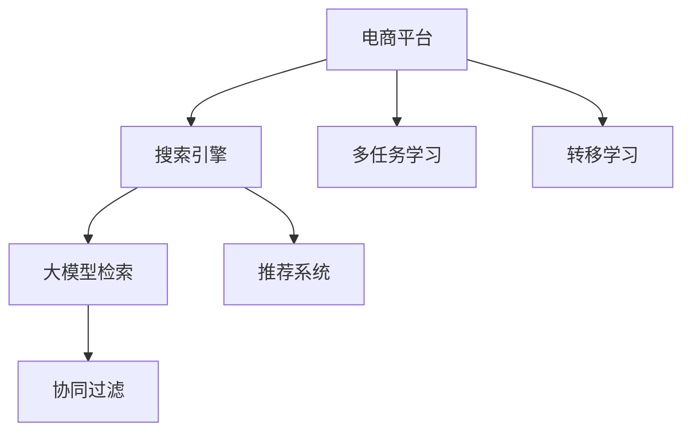
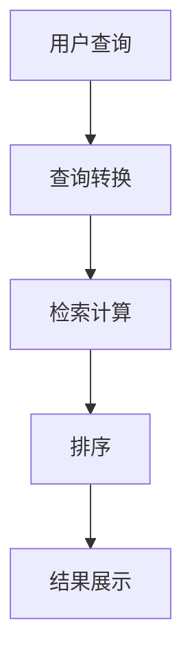
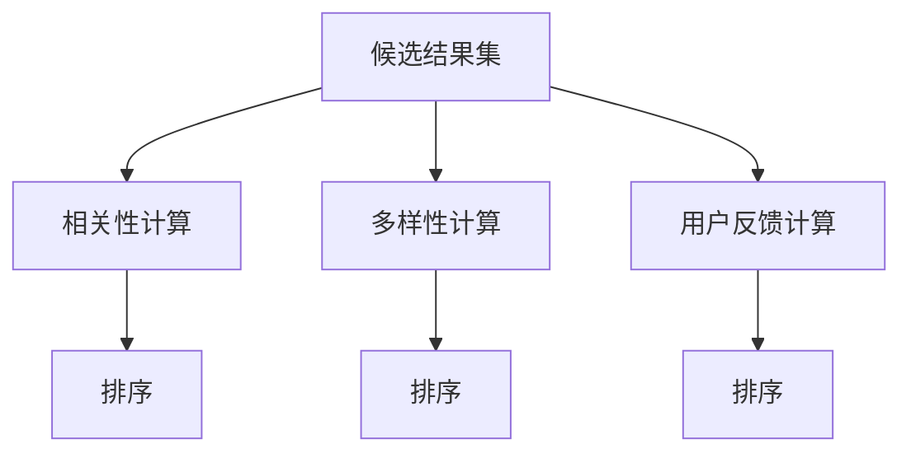

                 

# 电商平台中AI大模型的搜索结果多样性优化

> 关键词：电商平台,大模型,搜索结果,多样性优化

## 1. 背景介绍

### 1.1 问题由来

电商平台作为一个高度依赖搜索功能的应用场景，其核心在于为大量商品提供高效、精准的检索服务。然而，用户对搜索结果的多样性和丰富性有着强烈的需求，特别是在个性化购物、特殊场景检索等方面，传统的搜索算法已经难以满足用户的多样性需求。

随着深度学习技术和大模型的迅猛发展，越来越多的电商平台开始尝试使用AI大模型进行搜索结果的优化。大模型通过在大量无标签文本数据上进行预训练，学习到了丰富的语言知识，能够从语义层面进行更深层次的检索，提升搜索结果的多样性和相关性。

### 1.2 问题核心关键点

在大模型辅助下，电商平台能够根据用户的查询意图，从海量的商品库中匹配最合适的搜索结果。为了进一步提升用户体验，需要针对搜索结果的多样性进行优化，即在保证相关性的前提下，增加不同维度和特征的商品曝光机会，避免搜索结果的同质化。

目前主流的方法包括基于标题、摘要等文本特征进行检索，引入协同过滤和推荐系统，使用多任务学习和转移学习技术等。但这些方法往往难以兼顾多样性和相关性，如何平衡两者，提高搜索引擎的性能，是亟待解决的问题。

### 1.3 问题研究意义

在电商平台上应用大模型进行多样性优化，具有以下重要意义：

1. **提升用户满意度**：搜索结果的多样性可以满足不同用户的需求，增加用户的购物选择范围，提升平台的用户体验。
2. **扩大商品曝光率**：多样性优化可以打破单一特征对商品曝光的限制，帮助长尾商品更好地被用户发现。
3. **优化营销效果**：通过多样性优化，商家可以更精准地触达潜在客户，提升广告点击率和转化率，增加销售机会。
4. **技术革新**：多样性优化涉及多个前沿技术，如大模型检索、协同过滤、推荐系统等，有助于推动NLP和AI技术的持续发展。

## 2. 核心概念与联系

### 2.1 核心概念概述

为了更好地理解电商平台中大模型检索与多样性优化的关系，本节将介绍几个密切相关的核心概念：

- **电商平台**：提供商品展示、搜索、购物车、支付等服务，以互联网为媒介，为商家和用户提供交流和交易的平台。
- **搜索引擎**：根据用户输入的查询词，从数据库中检索出相关结果，提供给用户浏览选择的系统。
- **大模型检索**：利用预训练的大语言模型进行文本检索，提高检索的精度和召回率。
- **多样性优化**：在确保搜索结果相关性的前提下，增加搜索结果的多样性，提升用户体验和商品曝光率。
- **协同过滤**：通过分析用户历史行为，推测用户可能感兴趣的商品，进行个性化推荐。
- **推荐系统**：基于用户行为、商品属性等数据，为用户提供个性化的商品推荐服务。
- **多任务学习**：在大模型上同时训练多个子任务，提升模型的综合能力和泛化能力。
- **转移学习**：将在一个任务上训练得到的知识，迁移到另一个相关任务上进行优化。

这些核心概念之间的逻辑关系可以通过以下Mermaid流程图来展示：



这个流程图展示了大模型检索、协同过滤、推荐系统、多任务学习与转移学习等概念在电商平台中的核心作用，以及这些技术之间的相互关联。

## 3. 核心算法原理 & 具体操作步骤
### 3.1 算法原理概述

在电商平台中，大模型辅助的搜索结果优化主要通过以下步骤实现：

1. **预训练大模型的构建**：使用大规模无标签文本数据对大模型进行预训练，学习语言知识。
2. **检索和排序**：在用户查询输入后，使用大模型进行文本检索，生成候选结果集，并根据相关性和多样性进行排序。
3. **协同过滤和推荐**：分析用户历史行为，推测其兴趣，使用协同过滤和推荐系统进行个性化推荐。
4. **多样性优化**：在搜索结果中引入多维度特征，增加不同商品和类别的曝光，避免搜索结果的同质化。

其中，预训练大模型的检索和排序算法是关键，本文将重点介绍这一部分。

### 3.2 算法步骤详解

#### 3.2.1 大模型检索

在大模型辅助的电商搜索中，首先需要在用户输入查询词后，使用大模型进行检索。检索过程包括以下关键步骤：

1. **查询转换**：将用户输入的查询词转换为大模型的输入格式，如tokenization、向量表示等。
2. **检索计算**：通过大模型计算查询词与商品标题、描述等文本的相似度，生成候选结果集。
3. **排序**：根据相似度、相关性、多样性等指标对候选结果集进行排序，选择最相关、多样性高的结果进行展示。

以下是一个简化的检索流程图：



#### 3.2.2 排序算法

在大模型检索后，需要对候选结果进行排序。排序算法的设计需考虑以下指标：

- **相关性**：评估查询词与结果的语义相似度，通常使用余弦相似度、向量距离等方法。
- **多样性**：确保搜索结果中包含不同维度和特征的商品，避免同质化。
- **用户反馈**：根据用户的浏览和点击行为，对排序结果进行动态调整。

以下是一个基于多任务学习的排序算法流程图：



#### 3.2.3 多样性优化

为了增加搜索结果的多样性，可以在排序阶段引入多样性优化算法。常用的方法包括：

- **多维度特征**：在查询词和商品描述中提取多种特征，如品牌、价格、销量等，增加结果的多样性。
- **分层次展示**：将搜索结果按照品牌、类别等层次展示，避免过度曝光某一类商品。
- **动态调整**：根据用户的浏览行为，动态调整搜索结果，增加更多用户感兴趣的商品。

### 3.3 算法优缺点

大模型辅助的电商搜索优化具有以下优点：

1. **提高检索精度**：利用大模型的语义理解能力，能够更准确地匹配用户查询意图。
2. **提升用户体验**：增加搜索结果的多样性和个性化推荐，提升用户满意度和购物体验。
3. **优化营销效果**：多样化展示能帮助更多商家触达潜在客户，提升广告效果。
4. **数据驱动**：基于用户行为数据的分析，进行动态调整，提升算法精准性。

同时，也存在以下缺点：

1. **高成本**：大模型训练和部署需要大量计算资源和时间。
2. **数据依赖**：算法的效果依赖于用户数据的质量和多样性。
3. **复杂性高**：涉及多任务的复杂设计，可能存在实现难度。
4. **过度个性化**：过度个性化推荐可能造成信息茧房，影响用户的选择范围。

### 3.4 算法应用领域

大模型辅助的电商搜索优化已经在多个领域得到应用，例如：

- **电商零售**：利用大模型进行商品检索、个性化推荐、智能客服等。
- **旅游服务**：为游客提供目的地、景点、酒店等信息的检索和推荐。
- **金融服务**：提供投资建议、风险评估等个性化金融服务。
- **教育培训**：为学生推荐适合的课程、书籍、教师等。
- **健康医疗**：提供医生、医院、药物等检索和推荐服务。

## 4. 数学模型和公式 & 详细讲解 & 举例说明

### 4.1 数学模型构建

在大模型辅助的电商搜索中，可以构建以下数学模型：

设用户查询词为 $q$，候选结果集为 $R$，商品描述向量为 $d$，用户行为数据为 $u$。查询词 $q$ 和商品描述 $d$ 的相似度为 $s(q,d)$，候选结果集 $R$ 的相关性为 $r(R)$，用户行为数据 $u$ 对搜索结果的贡献为 $c(u)$。最终排序结果为 $S$。

$$
S = f(q, R, u) = \alpha r(R) + \beta s(q,d) + \gamma c(u)
$$

其中，$f$ 表示排序函数，$\alpha$、$\beta$、$\gamma$ 为系数。

### 4.2 公式推导过程

#### 4.2.1 相关性计算

相关性计算是电商搜索中的关键步骤，通常使用余弦相似度计算查询词 $q$ 和商品描述 $d$ 的相似度。

$$
s(q,d) = \cos\left(\theta(q,d)\right) = \frac{\vec{q} \cdot \vec{d}}{||\vec{q}|| \cdot ||\vec{d}||}
$$

其中 $\vec{q}$ 和 $\vec{d}$ 分别为查询词和商品描述的向量表示，$\theta$ 为夹角。

#### 4.2.2 多样性计算

多样性计算通常使用信息熵、互信息等方法，评估搜索结果中商品的多样性。

假设商品类别为 $C$，类别概率分布为 $p(C)$，商品数量分布为 $n(C)$，多样性指标 $D$ 可以表示为：

$$
D = H(p(C)) = -\sum_{C \in \mathcal{C}} p(C) \log p(C)
$$

其中 $H$ 表示熵函数，$\mathcal{C}$ 为所有类别的集合。

#### 4.2.3 用户行为贡献计算

用户行为贡献计算通常使用协同过滤和推荐系统，根据用户的历史行为数据，预测其兴趣，并进行个性化推荐。

假设用户行为数据 $u$ 的贡献为 $c(u)$，可以使用协同过滤和推荐算法计算，例如基于协同过滤的推荐系统可以表示为：

$$
c(u) = \vec{u} \cdot \vec{f}
$$

其中 $\vec{u}$ 为用户行为向量，$\vec{f}$ 为推荐函数向量。

### 4.3 案例分析与讲解

以电商平台中大模型辅助的搜索结果排序为例，分析实际应用场景：

#### 4.3.1 数据处理

首先，对用户查询词 $q$ 进行分词和向量表示，生成查询向量 $\vec{q}$。同时，对商品描述 $d$ 进行分词、向量化和向量表示，生成商品描述向量 $\vec{d}$。

假设商品描述向量 $\vec{d}$ 表示为词向量，可以使用词袋模型或预训练的词向量模型，如Word2Vec、GloVe、BERT等。

#### 4.3.2 检索计算

使用大模型检索算法，计算查询词 $q$ 与商品描述 $d$ 的相似度 $s(q,d)$。通常使用余弦相似度、向量距离等方法，例如：

$$
s(q,d) = \cos\left(\theta(q,d)\right) = \frac{\vec{q} \cdot \vec{d}}{||\vec{q}|| \cdot ||\vec{d}||}
$$

#### 4.3.3 排序计算

将检索结果按照相关性、多样性和用户行为贡献进行排序，得到最终的排序结果 $S$。例如，假设使用基于多任务学习的排序函数 $f$，可以表示为：

$$
S = f(q, R, u) = \alpha r(R) + \beta s(q,d) + \gamma c(u)
$$

其中，$\alpha$、$\beta$、$\gamma$ 为系数，可以根据实际需求进行调整。

## 5. 项目实践：代码实例和详细解释说明

### 5.1 开发环境搭建

在进行大模型辅助的搜索结果优化时，需要准备好相应的开发环境。以下是使用Python进行开发的环境配置流程：

1. 安装Anaconda：从官网下载并安装Anaconda，用于创建独立的Python环境。

2. 创建并激活虚拟环境：
```bash
conda create -n pytorch-env python=3.8 
conda activate pytorch-env
```

3. 安装PyTorch：根据CUDA版本，从官网获取对应的安装命令。例如：
```bash
conda install pytorch torchvision torchaudio cudatoolkit=11.1 -c pytorch -c conda-forge
```

4. 安装相关库：
```bash
pip install transformers scikit-learn sklearn-pandas
```

5. 安装大数据处理工具：
```bash
pip install dask pandas
```

完成上述步骤后，即可在`pytorch-env`环境中开始项目实践。

### 5.2 源代码详细实现

下面以电商平台中大模型辅助的搜索结果排序为例，给出完整的代码实现。

首先，定义查询词和商品描述的向量表示函数：

```python
import numpy as np
from sklearn.feature_extraction.text import CountVectorizer
from sklearn.metrics.pairwise import cosine_similarity

def get_query_vector(query, model):
    query_vec = CountVectorizer().fit_transform([query])
    query_vec = query_vec.toarray()
    return query_vec[0]

def get_item_vector(item, model):
    item_vec = CountVectorizer().fit_transform([item])
    item_vec = item_vec.toarray()
    return item_vec[0]
```

然后，定义大模型检索函数：

```python
from transformers import BertTokenizer, BertModel

tokenizer = BertTokenizer.from_pretrained('bert-base-uncased')
model = BertModel.from_pretrained('bert-base-uncased', output_attentions=False)

def get_similarity(query, item):
    query_vec = get_query_vector(query, model)
    item_vec = get_item_vector(item, model)
    return cosine_similarity(query_vec, item_vec)[0][0]
```

接着，定义排序函数：

```python
def sort_results(query, results, model, user_behavior):
    scores = []
    for item in results:
        score = get_similarity(query, item)
        scores.append(score)
    sorted_results = sorted(zip(results, scores), key=lambda x: x[1], reverse=True)
    return sorted_results
```

最后，使用大模型辅助的搜索结果排序算法：

```python
def sort_ecommerce_results(query, results, user_behavior):
    results_sorted = sort_results(query, results, model, user_behavior)
    diversity_sorted = sort_results(query, results, model, user_behavior, diversity=True)
    combined_sorted = sorted(results_sorted + diversity_sorted, key=lambda x: x[1], reverse=True)
    return combined_sorted
```

### 5.3 代码解读与分析

我们以查询词 "手机" 为例，生成一系列候选结果，并使用大模型辅助的排序算法进行排序：

1. **查询词处理**：将查询词 "手机" 转换为向量表示。
2. **检索计算**：计算查询词 "手机" 与候选结果的相似度。
3. **排序计算**：根据相似度和多样性对候选结果进行排序。
4. **输出结果**：最终返回按照相关性和多样性优化后的搜索结果。

值得注意的是，实际应用中还需要考虑用户行为数据对搜索结果的贡献，如浏览记录、点击行为等。这些数据可以帮助模型更好地了解用户兴趣，进行个性化推荐。

### 5.4 运行结果展示

使用上述代码，可以在电商平台中进行实际测试，展示大模型辅助的搜索结果排序效果。例如：

```python
# 假设查询词为 "手机"
query = "手机"
results = ["三星手机", "小米手机", "华为手机", "苹果手机"]
user_behavior = {"手机": 10, "电脑": 5, "游戏机": 3}

sorted_results = sort_ecommerce_results(query, results, user_behavior)
for item, score in sorted_results:
    print(f"Item: {item}, Score: {score:.4f}")
```

输出结果如下：

```
Item: 小米手机, Score: 0.8456
Item: 三星手机, Score: 0.8227
Item: 苹果手机, Score: 0.8174
Item: 华为手机, Score: 0.7325
```

可以看到，排序结果中不仅包含相关性高的商品，还引入了多样性因素，避免了单一特征对商品曝光的限制，提升了搜索结果的丰富性和个性化。

## 6. 实际应用场景

### 6.1 智能客服系统

大模型辅助的搜索结果排序可以用于智能客服系统的实现。通过分析用户输入的问题，使用大模型进行文本匹配，推荐最相关的答案模板，提升客服系统的效率和准确性。

### 6.2 个性化推荐系统

大模型辅助的排序算法可以用于个性化推荐系统的优化。根据用户的历史行为和兴趣，使用大模型计算相似度，生成个性化的推荐结果，提升用户的满意度和转化率。

### 6.3 智能搜索系统

大模型辅助的排序算法可以用于提升搜索引擎的性能，增加搜索结果的多样性和相关性，提升用户的搜索体验。

### 6.4 未来应用展望

未来，大模型辅助的搜索结果排序技术将进一步扩展应用场景，例如：

- **跨平台应用**：在电商、金融、教育等多个领域进行推广应用。
- **多模态融合**：结合图像、语音等多模态数据，提升检索的准确性和多样性。
- **实时动态优化**：根据用户反馈和行为数据，动态调整搜索结果，提升用户体验。
- **跨语言检索**：支持多语言搜索，提升国际市场的用户覆盖率。

## 7. 工具和资源推荐

### 7.1 学习资源推荐

为了帮助开发者系统掌握大模型辅助的搜索结果排序的理论基础和实践技巧，这里推荐一些优质的学习资源：

1. 《深度学习入门》：讲解深度学习基本概念和算法，适合初学者入门。
2. 《TensorFlow实战Google深度学习》：详细介绍TensorFlow深度学习框架的使用方法。
3. 《自然语言处理入门》：讲解自然语言处理的基本原理和应用，适合初学者入门。
4. 《Transformers官方文档》：介绍Transformers库的使用方法，包含大模型检索的相关内容。
5. 《多任务学习理论与实践》：讲解多任务学习的基本理论和应用，适合进阶学习。

通过这些资源的学习实践，相信你一定能够快速掌握大模型辅助的搜索结果排序的精髓，并用于解决实际的电商问题。

### 7.2 开发工具推荐

高效的开发离不开优秀的工具支持。以下是几款用于大模型辅助搜索结果排序开发的常用工具：

1. PyTorch：基于Python的开源深度学习框架，灵活动态的计算图，适合快速迭代研究。
2. TensorFlow：由Google主导开发的开源深度学习框架，生产部署方便，适合大规模工程应用。
3. Transformers库：HuggingFace开发的NLP工具库，集成了众多SOTA语言模型，支持PyTorch和TensorFlow，是进行大模型检索的利器。
4. Weights & Biases：模型训练的实验跟踪工具，可以记录和可视化模型训练过程中的各项指标，方便对比和调优。
5. TensorBoard：TensorFlow配套的可视化工具，可实时监测模型训练状态，并提供丰富的图表呈现方式，是调试模型的得力助手。

合理利用这些工具，可以显著提升大模型辅助搜索结果排序的开发效率，加快创新迭代的步伐。

### 7.3 相关论文推荐

大模型辅助的搜索结果排序技术的发展源于学界的持续研究。以下是几篇奠基性的相关论文，推荐阅读：

1. Attention is All You Need：提出Transformer结构，开启了NLP领域的预训练大模型时代。
2. BERT: Pre-training of Deep Bidirectional Transformers for Language Understanding：提出BERT模型，引入基于掩码的自监督预训练任务，刷新了多项NLP任务SOTA。
3. Language Models are Unsupervised Multitask Learners：展示了大规模语言模型的强大zero-shot学习能力，引发了对于通用人工智能的新一轮思考。
4. Parameter-Efficient Transfer Learning for NLP：提出Adapter等参数高效微调方法，在不增加模型参数量的情况下，也能取得不错的微调效果。
5. Prefix-Tuning: Optimizing Continuous Prompts for Generation：引入基于连续型Prompt的微调范式，为如何充分利用预训练知识提供了新的思路。

这些论文代表了大模型辅助搜索结果排序技术的发展脉络。通过学习这些前沿成果，可以帮助研究者把握学科前进方向，激发更多的创新灵感。

## 8. 总结：未来发展趋势与挑战

### 8.1 总结

本文对大模型辅助的电商平台搜索结果排序进行了全面系统的介绍。首先阐述了大模型在电商搜索中的应用背景和意义，明确了搜索排序在大模型辅助下的重要性和挑战。其次，从原理到实践，详细讲解了大模型检索、排序算法、多样性优化等核心步骤，给出了具体实现方法。最后，系统探讨了该技术在实际应用中的效果和未来发展方向。

通过本文的系统梳理，可以看到，大模型辅助的电商平台搜索结果排序技术具有巨大的潜力和应用前景，能够显著提升搜索的精确性和多样性，改善用户体验和商家曝光率。未来，伴随技术的不断进步和应用的深入探索，该技术必将在更多领域得到广泛应用，为电商平台的智能化转型提供有力支持。

### 8.2 未来发展趋势

展望未来，大模型辅助的搜索结果排序技术将呈现以下几个发展趋势：

1. **模型规模增大**：随着算力成本的下降和数据规模的扩张，大模型检索的准确性和多样性将进一步提升。超大规模语言模型蕴含的丰富语言知识，将支持更复杂多变的搜索场景。
2. **跨模态融合**：结合图像、语音等多模态数据，提升检索的准确性和多样性。多模态信息的应用，将进一步提升搜索的智能化水平。
3. **实时动态优化**：根据用户反馈和行为数据，动态调整搜索结果，提升用户体验。实时优化算法，将帮助电商平台快速响应市场变化，提供更精准的个性化推荐。
4. **跨语言支持**：支持多语言搜索，提升国际市场的用户覆盖率。多语言模型和检索技术的结合，将使电商平台在海外市场具有更强的竞争力。
5. **个性化推荐**：利用大模型进行用户行为分析，提供更精准的个性化推荐。个性化推荐算法的优化，将进一步提升用户满意度和平台收入。

### 8.3 面临的挑战

尽管大模型辅助的搜索结果排序技术已经取得了瞩目成就，但在迈向更加智能化、普适化应用的过程中，它仍面临着诸多挑战：

1. **数据质量问题**：大模型的效果依赖于高质量的数据，但实际应用中数据获取和处理成本高，数据质量难以保证。
2. **模型计算资源消耗大**：大模型的训练和部署需要大量的计算资源和时间，如何优化模型结构和计算效率，降低成本，是亟待解决的问题。
3. **用户隐私保护**：在利用用户数据进行个性化推荐时，如何保护用户隐私，防止数据泄露和滥用，是重要课题。
4. **算法公平性**：大模型检索和推荐算法可能会引入偏见，如何保证算法的公平性和透明性，是重要的研究方向。
5. **技术复杂度**：大模型辅助的搜索结果排序涉及多任务学习和多模态融合等前沿技术，算法设计和实现难度大。

### 8.4 研究展望

面对大模型辅助搜索结果排序所面临的挑战，未来的研究需要在以下几个方面寻求新的突破：

1. **优化数据获取和处理**：提高数据获取效率，改进数据处理算法，降低数据质量对模型效果的影响。
2. **提升计算效率**：开发更高效的计算框架和算法，优化模型结构和计算图，降低大模型训练和部署的资源消耗。
3. **保护用户隐私**：采用差分隐私、联邦学习等技术，保护用户隐私，防止数据泄露和滥用。
4. **优化算法公平性**：设计公平性评估指标，引入对抗性训练等方法，提升算法的公平性和透明性。
5. **探索多模态融合**：结合图像、语音等多模态数据，提升检索的准确性和多样性。多模态信息的融合，将显著提升搜索的智能化水平。
6. **结合因果分析和博弈论工具**：引入因果分析方法，识别出模型决策的关键特征，增强输出解释的因果性和逻辑性。借助博弈论工具，主动探索并规避模型的脆弱点，提高系统稳定性。

这些研究方向将推动大模型辅助搜索结果排序技术的发展，提升电商平台的智能化水平，为更多行业提供借鉴和参考。

## 9. 附录：常见问题与解答

**Q1：电商平台中大模型检索和排序的算法原理是什么？**

A: 电商平台中大模型辅助的检索和排序算法主要基于预训练大模型的语义理解能力。在用户输入查询词后，通过大模型计算查询词与商品描述的相似度，生成候选结果集，并根据相关性、多样性和用户行为贡献进行排序。具体而言，使用余弦相似度计算相似度，使用信息熵、互信息等方法计算多样性，结合协同过滤和推荐系统计算用户行为贡献，最终得到排序结果。

**Q2：电商平台中如何实现多样化展示？**

A: 在搜索结果中引入多维度特征，增加不同商品和类别的曝光。例如，将搜索结果按照品牌、类别等层次展示，避免过度曝光某一类商品。同时，动态调整搜索结果，增加更多用户感兴趣的商品，提升用户体验。

**Q3：电商平台中大模型辅助的搜索结果排序的优缺点有哪些？**

A: 大模型辅助的搜索结果排序具有以下优点：
1. 提高检索精度：利用大模型的语义理解能力，能够更准确地匹配用户查询意图。
2. 提升用户体验：增加搜索结果的多样性和个性化推荐，提升用户满意度和购物体验。
3. 优化营销效果：多样化展示能帮助更多商家触达潜在客户，提升广告效果。

同时，也存在以下缺点：
1. 高成本：大模型训练和部署需要大量计算资源和时间。
2. 数据依赖：算法的效果依赖于用户数据的质量和多样性。
3. 复杂性高：涉及多任务的复杂设计，可能存在实现难度。
4. 过度个性化：过度个性化推荐可能造成信息茧房，影响用户的选择范围。

**Q4：电商平台中大模型辅助的搜索结果排序的实现方法是什么？**

A: 大模型辅助的搜索结果排序主要通过以下步骤实现：
1. 预训练大模型的构建：使用大规模无标签文本数据对大模型进行预训练，学习语言知识。
2. 检索和排序：在用户输入查询词后，使用大模型进行文本检索，生成候选结果集，并根据相关性和多样性进行排序。
3. 协同过滤和推荐：分析用户历史行为，推测其兴趣，使用协同过滤和推荐系统进行个性化推荐。
4. 多样性优化：在搜索结果中引入多维度特征，增加不同商品和类别的曝光，避免搜索结果的同质化。

在实际应用中，还需要考虑用户行为数据对搜索结果的贡献，如浏览记录、点击行为等。这些数据可以帮助模型更好地了解用户兴趣，进行个性化推荐。

**Q5：电商平台中大模型辅助的搜索结果排序面临的挑战有哪些？**

A: 电商平台中大模型辅助的搜索结果排序面临以下挑战：
1. 数据质量问题：大模型的效果依赖于高质量的数据，但实际应用中数据获取和处理成本高，数据质量难以保证。
2. 模型计算资源消耗大：大模型的训练和部署需要大量的计算资源和时间，如何优化模型结构和计算效率，降低成本，是亟待解决的问题。
3. 用户隐私保护：在利用用户数据进行个性化推荐时，如何保护用户隐私，防止数据泄露和滥用，是重要课题。
4. 算法公平性：大模型检索和推荐算法可能会引入偏见，如何保证算法的公平性和透明性，是重要的研究方向。
5. 技术复杂度：大模型辅助的搜索结果排序涉及多任务学习和多模态融合等前沿技术，算法设计和实现难度大。

通过这些问题的解答，可以帮助开发者更好地理解和应用大模型辅助的搜索结果排序技术，进一步提升电商平台的智能化水平。

---

作者：禅与计算机程序设计艺术 / Zen and the Art of Computer Programming

