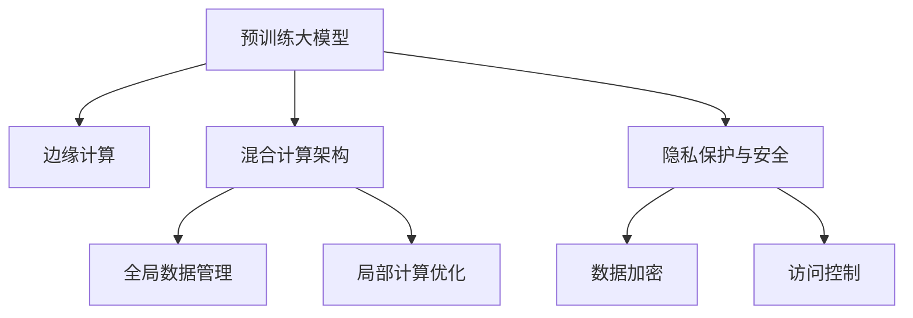

                 

# 电商平台中的AI大模型与边缘计算结合

## 1. 背景介绍

### 1.1 问题由来
随着电子商务的飞速发展，电商平台面临着日益增长的用户需求、复杂的产品管理、高效的物流配送等多方面的挑战。AI技术在电商平台的诸多环节中得到了广泛应用，如推荐系统、搜索排序、用户行为分析等，显著提升了电商平台的运营效率和用户体验。

近年来，预训练大模型如BERT、GPT-3等在自然语言处理(NLP)领域取得了突破性进展，具备了强大的语言理解和生成能力。而随着物联网和移动设备的普及，边缘计算技术在电商平台的线上线下一体化、实时计算等方面也展示了巨大潜力。

然而，大模型的高计算复杂度和数据需求，以及边缘计算资源有限的现状，限制了其在电商平台的全面应用。如何在电商平台中实现大模型的高效部署和边缘计算的合理利用，成为亟待解决的问题。

### 1.2 问题核心关键点
本文聚焦于如何将大模型和边缘计算相结合，应用于电商平台，实现高效、智能的用户交互和服务响应。具体关键点包括：

1. **大模型高效部署**：如何在大规模数据上训练和部署大模型，保证其在大规模数据上的性能，同时减少部署复杂度。
2. **边缘计算优化**：如何利用边缘计算靠近用户、低延迟、可扩展的特点，提升电商平台的实时响应能力。
3. **混合计算架构**：如何将中心化和边缘计算资源相结合，构建混合计算架构，实现数据本地化处理和全局一致性的平衡。
4. **隐私与安全**：如何在数据处理和模型训练过程中保护用户隐私，同时保证模型的安全性。

## 2. 核心概念与联系

### 2.1 核心概念概述

为更好地理解大模型与边缘计算在电商平台中的应用，本节将介绍几个核心概念：

- **预训练大模型(Pre-trained Large Models)**：指在大规模无标签数据上训练得到的通用语言模型，如BERT、GPT等，具备强大的语言理解和生成能力。
- **边缘计算(Edge Computing)**：指在靠近用户端的数据中心、移动设备等边缘设备上，就近处理数据的计算模式。通过将计算任务分散到边缘设备上，可以显著降低网络延迟，提升实时性。
- **混合计算架构(Hybrid Computing Architecture)**：指结合中心化计算和边缘计算的计算模式，实现全局数据管理与局部计算的统一。
- **隐私保护与安全(Privacy and Security)**：指在数据处理和模型训练过程中，采取加密、匿名化、访问控制等手段，保护用户隐私，防止数据泄露和模型滥用。

这些核心概念之间的逻辑关系可以通过以下Mermaid流程图来展示：



这个流程图展示了大模型、边缘计算、混合计算架构以及隐私保护与安全之间的联系：

1. 大模型通过预训练获得基础能力，并在边缘计算设备上进行本地优化。
2. 混合计算架构实现了全局和局部的计算资源协同，提升了整体系统性能。
3. 隐私保护与安全措施保障了数据处理和模型训练中的隐私和安全性。

## 3. 核心算法原理 & 具体操作步骤

### 3.1 算法原理概述

在电商平台中结合大模型与边缘计算，本质上是一个分布式计算和优化问题。其核心思想是：利用大模型强大的语言理解能力，在边缘设备上进行实时计算和推理，以提升用户体验和系统响应速度。

具体而言，可以分为以下几个步骤：

1. **数据预处理**：在中心化数据中心对用户数据进行预处理和标注，将数据分发到边缘设备上。
2. **模型部署与优化**：在边缘设备上部署大模型，利用混合计算架构进行全局数据管理和局部计算优化。
3. **实时计算与推理**：利用边缘设备进行实时计算和推理，直接响应用户请求，提供高效服务。
4. **反馈与迭代**：收集用户反馈，对模型进行持续优化和迭代，提升服务质量。

### 3.2 算法步骤详解

#### 3.2.1 数据预处理与标注
- **数据收集**：从电商平台收集用户行为数据，包括浏览历史、搜索记录、购买记录等。
- **数据清洗**：清洗数据中的噪声和异常，确保数据质量。
- **数据标注**：根据用户的兴趣、行为等信息，标注出相应的标签，如产品类别、推荐评分等。
- **数据分布**：将数据分布到边缘设备上，如IoT设备、移动端等。

#### 3.2.2 模型部署与优化
- **模型加载**：在边缘设备上加载大模型，通常采用压缩和分片技术，减小模型体积，便于部署。
- **模型优化**：在边缘设备上进行模型微调，如参数剪枝、量化、混合精度训练等，提高模型效率。
- **资源分配**：根据边缘设备的计算能力和网络带宽，合理分配计算任务，优化资源使用。

#### 3.2.3 实时计算与推理
- **实时数据采集**：从边缘设备上实时采集用户请求数据。
- **数据预处理**：对用户请求进行预处理，如分词、特征提取等。
- **模型推理**：将处理后的数据输入大模型进行推理，得到预测结果。
- **结果反馈**：将推理结果反馈给用户，进行服务响应。

#### 3.2.4 反馈与迭代
- **用户反馈收集**：收集用户的反馈，如满意度、评论等。
- **模型优化**：根据用户反馈，调整大模型的参数，优化模型性能。
- **持续迭代**：通过持续的模型优化和数据更新，提升服务质量，实现模型自适应。

### 3.3 算法优缺点

结合大模型与边缘计算的方法，在电商平台中具有以下优点：

1. **高效实时响应**：通过在边缘设备上进行实时计算和推理，大幅减少网络延迟，提升服务响应速度。
2. **数据本地化处理**：数据本地化处理可降低数据传输带宽和延迟，提升系统效率。
3. **分布式计算优化**：结合中心化和边缘计算，实现全局与局部的协同优化，提升系统整体性能。
4. **隐私保护**：数据在本地处理可减少数据传输和存储风险，保护用户隐私。

同时，该方法也存在一些局限性：

1. **边缘计算资源有限**：边缘计算设备计算能力有限，可能无法处理大规模复杂计算任务。
2. **模型泛化能力不足**：边缘设备上的模型可能存在过拟合问题，泛化能力较弱。
3. **模型更新成本高**：模型更新需要重新分发和部署，成本较高。
4. **安全性风险**：边缘设备上的模型可能面临硬件和软件攻击，安全风险较高。

尽管存在这些局限性，但通过合理设计架构和优化算法，可以最大化利用大模型与边缘计算的优势，实现高效、智能的用户交互和服务响应。

### 3.4 算法应用领域

结合大模型与边缘计算的方法，在电商平台中可以应用于多个领域，如：

- **推荐系统**：利用大模型的语言理解能力，在边缘设备上进行实时推荐，提升推荐准确性和实时性。
- **搜索排序**：通过在边缘设备上进行快速搜索和排序，提升用户搜索体验。
- **智能客服**：通过边缘设备上的大模型，实时解答用户疑问，提升客户服务效率。
- **库存管理**：利用大模型进行需求预测，在边缘设备上进行库存优化，提升库存管理效率。
- **反欺诈检测**：在边缘设备上实时检测用户行为异常，防止欺诈行为，保障交易安全。

除了这些主要领域，大模型与边缘计算结合的方法还可应用于物流配送、广告投放、个性化营销等多个电商环节，为电商平台带来更加智能、高效的用户体验。

## 4. 数学模型和公式 & 详细讲解

### 4.1 数学模型构建

在电商平台中结合大模型与边缘计算，涉及的数学模型主要包括：

- **推荐系统模型**：基于用户行为数据和产品特征，预测用户对产品的评分。
- **搜索排序模型**：根据用户查询和产品信息，排序搜索结果。
- **智能客服模型**：基于用户查询，生成自然语言回答。
- **库存管理模型**：根据历史销售数据和市场预测，优化库存。
- **反欺诈检测模型**：基于用户行为数据，检测异常交易。

以推荐系统为例，假设推荐系统的输入为 $x \in \mathbb{R}^d$，输出为 $y \in \{0, 1\}$，其中 $x$ 为用户行为数据，$y$ 为推荐评分。推荐系统的目标是最小化预测误差：

$$
\mathcal{L}(w) = \frac{1}{N}\sum_{i=1}^N \ell(y_i, f_w(x_i))
$$

其中 $w$ 为模型参数，$f_w(x)$ 为模型预测函数，$\ell$ 为损失函数，通常使用二分类交叉熵损失。

### 4.2 公式推导过程

推荐系统模型的目标是最小化预测误差 $\mathcal{L}(w)$。对于二分类任务，可以使用二分类交叉熵损失函数：

$$
\ell(y, \hat{y}) = -[y\log \hat{y} + (1-y)\log (1-\hat{y})]
$$

其中 $\hat{y}$ 为模型的预测值。将损失函数扩展到整个数据集上：

$$
\mathcal{L}(w) = \frac{1}{N}\sum_{i=1}^N \ell(y_i, f_w(x_i))
$$

其中 $f_w(x)$ 为模型预测函数，通常使用 sigmoid 函数：

$$
f_w(x) = \sigma(w^T x)
$$

其中 $w^T x$ 为模型输入 $x$ 与模型参数 $w$ 的线性映射。

通过梯度下降等优化算法，求解最小化损失函数的目标：

$$
\frac{\partial \mathcal{L}(w)}{\partial w} = -\frac{1}{N}\sum_{i=1}^N \frac{\partial \ell(y_i, f_w(x_i))}{\partial w}
$$

计算梯度后，更新模型参数 $w$：

$$
w \leftarrow w - \eta \frac{\partial \mathcal{L}(w)}{\partial w}
$$

其中 $\eta$ 为学习率。

### 4.3 案例分析与讲解

假设我们有一个电商平台，需要利用大模型与边缘计算进行推荐系统优化。具体步骤如下：

1. **数据收集与预处理**：从电商平台收集用户行为数据，清洗和标注数据。
2. **模型加载与优化**：在边缘设备上加载BERT等大模型，进行参数剪枝和量化优化，减小模型体积。
3. **实时计算与推理**：实时采集用户请求，将请求输入边缘设备上的大模型，进行预测和排序，生成推荐结果。
4. **反馈与迭代**：收集用户反馈，调整模型参数，进行持续优化。

通过以上步骤，可以在边缘设备上高效部署大模型，提升推荐系统的实时性和准确性。

## 5. 项目实践：代码实例和详细解释说明

### 5.1 开发环境搭建

在进行项目实践前，我们需要准备好开发环境。以下是使用Python进行PyTorch开发的环境配置流程：

1. 安装Anaconda：从官网下载并安装Anaconda，用于创建独立的Python环境。

2. 创建并激活虚拟环境：
```bash
conda create -n pytorch-env python=3.8 
conda activate pytorch-env
```

3. 安装PyTorch：根据CUDA版本，从官网获取对应的安装命令。例如：
```bash
conda install pytorch torchvision torchaudio cudatoolkit=11.1 -c pytorch -c conda-forge
```

4. 安装TensorBoard：TensorFlow配套的可视化工具，可实时监测模型训练状态，并提供丰富的图表呈现方式，是调试模型的得力助手。
```bash
pip install tensorboard
```

5. 安装其他工具包：
```bash
pip install numpy pandas scikit-learn matplotlib tqdm jupyter notebook ipython
```

完成上述步骤后，即可在`pytorch-env`环境中开始项目实践。

### 5.2 源代码详细实现

下面是使用PyTorch对推荐系统进行大模型与边缘计算结合的代码实现：

```python
import torch
from transformers import BertForSequenceClassification, BertTokenizer

# 数据预处理与标注
tokenizer = BertTokenizer.from_pretrained('bert-base-uncased')
train_dataset = ...

# 模型加载与优化
model = BertForSequenceClassification.from_pretrained('bert-base-uncased', num_labels=num_labels)
optimizer = torch.optim.Adam(model.parameters(), lr=learning_rate)
model.to(device)
...

# 实时计算与推理
def predict(user_input):
    # 对用户输入进行预处理
    encoded_input = tokenizer(user_input, return_tensors='pt', padding=True)
    input_ids = encoded_input['input_ids'].to(device)
    attention_mask = encoded_input['attention_mask'].to(device)
    
    # 在边缘设备上进行模型推理
    with torch.no_grad():
        logits = model(input_ids, attention_mask=attention_mask)[0]
    
    # 将推理结果解码为标签
    labels = torch.softmax(logits, dim=1)
    label = labels.argmax().item()
    
    return label
```

### 5.3 代码解读与分析

让我们再详细解读一下关键代码的实现细节：

**数据预处理与标注**：
- 使用BertTokenizer对用户输入进行分词和编码，生成模型所需的输入格式。

**模型加载与优化**：
- 加载预训练的BERT模型，设置学习率等优化参数。
- 将模型迁移到GPU或TPU等设备上，进行推理计算。

**实时计算与推理**：
- 定义`predict`函数，对用户输入进行预处理，生成模型所需的输入。
- 在边缘设备上使用模型进行推理，得到预测结果。
- 将预测结果解码为标签，返回推荐评分。

通过以上步骤，我们可以在边缘设备上实现大模型的实时计算和推理，提升推荐系统的响应速度和准确性。

## 6. 实际应用场景

### 6.1 智能推荐系统

结合大模型与边缘计算的推荐系统，可以大幅提升推荐效果和实时响应速度。具体场景包括：

- **商品推荐**：根据用户历史购买和浏览行为，实时推荐相关商品，提升用户转化率。
- **活动推荐**：实时推荐促销活动、优惠券等，提高用户参与度。
- **个性化推荐**：根据用户兴趣，实时推荐个性化内容，提升用户体验。

### 6.2 实时搜索排序

利用边缘计算的实时性和本地化处理能力，可以在搜索排序环节显著提升响应速度。具体场景包括：

- **即时搜索**：根据用户输入的关键词，实时提供搜索结果，提高搜索效率。
- **智能排序**：根据用户行为和产品信息，实时调整搜索结果排序，提升搜索质量。

### 6.3 智能客服

结合大模型与边缘计算的智能客服系统，可以提供24小时不间断的用户服务，提升客户满意度。具体场景包括：

- **自动回答**：根据用户查询，自动生成自然语言回答，提高客服效率。
- **情感分析**：分析用户情绪，进行情绪引导和心理疏导，提升用户体验。

### 6.4 未来应用展望

随着大模型与边缘计算技术的不断发展，未来在电商平台中的应用将更加广泛，带来更多的创新和突破。

1. **多模态融合**：将图像、语音等多模态数据与文本数据融合，提升电商平台的综合体验。
2. **跨平台协同**：通过边缘计算的分布式协同计算，实现不同平台间的无缝对接。
3. **实时数据处理**：结合流式计算技术，实时处理和分析电商平台数据，提升决策效率。
4. **个性化推荐引擎**：构建更加复杂、精准的推荐引擎，提升用户满意度和留存率。

未来，大模型与边缘计算结合的方法将在电商平台中发挥更大的作用，推动电商行业的数字化转型和智能化升级。

## 7. 工具和资源推荐

### 7.1 学习资源推荐

为了帮助开发者系统掌握大模型与边缘计算在电商平台中的应用，这里推荐一些优质的学习资源：

1. 《Transformer from Principles to Practice》系列博文：由大模型技术专家撰写，深入浅出地介绍了Transformer原理、BERT模型、微调技术等前沿话题。
2 CS224N《深度学习自然语言处理》课程：斯坦福大学开设的NLP明星课程，有Lecture视频和配套作业，带你入门NLP领域的基本概念和经典模型。
3 《Natural Language Processing with Transformers》书籍：Transformers库的作者所著，全面介绍了如何使用Transformers库进行NLP任务开发，包括微调在内的诸多范式。
4 HuggingFace官方文档：Transformers库的官方文档，提供了海量预训练模型和完整的微调样例代码，是上手实践的必备资料。
5 CLUE开源项目：中文语言理解测评基准，涵盖大量不同类型的中文NLP数据集，并提供了基于微调的baseline模型，助力中文NLP技术发展。

通过对这些资源的学习实践，相信你一定能够快速掌握大模型与边缘计算在电商平台中的应用，并用于解决实际的NLP问题。

### 7.2 开发工具推荐

高效的开发离不开优秀的工具支持。以下是几款用于大模型与边缘计算在电商平台中应用的常用工具：

1. PyTorch：基于Python的开源深度学习框架，灵活动态的计算图，适合快速迭代研究。大部分预训练语言模型都有PyTorch版本的实现。
2 TensorFlow：由Google主导开发的开源深度学习框架，生产部署方便，适合大规模工程应用。同样有丰富的预训练语言模型资源。
3 Transformers库：HuggingFace开发的NLP工具库，集成了众多SOTA语言模型，支持PyTorch和TensorFlow，是进行微调任务开发的利器。
4 Weights & Biases：模型训练的实验跟踪工具，可以记录和可视化模型训练过程中的各项指标，方便对比和调优。与主流深度学习框架无缝集成。
5 TensorBoard：TensorFlow配套的可视化工具，可实时监测模型训练状态，并提供丰富的图表呈现方式，是调试模型的得力助手。
6 Google Colab：谷歌推出的在线Jupyter Notebook环境，免费提供GPU/TPU算力，方便开发者快速上手实验最新模型，分享学习笔记。

合理利用这些工具，可以显著提升大模型与边缘计算在电商平台中的开发效率，加快创新迭代的步伐。

### 7.3 相关论文推荐

大模型与边缘计算的发展源于学界的持续研究。以下是几篇奠基性的相关论文，推荐阅读：

1. Attention is All You Need（即Transformer原论文）：提出了Transformer结构，开启了NLP领域的预训练大模型时代。
2. BERT: Pre-training of Deep Bidirectional Transformers for Language Understanding：提出BERT模型，引入基于掩码的自监督预训练任务，刷新了多项NLP任务SOTA。
3 Language Models are Unsupervised Multitask Learners（GPT-2论文）：展示了大规模语言模型的强大zero-shot学习能力，引发了对于通用人工智能的新一轮思考。
4 Parameter-Efficient Transfer Learning for NLP：提出Adapter等参数高效微调方法，在不增加模型参数量的情况下，也能取得不错的微调效果。
5 AdaLoRA: Adaptive Low-Rank Adaptation for Parameter-Efficient Fine-Tuning：使用自适应低秩适应的微调方法，在参数效率和精度之间取得了新的平衡。
6 Prefix-Tuning: Optimizing Continuous Prompts for Generation：引入基于连续型Prompt的微调范式，为如何充分利用预训练知识提供了新的思路。

这些论文代表了大模型与边缘计算的发展脉络。通过学习这些前沿成果，可以帮助研究者把握学科前进方向，激发更多的创新灵感。

## 8. 总结：未来发展趋势与挑战

### 8.1 总结

本文对大模型与边缘计算在电商平台中的应用进行了全面系统的介绍。首先阐述了大模型与边缘计算在电商平台中的背景和意义，明确了其在推荐系统、搜索排序、智能客服等多个环节的应用价值。其次，从原理到实践，详细讲解了大模型与边缘计算的数学模型和实现细节，给出了项目实践的完整代码实例。同时，本文还广泛探讨了大模型与边缘计算在电商平台中的应用场景和未来展望，展示了其在电商领域的应用潜力。最后，精选了相关学习资源和开发工具，力求为开发者提供全方位的技术指引。

通过本文的系统梳理，可以看到，大模型与边缘计算结合的方法正在成为电商平台的重要范式，极大地提升了电商平台的运营效率和用户体验。未来，随着大模型与边缘计算技术的不断发展，必将在更多领域得到应用，为电商行业带来更加智能、高效的用户体验。

### 8.2 未来发展趋势

展望未来，大模型与边缘计算在电商平台中的应用将呈现以下几个发展趋势：

1. **计算资源扩展**：随着边缘计算设备的计算能力和存储能力的提升，更多复杂计算任务将能在本地完成，减少对中心化计算的依赖。
2. **实时数据处理**：结合流式计算技术，实时处理和分析电商平台数据，提升决策效率。
3. **个性化推荐引擎**：构建更加复杂、精准的推荐引擎，提升用户满意度和留存率。
4. **跨平台协同**：通过边缘计算的分布式协同计算，实现不同平台间的无缝对接。
5. **多模态融合**：将图像、语音等多模态数据与文本数据融合，提升电商平台的综合体验。
6. **安全性增强**：引入更多隐私保护和安全技术，确保用户数据和模型安全。

以上趋势凸显了大模型与边缘计算在电商平台中的广阔前景。这些方向的探索发展，必将进一步提升电商平台的性能和服务质量，为电商行业带来新的变革。

### 8.3 面临的挑战

尽管大模型与边缘计算在电商平台中已经取得了一定成果，但在迈向更加智能化、普适化应用的过程中，仍面临以下挑战：

1. **边缘计算资源有限**：边缘计算设备计算能力有限，可能无法处理大规模复杂计算任务。
2. **模型泛化能力不足**：边缘设备上的模型可能存在过拟合问题，泛化能力较弱。
3. **模型更新成本高**：模型更新需要重新分发和部署，成本较高。
4. **安全性风险**：边缘设备上的模型可能面临硬件和软件攻击，安全风险较高。
5. **数据传输瓶颈**：边缘设备与中心化数据中心的通信带宽有限，可能影响实时计算性能。

尽管存在这些挑战，但通过合理设计架构和优化算法，可以最大化利用大模型与边缘计算的优势，实现高效、智能的用户交互和服务响应。

### 8.4 研究展望

面对大模型与边缘计算在电商平台中面临的挑战，未来的研究需要在以下几个方面寻求新的突破：

1. **参数高效微调**：开发更加参数高效的微调方法，如Adapter、LoRA等，在固定大部分预训练参数的同时，只更新极少量的任务相关参数。
2. **混合计算优化**：结合中心化和边缘计算，实现全局与局部的协同优化，提升系统整体性能。
3. **数据本地化处理**：优化数据预处理和本地化处理算法，提高数据传输效率和实时计算性能。
4. **安全隐私保护**：引入更多隐私保护和安全技术，确保用户数据和模型安全。

这些研究方向的探索，必将引领大模型与边缘计算在电商平台中的应用走向更高的台阶，为电商行业带来更加智能、高效的用户体验。

## 9. 附录：常见问题与解答

**Q1：在电商平台上部署大模型和边缘计算需要哪些资源？**

A: 在电商平台上部署大模型和边缘计算需要以下资源：
1. 计算资源：边缘计算设备，如IoT设备、移动端等，需要具备一定的计算能力和存储空间。
2. 网络带宽：边缘设备与中心化数据中心的通信带宽需要足够大，以支持实时数据传输。
3. 存储资源：需要足够的存储资源，用于存储预训练大模型和中间计算结果。

**Q2：如何选择合适的边缘计算设备？**

A: 选择合适的边缘计算设备需要考虑以下几个方面：
1. 计算能力：边缘设备需要具备一定的计算能力，满足实时计算需求。
2. 存储能力：边缘设备需要具备足够的存储空间，存储本地计算结果和模型参数。
3. 网络带宽：边缘设备需要具备较高的网络带宽，支持实时数据传输和模型更新。
4. 安全性：边缘设备需要具备一定的安全性，防止硬件和软件攻击。

**Q3：如何优化边缘设备上的模型？**

A: 优化边缘设备上的模型可以从以下几个方面入手：
1. 参数剪枝：通过剪枝减少模型参数，减小模型体积。
2. 量化：将浮点模型转为定点模型，压缩存储空间，提高计算效率。
3. 混合精度训练：采用混合精度训练，提高训练效率和模型精度。
4. 优化算法：使用高效的优化算法，如AdamW、Adafactor等，提升训练速度和模型效果。

**Q4：如何在电商平台上实现实时推荐系统？**

A: 在电商平台上实现实时推荐系统需要以下几个步骤：
1. 数据预处理与标注：从电商平台收集用户行为数据，清洗和标注数据。
2. 模型加载与优化：在边缘设备上加载大模型，进行参数剪枝和量化优化，减小模型体积。
3. 实时计算与推理：实时采集用户请求，将请求输入边缘设备上的大模型，进行预测和排序，生成推荐结果。
4. 反馈与迭代：收集用户反馈，调整模型参数，进行持续优化。

**Q5：如何在电商平台上结合大模型与边缘计算进行智能客服？**

A: 在电商平台上结合大模型与边缘计算进行智能客服需要以下几个步骤：
1. 数据预处理与标注：从电商平台收集用户查询数据，清洗和标注数据。
2. 模型加载与优化：在边缘设备上加载大模型，进行参数剪枝和量化优化，减小模型体积。
3. 实时计算与推理：实时采集用户查询，将查询输入边缘设备上的大模型，进行推理，生成自然语言回答。
4. 反馈与迭代：收集用户反馈，调整模型参数，进行持续优化。

通过以上步骤，可以在边缘设备上实现大模型的实时计算和推理，提升智能客服系统的响应速度和准确性。

---

作者：禅与计算机程序设计艺术 / Zen and the Art of Computer Programming

