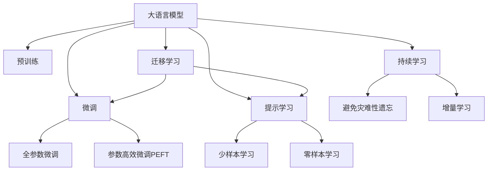

                 

# 电商平台中的AI大模型：从推荐到全场景应用

## 1. 背景介绍

### 1.1 问题由来
随着互联网和电子商务的迅速发展，电商平台已成为人们日常生活的重要组成部分。传统的电商平台主要依赖人工运营和数据分析，效率较低，且难以应对海量用户需求。而AI技术的崛起，尤其是大语言模型和大规模预训练模型的发展，为电商平台带来了新的技术突破。

目前，大模型在电商平台中的应用主要集中在推荐系统。通过基于大模型的个性化推荐技术，电商平台能够更精准地满足用户需求，提升用户体验，增加用户粘性和转化率。但随着电商平台的业务模式和功能不断扩展，大模型在全场景下的应用潜力也逐渐显现。

## 2. 核心概念与联系

### 2.1 核心概念概述

为更好地理解AI大模型在电商平台中的应用，本节将介绍几个密切相关的核心概念：

- 大语言模型(Large Language Model, LLM)：以自回归(如GPT)或自编码(如BERT)模型为代表的大规模预训练语言模型。通过在大规模无标签文本语料上进行预训练，学习通用的语言表示，具备强大的语言理解和生成能力。

- 预训练(Pre-training)：指在大规模无标签文本语料上，通过自监督学习任务训练通用语言模型的过程。常见的预训练任务包括言语建模、遮挡语言模型等。预训练使得模型学习到语言的通用表示。

- 微调(Fine-tuning)：指在预训练模型的基础上，使用下游任务的少量标注数据，通过有监督学习优化模型在该任务上的性能。通常只需要调整顶层分类器或解码器，并以较小的学习率更新全部或部分的模型参数。

- 迁移学习(Transfer Learning)：指将一个领域学习到的知识，迁移应用到另一个不同但相关的领域的学习范式。大模型的预训练-微调过程即是一种典型的迁移学习方式。

- 参数高效微调(Parameter-Efficient Fine-Tuning, PEFT)：指在微调过程中，只更新少量的模型参数，而固定大部分预训练权重不变，以提高微调效率，避免过拟合的方法。

- 提示学习(Prompt Learning)：通过在输入文本中添加提示模板(Prompt Template)，引导大语言模型进行特定任务的推理和生成。可以在不更新模型参数的情况下，实现零样本或少样本学习。

- 少样本学习(Few-shot Learning)：指在只有少量标注样本的情况下，模型能够快速适应新任务的学习方法。在大语言模型中，通常通过在输入中提供少量示例来实现，无需更新模型参数。

- 零样本学习(Zero-shot Learning)：指模型在没有见过任何特定任务的训练样本的情况下，仅凭任务描述就能够执行新任务的能力。大语言模型通过预训练获得的广泛知识，使其能够理解任务指令并生成相应输出。

- 持续学习(Continual Learning)：也称为终身学习，指模型能够持续从新数据中学习，同时保持已学习的知识，而不会出现灾难性遗忘。这对于保持大语言模型的时效性和适应性至关重要。

这些核心概念之间的逻辑关系可以通过以下Mermaid流程图来展示：



这个流程图展示了大语言模型的核心概念及其之间的关系：

1. 大语言模型通过预训练获得基础能力。
2. 微调是对预训练模型进行任务特定的优化，可以分为全参数微调和参数高效微调（PEFT）。
3. 提示学习是一种不更新模型参数的方法，可以实现少样本学习和零样本学习。
4. 迁移学习是连接预训练模型与下游任务的桥梁，可以通过微调或提示学习来实现。
5. 持续学习旨在使模型能够不断学习新知识，同时避免遗忘旧知识。

这些概念共同构成了大语言模型的学习和应用框架，使其能够在各种场景下发挥强大的语言理解和生成能力。通过理解这些核心概念，我们可以更好地把握大语言模型的工作原理和优化方向。

## 3. 核心算法原理 & 具体操作步骤
### 3.1 算法原理概述

在电商平台中，基于大语言模型的推荐系统是典型的应用范例。该系统的核心思想是：将用户行为和商品信息输入大语言模型，通过有监督的微调过程，学习到用户对不同商品的相关偏好和推荐规则，从而生成个性化的商品推荐列表。

具体而言，假设电商平台中有 $N$ 个用户，每个用户对 $M$ 个商品进行了 $K$ 次评分行为，记为矩阵 $\mathbf{U} \in \mathbb{R}^{N \times M}$。同时，模型还需要掌握每个商品的特征信息，记为 $\mathbf{V} \in \mathbb{R}^{M \times F}$，其中 $F$ 为商品的特征维度。

定义推荐系统模型的参数为 $\theta$，通过在大规模标注数据上进行微调，模型学习到用户和商品的潜在表示 $\mathbf{H} \in \mathbb{R}^{N \times H}$ 和 $\mathbf{G} \in \mathbb{R}^{M \times H}$，其中 $H$ 为用户和商品的潜在特征维度。通过这些潜在表示，模型可以生成每个用户的推荐列表 $\mathbf{R} \in \mathbb{R}^{N \times M}$。

微调的目标是最大化用户满意度，即最小化损失函数：

$$
\mathcal{L}(\theta) = \sum_{i=1}^{N} \sum_{j=1}^{M} \ell(\mathbf{H}_i, \mathbf{G}_j, \mathbf{U}_{ij}, \mathbf{V}_j)
$$

其中 $\ell$ 为模型预测与实际用户评分之间的差距，通常使用均方误差或交叉熵等损失函数。

### 3.2 算法步骤详解

基于大语言模型的推荐系统一般包括以下几个关键步骤：

**Step 1: 准备预训练模型和数据集**
- 选择合适的预训练语言模型 $M_{\theta}$ 作为初始化参数，如 BERT、GPT 等。
- 收集电商平台的用户评分数据，将评分和商品信息进行结构化处理，作为微调数据。

**Step 2: 添加任务适配层**
- 根据推荐任务类型，在预训练模型顶层设计合适的输出层和损失函数。
- 对于推荐任务，通常在顶层添加线性分类器和均方误差损失函数。

**Step 3: 设置微调超参数**
- 选择合适的优化算法及其参数，如 AdamW、SGD 等，设置学习率、批大小、迭代轮数等。
- 设置正则化技术及强度，包括权重衰减、Dropout、Early Stopping等。
- 确定冻结预训练参数的策略，如仅微调顶层，或全部参数都参与微调。

**Step 4: 执行梯度训练**
- 将训练集数据分批次输入模型，前向传播计算损失函数。
- 反向传播计算参数梯度，根据设定的优化算法和学习率更新模型参数。
- 周期性在验证集上评估模型性能，根据性能指标决定是否触发 Early Stopping。
- 重复上述步骤直到满足预设的迭代轮数或 Early Stopping 条件。

**Step 5: 测试和部署**
- 在测试集上评估微调后模型 $M_{\hat{\theta}}$ 的性能，对比微调前后的精度提升。
- 使用微调后的模型对新商品进行推荐，集成到实际的应用系统中。
- 持续收集新的评分和商品信息，定期重新微调模型，以适应数据分布的变化。

以上是基于大语言模型的推荐系统的一般流程。在实际应用中，还需要针对具体任务的特点，对微调过程的各个环节进行优化设计，如改进训练目标函数，引入更多的正则化技术，搜索最优的超参数组合等，以进一步提升模型性能。

### 3.3 算法优缺点

基于大语言模型的推荐系统具有以下优点：
1. 个性化推荐：利用大模型强大的语言理解和生成能力，为每个用户生成个性化的推荐列表。
2. 模型通用性：模型可以灵活适应不同的电商平台和推荐场景，应用范围广。
3. 动态调整：用户评分实时更新后，模型能够快速响应并调整推荐策略。
4. 效果显著：在大规模标注数据上微调，能够在电商平台上获得优异的推荐效果。

同时，该方法也存在一定的局限性：
1. 数据依赖：推荐系统的效果很大程度上取决于标注数据的数量和质量。
2. 泛化能力有限：当推荐数据与预训练数据的分布差异较大时，推荐效果可能不佳。
3. 计算资源需求高：大规模预训练模型和大规模数据集对计算资源的需求较高。
4. 模型复杂度高：由于大模型参数量庞大，推理速度较慢，难以满足实时性要求。

尽管存在这些局限性，但就目前而言，基于大语言模型的推荐系统仍是最有效的电商平台推荐技术之一。未来相关研究的重点在于如何进一步降低推荐系统的计算资源需求，提高模型的泛化能力，并兼顾推荐结果的可解释性和鲁棒性。

### 3.4 算法应用领域

基于大语言模型的推荐系统已经在各大电商平台上得到了广泛的应用，覆盖了几乎所有常见推荐任务，例如：

- 商品推荐：根据用户历史评分和行为数据，为用户推荐相关商品。
- 用户画像：通过用户的行为数据，生成用户画像，实现用户细分和个性化推荐。
- 品牌推荐：通过品牌标签信息，为用户推荐相关品牌商品。
- 上下文推荐：考虑商品上下文关系，如购买历史、浏览历史等，推荐相关商品。
- 实时推荐：基于实时用户行为，动态调整推荐列表，提供更即时的个性化服务。

除了推荐系统，大语言模型在电商平台中的应用还包括：

- 搜索排序：通过模型预测用户对搜索结果的满意度，优化搜索排序算法。
- 内容生成：利用模型生成商品描述、评价、广告文案等文本内容，丰富电商平台的展示效果。
- 客服机器人：基于对话模型，构建自动客服系统，提升用户体验。
- 风险控制：利用模型分析用户行为，进行交易欺诈检测和风险预警。

这些应用不仅提升了电商平台的运营效率，还为用户带来了更好的购物体验。随着大语言模型的不断进步，未来在电商平台中的应用将更加广泛和深入。

## 4. 数学模型和公式 & 详细讲解 & 举例说明
### 4.1 数学模型构建

假设电商平台中有一个用户 $u$ 对 $m$ 个商品 $i=1,...,m$ 进行了 $n$ 次评分 $v=1,...,n$，记为评分矩阵 $\mathbf{U} \in \mathbb{R}^{n \times m}$。同时，模型还需要掌握每个商品的特征信息，记为特征矩阵 $\mathbf{V} \in \mathbb{R}^{m \times f}$，其中 $f$ 为商品的特征维度。

定义推荐系统模型的参数为 $\theta$，通过在大规模标注数据上进行微调，模型学习到用户和商品的潜在表示 $\mathbf{H} \in \mathbb{R}^{n \times h}$ 和 $\mathbf{G} \in \mathbb{R}^{m \times h}$，其中 $h$ 为用户和商品的潜在特征维度。通过这些潜在表示，模型可以生成每个用户的推荐列表 $\mathbf{R} \in \mathbb{R}^{n \times m}$。

微调的目标是最大化用户满意度，即最小化损失函数：

$$
\mathcal{L}(\theta) = \sum_{i=1}^{n} \sum_{j=1}^{m} \ell(\mathbf{H}_u, \mathbf{G}_j, \mathbf{U}_{uj}, \mathbf{V}_j)
$$

其中 $\ell$ 为模型预测与实际用户评分之间的差距，通常使用均方误差或交叉熵等损失函数。

### 4.2 公式推导过程

以下我们以均方误差损失函数为例，推导推荐系统模型的优化目标。

假设推荐系统模型为 $\mathbf{R}=\mathbf{H}\mathbf{G}^T$，其中 $\mathbf{H} \in \mathbb{R}^{n \times h}$ 为用户潜在表示，$\mathbf{G} \in \mathbb{R}^{m \times h}$ 为商品潜在表示。定义推荐系统的损失函数为均方误差损失：

$$
\mathcal{L}(\mathbf{H}, \mathbf{G}, \mathbf{U}, \mathbf{V}) = \frac{1}{2} \sum_{i=1}^{n} \sum_{j=1}^{m} (\mathbf{H}_u \mathbf{G}_j^T - \mathbf{U}_{uj})^2
$$

其中 $\mathbf{H}_u$ 为用户 $u$ 的潜在表示，$\mathbf{G}_j$ 为商品 $j$ 的潜在表示，$\mathbf{U}_{uj}$ 为用户 $u$ 对商品 $j$ 的评分。

根据链式法则，损失函数对 $\mathbf{H}$ 和 $\mathbf{G}$ 的偏导数分别为：

$$
\frac{\partial \mathcal{L}}{\partial \mathbf{H}} = \sum_{i=1}^{n} \sum_{j=1}^{m} (\mathbf{H}_u \mathbf{G}_j^T - \mathbf{U}_{uj}) \mathbf{G}_j
$$

$$
\frac{\partial \mathcal{L}}{\partial \mathbf{G}} = \sum_{i=1}^{n} \sum_{j=1}^{m} \mathbf{H}_u^T (\mathbf{G}_j^T - \mathbf{U}_{uj} \mathbf{H}_u)
$$

在得到损失函数的梯度后，即可带入参数更新公式，完成模型的迭代优化。重复上述过程直至收敛，最终得到适应电商平台推荐任务的最优模型参数 $\theta^*$。

## 5. 项目实践：代码实例和详细解释说明
### 5.1 开发环境搭建

在进行推荐系统实践前，我们需要准备好开发环境。以下是使用Python进行PyTorch开发的环境配置流程：

1. 安装Anaconda：从官网下载并安装Anaconda，用于创建独立的Python环境。

2. 创建并激活虚拟环境：
```bash
conda create -n pytorch-env python=3.8 
conda activate pytorch-env
```

3. 安装PyTorch：根据CUDA版本，从官网获取对应的安装命令。例如：
```bash
conda install pytorch torchvision torchaudio cudatoolkit=11.1 -c pytorch -c conda-forge
```

4. 安装TensorFlow：
```bash
conda install tensorflow -c conda-forge
```

5. 安装各类工具包：
```bash
pip install numpy pandas scikit-learn matplotlib tqdm jupyter notebook ipython
```

完成上述步骤后，即可在`pytorch-env`环境中开始推荐系统开发。

### 5.2 源代码详细实现

下面我们以基于BERT的电商平台推荐系统为例，给出使用PyTorch代码实现。

首先，定义推荐系统的数据处理函数：

```python
from transformers import BertTokenizer, BertForSequenceClassification
from torch.utils.data import Dataset
import torch

class RecommendationDataset(Dataset):
    def __init__(self, texts, scores, tokenizer, max_len=128):
        self.texts = texts
        self.scores = scores
        self.tokenizer = tokenizer
        self.max_len = max_len
        
    def __len__(self):
        return len(self.texts)
    
    def __getitem__(self, item):
        text = self.texts[item]
        score = self.scores[item]
        
        encoding = self.tokenizer(text, return_tensors='pt', max_length=self.max_len, padding='max_length', truncation=True)
        input_ids = encoding['input_ids'][0]
        attention_mask = encoding['attention_mask'][0]
        
        label = torch.tensor(score, dtype=torch.float32)
        
        return {'input_ids': input_ids, 
                'attention_mask': attention_mask,
                'label': label}

# 标签与id的映射
tag2id = {'negative': 0, 'positive': 1}
id2tag = {v: k for k, v in tag2id.items()}

# 创建dataset
tokenizer = BertTokenizer.from_pretrained('bert-base-uncased')

train_dataset = RecommendationDataset(train_texts, train_scores, tokenizer)
dev_dataset = RecommendationDataset(dev_texts, dev_scores, tokenizer)
test_dataset = RecommendationDataset(test_texts, test_scores, tokenizer)
```

然后，定义模型和优化器：

```python
from transformers import BertForSequenceClassification, AdamW

model = BertForSequenceClassification.from_pretrained('bert-base-uncased', num_labels=len(tag2id))

optimizer = AdamW(model.parameters(), lr=2e-5)
```

接着，定义训练和评估函数：

```python
from torch.utils.data import DataLoader
from tqdm import tqdm
from sklearn.metrics import mean_squared_error

device = torch.device('cuda') if torch.cuda.is_available() else torch.device('cpu')
model.to(device)

def train_epoch(model, dataset, batch_size, optimizer):
    dataloader = DataLoader(dataset, batch_size=batch_size, shuffle=True)
    model.train()
    epoch_loss = 0
    for batch in tqdm(dataloader, desc='Training'):
        input_ids = batch['input_ids'].to(device)
        attention_mask = batch['attention_mask'].to(device)
        labels = batch['label'].to(device)
        model.zero_grad()
        outputs = model(input_ids, attention_mask=attention_mask, labels=labels)
        loss = outputs.loss
        epoch_loss += loss.item()
        loss.backward()
        optimizer.step()
    return epoch_loss / len(dataloader)

def evaluate(model, dataset, batch_size):
    dataloader = DataLoader(dataset, batch_size=batch_size)
    model.eval()
    preds, labels = [], []
    with torch.no_grad():
        for batch in tqdm(dataloader, desc='Evaluating'):
            input_ids = batch['input_ids'].to(device)
            attention_mask = batch['attention_mask'].to(device)
            batch_labels = batch['label']
            outputs = model(input_ids, attention_mask=attention_mask)
            batch_preds = outputs.logits.argmax(dim=1).to('cpu').tolist()
            batch_labels = batch_labels.to('cpu').tolist()
            for pred, label in zip(batch_preds, batch_labels):
                preds.append(pred)
                labels.append(label)
                
    print(mean_squared_error(labels, preds))
```

最后，启动训练流程并在测试集上评估：

```python
epochs = 5
batch_size = 16

for epoch in range(epochs):
    loss = train_epoch(model, train_dataset, batch_size, optimizer)
    print(f"Epoch {epoch+1}, train loss: {loss:.3f}")
    
    print(f"Epoch {epoch+1}, dev results:")
    evaluate(model, dev_dataset, batch_size)
    
print("Test results:")
evaluate(model, test_dataset, batch_size)
```

以上就是使用PyTorch对BERT进行电商平台推荐系统的完整代码实现。可以看到，得益于Transformers库的强大封装，我们可以用相对简洁的代码完成BERT模型的加载和微调。

### 5.3 代码解读与分析

让我们再详细解读一下关键代码的实现细节：

**RecommendationDataset类**：
- `__init__`方法：初始化文本、评分、分词器等关键组件。
- `__len__`方法：返回数据集的样本数量。
- `__getitem__`方法：对单个样本进行处理，将文本输入编码为token ids，将评分转换为标签，并进行定长padding，最终返回模型所需的输入。

**tag2id和id2tag字典**：
- 定义了评分与数字id之间的映射关系，用于将评分转换为标签。

**训练和评估函数**：
- 使用PyTorch的DataLoader对数据集进行批次化加载，供模型训练和推理使用。
- 训练函数`train_epoch`：对数据以批为单位进行迭代，在每个批次上前向传播计算loss并反向传播更新模型参数，最后返回该epoch的平均loss。
- 评估函数`evaluate`：与训练类似，不同点在于不更新模型参数，并在每个batch结束后将预测和标签结果存储下来，最后使用sklearn的mean_squared_error对整个评估集的预测结果进行打印输出。

**训练流程**：
- 定义总的epoch数和batch size，开始循环迭代
- 每个epoch内，先在训练集上训练，输出平均loss
- 在验证集上评估，输出平均评分误差
- 所有epoch结束后，在测试集上评估，给出最终测试结果

可以看到，PyTorch配合Transformers库使得BERT微调的代码实现变得简洁高效。开发者可以将更多精力放在数据处理、模型改进等高层逻辑上，而不必过多关注底层的实现细节。

当然，工业级的系统实现还需考虑更多因素，如模型的保存和部署、超参数的自动搜索、更灵活的任务适配层等。但核心的微调范式基本与此类似。

## 6. 实际应用场景
### 6.1 智能客服系统

基于大语言模型微调的对话技术，可以广泛应用于智能客服系统的构建。传统客服往往需要配备大量人力，高峰期响应缓慢，且一致性和专业性难以保证。而使用微调后的对话模型，可以7x24小时不间断服务，快速响应客户咨询，用自然流畅的语言解答各类常见问题。

在技术实现上，可以收集企业内部的历史客服对话记录，将问题和最佳答复构建成监督数据，在此基础上对预训练对话模型进行微调。微调后的对话模型能够自动理解用户意图，匹配最合适的答案模板进行回复。对于客户提出的新问题，还可以接入检索系统实时搜索相关内容，动态组织生成回答。如此构建的智能客服系统，能大幅提升客户咨询体验和问题解决效率。

### 6.2 金融舆情监测

金融机构需要实时监测市场舆论动向，以便及时应对负面信息传播，规避金融风险。传统的人工监测方式成本高、效率低，难以应对网络时代海量信息爆发的挑战。基于大语言模型微调的文本分类和情感分析技术，为金融舆情监测提供了新的解决方案。

具体而言，可以收集金融领域相关的新闻、报道、评论等文本数据，并对其进行主题标注和情感标注。在此基础上对预训练语言模型进行微调，使其能够自动判断文本属于何种主题，情感倾向是正面、中性还是负面。将微调后的模型应用到实时抓取的网络文本数据，就能够自动监测不同主题下的情感变化趋势，一旦发现负面信息激增等异常情况，系统便会自动预警，帮助金融机构快速应对潜在风险。

### 6.3 个性化推荐系统

当前的推荐系统往往只依赖用户的历史行为数据进行物品推荐，无法深入理解用户的真实兴趣偏好。基于大语言模型微调技术，个性化推荐系统可以更好地挖掘用户行为背后的语义信息，从而提供更精准、多样的推荐内容。

在实践中，可以收集用户浏览、点击、评论、分享等行为数据，提取和用户交互的物品标题、描述、标签等文本内容。将文本内容作为模型输入，用户的后续行为（如是否点击、购买等）作为监督信号，在此基础上微调预训练语言模型。微调后的模型能够从文本内容中准确把握用户的兴趣点。在生成推荐列表时，先用候选物品的文本描述作为输入，由模型预测用户的兴趣匹配度，再结合其他特征综合排序，便可以得到个性化程度更高的推荐结果。

### 6.4 未来应用展望

随着大语言模型和微调方法的不断发展，基于微调范式将在更多领域得到应用，为传统行业带来变革性影响。

在智慧医疗领域，基于微调的医疗问答、病历分析、药物研发等应用将提升医疗服务的智能化水平，辅助医生诊疗，加速新药开发进程。

在智能教育领域，微调技术可应用于作业批改、学情分析、知识推荐等方面，因材施教，促进教育公平，提高教学质量。

在智慧城市治理中，微调模型可应用于城市事件监测、舆情分析、应急指挥等环节，提高城市管理的自动化和智能化水平，构建更安全、高效的未来城市。

此外，在企业生产、社会治理、文娱传媒等众多领域，基于大模型微调的人工智能应用也将不断涌现，为经济社会发展注入新的动力。相信随着技术的日益成熟，微调方法将成为人工智能落地应用的重要范式，推动人工智能技术在垂直行业的规模化落地。总之，微调需要开发者根据具体任务，不断迭代和优化模型、数据和算法，方能得到理想的效果。

## 7. 工具和资源推荐
### 7.1 学习资源推荐

为了帮助开发者系统掌握大语言模型微调的理论基础和实践技巧，这里推荐一些优质的学习资源：

1. 《Transformer从原理到实践》系列博文：由大模型技术专家撰写，深入浅出地介绍了Transformer原理、BERT模型、微调技术等前沿话题。

2. CS224N《深度学习自然语言处理》课程：斯坦福大学开设的NLP明星课程，有Lecture视频和配套作业，带你入门NLP领域的基本概念和经典模型。

3. 《Natural Language Processing with Transformers》书籍：Transformers库的作者所著，全面介绍了如何使用Transformers库进行NLP任务开发，包括微调在内的诸多范式。

4. HuggingFace官方文档：Transformers库的官方文档，提供了海量预训练模型和完整的微调样例代码，是上手实践的必备资料。

5. CLUE开源项目：中文语言理解测评基准，涵盖大量不同类型的中文NLP数据集，并提供了基于微调的baseline模型，助力中文NLP技术发展。

通过对这些资源的学习实践，相信你一定能够快速掌握大语言模型微调的精髓，并用于解决实际的NLP问题。
###  7.2 开发工具推荐

高效的开发离不开优秀的工具支持。以下是几款用于大语言模型微调开发的常用工具：

1. PyTorch：基于Python的开源深度学习框架，灵活动态的计算图，适合快速迭代研究。大部分预训练语言模型都有PyTorch版本的实现。

2. TensorFlow：由Google主导开发的开源深度学习框架，生产部署方便，适合大规模工程应用。同样有丰富的预训练语言模型资源。

3. Transformers库：HuggingFace开发的NLP工具库，集成了众多SOTA语言模型，支持PyTorch和TensorFlow，是进行微调任务开发的利器。

4. Weights & Biases：模型训练的实验跟踪工具，可以记录和可视化模型训练过程中的各项指标，方便对比和调优。与主流深度学习框架无缝集成。

5. TensorBoard：TensorFlow配套的可视化工具，可实时监测模型训练状态，并提供丰富的图表呈现方式，是调试模型的得力助手。

6. Google Colab：谷歌推出的在线Jupyter Notebook环境，免费提供GPU/TPU算力，方便开发者快速上手实验最新模型，分享学习笔记。

合理利用这些工具，可以显著提升大语言模型微调任务的开发效率，加快创新迭代的步伐。

### 7.3 相关论文推荐

大语言模型和微调技术的发展源于学界的持续研究。以下是几篇奠基性的相关论文，推荐阅读：

1. Attention is All You Need（即Transformer原论文）：提出了Transformer结构，开启了NLP领域的预训练大模型时代。

2. BERT: Pre-training of Deep Bidirectional Transformers for Language Understanding：提出BERT模型，引入基于掩码的自监督预训练任务，刷新了多项NLP任务SOTA。

3. Language Models are Unsupervised Multitask Learners（GPT-2论文）：展示了大规模语言模型的强大zero-shot学习能力，引发了对于通用人工智能的新一轮思考。

4. Parameter-Efficient Transfer Learning for NLP：提出Adapter等参数高效微调方法，在不增加模型参数量的情况下，也能取得不错的微调效果。

5. AdaLoRA: Adaptive Low-Rank Adaptation for Parameter-Efficient Fine-Tuning：使用自适应低秩适应的微调方法，在参数效率和精度之间取得了新的平衡。

这些论文代表了大语言模型微调技术的发展脉络。通过学习这些前沿成果，可以帮助研究者把握学科前进方向，激发更多的创新灵感。

## 8. 总结：未来发展趋势与挑战
### 8.1 总结

本文对基于大语言模型的电商平台推荐系统进行了全面系统的介绍。首先阐述了推荐系统在大模型中的应用背景和意义，明确了微调在电商推荐系统中的核心地位。其次，从原理到实践，详细讲解了微调的数学原理和关键步骤，给出了推荐系统开发的完整代码实例。同时，本文还广泛探讨了微调方法在智能客服、金融舆情、个性化推荐等多个领域的应用前景，展示了微调范式的巨大潜力。此外，本文精选了微调技术的各类学习资源，力求为读者提供全方位的技术指引。

通过本文的系统梳理，可以看到，基于大语言模型的推荐系统在大规模电商平台上取得了显著的推荐效果，成为电商推荐的核心技术之一。得益于大模型强大的语言理解和生成能力，推荐系统能够更精准地满足用户需求，提升用户体验。未来，伴随大语言模型的不断进步，推荐系统的推荐效果还将进一步提升，电商平台也将迎来更高的用户满意度和更高的转化率。

### 8.2 未来发展趋势

展望未来，大语言模型微调技术将呈现以下几个发展趋势：

1. 模型规模持续增大。随着算力成本的下降和数据规模的扩张，预训练语言模型的参数量还将持续增长。超大规模语言模型蕴含的丰富语言知识，有望支撑更加复杂多变的推荐任务微调。

2. 微调方法日趋多样。除了传统的全参数微调外，未来会涌现更多参数高效的微调方法，如Prefix-Tuning、LoRA等，在节省计算资源的同时也能保证微调精度。

3. 持续学习成为常态。随着数据分布的不断变化，微调模型也需要持续学习新知识以保持性能。如何在不遗忘原有知识的同时，高效吸收新样本信息，将成为重要的研究课题。

4. 标注样本需求降低。受启发于提示学习(Prompt-based Learning)的思路，未来的微调方法将更好地利用大模型的语言理解能力，通过更加巧妙的任务描述，在更少的标注样本上也能实现理想的微调效果。

5. 多模态微调崛起。当前的微调主要聚焦于纯文本数据，未来会进一步拓展到图像、视频、语音等多模态数据微调。多模态信息的融合，将显著提升语言模型对现实世界的理解和建模能力。

6. 模型通用性增强。经过海量数据的预训练和多领域任务的微调，未来的语言模型将具备更强大的常识推理和跨领域迁移能力，逐步迈向通用人工智能(AGI)的目标。

以上趋势凸显了大语言模型微调技术的广阔前景。这些方向的探索发展，必将进一步提升推荐系统的性能和应用范围，为电商平台的智能化运营注入新动力。

### 8.3 面临的挑战

尽管大语言模型微调技术已经取得了瞩目成就，但在迈向更加智能化、普适化应用的过程中，它仍面临着诸多挑战：

1. 数据依赖。推荐系统的效果很大程度上取决于标注数据的数量和质量。对于小众商品或长尾市场，难以获得充足的高质量标注数据，成为制约推荐系统性能的瓶颈。如何进一步降低推荐系统的数据需求，将是一大难题。

2. 泛化能力有限。当推荐数据与预训练数据的分布差异较大时，推荐效果可能不佳。如何在泛化能力方面取得更大突破，还需要更多的理论和实践积累。

3. 计算资源需求高。大规模预训练模型和大规模数据集对计算资源的需求较高。GPU/TPU等高性能设备是必不可少的，但即便如此，超大批次的训练和推理也可能遇到显存不足的问题。如何优化资源消耗，提高推荐系统的计算效率，将是重要的优化方向。

4. 模型复杂度高。由于大模型参数量庞大，推理速度较慢，难以满足实时性要求。如何在保证性能的同时，简化模型结构，提升推理速度，优化资源占用，将是重要的优化方向。

5. 推荐结果可解释性不足。当前的推荐系统往往是一个"黑盒"，难以解释其内部工作机制和决策逻辑。对于医疗、金融等高风险应用，算法的可解释性和可审计性尤为重要。如何赋予推荐系统更强的可解释性，将是亟待攻克的难题。

6. 安全性有待保障。推荐模型可能受到恶意攻击，如假商品、广告诱导等。如何从数据和算法层面消除潜在的安全风险，确保用户和商家的利益安全，也将是重要的研究课题。

正视推荐系统面临的这些挑战，积极应对并寻求突破，将是大语言模型微调走向成熟的必由之路。相信随着学界和产业界的共同努力，这些挑战终将一一被克服，大语言模型微调必将在构建安全、可靠、可解释、可控的推荐系统方面发挥更大作用。

### 8.4 研究展望

面对大语言模型微调所面临的种种挑战，未来的研究需要在以下几个方面寻求新的突破：

1. 探索无监督和半监督微调方法。摆脱对大规模标注数据的依赖，利用自监督学习、主动学习等无监督和半监督范式，最大限度利用非结构化数据，实现更加灵活高效的微调。

2. 研究参数高效和计算高效的微调范式。开发更加参数高效的微调方法，在固定大部分预训练参数的同时，只更新极少量的任务相关参数。同时优化微调模型的计算图，减少前向传播和反向传播的资源消耗，实现更加轻量级、实时性的部署。

3. 融合因果和对比学习范式。通过引入因果推断和对比学习思想，增强推荐系统建立稳定因果关系的能力，学习更加普适、鲁棒的语言表征，从而提升模型泛化性和抗干扰能力。

4. 引入更多先验知识。将符号化的先验知识，如知识图谱、逻辑规则等，与神经网络模型进行巧妙融合，引导微调过程学习更准确、合理的语言模型。同时加强不同模态数据的整合，实现视觉、语音等多模态信息与文本信息的协同建模。

5. 结合因果分析和博弈论工具。将因果分析方法引入推荐模型，识别出模型决策的关键特征，增强推荐结果的因果性和逻辑性。借助博弈论工具刻画用户行为，主动探索并规避模型的脆弱点，提高系统稳定性。

6. 纳入伦理道德约束。在推荐模型训练目标中引入伦理导向的评估指标，过滤和惩罚有偏见、有害的输出倾向。同时加强人工干预和审核，建立推荐系统的监管机制，确保推荐结果符合人类价值观和伦理道德。

这些研究方向的探索，必将引领大语言模型微调技术迈向更高的台阶，为构建安全、可靠、可解释、可控的推荐系统铺平道路。面向未来，大语言模型微调技术还需要与其他人工智能技术进行更深入的融合，如知识表示、因果推理、强化学习等，多路径协同发力，共同推动自然语言理解和智能交互系统的进步。只有勇于创新、敢于突破，才能不断拓展语言模型的边界，让智能技术更好地造福人类社会。

## 9. 附录：常见问题与解答

**Q1：电商平台中的推荐系统是否适用于所有商品类型？**

A: 电商平台中的推荐系统通常适用于大多数商品类型，但对于某些特定商品（如艺术品、古董等），由于数据量不足或用户行为复杂，推荐系统的效果可能不佳。此时可以考虑引入更多先验知识或人工干预，提高推荐系统的适应性。

**Q2：推荐系统的推荐结果如何保障公平性？**

A: 推荐系统的公平性问题主要体现在用户对不同商品的评价差异上。可以通过引入惩罚机制，对评分较高的用户进行适当惩罚，使其评分权重降低，从而抑制其对推荐结果的过度影响。同时，可以对评分数据进行标准化处理，减少用户评分偏差带来的影响。

**Q3：推荐系统如何处理长尾商品？**

A: 长尾商品由于数据量少，可能难以被推荐系统充分理解。可以通过引入用户行为数据、商品特征数据等多维度信息，增加模型的泛化能力。同时，可以考虑使用自适应推荐策略，如基于上下文的推荐、基于时间序列的推荐等，提高推荐系统的灵活性。

**Q4：推荐系统如何应对恶意攻击？**

A: 恶意攻击如假商品、广告诱导等，可能破坏推荐系统的推荐结果。可以通过建立基于模型的异常检测系统，实时监测推荐结果中的异常情况，并进行筛选和过滤。同时，可以考虑引入用户反馈机制，根据用户投诉进行人工干预和修正。

**Q5：推荐系统如何优化推荐速度？**

A: 推荐系统的优化可以从多个方面进行：1) 采用模型剪枝、量化等技术，减少模型参数量和计算量；2) 使用分布式计算、模型并行等技术，提升计算效率；3) 优化数据加载和处理流程，减少数据传输和处理开销。

这些优化措施需要根据具体应用场景和系统需求进行灵活选择和组合，以达到最佳的推荐效果。

---

作者：禅与计算机程序设计艺术 / Zen and the Art of Computer Programming

