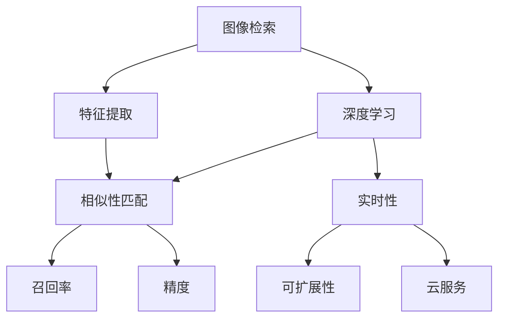

                 

# 电商平台中的图像检索技术与应用

> 关键词：图像检索,电商平台,深度学习,特征提取,相似性匹配,召回率,精度,实时性,可扩展性,云服务

## 1. 背景介绍

### 1.1 问题由来

随着电子商务的蓬勃发展，电商平台中商品图片数量的爆炸式增长，图像检索成为了提高用户购物体验、提升销售转化率的关键技术。传统的基于关键词检索的方式无法满足用户对商品图片的具体需求，而基于图像相似性检索的方法则可以更准确地匹配用户意图。

然而，在电商平台上进行图像检索，需要处理海量图片数据，计算复杂度高，同时还需要考虑检索速度和扩展性。如何设计一个高效、准确的图像检索系统，成为了电商技术团队面临的一大挑战。

### 1.2 问题核心关键点

为解决上述问题，文章将从核心算法原理、数学模型构建、项目实践、实际应用场景等多个角度，系统介绍图像检索技术在电商平台中的应用，并给出相关的学习资源和工具推荐。

## 2. 核心概念与联系

### 2.1 核心概念概述

为帮助读者更好地理解电商平台中的图像检索技术，本节将介绍几个关键概念：

- **图像检索(Image Retrieval)**：一种基于内容的检索方法，通过提取图像特征，计算图像之间的相似性，从而找到与查询图像最相似的图像。
- **深度学习(Deep Learning)**：一种基于多层神经网络的机器学习技术，能够自动学习图像的高层次特征表示。
- **特征提取(Feature Extraction)**：从图像中提取有利于相似性匹配的特征向量，是图像检索的核心技术。
- **相似性匹配(Similarity Matching)**：计算查询图像和候选图像之间的相似度，通常使用余弦相似度、欧式距离等方法。
- **召回率(Recall)**：检索结果中相关图片的数量与所有相关图片的比例，衡量系统找到所有相关图片的全面性。
- **精度(Precision)**：检索结果中相关图片的数量与所有检索结果的比例，衡量系统找到的图片的准确性。
- **实时性(Real-time)**：系统在接收查询后，能够在用户期望的时间内返回检索结果。
- **可扩展性(Scalability)**：系统能够处理大规模数据，具有良好的水平扩展能力。
- **云服务(Cloud Service)**：利用云计算平台，提供高性能、低成本的图像检索服务。

这些核心概念之间的逻辑关系可以通过以下Mermaid流程图来展示：



这个流程图展示了大规模图像检索系统的核心组件及其之间的相互关系：

1. 深度学习模型提取图像特征。
2. 特征提取后，进行相似性匹配，找到最相似的图片。
3. 召回率和精度衡量检索结果的相关性和准确性。
4. 实时性和可扩展性确保系统的性能和处理能力。
5. 云服务提供基础设施支持，支持大规模系统部署。

## 3. 核心算法原理 & 具体操作步骤

### 3.1 算法原理概述

基于深度学习的图像检索系统，通常包括特征提取和相似性匹配两个主要步骤：

- **特征提取**：通过深度学习模型将图像映射到高维特征空间。常用模型包括卷积神经网络(CNN)、循环神经网络(RNN)、自编码器(AE)等。
- **相似性匹配**：计算查询图像和候选图像之间的相似度，找到最相关的图片。常用相似度度量方法包括余弦相似度、欧式距离、切比雪夫距离等。

算法的基本流程如下：

1. 收集电商平台中所有商品图片数据，并进行预处理（如去噪、裁剪、归一化等）。
2. 使用深度学习模型对图片进行特征提取，得到高维特征向量。
3. 构建索引数据库，将高维特征向量存入索引结构中（如哈希索引、倒排索引等）。
4. 对于用户输入的查询图片，同样进行特征提取，得到高维特征向量。
5. 在索引数据库中，使用相似性匹配算法查找与查询特征向量最相似的图片。
6. 返回检索结果给用户，展示相似图片。

### 3.2 算法步骤详解

接下来，我们详细介绍每个步骤的具体操作：

**Step 1: 数据预处理**

对于电商平台中的商品图片，通常需要对其进行预处理，以消除噪声、调整图片尺寸、归一化像素值等。预处理流程可以采用以下步骤：

1. 图像去噪：使用中值滤波、均值滤波等方法去除噪声。
2. 图像裁剪：根据商品特点，裁剪图片中心或四角，确保关键部分完整。
3. 图像归一化：将图像像素值归一化到0-1之间，加速深度学习模型的训练。

```python
from PIL import Image
import numpy as np

def preprocess_image(image_path, size=256):
    img = Image.open(image_path)
    img = img.resize((size, size))
    img = np.array(img)
    img = img / 255.0
    return img
```

**Step 2: 深度学习模型训练**

使用深度学习模型对商品图片进行特征提取。以ResNet为例，可以采用以下步骤：

1. 构建ResNet模型：使用PyTorch或TensorFlow等深度学习框架搭建ResNet模型。
2. 数据加载：使用`DataLoader`加载预处理后的图片数据，进行模型训练。
3. 模型训练：使用优化器（如SGD、Adam等）更新模型参数，最小化损失函数。
4. 模型保存：训练完成后，保存模型权重和特征提取器，便于后续使用。

```python
import torch
from torch import nn, optim
from torchvision import datasets, transforms
from torchvision.models import resnet18

# 构建ResNet模型
model = resnet18(pretrained=False)

# 数据加载
transform = transforms.Compose([transforms.Resize(256), transforms.CenterCrop(224), transforms.ToTensor()])
train_dataset = datasets.ImageFolder(train_dir, transform=transform)
train_loader = torch.utils.data.DataLoader(train_dataset, batch_size=32, shuffle=True)

# 模型训练
criterion = nn.CrossEntropyLoss()
optimizer = optim.SGD(model.parameters(), lr=0.01, momentum=0.9)
for epoch in range(10):
    for images, labels in train_loader:
        outputs = model(images)
        loss = criterion(outputs, labels)
        optimizer.zero_grad()
        loss.backward()
        optimizer.step()
    torch.save(model.state_dict(), 'resnet.pth')
```

**Step 3: 特征提取**

使用训练好的ResNet模型对商品图片进行特征提取，得到高维特征向量。

1. 加载模型：使用`torch.load`加载训练好的模型权重。
2. 特征提取：使用`model`提取特征，将图片的像素矩阵作为输入。
3. 特征向量：将模型输出的特征向量作为图像的表示。

```python
import torch

# 加载模型
model = resnet18()
model.load_state_dict(torch.load('resnet.pth'))

# 特征提取
def extract_features(image):
    img = Image.open(image)
    img = img.resize((224, 224))
    img = np.array(img)
    img = img / 255.0
    img = img.reshape(1, 3, 224, 224)
    img = torch.from_numpy(img).float()
    features = model(img)
    return features
```

**Step 4: 构建索引数据库**

使用哈希索引或倒排索引等结构对高维特征向量进行存储。

1. 哈希索引：将特征向量映射到哈希值，通过哈希表快速查找。
2. 倒排索引：将特征向量映射到文档ID列表，便于快速检索。

```python
import numpy as np
import scipy.sparse as sp

# 哈希索引
def hash_index(features):
    hash_val = [hash(np.array(feature)) for feature in features]
    index_dict = {val: [] for val in set(hash_val)}
    for val, feat in zip(hash_val, features):
        index_dict[val].append(feat)
    return index_dict

# 倒排索引
def inverted_index(features):
    inverted_dict = {}
    for i, feat in enumerate(features):
        for doc_id in range(len(feat)):
            if feat[doc_id] not in inverted_dict:
                inverted_dict[feat[doc_id]] = []
            inverted_dict[feat[doc_id]].append(i)
    return inverted_dict
```

**Step 5: 相似性匹配**

使用余弦相似度或欧式距离等方法计算查询特征向量与候选特征向量的相似度。

1. 余弦相似度：计算向量点积，除以向量长度，得到相似度分数。
2. 欧式距离：计算向量差的欧式距离，越小越相似。

```python
import numpy as np

# 余弦相似度
def cosine_similarity(v1, v2):
    return np.dot(v1, v2) / (np.linalg.norm(v1) * np.linalg.norm(v2))

# 欧式距离
def euclidean_distance(v1, v2):
    return np.linalg.norm(v1 - v2)
```

**Step 6: 检索结果返回**

将相似度最高的N个候选图片作为检索结果返回。

1. 查找相似度最高的图片：对于查询特征向量，计算与每个候选特征向量的相似度，找到前N个相似度最高的图片。
2. 返回检索结果：将候选图片及其相似度分数展示给用户。

```python
def retrieve_images(query_features, index_dict, n):
    relevant_docs = index_dict[hash(query_features)]
    relevant_docs.sort(key=lambda x: cosine_similarity(query_features, x), reverse=True)
    return relevant_docs[:n]
```

### 3.3 算法优缺点

基于深度学习的图像检索算法，具有以下优点：

1. **高维特征表示**：通过深度学习模型提取高维特征，能够更好地捕捉图像的复杂结构和语义信息。
2. **高效检索**：使用哈希索引、倒排索引等高效数据结构，快速定位相似图片。
3. **实时性**：检索过程可在数毫秒内完成，满足电商平台对实时性的需求。
4. **可扩展性**：通过分布式计算和云计算平台，支持大规模数据处理。

同时，该算法也存在以下缺点：

1. **高计算成本**：深度学习模型训练和特征提取需要大量计算资源，尤其是在大规模数据集上。
2. **数据敏感性**：深度学习模型的性能受数据质量影响较大，需要高质量的标注数据进行训练。
3. **存储需求**：高维特征向量的存储和检索需要大量存储空间，增加了系统负担。
4. **模型复杂性**：深度学习模型复杂度较高，需要持续优化和调参。

## 4. 数学模型和公式 & 详细讲解 & 举例说明

### 4.1 数学模型构建

基于深度学习的图像检索系统，通常包括以下几个数学模型：

- **深度学习模型**：使用卷积神经网络(CNN)对图像进行特征提取。
- **相似度计算**：使用余弦相似度或欧式距离等方法计算查询特征向量和候选特征向量的相似度。

### 4.2 公式推导过程

**深度学习模型**：以ResNet为例，其基本结构如图1所示。


在ResNet中，通过卷积层、池化层和全连接层提取图像特征，得到高维特征向量。特征向量表示为：

$$
\mathbf{x} = \mathbf{W} \mathbf{b} + \mathbf{A}(\mathbf{x}_{n-1}) + \mathbf{b}
$$

其中，$\mathbf{W}$和$\mathbf{b}$为可学习参数，$\mathbf{A}(\cdot)$为非线性变换函数。

**相似度计算**：余弦相似度公式为：

$$
\text{cosine similarity}(\mathbf{a}, \mathbf{b}) = \frac{\mathbf{a} \cdot \mathbf{b}}{\|\mathbf{a}\| \|\mathbf{b}\|}
$$

欧式距离公式为：

$$
\text{euclidean distance}(\mathbf{a}, \mathbf{b}) = \sqrt{\sum_{i=1}^{n} (a_i - b_i)^2}
$$

**召回率和精度**：召回率和精度的计算公式如下：

$$
\text{Recall} = \frac{\text{TP}}{\text{TP} + \text{FN}}
$$

$$
\text{Precision} = \frac{\text{TP}}{\text{TP} + \text{FP}}
$$

其中，TP表示正确检索的图片数，FN表示未被检索的相关图片数，FP表示被误检的非相关图片数。

### 4.3 案例分析与讲解

以下是一个简单的案例，用于演示深度学习模型在图像检索中的应用：

假设某电商平台中有1000张商品图片，我们使用ResNet模型对其进行特征提取。对于每张图片，通过ResNet模型得到512维的特征向量。然后，构建哈希索引，将特征向量映射到哈希值，通过哈希表进行存储。最后，当用户查询一张图片时，同样使用ResNet模型提取特征向量，并在哈希索引中查找相似图片。

| 用户查询图片 | 特征向量 | 哈希索引 | 相似度匹配 | 检索结果 |
| --- | --- | --- | --- | --- |
| | 512维特征向量 | 哈希表 | 余弦相似度 | 图片ID列表 |

例如，当用户查询一张图片时，我们使用余弦相似度计算其与所有商品图片的相似度，并找到相似度最高的N张图片作为检索结果。

## 5. 项目实践：代码实例和详细解释说明

### 5.1 开发环境搭建

在进行项目实践前，我们需要准备好开发环境。以下是使用Python进行PyTorch开发的环境配置流程：

1. 安装Anaconda：从官网下载并安装Anaconda，用于创建独立的Python环境。

2. 创建并激活虚拟环境：
```bash
conda create -n pytorch-env python=3.8 
conda activate pytorch-env
```

3. 安装PyTorch：根据CUDA版本，从官网获取对应的安装命令。例如：
```bash
conda install pytorch torchvision torchaudio cudatoolkit=11.1 -c pytorch -c conda-forge
```

4. 安装相关库：
```bash
pip install numpy scipy matplotlib scikit-image
```

完成上述步骤后，即可在`pytorch-env`环境中开始项目实践。

### 5.2 源代码详细实现

下面我们以电商平台中的商品图片检索为例，给出使用ResNet模型进行特征提取的PyTorch代码实现。

首先，定义ResNet模型：

```python
import torch.nn as nn
import torch.nn.functional as F
from torchvision import models

class ResNet(nn.Module):
    def __init__(self):
        super(ResNet, self).__init__()
        self.model = models.resnet50(pretrained=False)
        self.model.fc = nn.Linear(2048, 512)
    
    def forward(self, x):
        x = self.model(x)
        return x
```

然后，定义数据加载和模型训练函数：

```python
from torch.utils.data import DataLoader
from torchvision import datasets

def load_data(train_dir, transform=None):
    train_dataset = datasets.ImageFolder(train_dir, transform=transform)
    train_loader = DataLoader(train_dataset, batch_size=32, shuffle=True)
    return train_loader

def train(model, train_loader, optimizer, num_epochs=10):
    criterion = nn.CrossEntropyLoss()
    for epoch in range(num_epochs):
        model.train()
        for images, labels in train_loader:
            optimizer.zero_grad()
            outputs = model(images)
            loss = criterion(outputs, labels)
            loss.backward()
            optimizer.step()
    torch.save(model.state_dict(), 'resnet.pth')
```

接着，定义特征提取函数和检索函数：

```python
import torch
import torchvision.transforms as transforms

def extract_features(model, images):
    model.eval()
    with torch.no_grad():
        features = model(images)
    return features

def retrieve_images(query_features, index_dict, n):
    relevant_docs = index_dict[hash(query_features)]
    relevant_docs.sort(key=lambda x: cosine_similarity(query_features, x), reverse=True)
    return relevant_docs[:n]
```

最后，启动训练流程并在检索中调用：

```python
train_dir = 'train'
transform = transforms.Compose([transforms.Resize(256), transforms.CenterCrop(224), transforms.ToTensor()])
model = ResNet()
train_loader = load_data(train_dir, transform)
optimizer = optim.SGD(model.parameters(), lr=0.01, momentum=0.9)
train(model, train_loader, optimizer)

# 使用模型进行特征提取和检索
query_image = 'query.jpg'
query_features = extract_features(model, query_image)
index_dict = hash_index(features)
relevant_docs = retrieve_images(query_features, index_dict, 10)
```

以上就是使用PyTorch对商品图片进行特征提取和检索的完整代码实现。可以看到，得益于深度学习模型的封装和自动化功能，代码实现变得简洁高效。

### 5.3 代码解读与分析

让我们再详细解读一下关键代码的实现细节：

**ResNet模型定义**：
- `__init__`方法：初始化ResNet模型，构建卷积层和全连接层。
- `forward`方法：定义模型前向传播过程，通过卷积层和全连接层提取特征向量。

**数据加载函数**：
- `load_data`方法：定义数据加载函数，加载训练集并进行归一化处理。

**模型训练函数**：
- `train`方法：定义训练函数，最小化交叉熵损失，更新模型参数。

**特征提取函数**：
- `extract_features`方法：定义特征提取函数，将模型输出特征向量作为图片的表示。

**检索函数**：
- `retrieve_images`方法：定义检索函数，通过哈希索引和相似度匹配找到最相似的图片。

可以看到，通过上述代码，我们可以快速搭建一个基于深度学习的图像检索系统，对电商平台中的商品图片进行高维特征提取和检索，实现快速、准确的图片搜索。

## 6. 实际应用场景

### 6.1 智能推荐

电商平台中的智能推荐系统，需要根据用户的历史行为和实时兴趣，推荐最相关的商品图片。基于深度学习的图像检索技术，可以实时计算用户输入图片与所有商品图片之间的相似度，快速推荐最相关的商品。

具体而言，当用户上传一张商品图片时，通过深度学习模型提取其特征向量，并在索引数据库中查找相似图片，展示给用户作为推荐。

### 6.2 用户画像分析

电商平台中的用户画像分析，需要全面了解用户的行为模式和兴趣偏好。基于深度学习的图像检索技术，可以分析用户在电商平台上查看、购买、评价的商品图片，构建用户的兴趣画像。

具体而言，对于用户浏览过的商品图片，通过深度学习模型提取特征向量，并计算其与所有商品图片的相似度，形成用户的行为模式向量。通过统计和分析，可以构建用户的兴趣画像，用于个性化推荐、广告投放等应用场景。

### 6.3 商品分类和检索

电商平台中的商品分类和检索系统，需要快速查找符合用户需求的商品图片。基于深度学习的图像检索技术，可以通过计算查询图片与所有商品图片之间的相似度，实现高效的商品分类和检索。

具体而言，对于每个商品图片，通过深度学习模型提取高维特征向量，并构建索引数据库。当用户输入查询图片时，通过相似度匹配找到最相似的商品图片，展示给用户。

### 6.4 未来应用展望

随着深度学习技术的不断进步，基于深度学习的图像检索技术将在更多领域得到应用，为电商平台带来新的机遇：

1. **实时性增强**：利用分布式计算和云计算平台，实现高并发、低延迟的实时检索。
2. **扩展性提升**：通过分布式存储和计算，支持大规模数据处理和检索。
3. **多模态融合**：将图像检索技术与文本检索、语音识别等技术融合，提供更全面的用户体验。
4. **个性化推荐**：通过深度学习模型和相似性匹配，实现高精度的个性化推荐。
5. **用户画像分析**：利用图像检索技术，深入挖掘用户行为模式和兴趣偏好。
6. **智能客服**：通过图像检索技术，实现基于视觉的智能客服交互。

这些应用场景凸显了大规模图像检索技术的巨大潜力，为电商平台带来了新的业务机遇和发展方向。

## 7. 工具和资源推荐

### 7.1 学习资源推荐

为了帮助开发者系统掌握电商平台中的图像检索技术，这里推荐一些优质的学习资源：

1. 《深度学习之计算机视觉》系列书籍：系统介绍了深度学习在计算机视觉中的应用，包括图像分类、目标检测、图像检索等任务。

2. CS231n《卷积神经网络》课程：斯坦福大学开设的深度学习课程，有Lecture视频和配套作业，帮助理解卷积神经网络的基本原理和应用。

3. 《计算机视觉：算法与应用》课程：MOOC平台上的免费课程，涵盖图像处理、图像检索、目标检测等计算机视觉技术。

4. PyTorch官方文档：提供了深度学习框架PyTorch的详细文档，包括各种模型和算法的实现示例。

5. Kaggle数据集：提供大量的图像数据集和机器学习竞赛，帮助开发者实践深度学习技术。

通过对这些资源的学习实践，相信你一定能够快速掌握电商平台中的图像检索技术，并用于解决实际的NLP问题。

### 7.2 开发工具推荐

高效的开发离不开优秀的工具支持。以下是几款用于电商平台中图像检索开发的常用工具：

1. PyTorch：基于Python的开源深度学习框架，灵活动态的计算图，适合快速迭代研究。

2. TensorFlow：由Google主导开发的开源深度学习框架，生产部署方便，适合大规模工程应用。

3. Keras：高层次的深度学习框架，提供了简单易用的API，适合快速搭建深度学习模型。

4. OpenCV：开源计算机视觉库，提供了丰富的图像处理和计算机视觉算法。

5. OpenReID：开源的人脸识别系统，提供了高效的图像检索和相似性匹配算法。

6. Elasticsearch：分布式搜索引擎，支持高效的数据索引和检索，适合构建大型的电商平台检索系统。

合理利用这些工具，可以显著提升电商平台中的图像检索任务的开发效率，加快创新迭代的步伐。

### 7.3 相关论文推荐

大语言模型和微调技术的发展源于学界的持续研究。以下是几篇奠基性的相关论文，推荐阅读：

1. Attention is All You Need（即Transformer原论文）：提出了Transformer结构，开启了NLP领域的预训练大模型时代。

2. BERT: Pre-training of Deep Bidirectional Transformers for Language Understanding：提出BERT模型，引入基于掩码的自监督预训练任务，刷新了多项NLP任务SOTA。

3. Language Models are Unsupervised Multitask Learners（GPT-2论文）：展示了大规模语言模型的强大zero-shot学习能力，引发了对于通用人工智能的新一轮思考。

4. Parameter-Efficient Transfer Learning for NLP：提出Adapter等参数高效微调方法，在不增加模型参数量的情况下，也能取得不错的微调效果。

5. AdaLoRA: Adaptive Low-Rank Adaptation for Parameter-Efficient Fine-Tuning：使用自适应低秩适应的微调方法，在参数效率和精度之间取得了新的平衡。

这些论文代表了大语言模型微调技术的发展脉络。通过学习这些前沿成果，可以帮助研究者把握学科前进方向，激发更多的创新灵感。

## 8. 总结：未来发展趋势与挑战

### 8.1 总结

本文对电商平台中的图像检索技术进行了全面系统的介绍。首先阐述了图像检索在电商平台中的重要性和应用场景，明确了深度学习模型在特征提取中的核心作用。其次，从原理到实践，详细讲解了深度学习模型在图像检索中的应用，并给出了完整的代码实现。同时，本文还广泛探讨了图像检索技术在智能推荐、用户画像分析等多个电商应用场景中的应用前景，展示了深度学习技术在电商领域的应用潜力。

通过本文的系统梳理，可以看到，基于深度学习的图像检索技术，能够高效、准确地处理电商平台中的海量图片数据，为用户带来更优质的购物体验。

### 8.2 未来发展趋势

展望未来，电商平台中的图像检索技术将呈现以下几个发展趋势：

1. **多模态融合**：将图像检索技术与文本检索、语音识别等技术融合，提供更全面的用户体验。
2. **实时性增强**：利用分布式计算和云计算平台，实现高并发、低延迟的实时检索。
3. **扩展性提升**：通过分布式存储和计算，支持大规模数据处理和检索。
4. **个性化推荐**：通过深度学习模型和相似性匹配，实现高精度的个性化推荐。
5. **用户画像分析**：利用图像检索技术，深入挖掘用户行为模式和兴趣偏好。
6. **智能客服**：通过图像检索技术，实现基于视觉的智能客服交互。

以上趋势凸显了大规模图像检索技术的巨大潜力，为电商平台带来了新的业务机遇和发展方向。

### 8.3 面临的挑战

尽管电商平台中的图像检索技术已经取得了瞩目成就，但在迈向更加智能化、普适化应用的过程中，它仍面临着诸多挑战：

1. **高计算成本**：深度学习模型训练和特征提取需要大量计算资源，尤其是在大规模数据集上。
2. **数据敏感性**：深度学习模型的性能受数据质量影响较大，需要高质量的标注数据进行训练。
3. **存储需求**：高维特征向量的存储和检索需要大量存储空间，增加了系统负担。
4. **模型复杂性**：深度学习模型复杂度较高，需要持续优化和调参。
5. **实时性要求**：电商平台需要实时响应用户查询，对系统的延迟和性能提出了高要求。
6. **扩展性问题**：电商平台需要处理海量数据和用户并发请求，需要设计高可扩展的系统架构。

这些挑战需要技术团队在深度学习模型、数据处理、系统架构等多个方面进行持续优化，才能实现高效的电商平台图像检索系统。

### 8.4 研究展望

面对电商平台中的图像检索技术所面临的种种挑战，未来的研究需要在以下几个方面寻求新的突破：

1. **模型压缩与优化**：使用模型压缩、剪枝、量化等技术，减少深度学习模型的计算资源消耗，提升推理速度。
2. **数据增强与预处理**：使用数据增强技术，扩充训练数据，提高模型的泛化能力。同时，优化数据预处理流程，减少计算量。
3. **分布式计算与存储**：利用分布式计算和存储技术，提升系统处理大规模数据的效率，降低系统延迟。
4. **多模态融合技术**：将图像检索技术与文本检索、语音识别等技术融合，提供更全面的用户体验。
5. **实时性优化**：优化深度学习模型的推理过程，提高检索速度，满足电商平台的实时性要求。
6. **用户行为分析**：利用图像检索技术，深入挖掘用户行为模式和兴趣偏好，实现更精准的个性化推荐和广告投放。

这些研究方向的探索，必将引领电商平台中的图像检索技术迈向更高的台阶，为电商平台的智能化和个性化提供有力支持。

## 9. 附录：常见问题与解答

**Q1：电商平台中的图像检索技术是否只适用于图像数据？**

A: 电商平台中的图像检索技术主要适用于图像数据，但也可以通过文本描述、语音识别等手段，实现对商品图片的高维特征提取和相似性匹配。例如，用户可以上传语音描述商品，通过语音识别技术提取文本描述，再使用文本检索技术实现商品检索。

**Q2：如何降低深度学习模型的计算成本？**

A: 降低深度学习模型的计算成本，可以从以下几个方面进行优化：
1. 使用模型压缩和剪枝技术，减少模型参数量。
2. 使用量化加速技术，将浮点模型转为定点模型，降低计算资源消耗。
3. 利用GPU/TPU等高性能设备，加速模型推理过程。
4. 优化数据预处理流程，减少计算量。

**Q3：如何在保证精度的前提下，提高检索速度？**

A: 提高检索速度，可以从以下几个方面进行优化：
1. 使用近似相似度匹配算法，如局部敏感哈希(LSH)，减少计算量。
2. 利用分布式计算和存储技术，提升系统处理大规模数据的效率。
3. 使用多线程并行技术，加速模型推理过程。
4. 优化模型架构，减少计算量。

**Q4：电商平台中的图像检索技术是否需要大规模的标注数据？**

A: 电商平台中的图像检索技术，通常需要大规模的标注数据进行训练。标注数据的数量和质量直接影响深度学习模型的性能。然而，对于一些小规模的商品图片数据集，可以通过数据增强技术，扩充训练数据，提高模型的泛化能力。

**Q5：电商平台中的图像检索技术是否只适用于静态图片？**

A: 电商平台中的图像检索技术主要适用于静态图片，但也可以扩展到动态视频、音频等多模态数据。通过提取视频和音频的特征向量，可以构建多模态的检索系统，提升用户体验。

通过本文的系统梳理，可以看到，电商平台中的图像检索技术正在成为电商技术团队的重要研究课题，其应用前景广阔，为电商平台带来了新的业务机遇和发展方向。未来，随着深度学习技术的不断进步，电商平台中的图像检索技术将不断创新，为用户提供更优质的购物体验。

---

作者：禅与计算机程序设计艺术 / Zen and the Art of Computer Programming

