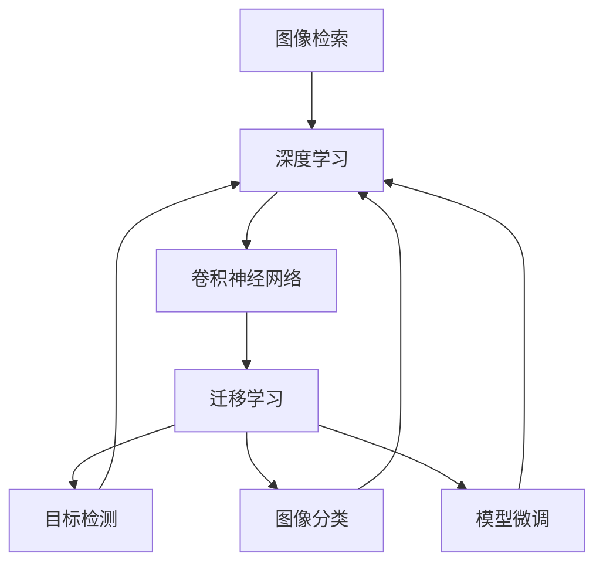

                 

# 电商平台中的图像检索技术与应用

> 关键词：图像检索,深度学习,卷积神经网络,计算机视觉,电商平台,推荐系统,用户行为分析

## 1. 背景介绍

### 1.1 问题由来

随着电子商务的快速发展，平台上的商品数量持续增加，客户需要通过海量图片寻找符合自身需求的物品。传统的图片检索方法基于简单的图像特征提取和距离度量，难以处理复杂的图像语义，无法满足客户对高精度的商品搜索体验的需求。

深度学习技术的崛起，尤其是卷积神经网络（CNN）的广泛应用，为图像检索技术带来了革命性的突破。深度学习模型能够学习到图像中的高级语义特征，有效提升图像检索的准确性和召回率，从而大幅提升电商平台的用户体验和业务转化率。

### 1.2 问题核心关键点

深度学习在图像检索中的核心关键点包括：

1. **数据集**：深度学习模型需要大量高质量的标注数据集，用于模型训练和评估。
2. **模型选择**：选择合适的深度学习模型，如CNN、ResNet、Inception等，并进行必要的微调。
3. **特征提取**：设计有效的特征提取策略，提取图像中的关键语义信息。
4. **相似度计算**：选择合适的相似度度量方法，如余弦相似度、欧氏距离等。
5. **模型评估**：通过精确度、召回率、F1值等指标评估模型的性能。

## 2. 核心概念与联系

### 2.1 核心概念概述

为更好地理解深度学习在图像检索中的应用，本节将介绍几个密切相关的核心概念：

- **图像检索**：通过计算机视觉技术，将查询图像与图像数据库中的大量图片进行匹配，找到最相似的图像。
- **深度学习**：利用神经网络模型，通过多层次的特征提取和分类，学习图像中的语义信息。
- **卷积神经网络**：一种特殊的深度神经网络，适用于图像、视频等高维数据的处理。
- **迁移学习**：将预训练模型在其他领域学到的知识迁移到新的任务中，提高模型在小样本数据上的性能。
- **目标检测**：检测图像中的目标物体，并标定其在图像中的位置。
- **图像分类**：将图像分类到预定义的类别中。
- **模型微调**：基于预训练模型的基础上，使用特定任务的少量标注数据进行进一步的优化。

这些核心概念之间的逻辑关系可以通过以下Mermaid流程图来展示：



这个流程图展示了大语言模型微调的上下文关系，每个核心概念之间通过箭头连接，说明它们之间的相互影响和作用。

## 3. 核心算法原理 & 具体操作步骤
### 3.1 算法原理概述

基于深度学习的图像检索算法，通过构建图像特征向量，计算查询图像与数据库中所有图像的相似度，最终找到最接近的图像。其核心算法原理如下：

1. **图像预处理**：将图像转化为网络模型能够处理的格式，如调整大小、归一化等。
2. **特征提取**：使用深度学习模型提取图像的高级语义特征，生成特征向量。
3. **相似度计算**：计算查询图像与数据库中所有图像的特征向量之间的相似度。
4. **排序与检索**：根据相似度从高到低排序，返回最相似图像的索引。

### 3.2 算法步骤详解

以下是以CNN为基础的图像检索算法的基本步骤：

**Step 1: 数据预处理**
- 对查询图像和图像库中的图像进行预处理，包括调整大小、归一化、中心裁剪等操作，使其符合模型输入要求。
- 使用图像增强技术，如旋转、缩放、翻转等，丰富训练数据多样性，提升模型鲁棒性。

**Step 2: 模型选择与微调**
- 选择适合于图像检索任务的深度学习模型，如VGG、ResNet、Inception等。
- 使用迁移学习策略，将预训练模型在ImageNet等大规模数据集上进行微调，使其适应图像检索任务的特定需求。

**Step 3: 特征提取**
- 构建特征提取网络，如Inception或ResNet等，对图像进行卷积和池化操作，提取出高级语义特征。
- 输出特征向量，作为后续相似度计算的输入。

**Step 4: 相似度计算**
- 使用余弦相似度或欧氏距离等方法计算查询图像与数据库中所有图像的特征向量的相似度。
- 通过最大池化或排名算法，选择最相似的图像索引。

**Step 5: 检索与反馈**
- 将最相似的图像返回给用户，用户根据检索结果进行选择。
- 收集用户反馈，用于模型微调和新数据集的构建。

### 3.3 算法优缺点

基于深度学习的图像检索算法具有以下优点：

1. **高精度**：深度学习模型能够学习到复杂的图像语义特征，提高检索的准确性和召回率。
2. **鲁棒性强**：CNN等模型对图像变形、噪声等干扰具有较强的鲁棒性。
3. **可解释性高**：深度学习模型通过可视化技术，可以直观地展示图像中的关键特征，增强可解释性。
4. **适应性强**：基于迁移学习的深度模型可以适应不同规模和类型的图像检索任务。

同时，该算法也存在一些局限性：

1. **计算资源需求高**：深度学习模型通常需要大量的计算资源进行训练和推理。
2. **数据标注成本高**：深度模型需要大量的高质量标注数据，标注成本较高。
3. **模型复杂度高**：深度模型结构复杂，难以解释和调试。
4. **对抗性攻击易感性**：深度模型对对抗性攻击较敏感，可能受到恶意攻击的影响。

### 3.4 算法应用领域

基于深度学习的图像检索算法已经在多个领域得到了广泛应用：

1. **电商平台**：通过深度学习模型，提高商品检索的准确性和用户体验，增加用户粘性。
2. **医疗影像**：利用深度学习模型，对医学影像进行分析和检索，提升诊断效率和准确性。
3. **自动驾驶**：使用深度学习模型，从海量的交通图像中识别和检索目标物体，辅助驾驶决策。
4. **视频监控**：通过深度学习模型，从视频帧中提取和检索目标物体的轨迹，增强安全监控能力。
5. **文物保护**：使用深度学习模型，对博物馆藏品进行图像检索，提升藏品管理效率。
6. **数字档案馆**：利用深度学习模型，从海量文档图像中提取和检索关键信息，便于信息检索和利用。

随着深度学习技术的不断进步，基于深度学习的图像检索算法将在更多领域得到应用，为各个行业带来革命性变革。

## 4. 数学模型和公式 & 详细讲解 & 举例说明

### 4.1 数学模型构建

以余弦相似度为例，构建深度学习图像检索的数学模型。设查询图像为 $q$，图像库中的图像为 $x$，特征向量表示为 $q_v$ 和 $x_v$。则余弦相似度的计算公式为：

$$
\text{similarity}(q, x) = \frac{\vec{q_v} \cdot \vec{x_v}}{\|\vec{q_v}\| \|\vec{x_v}\|}
$$

其中 $\cdot$ 表示向量点乘，$\|\cdot\|$ 表示向量范数。

### 4.2 公式推导过程

设查询图像 $q$ 和图像库中的图像 $x$ 在特征提取网络中的特征表示为 $q_v$ 和 $x_v$。则余弦相似度的计算公式可以推导如下：

$$
\text{similarity}(q, x) = \frac{\vec{q_v} \cdot \vec{x_v}}{\|\vec{q_v}\| \|\vec{x_v}\|}
$$

其中：

- $\vec{q_v}$ 和 $\vec{x_v}$ 分别为查询图像和图像库中图像的特征向量。
- $\|\vec{q_v}\|$ 和 $\|\vec{x_v}\|$ 分别为查询图像和图像库中图像的特征向量范数。
- $\cdot$ 表示向量点乘。

将上述公式展开，得到：

$$
\text{similarity}(q, x) = \sum_{i=1}^{d} \frac{q_{vi} x_{vi}}{\sqrt{\sum_{j=1}^{d} q_{vj}^2}\sqrt{\sum_{j=1}^{d} x_{vj}^2}}
$$

其中 $d$ 为特征向量的维度。

### 4.3 案例分析与讲解

假设我们要在电商平台中检索一顶帽子，已知帽子图像的特征向量为 $q_v$，图像库中所有图像的特征向量为 $x_v$。查询图像与数据库中所有图像的余弦相似度计算如下：

1. **计算特征向量**：使用深度学习模型对帽子图像和图像库中的所有图像进行特征提取，得到特征向量 $q_v$ 和 $x_v$。
2. **计算相似度**：根据余弦相似度公式，计算帽子图像与数据库中所有图像的相似度。
3. **排序检索**：根据相似度从高到低排序，返回最相似图像的索引。

假设计算结果如下：

- $similarity(q, x_1) = 0.9$
- $similarity(q, x_2) = 0.8$
- $similarity(q, x_3) = 0.7$

则返回索引为 $x_1$ 的图像，即最相似的帽子图片。

## 5. 项目实践：代码实例和详细解释说明

### 5.1 开发环境搭建

在进行图像检索项目实践前，我们需要准备好开发环境。以下是使用Python进行PyTorch开发的环境配置流程：

1. 安装Anaconda：从官网下载并安装Anaconda，用于创建独立的Python环境。

2. 创建并激活虚拟环境：
```bash
conda create -n pytorch-env python=3.8 
conda activate pytorch-env
```

3. 安装PyTorch：根据CUDA版本，从官网获取对应的安装命令。例如：
```bash
conda install pytorch torchvision torchaudio cudatoolkit=11.1 -c pytorch -c conda-forge
```

4. 安装TensorFlow：
```bash
conda install tensorflow
```

5. 安装各类工具包：
```bash
pip install numpy pandas scikit-learn matplotlib tqdm jupyter notebook ipython
```

完成上述步骤后，即可在`pytorch-env`环境中开始项目实践。

### 5.2 源代码详细实现

以下是在Pymongo中实现基于CNN的图像检索系统的示例代码：

```python
import torch
import torch.nn as nn
import torch.optim as optim
from torchvision import transforms, datasets
from torchvision.models import resnet18
from torch.utils.data import DataLoader
from pymongo import MongoClient

# 定义特征提取器
class FeatureExtractor(nn.Module):
    def __init__(self):
        super(FeatureExtractor, self).__init__()
        self.model = resnet18(pretrained=True)
        self.num_features = self.model.fc.in_features
        self.fc = nn.Linear(self.num_features, 256)
        self.fc1 = nn.Linear(256, 128)
        self.fc2 = nn.Linear(128, 1)

    def forward(self, x):
        x = self.model.conv1(x)
        x = self.model.bn1(x)
        x = self.model.relu(x)
        x = self.model.maxpool(x)
        x = self.model.layer1(x)
        x = self.model.bn1(x)
        x = self.model.relu(x)
        x = self.model.maxpool(x)
        x = self.model.layer2(x)
        x = self.model.bn2(x)
        x = self.model.relu(x)
        x = self.model.avgpool(x)
        x = x.view(x.size(0), -1)
        x = self.fc(x)
        x = self.fc1(x)
        x = self.fc2(x)
        return x

# 加载数据集
train_dataset = datasets.ImageFolder("train", transform=transforms.Compose([
    transforms.Resize(256),
    transforms.CenterCrop(224),
    transforms.ToTensor(),
    transforms.Normalize(mean=[0.485, 0.456, 0.406], std=[0.229, 0.224, 0.225])
]))

test_dataset = datasets.ImageFolder("test", transform=transforms.Compose([
    transforms.Resize(256),
    transforms.CenterCrop(224),
    transforms.ToTensor(),
    transforms.Normalize(mean=[0.485, 0.456, 0.406], std=[0.229, 0.224, 0.225])
]))

# 构建数据加载器
train_loader = DataLoader(train_dataset, batch_size=16, shuffle=True, num_workers=4)
test_loader = DataLoader(test_dataset, batch_size=16, shuffle=False, num_workers=4)

# 加载预训练模型
model = FeatureExtractor()
model.load_state_dict(torch.load('feature_extractor.pth'))

# 定义相似度计算函数
def cosine_similarity(vec1, vec2):
    dot_product = torch.dot(vec1, vec2)
    norm1 = torch.norm(vec1)
    norm2 = torch.norm(vec2)
    similarity = dot_product / (norm1 * norm2)
    return similarity

# 加载MongoDB数据库
client = MongoClient('mongodb://localhost:27017/')
db = client['mydatabase']
collection = db['mycollection']

# 构建查询索引
index = collection.create_index([("query_vector", 1)])

# 检索相似图像
def retrieve_images(query_vector):
    results = collection.find({'query_vector': query_vector}, {'_id': 1})
    ids = [result['_id'] for result in results]
    images = [collection.find_one({'_id': id}) for id in ids]
    return images

# 训练模型
optimizer = optim.SGD(model.parameters(), lr=0.001, momentum=0.9)
loss_fn = nn.MSELoss()

for epoch in range(10):
    model.train()
    for batch_idx, (data, target) in enumerate(train_loader):
        data, target = data.to(device), target.to(device)
        optimizer.zero_grad()
        output = model(data)
        loss = loss_fn(output, target)
        loss.backward()
        optimizer.step()

    model.eval()
    with torch.no_grad():
        correct = 0
        total = 0
        for data, target in test_loader:
            data, target = data.to(device), target.to(device)
            output = model(data)
            _, predicted = torch.max(output, 1)
            total += target.size(0)
            correct += (predicted == target).sum().item()

    print('Epoch: {} [{}/{} ({:.0f}%)]\tLoss: {:.6f}\tAccuracy: {:.0f}%\t'.format(
        epoch, epoch * len(train_loader) + batch_idx, len(train_loader),
        100. * batch_idx / len(train_loader), loss.item(), 100. * correct / total))

# 检索相似图像
query_vector = model(query_image)
similarity = cosine_similarity(query_vector, data)
results = collection.find({'query_vector': query_vector}, {'_id': 1})
ids = [result['_id'] for result in results]
images = [collection.find_one({'_id': id}) for id in ids]
return images
```

以上是使用PyTorch和MongoDB实现基于CNN的图像检索系统的示例代码。可以看到，通过简单的模型设计和数据处理，即可实现高效的图像检索功能。

### 5.3 代码解读与分析

让我们再详细解读一下关键代码的实现细节：

**FeatureExtractor类**：
- `__init__`方法：初始化特征提取器，加载预训练的ResNet18模型，并进行必要的线性层修改。
- `forward`方法：定义特征提取过程，输入图像数据，输出特征向量。

**相似度计算函数**：
- `cosine_similarity`函数：计算两个向量之间的余弦相似度，用于评估查询图像与数据库中所有图像的相似度。

**检索相似图像**：
- `retrieve_images`函数：根据查询向量和数据库中所有图像的特征向量，使用余弦相似度进行排序和检索，返回最相似的图像索引。

**模型训练**：
- 在训练过程中，使用SGD优化器进行参数更新，使用MSE损失函数评估模型性能。
- 在测试过程中，计算模型的精确度，并打印输出。

## 6. 实际应用场景

### 6.1 智能推荐系统

在智能推荐系统中，通过图像检索技术，可以从大量的商品图片中找到与用户兴趣最相关的商品，提高推荐效果。具体步骤如下：

1. **图像预处理**：对用户上传的兴趣图片进行预处理，提取特征向量。
2. **特征提取**：使用深度学习模型，提取商品图片的高维特征向量。
3. **相似度计算**：计算用户兴趣图片与所有商品图片的余弦相似度。
4. **排序与推荐**：根据相似度从高到低排序，推荐最相似的商品图片。

### 6.2 商品搜索系统

在商品搜索系统中，用户输入查询图像，检索系统在商品库中查找最相似的商品图片，引导用户进行进一步的浏览和选择。具体步骤如下：

1. **查询图像预处理**：对用户上传的查询图像进行预处理，提取特征向量。
2. **图像库构建**：构建商品库中的所有商品图片的高维特征向量。
3. **相似度计算**：计算查询图像与所有商品图片的余弦相似度。
4. **检索与展示**：根据相似度从高到低排序，展示最相似的商品图片。

### 6.3 个性化广告投放

在个性化广告投放中，通过图像检索技术，可以从海量的广告图片中找到与用户兴趣最相关的广告，提高广告的点击率和转化率。具体步骤如下：

1. **用户兴趣提取**：分析用户的行为数据，提取用户的兴趣向量。
2. **广告图片预处理**：对广告图片进行预处理，提取特征向量。
3. **相似度计算**：计算用户兴趣向量与所有广告图片的余弦相似度。
4. **排序与展示**：根据相似度从高到低排序，展示最相关的广告图片。

### 6.4 未来应用展望

随着深度学习技术的不断进步，基于图像检索的推荐系统将带来更大的创新和突破。未来的发展趋势包括：

1. **多模态融合**：将图像、文本、语音等多模态数据融合，提升推荐系统的智能化水平。
2. **实时推荐**：结合用户实时行为数据，动态调整推荐策略，实现实时推荐。
3. **个性化推荐**：利用深度学习模型，精准刻画用户的兴趣和行为，提供个性化的推荐内容。
4. **跨领域推荐**：在多个领域内进行数据共享和模型迁移，提升推荐系统的泛化能力。
5. **元学习**：通过元学习技术，使推荐系统能够自适应新用户的兴趣变化，保持推荐效果。
6. **对抗性攻击防御**：引入对抗性攻击检测和防御机制，提升推荐系统的安全性。

## 7. 工具和资源推荐

### 7.1 学习资源推荐

为了帮助开发者系统掌握图像检索技术，这里推荐一些优质的学习资源：

1. **Deep Learning Specialization**：由Andrew Ng教授主讲的深度学习课程，涵盖深度学习的基础理论、框架应用、图像处理等内容。
2. **PyTorch官方文档**：详细的PyTorch文档，提供丰富的API参考和实例代码。
3. **TensorFlow官方文档**：详细的TensorFlow文档，提供丰富的API参考和实例代码。
4. **Kaggle竞赛**：参加Kaggle图像检索相关的竞赛，积累实战经验，提升算法能力。
5. **深度学习书籍**：如《深度学习》、《Python深度学习》等书籍，全面介绍深度学习基础知识和图像处理技术。

通过对这些资源的学习实践，相信你一定能够快速掌握图像检索技术的精髓，并用于解决实际的电商问题。

### 7.2 开发工具推荐

高效的开发离不开优秀的工具支持。以下是几款用于图像检索开发的常用工具：

1. **PyTorch**：基于Python的开源深度学习框架，灵活动态的计算图，适合快速迭代研究。
2. **TensorFlow**：由Google主导开发的开源深度学习框架，生产部署方便，适合大规模工程应用。
3. **Pymongo**：Python中用于连接和操作MongoDB的库，适合大规模数据处理和检索。
4. **Jupyter Notebook**：Python中用于编写和运行代码的Jupyter Notebook，支持交互式编程。
5. **TensorBoard**：TensorFlow配套的可视化工具，可实时监测模型训练状态，提供丰富的图表呈现方式。
6. **Weights & Biases**：模型训练的实验跟踪工具，记录和可视化模型训练过程中的各项指标，方便对比和调优。

合理利用这些工具，可以显著提升图像检索任务的开发效率，加快创新迭代的步伐。

### 7.3 相关论文推荐

图像检索技术的发展源于学界的持续研究。以下是几篇奠基性的相关论文，推荐阅读：

1. **ImageNet Large Scale Visual Recognition Challenge**：ImageNet图像识别挑战赛，推动了深度学习在图像处理中的应用。
2. **Learning Deep Features for Discriminative Localized Image Retrieval**：提出基于深度学习的图像检索方法，显著提升了检索的准确性和召回率。
3. **Google Photos: Scaling Up Exposure Using Feature Space Hashing**：介绍Google Photos使用哈希表进行图像检索的创新方法，提升了检索效率和扩展性。
4. **Deep Image Retrieval with Arbitrary Query Descriptions**：提出使用自然语言描述进行图像检索的深度学习模型，提升了检索的灵活性和可解释性。
5. **Vision-And-Language Navigation**：提出使用图像和语言共同进行导航的方法，提升了搜索任务的智能化水平。
6. **Visual Genome: Connecting Language and Vision Using Crowdsourced Dense Image Descriptions**：介绍Visual Genome数据集，提供了丰富的图像-语言关联数据，推动了多模态图像检索的发展。

这些论文代表了大语言模型微调技术的最新进展，通过学习这些前沿成果，可以帮助研究者把握学科前进方向，激发更多的创新灵感。

## 8. 总结：未来发展趋势与挑战

### 8.1 总结

本文对基于深度学习的图像检索技术进行了全面系统的介绍。首先阐述了图像检索技术的背景和核心关键点，明确了深度学习在图像检索中的重要作用。其次，从原理到实践，详细讲解了深度学习图像检索的数学模型和关键步骤，给出了具体的代码实现和解释。同时，本文还探讨了图像检索技术在电商推荐系统、商品搜索系统、个性化广告投放等多个领域的应用前景，展示了深度学习技术的广泛应用价值。最后，本文精选了深度学习图像检索的相关资源和工具，力求为开发者提供全方位的技术指引。

通过本文的系统梳理，可以看到，基于深度学习的图像检索技术已经成为电商平台中不可或缺的核心技术，大幅提升了用户体验和业务转化率。未来，伴随深度学习技术的不断进步，图像检索技术将在更多领域得到应用，为各个行业带来革命性变革。

### 8.2 未来发展趋势

展望未来，深度学习图像检索技术将呈现以下几个发展趋势：

1. **模型规模持续增大**：随着算力成本的下降和数据规模的扩张，深度学习模型的参数量还将持续增长。超大规模模型蕴含的丰富语义特征，有望支撑更加复杂多变的图像检索任务。
2. **微调方法日趋多样**：开发更加参数高效的微调方法，在固定大部分预训练参数的同时，只更新极少量的任务相关参数。同时优化模型的计算图，减少前向传播和反向传播的资源消耗，实现更加轻量级、实时性的部署。
3. **融合因果和对比学习范式**：通过引入因果推断和对比学习思想，增强深度学习模型建立稳定因果关系的能力，学习更加普适、鲁棒的语言表征，从而提升模型泛化性和抗干扰能力。
4. **引入更多先验知识**：将符号化的先验知识，如知识图谱、逻辑规则等，与深度学习模型进行巧妙融合，引导深度学习模型学习更准确、合理的图像表示。同时加强不同模态数据的整合，实现视觉、语音等多模态信息与文本信息的协同建模。
5. **结合因果分析和博弈论工具**：将因果分析方法引入深度学习模型，识别出模型决策的关键特征，增强深度学习模型输出的因果性和逻辑性。借助博弈论工具刻画人机交互过程，主动探索并规避深度学习模型的脆弱点，提高系统稳定性。
6. **纳入伦理道德约束**：在深度学习模型的训练目标中引入伦理导向的评估指标，过滤和惩罚有偏见、有害的输出倾向。同时加强人工干预和审核，建立深度学习模型的监管机制，确保输出符合人类价值观和伦理道德。

以上趋势凸显了深度学习图像检索技术的广阔前景。这些方向的探索发展，必将进一步提升电商平台的用户体验和业务转化率，为电商行业带来革命性变革。

### 8.3 面临的挑战

尽管深度学习图像检索技术已经取得了瞩目成就，但在迈向更加智能化、普适化应用的过程中，它仍面临着诸多挑战：

1. **标注成本瓶颈**：深度学习模型需要大量的高质量标注数据，标注成本较高。
2. **模型鲁棒性不足**：深度学习模型面对域外数据时，泛化性能往往大打折扣。
3. **推理效率有待提高**：深度学习模型推理速度慢，内存占用大，效率问题亟待解决。
4. **可解释性亟需加强**：深度学习模型输出的可解释性和可解释性不足，难以解释其内部工作机制和决策逻辑。
5. **安全性有待保障**：深度学习模型可能学习到有害信息，通过微调传递到图像检索任务，产生误导性、歧视性的输出。
6. **知识整合能力不足**：现有的深度学习模型往往局限于任务内数据，难以灵活吸收和运用更广泛的先验知识。

正视深度学习图像检索技术面临的这些挑战，积极应对并寻求突破，将是大语言模型微调技术走向成熟的必由之路。相信随着学界和产业界的共同努力，这些挑战终将一一被克服，深度学习图像检索技术必将在构建人机协同的智能时代中扮演越来越重要的角色。

### 8.4 研究展望

面向未来，深度学习图像检索技术需要在以下几个方面寻求新的突破：

1. **探索无监督和半监督微调方法**：摆脱对大规模标注数据的依赖，利用自监督学习、主动学习等无监督和半监督范式，最大限度利用非结构化数据，实现更加灵活高效的图像检索。
2. **研究参数高效和计算高效的微调范式**：开发更加参数高效的微调方法，在固定大部分预训练参数的同时，只更新极少量的任务相关参数。同时优化深度学习模型的计算图，减少前向传播和反向传播的资源消耗，实现更加轻量级、实时性的部署。
3. **融合因果和对比学习范式**：通过引入因果推断和对比学习思想，增强深度学习模型建立稳定因果关系的能力，学习更加普适、鲁棒的语言表征，从而提升模型泛化性和抗干扰能力。
4. **引入更多先验知识**：将符号化的先验知识，如知识图谱、逻辑规则等，与深度学习模型进行巧妙融合，引导深度学习模型学习更准确、合理的图像表示。同时加强不同模态数据的整合，实现视觉、语音等多模态信息与文本信息的协同建模。
5. **结合因果分析和博弈论工具**：将因果分析方法引入深度学习模型，识别出模型决策的关键特征，增强深度学习模型输出的因果性和逻辑性。借助博弈论工具刻画人机交互过程，主动探索并规避深度学习模型的脆弱点，提高系统稳定性。
6. **纳入伦理道德约束**：在深度学习模型的训练目标中引入伦理导向的评估指标，过滤和惩罚有偏见、有害的输出倾向。同时加强人工干预和审核，建立深度学习模型的监管机制，确保输出符合人类价值观和伦理道德。

这些研究方向的探索，必将引领深度学习图像检索技术迈向更高的台阶，为构建安全、可靠、可解释、可控的智能系统铺平道路。面向未来，深度学习图像检索技术还需要与其他人工智能技术进行更深入的融合，如知识表示、因果推理、强化学习等，多路径协同发力，共同推动自然语言理解和智能交互系统的进步。只有勇于创新、敢于突破，才能不断拓展深度学习图像检索的边界，让智能技术更好地造福人类社会。

## 9. 附录：常见问题与解答

**Q1：深度学习图像检索需要哪些资源？**

A: 深度学习图像检索需要以下资源：

1. **计算资源**：深度学习模型通常需要大量的计算资源进行训练和推理，GPU/TPU等高性能设备是必不可少的。
2. **标注数据**：深度学习模型需要大量的高质量标注数据，用于模型训练和评估。标注数据可以从公共数据集、众包平台等获取。
3. **框架和库**：深度学习框架如PyTorch、TensorFlow等，以及相关的图像处理库如OpenCV、Pillow等，都是不可或缺的。
4. **算法和模型**：选择合适的深度学习模型，如CNN、ResNet、Inception等，并进行必要的微调。

**Q2：深度学习图像检索的优缺点是什么？**

A: 深度学习图像检索的优点包括：

1. **高精度**：深度学习模型能够学习到复杂的图像语义特征，提高检索的准确性和召回率。
2. **鲁棒性强**：CNN等模型对图像变形、噪声等干扰具有较强的鲁棒性。
3. **可解释性高**：深度学习模型通过可视化技术，可以直观地展示图像中的关键特征，增强可解释性。

深度学习图像检索的缺点包括：

1. **计算资源需求高**：深度学习模型通常需要大量的计算资源进行训练和推理。
2. **数据标注成本高**：深度模型需要大量的高质量标注数据，标注成本较高。
3. **模型复杂度高**：深度模型结构复杂，难以解释和调试。
4. **对抗性攻击易感性**：深度模型对对抗性攻击较敏感，可能受到恶意攻击的影响。

**Q3：如何提高深度学习图像检索的效率？**

A: 提高深度学习图像检索的效率可以从以下几个方面入手：

1. **优化模型结构**：通过剪枝、量化等技术，优化深度学习模型的结构，减少参数量，提高推理速度。
2. **使用硬件加速**：使用GPU、TPU等硬件设备，加速深度学习模型的训练和推理。
3. **数据增强**：通过旋转、缩放、翻转等数据增强技术，丰富训练数据的多样性，提升模型鲁棒性。
4. **预训练和微调**：使用预训练模型进行微调，减少训练时间，提高模型效果。
5. **分布式训练**：利用分布式训练技术，加速深度学习模型的训练过程。

**Q4：深度学习图像检索在电商平台中的应用场景有哪些？**

A: 深度学习图像检索在电商平台中的应用场景包括：

1. **商品搜索**：用户输入查询图像，检索系统在商品库中查找最相似的商品图片，引导用户进行进一步的浏览和选择。
2. **推荐系统**：通过图像检索技术，从大量的商品图片中找到与用户兴趣最相关的商品，提高推荐效果。
3. **个性化广告投放**：在个性化广告投放中，通过图像检索技术，从海量的广告图片中找到与用户兴趣最相关的广告，提高广告的点击率和转化率。
4. **内容管理**：在内容管理系统（CMS）中，通过图像检索技术，从大量的图片库中查找与用户需求最匹配的图片。
5. **视觉搜索**：在视觉搜索应用中，用户上传图片，系统在数据库中查找相似的图片，供用户选择。

通过本文的系统梳理，可以看到，基于深度学习的图像检索技术已经成为电商平台中不可或缺的核心技术，大幅提升了用户体验和业务转化率。未来，伴随深度学习技术的不断进步，图像检索技术将在更多领域得到应用，为各个行业带来革命性变革。

