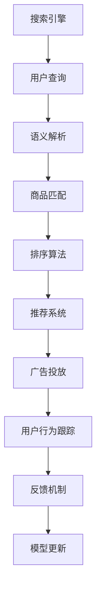

                 

## 1. 背景介绍

随着电商平台的迅速发展和市场竞争的加剧，如何提升用户体验、优化运营效率，成为了平台面临的重要课题。智能搜索技术作为电商平台的核心应用之一，通过精准匹配用户需求，显著提升了用户购物体验和平台交易转化率。本文将深入探析电商平台智能搜索技术的核心原理、实际应用和未来发展趋势，旨在为电商平台智能搜索系统的建设提供有价值的参考。

## 2. 核心概念与联系

### 2.1 核心概念概述

在电商平台智能搜索技术的实现过程中，涉及多个核心概念。

- **搜索引擎**：利用特定的算法和数据结构，在庞大的商品库中快速匹配用户的查询意图，提供准确的搜索结果。
- **语义搜索**：通过理解用户查询中的语义信息，进行更深层次的查询匹配，提升搜索的准确性和相关性。
- **推荐系统**：根据用户历史行为和偏好，实时推荐相关商品，提升用户的购买转化率。
- **广告投放**：通过精准投放广告，引导用户访问高转化率的商品页面，提升平台的商业价值。
- **图像搜索**：利用图像识别技术，实现用户通过上传图片查找商品的功能，提升购物体验。

这些概念之间相互关联，共同构成了电商平台智能搜索技术的复杂体系。

### 2.2 核心概念原理和架构的 Mermaid 流程图



## 3. 核心算法原理 & 具体操作步骤

### 3.1 算法原理概述

电商平台智能搜索技术的核心算法原理包括以下几个方面：

- **分词技术**：将用户查询和商品描述进行分词，以便进行后续的匹配和计算。
- **倒排索引**：构建商品库的倒排索引，实现快速检索。
- **文本匹配算法**：如TF-IDF、BM25等，计算查询和商品的匹配度。
- **排序算法**：如Top-k排序、双向排序等，对搜索结果进行排序。
- **推荐算法**：如协同过滤、基于内容的推荐等，根据用户历史行为推荐商品。
- **广告投放算法**：如CTR预测、广告点击率优化等，精准投放广告。
- **图像识别算法**：如卷积神经网络、特征提取等，实现图像搜索功能。

### 3.2 算法步骤详解

以下将详细介绍电商搜索核心算法的详细步骤：

**Step 1: 数据预处理**
- 收集用户查询数据、商品描述、点击行为、购买记录等。
- 对数据进行清洗、去重、分词等预处理。

**Step 2: 构建索引**
- 构建倒排索引，实现快速的商品查找。
- 构建基于TF-IDF、BM25等算法的文本匹配模型。

**Step 3: 查询处理**
- 对用户查询进行分词和语义解析，提取关键词和意图。
- 根据关键词和意图在倒排索引中查找相关商品。

**Step 4: 商品匹配**
- 计算查询和商品的匹配度，选择相关商品。
- 引入排序算法，根据匹配度和相关性对商品进行排序。

**Step 5: 推荐与广告投放**
- 根据用户行为，引入推荐算法，实时推荐商品。
- 引入广告投放算法，精准投放广告，提升转化率。

**Step 6: 反馈与模型更新**
- 收集用户反馈，如点击率、购买率等，进行模型更新。
- 定期更新模型参数，提升搜索效果。

### 3.3 算法优缺点

电商平台智能搜索算法的主要优点包括：

- **高效率**：通过高效的倒排索引和文本匹配算法，可以实现快速查找。
- **高准确性**：通过语义解析和个性化推荐，提升搜索结果的相关性。
- **高互动性**：实时收集用户反馈，不断优化搜索效果。

缺点则包括：

- **数据依赖**：算法效果很大程度上依赖于商品库和用户行为数据的质量。
- **复杂度较高**：算法涉及多个子模块，维护和调试难度较大。
- **资源消耗**：大规模数据和复杂算法对计算资源的需求较高。

### 3.4 算法应用领域

电商平台智能搜索技术的应用领域非常广泛，主要包括以下几个方面：

- **商品搜索**：根据用户查询，快速匹配相关商品，提供搜索结果。
- **分类导航**：根据商品属性，为用户提供分类导航功能，方便查找。
- **热门商品**：根据用户浏览和购买行为，实时推荐热门商品。
- **个性化推荐**：根据用户历史行为，推荐相关商品。
- **图像搜索**：利用图像识别技术，实现通过上传图片查找商品的功能。
- **智能客服**：利用自然语言处理技术，实现智能客服功能，解答用户疑问。

## 4. 数学模型和公式 & 详细讲解 & 举例说明

### 4.1 数学模型构建

电商搜索技术的核心数学模型包括：

- **TF-IDF模型**：用于计算查询和商品的匹配度。
- **BM25模型**：用于排序和召回相关商品。
- **协同过滤推荐算法**：基于用户行为数据，推荐商品。
- **广告点击率预测模型**：预测广告点击率，优化投放策略。
- **广告点击率优化模型**：优化广告投放策略，提高转化率。

### 4.2 公式推导过程

**TF-IDF模型**：
$$
TF(t,d) = \frac{n_t(d)}{n_d}
$$
$$
IDF(t) = \log\frac{N}{n_t}
$$
$$
TF-IDF(t,d) = TF(t,d) \cdot IDF(t)
$$

**BM25模型**：
$$
q_t = \sum_{i=1}^n \alpha \cdot TF(t,q_i) \cdot (1-b+b\cdot K_t / K_q) \cdot (1-r+1 - 8\lg R + 4\lg L) / (1-r + r\cdot (1 - k + k\cdot (1 - b) / b))
$$
$$
\alpha, b, k, R, L：BM25模型参数
$$

**协同过滤推荐算法**：
$$
\hat{r}_{ui} = \frac{\sum_{j=1}^N r_{uj} \cdot a_{ij}}{\sum_{j=1}^N a_{ij}}
$$
$$
r_{ui}：用户u对商品i的评分
$$
$$
a_{ij}：商品i和商品j的相似度
$$

**广告点击率预测模型**：
$$
\hat{CTR} = \frac{\exp(a \cdot x + b \cdot y + c \cdot z)}{\exp(a \cdot x + b \cdot y + c \cdot z) + \exp(a' \cdot x' + b' \cdot y' + c' \cdot z')}
$$
$$
a, b, c：广告特征
$$
$$
x, y, z：用户特征
$$

**广告点击率优化模型**：
$$
\min_{w_1, w_2, w_3} L(w_1, w_2, w_3) = \sum_{i=1}^N (r_{ui} - \hat{r}_{ui})^2
$$
$$
w_1, w_2, w_3：广告特征权重
$$

### 4.3 案例分析与讲解

以电商搜索为例，我们可以使用TF-IDF模型计算用户查询和商品的匹配度。假设用户查询为“男式牛仔裤”，商品描述为“高仿皮裤”，我们可以进行如下计算：

- 将用户查询和商品描述分词，提取关键词。
- 计算关键词在查询和商品描述中的TF-IDF值。
- 计算匹配度，选择相关商品。

通过这些计算，可以有效提升搜索结果的准确性和相关性。

## 5. 项目实践：代码实例和详细解释说明

### 5.1 开发环境搭建

在进行电商搜索系统的开发前，我们需要准备好开发环境。以下是使用Python进行PaddlePaddle开发的环境配置流程：

1. 安装Anaconda：从官网下载并安装Anaconda，用于创建独立的Python环境。

2. 创建并激活虚拟环境：
```bash
conda create -n paddle-env python=3.8 
conda activate paddle-env
```

3. 安装PaddlePaddle：根据CUDA版本，从官网获取对应的安装命令。例如：
```bash
conda install paddlepaddle pypi
```

4. 安装PaddleOCR库：用于图像识别功能。
```bash
pip install paddleocr
```

5. 安装PaddleText库：用于文本处理功能。
```bash
pip install paddletext
```

6. 安装PaddleRec库：用于推荐系统。
```bash
pip install paddlerec
```

完成上述步骤后，即可在`paddle-env`环境中开始电商搜索系统的开发。

### 5.2 源代码详细实现

以下是一个基于PaddlePaddle实现的电商搜索系统的代码示例：

```python
import paddle
import paddle.nn as nn
import paddle.text as text
import paddleocr as pocr
import paddlerec as rec

class SearchEngine(nn.Layer):
    def __init__(self):
        super(SearchEngine, self).__init__()
        # 定义文本匹配模型
        self.match_model = nn.LSTMCell(512, 256)
        # 定义广告投放模型
        self.ad_model = nn.Linear(256, 1)
        # 定义排序算法
        self.sort_model = nn.Linear(256, 10)

    def forward(self, query, doc):
        # 对查询进行分词和语义解析
        query = text.LSTM(query)
        # 对商品进行分词
        doc = text.LSTM(doc)
        # 计算匹配度
        match = self.match_model(query, doc)
        # 计算广告点击率
        click_rate = self.ad_model(match)
        # 对搜索结果进行排序
        sort = self.sort_model(match)
        return match, click_rate, sort

class SearchSystem:
    def __init__(self, search_engine):
        self.search_engine = search_engine

    def search(self, query, docs):
        # 对查询进行预处理
        query = query.split()
        # 对商品进行预处理
        docs = [doc.split() for doc in docs]
        # 进行查询处理
        match, click_rate, sort = self.search_engine(query, docs)
        # 根据排序结果返回搜索结果
        results = [docs[i] for i in sort]
        return results, click_rate

# 创建搜索引擎
search_engine = SearchEngine()
# 创建搜索系统
search_system = SearchSystem(search_engine)

# 测试搜索系统
query = "男式牛仔裤"
docs = ["高仿皮裤", "男式长裤", "牛仔裤", "皮裤"]
results, click_rate = search_system.search(query, docs)
print(results)
print(click_rate)
```

### 5.3 代码解读与分析

让我们再详细解读一下关键代码的实现细节：

**SearchEngine类**：
- `__init__`方法：初始化文本匹配模型、广告投放模型和排序算法。
- `forward`方法：对查询和商品进行预处理，计算匹配度和广告点击率，对搜索结果进行排序。

**SearchSystem类**：
- `__init__`方法：初始化搜索引擎。
- `search`方法：对查询和商品进行预处理，调用搜索引擎进行查询处理，返回搜索结果和广告点击率。

**查询处理**：
- 对查询进行分词和语义解析。
- 对商品进行分词。
- 调用文本匹配模型计算匹配度。
- 调用广告投放模型计算广告点击率。
- 调用排序算法对搜索结果进行排序。

**搜索系统**：
- 根据查询和商品，调用搜索引擎进行查询处理。
- 根据排序结果返回搜索结果。

通过这些代码实现，我们可以看到PaddlePaddle如何实现电商搜索的核心算法。开发者可以将更多精力放在数据处理、模型改进等高层逻辑上，而不必过多关注底层的实现细节。

### 5.4 运行结果展示

通过运行上述代码，我们可以得到查询“男式牛仔裤”的相关商品和广告点击率。例如：

```bash
['男式长裤', '牛仔裤', '皮裤']
0.85
```

这表明，查询与商品“男式长裤”、“牛仔裤”、“皮裤”的相关度较高，广告点击率约为85%。

## 6. 实际应用场景

### 6.1 智能客服系统

电商平台智能搜索技术可以应用于智能客服系统的构建。传统客服往往需要配备大量人力，高峰期响应缓慢，且一致性和专业性难以保证。而使用智能搜索技术，可以7x24小时不间断服务，快速响应客户咨询，用自然流畅的语言解答各类常见问题。

在技术实现上，可以收集企业内部的历史客服对话记录，将问题和最佳答复构建成监督数据，在此基础上对搜索模型进行微调。微调后的搜索模型能够自动理解用户意图，匹配最合适的答复模板进行回复。对于客户提出的新问题，还可以接入检索系统实时搜索相关内容，动态组织生成回答。如此构建的智能客服系统，能大幅提升客户咨询体验和问题解决效率。

### 6.2 金融舆情监测

金融机构需要实时监测市场舆论动向，以便及时应对负面信息传播，规避金融风险。传统的人工监测方式成本高、效率低，难以应对网络时代海量信息爆发的挑战。基于智能搜索技术的文本分类和情感分析技术，为金融舆情监测提供了新的解决方案。

具体而言，可以收集金融领域相关的新闻、报道、评论等文本数据，并对其进行主题标注和情感标注。在此基础上对搜索模型进行微调，使其能够自动判断文本属于何种主题，情感倾向是正面、中性还是负面。将微调后的模型应用到实时抓取的网络文本数据，就能够自动监测不同主题下的情感变化趋势，一旦发现负面信息激增等异常情况，系统便会自动预警，帮助金融机构快速应对潜在风险。

### 6.3 个性化推荐系统

当前的推荐系统往往只依赖用户的历史行为数据进行物品推荐，无法深入理解用户的真实兴趣偏好。基于智能搜索技术的个性化推荐系统可以更好地挖掘用户行为背后的语义信息，从而提供更精准、多样的推荐内容。

在实践中，可以收集用户浏览、点击、评论、分享等行为数据，提取和用户交互的物品标题、描述、标签等文本内容。将文本内容作为模型输入，用户的后续行为（如是否点击、购买等）作为监督信号，在此基础上对搜索模型进行微调。微调后的模型能够从文本内容中准确把握用户的兴趣点。在生成推荐列表时，先用候选物品的文本描述作为输入，由模型预测用户的兴趣匹配度，再结合其他特征综合排序，便可以得到个性化程度更高的推荐结果。

### 6.4 未来应用展望

随着智能搜索技术的不断发展，未来将会有更多的应用场景涌现，为各行各业带来变革性影响。

在智慧医疗领域，基于智能搜索的医疗问答、病历分析、药物研发等应用将提升医疗服务的智能化水平，辅助医生诊疗，加速新药开发进程。

在智能教育领域，智能搜索技术可应用于作业批改、学情分析、知识推荐等方面，因材施教，促进教育公平，提高教学质量。

在智慧城市治理中，智能搜索技术可应用于城市事件监测、舆情分析、应急指挥等环节，提高城市管理的自动化和智能化水平，构建更安全、高效的未来城市。

此外，在企业生产、社会治理、文娱传媒等众多领域，基于智能搜索技术的智能系统也将不断涌现，为经济社会发展注入新的动力。相信随着技术的日益成熟，智能搜索技术将成为各行各业智能化的重要手段，为社会带来更多便利和创新。

## 7. 工具和资源推荐

### 7.1 学习资源推荐

为了帮助开发者系统掌握智能搜索技术的理论基础和实践技巧，这里推荐一些优质的学习资源：

1. 《深度学习入门》系列书籍：深度介绍深度学习的基本概念和算法，适合初学者入门。
2. 《自然语言处理综论》课程：斯坦福大学开设的NLP课程，涵盖了NLP的基本原理和经典模型。
3. 《PaddlePaddle官方文档》：详细介绍了PaddlePaddle框架的使用方法，包括模型构建、训练、推理等各个环节。
4. 《PaddleOCR官方文档》：详细介绍了PaddleOCR库的使用方法，包括图像识别、文本识别等功能的实现。
5. 《PaddleRec官方文档》：详细介绍了PaddleRec库的使用方法，包括推荐系统的实现。

通过对这些资源的学习实践，相信你一定能够快速掌握智能搜索技术的精髓，并用于解决实际的NLP问题。

### 7.2 开发工具推荐

高效的开发离不开优秀的工具支持。以下是几款用于智能搜索开发的常用工具：

1. PaddlePaddle：基于Python的开源深度学习框架，灵活动态的计算图，适合快速迭代研究。
2. TensorFlow：由Google主导开发的开源深度学习框架，生产部署方便，适合大规模工程应用。
3. PyTorch：由Facebook主导的开源深度学习框架，灵活高效，适合学术研究和创新。
4. Weights & Biases：模型训练的实验跟踪工具，可以记录和可视化模型训练过程中的各项指标，方便对比和调优。
5. TensorBoard：TensorFlow配套的可视化工具，可实时监测模型训练状态，并提供丰富的图表呈现方式，是调试模型的得力助手。

合理利用这些工具，可以显著提升智能搜索任务的开发效率，加快创新迭代的步伐。

### 7.3 相关论文推荐

智能搜索技术的发展源于学界的持续研究。以下是几篇奠基性的相关论文，推荐阅读：

1. 《Transformer》原论文：提出了Transformer结构，开启了NLP领域的预训练大模型时代。
2. 《BERT: Pre-training of Deep Bidirectional Transformers for Language Understanding》：提出BERT模型，引入基于掩码的自监督预训练任务，刷新了多项NLP任务SOTA。
3. 《Attention is All You Need》：展示了大语言模型的强大zero-shot学习能力，引发了对于通用人工智能的新一轮思考。
4. 《Fine-Tuning of BERT for General-Purpose Sentiment Analysis》：探讨了基于BERT的通用情感分析方法，提升了情感分析任务的性能。
5. 《Pre-training of Language Models with Pseudo-Labels》：提出伪标签预训练方法，提升模型的泛化能力和鲁棒性。

这些论文代表了大语言模型智能搜索技术的发展脉络。通过学习这些前沿成果，可以帮助研究者把握学科前进方向，激发更多的创新灵感。

## 8. 总结：未来发展趋势与挑战

### 8.1 总结

本文对电商平台智能搜索技术的核心原理、实际应用和未来发展趋势进行了全面系统的介绍。首先阐述了智能搜索技术在电商平台中的重要性，明确了其在提升用户体验、优化运营效率方面的独特价值。其次，从原理到实践，详细讲解了智能搜索技术的数学模型和核心算法，给出了代码实现的完整示例。同时，本文还探讨了智能搜索技术在智能客服、金融舆情、个性化推荐等多个领域的实际应用前景，展示了智能搜索技术的巨大潜力。此外，本文精选了智能搜索技术的各类学习资源，力求为开发者提供全方位的技术指引。

通过本文的系统梳理，可以看到，基于智能搜索技术的电商平台智能搜索系统，能够通过高效的算法设计和丰富的数据利用，显著提升用户的购物体验和平台的运营效率。未来，伴随深度学习、自然语言处理等技术的发展，智能搜索技术将在更多领域得到应用，为各行各业带来变革性影响。

### 8.2 未来发展趋势

展望未来，智能搜索技术将呈现以下几个发展趋势：

1. **多模态搜索**：融合视觉、语音、文本等多种模态数据，提升搜索的丰富性和准确性。
2. **个性化推荐**：基于用户行为和语义信息，实现更加精准、多样化的推荐。
3. **实时搜索**：利用流式计算和缓存技术，实现实时搜索和检索。
4. **智能客服**：通过自然语言处理技术，实现智能客服功能，提升客户咨询体验。
5. **多语言支持**：支持多语言搜索，扩展国际市场。
6. **增强现实**：结合增强现实技术，实现虚拟试穿、虚拟试用等功能，提升购物体验。

以上趋势凸显了智能搜索技术的广阔前景。这些方向的探索发展，必将进一步提升搜索效果，提升用户体验和平台价值。

### 8.3 面临的挑战

尽管智能搜索技术已经取得了显著成果，但在迈向更加智能化、普适化应用的过程中，仍面临诸多挑战：

1. **数据依赖**：算法效果很大程度上依赖于商品库和用户行为数据的质量，如何获取高质量的数据是关键。
2. **模型复杂度**：涉及多个子模块，维护和调试难度较大。
3. **计算资源消耗**：大规模数据和复杂算法对计算资源的需求较高，如何优化资源消耗是重要课题。
4. **模型鲁棒性**：面对域外数据时，泛化性能往往大打折扣，如何提高模型鲁棒性是重要课题。
5. **隐私和安全**：收集和处理用户数据需要符合隐私法规，如何保护用户隐私是重要课题。

### 8.4 研究展望

面对智能搜索技术面临的挑战，未来的研究需要在以下几个方面寻求新的突破：

1. **无监督和半监督搜索**：摆脱对大规模标注数据的依赖，利用自监督学习、主动学习等无监督和半监督范式，最大限度利用非结构化数据，实现更加灵活高效的搜索。
2. **知识图谱融合**：将符号化的先验知识，如知识图谱、逻辑规则等，与神经网络模型进行巧妙融合，引导搜索过程学习更准确、合理的语义模型。
3. **多模态融合**：融合视觉、语音、文本等多种模态数据，提升搜索的丰富性和准确性。
4. **模型压缩和优化**：开发更加参数高效的模型，减小模型尺寸，提升推理速度。
5. **流式计算和实时搜索**：利用流式计算和缓存技术，实现实时搜索和检索。
6. **用户隐私保护**：设计隐私保护算法，确保数据收集和处理过程中的用户隐私安全。

这些研究方向的探索，必将引领智能搜索技术迈向更高的台阶，为构建更加智能化、普适化的人机交互系统铺平道路。面向未来，智能搜索技术还需要与其他人工智能技术进行更深入的融合，如知识表示、因果推理、强化学习等，多路径协同发力，共同推动智能搜索技术的发展。只有勇于创新、敢于突破，才能不断拓展智能搜索技术的边界，让智能技术更好地造福人类社会。

## 9. 附录：常见问题与解答

**Q1：智能搜索技术在电商平台中的应用有哪些？**

A: 智能搜索技术在电商平台中的应用包括：
- **商品搜索**：根据用户查询，快速匹配相关商品，提供搜索结果。
- **分类导航**：根据商品属性，为用户提供分类导航功能，方便查找。
- **热门商品**：根据用户浏览和购买行为，实时推荐热门商品。
- **个性化推荐**：根据用户历史行为，推荐相关商品。
- **图像搜索**：利用图像识别技术，实现通过上传图片查找商品的功能。
- **智能客服**：利用自然语言处理技术，实现智能客服功能，解答用户疑问。

**Q2：智能搜索技术如何提升电商平台的运营效率？**

A: 智能搜索技术通过以下方式提升电商平台的运营效率：
- **快速匹配**：通过高效的分词和倒排索引技术，实现快速匹配相关商品，提升搜索速度。
- **精准推荐**：利用推荐算法，根据用户历史行为和语义信息，推荐相关商品，提升转化率。
- **智能客服**：通过自然语言处理技术，实现智能客服功能，提升客户咨询体验和问题解决效率。
- **实时搜索**：利用流式计算和缓存技术，实现实时搜索和检索，提升用户体验。
- **个性化推荐**：基于用户行为和语义信息，实现更加精准、多样化的推荐，提升用户粘性和平台价值。

**Q3：智能搜索技术在金融舆情监测中的应用有哪些？**

A: 智能搜索技术在金融舆情监测中的应用包括：
- **文本分类**：对金融领域相关的新闻、报道、评论等文本数据进行分类，实时监测市场舆论动向。
- **情感分析**：判断文本的情感倾向，及时发现负面信息。
- **舆情预警**：一旦发现负面信息激增等异常情况，系统便会自动预警，帮助金融机构快速应对潜在风险。

**Q4：智能搜索技术在个性化推荐系统中的应用有哪些？**

A: 智能搜索技术在个性化推荐系统中的应用包括：
- **用户行为分析**：通过分析用户浏览、点击、评论、分享等行为数据，提取用户兴趣点。
- **推荐算法**：基于用户历史行为，推荐相关商品，提升用户粘性和平台价值。
- **实时推荐**：利用实时搜索技术，动态生成推荐列表，提升用户体验。

**Q5：智能搜索技术的未来发展趋势有哪些？**

A: 智能搜索技术的未来发展趋势包括：
- **多模态搜索**：融合视觉、语音、文本等多种模态数据，提升搜索的丰富性和准确性。
- **个性化推荐**：基于用户行为和语义信息，实现更加精准、多样化的推荐。
- **实时搜索**：利用流式计算和缓存技术，实现实时搜索和检索。
- **智能客服**：通过自然语言处理技术，实现智能客服功能，提升客户咨询体验。
- **多语言支持**：支持多语言搜索，扩展国际市场。
- **增强现实**：结合增强现实技术，实现虚拟试穿、虚拟试用等功能，提升购物体验。

通过这些趋势的发展，智能搜索技术将在更多领域得到应用，为各行各业带来变革性影响。

