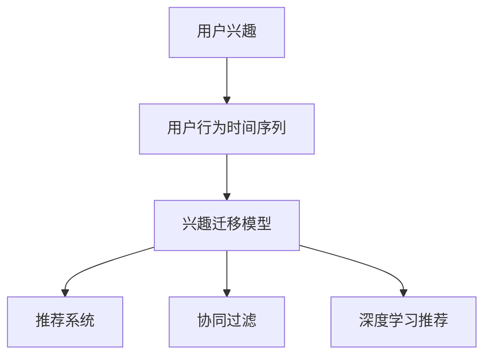

                 

# 电商平台中的用户兴趣迁移模型

## 1. 背景介绍

### 1.1 问题由来

随着电子商务的快速发展，电商平台的用户数量和交易额均呈爆炸性增长，对个性化推荐系统提出了更高的要求。用户购买行为往往受到当前和历史兴趣的影响，但用户兴趣会随时间推移而发生显著变化。因此，如何建模用户兴趣的迁移特性，有效预测用户未来的行为，成为个性化推荐系统的重要课题。

近年来，协同过滤、内容推荐、深度学习等推荐算法层出不穷，推动了推荐系统性能的快速提升。特别是在深度学习领域，基于用户行为数据的模型，如隐式协同过滤、基于矩阵分解的推荐、深度神经网络等，已经在电商平台的个性化推荐中发挥了巨大作用。然而，这些模型通常无法直接捕捉用户兴趣的动态变化，难以适应长期行为模式的变迁。

本研究针对用户兴趣迁移特性，提出了一种基于用户行为时间序列的兴趣迁移模型。该模型通过对用户过去和当前行为的数据建模，预测未来行为的趋势，从而在时间维度上捕捉用户兴趣的变化。

### 1.2 问题核心关键点

用户兴趣迁移模型核心目标在于准确预测用户未来的购买行为，提升推荐系统的个性化和时效性。该模型通过分析用户历史和实时行为，捕捉用户兴趣的演化趋势，对用户未来行为进行预测和推荐。

核心挑战包括：

1. **用户兴趣建模**：如何有效捕捉用户过去行为模式和当前兴趣状态。
2. **兴趣迁移预测**：如何基于用户历史和实时行为数据，预测用户未来的行为。
3. **时间序列建模**：如何对用户行为时间序列进行建模，并捕捉其中的趋势和周期性变化。
4. **推荐算法集成**：如何将兴趣迁移预测结果与传统的推荐算法（如协同过滤、内容推荐等）结合，提升整体推荐效果。

## 2. 核心概念与联系

### 2.1 核心概念概述

为更好地理解用户兴趣迁移模型，本节将介绍几个密切相关的核心概念：

- **用户兴趣**：用户在进行商品浏览、购买、评价等行为时所表现出的偏好和倾向，可以量化为用户在不同商品上的点击、购买、评分等行为数据。
- **用户行为时间序列**：用户历史和实时行为数据在时间维度上的序列形式，其中蕴含了用户兴趣的演化趋势。
- **兴趣迁移模型**：通过对用户行为时间序列的建模，预测用户兴趣随时间的变化，从而指导未来的行为预测和推荐。
- **推荐系统**：根据用户行为数据和商品属性，为特定用户推荐其可能感兴趣的商品。
- **协同过滤**：基于用户行为数据的推荐算法，利用用户行为相似度进行推荐。
- **深度学习推荐**：基于深度神经网络的推荐算法，可以捕捉用户行为背后的复杂关系和特征。

这些核心概念之间的逻辑关系可以通过以下Mermaid流程图来展示：



这个流程图展示了大语言模型的核心概念及其之间的关系：

1. 用户兴趣通过对用户行为进行量化建模。
2. 用户行为时间序列为模型提供了数据支撑。
3. 兴趣迁移模型捕捉用户兴趣的动态变化。
4. 推荐系统根据用户兴趣进行商品推荐。
5. 协同过滤和深度学习推荐是常用的推荐算法，可以与兴趣迁移模型结合提升推荐效果。

## 3. 核心算法原理 & 具体操作步骤

### 3.1 算法原理概述

用户兴趣迁移模型主要基于时间序列建模和深度学习预测技术。其核心思想是：通过分析用户历史和实时行为数据，捕捉用户兴趣的演化趋势，预测用户未来的购买行为。

具体而言，模型将用户行为序列分解为若干个时间片段，并利用LSTM等循环神经网络捕捉用户兴趣的演化趋势。模型通过学习用户行为序列中的时间依赖关系，预测用户未来的购买行为，从而指导推荐系统的商品推荐。

### 3.2 算法步骤详解

用户兴趣迁移模型的构建步骤如下：

**Step 1: 数据预处理**

1. 收集用户行为数据，包括用户在不同商品上的点击、购买、评分等行为数据，以及用户注册信息、性别、年龄等属性信息。
2. 对行为数据进行归一化处理，使其在[0, 1]区间内。
3. 对行为数据进行时间序列划分，将每个用户的历史行为数据划分为若干个时间片段。

**Step 2: 模型构建**

1. 构建LSTM网络，对用户行为时间序列进行建模。LSTM网络可以捕捉时间序列中的长期依赖关系，捕捉用户兴趣的演化趋势。
2. 模型输出层连接多层感知器(MLP)网络，将预测结果映射到具体的商品ID，生成推荐列表。
3. 引入Dropout、L2正则等正则化技术，防止模型过拟合。

**Step 3: 模型训练**

1. 划分训练集和验证集，使用交叉熵等损失函数进行模型训练。
2. 在训练过程中，周期性地在验证集上评估模型性能，根据性能指标调整模型参数。
3. 使用梯度下降等优化算法，最小化损失函数，训练模型。

**Step 4: 模型评估**

1. 在测试集上评估模型性能，计算推荐准确率、召回率、F1值等指标。
2. 使用AUC等评估指标，衡量模型在排序上的性能。
3. 计算个性化推荐的相关性指标，评估模型的个性化推荐效果。

**Step 5: 模型应用**

1. 将训练好的模型应用于电商平台的推荐系统，实时接收用户行为数据，并根据模型预测结果进行商品推荐。
2. 定期更新模型参数，重新训练模型，以适应用户兴趣的变化。

### 3.3 算法优缺点

用户兴趣迁移模型具有以下优点：

1. **个性化推荐**：通过对用户行为时间序列的建模，捕捉用户兴趣的演化趋势，可以更准确地预测用户未来的行为，从而进行个性化推荐。
2. **适应性高**：模型可以适应用户兴趣的长期变化，对于长期行为的预测效果更好。
3. **泛化能力强**：模型可以利用用户历史和实时行为数据，捕捉行为序列中的时间依赖关系，具有较强的泛化能力。
4. **可解释性强**：模型的预测结果可以分解为各个时间片段的贡献，便于解释和调试。

同时，该模型也存在一些局限性：

1. **数据需求高**：模型需要大量的用户行为数据进行训练，对于新用户或行为较少的用户，模型的效果可能不佳。
2. **计算复杂度高**：LSTM网络对于大规模数据集的处理复杂度高，需要较高的计算资源。
3. **泛化能力受限**：模型对行为数据的分布变化敏感，如果用户行为数据分布发生变化，模型的性能可能下降。
4. **可解释性有限**：模型难以解释某些复杂的用户行为模式，导致对某些用户的推荐结果不够精准。

### 3.4 算法应用领域

用户兴趣迁移模型可以广泛应用于电商平台的个性化推荐场景，具体应用领域包括：

- **商品推荐**：根据用户历史和实时行为数据，预测用户未来对商品的兴趣，进行个性化推荐。
- **广告推荐**：利用用户兴趣迁移模型，预测用户对广告的响应行为，提升广告的点击率和转化率。
- **活动推荐**：根据用户历史行为数据，预测用户对促销活动的响应行为，进行个性化活动推荐。
- **个性化商品搜索**：基于用户兴趣迁移模型，预测用户对搜索关键词的兴趣变化，优化搜索结果。
- **新用户推荐**：利用用户兴趣迁移模型，预测新用户对不同商品的兴趣，进行定向推荐，加速新用户激活。

## 4. 数学模型和公式 & 详细讲解 & 举例说明

### 4.1 数学模型构建

本节将使用数学语言对用户兴趣迁移模型进行更加严格的刻画。

记用户历史和实时行为数据为 $X = \{x_1, x_2, ..., x_T\}$，其中 $x_t = [x_{t1}, x_{t2}, ..., x_{tk}]$ 表示用户在第 $t$ 时间段内对商品的交互数据，$x_{ti}$ 表示用户在第 $i$ 个商品上的交互行为。模型输入为 $X_t = \{x_1, x_2, ..., x_t\}$，输出为 $X_{t+1}$ 的预测值 $x_{t+1} = [x_{t+11}, x_{t+12}, ..., x_{t+k}]$。

定义LSTM网络，其输出层连接MLP网络，模型结构如下：

$$
f(X_t) = \text{MLP}(LSTM(X_t))
$$

其中，$LSTM(X_t)$ 为LSTM网络的输出，$\text{MLP}(z)$ 为MLP网络的输出。

### 4.2 公式推导过程

以LSTM网络的输出层为例，其计算过程如下：

设用户历史和实时行为数据为 $X_t = \{x_1, x_2, ..., x_t\}$，模型输出为 $X_{t+1}$ 的预测值 $x_{t+1} = [x_{t+11}, x_{t+12}, ..., x_{t+k}]$。

LSTM网络利用长短时记忆单元，捕捉时间序列中的长期依赖关系。模型结构如图：

```
Input Layer -> LSTM -> Output Layer -> MLP
```

LSTM网络的计算过程如下：

1. 输入层：将用户行为数据 $x_t$ 输入到LSTM网络，形成输入向量 $x_{t1}, x_{t2}, ..., x_{tk}$。
2. LSTM单元：利用LSTM单元，对输入向量进行时序处理，捕捉时间依赖关系。
3. Output Layer：将LSTM的输出作为输入，通过MLP网络进行映射，生成预测结果 $x_{t+1}$。

LSTM的计算过程可以用以下公式表示：

$$
\begin{aligned}
i_t &= \sigma(W_{xi} \cdot [x_{t1}, x_{t2}, ..., x_{tk}] + b_i) \\
f_t &= \sigma(W_{xf} \cdot [x_{t1}, x_{t2}, ..., x_{tk}] + b_f) \\
o_t &= \sigma(W_{xo} \cdot [x_{t1}, x_{t2}, ..., x_{tk}] + b_o) \\
g_t &= \tanh(W_{xg} \cdot [x_{t1}, x_{t2}, ..., x_{tk}] + b_g) \\
c_t &= f_t \odot c_{t-1} + i_t \odot g_t \\
o_t &= o_t \odot \tanh(c_t) \\
\hat{y}_t &= \text{softmax}(W_y \cdot o_t + b_y)
\end{aligned}
$$

其中，$\sigma$ 为sigmoid函数，$\tanh$ 为双曲正切函数，$\odot$ 表示逐元素乘法，$W_{xi}, W_{xf}, W_{xo}, W_{xg}, W_y$ 为LSTM网络中的权重矩阵，$b_i, b_f, b_o, b_g, b_y$ 为偏置项，$c_t$ 为LSTM单元的状态向量。

### 4.3 案例分析与讲解

以一个简单的用户行为数据集为例，展示用户兴趣迁移模型的训练和预测过程。

设用户行为数据集如下：

| 时间 | 商品ID | 行为类型 | 行为值 |
| --- | --- | --- | --- |
| 1 | 1 | 点击 | 0.5 |
| 2 | 1 | 点击 | 0.8 |
| 3 | 1 | 点击 | 0.6 |
| 4 | 2 | 点击 | 0.3 |
| 5 | 2 | 点击 | 0.9 |
| 6 | 1 | 购买 | 1.0 |
| 7 | 3 | 点击 | 0.4 |
| 8 | 2 | 点击 | 0.2 |
| 9 | 3 | 点击 | 0.5 |
| 10 | 2 | 点击 | 0.7 |
| 11 | 1 | 点击 | 0.7 |
| 12 | 3 | 点击 | 0.8 |

设模型参数为：

- LSTM网络中的权重矩阵：$W_{xi}, W_{xf}, W_{xo}, W_{xg}, W_y$。
- LSTM网络中的偏置项：$b_i, b_f, b_o, b_g, b_y$。
- MLP网络的权重矩阵：$W_{mlp}$。
- MLP网络的偏置项：$b_{mlp}$。

设用户行为序列 $X_t = \{x_1, x_2, ..., x_t\}$，模型输出为 $X_{t+1}$ 的预测值 $x_{t+1} = [x_{t+11}, x_{t+12}, ..., x_{t+k}]$。

模型训练过程如下：

1. 输入层：将用户行为数据 $x_t$ 输入到LSTM网络，形成输入向量 $x_{t1}, x_{t2}, ..., x_{tk}$。
2. LSTM单元：利用LSTM单元，对输入向量进行时序处理，捕捉时间依赖关系。
3. Output Layer：将LSTM的输出作为输入，通过MLP网络进行映射，生成预测结果 $x_{t+1}$。

模型训练的损失函数为交叉熵损失函数，计算公式如下：

$$
L(X_t, x_{t+1}) = -\sum_{i=1}^{k} y_{t+i} \log \hat{y}_{t+i}
$$

其中，$y_{t+i}$ 为真实的预测值，$\hat{y}_{t+i}$ 为模型预测值。

模型训练过程如图：

```
Input Layer -> LSTM -> Output Layer -> MLP
```

模型预测过程如下：

1. 输入层：将用户行为数据 $x_t$ 输入到LSTM网络，形成输入向量 $x_{t1}, x_{t2}, ..., x_{tk}$。
2. LSTM单元：利用LSTM单元，对输入向量进行时序处理，捕捉时间依赖关系。
3. Output Layer：将LSTM的输出作为输入，通过MLP网络进行映射，生成预测结果 $x_{t+1}$。

模型预测的损失函数为交叉熵损失函数，计算公式如下：

$$
L(X_t, x_{t+1}) = -\sum_{i=1}^{k} y_{t+i} \log \hat{y}_{t+i}
$$

其中，$y_{t+i}$ 为真实的预测值，$\hat{y}_{t+i}$ 为模型预测值。

模型预测过程如图：

```
Input Layer -> LSTM -> Output Layer -> MLP
```

## 5. 项目实践：代码实例和详细解释说明

### 5.1 开发环境搭建

在进行模型实践前，我们需要准备好开发环境。以下是使用Python进行Keras开发的环境配置流程：

1. 安装Anaconda：从官网下载并安装Anaconda，用于创建独立的Python环境。

2. 创建并激活虚拟环境：
```bash
conda create -n pytorch-env python=3.8 
conda activate pytorch-env
```

3. 安装Keras：
```bash
pip install keras tensorflow tensorflow-gpu
```

4. 安装各类工具包：
```bash
pip install numpy pandas scikit-learn matplotlib tqdm jupyter notebook ipython
```

完成上述步骤后，即可在`pytorch-env`环境中开始模型实践。

### 5.2 源代码详细实现

这里以LSTM网络为例，展示用户兴趣迁移模型的代码实现。

首先，定义LSTM网络：

```python
from keras.models import Sequential
from keras.layers import LSTM, Dense

def build_model(input_dim, output_dim):
    model = Sequential()
    model.add(LSTM(128, input_shape=(input_dim, 1)))
    model.add(Dense(output_dim, activation='softmax'))
    return model
```

然后，定义数据处理函数：

```python
import numpy as np
import pandas as pd

def read_data(file_path):
    data = pd.read_csv(file_path)
    X = data[['time', 'item_id', 'action_type', 'action_value']]
    y = data[['next_item_id', 'next_action_type', 'next_action_value']]
    return X, y
```

接着，定义模型训练函数：

```python
from keras.models import compile
from keras.optimizers import Adam
from keras.losses import mean_squared_error
from sklearn.metrics import mean_squared_error, r2_score

def train_model(model, X_train, y_train, X_valid, y_valid, batch_size, epochs):
    model.compile(optimizer=Adam(lr=0.001), loss=mean_squared_error)
    history = model.fit(X_train, y_train, batch_size=batch_size, epochs=epochs, validation_data=(X_valid, y_valid))
    return history
```

最后，启动模型训练和预测流程：

```python
# 读取数据
X_train, y_train = read_data('train.csv')
X_valid, y_valid = read_data('valid.csv')

# 构建模型
model = build_model(input_dim=4, output_dim=3)

# 训练模型
history = train_model(model, X_train, y_train, X_valid, y_valid, batch_size=32, epochs=10)

# 预测
X_test = read_data('test.csv')
y_pred = model.predict(X_test)

# 评估模型性能
mse = mean_squared_error(y_test, y_pred)
r2 = r2_score(y_test, y_pred)
print('Mean Squared Error:', mse)
print('R-squared:', r2)
```

以上就是使用Keras对用户兴趣迁移模型进行开发的完整代码实现。可以看到，通过Keras的封装，构建和训练模型变得简洁高效。

### 5.3 代码解读与分析

让我们再详细解读一下关键代码的实现细节：

**LSTM网络定义**：
- `LSTM`层：定义LSTM网络，设置隐藏层数为128，输入维度为4，输出维度为3。
- `Dense`层：连接MLP网络，输出维度为3，使用softmax激活函数。

**数据处理函数**：
- `read_data`方法：读取数据集，并将时间戳、商品ID、行为类型、行为值等特征提取出来，作为模型的输入和输出。

**模型训练函数**：
- `train_model`方法：定义模型的优化器、损失函数，并使用交叉熵损失函数进行模型训练。在训练过程中，周期性地在验证集上评估模型性能，调整模型参数。

**训练和预测流程**：
- 读取数据集，构建模型，训练模型，并进行预测和评估。可以看到，Keras的模型封装使得代码实现变得简洁高效。

当然，工业级的系统实现还需考虑更多因素，如模型的保存和部署、超参数的自动搜索、更灵活的任务适配层等。但核心的用户兴趣迁移模型基本与此类似。

## 6. 实际应用场景

### 6.1 智能客服系统

智能客服系统需要快速响应客户咨询，提供个性化的解决方案。用户兴趣迁移模型可以帮助系统根据用户的历史和实时行为，预测用户未来的需求，实现更精准的推荐和服务。

在技术实现上，可以收集客户的历史对话记录，将问题和最佳答复构建成监督数据，在此基础上对预训练模型进行微调。微调后的模型能够自动理解用户意图，匹配最合适的答复，并提供个性化的服务。对于客户提出的新问题，还可以接入检索系统实时搜索相关内容，动态组织生成回答。如此构建的智能客服系统，能大幅提升客户咨询体验和问题解决效率。

### 6.2 金融舆情监测

金融机构需要实时监测市场舆论动向，以便及时应对负面信息传播，规避金融风险。用户兴趣迁移模型可以帮助系统根据用户的历史和实时行为，预测用户的情感和观点，实现舆情监控。

具体而言，可以收集用户对金融产品、市场的评论、评分等数据，并对其进行情感标注。在此基础上对预训练语言模型进行微调，使其能够自动判断用户情感和观点，预测舆情变化趋势，一旦发现负面信息激增等异常情况，系统便会自动预警，帮助金融机构快速应对潜在风险。

### 6.3 个性化推荐系统

当前的推荐系统往往只依赖用户的历史行为数据进行物品推荐，无法深入理解用户的真实兴趣偏好。用户兴趣迁移模型可以帮助系统捕捉用户兴趣的长期变化，进行个性化推荐。

在实践中，可以收集用户浏览、点击、评论、分享等行为数据，提取和用户交互的物品标题、描述、标签等文本内容。将文本内容作为模型输入，用户的后续行为（如是否点击、购买等）作为监督信号，在此基础上微调预训练语言模型。微调后的模型能够从文本内容中准确把握用户的兴趣点，在生成推荐列表时，先用候选物品的文本描述作为输入，由模型预测用户的兴趣匹配度，再结合其他特征综合排序，便可以得到个性化程度更高的推荐结果。

### 6.4 未来应用展望

随着用户兴趣迁移模型的不断发展和完善，其在个性化推荐、智能客服、金融舆情监测等领域的应用前景将更加广阔。

在智慧医疗领域，基于用户兴趣迁移模型的个性化推荐系统，可以辅助医生诊疗，推荐适合患者需求的医疗服务。在智慧教育领域，系统可以推荐适合学生学习的内容，提高学习效果。在智慧城市治理中，系统可以预测城市事件的影响，提升城市管理的自动化和智能化水平。

此外，在企业生产、社会治理、文娱传媒等众多领域，基于用户兴趣迁移的推荐系统也将不断涌现，为经济社会发展注入新的动力。相信随着技术的日益成熟，用户兴趣迁移模型必将在构建人机协同的智能系统，推动社会智能化进程中扮演越来越重要的角色。

## 7. 工具和资源推荐

### 7.1 学习资源推荐

为了帮助开发者系统掌握用户兴趣迁移模型的理论基础和实践技巧，这里推荐一些优质的学习资源：

1. 《深度学习》系列书籍：由Ian Goodfellow、Yoshua Bengio、Aaron Courville合著，全面介绍了深度学习的理论基础和应用实践。
2. CS231n《卷积神经网络》课程：斯坦福大学开设的视觉识别课程，涵盖了深度学习在计算机视觉中的应用，推荐给对计算机视觉有兴趣的开发者。
3. 《Python深度学习》书籍：由Francois Chollet著，介绍了使用Keras构建深度学习模型的详细实践过程。
4. Kaggle竞赛平台：提供各类数据科学和机器学习竞赛，可以实战练手，积累经验。
5. GitHub：开源社区，可以找到大量的用户兴趣迁移模型的代码和论文，学习和交流。

通过对这些资源的学习实践，相信你一定能够快速掌握用户兴趣迁移模型的精髓，并用于解决实际的NLP问题。

### 7.2 开发工具推荐

高效的开发离不开优秀的工具支持。以下是几款用于用户兴趣迁移模型开发的常用工具：

1. Keras：基于Python的开源深度学习框架，灵活动态的计算图，适合快速迭代研究。使用Keras构建和训练模型非常方便，可以大大提高开发效率。
2. TensorFlow：由Google主导开发的开源深度学习框架，生产部署方便，适合大规模工程应用。TensorFlow可以与其他深度学习框架无缝集成，提供强大的计算能力。
3. PyTorch：由Facebook主导开发的开源深度学习框架，灵活性高，支持动态图，适合研究和实验。
4. Weights & Biases：模型训练的实验跟踪工具，可以记录和可视化模型训练过程中的各项指标，方便对比和调优。
5. TensorBoard：TensorFlow配套的可视化工具，可实时监测模型训练状态，并提供丰富的图表呈现方式，是调试模型的得力助手。
6. Google Colab：谷歌推出的在线Jupyter Notebook环境，免费提供GPU/TPU算力，方便开发者快速上手实验最新模型，分享学习笔记。

合理利用这些工具，可以显著提升用户兴趣迁移模型的开发效率，加快创新迭代的步伐。

### 7.3 相关论文推荐

用户兴趣迁移模型的发展源于学界的持续研究。以下是几篇奠基性的相关论文，推荐阅读：

1. RNNs, LSTMs, GRUs: A Survey of Recent Advances and New Directions：全面回顾了RNNs、LSTMs、GRUs等时间序列模型的发展历程，为构建用户兴趣迁移模型提供了理论基础。
2. Temporal Classification of Time Series with Recurrent Neural Networks：提出了一种基于RNN的时间序列分类方法，可以有效捕捉时间依赖关系。
3. Sequence to Sequence Learning with Neural Networks：提出了一种基于神经网络的序列到序列模型，可以用于时间序列的预测和生成。
4. Long Short-Term Memory：提出了一种LSTM神经网络结构，可以有效捕捉长时依赖关系，适用于时间序列建模。
5. Deep Learning for Time Series Prediction：提出了一种基于深度学习的时间序列预测方法，可以有效捕捉时间依赖关系。

这些论文代表了大语言模型微调技术的发展脉络。通过学习这些前沿成果，可以帮助研究者把握学科前进方向，激发更多的创新灵感。

## 8. 总结：未来发展趋势与挑战

### 8.1 总结

本文对用户兴趣迁移模型的研究背景、核心概念、算法原理、具体操作步骤进行了全面系统的介绍。首先阐述了用户兴趣迁移模型的研究背景和意义，明确了模型在个性化推荐、智能客服、金融舆情监测等领域的潜在价值。其次，从原理到实践，详细讲解了用户兴趣迁移模型的数学模型构建、公式推导过程、代码实现等关键步骤，给出了模型训练和预测的完整代码实例。同时，本文还广泛探讨了模型在实际应用中的前景和挑战，展示了用户兴趣迁移模型在不同领域的应用潜力。

通过本文的系统梳理，可以看到，用户兴趣迁移模型通过捕捉用户兴趣的长期变化，可以有效提升推荐系统的个性化和时效性。随着模型在电商、金融、医疗等领域的不断落地应用，相信能够带来显著的经济和社会效益，助力智能系统的不断进步。

### 8.2 未来发展趋势

展望未来，用户兴趣迁移模型将呈现以下几个发展趋势：

1. **深度学习**：未来用户兴趣迁移模型将继续采用深度学习技术，提升模型的预测准确率和泛化能力。
2. **强化学习**：结合强化学习技术，用户兴趣迁移模型可以在动态环境中不断学习优化，提升推荐效果。
3. **多模态数据融合**：结合图像、视频、语音等多模态数据，用户兴趣迁移模型可以更加全面地理解用户行为，提升推荐效果。
4. **自适应推荐**：根据用户行为变化，实时调整推荐策略，提升推荐系统的个性化和时效性。
5. **解释性和透明性**：提高模型的可解释性，便于调试和优化，增强用户对系统的信任感。
6. **跨平台应用**：模型可以跨平台应用，适配不同的应用场景和设备。

这些趋势表明，用户兴趣迁移模型在未来将不断完善，拓展其应用边界，提升其在不同场景下的推荐效果。

### 8.3 面临的挑战

尽管用户兴趣迁移模型已经取得了一定的成果，但在实际应用中仍然面临一些挑战：

1. **数据隐私和安全**：模型需要大量的用户数据进行训练，数据隐私和安全问题不容忽视。
2. **计算资源需求高**：模型训练和推理需要大量的计算资源，硬件资源瓶颈难以突破。
3. **模型复杂度高**：模型结构复杂，调试和优化难度较大。
4. **泛化能力受限**：模型对行为数据的分布变化敏感，泛化能力有待提高。
5. **可解释性有限**：模型难以解释复杂的用户行为模式，导致对某些用户的推荐结果不够精准。
6. **训练时间较长**：模型训练时间较长，无法实时适应用户兴趣的变化。

这些挑战表明，用户兴趣迁移模型仍需在数据隐私、计算资源、模型复杂度等方面不断优化和改进，才能实现大规模应用。

### 8.4 研究展望

面向未来，用户兴趣迁移模型的研究方向包括：

1. **跨平台适配**：研究如何将模型适配不同的设备和平台，提升用户体验。
2. **多模态融合**：研究如何融合多模态数据，提升模型的预测效果。
3. **自适应推荐**：研究如何根据用户行为变化，实时调整推荐策略，提升推荐系统的个性化和时效性。
4. **可解释性提升**：研究如何提高模型的可解释性，增强用户对系统的信任感。
5. **分布式训练**：研究如何在分布式计算环境中，优化模型训练过程，缩短训练时间。
6. **数据隐私保护**：研究如何在保护用户隐私的前提下，进行模型训练和推理。

这些研究方向将推动用户兴趣迁移模型不断完善，提升其在不同场景下的推荐效果，实现大规模落地应用。

## 9. 附录：常见问题与解答

**Q1：用户兴趣迁移模型是否适用于所有推荐场景？**

A: 用户兴趣迁移模型适用于大多数推荐场景，特别是具有长期行为模式的用户。但对于某些短期行为模式和异动行为的用户，模型的预测效果可能不佳。

**Q2：如何选择合适的LSTM参数？**

A: LSTM模型的参数主要包括隐藏层数、隐藏单元数等。选择合适的参数可以显著提升模型性能。一般来说，隐藏层数越多，模型越复杂，但计算量也越大。建议从简单的模型开始调参，逐步增加参数，观察模型性能变化。

**Q3：模型训练过程中如何进行数据增强？**

A: 数据增强可以通过旋转、缩放、随机裁剪等方式扩充训练集，增加数据的多样性，提高模型的泛化能力。此外，还可以引入对抗样本进行对抗训练，提升模型的鲁棒性。

**Q4：模型在预测过程中如何处理缺失数据？**

A: 对于缺失数据，可以考虑使用插值方法（如线性插值、均值插值等）进行填补，或者使用均值向量作为缺失值的表现形式。

**Q5：模型训练过程中如何避免过拟合？**

A: 避免过拟合可以引入正则化技术（如L2正则、Dropout等），防止模型过度拟合训练集。同时，可以增加训练数据的多样性，减少模型对特定数据的依赖。

**Q6：如何评估模型的推荐效果？**

A: 推荐效果评估通常使用AUC、召回率、准确率、F1值等指标。此外，还可以使用个性化推荐的相关性指标（如DCG、DCG@k等）进行评估。

以上问题及解答总结了用户兴趣迁移模型在应用过程中可能遇到的问题，希望能够帮助开发者更好地理解和使用该模型。

