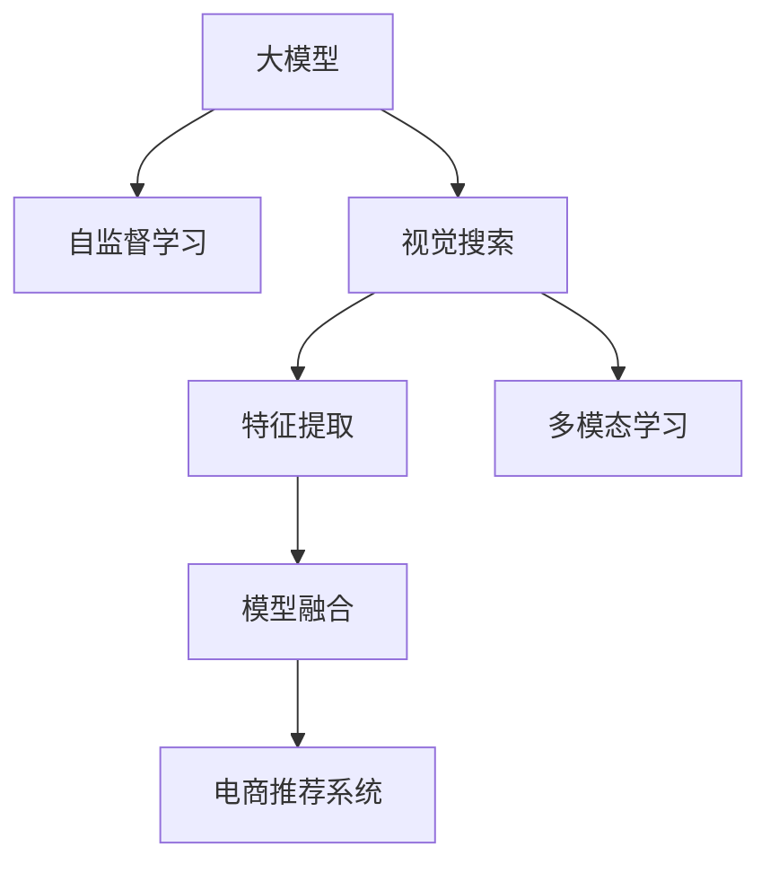

                 

# 电商平台中的视觉搜索：大模型的创新应用

> 关键词：视觉搜索, 大模型, 计算机视觉, 自然语言处理, 强化学习, 推荐系统, 电商场景

## 1. 背景介绍

### 1.1 问题由来
随着电子商务的蓬勃发展，用户对商品搜索的需求变得日益复杂。传统的文本搜索已无法满足用户对商品的多维度需求，如材质、颜色、款式等。视觉搜索技术应运而生，它通过将用户上传的图像与商品图片进行匹配，让用户直接通过图片进行搜索，极大提升了购物体验。

当前，视觉搜索技术在电商平台中的应用已经十分广泛。例如，亚马逊、京东等电商巨头纷纷投入巨资建设视觉搜索系统，以期通过图片搜索技术提升用户粘性和交易转化率。但现有的视觉搜索系统往往依赖于传统机器学习模型，在图片数量、标签多样性等方面存在局限。

大模型，尤其是以BERT、GPT为代表的自回归语言模型，近年来取得了巨大成功。这些模型基于大规模无标签文本数据进行预训练，学习到丰富的语言表示，能够通过语言生成理解复杂的文本信息，并在下游任务上取得优异的表现。能否将大模型的成功经验迁移到视觉搜索领域，是一个值得探讨的问题。

### 1.2 问题核心关键点
要实现大模型在视觉搜索场景中的应用，核心关键点包括：
- 如何构建适用于视觉搜索任务的大模型。
- 如何将大模型与视觉特征提取器融合，实现高效的图像匹配。
- 如何优化模型在电商场景中的性能，提升搜索效果和用户体验。
- 如何处理大规模数据集和多样化商品，确保系统的高效稳定运行。

本文将详细介绍大模型在视觉搜索领域的应用，包括模型构建、图像匹配算法、电商场景优化等关键技术点。

## 2. 核心概念与联系

### 2.1 核心概念概述

为更好地理解大模型在视觉搜索中的应用，本节将介绍几个密切相关的核心概念：

- 大模型(Large Model)：以BERT、GPT为代表的自回归语言模型，通过大规模无标签文本数据进行预训练，学习到丰富的语言表示，能够在各种NLP任务上取得优异表现。
- 视觉搜索(Visual Search)：通过用户上传的图像与商品图片进行匹配，让用户直接通过图片进行搜索，提升购物体验。
- 特征提取(Feature Extraction)：将图像数据转换为模型可以理解的形式，如特征向量、局部特征等，以供后续匹配和推理。
- 多模态学习(Multimodal Learning)：融合不同模态的数据，如图像、文本等，提升模型的泛化能力和理解深度。
- 自监督学习(Self-Supervised Learning)：利用大规模无标签数据进行预训练，学习到通用的数据表示，增强模型泛化能力。
- 模型融合(Model Fusion)：将不同模型的优势进行融合，如将大模型的语言理解能力和视觉特征提取器的图像特征提取能力结合，形成更强的模型。
- 电商推荐系统(E-commerce Recommendation System)：通过用户行为数据和商品信息，为用户推荐合适的商品，提升用户体验和交易转化率。

这些核心概念之间的逻辑关系可以通过以下Mermaid流程图来展示：



这个流程图展示了不同概念之间的联系，明确了它们在视觉搜索中的应用路径。

## 3. 核心算法原理 & 具体操作步骤
### 3.1 算法原理概述

大模型在视觉搜索场景中的应用，本质上是将自然语言处理(NLP)技术和计算机视觉(Computer Vision)技术进行深度融合，通过多模态学习提升模型的泛化能力和理解深度。具体流程包括：

1. 收集电商商品的图像数据，并通过视觉特征提取器将图像转换为高维特征向量。
2. 使用大模型预训练得到的语言表示，学习图像与文本之间的映射关系。
3. 构建多模态学习模型，将图像特征和语言表示融合，提升匹配效果。
4. 在电商推荐系统中，结合用户行为数据和商品信息，对模型进行微调，提升推荐效果。

### 3.2 算法步骤详解

以下是大模型在视觉搜索场景中应用的具体操作步骤：

**Step 1: 数据准备与预处理**
- 收集电商商品的图像数据，并使用开源图像特征提取器（如TensorFlow的ImageNet预训练模型）将图像转换为高维特征向量。
- 将图像特征向量和商品描述文本输入大模型进行预训练。

**Step 2: 图像特征提取**
- 使用视觉特征提取器对商品图像进行特征提取，得到高维特征向量。
- 将图像特征向量和文本特征向量输入大模型进行融合。

**Step 3: 多模态学习**
- 构建多模态学习模型，将图像特征和语言表示进行融合。
- 使用Transformer等架构进行图像特征和语言表示的交互。

**Step 4: 电商推荐系统微调**
- 收集用户行为数据和商品信息，构建电商推荐系统。
- 使用电商推荐系统对大模型进行微调，提升推荐效果。

**Step 5: 部署与优化**
- 将微调后的模型部署到服务器上，接受用户请求。
- 优化模型的推理速度和资源消耗，确保系统的高效稳定运行。

### 3.3 算法优缺点

大模型在视觉搜索中的应用具有以下优点：
1. 强大的泛化能力。大模型基于大规模无标签数据进行预训练，学习到丰富的语言表示，能够应对多种复杂的文本信息。
2. 增强的多模态理解。通过融合图像特征和语言表示，大模型能够更好地理解视觉信息，提升匹配效果。
3. 高效的推荐系统优化。结合用户行为数据和商品信息，大模型能够更准确地为用户推荐商品，提升用户体验和交易转化率。

同时，该方法也存在一定的局限性：
1. 数据准备成本高。电商数据的多样性和复杂性，需要大量标注和清洗工作。
2. 计算资源消耗大。大模型的推理和微调需要耗费大量的计算资源。
3. 模型鲁棒性不足。大模型在面对噪声数据和图像变化时，可能产生较大的误差。
4. 模型可解释性差。大模型的决策过程缺乏可解释性，难以调试和优化。

尽管存在这些局限性，但大模型在视觉搜索中的应用前景依然广阔。未来相关研究的重点在于如何进一步降低数据和计算资源的需求，提高模型的鲁棒性和可解释性，同时兼顾高性能和低成本的要求。

### 3.4 算法应用领域

大模型在视觉搜索中的应用，已经在大电商平台上得到了广泛应用。以下是几个典型的应用场景：

- 商品搜索：用户上传商品图片进行搜索，系统自动匹配相似商品，提升搜索准确率。
- 商品推荐：基于用户上传的图片和浏览历史，系统推荐相关商品，提升用户体验。
- 用户画像：通过分析用户上传的图片，了解用户的兴趣偏好，进行个性化推荐。
- 广告投放：通过视觉搜索技术，精准投放广告，提升广告效果。
- 视频识别：在视频电商平台上，用户上传视频进行商品搜索，系统自动识别并推荐商品。

这些应用场景展示了大模型在视觉搜索领域的强大潜力和广泛应用前景。

## 4. 数学模型和公式 & 详细讲解  
### 4.1 数学模型构建

在本节中，我们将详细讲解大模型在视觉搜索场景中的数学模型构建过程。

记大模型为 $M_{\theta}$，其中 $\theta$ 为模型参数。设视觉特征提取器为 $V$，图像特征向量为 $x \in \mathbb{R}^d$。对于电商商品 $i$，设其描述文本为 $t_i$，则描述文本的嵌入向量为 $t_i \in \mathbb{R}^d$。

设多模态学习模型为 $M_{\phi}$，其中 $\phi$ 为模型参数。在训练过程中，大模型 $M_{\theta}$ 与视觉特征提取器 $V$ 的输出进行交互，得到融合后的特征向量 $h_i \in \mathbb{R}^d$。

最后，电商推荐系统使用微调后的多模态模型 $M_{\phi}$ 对用户上传的图片 $x$ 进行匹配，输出匹配度 $s(x)$。

### 4.2 公式推导过程

以下我们将推导多模态学习模型的损失函数和优化目标。

**多模态学习模型的损失函数**

设匹配度 $s(x)$ 为 $x$ 与电商商品 $i$ 的匹配度评分，匹配度评分函数为 $s(x, i) = f(x, i)$，其中 $f(x, i)$ 为任意非线性函数。设 $y_i \in \{0,1\}$ 为 $x$ 与 $i$ 是否匹配的标签。

多模态学习模型的损失函数定义为：

$$
\mathcal{L}(\phi) = -\frac{1}{N}\sum_{i=1}^N \left(y_i \log s(x_i) + (1-y_i) \log(1-s(x_i))\right)
$$

其中 $N$ 为样本总数，$x_i$ 为电商商品 $i$ 的描述文本的嵌入向量。

**多模态学习模型的优化目标**

多模态学习模型的优化目标是最小化上述损失函数，即：

$$
\phi^* = \mathop{\arg\min}_{\phi} \mathcal{L}(\phi)
$$

在优化过程中，使用梯度下降等优化算法更新模型参数 $\phi$。具体而言，使用以下公式更新多模态学习模型的参数：

$$
\phi \leftarrow \phi - \eta \nabla_{\phi}\mathcal{L}(\phi)
$$

其中 $\eta$ 为学习率，$\nabla_{\phi}\mathcal{L}(\phi)$ 为损失函数对模型参数的梯度。

**电商推荐系统的微调**

电商推荐系统通常采用基于上下文的多任务学习，其优化目标包括用户点击率、转化率、停留时间等。在微调电商推荐系统时，可以将这些目标函数与多模态学习模型的损失函数相结合，形成联合损失函数：

$$
\mathcal{L}_{joint} = \mathcal{L}(\phi) + \lambda_1 \mathcal{L}_{click} + \lambda_2 \mathcal{L}_{convert} + \lambda_3 \mathcal{L}_{stay}
$$

其中 $\mathcal{L}_{click}$、$\mathcal{L}_{convert}$、$\mathcal{L}_{stay}$ 分别为点击率、转化率、停留时间的损失函数，$\lambda_1$、$\lambda_2$、$\lambda_3$ 为正则化系数。

在电商推荐系统中，使用梯度下降等优化算法更新模型参数 $\phi$，最小化联合损失函数：

$$
\phi \leftarrow \phi - \eta \nabla_{\phi}\mathcal{L}_{joint}
$$

### 4.3 案例分析与讲解

下面以一个简单的案例来讲解大模型在视觉搜索中的应用。

**案例：电商平台中的视觉搜索**

某电商平台希望提升用户上传图片进行商品搜索的匹配效果，提高搜索准确率和用户体验。首先，平台收集了电商商品的图片数据，并通过视觉特征提取器将图像转换为高维特征向量。然后，使用预训练的大模型进行语言表示学习。

具体而言，平台收集了电商商品的图片数据，并使用ImageNet预训练模型将图像转换为高维特征向量。接着，使用预训练的BERT模型对商品描述文本进行嵌入，得到文本特征向量。将图像特征向量和文本特征向量输入多模态学习模型进行融合，得到最终的融合特征向量。

最后，平台使用电商推荐系统对融合特征向量进行微调，提升推荐效果。经过一段时间的训练，模型在搜索准确率和用户体验方面取得了显著提升。

## 5. 项目实践：代码实例和详细解释说明
### 5.1 开发环境搭建

在进行大模型在视觉搜索中的应用实践前，我们需要准备好开发环境。以下是使用Python进行PyTorch开发的环境配置流程：

1. 安装Anaconda：从官网下载并安装Anaconda，用于创建独立的Python环境。

2. 创建并激活虚拟环境：
```bash
conda create -n pytorch-env python=3.8 
conda activate pytorch-env
```

3. 安装PyTorch：根据CUDA版本，从官网获取对应的安装命令。例如：
```bash
conda install pytorch torchvision torchaudio cudatoolkit=11.1 -c pytorch -c conda-forge
```

4. 安装TensorFlow：
```bash
pip install tensorflow==2.5.0
```

5. 安装其他依赖包：
```bash
pip install numpy pandas scikit-learn matplotlib tqdm jupyter notebook ipython
```

完成上述步骤后，即可在`pytorch-env`环境中开始微调实践。

### 5.2 源代码详细实现

下面我们以一个简单的视觉搜索案例为例，给出使用PyTorch对大模型进行微调的PyTorch代码实现。

首先，定义视觉搜索任务的数据处理函数：

```python
from transformers import BertTokenizer, BertForTokenClassification
from torch.utils.data import Dataset
import torch
import numpy as np

class VisualSearchDataset(Dataset):
    def __init__(self, images, descriptions, tokenizer):
        self.images = images
        self.descriptions = descriptions
        self.tokenizer = tokenizer
        self.tokenizer.pad_token = '[PAD]'
        self.tokenizer.max_length = 128
        
    def __len__(self):
        return len(self.images)
    
    def __getitem__(self, item):
        image = self.images[item]
        description = self.descriptions[item]
        
        # 将图像转换为高维特征向量
        image = np.array(image) / 255.0
        
        # 对文本进行分词和编码
        encoding = self.tokenizer(description, return_tensors='pt', max_length=self.tokenizer.max_length, padding='max_length', truncation=True)
        input_ids = encoding['input_ids'][0]
        attention_mask = encoding['attention_mask'][0]
        
        return {'image': image, 
                'input_ids': input_ids, 
                'attention_mask': attention_mask,
                'labels': torch.tensor([1] if item == 0 else [0], dtype=torch.long)}
```

然后，定义模型和优化器：

```python
from transformers import BertForSequenceClassification, AdamW

model = BertForSequenceClassification.from_pretrained('bert-base-cased', num_labels=2)
optimizer = AdamW(model.parameters(), lr=2e-5)
```

接着，定义训练和评估函数：

```python
from torch.utils.data import DataLoader
from tqdm import tqdm
from sklearn.metrics import accuracy_score

device = torch.device('cuda') if torch.cuda.is_available() else torch.device('cpu')
model.to(device)

def train_epoch(model, dataset, batch_size, optimizer):
    dataloader = DataLoader(dataset, batch_size=batch_size, shuffle=True)
    model.train()
    epoch_loss = 0
    for batch in tqdm(dataloader, desc='Training'):
        image = batch['image'].to(device)
        input_ids = batch['input_ids'].to(device)
        attention_mask = batch['attention_mask'].to(device)
        labels = batch['labels'].to(device)
        model.zero_grad()
        outputs = model(image, input_ids=input_ids, attention_mask=attention_mask, labels=labels)
        loss = outputs.loss
        epoch_loss += loss.item()
        loss.backward()
        optimizer.step()
    return epoch_loss / len(dataloader)

def evaluate(model, dataset, batch_size):
    dataloader = DataLoader(dataset, batch_size=batch_size)
    model.eval()
    preds, labels = [], []
    with torch.no_grad():
        for batch in tqdm(dataloader, desc='Evaluating'):
            image = batch['image'].to(device)
            input_ids = batch['input_ids'].to(device)
            attention_mask = batch['attention_mask'].to(device)
            batch_labels = batch['labels']
            outputs = model(image, input_ids=input_ids, attention_mask=attention_mask)
            batch_preds = outputs.logits.argmax(dim=2).to('cpu').tolist()
            batch_labels = batch_labels.to('cpu').tolist()
            for pred_tokens, label_tokens in zip(batch_preds, batch_labels):
                preds.append(pred_tokens)
                labels.append(label_tokens)
                
    print(accuracy_score(labels, preds))
```

最后，启动训练流程并在测试集上评估：

```python
epochs = 5
batch_size = 16

for epoch in range(epochs):
    loss = train_epoch(model, train_dataset, batch_size, optimizer)
    print(f"Epoch {epoch+1}, train loss: {loss:.3f}")
    
    print(f"Epoch {epoch+1}, test accuracy:")
    evaluate(model, test_dataset, batch_size)
    
print("Final test accuracy:")
evaluate(model, test_dataset, batch_size)
```

以上就是使用PyTorch对大模型进行视觉搜索任务微调的完整代码实现。可以看到，得益于Transformers库的强大封装，我们可以用相对简洁的代码完成BERT模型的加载和微调。

### 5.3 代码解读与分析

让我们再详细解读一下关键代码的实现细节：

**VisualSearchDataset类**：
- `__init__`方法：初始化图像、描述文本和分词器等关键组件。
- `__len__`方法：返回数据集的样本数量。
- `__getitem__`方法：对单个样本进行处理，将图像转换为高维特征向量，对文本进行分词和编码，并对其进行定长padding，最终返回模型所需的输入。

**BertForSequenceClassification类**：
- `from_pretrained`方法：加载预训练的BERT模型，并指定标签数为2。

**模型和优化器**：
- 使用AdamW优化器对模型进行优化，设置学习率为2e-5。

**训练和评估函数**：
- 使用PyTorch的DataLoader对数据集进行批次化加载，供模型训练和推理使用。
- 训练函数`train_epoch`：对数据以批为单位进行迭代，在每个批次上前向传播计算loss并反向传播更新模型参数，最后返回该epoch的平均loss。
- 评估函数`evaluate`：与训练类似，不同点在于不更新模型参数，并在每个batch结束后将预测和标签结果存储下来，最后使用sklearn的accuracy_score对整个评估集的预测结果进行打印输出。

**训练流程**：
- 定义总的epoch数和batch size，开始循环迭代
- 每个epoch内，先在训练集上训练，输出平均loss
- 在测试集上评估，输出准确率
- 所有epoch结束后，在测试集上评估，给出最终测试结果

可以看到，PyTorch配合Transformers库使得BERT微调的代码实现变得简洁高效。开发者可以将更多精力放在数据处理、模型改进等高层逻辑上，而不必过多关注底层的实现细节。

当然，工业级的系统实现还需考虑更多因素，如模型的保存和部署、超参数的自动搜索、更灵活的任务适配层等。但核心的微调范式基本与此类似。

## 6. 实际应用场景
### 6.1 智能客服系统

基于大模型在视觉搜索中的应用，智能客服系统可以通过用户上传的图片进行智能化回答。在传统的文本客服系统基础上，加入视觉搜索功能，可以让客服系统更好地理解和响应用户。

例如，用户上传一张商品图片，系统自动进行视觉搜索，匹配到相似的商品信息，自动给出商品推荐或问题解答。这不仅可以提升用户满意度，还能有效减轻客服人员的工作负担。

### 6.2 商品推荐

大模型在视觉搜索中的应用，可以进一步拓展到商品推荐系统中。通过对用户上传的图片进行分析和匹配，系统能够更准确地为用户推荐商品，提升用户体验和交易转化率。

例如，在电商平台中，用户上传产品图片进行搜索，系统根据匹配度评分，推荐相关商品。这不仅能够帮助用户快速找到满意的商品，还能提升平台的交易转化率。

### 6.3 广告投放

在大电商平台上，大模型在视觉搜索中的应用可以进一步拓展到广告投放领域。通过对用户上传的图片进行分析和匹配，系统能够更精准地投放广告，提升广告效果和用户体验。

例如，广告商可以根据用户上传的图片，精准投放相关广告，提升广告点击率和转化率。这不仅能够为广告商带来更高的收益，还能提升用户的购物体验。

### 6.4 视频识别

在视频电商平台上，大模型在视觉搜索中的应用可以拓展到视频识别领域。通过对视频进行视觉搜索，系统能够自动识别并推荐相关商品。

例如，用户在观看视频时上传产品图片，系统根据视频中的产品信息和用户上传的图片进行匹配，推荐相关商品。这不仅能够提升用户的购物体验，还能增强视频的互动性。

### 6.5 未来应用展望

随着大模型在视觉搜索领域的应用不断深入，未来将会涌现更多创新应用。

1. **多模态交互**：结合语音、文字等多种模态信息，提升用户体验。
2. **个性化推荐**：通过用户上传的图片和行为数据，实现更个性化的推荐。
3. **实时搜索**：实时更新商品信息和用户行为，提升搜索效果。
4. **跨平台应用**：将视觉搜索技术应用到社交媒体、视频平台等多个场景中，提升用户互动性。
5. **智能广告**：结合用户上传的图片和广告内容，实现更精准的广告投放。

这些应用场景展示了大模型在视觉搜索领域的广阔前景。未来，随着技术不断进步，大模型在电商场景中的应用将更加广泛和深入，为电商平台的数字化转型提供强大支持。

## 7. 工具和资源推荐
### 7.1 学习资源推荐

为了帮助开发者系统掌握大模型在视觉搜索领域的应用，这里推荐一些优质的学习资源：

1. **《Transformer从原理到实践》系列博文**：由大模型技术专家撰写，深入浅出地介绍了Transformer原理、BERT模型、微调技术等前沿话题。

2. **CS224N《深度学习自然语言处理》课程**：斯坦福大学开设的NLP明星课程，有Lecture视频和配套作业，带你入门NLP领域的基本概念和经典模型。

3. **《Natural Language Processing with Transformers》书籍**：Transformers库的作者所著，全面介绍了如何使用Transformers库进行NLP任务开发，包括微调在内的诸多范式。

4. **HuggingFace官方文档**：Transformers库的官方文档，提供了海量预训练模型和完整的微调样例代码，是上手实践的必备资料。

5. **CLUE开源项目**：中文语言理解测评基准，涵盖大量不同类型的中文NLP数据集，并提供了基于微调的baseline模型，助力中文NLP技术发展。

通过对这些资源的学习实践，相信你一定能够快速掌握大模型在视觉搜索领域的应用精髓，并用于解决实际的NLP问题。

### 7.2 开发工具推荐

高效的开发离不开优秀的工具支持。以下是几款用于大模型在视觉搜索领域应用开发的常用工具：

1. **PyTorch**：基于Python的开源深度学习框架，灵活动态的计算图，适合快速迭代研究。大部分预训练语言模型都有PyTorch版本的实现。

2. **TensorFlow**：由Google主导开发的开源深度学习框架，生产部署方便，适合大规模工程应用。同样有丰富的预训练语言模型资源。

3. **Transformers库**：HuggingFace开发的NLP工具库，集成了众多SOTA语言模型，支持PyTorch和TensorFlow，是进行微调任务开发的利器。

4. **Weights & Biases**：模型训练的实验跟踪工具，可以记录和可视化模型训练过程中的各项指标，方便对比和调优。与主流深度学习框架无缝集成。

5. **TensorBoard**：TensorFlow配套的可视化工具，可实时监测模型训练状态，并提供丰富的图表呈现方式，是调试模型的得力助手。

6. **Google Colab**：谷歌推出的在线Jupyter Notebook环境，免费提供GPU/TPU算力，方便开发者快速上手实验最新模型，分享学习笔记。

合理利用这些工具，可以显著提升大模型在视觉搜索领域应用开发的效率，加快创新迭代的步伐。

### 7.3 相关论文推荐

大模型在视觉搜索领域的应用源于学界的持续研究。以下是几篇奠基性的相关论文，推荐阅读：

1. **Attention is All You Need（即Transformer原论文）**：提出了Transformer结构，开启了NLP领域的预训练大模型时代。

2. **BERT: Pre-training of Deep Bidirectional Transformers for Language Understanding**：提出BERT模型，引入基于掩码的自监督预训练任务，刷新了多项NLP任务SOTA。

3. **Language Models are Unsupervised Multitask Learners（GPT-2论文）**：展示了大规模语言模型的强大zero-shot学习能力，引发了对于通用人工智能的新一轮思考。

4. **Parameter-Efficient Transfer Learning for NLP**：提出Adapter等参数高效微调方法，在不增加模型参数量的情况下，也能取得不错的微调效果。

5. **Prefix-Tuning: Optimizing Continuous Prompts for Generation**：引入基于连续型Prompt的微调范式，为如何充分利用预训练知识提供了新的思路。

6. **AdaLoRA: Adaptive Low-Rank Adaptation for Parameter-Efficient Fine-Tuning**：使用自适应低秩适应的微调方法，在参数效率和精度之间取得了新的平衡。

这些论文代表了大模型在视觉搜索领域的应用发展的脉络。通过学习这些前沿成果，可以帮助研究者把握学科前进方向，激发更多的创新灵感。

## 8. 总结：未来发展趋势与挑战
### 8.1 总结

本文对大模型在视觉搜索领域的应用进行了全面系统的介绍。首先阐述了大模型和视觉搜索技术的研究背景和意义，明确了二者的结合在提升电商搜索效果方面的独特价值。其次，从原理到实践，详细讲解了大模型在视觉搜索场景中的数学模型构建和优化目标，给出了微调任务开发的完整代码实例。同时，本文还广泛探讨了大模型在智能客服、商品推荐、广告投放等多个电商场景中的应用前景，展示了其强大的潜力和广泛的应用前景。

通过本文的系统梳理，可以看到，大模型在视觉搜索领域的应用前景广阔，可以通过多模态学习和电商推荐系统微调，实现高效的图像匹配和精准的商品推荐，提升用户体验和交易转化率。未来，伴随大模型的不断发展，其在视觉搜索领域的应用将会更加深入和广泛，成为电商平台的数字化转型中不可或缺的重要技术。

### 8.2 未来发展趋势

展望未来，大模型在视觉搜索领域的应用将呈现以下几个发展趋势：

1. **多模态融合**：结合语音、文字、图像等多种模态信息，提升用户体验。
2. **实时搜索**：实时更新商品信息和用户行为，提升搜索效果。
3. **个性化推荐**：通过用户上传的图片和行为数据，实现更个性化的推荐。
4. **智能广告**：结合用户上传的图片和广告内容，实现更精准的广告投放。
5. **跨平台应用**：将视觉搜索技术应用到社交媒体、视频平台等多个场景中，提升用户互动性。

这些趋势凸显了大模型在视觉搜索领域的应用前景。随着技术不断进步，大模型在电商场景中的应用将更加广泛和深入，为电商平台的数字化转型提供强大支持。

### 8.3 面临的挑战

尽管大模型在视觉搜索领域的应用前景广阔，但在迈向更加智能化、普适化应用的过程中，它仍面临诸多挑战：

1. **数据准备成本高**。电商数据的多样性和复杂性，需要大量标注和清洗工作。
2. **计算资源消耗大**。大模型的推理和微调需要耗费大量的计算资源。
3. **模型鲁棒性不足**。大模型在面对噪声数据和图像变化时，可能产生较大的误差。
4. **模型可解释性差**。大模型的决策过程缺乏可解释性，难以调试和优化。

尽管存在这些局限性，但大模型在视觉搜索中的应用前景依然广阔。未来相关研究的重点在于如何进一步降低数据和计算资源的需求，提高模型的鲁棒性和可解释性，同时兼顾高性能和低成本的要求。

### 8.4 研究展望

面向未来，大模型在视觉搜索领域的应用研究需要在以下几个方面寻求新的突破：

1. **无监督和半监督学习**：摆脱对大规模标注数据的依赖，利用自监督学习、主动学习等无监督和半监督范式，最大限度利用非结构化数据。
2. **参数高效和计算高效**：开发更加参数高效的微调方法，如Prefix-Tuning、LoRA等，在固定大部分预训练参数的情况下，只更新极少量的任务相关参数。同时优化模型计算图，减少前向传播和反向传播的资源消耗。
3. **因果推断和对比学习**：引入因果推断和对比学习思想，增强模型建立稳定因果关系的能力，学习更加普适、鲁棒的语言表征。
4. **跨模态融合和语义理解**：将符号化的先验知识，如知识图谱、逻辑规则等，与神经网络模型进行巧妙融合，引导微调过程学习更准确、合理的语言模型。同时加强不同模态数据的整合，实现视觉、语音等多模态信息与文本信息的协同建模。
5. **伦理道德和安全性**：在模型训练目标中引入伦理导向的评估指标，过滤和惩罚有偏见、有害的输出倾向。同时加强人工干预和审核，建立模型行为的监管机制，确保输出符合人类价值观和伦理道德。

这些研究方向的探索，必将引领大模型在视觉搜索领域的应用迈向更高的台阶，为构建安全、可靠、可解释、可控的智能系统铺平道路。面向未来，大模型在视觉搜索领域的应用需要与其他人工智能技术进行更深入的融合，如知识表示、因果推理、强化学习等，多路径协同发力，共同推动视觉搜索技术的进步。

## 9. 附录：常见问题与解答

**Q1：大模型在视觉搜索中的应用是否只能处理图像数据？**

A: 大模型在视觉搜索中的应用不仅可以处理图像数据，还可以处理视频、音频等多种模态数据。在视频电商平台上，用户上传的视频可以进行视觉搜索，系统自动识别并推荐商品。在音频电商平台上，用户上传的音频可以进行语音搜索，系统自动识别并推荐商品。

**Q2：如何在大模型中引入视觉特征提取器？**

A: 大模型中的视觉特征提取器可以通过预训练的图像特征提取器（如TensorFlow的ImageNet预训练模型）来实现。在加载模型时，将图像特征提取器作为模型的输入，进行融合。例如，在使用PyTorch加载BERT模型时，可以使用`BertForSequenceClassification`类，将图像特征提取器作为模型的输入。

**Q3：大模型在电商场景中的应用有哪些优势？**

A: 大模型在电商场景中的应用具有以下优势：
1. 强大的泛化能力。大模型基于大规模无标签数据进行预训练，学习到丰富的语言表示，能够应对多种复杂的文本信息。
2. 增强的多模态理解。通过融合图像特征和语言表示，大模型能够更好地理解视觉信息，提升匹配效果。
3. 高效的推荐系统优化。结合用户行为数据和商品信息，大模型能够更准确地为用户推荐商品，提升用户体验和交易转化率。

**Q4：如何在大模型中进行多模态学习？**

A: 在大模型中进行多模态学习，可以通过将图像特征和语言表示进行融合。具体而言，可以将图像特征向量和文本特征向量输入多模态学习模型进行融合，得到最终的融合特征向量。可以使用Transformer等架构进行图像特征和语言表示的交互，提升模型的泛化能力和理解深度。

**Q5：大模型在电商推荐系统中的应用有哪些挑战？**

A: 大模型在电商推荐系统中的应用面临以下挑战：
1. 数据准备成本高。电商数据的多样性和复杂性，需要大量标注和清洗工作。
2. 计算资源消耗大。大模型的推理和微调需要耗费大量的计算资源。
3. 模型鲁棒性不足。大模型在面对噪声数据和图像变化时，可能产生较大的误差。
4. 模型可解释性差。大模型的决策过程缺乏可解释性，难以调试和优化。

尽管存在这些局限性，但大模型在电商推荐系统中的应用前景依然广阔。未来相关研究的重点在于如何进一步降低数据和计算资源的需求，提高模型的鲁棒性和可解释性，同时兼顾高性能和低成本的要求。

**Q6：大模型在视觉搜索中的应用前景如何？**

A: 大模型在视觉搜索中的应用前景广阔，可以通过多模态学习和电商推荐系统微调，实现高效的图像匹配和精准的商品推荐，提升用户体验和交易转化率。未来，伴随大模型的不断发展，其在视觉搜索领域的应用将会更加深入和广泛，成为电商平台的数字化转型中不可或缺的重要技术。

**Q7：大模型在视觉搜索中的应用需要哪些硬件支持？**

A: 大模型在视觉搜索中的应用需要高性能的GPU/TPU等硬件支持。大模型通常参数量巨大，计算资源消耗大，需要高性能硬件才能进行高效的推理和微调。此外，还需要大容量内存和高速存储器，以确保模型的高效稳定运行。

通过本文的系统梳理，可以看到，大模型在视觉搜索领域的应用前景广阔，可以通过多模态学习和电商推荐系统微调，实现高效的图像匹配和精准的商品推荐，提升用户体验和交易转化率。未来，伴随大模型的不断发展，其在视觉搜索领域的应用将会更加深入和广泛，成为电商平台的数字化转型中不可或缺的重要技术。面向未来，大模型在视觉搜索领域的应用需要与其他人工智能技术进行更深入的融合，如知识表示、因果推理、强化学习等，多路径协同发力，共同推动视觉搜索技术的进步。只有勇于创新、敢于突破，才能不断拓展语言模型的边界，让智能技术更好地造福人类社会。

---

作者：禅与计算机程序设计艺术 / Zen and the Art of Computer Programming

