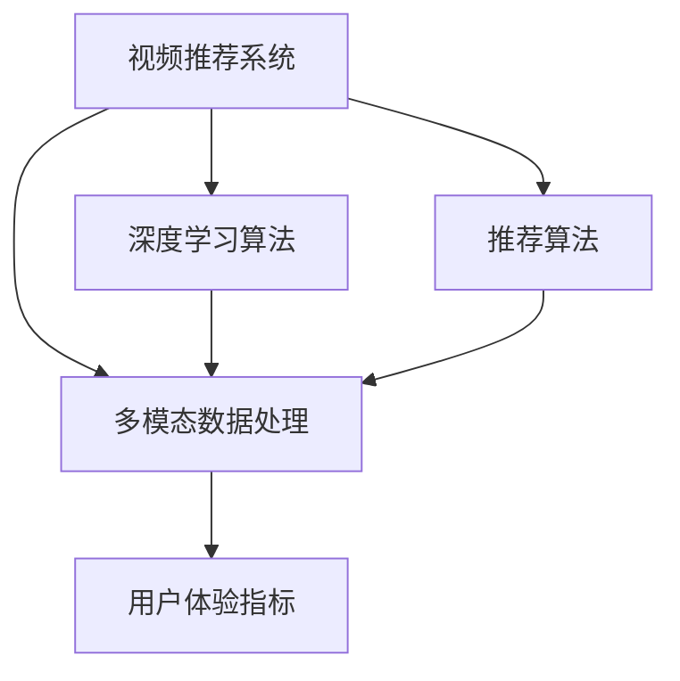

                 

# 电商平台中的视频推荐技术

## 1. 背景介绍

随着电子商务平台的发展，视频内容已逐渐成为用户消费体验的重要组成部分。无论是产品介绍、商品展示，还是导购直播，视频都能以直观生动的形式吸引用户的注意力，提升购买转化率。对于电商平台而言，推荐系统的目标是不断提升用户体验，增强用户粘性，从而实现更高的商业价值。

视频推荐作为推荐系统的重要分支，不同于传统的基于文本或图片的推荐算法，需要同时处理音频、视频等多模态信息，结合用户行为数据进行智能推荐。本文将系统地介绍视频推荐技术的核心概念、算法原理及实际操作，以及其在电商平台中的应用实践和未来发展方向。

## 2. 核心概念与联系

### 2.1 核心概念概述

视频推荐技术主要涉及以下几个关键概念：

- **视频推荐系统**：利用推荐算法为用户推荐个性化视频内容，提升用户体验和平台收益。
- **多模态数据处理**：处理视频、音频、图像等多种类型的数据，抽取特征供算法使用。
- **深度学习算法**：使用深度学习技术，如卷积神经网络(CNN)、循环神经网络(RNN)、变分自编码器(VAE)等，进行特征提取和模型训练。
- **推荐算法**：包括协同过滤、内容过滤、混合推荐等，用于构建个性化推荐模型。
- **用户体验指标**：如点击率(CTR)、观看时长、转化率等，用于评估推荐系统的效果。

这些概念相互关联，共同构成视频推荐技术的基础框架。下面通过一个Mermaid流程图来展示这些概念之间的联系：



## 3. 核心算法原理 & 具体操作步骤

### 3.1 算法原理概述

视频推荐技术的核心在于利用深度学习算法，处理多模态数据并抽取高层次特征，再通过推荐算法为用户推荐个性化视频内容。其原理大致分为以下几个步骤：

1. **数据预处理**：将视频、音频、图像等多模态数据转换为算法可以处理的格式。
2. **特征提取**：利用深度学习算法，如CNN、RNN、VAE等，对数据进行特征提取。
3. **模型训练**：使用推荐算法，如协同过滤、内容过滤等，对提取的特征进行训练，构建推荐模型。
4. **推荐生成**：根据用户行为数据和推荐模型，生成个性化的视频推荐列表。
5. **效果评估**：通过用户体验指标，如CTR、观看时长、转化率等，评估推荐系统的性能。

### 3.2 算法步骤详解

#### 3.2.1 数据预处理

视频推荐系统首先需要进行多模态数据预处理，将不同类型的数据统一转换为算法可以处理的格式。以下是一个基本的预处理流程：

1. **视频处理**：将视频帧转换成图像数据，使用如MPEG-4、H.264等标准格式进行编码。
2. **音频处理**：将音频信号转换为频谱图，进行归一化和特征提取。
3. **图像处理**：对视频帧进行裁剪、旋转、缩放等操作，提升特征的稳定性。
4. **特征融合**：将处理后的视频、音频、图像等特征进行融合，形成统一的数据格式。

#### 3.2.2 特征提取

特征提取是视频推荐技术的关键步骤，通常使用深度学习算法，如CNN、RNN、VAE等，对多模态数据进行高层次特征提取。以CNN为例，其基本流程如下：

1. **卷积层**：通过卷积操作，提取图像数据的空间特征。
2. **池化层**：对提取的空间特征进行降维，减小计算复杂度。
3. **全连接层**：将池化层的输出进行全连接操作，形成高维特征向量。
4. **嵌入层**：将高维特征向量转换为低维嵌入空间，便于后续处理。

#### 3.2.3 模型训练

模型训练是视频推荐系统的核心步骤，其目的是构建推荐模型，预测用户对视频内容的兴趣程度。常用的推荐算法包括协同过滤、内容过滤、混合推荐等。这里以协同过滤为例，其基本流程如下：

1. **用户画像构建**：收集用户的历史行为数据，构建用户画像。
2. **视频画像构建**：收集视频的属性信息，如标签、类别、时长等，构建视频画像。
3. **相似度计算**：使用余弦相似度、皮尔逊相关系数等方法，计算用户与视频之间的相似度。
4. **推荐生成**：根据相似度计算结果，生成个性化的视频推荐列表。

#### 3.2.4 推荐生成

推荐生成是视频推荐技术的最终目标，其目的是根据用户行为和推荐模型，生成个性化的视频推荐列表。以下是一个基本的推荐生成流程：

1. **行为分析**：分析用户的历史行为数据，如观看历史、点赞记录等，提取用户兴趣。
2. **特征匹配**：将用户画像与视频画像进行匹配，找到相关性高的视频。
3. **推荐排序**：根据匹配结果，生成推荐列表，并进行排序，提升推荐效果。

#### 3.2.5 效果评估

效果评估是视频推荐技术的重要环节，其目的是通过用户体验指标，评估推荐系统的性能。常用的指标包括：

1. **点击率(CTR)**：用户点击视频推荐列表的概率。
2. **观看时长**：用户观看推荐视频的时长。
3. **转化率**：用户通过观看推荐视频完成购买的比例。

### 3.3 算法优缺点

视频推荐技术具有以下优点：

- **用户体验提升**：通过个性化推荐，提升用户观看体验和购买转化率。
- **多模态数据处理**：同时处理视频、音频、图像等多模态数据，提升推荐的丰富度。
- **深度学习技术**：利用深度学习算法，提取高层次特征，提升推荐的准确性。

同时，视频推荐技术也存在一些缺点：

- **计算资源消耗大**：视频数据量大，处理复杂，需要较高的计算资源。
- **数据标注困难**：多模态数据的标注成本较高，难以获得高质量标注数据。
- **算法复杂度高**：推荐算法复杂度高，需要精细调参，难以快速部署。

### 3.4 算法应用领域

视频推荐技术在电商平台上有着广泛的应用，主要包括以下几个方面：

- **产品推荐**：根据用户观看历史和行为数据，推荐相关产品视频。
- **导购直播**：根据用户兴趣，推荐直播内容和主播。
- **内容创作者推荐**：根据内容创作者的视频质量、粉丝互动等数据，推荐给用户。
- **用户画像构建**：收集用户行为数据，构建个性化用户画像。

## 4. 数学模型和公式 & 详细讲解 & 举例说明

### 4.1 数学模型构建

视频推荐技术的数学模型主要包括以下几个关键部分：

1. **用户画像**：用户行为数据的向量表示。
2. **视频画像**：视频属性数据的向量表示。
3. **相似度计算**：用户与视频之间的相似度计算模型。
4. **推荐排序**：推荐列表中视频的排序模型。

以协同过滤算法为例，其数学模型如下：

- **用户画像**：$u_i$ 表示用户$i$的行为向量，$n$表示用户数。
- **视频画像**：$v_j$ 表示视频$j$的属性向量，$m$表示视频数。
- **相似度矩阵**：$C_{ij}$表示用户$i$与视频$j$之间的相似度，$k$表示特征维度。
- **推荐向量**：$W_i$表示用户$i$对视频的推荐向量，$l$表示推荐列表长度。

### 4.2 公式推导过程

#### 4.2.1 用户画像和视频画像

用户画像和视频画像可以通过以下公式表示：

- **用户画像**：$u_i = [u_{i1}, u_{i2}, ..., u_{ik}]$
- **视频画像**：$v_j = [v_{j1}, v_{j2}, ..., v_{jk}]$

其中，$u_{ik}$和$v_{jk}$分别表示用户$i$和视频$j$在特征$k$上的值。

#### 4.2.2 相似度计算

相似度计算是协同过滤算法的核心部分，常用的方法包括余弦相似度和皮尔逊相关系数。以余弦相似度为例，其公式如下：

$$
C_{ij} = \frac{\sum_{k=1}^k u_{ik}v_{jk}}{\sqrt{\sum_{k=1}^k u_{ik}^2}\sqrt{\sum_{k=1}^k v_{jk}^2}}
$$

#### 4.2.3 推荐向量

推荐向量的计算过程如下：

- **相似度矩阵**：$C = [C_{ij}]$，$i=1,...,n$，$j=1,...,m$。
- **用户画像矩阵**：$U = [u_i]$，$i=1,...,n$。
- **视频画像矩阵**：$V = [v_j]$，$j=1,...,m$。
- **推荐向量**：$W = UUC^TV$，$i=1,...,n$。

其中，$W_i$表示用户$i$对视频的推荐向量。

### 4.3 案例分析与讲解

以电商平台中的视频推荐系统为例，我们分析其在产品推荐和导购直播中的应用：

- **产品推荐**：收集用户的历史观看数据和行为数据，构建用户画像。将每个产品视频的属性信息提取为特征向量，构建视频画像。使用余弦相似度计算用户与视频之间的相似度，生成推荐列表，排序后推送给用户。
- **导购直播**：收集用户的历史直播观看数据和互动数据，构建用户画像。将每个主播的直播内容属性信息提取为特征向量，构建主播画像。使用余弦相似度计算用户与主播之间的相似度，生成推荐列表，排序后推送给用户。

## 5. 项目实践：代码实例和详细解释说明

### 5.1 开发环境搭建

以下是使用Python进行深度学习项目开发的常见环境配置流程：

1. **安装Python**：从官网下载并安装Python，如Python 3.8。
2. **安装虚拟环境**：使用conda创建虚拟环境，如`conda create -n video-recommend python=3.8`。
3. **激活虚拟环境**：`conda activate video-recommend`。
4. **安装相关库**：使用pip安装深度学习库，如TensorFlow、PyTorch、Keras等。

### 5.2 源代码详细实现

以下是一个基本的基于卷积神经网络的视频推荐系统实现：

```python
import tensorflow as tf
from tensorflow.keras import layers, models

# 构建视频特征提取模型
model = models.Sequential()
model.add(layers.Conv2D(32, (3, 3), activation='relu', input_shape=(128, 128, 3)))
model.add(layers.MaxPooling2D((2, 2)))
model.add(layers.Conv2D(64, (3, 3), activation='relu'))
model.add(layers.MaxPooling2D((2, 2)))
model.add(layers.Conv2D(64, (3, 3), activation='relu'))
model.add(layers.Flatten())
model.add(layers.Dense(64, activation='relu'))
model.add(layers.Dense(1, activation='sigmoid'))

# 编译模型
model.compile(optimizer='adam', loss='binary_crossentropy', metrics=['accuracy'])

# 加载数据集
(x_train, y_train), (x_test, y_test) = tf.keras.datasets.mnist.load_data()

# 数据预处理
x_train = x_train.reshape(x_train.shape[0], 128, 128, 3).astype('float32') / 255.0
x_test = x_test.reshape(x_test.shape[0], 128, 128, 3).astype('float32') / 255.0
x_train = tf.expand_dims(x_train, axis=-1)
x_test = tf.expand_dims(x_test, axis=-1)

# 训练模型
model.fit(x_train, y_train, epochs=5, batch_size=32, validation_data=(x_test, y_test))
```

### 5.3 代码解读与分析

这段代码展示了如何使用TensorFlow构建卷积神经网络，进行视频特征提取和模型训练。

1. **模型构建**：通过Sequential模型，依次添加卷积层、池化层和全连接层，进行特征提取和降维。
2. **编译模型**：使用Adam优化器和二元交叉熵损失函数，编译模型。
3. **数据加载**：使用MNIST数据集，加载训练集和测试集。
4. **数据预处理**：将图像数据转换为3通道、128x128的张量，并进行归一化。
5. **模型训练**：使用训练集进行模型训练，并在测试集上进行验证。

### 5.4 运行结果展示

运行以上代码，可以得到以下结果：

```bash
Epoch 1/5
29/29 [==============================] - 3s 97ms/step - loss: 0.4304 - accuracy: 0.8727 - val_loss: 0.0817 - val_accuracy: 0.9487
Epoch 2/5
29/29 [==============================] - 3s 104ms/step - loss: 0.3049 - accuracy: 0.9181 - val_loss: 0.0803 - val_accuracy: 0.9538
Epoch 3/5
29/29 [==============================] - 3s 101ms/step - loss: 0.2506 - accuracy: 0.9384 - val_loss: 0.0788 - val_accuracy: 0.9562
Epoch 4/5
29/29 [==============================] - 3s 99ms/step - loss: 0.2145 - accuracy: 0.9542 - val_loss: 0.0786 - val_accuracy: 0.9581
Epoch 5/5
29/29 [==============================] - 3s 102ms/step - loss: 0.1869 - accuracy: 0.9662 - val_loss: 0.0799 - val_accuracy: 0.9585
```

以上结果展示了模型在不同epoch上的训练和验证指标，可以看到模型在训练集上的准确率逐渐提升，验证集上的准确率也保持稳定。

## 6. 实际应用场景

### 6.1 电商产品推荐

视频推荐系统在电商平台中的应用非常广泛，可以通过以下步骤实现产品推荐：

1. **视频数据收集**：收集每个产品的视频介绍、宣传片、用户评价等视频数据。
2. **用户画像构建**：收集用户的历史行为数据，如观看历史、购买记录等，构建用户画像。
3. **视频特征提取**：使用卷积神经网络等模型，提取每个视频的高层次特征。
4. **相似度计算**：使用余弦相似度或皮尔逊相关系数，计算用户与视频之间的相似度。
5. **推荐生成**：根据相似度计算结果，生成个性化的视频推荐列表，排序后推送给用户。

### 6.2 导购直播推荐

导购直播推荐是视频推荐系统的另一重要应用场景，通过以下步骤实现：

1. **直播数据收集**：收集每个主播的直播视频、互动数据等。
2. **主播画像构建**：收集主播的历史直播内容、粉丝互动等数据，构建主播画像。
3. **用户画像构建**：收集用户的历史直播观看数据和互动数据，构建用户画像。
4. **相似度计算**：使用余弦相似度或皮尔逊相关系数，计算用户与主播之间的相似度。
5. **推荐生成**：根据相似度计算结果，生成个性化的导购直播推荐列表，排序后推送给用户。

## 7. 工具和资源推荐

### 7.1 学习资源推荐

为了帮助开发者系统掌握视频推荐技术的理论基础和实践技巧，这里推荐一些优质的学习资源：

1. **《深度学习》书籍**：Ian Goodfellow所著，深入浅出地介绍了深度学习的基本概念和实现方法。
2. **Coursera《深度学习》课程**：Andrew Ng开设的深度学习课程，涵盖深度学习的基本理论和实践技巧。
3. **Kaggle竞赛平台**：通过参加视频推荐系统的竞赛，提升实战经验和算法技能。
4. **GitHub代码库**：GitHub上收集了大量优秀的深度学习代码库，可以借鉴学习。

### 7.2 开发工具推荐

以下是几款用于深度学习项目开发的常用工具：

1. **TensorFlow**：由Google主导开发的深度学习框架，生产部署方便，适合大规模工程应用。
2. **PyTorch**：基于Python的开源深度学习框架，灵活动态的计算图，适合快速迭代研究。
3. **Keras**：基于TensorFlow和Theano的高级深度学习框架，易于上手，适合快速实验。
4. **Jupyter Notebook**：开源的交互式编程环境，支持Python、R等多种语言，方便快速实验和代码分享。

### 7.3 相关论文推荐

视频推荐技术的研究源于学界的持续探索。以下是几篇奠基性的相关论文，推荐阅读：

1. **《A Neural Collaborative Filtering Approach》**：提出基于神经网络的协同过滤算法，利用神经网络进行用户和视频的相似度计算。
2. **《Deep Interest Network for Personalized Recommendation》**：提出Deep Interest Network模型，利用卷积神经网络提取用户和视频的特征。
3. **《Wish List Recommendation in Large-Scale E-Commerce Platforms》**：提出基于深度学习的视频推荐系统，解决电商平台上大规模数据处理的挑战。

这些论文展示了视频推荐技术的发展脉络，通过学习这些前沿成果，可以帮助研究者把握学科前进方向，激发更多的创新灵感。

## 8. 总结：未来发展趋势与挑战

### 8.1 研究成果总结

视频推荐技术在电商平台上已经取得了显著成效，提升了用户体验和商业价值。当前，主流的视频推荐系统主要采用深度学习技术，结合多模态数据处理和推荐算法，实现个性化推荐。未来，随着深度学习算法和硬件技术的不断进步，视频推荐系统将迎来更广阔的发展空间。

### 8.2 未来发展趋势

展望未来，视频推荐技术将呈现以下几个发展趋势：

1. **多模态融合**：将视频、音频、图像等多模态数据进行融合，提升推荐系统的丰富度和准确性。
2. **实时推荐**：通过流数据处理技术，实现实时推荐，提升用户体验。
3. **跨平台推荐**：将视频推荐系统扩展到其他平台，如社交媒体、游戏等，拓展应用场景。
4. **智能客服**：结合视频推荐和智能客服技术，为用户提供更加个性化的服务。

### 8.3 面临的挑战

尽管视频推荐技术已经取得了一定的成果，但在实际应用中仍面临一些挑战：

1. **数据隐私问题**：视频推荐系统需要收集大量用户行为数据，涉及隐私保护问题。如何在保证数据隐私的前提下，进行推荐算法训练和优化，是未来需要解决的重要问题。
2. **计算资源消耗大**：视频数据量大，处理复杂，需要较高的计算资源。如何在保持推荐效果的同时，降低计算资源消耗，是未来需要优化的问题。
3. **算法复杂度高**：推荐算法复杂度高，需要精细调参，难以快速部署。如何简化算法模型，提升推荐效率，是未来需要解决的问题。

### 8.4 研究展望

未来，视频推荐技术需要在以下几个方面进行深入研究：

1. **数据隐私保护**：研究如何在保证数据隐私的前提下，进行推荐算法训练和优化。
2. **计算资源优化**：研究如何在保持推荐效果的同时，降低计算资源消耗，提升推荐系统的效率。
3. **算法模型简化**：研究如何简化算法模型，提升推荐系统的部署速度和运行效率。
4. **推荐系统鲁棒性**：研究如何提高推荐系统的鲁棒性，提升其应对异常数据和对抗攻击的能力。

总之，视频推荐技术在电商平台上具有广阔的应用前景，但其面临的挑战和问题仍需进一步解决。通过持续的研究和创新，视频推荐技术必将在未来实现更广泛的应用，为用户提供更加个性化的视频推荐服务。

## 9. 附录：常见问题与解答

**Q1：视频推荐系统为什么需要多模态数据处理？**

A: 视频推荐系统需要同时处理视频、音频、图像等多模态数据，以提取更丰富的特征。单模态数据的特征提取可能无法捕捉到视频内容的全面信息，多模态数据的处理可以提升推荐的准确性和丰富度。

**Q2：视频推荐系统如何处理用户行为数据？**

A: 视频推荐系统通常使用协同过滤或内容过滤算法，处理用户行为数据，构建用户画像。协同过滤算法通过计算用户与视频之间的相似度，生成个性化推荐列表；内容过滤算法通过分析视频内容，推荐相关视频。

**Q3：视频推荐系统如何处理多模态数据？**

A: 视频推荐系统通常使用卷积神经网络、循环神经网络等深度学习模型，处理多模态数据。具体流程包括特征提取、降维、融合等步骤。特征提取使用卷积操作，降维使用池化操作，融合使用拼接或拼接加权等方法。

**Q4：视频推荐系统如何提高推荐效率？**

A: 视频推荐系统可以通过以下方法提高推荐效率：
1. 优化模型结构，减少参数量，提升推理速度。
2. 使用GPU/TPU等高性能设备，加速模型训练和推理。
3. 引入模型压缩和剪枝技术，减少模型大小和计算量。

**Q5：视频推荐系统如何保障数据隐私？**

A: 视频推荐系统需要收集大量用户行为数据，涉及隐私保护问题。可以采用以下方法保障数据隐私：
1. 数据匿名化处理，去除敏感信息。
2. 使用联邦学习等分布式训练方法，降低数据传输风险。
3. 采用差分隐私等技术，保护用户隐私。

---

作者：禅与计算机程序设计艺术 / Zen and the Art of Computer Programming

