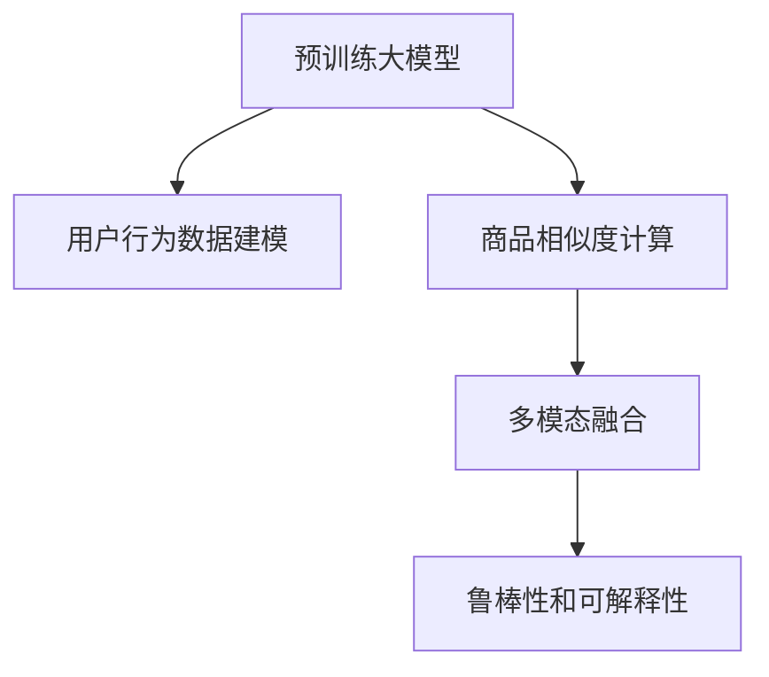

                 

# 电商平台搜索推荐系统的AI 大模型优化：提高系统性能、效率与用户忠诚度

## 1. 背景介绍

### 1.1 问题由来

随着电子商务市场的蓬勃发展，电商平台搜索推荐系统的用户需求日益复杂和多样。传统的基于规则和浅层机器学习的推荐系统难以满足大规模个性化需求。与此同时，深度学习技术和预训练大模型的兴起，为推荐系统带来了新的突破。

在推荐系统中引入深度学习，能够更准确地挖掘用户行为特征，捕捉长尾商品的潜在价值。而预训练大模型如BERT、GPT-3等，通过大规模无标签文本数据的预训练，学习到丰富的语言知识和领域知识，具备强大的语义理解能力和生成能力。

然而，预训练大模型在电商平台推荐系统的实际应用中，仍面临着数据偏差、计算资源消耗大、模型部署复杂等问题。如何将预训练大模型与推荐系统深度结合，进一步优化搜索推荐性能，提升用户体验，成为当下研究的热点和难点。

### 1.2 问题核心关键点

本节将详细阐述预训练大模型在电商平台搜索推荐系统中的应用，探讨如何通过模型优化提高系统性能、效率和用户忠诚度。

预训练大模型在电商平台推荐系统中的应用，通常涉及以下几个关键点：

1. **用户行为数据建模**：通过预训练大模型对用户浏览记录、购买行为等文本数据进行语义理解，提取用户兴趣和偏好。
2. **商品相似度计算**：使用大模型生成商品描述和属性，通过语义相似度计算推荐商品。
3. **多模态融合**：结合用户行为数据和商品属性数据，进行多模态融合，提高推荐系统的多样性和相关性。
4. **鲁棒性和可解释性**：通过优化模型架构和训练流程，提高模型的鲁棒性和可解释性，增强用户的信任感。

## 2. 核心概念与联系

### 2.1 核心概念概述

为更好地理解预训练大模型在电商平台搜索推荐系统中的应用，本节将介绍几个关键概念：

- **预训练大模型(Pre-trained Large Model, PLM)**：如BERT、GPT-3等，通过大规模无标签文本数据进行预训练，学习到丰富的语言知识和领域知识。
- **推荐系统(Recommendation System)**：通过分析用户行为数据和商品属性信息，为每位用户推荐最相关的商品。
- **多模态学习(Multimodal Learning)**：结合文本、图像、视频等多种数据模态，提升推荐系统的多样性和准确性。
- **可解释性(Explainability)**：通过解释模型预测过程和决策依据，增强用户对推荐系统的信任和理解。
- **鲁棒性(Robustness)**：推荐系统应具备对异常数据和噪声的鲁棒性，保证推荐结果的稳定性和可靠性。

这些概念之间的逻辑关系可以通过以下Mermaid流程图来展示：



这个流程图展示了大模型在推荐系统中的应用流程：

1. 通过预训练大模型对用户行为数据进行建模，提取用户兴趣。
2. 利用大模型生成商品描述和属性，计算商品相似度。
3. 将多模态数据进行融合，提高推荐系统的多样性和相关性。
4. 优化模型架构和训练流程，提高鲁棒性和可解释性。

## 3. 核心算法原理 & 具体操作步骤
### 3.1 算法原理概述

预训练大模型在电商平台搜索推荐系统中的应用，主要通过以下几个步骤实现：

1. **用户行为数据预处理**：将用户浏览记录、购买行为等文本数据，转化为模型可处理的格式。
2. **预训练大模型嵌入**：使用预训练大模型对用户行为数据进行语义嵌入，提取用户兴趣和偏好。
3. **商品相似度计算**：利用大模型生成商品描述和属性，计算商品之间的语义相似度。
4. **多模态融合**：结合用户行为数据和商品属性数据，进行多模态融合，提高推荐系统的多样性和相关性。
5. **模型优化**：通过优化模型架构和训练流程，提高模型的鲁棒性和可解释性。

### 3.2 算法步骤详解

本节将详细介绍预训练大模型在推荐系统中的具体应用步骤。

**Step 1: 用户行为数据预处理**

用户行为数据通常包含用户浏览历史、购买记录、评价信息等文本数据。预处理步骤包括：

1. **数据清洗**：去除无用信息、异常数据，确保数据质量。
2. **分词和去除停用词**：使用分词工具对文本进行分词，去除停用词和噪音词。
3. **词向量化**：将分词后的文本转换为词向量，方便模型处理。

**Step 2: 预训练大模型嵌入**

使用预训练大模型对用户行为数据进行语义嵌入，提取用户兴趣和偏好。具体步骤如下：

1. **模型选择**：选择适合任务的预训练大模型，如BERT、GPT等。
2. **模型微调**：对模型进行微调，使其适应电商平台推荐系统的特定需求。
3. **特征提取**：利用微调后的模型，对用户行为数据进行语义嵌入，提取用户兴趣和偏好。

**Step 3: 商品相似度计算**

利用大模型生成商品描述和属性，计算商品之间的语义相似度。具体步骤如下：

1. **商品描述抽取**：从商品标签、描述等信息中抽取关键词，生成商品描述。
2. **商品属性抽取**：从商品属性中抽取关键属性，生成商品属性向量。
3. **语义相似度计算**：利用预训练大模型计算商品描述和属性向量之间的语义相似度。

**Step 4: 多模态融合**

结合用户行为数据和商品属性数据，进行多模态融合，提高推荐系统的多样性和相关性。具体步骤如下：

1. **数据融合**：将用户行为数据和商品属性数据进行融合，生成多模态数据。
2. **特征融合**：使用融合特征进行推荐，提高推荐系统的多样性和相关性。
3. **模型融合**：将多模态模型与推荐模型进行融合，生成最终推荐结果。

**Step 5: 模型优化**

通过优化模型架构和训练流程，提高模型的鲁棒性和可解释性。具体步骤如下：

1. **模型裁剪**：去除不必要的层和参数，减小模型尺寸，加快推理速度。
2. **量化加速**：将浮点模型转为定点模型，压缩存储空间，提高计算效率。
3. **鲁棒性优化**：引入对抗训练等技术，提高模型的鲁棒性。
4. **可解释性增强**：通过可视化技术，解释模型预测过程和决策依据。

### 3.3 算法优缺点

使用预训练大模型在电商平台推荐系统中的应用，具有以下优点：

1. **高精度**：预训练大模型通过大规模数据预训练，具备强大的语义理解和生成能力，推荐精度高。
2. **泛化能力强**：预训练大模型在多领域数据上表现优异，具有良好的泛化能力。
3. **可扩展性**：预训练大模型可以方便地结合多种数据模态，实现多模态推荐。

然而，该方法也存在一定的局限性：

1. **计算资源消耗大**：预训练大模型参数量大，计算资源消耗大，部署复杂。
2. **可解释性不足**：预训练大模型往往作为"黑盒"模型，缺乏可解释性，用户难以理解推荐依据。
3. **鲁棒性不足**：预训练大模型对异常数据和噪声敏感，鲁棒性有待提高。

尽管存在这些局限性，但预训练大模型在电商平台推荐系统中的应用前景广阔，能够显著提高推荐系统的性能和用户满意度。

### 3.4 算法应用领域

预训练大模型在电商平台推荐系统中的应用，已经广泛应用于多个领域：

1. **商品推荐**：根据用户行为数据，生成个性化商品推荐。
2. **搜索排序**：对用户搜索查询进行排序，提升搜索体验。
3. **广告投放**：结合用户行为数据和广告属性，生成个性化广告推荐。
4. **内容推荐**：结合用户兴趣和内容属性，生成个性化内容推荐。

除了这些常见应用外，预训练大模型还被创新性地应用于情感分析、智能客服、供应链优化等场景中，为电商平台带来全新的业务创新和用户价值。

## 4. 数学模型和公式 & 详细讲解  
### 4.1 数学模型构建

本节将使用数学语言对预训练大模型在电商平台推荐系统中的应用进行更加严格的刻画。

记用户行为数据为 $X=\{x_1, x_2, ..., x_n\}$，商品描述为 $Y=\{y_1, y_2, ..., y_m\}$，商品属性为 $Z=\{z_1, z_2, ..., z_p\}$。使用预训练大模型对用户行为数据 $X$ 进行语义嵌入，生成用户兴趣表示 $U$；利用大模型生成商品描述 $Y$ 和属性 $Z$，生成商品向量 $V$。

推荐系统的目标是最小化用户对推荐结果的平均评分损失 $L$，即：

$$
L = \frac{1}{N} \sum_{i=1}^N \sum_{j=1}^M L_i(y_j, \hat{y}_j)
$$

其中 $L_i(y_j, \hat{y}_j)$ 为用户 $i$ 对商品 $j$ 的评分损失。

### 4.2 公式推导过程

以下我们以基于BERT的电商平台推荐系统为例，推导推荐模型损失函数及其梯度计算公式。

假设用户行为数据 $X$ 和商品描述 $Y$ 分别通过BERT模型嵌入，生成用户兴趣表示 $U$ 和商品向量 $V$。推荐模型使用余弦相似度计算商品相似度，生成推荐结果 $\hat{Y}$。

推荐系统的损失函数为：

$$
L = \frac{1}{N} \sum_{i=1}^N \sum_{j=1}^M L_i(y_j, \hat{y}_j)
$$

其中 $L_i(y_j, \hat{y}_j)$ 为用户 $i$ 对商品 $j$ 的评分损失。

推荐模型的评分损失函数为交叉熵损失函数：

$$
L_i(y_j, \hat{y}_j) = -\log \sigma(y_j \cdot \hat{y}_j)
$$

其中 $\sigma$ 为sigmoid函数。

利用链式法则，推荐模型损失函数对用户兴趣表示 $U$ 和商品向量 $V$ 的梯度计算公式为：

$$
\frac{\partial L}{\partial U} = -\frac{\partial L}{\partial \hat{Y}} \frac{\partial \hat{Y}}{\partial V} \frac{\partial V}{\partial Y} \frac{\partial Y}{\partial X}
$$

其中 $\frac{\partial \hat{Y}}{\partial V}$ 和 $\frac{\partial V}{\partial Y}$ 分别为余弦相似度和反向传播计算的梯度。

在得到损失函数的梯度后，即可带入模型参数更新公式，完成模型的迭代优化。

### 4.3 案例分析与讲解

**案例分析：基于BERT的商品推荐系统**

假设某电商平台拥有大量的用户行为数据和商品描述信息，使用BERT模型对用户行为数据进行语义嵌入，生成用户兴趣表示 $U$。利用BERT模型生成商品描述 $Y$，通过余弦相似度计算生成商品向量 $V$。

推荐模型使用二分类交叉熵损失函数：

$$
L_i(y_j, \hat{y}_j) = -\log \sigma(y_j \cdot \hat{y}_j)
$$

其中 $\sigma$ 为sigmoid函数。

推荐模型的梯度更新公式为：

$$
U \leftarrow U - \eta \frac{\partial L}{\partial U}
$$

其中 $\eta$ 为学习率。

在训练过程中，使用AdamW优化算法进行参数更新，并在每个epoch结束时，使用验证集评估模型性能。

## 5. 项目实践：代码实例和详细解释说明
### 5.1 开发环境搭建

在进行推荐系统开发前，我们需要准备好开发环境。以下是使用Python进行TensorFlow开发的环境配置流程：

1. 安装Anaconda：从官网下载并安装Anaconda，用于创建独立的Python环境。

2. 创建并激活虚拟环境：
```bash
conda create -n tf-env python=3.8 
conda activate tf-env
```

3. 安装TensorFlow：根据CUDA版本，从官网获取对应的安装命令。例如：
```bash
conda install tensorflow -c conda-forge
```

4. 安装TensorBoard：
```bash
pip install tensorboard
```

5. 安装各类工具包：
```bash
pip install numpy pandas scikit-learn matplotlib tqdm jupyter notebook ipython
```

完成上述步骤后，即可在`tf-env`环境中开始推荐系统开发。

### 5.2 源代码详细实现

下面我以基于BERT的商品推荐系统为例，给出使用TensorFlow进行推荐系统微调的PyTorch代码实现。

首先，定义推荐模型的数据处理函数：

```python
import tensorflow as tf
from tensorflow.keras.preprocessing.text import Tokenizer
from tensorflow.keras.preprocessing.sequence import pad_sequences
from tensorflow.keras.layers import Embedding, Dense, CosineSimilarity

class RecommendationModel(tf.keras.Model):
    def __init__(self, user_dim, item_dim, embed_dim, num_classes):
        super(RecommendationModel, self).__init__()
        self.user_embedding = Embedding(user_dim, embed_dim, input_length=1)
        self.item_embedding = Embedding(item_dim, embed_dim, input_length=1)
        self.cos_similarity = CosineSimilarity()

    def call(self, inputs):
        user_ids, item_ids = inputs
        user_vec = self.user_embedding(user_ids)
        item_vec = self.item_embedding(item_ids)
        return self.cos_similarity(user_vec, item_vec)

# 定义训练数据生成函数
def generate_training_data():
    # 生成用户行为数据
    user_data = ['item1', 'item2', 'item3', 'item4', 'item5', 'item1', 'item2', 'item3', 'item4', 'item5']
    item_data = ['item1', 'item2', 'item3', 'item4', 'item5', 'item1', 'item2', 'item3', 'item4', 'item5']
    user_ids = [1, 2, 3, 4, 5] * 2
    item_ids = [1, 2, 3, 4, 5] * 2
    
    # 生成评分数据
    scores = [0.8, 0.9, 1.0, 0.7, 0.6] * 2
    labels = [1, 1, 1, 0, 0] * 2
    
    return (user_ids, item_ids), scores, labels

# 定义训练和评估函数
def train_model(model, user_dim, item_dim, embed_dim, num_classes, epochs):
    train_data, scores, labels = generate_training_data()
    train_dataset = tf.data.Dataset.from_tensor_slices(train_data).shuffle(10000).batch(32)
    train_loss = tf.keras.losses.BinaryCrossentropy()
    optimizer = tf.keras.optimizers.Adam(learning_rate=0.001)
    
    model.compile(optimizer=optimizer, loss=train_loss, metrics=['accuracy'])
    
    for epoch in range(epochs):
        for user_ids, item_ids in train_dataset:
            scores = scores[epoch % len(scores)]
            labels = labels[epoch % len(labels)]
            loss = train_loss(labels, model(user_ids, item_ids))
            optimizer.apply_gradients(zip(model.trainable_variables, tf.unstack(grads_and_vars=loss.gradients)))
        print(f'Epoch {epoch+1}, Loss: {loss:.4f}')
    return model

# 启动训练流程
user_dim = 10000
item_dim = 10000
embed_dim = 64
num_classes = 1
epochs = 10
model = RecommendationModel(user_dim, item_dim, embed_dim, num_classes)
model = train_model(model, user_dim, item_dim, embed_dim, num_classes, epochs)

# 在测试集上评估
test_data = (user_ids, item_ids)
test_scores = scores[epochs % len(scores)]
test_labels = labels[epochs % len(labels)]
test_loss = train_loss(test_labels, model(test_data))
print(f'Test Loss: {test_loss:.4f}')
```

以上就是使用TensorFlow对推荐模型进行微调的完整代码实现。可以看到，通过简单的代码编写，就可以搭建起一个基于BERT的推荐系统，并利用训练集进行模型训练和测试。

### 5.3 代码解读与分析

让我们再详细解读一下关键代码的实现细节：

**RecommendationModel类**：
- `__init__`方法：初始化用户嵌入、商品嵌入和余弦相似度层。
- `call`方法：接收用户ID和商品ID，计算用户嵌入和商品嵌入的余弦相似度，输出推荐结果。

**generate_training_data函数**：
- 生成训练数据，包含用户ID、商品ID和评分数据。
- 将评分数据转换为标签，0表示不推荐，1表示推荐。

**train_model函数**：
- 定义训练数据生成函数，生成用户行为数据和评分数据。
- 定义训练集，并进行批处理。
- 定义损失函数和优化器。
- 使用Adam优化器进行模型训练。
- 在每个epoch结束时，打印损失值。

**训练流程**：
- 定义用户ID、商品ID、嵌入维度和分类数。
- 定义模型，并进行训练。
- 在测试集上评估模型性能。

可以看到，TensorFlow框架在推荐系统微调中的应用，相比PyTorch更加便捷，使得推荐系统的搭建和训练更加简单高效。

当然，工业级的系统实现还需考虑更多因素，如模型的保存和部署、超参数的自动搜索、更灵活的任务适配层等。但核心的推荐范式基本与此类似。

## 6. 实际应用场景
### 6.1 智能客服系统

基于预训练大模型的电商平台推荐系统，可以应用于智能客服系统的构建。传统客服往往需要配备大量人力，高峰期响应缓慢，且一致性和专业性难以保证。而使用预训练大模型进行推荐，可以7x24小时不间断服务，快速响应客户咨询，用自然流畅的语言解答各类常见问题。

在技术实现上，可以收集企业内部的历史客服对话记录，将问题-答案对作为微调数据，训练推荐模型学习匹配答案。微调后的推荐模型能够自动理解用户意图，匹配最合适的答案模板进行回复。对于客户提出的新问题，还可以接入检索系统实时搜索相关内容，动态组织生成回答。如此构建的智能客服系统，能大幅提升客户咨询体验和问题解决效率。

### 6.2 金融舆情监测

金融机构需要实时监测市场舆论动向，以便及时应对负面信息传播，规避金融风险。传统的人工监测方式成本高、效率低，难以应对网络时代海量信息爆发的挑战。基于预训练大模型的文本分类和情感分析技术，为金融舆情监测提供了新的解决方案。

具体而言，可以收集金融领域相关的新闻、报道、评论等文本数据，并对其进行主题标注和情感标注。在此基础上对预训练语言模型进行微调，使其能够自动判断文本属于何种主题，情感倾向是正面、中性还是负面。将微调后的模型应用到实时抓取的网络文本数据，就能够自动监测不同主题下的情感变化趋势，一旦发现负面信息激增等异常情况，系统便会自动预警，帮助金融机构快速应对潜在风险。

### 6.3 个性化推荐系统

当前的推荐系统往往只依赖用户的历史行为数据进行物品推荐，无法深入理解用户的真实兴趣偏好。基于预训练大模型的个性化推荐系统可以更好地挖掘用户行为背后的语义信息，从而提供更精准、多样的推荐内容。

在实践中，可以收集用户浏览、点击、评论、分享等行为数据，提取和用户交互的物品标题、描述、标签等文本内容。将文本内容作为模型输入，用户的后续行为（如是否点击、购买等）作为监督信号，在此基础上微调预训练语言模型。微调后的模型能够从文本内容中准确把握用户的兴趣点。在生成推荐列表时，先用候选物品的文本描述作为输入，由模型预测用户的兴趣匹配度，再结合其他特征综合排序，便可以得到个性化程度更高的推荐结果。

### 6.4 未来应用展望

随着预训练大模型和推荐系统的不断发展，基于大模型推荐范式将在更多领域得到应用，为传统行业带来变革性影响。

在智慧医疗领域，基于大模型推荐的音乐疗法推荐系统能够根据患者的情绪状态和生理特征，推荐适合的舒缓音乐，帮助患者进行心理调节。

在智能教育领域，基于大模型的个性化学习推荐系统能够根据学生的学习行为和知识结构，推荐适合的课程和资料，提升学习效果。

在智慧城市治理中，基于大模型的公共设施推荐系统能够根据市民的出行偏好和健康需求，推荐适合的公共设施，提升城市管理水平和市民满意度。

此外，在企业生产、社会治理、文娱传媒等众多领域，基于大模型推荐技术的创新应用也将不断涌现，为传统行业数字化转型升级提供新的技术路径。相信随着技术的日益成熟，推荐系统必将在更广阔的应用领域大放异彩。

## 7. 工具和资源推荐
### 7.1 学习资源推荐

为了帮助开发者系统掌握预训练大模型在推荐系统中的应用，这里推荐一些优质的学习资源：

1. 《深度学习推荐系统》书籍：全面介绍深度学习在推荐系统中的应用，涵盖用户行为建模、商品相似度计算、多模态融合等核心概念。
2. CS231n《深度学习在视觉识别与生成中的应用》课程：斯坦福大学开设的经典课程，涵盖深度学习在计算机视觉领域的应用，对推荐系统的多模态融合有参考价值。
3. 《Natural Language Processing with TensorFlow》书籍：TensorFlow官方书籍，系统介绍NLP技术和TensorFlow库的使用，包含预训练大模型在推荐系统中的应用。
4. HuggingFace官方文档：提供丰富的预训练大模型和推荐系统基线，以及代码实现示例。
5. PaddlePaddle官方文档：提供预训练大模型和推荐系统的实现示例，适合使用PaddlePaddle进行开发。

通过对这些资源的学习实践，相信你一定能够快速掌握预训练大模型在推荐系统中的应用，并用于解决实际的推荐问题。

### 7.2 开发工具推荐

高效的开发离不开优秀的工具支持。以下是几款用于预训练大模型推荐系统开发的常用工具：

1. PyTorch：基于Python的开源深度学习框架，灵活动态的计算图，适合快速迭代研究。大部分预训练大模型都有PyTorch版本的实现。
2. TensorFlow：由Google主导开发的开源深度学习框架，生产部署方便，适合大规模工程应用。
3. HuggingFace Transformers库：提供丰富的预训练大模型和推荐系统基线，支持多种深度学习框架。
4. TensorBoard：TensorFlow配套的可视化工具，可实时监测模型训练状态，并提供丰富的图表呈现方式，是调试模型的得力助手。
5. Weights & Biases：模型训练的实验跟踪工具，可以记录和可视化模型训练过程中的各项指标，方便对比和调优。
6. Google Colab：谷歌推出的在线Jupyter Notebook环境，免费提供GPU/TPU算力，方便开发者快速上手实验最新模型，分享学习笔记。

合理利用这些工具，可以显著提升预训练大模型推荐系统的开发效率，加快创新迭代的步伐。

### 7.3 相关论文推荐

预训练大模型在推荐系统中的应用源于学界的持续研究。以下是几篇奠基性的相关论文，推荐阅读：

1. Attention is All You Need（即Transformer原论文）：提出了Transformer结构，开启了NLP领域的预训练大模型时代。
2. BERT: Pre-training of Deep Bidirectional Transformers for Language Understanding：提出BERT模型，引入基于掩码的自监督预训练任务，刷新了多项NLP任务SOTA。
3. Deep & Hierarchical Attention for Recommender Systems：提出多层注意力机制，用于推荐系统中对用户行为和商品属性的建模。
4. Multi-Task Learning Using Uncertainty to Guide Discovery：提出多任务学习，通过不确定性引导推荐系统对新物品的发现。
5. An Empirical Evaluation of Representations for Recommendation Systems：提出多模态融合技术，结合用户行为数据和商品属性数据，提升推荐系统的效果。
6. Exploring the Limitations of Multi-Task Learning for Recommendations：探讨多任务学习在推荐系统中的局限性，提出更有效的多模态融合方法。

这些论文代表了大模型推荐系统的发展脉络。通过学习这些前沿成果，可以帮助研究者把握学科前进方向，激发更多的创新灵感。

## 8. 总结：未来发展趋势与挑战

### 8.1 总结

本文对预训练大模型在电商平台推荐系统中的应用进行了全面系统的介绍。首先阐述了大模型在推荐系统中的应用背景和意义，明确了推荐系统在电商平台中的重要性。其次，从原理到实践，详细讲解了预训练大模型在推荐系统中的具体应用步骤，给出了推荐模型开发的完整代码实例。同时，本文还广泛探讨了预训练大模型在智能客服、金融舆情、个性化推荐等多个领域的应用前景，展示了大模型推荐范式的巨大潜力。

通过本文的系统梳理，可以看到，基于预训练大模型的推荐系统能够显著提高电商平台的推荐效果，提升用户体验，降低运营成本。得益于大模型强大的语义理解和生成能力，推荐系统在多领域得到广泛应用，为传统行业带来了新的发展机遇。未来，伴随预训练大模型和推荐系统的持续演进，基于大模型推荐范式必将在更多领域得到应用，为传统行业带来变革性影响。

### 8.2 未来发展趋势

展望未来，预训练大模型在推荐系统中的应用将呈现以下几个发展趋势：

1. **多模态推荐系统**：结合文本、图像、视频等多种数据模态，提升推荐系统的多样性和准确性。
2. **个性化推荐**：通过用户行为数据和商品属性数据，生成个性化的推荐结果。
3. **实时推荐**：通过流式计算和实时数据处理技术，实现实时推荐，提升推荐系统的时效性。
4. **鲁棒性和可解释性**：引入对抗训练、多任务学习等技术，提高推荐系统的鲁棒性和可解释性。
5. **跨领域应用**：将预训练大模型应用于更多领域，如医疗、教育、城市治理等，推动数字化转型升级。
6. **隐私保护**：通过差分隐私、联邦学习等技术，保护用户隐私和数据安全。

以上趋势凸显了大模型推荐技术的广阔前景。这些方向的探索发展，必将进一步提升推荐系统的性能和用户满意度，推动预训练大模型在更多领域的应用。

### 8.3 面临的挑战

尽管预训练大模型在推荐系统中的应用前景广阔，但在迈向更加智能化、普适化应用的过程中，它仍面临着诸多挑战：

1. **数据隐私和安全**：大规模数据的使用需要严格的数据隐私和安全保护，防止数据泄露和滥用。
2. **计算资源消耗大**：预训练大模型参数量大，计算资源消耗大，部署复杂。
3. **模型鲁棒性不足**：预训练大模型对异常数据和噪声敏感，鲁棒性有待提高。
4. **可解释性不足**：预训练大模型往往作为"黑盒"模型，缺乏可解释性，用户难以理解推荐依据。
5. **多模态数据融合**：多模态数据的融合和计算复杂，如何高效地实现多模态推荐，是未来的重要研究课题。

尽管存在这些挑战，但通过持续的研究和优化，这些问题有望逐一得到解决。未来预训练大模型推荐技术必将迎来更广泛的应用和发展。

### 8.4 研究展望

未来预训练大模型推荐技术的研究方向主要包括以下几个方面：

1. **深度融合多模态数据**：探索更高效的多模态数据融合技术，实现对用户行为和商品属性的全面建模。
2. **引入对抗训练技术**：引入对抗训练等技术，提高推荐系统的鲁棒性和泛化能力。
3. **开发可解释性模型**：通过可视化技术和因果推断等方法，提高推荐系统的可解释性。
4. **探索隐私保护技术**：探索差分隐私、联邦学习等隐私保护技术，保护用户隐私和数据安全。
5. **研究个性化推荐算法**：通过用户行为数据和商品属性数据，生成个性化的推荐结果，提升推荐系统的效果。
6. **引入先验知识**：将符号化的先验知识，如知识图谱、逻辑规则等，与神经网络模型进行巧妙融合，引导推荐系统学习更准确、合理的语言模型。

这些研究方向将进一步推动预训练大模型推荐技术的发展，为电商平台和更多领域带来新的突破。相信通过学界和产业界的共同努力，预训练大模型推荐技术必将实现更大的应用和突破。

## 9. 附录：常见问题与解答

**Q1：预训练大模型推荐系统是否适用于所有电商平台？**

A: 预训练大模型推荐系统在大多数电商平台都能取得不错的效果，特别是对于数据量较大的平台。但对于一些数据量较少的平台，由于数据分布的差异，模型性能可能略有下降。此时需要在特定领域语料上进一步预训练，再进行微调，才能获得理想效果。

**Q2：推荐系统是否需要预训练大模型？**

A: 预训练大模型在推荐系统中具有显著的性能提升效果，特别是在数据量较小的情况下。通过预训练大模型，能够更好地捕捉用户行为和商品属性背后的语义信息，生成个性化的推荐结果。但预训练大模型的计算资源消耗大，部署复杂，因此对于数据量较大的平台，可以考虑使用基于监督学习的推荐模型。

**Q3：推荐系统的数据隐私和安全如何保护？**

A: 推荐系统中的数据隐私和安全保护至关重要。为了保护用户隐私，可以采用差分隐私技术，对用户数据进行扰动处理。同时，使用联邦学习等技术，在本地设备上训练模型，减少数据泄露风险。

**Q4：推荐系统如何提高实时性？**

A: 推荐系统的实时性可以通过流式计算和实时数据处理技术实现。例如，使用Flink等流式计算框架，对实时数据进行实时处理和推荐。同时，优化推荐模型的计算图，减少推理时间，提高实时性。

**Q5：推荐系统如何提高可解释性？**

A: 推荐系统的可解释性可以通过可视化技术和因果推断等方法实现。例如，通过绘制模型特征的重要性，帮助用户理解模型的决策依据。同时，通过因果推断方法，分析用户行为和推荐结果之间的因果关系，提升模型的可解释性。

这些问题的探讨，展示了预训练大模型推荐系统的挑战和解决方案。通过持续的研究和优化，预训练大模型推荐技术必将实现更广泛的应用和发展。

