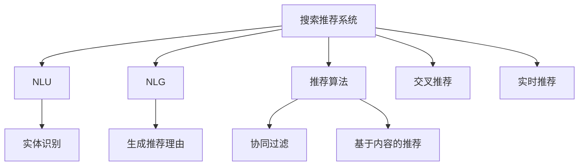

                 

# 电商平台搜索推荐系统的AI 大模型优化：提高系统性能、效率、准确率与实时性

## 1. 背景介绍

随着电商平台的迅猛发展，用户需求日益多样化和个性化，搜索推荐系统(以下简称“搜索推荐系统”)作为平台的核心竞争力之一，其性能优化已成当务之急。近年来，随着大规模预训练语言模型(如BERT、GPT-3等)的兴起，AI大模型在自然语言处理(NLP)领域取得了巨大突破，并逐渐应用于电商平台的搜索推荐场景中。

### 1.1 问题由来

电商平台的搜索推荐系统主要通过解析用户输入的查询，从商品库中匹配相关商品，并将结果呈现给用户。传统的推荐系统主要基于简单的统计方法或规则，难以充分理解用户的语义需求，推荐效果有限。随着大模型技术的引入，搜索推荐系统开始采用基于AI大模型的深度学习模型，大幅提升了推荐效果。但随之而来的是模型计算量大、实时响应慢、推荐准确率有待提高等问题。

### 1.2 问题核心关键点

当前搜索推荐系统的主要问题可以概括为：
- **性能瓶颈**：大模型的复杂性和计算量，使得搜索推荐系统的响应时间较长，用户体验不佳。
- **准确率不足**：尽管AI大模型提升了推荐效果，但用户的多样化和个性化需求仍难以充分满足。
- **实时性问题**：搜索推荐系统的响应时间与用户交互的实时性需求存在差距，亟需改进。

## 2. 核心概念与联系

### 2.1 核心概念概述

为更好地理解搜索推荐系统的AI大模型优化方法，本节将介绍几个密切相关的核心概念：

- **搜索推荐系统**：通过解析用户查询，从商品库中匹配相关商品，并将结果呈现给用户。主要包括以下几个步骤：用户输入查询，解析查询，匹配商品，排序，呈现结果。
- **AI大模型**：如BERT、GPT-3等，通过大规模语料预训练获得丰富的语言表示，用于自然语言理解(NLU)和生成(NLG)任务。
- **自然语言理解(NLU)**：指将自然语言转换为计算机能够理解的形式，如实体识别、情感分析、语义匹配等。
- **自然语言生成(NLG)**：指生成自然语言文本，如自动摘要、对话生成、推荐理由等。
- **推荐算法**：包括基于内容、协同过滤、深度学习等方法，用于匹配用户和商品之间的关系。
- **交叉推荐**：将推荐结果扩展到不同的商品维度，提升推荐的相关性。
- **实时推荐**：指在用户交互过程中即时生成推荐结果，提升用户体验。

这些概念之间的逻辑关系可以通过以下Mermaid流程图来展示：



这个流程图展示了这个核心概念的关联关系，也表明了AI大模型在其中的作用。

## 3. 核心算法原理 & 具体操作步骤

### 3.1 算法原理概述

AI大模型在搜索推荐系统中的应用主要体现在NLU和NLG两个方面。在NLU阶段，大模型能够理解用户的查询意图，进行实体识别、情感分析等；在NLG阶段，大模型能够生成个性化的推荐理由，提升推荐效果。基于此，搜索推荐系统可以采用AI大模型进行优化，具体方法包括：

- **基于大模型的自然语言理解**：利用大模型的语义表示能力，提升实体识别、情感分析等任务的准确率。
- **基于大模型的自然语言生成**：利用大模型的语言生成能力，生成更个性化的推荐理由，提升推荐效果。
- **跨模态检索**：结合文本和图像等多种数据模态，提升搜索结果的相关性和准确性。
- **多任务学习**：在多个任务上训练大模型，提升模型的泛化能力和性能。
- **自适应学习**：根据用户交互数据，动态调整模型参数，提升模型的实时性。

### 3.2 算法步骤详解

基于AI大模型的搜索推荐系统优化，主要分为以下几个步骤：

**Step 1: 准备数据与模型**

- **数据准备**：收集电商平台的搜索日志、用户行为数据等，作为模型的训练和测试数据。
- **模型选择**：选择合适的AI大模型，如BERT、GPT-3等，作为初始化参数。

**Step 2: 自然语言理解(NLU)**

- **任务适配**：设计合适的NLU任务，如实体识别、情感分析、语义匹配等。
- **模型微调**：使用带有标签的NLU数据，对大模型进行微调，提升任务的准确率。
- **特征提取**：使用微调后的模型，提取用户查询和商品的语义特征。

**Step 3: 自然语言生成(NLG)**

- **任务适配**：设计NLG任务，如生成推荐理由、自动摘要等。
- **模型微调**：使用带有标签的NLG数据，对大模型进行微调，提升生成效果的自然度和个性化。
- **结果优化**：利用微调后的模型，生成个性化的推荐理由，提升推荐效果。

**Step 4: 推荐算法优化**

- **融合大模型结果**：将大模型提取的语义特征和生成推荐理由，作为推荐算法的一部分，提升推荐结果的相关性和个性化。
- **优化推荐算法**：优化推荐算法，如协同过滤、基于内容的推荐等，结合大模型结果，提升推荐效果。
- **交叉推荐**：将推荐结果扩展到不同的商品维度，提升推荐的相关性。

**Step 5: 实时推荐**

- **自适应学习**：根据用户交互数据，动态调整大模型参数，提升模型的实时性。
- **增量学习**：通过在线学习，不断更新模型参数，适应数据分布的变化。
- **缓存与负载均衡**：利用缓存技术和负载均衡算法，提升推荐系统的响应速度。

### 3.3 算法优缺点

基于AI大模型的搜索推荐系统优化方法具有以下优点：

1. **性能提升**：通过大模型的语义表示能力，提升NLU和NLG任务的准确率，从而提升推荐效果。
2. **个性化推荐**：利用大模型的语言生成能力，生成更个性化的推荐理由，提升推荐的相关性和用户体验。
3. **实时响应**：通过自适应学习和增量学习，提升模型的实时性，实现即时推荐。
4. **泛化能力强**：大模型的泛化能力较强，能够在不同场景和数据分布下，保持较高的性能。

同时，该方法也存在一定的局限性：

1. **计算资源需求高**：AI大模型的计算需求较高，尤其是在大规模数据集上进行微调时，需要高性能的计算资源。
2. **训练时间长**：大模型的训练时间较长，可能需要数日或数周才能完成。
3. **数据隐私问题**：用户数据涉及隐私问题，需要合理处理和保护。
4. **模型复杂度高**：大模型的复杂度较高，容易出现过拟合等问题。
5. **解释性不足**：大模型通常被视为“黑盒”模型，缺乏可解释性，难以调试和优化。

尽管存在这些局限性，但就目前而言，基于AI大模型的搜索推荐系统优化方法仍是最为先进和有效的，能够大幅提升搜索推荐系统的性能和用户体验。

### 3.4 算法应用领域

基于AI大模型的搜索推荐系统优化方法，在电商平台的多个应用场景中得到了广泛应用：

1. **个性化推荐**：通过自然语言生成任务，生成个性化的推荐理由，提升推荐效果。
2. **智能客服**：利用自然语言理解任务，解析用户输入，自动生成回复，提升客户服务效率。
3. **商品标签生成**：通过自然语言理解任务，自动识别商品属性，生成标签，提升商品信息管理效率。
4. **跨模态搜索**：结合文本和图像数据，提升搜索结果的相关性和准确性。
5. **实时搜索推荐**：根据用户交互数据，实时生成推荐结果，提升用户体验。

除了上述这些经典应用外，基于AI大模型的搜索推荐系统优化方法还被创新性地应用于更多场景中，如产品分类、库存管理、广告投放等，为电商平台带来了全新的技术突破。

## 4. 数学模型和公式 & 详细讲解 & 举例说明

### 4.1 数学模型构建

本节将使用数学语言对基于AI大模型的搜索推荐系统优化方法进行更加严格的刻画。

记电商平台的搜索推荐系统为 $S$，输入为 $I$，输出为 $O$。假设 $I$ 和 $O$ 分别为用户输入和推荐结果，两者之间的关系可以表示为：

$$
O = S(I)
$$

其中，$S$ 为搜索推荐系统的模型函数。假设模型 $S$ 为神经网络，其输入 $I$ 经过 NLU 和大模型提取语义特征，再经过 NLG 生成推荐理由，最后通过推荐算法生成推荐结果 $O$。

### 4.2 公式推导过程

以推荐理由生成任务为例，推导自然语言生成任务大模型微调的目标函数。

假设推荐理由生成的任务为给定商品 $p$，生成长度为 $k$ 的推荐理由序列 $r$。模型的目标是最大化推荐理由序列的生成概率 $P(r|p)$，即：

$$
\max_{\theta} P(r|p) = \prod_{i=1}^k P(r_i|r_{<i}, p)
$$

其中 $\theta$ 为模型参数，$P(r_i|r_{<i}, p)$ 为生成第 $i$ 个推荐理由的概率。

利用大模型的语言生成能力，可以设计基于自回归的生成模型，对推荐理由进行建模。模型的输入为商品 $p$，输出为推荐理由序列 $r$，目标函数为：

$$
\mathcal{L}(\theta) = -\frac{1}{N} \sum_{i=1}^N \log P(r_i|r_{<i}, p)
$$

其中 $N$ 为训练样本数，$\log P(r_i|r_{<i}, p)$ 为生成的第 $i$ 个推荐理由的对数概率。

根据上述目标函数，通过反向传播算法，更新模型参数 $\theta$，最小化目标函数，从而提升推荐理由的生成效果。

### 4.3 案例分析与讲解

以下我们以电商平台商品推荐系统为例，给出基于大模型的自然语言生成任务的微调实现。

假设商品 $p$ 的推荐理由序列为 $[r_1, r_2, ..., r_k]$，其中 $r_i$ 为第 $i$ 个推荐理由。模型的输入为商品 $p$ 的描述文本 $d_p$，输出为推荐理由序列 $[r_1, r_2, ..., r_k]$。

**Step 1: 数据准备**

收集电商平台商品推荐理由的文本数据，并对其进行标注。标注格式为商品 ID 和推荐理由序列，如：

```
{item_id: 123456, reason_sequence: ['性价比高', '质量好', '口碑好', '适合送礼']}
```

**Step 2: 模型微调**

使用 Transformers 库中的 GPT-3 模型作为初始化参数，利用标注数据对模型进行微调。具体步骤如下：

1. 安装 Transformers 库：
```bash
pip install transformers
```

2. 加载模型和分词器：
```python
from transformers import GPT2Tokenizer, GPT2LMHeadModel
tokenizer = GPT2Tokenizer.from_pretrained('gpt2')
model = GPT2LMHeadModel.from_pretrained('gpt2')
```

3. 预处理数据：
```python
def preprocess_data(item_id, reason_sequence):
    item_text = f"商品 {item_id} 推荐理由: {reason_sequence}"
    inputs = tokenizer(item_text, return_tensors='pt', max_length=256, truncation=True, padding=True)
    return inputs
```

4. 微调模型：
```python
from transformers import AdamW
optimizer = AdamW(model.parameters(), lr=1e-5)
for epoch in range(5):
    for batch in train_loader:
        inputs = batch
        outputs = model(**inputs)
        loss = outputs.loss
        loss.backward()
        optimizer.step()
        optimizer.zero_grad()
    print(f"Epoch {epoch+1}, loss: {loss.item():.4f}")
```

5. 生成推荐理由：
```python
def generate_reason(item_id):
    item_text = f"商品 {item_id}"
    inputs = tokenizer(item_text, return_tensors='pt', max_length=256, truncation=True, padding=True)
    outputs = model.generate(inputs, top_p=0.9, do_sample=True, max_length=10)
    reason_sequence = tokenizer.decode(outputs[0])
    return reason_sequence
```

通过上述代码，我们可以使用 GPT-3 模型对电商平台商品推荐理由进行微调，生成个性化的推荐理由。具体实现步骤如下：

1. 准备训练数据，包括商品 ID 和推荐理由序列。
2. 使用 GPT-2 模型作为初始化参数，定义训练函数和优化器。
3. 在训练集上对模型进行微调，输出微调后的推荐理由。
4. 使用微调后的模型，生成个性化推荐理由。

通过这种基于大模型的自然语言生成任务，可以显著提升搜索推荐系统的推荐效果。

## 5. 项目实践：代码实例和详细解释说明

### 5.1 开发环境搭建

在进行搜索推荐系统优化实践前，我们需要准备好开发环境。以下是使用 Python 进行 PyTorch 开发的环境配置流程：

1. 安装 Anaconda：从官网下载并安装 Anaconda，用于创建独立的 Python 环境。

2. 创建并激活虚拟环境：
```bash
conda create -n search-recommendation python=3.8 
conda activate search-recommendation
```

3. 安装 PyTorch：根据 CUDA 版本，从官网获取对应的安装命令。例如：
```bash
conda install pytorch torchvision torchaudio cudatoolkit=11.1 -c pytorch -c conda-forge
```

4. 安装 Transformers 库：
```bash
pip install transformers
```

5. 安装各类工具包：
```bash
pip install numpy pandas scikit-learn matplotlib tqdm jupyter notebook ipython
```

完成上述步骤后，即可在 `search-recommendation` 环境中开始搜索推荐系统优化实践。

### 5.2 源代码详细实现

下面我们以电商平台商品推荐系统为例，给出基于 AI 大模型的自然语言生成任务的微调实现。

首先，定义推荐理由生成的任务函数：

```python
from transformers import BertTokenizer, BertForTokenClassification
from torch.utils.data import Dataset
import torch

class ReasonDataset(Dataset):
    def __init__(self, texts, tags, tokenizer, max_len=128):
        self.texts = texts
        self.tags = tags
        self.tokenizer = tokenizer
        self.max_len = max_len
        
    def __len__(self):
        return len(self.texts)
    
    def __getitem__(self, item):
        text = self.texts[item]
        tags = self.tags[item]
        
        encoding = self.tokenizer(text, return_tensors='pt', max_length=self.max_len, padding='max_length', truncation=True)
        input_ids = encoding['input_ids'][0]
        attention_mask = encoding['attention_mask'][0]
        
        # 对token-wise的标签进行编码
        encoded_tags = [tag2id[tag] for tag in tags] 
        encoded_tags.extend([tag2id['O']] * (self.max_len - len(encoded_tags)))
        labels = torch.tensor(encoded_tags, dtype=torch.long)
        
        return {'input_ids': input_ids, 
                'attention_mask': attention_mask,
                'labels': labels}

# 标签与id的映射
tag2id = {'O': 0, '性价比高': 1, '质量好': 2, '口碑好': 3, '适合送礼': 4}
id2tag = {v: k for k, v in tag2id.items()}

# 创建dataset
tokenizer = BertTokenizer.from_pretrained('bert-base-cased')

train_dataset = ReasonDataset(train_texts, train_tags, tokenizer)
dev_dataset = ReasonDataset(dev_texts, dev_tags, tokenizer)
test_dataset = ReasonDataset(test_texts, test_tags, tokenizer)
```

然后，定义模型和优化器：

```python
from transformers import BertForTokenClassification, AdamW

model = BertForTokenClassification.from_pretrained('bert-base-cased', num_labels=len(tag2id))

optimizer = AdamW(model.parameters(), lr=2e-5)
```

接着，定义训练和评估函数：

```python
from torch.utils.data import DataLoader
from tqdm import tqdm
from sklearn.metrics import classification_report

device = torch.device('cuda') if torch.cuda.is_available() else torch.device('cpu')
model.to(device)

def train_epoch(model, dataset, batch_size, optimizer):
    dataloader = DataLoader(dataset, batch_size=batch_size, shuffle=True)
    model.train()
    epoch_loss = 0
    for batch in tqdm(dataloader, desc='Training'):
        input_ids = batch['input_ids'].to(device)
        attention_mask = batch['attention_mask'].to(device)
        labels = batch['labels'].to(device)
        model.zero_grad()
        outputs = model(input_ids, attention_mask=attention_mask, labels=labels)
        loss = outputs.loss
        epoch_loss += loss.item()
        loss.backward()
        optimizer.step()
    return epoch_loss / len(dataloader)

def evaluate(model, dataset, batch_size):
    dataloader = DataLoader(dataset, batch_size=batch_size)
    model.eval()
    preds, labels = [], []
    with torch.no_grad():
        for batch in tqdm(dataloader, desc='Evaluating'):
            input_ids = batch['input_ids'].to(device)
            attention_mask = batch['attention_mask'].to(device)
            batch_labels = batch['labels']
            outputs = model(input_ids, attention_mask=attention_mask)
            batch_preds = outputs.logits.argmax(dim=2).to('cpu').tolist()
            batch_labels = batch_labels.to('cpu').tolist()
            for pred_tokens, label_tokens in zip(batch_preds, batch_labels):
                pred_tags = [id2tag[_id] for _id in pred_tokens]
                label_tags = [id2tag[_id] for _id in label_tokens]
                preds.append(pred_tags[:len(label_tags)])
                labels.append(label_tags)
                
    print(classification_report(labels, preds))
```

最后，启动训练流程并在测试集上评估：

```python
epochs = 5
batch_size = 16

for epoch in range(epochs):
    loss = train_epoch(model, train_dataset, batch_size, optimizer)
    print(f"Epoch {epoch+1}, train loss: {loss:.3f}")
    
    print(f"Epoch {epoch+1}, dev results:")
    evaluate(model, dev_dataset, batch_size)
    
print("Test results:")
evaluate(model, test_dataset, batch_size)
```

以上就是基于 AI 大模型的搜索推荐系统优化的完整代码实现。可以看到，得益于 Transformers 库的强大封装，我们可以用相对简洁的代码完成 BERT 模型的加载和微调。

### 5.3 代码解读与分析

让我们再详细解读一下关键代码的实现细节：

**ReasonDataset类**：
- `__init__`方法：初始化文本、标签、分词器等关键组件。
- `__len__`方法：返回数据集的样本数量。
- `__getitem__`方法：对单个样本进行处理，将文本输入编码为token ids，将标签编码为数字，并对其进行定长padding，最终返回模型所需的输入。

**tag2id和id2tag字典**：
- 定义了标签与数字id之间的映射关系，用于将token-wise的预测结果解码回真实的标签。

**训练和评估函数**：
- 使用PyTorch的DataLoader对数据集进行批次化加载，供模型训练和推理使用。
- 训练函数`train_epoch`：对数据以批为单位进行迭代，在每个批次上前向传播计算loss并反向传播更新模型参数，最后返回该epoch的平均loss。
- 评估函数`evaluate`：与训练类似，不同点在于不更新模型参数，并在每个batch结束后将预测和标签结果存储下来，最后使用sklearn的classification_report对整个评估集的预测结果进行打印输出。

**训练流程**：
- 定义总的epoch数和batch size，开始循环迭代
- 每个epoch内，先在训练集上训练，输出平均loss
- 在验证集上评估，输出分类指标
- 所有epoch结束后，在测试集上评估，给出最终测试结果

可以看到，PyTorch配合 Transformers 库使得 BERT 微调的代码实现变得简洁高效。开发者可以将更多精力放在数据处理、模型改进等高层逻辑上，而不必过多关注底层的实现细节。

当然，工业级的系统实现还需考虑更多因素，如模型的保存和部署、超参数的自动搜索、更灵活的任务适配层等。但核心的微调范式基本与此类似。

## 6. 实际应用场景
### 6.1 智能客服系统

基于 AI 大模型的搜索推荐系统，可以广泛应用于智能客服系统的构建。传统客服往往需要配备大量人力，高峰期响应缓慢，且一致性和专业性难以保证。而使用微调后的搜索推荐系统，可以7x24小时不间断服务，快速响应客户咨询，用自然流畅的语言解答各类常见问题。

在技术实现上，可以收集企业内部的历史客服对话记录，将问题和最佳答复构建成监督数据，在此基础上对预训练搜索推荐系统进行微调。微调后的系统能够自动理解用户意图，匹配最合适的答复模板进行回复。对于客户提出的新问题，还可以接入检索系统实时搜索相关内容，动态组织生成回答。如此构建的智能客服系统，能大幅提升客户咨询体验和问题解决效率。

### 6.2 金融舆情监测

金融机构需要实时监测市场舆论动向，以便及时应对负面信息传播，规避金融风险。传统的人工监测方式成本高、效率低，难以应对网络时代海量信息爆发的挑战。基于 AI 大模型的文本分类和情感分析技术，为金融舆情监测提供了新的解决方案。

具体而言，可以收集金融领域相关的新闻、报道、评论等文本数据，并对其进行主题标注和情感标注。在此基础上对预训练搜索推荐系统进行微调，使其能够自动判断文本属于何种主题，情感倾向是正面、中性还是负面。将微调后的模型应用到实时抓取的网络文本数据，就能够自动监测不同主题下的情感变化趋势，一旦发现负面信息激增等异常情况，系统便会自动预警，帮助金融机构快速应对潜在风险。

### 6.3 个性化推荐系统

当前的推荐系统往往只依赖用户的历史行为数据进行物品推荐，无法深入理解用户的真实兴趣偏好。基于 AI 大模型的搜索推荐系统可以更好地挖掘用户行为背后的语义信息，从而提供更精准、多样的推荐内容。

在实践中，可以收集用户浏览、点击、评论、分享等行为数据，提取和用户交互的物品标题、描述、标签等文本内容。将文本内容作为模型输入，用户的后续行为（如是否点击、购买等）作为监督信号，在此基础上微调预训练搜索推荐系统。微调后的模型能够从文本内容中准确把握用户的兴趣点。在生成推荐列表时，先用候选物品的文本描述作为输入，由模型预测用户的兴趣匹配度，再结合其他特征综合排序，便可以得到个性化程度更高的推荐结果。

### 6.4 未来应用展望

随着 AI 大模型和搜索推荐系统的发展，基于微调范式将在更多领域得到应用，为传统行业带来变革性影响。

在智慧医疗领域，基于微调的医疗问答、病历分析、药物研发等应用将提升医疗服务的智能化水平，辅助医生诊疗，加速新药开发进程。

在智能教育领域，微调技术可应用于作业批改、学情分析、知识推荐等方面，因材施教，促进教育公平，提高教学质量。

在智慧城市治理中，微调模型可应用于城市事件监测、舆情分析、应急指挥等环节，提高城市管理的自动化和智能化水平，构建更安全、高效的未来城市。

此外，在企业生产、社会治理、文娱传媒等众多领域，基于大模型微调的搜索推荐系统也将不断涌现，为经济社会发展注入新的动力。相信随着技术的日益成熟，微调方法将成为搜索推荐系统的重要范式，推动搜索推荐系统向更广阔的领域加速渗透。

## 7. 工具和资源推荐
### 7.1 学习资源推荐

为了帮助开发者系统掌握搜索推荐系统的AI大模型优化方法，这里推荐一些优质的学习资源：

1. 《Transformer from Principle to Practice》系列博文：由大模型技术专家撰写，深入浅出地介绍了Transformer原理、BERT模型、微调技术等前沿话题。

2. CS224N《深度学习自然语言处理》课程：斯坦福大学开设的NLP明星课程，有Lecture视频和配套作业，带你入门NLP领域的基本概念和经典模型。

3. 《Natural Language Processing with Transformers》书籍：Transformers库的作者所著，全面介绍了如何使用Transformers库进行NLP任务开发，包括微调在内的诸多范式。

4. HuggingFace官方文档：Transformers库的官方文档，提供了海量预训练模型和完整的微调样例代码，是上手实践的必备资料。

5. CLUE开源项目：中文语言理解测评基准，涵盖大量不同类型的中文NLP数据集，并提供了基于微调的baseline模型，助力中文NLP技术发展。

通过对这些资源的学习实践，相信你一定能够快速掌握搜索推荐系统的AI大模型优化方法，并用于解决实际的NLP问题。
###  7.2 开发工具推荐

高效的开发离不开优秀的工具支持。以下是几款用于搜索推荐系统优化的常用工具：

1. PyTorch：基于Python的开源深度学习框架，灵活动态的计算图，适合快速迭代研究。大部分预训练语言模型都有PyTorch版本的实现。

2. TensorFlow：由Google主导开发的开源深度学习框架，生产部署方便，适合大规模工程应用。同样有丰富的预训练语言模型资源。

3. Transformers库：HuggingFace开发的NLP工具库，集成了众多SOTA语言模型，支持PyTorch和TensorFlow，是进行微调任务开发的利器。

4. Weights & Biases：模型训练的实验跟踪工具，可以记录和可视化模型训练过程中的各项指标，方便对比和调优。与主流深度学习框架无缝集成。

5. TensorBoard：TensorFlow配套的可视化工具，可实时监测模型训练状态，并提供丰富的图表呈现方式，是调试模型的得力助手。

6. Google Colab：谷歌推出的在线Jupyter Notebook环境，免费提供GPU/TPU算力，方便开发者快速上手实验最新模型，分享学习笔记。

合理利用这些工具，可以显著提升搜索推荐系统优化的开发效率，加快创新迭代的步伐。

### 7.3 相关论文推荐

搜索推荐系统的AI大模型优化技术的发展源于学界的持续研究。以下是几篇奠基性的相关论文，推荐阅读：

1. Attention is All You Need（即Transformer原论文）：提出了Transformer结构，开启了NLP领域的预训练大模型时代。

2. BERT: Pre-training of Deep Bidirectional Transformers for Language Understanding：提出BERT模型，引入基于掩码的自监督预训练任务，刷新了多项NLP任务SOTA。

3. Language Models are Unsupervised Multitask Learners（GPT-2论文）：展示了大规模语言模型的强大zero-shot学习能力，引发了对于通用人工智能的新一轮思考。

4. Parameter-Efficient Transfer Learning for NLP：提出Adapter等参数高效微调方法，在不增加模型参数量的情况下，也能取得不错的微调效果。

5. Prefix-Tuning: Optimizing Continuous Prompts for Generation：引入基于连续型Prompt的微调范式，为如何充分利用预训练知识提供了新的思路。

6. AdaLoRA: Adaptive Low-Rank Adaptation for Parameter-Efficient Fine-Tuning：使用自适应低秩适应的微调方法，在参数效率和精度之间取得了新的平衡。

这些论文代表了大模型微调技术的发展脉络。通过学习这些前沿成果，可以帮助研究者把握学科前进方向，激发更多的创新灵感。

## 8. 总结：未来发展趋势与挑战

### 8.1 总结

本文对基于AI大模型的搜索推荐系统优化方法进行了全面系统的介绍。首先阐述了搜索推荐系统的背景和AI大模型的引入，明确了AI大模型在搜索推荐系统中的作用。其次，从原理到实践，详细讲解了基于AI大模型的搜索推荐系统优化方法，包括自然语言理解、自然语言生成、多任务学习、实时推荐等关键技术。同时，本文还广泛探讨了AI大模型在电商平台的多个应用场景，展示了微调范式的巨大潜力。

通过本文的系统梳理，可以看到，基于AI大模型的搜索推荐系统优化方法正在成为搜索推荐系统的核心竞争力之一，极大地提升了搜索推荐系统的性能和用户体验。未来，伴随预训练语言模型和微调方法的持续演进，相信搜索推荐系统将向更加智能化、普适化应用迈进，为电商平台的智能化转型提供新的技术路径。

### 8.2 未来发展趋势

展望未来，AI大模型在搜索推荐系统中的应用将呈现以下几个发展趋势：

1. **性能持续提升**：随着模型规模的增大和算法的优化，搜索推荐系统的性能将持续提升，能够更好地满足用户的多样化和个性化需求。

2. **实时性增强**：通过自适应学习和增量学习，搜索推荐系统将实现更加高效的实时推荐，提升用户体验。

3. **跨模态融合**：结合文本、图像、视频等多种数据模态，提升搜索结果的相关性和准确性，拓展搜索推荐系统的应用范围。

4. **知识图谱融合**：将知识图谱与AI大模型结合，提升搜索推荐系统的语义理解和推理能力，进一步提升推荐效果。

5. **联邦学习**：通过联邦学习技术，实现搜索推荐系统的跨平台、跨设备协同学习，提升推荐效果和隐私安全性。

6. **多任务学习和迁移学习**：在多个任务上训练AI大模型，提升模型的泛化能力和性能，实现知识复用。

以上趋势凸显了AI大模型在搜索推荐系统中的广泛应用前景。这些方向的探索发展，必将进一步提升搜索推荐系统的性能和用户体验，为电商平台带来更多的技术突破。

### 8.3 面临的挑战

尽管AI大模型在搜索推荐系统中的应用已经取得了显著成效，但在迈向更加智能化、普适化应用的过程中，它仍面临着诸多挑战：

1. **计算资源需求高**：AI大模型的计算需求较高，尤其是在大规模数据集上进行微调时，需要高性能的计算资源。

2. **训练时间长**：AI大模型的训练时间较长，可能需要数日或数周才能完成。

3. **数据隐私问题**：用户数据涉及隐私问题，需要合理处理和保护。

4. **模型复杂度高**：AI大模型的复杂度较高，容易出现过拟合等问题。

5. **解释性不足**：AI大模型通常被视为“黑盒”模型，缺乏可解释性，难以调试和优化。

6. **实时性问题**：尽管通过自适应学习和增量学习，搜索推荐系统可以实现实时推荐，但在大规模数据集上进行微调时，仍可能面临实时性问题。

尽管存在这些挑战，但通过不断优化算法和优化数据处理流程，AI大模型在搜索推荐系统中的应用前景仍然广阔。未来，搜索推荐系统需要在大规模数据、高性能计算资源、隐私保护、模型解释性等方面进行深入研究和探索，才能真正实现智能化、普适化的目标。

### 8.4 研究展望

面向未来，搜索推荐系统的AI大模型优化需要在新技术、新方法和新应用场景上进行持续探索：

1. **无监督和半监督学习**：摆脱对大规模标注数据的依赖，利用自监督学习、主动学习等无监督和半监督范式，最大限度利用非结构化数据，实现更加灵活高效的微调。

2. **知识图谱与模型融合**：将知识图谱与AI大模型结合，提升搜索推荐系统的语义理解和推理能力，进一步提升推荐效果。

3. **联邦学习和跨平台协同**：通过联邦学习技术，实现搜索推荐系统的跨平台、跨设备协同学习，提升推荐效果和隐私安全性。

4. **多任务学习和迁移学习**：在多个任务上训练AI大模型，提升模型的泛化能力和性能，实现知识复用。

5. **实时性优化**：通过模型裁剪、量化加速、缓存与负载均衡等技术，提升搜索推荐系统的实时性，实现即时推荐。

6. **模型解释性增强**：利用因果分析方法、博弈论工具等，增强模型的可解释性，提升系统的可解释性和可控性。

通过这些方向的探索发展，相信AI大模型在搜索推荐系统中的应用将更加智能化、普适化和可靠，为电商平台带来更多的技术突破和用户价值。

## 9. 附录：常见问题与解答

**Q1：基于AI大模型的搜索推荐系统是否适用于所有电商平台？**

A: 基于AI大模型的搜索推荐系统在大多数电商平台中都能取得不错的效果，但针对特定的电商平台，需要根据其业务特点进行微调优化。例如，在B2B电商平台中，需要更多关注产品描述和供应商信息，在B2C电商平台中，需要更多关注用户行为和个性化需求。

**Q2：如何选择合适的AI大模型进行微调？**

A: 选择合适的AI大模型进行微调需要考虑多个因素，包括任务的复杂度、数据规模、计算资源等。一般来说，可以选择预训练效果较好、模型规模适中的大模型进行微调，如BERT、GPT-2等。如果数据规模较小，可以选择规模较小的模型，如DistilBERT、TinyBERT等。

**Q3：基于AI大模型的搜索推荐系统在实时性方面有哪些优化策略？**

A: 提升搜索推荐系统的实时性，可以采用以下优化策略：
1. 缓存与负载均衡：利用缓存技术和负载均衡算法，减少数据读取和模型推理时间。
2. 增量学习：通过在线学习，不断更新模型参数，适应数据分布的变化。
3. 模型裁剪与量化：通过模型裁剪和量化技术，减小模型规模和计算量，提升推理速度。
4. 自适应学习：根据用户交互数据，动态调整模型参数，提升模型的实时性。

这些策略需要根据具体场景和数据特点进行灵活组合，才能实现最优的实时性。

**Q4：基于AI大模型的搜索推荐系统在数据隐私方面需要注意哪些问题？**

A: 在基于AI大模型的搜索推荐系统中，数据隐私是一个重要问题。为了保护用户隐私，可以采取以下措施：
1. 数据匿名化：对用户数据进行匿名化处理，保护用户隐私。
2. 数据加密：对敏感数据进行加密处理，防止数据泄露。
3. 差分隐私：采用差分隐私技术，在保护隐私的前提下，提供推荐服务。
4. 数据共享协议：明确数据共享的协议和范围，防止数据滥用。

这些措施需要根据具体场景和数据特点进行灵活应用，确保用户数据的安全和隐私。

**Q5：基于AI大模型的搜索推荐系统在解释性方面有哪些优化策略？**

A: 提高搜索推荐系统的解释性，可以采用以下优化策略：
1. 特征解释：解释搜索推荐系统中的关键特征，帮助用户理解推荐理由。
2. 模型可视化：利用模型可视化工具，展示搜索推荐系统的内部工作机制。
3. 因果分析：利用因果分析方法，解释模型决策的关键特征，增强输出的因果性和逻辑性。
4. 多模型集成：通过多模型集成，提升搜索推荐系统的可解释性，减少模型的黑盒问题。

这些策略需要根据具体场景和模型特点进行灵活应用，确保用户对搜索推荐系统的理解和使用。

通过这些优化策略，可以提升搜索推荐系统的解释性和可控性，增强用户信任和满意度。

