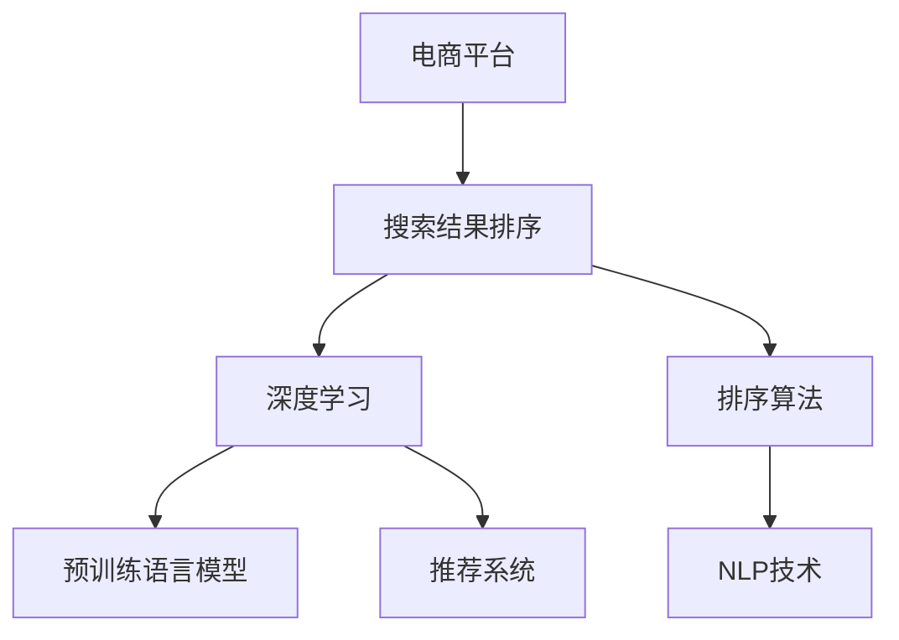

                 

# 电商平台搜索结果排序：AI大模型的新算法

> 关键词：电商平台, 搜索结果排序, AI大模型, 深度学习, 推荐系统, 排序算法, 自然语言处理(NLP)

## 1. 背景介绍

### 1.1 问题由来
电商平台每天接收的海量用户搜索请求，如何高效、准确地展示商品信息，提升用户体验和转化率，是平台必须解决的重大挑战。传统搜索引擎主要依赖关键词匹配和词频统计等静态特征，难以处理复杂的语义关系和实时搜索需求。而深度学习技术，特别是预训练语言模型，能够从海量的用户行为数据中挖掘丰富的语义信息，为搜索结果排序注入新的活力。

大模型在电商平台的搜索结果排序中，主要面临两个核心问题：

1. **语义理解**：用户查询中的潜在意图和上下文信息，需要在搜索结果中得到充分体现。
2. **个性化推荐**：不同用户对相同查询的关注点和优先级不同，需要依据用户画像和行为特征进行个性化排序。

传统搜索引擎依靠简单的静态特征匹配，难以捕捉这些复杂需求。而基于预训练语言模型的大模型方法，通过对海量数据的预训练，可以更深入地理解用户的意图，并在微调过程中结合业务需求进行个性化的优化。

### 1.2 问题核心关键点
- **语义理解**：模型通过学习大量的用户查询和商品描述，能够理解自然语言中的语义关系，识别出查询中的核心关键词和语义实体，更准确地匹配用户需求。
- **个性化推荐**：模型通过学习用户的搜索历史、点击行为等动态信息，能够对不同用户进行个性化排序，推荐符合其兴趣的商品。
- **实时代理**：模型可以实时处理用户的即时查询，适应用户需求的多样性和动态性，提供及时的搜索结果。

这些关键点使得大模型成为电商搜索结果排序的理想选择，能够显著提升用户的搜索体验和平台转化率。

## 2. 核心概念与联系

### 2.1 核心概念概述

为更好地理解基于大模型的电商平台搜索结果排序方法，本节将介绍几个密切相关的核心概念：

- **电商平台**：一种在线销售商品的平台，用户可以通过搜索和浏览找到所需商品，并进行购买或预定。
- **搜索结果排序**：根据用户查询和商品信息，对搜索结果进行优先级排序，以提高用户满意度。
- **深度学习**：一种基于神经网络的机器学习方法，通过多层神经网络结构，能够自动提取和处理数据特征。
- **预训练语言模型**：如BERT、GPT等，通过在大规模语料上进行预训练，能够学习通用的语言表示，提升模型泛化能力。
- **推荐系统**：根据用户的历史行为和兴趣，推荐符合其需求的商品或内容，提升用户粘性和转化率。
- **排序算法**：如基于深度学习的排序方法，能够综合考虑用户的意图、商品的属性和动态行为，进行智能排序。
- **自然语言处理(NLP)**：通过处理和分析自然语言数据，提取有价值的信息，如命名实体识别、情感分析、文本分类等。

这些核心概念之间的逻辑关系可以通过以下Mermaid流程图来展示：



这个流程图展示了大语言模型在电商平台搜索结果排序中的关键角色：

1. 电商平台将用户搜索请求作为输入，输出商品信息作为结果。
2. 深度学习和大模型技术对搜索结果进行排序。
3. 预训练语言模型和推荐系统为排序提供语义理解和个性化支持。
4. 排序算法综合这些信息，进行优先级排序。

这些概念共同构成了电商平台搜索结果排序的基础，使得大模型能够从自然语言和行为数据中提取丰富的信息，实现智能化的排序目标。

## 3. 核心算法原理 & 具体操作步骤
### 3.1 算法原理概述

基于大模型的电商平台搜索结果排序，本质上是深度学习框架在用户查询和商品信息之间的映射。其核心思想是：通过预训练语言模型学习用户查询和商品描述的语义表示，再通过微调或训练新的网络层，结合用户的搜索行为和特征，输出排序结果。

具体来说，算法包括以下几个关键步骤：

1. **用户查询编码**：使用大模型将用户查询编码成高维向量，表示查询的语义和意图。
2. **商品描述编码**：同样使用大模型将商品描述编码成高维向量，表示商品的语义和属性。
3. **排序计算**：将用户查询向量与商品向量进行匹配和融合，结合用户的个性化特征，计算商品的相关度得分。
4. **排序输出**：根据相关度得分，对商品进行排序，输出给用户。

### 3.2 算法步骤详解

#### 3.2.1 用户查询编码

用户查询编码是算法的首个步骤，其核心在于将用户的自然语言查询转化为机器可处理的形式。具体步骤如下：

1. **分词和清洗**：将用户查询输入经过分词和清洗，去除停用词和噪声。
2. **嵌入向量化**：使用大模型如BERT、GPT等，将查询转化为高维向量表示。
3. **语义理解**：通过预训练语言模型，对查询进行语义理解，识别出核心关键词和实体。

以下是使用Hugging Face Transformers库的示例代码：

```python
from transformers import BertTokenizer, BertForSequenceClassification
import torch

tokenizer = BertTokenizer.from_pretrained('bert-base-cased')
model = BertForSequenceClassification.from_pretrained('bert-base-cased', num_labels=1)

def encode_query(query):
    tokens = tokenizer.encode(query, add_special_tokens=True)
    tensor = torch.tensor(tokens).unsqueeze(0)
    outputs = model(tensor)
    return outputs[0,0]
```

#### 3.2.2 商品描述编码

商品描述编码与用户查询编码类似，但通常需要考虑商品的多种属性信息。具体步骤如下：

1. **多属性提取**：从商品描述中提取多种属性信息，如价格、品牌、分类等。
2. **向量拼接**：将每种属性的向量进行拼接，形成综合的商品描述向量。
3. **嵌入向量化**：使用大模型将拼接后的向量转化为高维向量表示。

以下是使用Hugging Face Transformers库的示例代码：

```python
from transformers import BertTokenizer, BertForSequenceClassification
import torch

tokenizer = BertTokenizer.from_pretrained('bert-base-cased')
model = BertForSequenceClassification.from_pretrained('bert-base-cased', num_labels=1)

def encode_product(product):
    tokens = tokenizer.encode(product, add_special_tokens=True)
    tensor = torch.tensor(tokens).unsqueeze(0)
    outputs = model(tensor)
    return outputs[0,0]
```

#### 3.2.3 排序计算

排序计算的核心在于将用户查询向量与商品向量进行匹配，并结合用户的个性化特征，计算商品的相关度得分。具体步骤如下：

1. **相关度计算**：通过点积或其他方式，计算查询向量与商品向量的相关度得分。
2. **个性化融合**：结合用户的搜索历史、点击行为等特征，进一步调整商品的相关度得分。
3. **排序输出**：根据相关度得分，对商品进行排序，输出给用户。

以下是使用Python和TensorFlow的示例代码：

```python
import tensorflow as tf

def compute_relevance(query_vector, product_vectors, user_features):
    # 计算相关度得分
    scores = tf.matmul(query_vector, product_vectors, transpose_b=True)
    
    # 结合个性化特征
    scores += tf.matmul(user_features, product_vectors, transpose_b=True)
    
    # 排序输出
    scores = tf.nn.softmax(scores, axis=1)
    return scores
```

#### 3.2.4 排序输出

排序输出的核心在于根据相关度得分，对商品进行排序，并输出给用户。具体步骤如下：

1. **TopK选择**：从排序得分中选出TopK个商品，作为推荐结果。
2. **结果展示**：将TopK商品展示给用户，并提供相应的展示界面和交互功能。

以下是使用Python和Flask框架的示例代码：

```python
from flask import Flask, request, jsonify

app = Flask(__name__)

@app.route('/recommend', methods=['POST'])
def recommend():
    query = request.json.get('query')
    query_vector = encode_query(query)
    
    product_vectors = []
    for product_id in request.json.get('products'):
        product_vectors.append(encode_product(product_id))
    
    user_features = request.json.get('user_features')
    
    scores = compute_relevance(query_vector, product_vectors, user_features)
    topk = scores.numpy().argsort()[-5:][::-1]
    
    result = [{'product_id': product_id, 'score': score} for product_id, score in zip(request.json.get('products'), topk)]
    
    return jsonify(result)
```

### 3.3 算法优缺点

基于大模型的电商平台搜索结果排序算法具有以下优点：

1. **语义理解能力强**：通过预训练语言模型，模型能够深入理解用户的查询意图和商品的语义信息，实现更准确的匹配。
2. **个性化推荐效果佳**：结合用户的个性化特征，模型能够进行定制化的排序，提升用户满意度和转化率。
3. **动态实时处理**：模型能够实时处理用户的即时查询，适应用户的动态需求，提供即时的搜索结果。

但该算法也存在一定的局限性：

1. **计算资源消耗大**：大模型需要占用大量的计算资源，包括GPU/TPU等高性能设备，且对内存和存储有较高要求。
2. **标注数据需求高**：模型需要大量标注数据进行训练和微调，标注成本较高。
3. **算法复杂度高**：需要综合考虑多种特征和动态信息，算法复杂度较高。
4. **可解释性差**：模型决策过程缺乏可解释性，难以进行调试和优化。

尽管存在这些局限性，但就目前而言，基于大模型的电商平台搜索结果排序方法仍是一种高效、准确的排序方式，具有广泛的应用前景。

### 3.4 算法应用领域

基于大模型的电商平台搜索结果排序方法，已经在电商、搜索、推荐等多个领域得到了广泛应用。具体应用场景包括：

1. **电商搜索**：在用户搜索商品时，实时返回符合其意图的相关商品。
2. **个性化推荐**：根据用户的历史行为和兴趣，推荐符合其需求的商品。
3. **商品排序**：根据用户的查询和行为，对商品进行排序展示，提升用户体验和转化率。

除了上述这些经典应用外，大模型的搜索结果排序方法也被创新性地应用到更多场景中，如智能客服、知识图谱构建、广告投放优化等，为电商和搜索系统带来了新的突破。随着预训练模型和排序方法的不断进步，相信电商平台搜索结果排序将迎来更多的创新和突破。

## 4. 数学模型和公式 & 详细讲解 & 举例说明

### 4.1 数学模型构建

本节将使用数学语言对基于大模型的电商平台搜索结果排序过程进行更加严格的刻画。

记用户查询为 $q$，商品描述为 $p$，用户的个性化特征为 $u$。预训练语言模型对查询和商品进行编码，分别输出查询向量和商品向量：

$$
\begin{aligned}
\mathbf{q} &= \text{BERT}(q) \\
\mathbf{p} &= \text{BERT}(p)
\end{aligned}
$$

用户的个性化特征 $u$ 可以是多种形式，如搜索历史、点击行为、地理位置等。在实际应用中，通常需要将这些特征进行归一化或标准化处理，以便于模型处理。

模型根据查询向量和商品向量的相关度得分，结合用户的个性化特征，计算商品的相关度得分 $s$：

$$
s(\mathbf{q}, \mathbf{p}, u) = \text{Relevance}(\mathbf{q}, \mathbf{p}) + \text{Personalization}(\mathbf{q}, \mathbf{p}, u)
$$

其中 $\text{Relevance}(\mathbf{q}, \mathbf{p})$ 表示查询向量和商品向量的相关度，$\text{Personalization}(\mathbf{q}, \mathbf{p}, u)$ 表示用户个性化特征对相关度得分的调整。

最终，模型根据相关度得分 $s$，对商品进行排序，输出TopK个商品给用户。

### 4.2 公式推导过程

以下是相关度计算和个性化调整的具体公式推导过程：

#### 4.2.1 相关度计算

相关度计算的核心在于计算查询向量和商品向量的相似度。常用的方式包括余弦相似度、点积相似度等。以点积相似度为例：

$$
\text{Relevance}(\mathbf{q}, \mathbf{p}) = \mathbf{q} \cdot \mathbf{p}
$$

其中 $\cdot$ 表示向量点积运算。

#### 4.2.2 个性化调整

个性化调整的核心在于结合用户的个性化特征，对相关度得分进行修正。假设用户特征向量为 $u$，与商品向量 $p$ 的点积为 $c$，则个性化调整公式为：

$$
\text{Personalization}(\mathbf{q}, \mathbf{p}, u) = c \cdot \mathbf{p}
$$

将上述公式代入总的相关度得分公式：

$$
s(\mathbf{q}, \mathbf{p}, u) = \mathbf{q} \cdot \mathbf{p} + c \cdot \mathbf{p}
$$

### 4.3 案例分析与讲解

以某电商平台为例，假设有用户搜索 "手机", 查询向量为 $\mathbf{q}$，包含商品ID为1001和1002的两款手机描述向量分别为 $\mathbf{p}_1$ 和 $\mathbf{p}_2$，用户的个性化特征向量为 $\mathbf{u}$。则相关度得分为：

$$
s(\mathbf{q}, \mathbf{p}_1, \mathbf{u}) = \mathbf{q} \cdot \mathbf{p}_1 + (\mathbf{u} \cdot \mathbf{p}_1)
$$

$$
s(\mathbf{q}, \mathbf{p}_2, \mathbf{u}) = \mathbf{q} \cdot \mathbf{p}_2 + (\mathbf{u} \cdot \mathbf{p}_2)
$$

模型将根据相关度得分对商品进行排序，并输出TopK个商品给用户。

## 5. 项目实践：代码实例和详细解释说明

### 5.1 开发环境搭建

在进行电商平台搜索结果排序实践前，我们需要准备好开发环境。以下是使用Python进行Flask开发的环境配置流程：

1. 安装Anaconda：从官网下载并安装Anaconda，用于创建独立的Python环境。

2. 创建并激活虚拟环境：
```bash
conda create -n pytorch-env python=3.8 
conda activate pytorch-env
```

3. 安装PyTorch：根据CUDA版本，从官网获取对应的安装命令。例如：
```bash
conda install pytorch torchvision torchaudio cudatoolkit=11.1 -c pytorch -c conda-forge
```

4. 安装Flask：
```bash
pip install flask
```

5. 安装各类工具包：
```bash
pip install numpy pandas scikit-learn matplotlib tqdm jupyter notebook ipython
```

完成上述步骤后，即可在`pytorch-env`环境中开始微调实践。

### 5.2 源代码详细实现

首先，定义查询和商品编码函数：

```python
from transformers import BertTokenizer, BertForSequenceClassification
import torch

tokenizer = BertTokenizer.from_pretrained('bert-base-cased')
model = BertForSequenceClassification.from_pretrained('bert-base-cased', num_labels=1)

def encode_query(query):
    tokens = tokenizer.encode(query, add_special_tokens=True)
    tensor = torch.tensor(tokens).unsqueeze(0)
    outputs = model(tensor)
    return outputs[0,0]

def encode_product(product):
    tokens = tokenizer.encode(product, add_special_tokens=True)
    tensor = torch.tensor(tokens).unsqueeze(0)
    outputs = model(tensor)
    return outputs[0,0]
```

接着，定义排序计算函数：

```python
import tensorflow as tf

def compute_relevance(query_vector, product_vectors, user_features):
    # 计算相关度得分
    scores = tf.matmul(query_vector, product_vectors, transpose_b=True)
    
    # 结合个性化特征
    scores += tf.matmul(user_features, product_vectors, transpose_b=True)
    
    # 排序输出
    scores = tf.nn.softmax(scores, axis=1)
    return scores
```

最后，启动Flask服务器并暴露API接口：

```python
from flask import Flask, request, jsonify

app = Flask(__name__)

@app.route('/recommend', methods=['POST'])
def recommend():
    query = request.json.get('query')
    query_vector = encode_query(query)
    
    product_vectors = []
    for product_id in request.json.get('products'):
        product_vectors.append(encode_product(product_id))
    
    user_features = request.json.get('user_features')
    
    scores = compute_relevance(query_vector, product_vectors, user_features)
    topk = scores.numpy().argsort()[-5:][::-1]
    
    result = [{'product_id': product_id, 'score': score} for product_id, score in zip(request.json.get('products'), topk)]
    
    return jsonify(result)
```

以上是使用PyTorch和Flask进行电商平台搜索结果排序的完整代码实现。可以看到，借助TensorFlow和Flask等工具，模型能够实时处理用户的查询，并输出排序结果。

### 5.3 代码解读与分析

让我们再详细解读一下关键代码的实现细节：

**encode_query和encode_product函数**：
- 使用BERT模型将查询和商品描述转化为高维向量。
- 采用特殊的标记方式，如[CLS]、[SEP]，帮助模型更好地理解查询和商品描述的边界。

**compute_relevance函数**：
- 使用TensorFlow计算查询向量和商品向量的相关度得分，并进行个性化调整。
- 使用softmax函数将得分转化为概率分布，方便排序输出。

**recommend函数**：
- 从请求中获取用户查询和商品ID，调用encode_query和encode_product函数进行编码。
- 获取用户的个性化特征，调用compute_relevance函数计算相关度得分。
- 根据得分对商品进行排序，输出TopK个商品。

通过以上代码实现，可以看出，基于大模型的电商平台搜索结果排序方法，具有高度的灵活性和可扩展性，能够适应不同业务场景和数据特征的需求。

当然，工业级的系统实现还需考虑更多因素，如模型的保存和部署、超参数的自动搜索、更灵活的任务适配层等。但核心的排序范式基本与此类似。

## 6. 实际应用场景

### 6.1 电商平台搜索

电商平台搜索是应用大模型排序的核心场景。通过将用户查询转化为高维向量，结合商品向量和个性化特征，模型能够实现实时、高效的搜索结果排序。

在技术实现上，可以收集用户的搜索行为数据，构建标注数据集，对预训练语言模型进行微调。微调后的模型能够理解用户的搜索意图，自动进行商品匹配和排序。对于新用户，则可以采用零样本学习的方式，利用预训练模型进行初始推荐，逐步迭代优化。

### 6.2 个性化推荐

个性化推荐是电商平台排序的重要应用之一。通过用户的历史行为数据，模型能够学习用户的兴趣和偏好，进行个性化的排序和推荐。

在实际应用中，可以使用微调后的模型对用户的搜索历史、点击行为等进行编码，结合商品向量和查询向量，计算相关度得分。模型的输出可以作为推荐系统的输入，指导商品展示和广告投放，提升用户满意度和转化率。

### 6.3 搜索结果排序

搜索结果排序是电商平台的另一项重要应用。通过用户查询和商品描述，模型能够进行智能排序，提升搜索结果的相关性和可读性。

在实际应用中，可以收集用户的搜索历史和行为数据，构建标注数据集，对预训练语言模型进行微调。微调后的模型能够理解用户的查询意图，自动进行商品排序，提供更好的用户体验。

### 6.4 未来应用展望

随着大语言模型和排序方法的不断发展，电商平台搜索结果排序将呈现以下几个发展趋势：

1. **实时计算**：未来将支持更高效的实时计算，能够快速处理用户的即时查询，提供即时响应。
2. **多模态融合**：将视觉、语音等多模态信息与文本信息融合，提升模型的感知能力和泛化能力。
3. **自动化优化**：使用强化学习等技术，自动优化模型参数和特征选择，提升排序效果。
4. **可解释性增强**：引入可解释性技术，如特征重要性分析、模型解释器等，提升模型的透明性和可信度。
5. **跨平台部署**：支持多种平台和设备，实现跨平台无缝协作，提升用户体验。

这些趋势将使得电商平台搜索结果排序系统更加智能、高效、可扩展，为用户提供更好的搜索体验。

## 7. 工具和资源推荐

### 7.1 学习资源推荐

为了帮助开发者系统掌握电商平台搜索结果排序的理论基础和实践技巧，这里推荐一些优质的学习资源：

1. 《深度学习与自然语言处理》书籍：深度学习与自然语言处理的经典著作，涵盖了NLP和排序算法的基础知识和最新进展。
2. Coursera《深度学习专项课程》：斯坦福大学开设的深度学习课程，包括NLP和排序算法的详细讲解。
3. Udacity《人工智能与机器学习纳米学位》：涵盖人工智能和机器学习的多种算法和应用，包括排序算法和电商系统的设计。
4. PyTorch官方文档：PyTorch深度学习框架的详细文档，包括模型的构建、训练、推理等。
5. TensorFlow官方文档：TensorFlow深度学习框架的详细文档，包括模型的构建、训练、推理等。

通过对这些资源的学习实践，相信你一定能够快速掌握电商平台搜索结果排序的精髓，并用于解决实际的电商问题。

### 7.2 开发工具推荐

高效的开发离不开优秀的工具支持。以下是几款用于电商平台搜索结果排序开发的常用工具：

1. PyTorch：基于Python的开源深度学习框架，灵活动态的计算图，适合快速迭代研究。大部分预训练语言模型都有PyTorch版本的实现。
2. TensorFlow：由Google主导开发的开源深度学习框架，生产部署方便，适合大规模工程应用。同样有丰富的预训练语言模型资源。
3. Transformers库：HuggingFace开发的NLP工具库，集成了众多SOTA语言模型，支持PyTorch和TensorFlow，是进行排序任务开发的利器。
4. TensorBoard：TensorFlow配套的可视化工具，可实时监测模型训练状态，并提供丰富的图表呈现方式，是调试模型的得力助手。
5. Weights & Biases：模型训练的实验跟踪工具，可以记录和可视化模型训练过程中的各项指标，方便对比和调优。

合理利用这些工具，可以显著提升电商平台搜索结果排序任务的开发效率，加快创新迭代的步伐。

### 7.3 相关论文推荐

电商平台搜索结果排序技术的发展源于学界的持续研究。以下是几篇奠基性的相关论文，推荐阅读：

1. Attention is All You Need：提出了Transformer结构，开启了NLP领域的预训练大模型时代。
2. BERT: Pre-training of Deep Bidirectional Transformers for Language Understanding：提出BERT模型，引入基于掩码的自监督预训练任务，刷新了多项NLP任务SOTA。
3. Deep Learning for Recommendation Systems：介绍深度学习在推荐系统中的应用，包括排序算法和多模态融合技术。
4. Learning to Rank for Information Retrieval and Recommender Systems：介绍排序算法的理论基础和实践方法，包括深度学习排序算法和评估指标。
5. Neural Conversation Models：介绍基于深度学习的对话系统，包括搜索引擎和推荐系统的排序算法。

这些论文代表了大语言模型和排序技术的发展脉络。通过学习这些前沿成果，可以帮助研究者把握学科前进方向，激发更多的创新灵感。

## 8. 总结：未来发展趋势与挑战

### 8.1 总结

本文对基于大模型的电商平台搜索结果排序方法进行了全面系统的介绍。首先阐述了电商平台搜索结果排序的背景和意义，明确了排序在提升用户体验和转化率方面的重要价值。其次，从原理到实践，详细讲解了排序的数学模型和关键步骤，给出了排序任务开发的完整代码实例。同时，本文还广泛探讨了排序方法在电商搜索、个性化推荐等领域的实际应用，展示了排序范式的广泛应用前景。此外，本文精选了排序技术的各类学习资源，力求为读者提供全方位的技术指引。

通过本文的系统梳理，可以看到，基于大模型的电商平台搜索结果排序方法，具有高效、准确、个性化的特点，显著提升了用户的搜索体验和平台转化率。未来，随着大模型和排序技术的不断发展，电商平台搜索结果排序系统将变得更加智能、高效、可扩展，为电商平台带来更广阔的业务价值。

### 8.2 未来发展趋势

展望未来，电商平台搜索结果排序技术将呈现以下几个发展趋势：

1. **算法优化**：未来将涌现更多高效的排序算法，如基于深度学习的排序算法和强化学习排序算法，提升排序的效率和精度。
2. **多模态融合**：将视觉、语音等多模态信息与文本信息融合，提升模型的感知能力和泛化能力。
3. **实时计算**：未来将支持更高效的实时计算，能够快速处理用户的即时查询，提供即时响应。
4. **自动化优化**：使用强化学习等技术，自动优化模型参数和特征选择，提升排序效果。
5. **可解释性增强**：引入可解释性技术，如特征重要性分析、模型解释器等，提升模型的透明性和可信度。
6. **跨平台部署**：支持多种平台和设备，实现跨平台无缝协作，提升用户体验。

这些趋势将使得电商平台搜索结果排序系统更加智能、高效、可扩展，为用户提供更好的搜索体验。

### 8.3 面临的挑战

尽管基于大模型的电商平台搜索结果排序技术已经取得了显著的成果，但在迈向更加智能化、普适化应用的过程中，仍面临诸多挑战：

1. **计算资源瓶颈**：大模型需要占用大量的计算资源，包括GPU/TPU等高性能设备，且对内存和存储有较高要求。
2. **标注数据需求高**：模型需要大量标注数据进行训练和微调，标注成本较高。
3. **算法复杂度高**：需要综合考虑多种特征和动态信息，算法复杂度较高。
4. **可解释性差**：模型决策过程缺乏可解释性，难以进行调试和优化。

尽管存在这些挑战，但通过不断优化算法和资源配置，相信大模型排序技术将进一步提升电商平台的搜索和推荐效果，为用户提供更优质的用户体验。

### 8.4 研究展望

面对大模型排序面临的挑战，未来的研究需要在以下几个方面寻求新的突破：

1. **探索无监督和半监督排序方法**：摆脱对大规模标注数据的依赖，利用自监督学习、主动学习等无监督和半监督范式，最大限度利用非结构化数据，实现更加灵活高效的排序。
2. **研究参数高效和计算高效的排序方法**：开发更加参数高效的排序算法，在固定大部分预训练参数的同时，只更新极少量的任务相关参数。同时优化排序算法的计算图，减少前向传播和反向传播的资源消耗，实现更加轻量级、实时性的部署。
3. **引入因果和对比学习范式**：通过引入因果推断和对比学习思想，增强排序模型建立稳定因果关系的能力，学习更加普适、鲁棒的语言表征，从而提升模型泛化性和抗干扰能力。
4. **结合因果分析和博弈论工具**：将因果分析方法引入排序模型，识别出模型决策的关键特征，增强输出解释的因果性和逻辑性。借助博弈论工具刻画人机交互过程，主动探索并规避模型的脆弱点，提高系统稳定性。
5. **纳入伦理道德约束**：在模型训练目标中引入伦理导向的评估指标，过滤和惩罚有偏见、有害的输出倾向。同时加强人工干预和审核，建立模型行为的监管机制，确保输出符合人类价值观和伦理道德。

这些研究方向的探索，将引领电商平台搜索结果排序技术迈向更高的台阶，为构建安全、可靠、可解释、可控的智能系统铺平道路。面向未来，电商平台搜索结果排序技术还需要与其他人工智能技术进行更深入的融合，如知识表示、因果推理、强化学习等，多路径协同发力，共同推动自然语言理解和智能交互系统的进步。只有勇于创新、敢于突破，才能不断拓展语言模型的边界，让智能技术更好地造福人类社会。

## 9. 附录：常见问题与解答

**Q1：电商平台排序中，如何处理多义词和多义句？**

A: 多义词和多义句是电商平台排序中常见的挑战。针对多义词，可以通过上下文信息进行消歧，结合用户搜索历史和语境进行判断。针对多义句，可以使用自然语言处理技术，如分词、命名实体识别等，识别出句子中的关键词和实体，提升排序的准确性。

**Q2：电商平台排序中，如何处理长尾关键词和领域术语？**

A: 长尾关键词和领域术语是电商平台的另一大挑战。可以通过领域特定的大模型进行微调，提升对领域术语的识别和理解能力。同时，可以通过数据增强和迁移学习等技术，丰富长尾关键词的标注数据，提升排序的效果。

**Q3：电商平台排序中，如何平衡搜索速度和排序精度？**

A: 电商平台排序需要兼顾搜索速度和排序精度。可以通过模型裁剪、量化加速等技术，优化模型的计算效率，减少计算资源消耗。同时，可以通过特征选择和模型融合等技术，提升排序的精度和效果。

**Q4：电商平台排序中，如何处理实时查询和多用户并发？**

A: 电商平台排序需要处理实时查询和多用户并发。可以通过分布式计算和缓存技术，提升系统的响应速度和并发处理能力。同时，可以通过模型并行和异步更新等技术，优化模型训练和推理的过程。

**Q5：电商平台排序中，如何评估排序模型的效果？**

A: 电商平台排序模型的效果可以通过多种指标进行评估，如点击率、转化率、相关性等。可以通过A/B测试和在线实验等方法，评估不同排序策略的效果，选择最优方案。

---

作者：禅与计算机程序设计艺术 / Zen and the Art of Computer Programming

