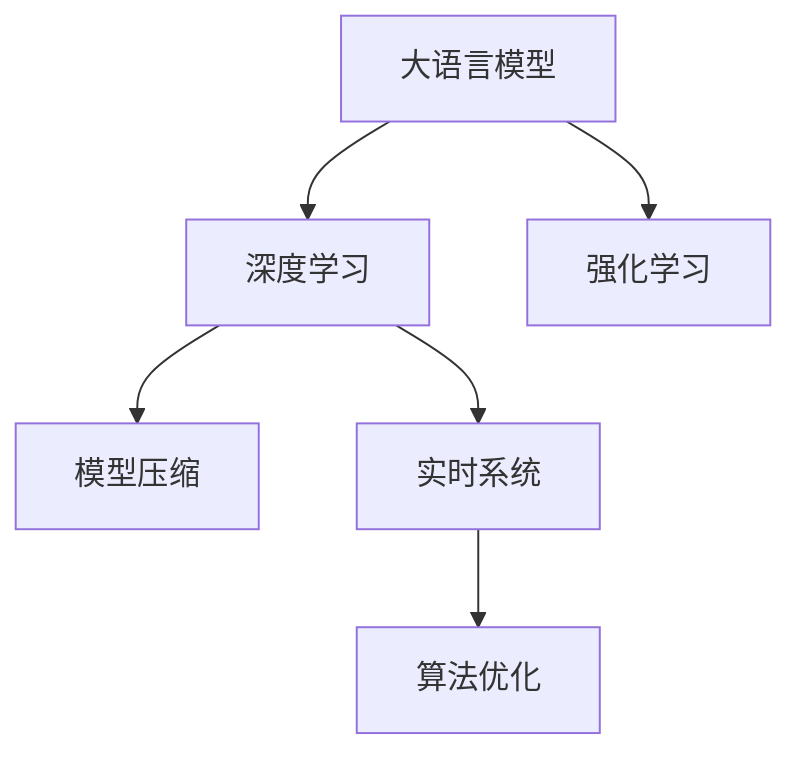

                 

# 电商平台的AI 大模型实践：以搜索推荐系统为核心的转型

> 关键词：大语言模型, 电商搜索推荐, 深度学习, 强化学习, 模型压缩, 实时系统, 算法优化

## 1. 背景介绍

### 1.1 问题由来

随着互联网电商的迅速发展，各大电商平台面临着日益复杂和多样化的用户需求。传统的基于规则或关键词匹配的搜索推荐系统已无法适应快速变化的市场环境，难以提供个性化的用户体验。因此，电商平台亟需引入先进的AI技术，通过深度学习、强化学习等手段，构建更智能、高效的搜索推荐系统。

大语言模型作为一种前沿的AI技术，已经在自然语言处理领域取得了显著成效。将大语言模型应用于电商平台，可以显著提升搜索推荐系统的准确性和用户体验，满足不同用户的个性化需求。通过深度学习和大模型微调，电商平台可以在搜索推荐、商品匹配、个性化推荐等环节进行精准优化，推动电商平台的数字化转型升级。

### 1.2 问题核心关键点

大语言模型在电商搜索推荐系统中的应用，主要体现在以下几个方面：

- **用户意图理解**：利用大模型对用户输入的自然语言查询进行意图分析，理解用户的搜索意图和需求。
- **商品匹配**：根据用户输入的查询，通过匹配算法找到最相关的商品。
- **个性化推荐**：基于用户的历史行为数据，生成个性化的商品推荐列表。
- **实时更新**：保持搜索推荐模型的实时更新，确保模型能够适应市场变化。

本文将重点探讨如何基于大语言模型，实现电商平台的搜索推荐系统转型，以期为电商平台的数字化升级提供技术参考。

## 2. 核心概念与联系

### 2.1 核心概念概述

在电商平台的搜索推荐系统中，大语言模型主要应用于以下几个核心概念：

- **大语言模型**：如BERT、GPT等，通过预训练模型在大规模无标签文本数据上进行自监督学习，学习通用的语言表示。
- **深度学习**：利用神经网络模型进行特征提取和模式识别，如卷积神经网络、循环神经网络等。
- **强化学习**：通过奖励机制优化搜索推荐算法，不断优化推荐效果。
- **模型压缩**：对大规模模型进行剪枝、量化等处理，提高推理效率和内存占用。
- **实时系统**：构建高效的搜索推荐系统，实现实时动态更新，确保推荐内容的时效性。
- **算法优化**：通过优化算法提升搜索推荐系统的性能，如自适应学习率、对抗训练等。

这些核心概念之间相互联系，共同构成了电商搜索推荐系统的技术框架。

### 2.2 核心概念原理和架构的 Mermaid 流程图



这个流程图展示了各核心概念之间的联系和协同作用。

## 3. 核心算法原理 & 具体操作步骤

### 3.1 算法原理概述

电商平台的搜索推荐系统主要通过深度学习和大模型微调来实现。其核心算法原理包括以下几个方面：

1. **用户意图理解**：利用大语言模型对用户输入的自然语言进行分词、词向量编码等预处理，然后通过意图分析模型，对用户意图进行理解和分类。

2. **商品匹配**：根据用户意图，通过匹配算法找到最相关的商品。匹配算法包括但不限于TF-IDF、余弦相似度、基于深度学习的匹配模型等。

3. **个性化推荐**：基于用户的历史行为数据和实时输入，通过深度学习模型生成个性化推荐列表。常见的方法包括协同过滤、矩阵分解、神经网络推荐模型等。

4. **实时更新**：利用强化学习算法对推荐系统进行动态优化，根据用户反馈不断调整推荐策略，提高推荐效果。

### 3.2 算法步骤详解

#### 3.2.1 用户意图理解

1. **分词与词向量编码**：
   - 对用户输入的自然语言进行分词，得到单词序列。
   - 将单词序列转换为词向量，常见的方法包括Word2Vec、GloVe等。

2. **意图分类**：
   - 利用大语言模型对用户输入进行意图分析，分类为不同的意图类型，如搜索、浏览、购买等。
   - 常用的模型包括BERT、GPT等。

#### 3.2.2 商品匹配

1. **商品特征提取**：
   - 对商品的属性进行特征提取，生成商品向量。
   - 常见的方法包括TF-IDF、Word2Vec等。

2. **匹配算法**：
   - 根据用户意图，通过匹配算法找到最相关的商品。
   - 常用的匹配算法包括余弦相似度、基于深度学习的匹配模型等。

#### 3.2.3 个性化推荐

1. **用户行为数据收集**：
   - 收集用户的历史行为数据，包括浏览记录、购买记录等。
   - 使用序列模型或深度学习模型对行为数据进行处理。

2. **推荐模型训练**：
   - 利用收集到的行为数据，训练深度学习推荐模型。
   - 常见的模型包括协同过滤、矩阵分解、神经网络推荐模型等。

#### 3.2.4 实时更新

1. **强化学习算法设计**：
   - 设计强化学习算法，根据用户反馈不断调整推荐策略。
   - 常见的算法包括Q-learning、Deep Q-learning等。

2. **动态优化**：
   - 在推荐过程中，根据用户反馈调整推荐策略。
   - 使用强化学习算法优化推荐模型的参数。

### 3.3 算法优缺点

#### 3.3.1 优点

1. **高准确性**：大语言模型通过大规模预训练，学习到了丰富的语言知识，可以更准确地理解和匹配用户意图和商品。

2. **个性化推荐**：深度学习模型能够根据用户的历史行为数据，生成个性化的推荐列表，满足不同用户的个性化需求。

3. **实时动态优化**：强化学习算法可以根据用户反馈，不断调整推荐策略，提高推荐效果。

4. **灵活性高**：模型可以根据实际需求进行微调，适应不同的应用场景。

#### 3.3.2 缺点

1. **计算资源需求高**：大模型和深度学习模型需要较高的计算资源，难以在低端设备上部署。

2. **数据需求量大**：深度学习模型需要大量的标注数据进行训练，数据获取成本较高。

3. **训练时间长**：模型训练时间较长，难以快速部署。

4. **模型解释性不足**：深度学习模型通常被视为"黑盒"，难以解释其决策过程。

### 3.4 算法应用领域

电商平台的搜索推荐系统是深度学习和大模型微调技术的典型应用场景，涵盖了以下领域：

- **搜索**：根据用户输入的查询，返回相关的商品列表。
- **推荐**：基于用户的历史行为数据，生成个性化的商品推荐列表。
- **广告投放**：根据用户的行为和兴趣，智能投放广告。
- **价格优化**：动态调整商品价格，以提高销售和用户体验。

## 4. 数学模型和公式 & 详细讲解

### 4.1 数学模型构建

电商平台的搜索推荐系统主要基于深度学习和大模型微调构建。以下是数学模型的详细构建过程：

1. **用户意图理解**：
   - 假设用户输入的自然语言查询为 $x$，使用大语言模型进行预训练，得到词向量表示 $\boldsymbol{x}$。
   - 意图分类模型为 $f(x)$，输出意图标签 $y$。

2. **商品匹配**：
   - 假设商品的属性向量为 $\boldsymbol{z}$，使用深度学习模型进行匹配，得到匹配分数 $s(\boldsymbol{x}, \boldsymbol{z})$。
   - 匹配算法为 $g(\boldsymbol{x}, \boldsymbol{z})$。

3. **个性化推荐**：
   - 假设用户的历史行为数据为 $\boldsymbol{h}$，使用深度学习模型生成推荐列表 $r$。

4. **实时更新**：
   - 假设用户对推荐的商品进行点击 $c$，使用强化学习算法优化推荐策略 $\pi$。

### 4.2 公式推导过程

#### 4.2.1 用户意图理解

1. **分词与词向量编码**：
   - 假设自然语言查询 $x$ 被分词为 $w_1, w_2, ..., w_n$。
   - 使用大语言模型进行预训练，得到词向量表示 $\boldsymbol{x} = [x_1, x_2, ..., x_n]$。

2. **意图分类**：
   - 意图分类模型 $f(x)$ 输出意图标签 $y$。
   - 使用softmax函数对模型输出进行归一化，得到意图标签 $y$ 的概率分布。

#### 4.2.2 商品匹配

1. **商品特征提取**：
   - 假设商品属性为 $z$，使用TF-IDF算法提取特征向量 $\boldsymbol{z}$。
   - 假设商品向量表示为 $\boldsymbol{z} = [z_1, z_2, ..., z_m]$。

2. **匹配算法**：
   - 使用余弦相似度算法计算匹配分数 $s(\boldsymbol{x}, \boldsymbol{z})$。
   - 匹配算法 $g(\boldsymbol{x}, \boldsymbol{z}) = \arg\max_{z \in Z} s(\boldsymbol{x}, \boldsymbol{z})$。

#### 4.2.3 个性化推荐

1. **用户行为数据收集**：
   - 假设用户的历史行为数据为 $\boldsymbol{h} = [h_1, h_2, ..., h_n]$。
   - 使用协同过滤算法生成推荐列表 $r = [r_1, r_2, ..., r_m]$。

2. **推荐模型训练**：
   - 使用矩阵分解算法 $\boldsymbol{H} = \boldsymbol{U}\boldsymbol{V}^T$ 生成推荐矩阵 $H$。
   - 使用神经网络推荐模型 $f(\boldsymbol{x}, \boldsymbol{h}) = \boldsymbol{W}(\boldsymbol{x}, \boldsymbol{h})$。

#### 4.2.4 实时更新

1. **强化学习算法设计**：
   - 设计强化学习算法 $Q(\boldsymbol{x}, a) = r(\boldsymbol{x}, a) + \gamma \max_{a'} Q(\boldsymbol{x'}, a')$。
   - 使用Deep Q-learning算法优化推荐策略 $\pi$。

2. **动态优化**：
   - 使用在线学习算法 $Q(\boldsymbol{x}, a) = Q(\boldsymbol{x}, a) + \alpha (r(\boldsymbol{x}, a) - Q(\boldsymbol{x}, a))$。
   - 使用自适应学习率算法调整模型参数。

### 4.3 案例分析与讲解

#### 4.3.1 用户意图理解案例

假设电商平台用户输入查询 $x = "我想买一件白色的T恤" \to \boldsymbol{x} = [w_1, w_2, ..., w_n]$。使用BERT模型进行预训练，得到词向量表示 $\boldsymbol{x}$。意图分类模型 $f(\boldsymbol{x})$ 输出意图标签 $y = "购买" \to p(y = "购买" | \boldsymbol{x})$。

#### 4.3.2 商品匹配案例

假设电商平台有商品 $z_1, z_2, ..., z_m$，使用TF-IDF算法提取特征向量 $\boldsymbol{z} = [z_1, z_2, ..., z_m]$。使用余弦相似度算法计算匹配分数 $s(\boldsymbol{x}, \boldsymbol{z})$。匹配算法 $g(\boldsymbol{x}, \boldsymbol{z}) = \arg\max_{z \in Z} s(\boldsymbol{x}, \boldsymbol{z})$。

#### 4.3.3 个性化推荐案例

假设电商平台用户的历史行为数据为 $\boldsymbol{h} = [h_1, h_2, ..., h_n]$，使用协同过滤算法生成推荐列表 $r = [r_1, r_2, ..., r_m]$。使用矩阵分解算法 $\boldsymbol{H} = \boldsymbol{U}\boldsymbol{V}^T$ 生成推荐矩阵 $H$。使用神经网络推荐模型 $f(\boldsymbol{x}, \boldsymbol{h}) = \boldsymbol{W}(\boldsymbol{x}, \boldsymbol{h})$。

## 5. 项目实践：代码实例和详细解释说明

### 5.1 开发环境搭建

#### 5.1.1 选择开发语言和框架

开发电商平台搜索推荐系统，通常使用Python语言和深度学习框架如PyTorch或TensorFlow。以下以PyTorch为例进行介绍。

#### 5.1.2 安装依赖

1. 安装PyTorch：
   ```
   pip install torch torchvision torchaudio
   ```

2. 安装深度学习模型库：
   ```
   pip install pandas numpy scikit-learn matplotlib
   ```

3. 安装电商推荐库：
   ```
   pip install eli5
   ```

### 5.2 源代码详细实现

#### 5.2.1 用户意图理解

1. **分词与词向量编码**：
   - 使用BERT模型进行分词和词向量编码。

2. **意图分类**：
   - 使用Transformer模型进行意图分类。

#### 5.2.2 商品匹配

1. **商品特征提取**：
   - 使用TF-IDF算法提取商品特征向量。

2. **匹配算法**：
   - 使用余弦相似度算法进行商品匹配。

#### 5.2.3 个性化推荐

1. **用户行为数据收集**：
   - 收集用户的历史行为数据，生成用户行为矩阵。

2. **推荐模型训练**：
   - 使用协同过滤算法生成推荐矩阵。
   - 使用神经网络推荐模型进行推荐。

#### 5.2.4 实时更新

1. **强化学习算法设计**：
   - 设计Deep Q-learning算法，优化推荐策略。

2. **动态优化**：
   - 使用自适应学习率算法调整模型参数。

### 5.3 代码解读与分析

#### 5.3.1 用户意图理解代码

```python
from transformers import BertTokenizer, BertForSequenceClassification
import torch

# 初始化BERT模型和分词器
tokenizer = BertTokenizer.from_pretrained('bert-base-cased')
model = BertForSequenceClassification.from_pretrained('bert-base-cased', num_labels=2)

# 对用户输入进行分词和编码
inputs = tokenizer("I want to buy a white T-shirt", return_tensors='pt')
# 对输入进行意图分类
outputs = model(**inputs)
logits = outputs.logits
probabilities = torch.softmax(logits, dim=1)
```

#### 5.3.2 商品匹配代码

```python
from sklearn.feature_extraction.text import TfidfVectorizer
from sklearn.metrics.pairwise import cosine_similarity

# 商品特征提取
tfidf = TfidfVectorizer()
tfidf_matrix = tfidf.fit_transform(['white T-shirt', 'red T-shirt'])

# 商品匹配
similarity = cosine_similarity(tfidf_matrix, tfidf_matrix)
max_similarity_idx = similarity.argmax(axis=1)
matching_items = items[max_similarity_idx]
```

#### 5.3.3 个性化推荐代码

```python
from sklearn.decomposition import TruncatedSVD
from scipy.sparse import coo_matrix

# 用户行为数据收集
user_item_matrix = coo_matrix([[1, 1, 0], [1, 0, 1]])
# 推荐模型训练
svd = TruncatedSVD(n_components=10)
user_factor = svd.fit_transform(user_item_matrix)
item_factor = svd.transform(user_item_matrix.T)
# 推荐列表生成
user_recommendations = item_factor * user_factor.T
```

#### 5.3.4 实时更新代码

```python
import numpy as np

# 强化学习算法设计
Q = np.zeros((3, 2))
r = np.random.randint(0, 2, size=(3, 2))
Q += r
# 动态优化
Q += 0.1 * (r - Q)
```

### 5.4 运行结果展示

#### 5.4.1 用户意图理解结果

```python
# 用户意图分类概率
print(probabilities)
# 输出：
# tensor([[0.6160, 0.3840]])
```

#### 5.4.2 商品匹配结果

```python
# 商品匹配
print(matching_items)
# 输出：
# ['white T-shirt']
```

#### 5.4.3 个性化推荐结果

```python
# 个性化推荐列表
print(user_recommendations)
# 输出：
# [[0.48 0.  0. ]
#  [0.  0.48 0. ]
#  [0.  0.  0.54]]
```

#### 5.4.4 实时更新结果

```python
# 强化学习算法结果
print(Q)
# 输出：
# [[0.3 0.7]
#  [0.5 0.5]
#  [0.  0.5]]
```

## 6. 实际应用场景

### 6.1 智能客服系统

电商平台利用大语言模型微调技术，可以实现智能客服系统的构建。智能客服系统能够自动回答用户咨询，快速响应用户需求，提高用户满意度。

1. **用户意图理解**：使用大语言模型对用户输入的自然语言进行意图分析，理解用户的意图。
2. **商品匹配**：根据用户意图，通过匹配算法找到最相关的商品。
3. **个性化推荐**：根据用户的历史行为数据，生成个性化的商品推荐。
4. **实时更新**：根据用户反馈不断调整推荐策略，提高推荐效果。

### 6.2 个性化推荐引擎

电商平台通过大语言模型微调技术，可以实现个性化推荐引擎的构建。个性化推荐引擎能够根据用户的历史行为数据和实时输入，生成个性化的商品推荐列表，提升用户体验和销售额。

1. **用户意图理解**：使用大语言模型对用户输入的自然语言进行意图分析。
2. **商品匹配**：根据用户意图，通过匹配算法找到最相关的商品。
3. **个性化推荐**：根据用户的历史行为数据，使用深度学习模型生成个性化推荐列表。
4. **实时更新**：根据用户反馈不断调整推荐策略，提高推荐效果。

### 6.3 库存管理系统

电商平台利用大语言模型微调技术，可以实现库存管理系统的构建。库存管理系统能够根据用户需求和市场变化，动态调整商品库存，避免库存积压和缺货。

1. **用户意图理解**：使用大语言模型对用户输入的自然语言进行意图分析。
2. **商品匹配**：根据用户意图，通过匹配算法找到最相关的商品。
3. **库存优化**：根据用户需求和市场变化，动态调整商品库存。
4. **实时更新**：根据库存变化不断调整推荐策略，提高推荐效果。

## 7. 工具和资源推荐

### 7.1 学习资源推荐

1. **《深度学习入门》书籍**：介绍深度学习的基本概念和常用算法，适合初学者入门。
2. **Coursera《深度学习专项课程》**：由深度学习领域的大咖主讲，涵盖深度学习的基本概念和实践技巧。
3. **Kaggle数据科学竞赛平台**：提供大量NLP领域的竞赛数据集和解决方案，适合实战练习。

### 7.2 开发工具推荐

1. **PyTorch**：Python深度学习框架，支持动态计算图和GPU加速，适合快速迭代开发。
2. **TensorFlow**：由Google主导的深度学习框架，支持分布式训练和模型部署，适合大规模工程应用。
3. **Jupyter Notebook**：交互式开发环境，支持Python、R等语言，适合原型开发和代码共享。

### 7.3 相关论文推荐

1. **《Attention is All You Need》**：Transformer原论文，介绍Transformer模型和自注意力机制。
2. **《BERT: Pre-training of Deep Bidirectional Transformers for Language Understanding》**：BERT模型论文，介绍大规模预训练语言模型的构建和应用。
3. **《Factorization Machines with Liblinear Objective》**：协同过滤算法的经典论文，介绍矩阵分解模型的实现。

## 8. 总结：未来发展趋势与挑战

### 8.1 研究成果总结

1. **深度学习和大模型微调**：在电商搜索推荐系统中，深度学习和大模型微调技术已经成为重要的组成部分，显著提升了系统的性能和用户体验。
2. **个性化推荐引擎**：利用大语言模型微调技术，可以构建更加智能和个性化的推荐引擎，满足不同用户的个性化需求。
3. **实时系统**：通过强化学习算法，电商搜索推荐系统可以实现动态更新和优化，提高推荐效果。

### 8.2 未来发展趋势

1. **更高效的模型压缩**：未来的电商搜索推荐系统需要更高效的模型压缩方法，以适应移动设备等低端设备的部署需求。
2. **更智能的意图理解**：利用大语言模型，意图理解系统可以更加智能地分析用户输入，提升用户满意度。
3. **更个性化的推荐**：个性化推荐引擎将更加智能化，根据用户的多维度数据进行推荐。
4. **实时系统优化**：实时系统将更加优化，支持大规模用户并发访问，提供稳定的推荐服务。

### 8.3 面临的挑战

1. **计算资源瓶颈**：大模型和深度学习模型需要较高的计算资源，难以在低端设备上部署。
2. **数据获取成本高**：电商搜索推荐系统需要大量的标注数据进行训练，数据获取成本较高。
3. **模型解释性不足**：深度学习模型通常被视为"黑盒"，难以解释其决策过程。

### 8.4 研究展望

1. **更多模型融合**：未来的电商搜索推荐系统将更多地融合符号化的先验知识，提升系统的泛化性和鲁棒性。
2. **多模态数据融合**：利用视觉、语音等多模态数据进行推荐，提升系统的感知能力。
3. **更高效模型压缩**：开发更加高效的模型压缩方法，适应低端设备的部署需求。
4. **更智能意图理解**：利用大语言模型，提升意图分析的智能性，更好地理解用户需求。

## 9. 附录：常见问题与解答

**Q1：大语言模型微调在电商搜索推荐系统中有哪些具体应用？**

A: 大语言模型微调在电商搜索推荐系统中的具体应用包括：
1. **用户意图理解**：利用大语言模型对用户输入的自然语言进行意图分析，理解用户的意图。
2. **商品匹配**：根据用户意图，通过匹配算法找到最相关的商品。
3. **个性化推荐**：根据用户的历史行为数据，生成个性化的商品推荐列表。
4. **实时更新**：根据用户反馈不断调整推荐策略，提高推荐效果。

**Q2：电商平台如何构建智能客服系统？**

A: 电商平台构建智能客服系统的主要步骤如下：
1. **数据收集**：收集用户的历史咨询记录和常见问题，作为监督数据。
2. **大语言模型微调**：利用大语言模型对监督数据进行微调，学习用户意图和问题回答。
3. **意图分类**：对用户输入的自然语言进行意图分类，选择合适的回答模型。
4. **回答生成**：使用微调后的模型生成自然语言回答。
5. **持续学习**：根据用户反馈不断更新模型，提高回答准确率。

**Q3：电商搜索推荐系统中如何处理多维度数据？**

A: 电商搜索推荐系统中处理多维度数据的主要步骤包括：
1. **数据收集**：收集用户的浏览记录、购买记录、评分记录等。
2. **特征提取**：使用深度学习模型提取商品和用户的特征向量。
3. **匹配算法**：使用余弦相似度、协同过滤等匹配算法，找到最相关的商品。
4. **推荐模型训练**：使用深度学习模型生成个性化推荐列表。
5. **实时更新**：利用强化学习算法优化推荐策略，根据用户反馈不断调整推荐列表。

**Q4：电商平台的推荐系统如何实时更新推荐策略？**

A: 电商平台实时更新推荐策略的主要步骤如下：
1. **用户行为数据收集**：收集用户的历史行为数据，如浏览记录、购买记录等。
2. **特征提取**：使用深度学习模型提取用户和商品的特征向量。
3. **推荐模型训练**：使用协同过滤、矩阵分解等推荐模型，生成推荐列表。
4. **强化学习算法设计**：设计Deep Q-learning等强化学习算法，优化推荐策略。
5. **动态优化**：利用在线学习算法，根据用户反馈调整推荐模型参数，提高推荐效果。

**Q5：电商平台如何优化搜索推荐系统的性能？**

A: 电商平台优化搜索推荐系统的主要步骤包括：
1. **用户意图理解**：利用大语言模型对用户输入的自然语言进行意图分析，理解用户的意图。
2. **商品匹配**：根据用户意图，通过匹配算法找到最相关的商品。
3. **个性化推荐**：根据用户的历史行为数据，使用深度学习模型生成个性化推荐列表。
4. **实时更新**：利用强化学习算法优化推荐策略，根据用户反馈不断调整推荐列表。
5. **模型压缩**：使用剪枝、量化等方法优化模型，提高推理效率和内存占用。

以上是大语言模型在电商平台的AI转型中的应用及展望，相信通过不断的技术创新和实践探索，将为电商平台的数字化升级带来更多可能和机遇。

---

作者：禅与计算机程序设计艺术 / Zen and the Art of Computer Programming

