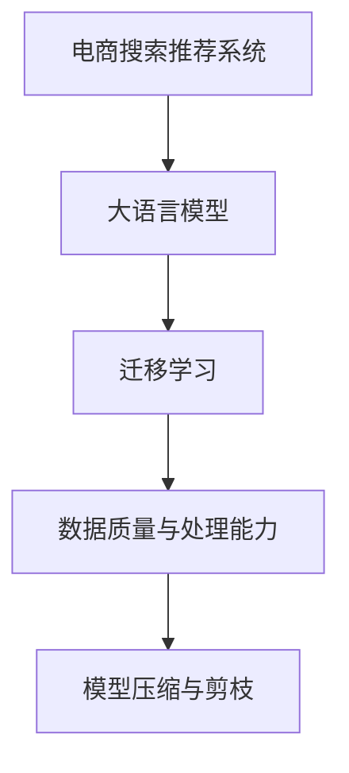

                 

# 电商平台的AI 大模型战略：搜索推荐系统是核心，数据质量与处理能力

## 1. 背景介绍

在数字化浪潮的推动下，电商平台已成为了全球主要的零售渠道。一方面，电商平台依靠强大的用户基础和丰富的产品库，赢得了市场竞争优势；另一方面，随着线上竞争日益激烈，如何通过技术手段，提升用户体验，增加客户黏性，已成为电商平台亟需解决的问题。

人工智能（AI）技术，尤其是大语言模型（LLM）和深度学习模型，为电商平台的转型升级提供了新的可能。利用这些技术，电商平台不仅可以优化产品搜索推荐算法，提升用户体验，还可以降低运营成本，实现精准营销。

## 2. 核心概念与联系

### 2.1 核心概念概述

为更好地理解电商平台在AI技术上的应用，本节将介绍几个关键概念：

- **电商搜索推荐系统**：利用自然语言处理、推荐系统等技术，为用户提供个性化的商品推荐和搜索结果。
- **大语言模型（LLM）**：基于深度学习，通过大规模数据预训练，具有强大的自然语言理解和生成能力。
- **迁移学习**：将一个领域学到的知识，迁移应用到另一个相关领域的学习范式。
- **数据质量与处理能力**：高质量的数据是大模型应用的前提，而数据处理能力则决定了大模型的训练效率和性能。
- **模型压缩与剪枝**：在大模型训练过程中，通过去除冗余参数，降低模型复杂度，提升计算效率。

这些核心概念共同构成了电商平台的AI战略基础。通过理解这些概念，我们可以更好地把握电商平台应用AI技术的方向和方法。

### 2.2 核心概念原理和架构的 Mermaid 流程图(Mermaid 流程节点中不要有括号、逗号等特殊字符)



该流程图展示了电商平台的AI应用架构，从搜索推荐系统出发，通过大语言模型的预训练和微调，应用迁移学习来适配特定业务场景，最终利用数据质量和处理能力，提升模型训练效率，并进行模型压缩与剪枝以优化计算资源。

## 3. 核心算法原理 & 具体操作步骤

### 3.1 算法原理概述

电商平台的核心算法为搜索推荐系统，旨在通过分析用户行为和商品属性，为用户推荐最相关的商品，并提供搜索结果。大语言模型在该系统中主要承担以下两个角色：

1. **预训练**：通过大规模无标签文本数据进行预训练，学习通用语言表示。
2. **微调**：在特定电商场景下进行微调，学习任务特定的知识，以提升搜索推荐的效果。

### 3.2 算法步骤详解

1. **数据准备**：收集电商平台的销售数据、用户行为数据、商品属性数据等，并进行数据清洗和标注。
   
2. **预训练**：使用大语言模型（如BERT、GPT等）在通用文本数据上预训练，学习语言知识。
   
3. **微调**：在电商数据集上微调大语言模型，学习商品描述、用户行为、商品类别等任务相关的知识。
   
4. **评估与优化**：在验证集上评估微调后的模型效果，根据评估结果调整超参数，优化模型性能。
   
5. **部署与应用**：将优化后的模型部署到实际应用中，用于搜索推荐等业务场景。

### 3.3 算法优缺点

#### 优点：

- **提升推荐准确性**：大语言模型具备强大的语言理解能力，可以准确地分析和理解用户需求，提升推荐准确性。
- **泛化能力强**：预训练模型能够学习通用的语言表示，适用于不同的电商业务场景。
- **灵活性高**：通过微调可以针对特定任务进行优化，适应电商平台的个性化需求。

#### 缺点：

- **数据依赖**：高质量的数据是大模型应用的前提，电商数据可能存在噪声和偏差，影响模型效果。
- **计算资源要求高**：大模型训练和微调需要大量的计算资源，包括GPU、TPU等硬件设备。
- **模型复杂度**：大规模预训练模型的参数数量庞大，可能导致计算效率低下。

### 3.4 算法应用领域

大语言模型在电商平台的搜索推荐系统中主要应用于以下场景：

- **商品搜索**：通过输入搜索关键词，大语言模型可以理解用户意图，返回相关的搜索结果。
- **商品推荐**：根据用户浏览和购买历史，大语言模型可以生成个性化推荐列表。
- **客户服务**：通过自然语言交互，大语言模型可以回答用户问题，提供产品信息。

## 4. 数学模型和公式 & 详细讲解 & 举例说明

### 4.1 数学模型构建

假设电商平台上有一个用户$u$，购买历史为$I_u$，浏览历史为$B_u$，评分历史为$R_u$。

模型构建如下：

1. **用户表示**：将用户$u$的特征向量表示为$\mathbf{u}$，包含用户的购买历史、浏览历史、评分历史等信息。
2. **商品表示**：将商品$v$的特征向量表示为$\mathbf{v}$，包含商品的属性、用户评价等信息。
3. **相似度计算**：计算用户$u$和商品$v$的相似度$\mathbf{u}^\top\mathbf{v}$。
4. **评分预测**：使用评分模型$y=\mathbf{u}^\top\mathbf{v}$预测用户$u$对商品$v$的评分。

### 4.2 公式推导过程

**评分预测模型**

假设评分模型为线性回归模型，则评分预测公式为：

$$
y = \mathbf{u}^\top\mathbf{v}
$$

其中$\mathbf{u}$和$\mathbf{v}$分别表示用户和商品的特征向量。

**相似度计算**

假设用户$u$和商品$v$的特征向量分别为$\mathbf{u}$和$\mathbf{v}$，则用户与商品间的相似度为：

$$
\text{similarity} = \mathbf{u}^\top\mathbf{v}
$$

**推荐列表生成**

假设用户$u$的浏览历史为$B_u=\{v_1, v_2, ..., v_n\}$，则用户$u$的推荐列表为$R_u=\{v_1, v_2, ..., v_n\}$。

### 4.3 案例分析与讲解

**示例1：商品搜索**

用户输入关键词“智能手表”，大语言模型通过预训练学习到“智能手表”的语义表示，将其转化为向量$\mathbf{w}$。然后，在电商平台上查询所有包含关键词“智能手表”的商品，并计算其与向量$\mathbf{w}$的相似度$\text{similarity}$。最终，根据相似度排序，返回相似度最高的商品列表。

**示例2：商品推荐**

用户在电商平台上浏览某商品$v$，大语言模型通过预训练学习到商品$v$的语义表示$\mathbf{v}$，并将其与用户$u$的特征向量$\mathbf{u}$进行相似度计算。根据相似度，计算用户$u$对商品$v$的评分预测值，并将其加入推荐列表中。

## 5. 项目实践：代码实例和详细解释说明

### 5.1 开发环境搭建

1. **安装Python**：安装最新版本的Python 3.x，建议使用Anaconda进行环境管理。
2. **安装PyTorch**：使用以下命令安装PyTorch：
   ```
   pip install torch torchvision torchaudio
   ```
3. **安装TensorBoard**：用于可视化模型训练过程，命令如下：
   ```
   pip install tensorboard
   ```

### 5.2 源代码详细实现

以下是一个简单的电商搜索推荐系统的实现示例：

```python
import torch
import torch.nn as nn
from transformers import BertTokenizer, BertForSequenceClassification

# 定义模型结构
class SearchRecommendationModel(nn.Module):
    def __init__(self, num_labels):
        super(SearchRecommendationModel, self).__init__()
        self.bert = BertForSequenceClassification.from_pretrained('bert-base-cased', num_labels=num_labels)
        self.fc = nn.Linear(768, 1)
        
    def forward(self, input_ids, attention_mask, labels=None):
        output = self.bert(input_ids=input_ids, attention_mask=attention_mask)
        output = output[0]
        logits = self.fc(output)
        if labels is not None:
            loss = nn.BCEWithLogitsLoss()(logits, labels)
            return loss
        else:
            return logits

# 定义训练函数
def train_epoch(model, data_loader, optimizer, device):
    model.train()
    total_loss = 0
    for batch in data_loader:
        input_ids = batch['input_ids'].to(device)
        attention_mask = batch['attention_mask'].to(device)
        labels = batch['labels'].to(device)
        optimizer.zero_grad()
        loss = model(input_ids, attention_mask, labels=labels)
        loss.backward()
        optimizer.step()
        total_loss += loss.item()
    return total_loss / len(data_loader)

# 训练模型
model = SearchRecommendationModel(num_labels=1)
optimizer = torch.optim.Adam(model.parameters(), lr=2e-5)

device = torch.device('cuda') if torch.cuda.is_available() else torch.device('cpu')
model.to(device)

# 加载数据集
train_data = ...
train_loader = ...

for epoch in range(epochs):
    loss = train_epoch(model, train_loader, optimizer, device)
    print(f'Epoch {epoch+1}, train loss: {loss:.3f}')

# 评估模型
test_data = ...
test_loader = ...
model.eval()
with torch.no_grad():
    for batch in test_loader:
        input_ids = batch['input_ids'].to(device)
        attention_mask = batch['attention_mask'].to(device)
        labels = batch['labels'].to(device)
        output = model(input_ids, attention_mask)
        print(output)
```

### 5.3 代码解读与分析

**模型定义**：
- 使用BertForSequenceClassification作为基础模型。
- 定义一个全连接层，用于输出评分预测结果。

**训练函数**：
- 将模型移至指定设备，并进行前向传播计算损失。
- 反向传播更新模型参数，并返回平均损失。

**训练过程**：
- 循环迭代训练，并在每个epoch后输出平均损失。

### 5.4 运行结果展示

在训练完成后，可以在测试集上评估模型的性能。

```python
test_loader = ...
model.eval()
with torch.no_grad():
    for batch in test_loader:
        input_ids = batch['input_ids'].to(device)
        attention_mask = batch['attention_mask'].to(device)
        labels = batch['labels'].to(device)
        output = model(input_ids, attention_mask)
        print(output)
```

以上代码展示了如何使用大语言模型进行电商搜索推荐系统的开发。通过预训练和微调，模型能够在实际应用中发挥强大的效果。

## 6. 实际应用场景

### 6.1 智能客服

大语言模型可以应用于电商平台的智能客服，通过自然语言处理技术，回答用户问题，提供产品信息，提升用户体验。

**实现过程**：
1. 收集用户咨询的历史记录，标注问题与答案。
2. 使用大语言模型在标注数据上进行预训练，学习语言表示。
3. 在特定电商场景下微调模型，学习电商领域的常见问题和答案。
4. 部署模型到客服系统，实时回答用户咨询。

**效果**：
- 显著提升客服响应速度，减少用户等待时间。
- 提供一致性、标准化的服务，提升客户满意度。

### 6.2 个性化推荐

大语言模型可以用于电商平台的个性化推荐系统，根据用户行为和偏好，提供个性化商品推荐，提升销售转化率。

**实现过程**：
1. 收集用户浏览、点击、购买历史，提取商品特征。
2. 使用大语言模型在电商数据集上进行预训练，学习商品描述、用户行为等知识。
3. 在特定电商场景下微调模型，学习用户对商品的评分和偏好。
4. 部署模型到推荐系统，实时生成个性化推荐列表。

**效果**：
- 提高推荐准确性，增加用户购买率。
- 提升用户体验，增加平台黏性。

### 6.3 市场预测

大语言模型可以应用于电商平台的市场预测，通过分析市场数据，预测销售趋势，辅助决策。

**实现过程**：
1. 收集市场数据，包括销售数据、用户行为数据、商品属性数据等。
2. 使用大语言模型在市场数据上进行预训练，学习市场知识。
3. 在特定电商场景下微调模型，学习市场趋势和季节性变化。
4. 部署模型到预测系统，实时生成市场预测结果。

**效果**：
- 准确预测销售趋势，优化库存管理。
- 提供决策支持，提升运营效率。

## 7. 工具和资源推荐

### 7.1 学习资源推荐

1. **《深度学习入门》**：介绍深度学习基础知识，适合初学者。
2. **《自然语言处理综论》**：涵盖NLP理论和技术，深入浅出。
3. **《Transformers论文集》**：了解大语言模型的最新研究进展。
4. **《电商数据分析实战》**：结合电商业务，讲解数据分析方法和技巧。

### 7.2 开发工具推荐

1. **PyTorch**：深度学习框架，支持动态计算图，适合快速迭代研究。
2. **TensorFlow**：深度学习框架，支持分布式计算，适合大规模工程应用。
3. **HuggingFace Transformers库**：提供丰富的预训练模型和微调接口，简化开发过程。
4. **TensorBoard**：可视化工具，实时监测模型训练状态。

### 7.3 相关论文推荐

1. **《BERT: Pre-training of Deep Bidirectional Transformers for Language Understanding》**：提出BERT模型，改变NLP预训练范式。
2. **《AdaLoRA: Adaptive Low-Rank Adaptation for Parameter-Efficient Fine-Tuning》**：提出AdaLoRA方法，提高微调效率。
3. **《AdaRec: Adaptive Recommender Model for Streaming Data》**：提出AdaRec模型，优化推荐算法。

## 8. 总结：未来发展趋势与挑战

### 8.1 总结

本文对电商平台在大模型应用中，特别是搜索推荐系统的核心技术和实现方法进行了系统介绍。通过分析电商平台的AI战略，可以看出，大语言模型在该系统中发挥了重要作用，通过预训练和微调，提升了搜索推荐的效果。

### 8.2 未来发展趋势

未来，电商平台在AI技术应用上将呈现以下几个趋势：

1. **实时计算与预测**：利用大数据和实时计算技术，提供动态推荐和市场预测，满足用户实时需求。
2. **多模态融合**：结合视觉、音频等多模态数据，提升商品推荐和搜索精度。
3. **个性化推荐**：通过用户画像和行为数据，实现更精准的个性化推荐，提升用户体验。
4. **自动化运营**：利用自动化技术，优化电商平台的运营效率，降低人工成本。

### 8.3 面临的挑战

尽管电商平台的AI技术应用取得了显著进展，但在未来发展过程中，仍面临诸多挑战：

1. **数据质量**：电商平台的数据质量问题，如噪声、偏差等，影响模型效果。
2. **计算资源**：大模型训练和微调需要大量计算资源，可能面临硬件瓶颈。
3. **隐私保护**：电商平台的业务涉及用户隐私，如何保护用户数据，确保隐私安全，仍需进一步探索。

### 8.4 研究展望

为应对上述挑战，未来研究需要在以下几个方向寻求突破：

1. **数据增强与处理**：开发高质量的数据增强方法，提升数据质量，降低噪声和偏差。
2. **计算效率优化**：优化模型结构，采用分布式计算等技术，提升计算效率。
3. **隐私保护技术**：利用差分隐私、联邦学习等技术，保护用户隐私。

## 9. 附录：常见问题与解答

**Q1: 如何提高电商平台的搜索推荐效果？**

A: 提高搜索推荐效果，可以从以下几个方面入手：
1. 收集高质量的用户数据和商品数据，优化数据质量。
2. 使用大语言模型进行预训练和微调，学习商品描述、用户行为等知识。
3. 应用推荐算法，如协同过滤、基于内容的推荐等，提升推荐精度。

**Q2: 电商平台的个性化推荐有哪些实现方法？**

A: 电商平台的个性化推荐，主要依赖于以下几个方法：
1. 协同过滤推荐：通过用户行为数据，推荐与用户历史行为相似的商品。
2. 基于内容的推荐：根据商品属性和用户偏好，推荐符合用户喜好的商品。
3. 混合推荐：结合多种推荐方法，提升推荐效果。

**Q3: 电商平台的数据处理有哪些常见问题？**

A: 电商平台的数据处理常见问题包括：
1. 数据清洗：去除噪声、缺失值等。
2. 特征工程：提取和构建有用的特征，提高模型效果。
3. 数据增强：通过数据生成技术，扩充训练集。

**Q4: 电商平台的AI技术应用有哪些挑战？**

A: 电商平台的AI技术应用面临以下挑战：
1. 数据质量问题：电商数据可能存在噪声和偏差。
2. 计算资源限制：大模型训练和微调需要大量计算资源。
3. 隐私保护：电商平台涉及用户隐私，需保护用户数据。

**Q5: 如何优化电商平台的推荐算法？**

A: 电商平台的推荐算法优化可以从以下几个方面入手：
1. 引入多模态数据：结合图像、音频等多模态信息，提升推荐效果。
2. 优化模型结构：采用深度学习模型，提高推荐准确性。
3. 实时计算与预测：利用大数据和实时计算技术，提供动态推荐。

作者：禅与计算机程序设计艺术 / Zen and the Art of Computer Programming

