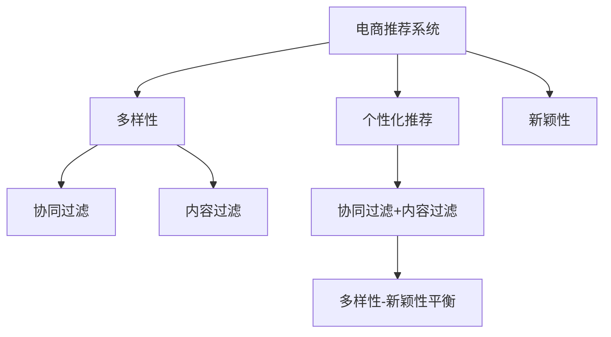

                 

# 电商推荐系统中的多样性与新颖性平衡策略

## 1. 背景介绍

随着电商市场的日益繁荣，用户对推荐系统的个性化体验需求日益增长。然而，过度个性化推荐容易陷入“信息茧房”，用户难以接触到新鲜和多样化的信息。如何在个性化推荐中平衡多样性和新颖性，成为电商推荐系统的核心问题之一。本文将从核心概念、算法原理、实践技巧、实际应用等多个角度，深入探讨电商推荐系统中多样性与新颖性平衡的策略。

## 2. 核心概念与联系

### 2.1 核心概念概述

为了更好地理解电商推荐系统中的多样性与新颖性平衡策略，本节将介绍几个关键概念：

- **电商推荐系统**：基于用户历史行为和偏好，通过机器学习模型推荐商品或内容的系统。其主要目标是为用户提供满足个性化需求的商品或内容推荐。

- **个性化推荐**：根据用户的历史行为、兴趣偏好、评分等信息，推荐其可能感兴趣的商品或内容。

- **多样性**：在推荐结果中包含多种不同类别的商品或内容，减少“信息茧房”的风险。

- **新颖性**：推荐用户未接触过的商品或内容，避免用户只看到已熟悉的推荐。

- **多样性-新颖性平衡**：在个性化推荐中，找到多样性和新颖性之间的最佳平衡点，既满足用户的个性化需求，又使其接触到新鲜和多样化的信息。

- **协同过滤**：利用用户之间的相似性，通过观察用户历史行为来推荐商品或内容。包括基于用户的协同过滤和基于物品的协同过滤两种方式。

- **内容过滤**：直接根据用户历史行为对商品或内容的属性进行建模，进行推荐。

这些核心概念之间的逻辑关系可以通过以下Mermaid流程图来展示：



这个流程图展示了他推荐系统的核心概念及其之间的关系：

1. 电商推荐系统通过协同过滤和内容过滤两种方式，获取用户历史行为信息。
2. 个性化推荐根据这些信息，提供用户可能感兴趣的商品或内容。
3. 多样性和新颖性分别从不同角度，优化推荐结果，减少“信息茧房”，提高新鲜度。
4. 多样性-新颖性平衡，通过协同过滤和内容过滤的结合，实现两者之间的平衡。

## 3. 核心算法原理 & 具体操作步骤

### 3.1 算法原理概述

电商推荐系统中的多样性与新颖性平衡策略，主要依赖于协同过滤和内容过滤的结合。具体来说，推荐系统通过用户行为数据，学习用户与物品之间的关系，然后根据用户的历史行为和兴趣，推荐多样性和新颖性的商品或内容。

形式化地，假设推荐系统包含 $U$ 个用户和 $I$ 个商品，用户与商品之间的关系矩阵为 $R$，用户历史行为数据为 $H$。推荐系统的目标是通过最小化 $H$ 与 $R$ 之间的距离，最大化推荐结果的多样性和新颖性。

### 3.2 算法步骤详解

基于协同过滤和内容过滤的电商推荐系统，一般包括以下几个关键步骤：

**Step 1: 数据收集与预处理**
- 收集用户历史行为数据，如浏览记录、购买记录、评分记录等。
- 清洗数据，去除噪声和缺失值，保证数据的质量和完整性。
- 将用户行为数据转化为模型可用的形式，如用户-商品评分矩阵 $R$。

**Step 2: 协同过滤推荐**
- 利用用户-商品评分矩阵 $R$，计算用户 $u$ 与商品 $i$ 之间的相似度 $s(u,i)$。
- 根据相似度 $s(u,i)$，计算用户 $u$ 的邻居用户 $u'$，并根据邻居用户的评分预测用户 $u$ 对商品 $i$ 的评分 $\hat{r}(u,i)$。
- 基于预测评分 $\hat{r}(u,i)$，对用户 $u$ 的推荐列表进行排序，生成个性化推荐。

**Step 3: 内容过滤推荐**
- 提取商品或内容的属性特征，构建商品或内容表示向量。
- 利用用户历史行为数据 $H$，对商品或内容的表示向量进行编码，得到用户 $u$ 对商品 $i$ 的隐式评分 $p(u,i)$。
- 结合协同过滤和内容过滤的结果，对推荐列表进行加权组合，生成最终推荐。

**Step 4: 多样性与新颖性调整**
- 对推荐列表进行多样性调整，增加不同类别的商品或内容。
- 对推荐列表进行新颖性调整，引入用户未接触过的商品或内容。
- 结合多样性和新颖性调整后的推荐结果，进行综合排序，生成最终推荐。

**Step 5: 推荐系统评估**
- 在验证集上评估推荐系统的性能，如准确率、召回率、覆盖率等指标。
- 对推荐系统进行优化调整，如调整超参数、引入负采样等。
- 持续收集用户反馈，进行模型迭代和优化。

以上是基于协同过滤和内容过滤的电商推荐系统的一般流程。在实际应用中，还需要针对具体任务的特点，对协同过滤和内容过滤的权重进行优化设计，以进一步提升推荐效果。

### 3.3 算法优缺点

基于协同过滤和内容过滤的电商推荐系统具有以下优点：
1. 简单易用：协同过滤和内容过滤方法简单高效，适用于各种电商推荐场景。
2. 灵活性高：可以根据不同任务的需求，灵活设计协同过滤和内容过滤的权重和算法。
3. 效果显著：在电商推荐系统中，协同过滤和内容过滤的结合，取得了显著的推荐效果。

同时，该方法也存在一定的局限性：
1. 数据依赖性强：协同过滤和内容过滤的准确性依赖于用户行为数据的质量和数量。
2. 冷启动问题：新用户或新商品的评分难以获取，导致推荐效果不佳。
3. 多样性可能不足：协同过滤容易产生“信息茧房”，多样性调整难度较大。
4. 新颖性可能不足：内容过滤容易推荐用户熟悉的内容，新颖性调整难度较大。

尽管存在这些局限性，但就目前而言，基于协同过滤和内容过滤的推荐方法仍是电商推荐系统的核心技术之一。未来相关研究的重点在于如何进一步降低推荐对数据量的依赖，提高推荐的多样性和新颖性，同时兼顾可解释性和用户体验。

### 3.4 算法应用领域

基于协同过滤和内容过滤的电商推荐系统，已经在电商领域得到了广泛的应用，覆盖了几乎所有常见推荐任务，例如：

- 商品推荐：如淘宝、京东等电商平台上的商品推荐系统。通过分析用户历史购买记录和浏览行为，为用户推荐可能感兴趣的商品。
- 内容推荐：如YouTube、Netflix等流媒体平台的个性化内容推荐。通过分析用户对视频、电影的评分和观看历史，为用户推荐相关内容。
- 购物车推荐：如阿里巴巴的“你可能还喜欢”推荐模块。通过分析用户购物车中的商品，为用户推荐搭配商品或同类商品。
- 动态定价：如亚马逊的动态定价策略。通过分析用户购买历史和市场价格趋势，动态调整商品价格。
- 交叉销售：如美容电商平台的关联商品推荐。通过分析用户对某一商品的购买行为，推荐相关商品。

除了上述这些经典任务外，基于协同过滤和内容过滤的电商推荐系统还被创新性地应用到更多场景中，如个性化优惠券推荐、个性化活动推荐、个性化社区推荐等，为电商推荐系统带来了全新的突破。随着协同过滤和内容过滤方法的不断进步，相信电商推荐系统将在更广阔的应用领域大放异彩。

## 4. 数学模型和公式 & 详细讲解 & 举例说明

### 4.1 数学模型构建

本节将使用数学语言对电商推荐系统中的多样性与新颖性平衡策略进行更加严格的刻画。

假设电商推荐系统包含 $U$ 个用户和 $I$ 个商品，用户与商品之间的关系矩阵为 $R$，用户历史行为数据为 $H$。推荐系统的目标是通过最小化 $H$ 与 $R$ 之间的距离，最大化推荐结果的多样性和新颖性。

**协同过滤**：
- 计算用户 $u$ 与商品 $i$ 之间的相似度 $s(u,i)$，常见的相似度计算方法包括余弦相似度、皮尔逊相关系数等。
- 根据相似度 $s(u,i)$，计算用户 $u$ 的邻居用户 $u'$，并根据邻居用户的评分预测用户 $u$ 对商品 $i$ 的评分 $\hat{r}(u,i)$。
- 常用的协同过滤算法包括基于用户的协同过滤（User-Based CF）和基于物品的协同过滤（Item-Based CF）。

**内容过滤**：
- 提取商品或内容的属性特征，构建商品或内容表示向量。
- 利用用户历史行为数据 $H$，对商品或内容的表示向量进行编码，得到用户 $u$ 对商品 $i$ 的隐式评分 $p(u,i)$。
- 常用的内容过滤算法包括矩阵分解、基于树形结构的模型、深度神经网络等。

### 4.2 公式推导过程

以下我们以协同过滤和内容过滤的结合为例，推导推荐系统的目标函数及其优化过程。

**协同过滤的目标函数**：
假设用户 $u$ 对商品 $i$ 的评分 $r(u,i)$ 服从高斯分布，概率密度函数为 $f(r(u,i))=\frac{1}{\sqrt{2\pi}\sigma}e^{-\frac{(r(u,i)-\hat{r}(u,i))^2}{2\sigma^2}$，其中 $\sigma$ 为噪声方差。协同过滤的目标函数为：
$$
\min_{R} \sum_{u,i} (r(u,i)-\hat{r}(u,i))^2 + \lambda_1 ||R||_F^2 + \lambda_2 \sum_u \sum_i ||R_{u,:} - R_{u'}(:,i)||_2^2
$$
其中 $R$ 为用户-商品评分矩阵，$\hat{r}(u,i)$ 为协同过滤预测的评分，$||.||_F$ 为矩阵的Frobenius范数。

**内容过滤的目标函数**：
假设用户 $u$ 对商品 $i$ 的评分 $p(u,i)$ 服从多项式分布，概率密度函数为 $f(p(u,i))=\frac{p(u,i)^{n_p-1}}{B(u,i)(n_p-1)!}e^{-\frac{p(u,i)}{B(u,i)}}$，其中 $n_p$ 为商品的流行度，$B(u,i)$ 为归一化因子。内容过滤的目标函数为：
$$
\min_{P} \sum_{u,i} (p(u,i)-r(u,i))^2 + \lambda_1 ||P||_F^2 + \lambda_2 \sum_u \sum_i ||P_{u,:} - P_{u'}(:,i)||_2^2
$$
其中 $P$ 为用户-商品评分矩阵，$||.||_F$ 为矩阵的Frobenius范数。

### 4.3 案例分析与讲解

**案例一：协同过滤与内容过滤的结合**
假设某电商平台的商品 $i$ 有属性特征 $x_i=(1,0,0,1,0)$，表示该商品为红色且可食用。用户 $u$ 对商品 $i$ 的评分 $p(u,i)=0.8$。通过协同过滤算法，预测用户 $u$ 对商品 $i$ 的评分 $\hat{r}(u,i)=0.85$。通过内容过滤算法，预测用户 $u$ 对商品 $i$ 的评分 $p(u,i)=0.9$。

最终推荐结果，协同过滤占比为 $0.85/0.8=1.0625$，内容过滤占比为 $0.9/0.8=1.125$。对推荐结果进行加权组合，生成最终推荐：
$$
\text{推荐结果} = (1-0.1)\hat{r}(u,i) + 0.1p(u,i) = 0.9 \times 0.85 + 0.1 \times 0.9 = 0.86 + 0.09 = 0.95
$$

**案例二：多样性调整**
假设电商平台的推荐系统通过协同过滤和内容过滤得到推荐列表 $\{商品A,商品B,商品C,商品D,商品E\}$。根据用户历史行为数据，商品A、B、C、D、E的流行度分别为 $n_A=1000$、$n_B=2000$、$n_C=3000$、$n_D=4000$、$n_E=5000$。

为了提高推荐结果的多样性，可以通过以下方式进行调整：
- 对不同流行度的商品进行加权，流行度越高的商品，权重越小。
- 引入随机采样，随机选择一定比例的推荐商品，避免推荐结果过于集中。

### 4.4 运行结果展示

假设电商平台的推荐系统通过协同过滤和内容过滤得到推荐列表 $\{商品A,商品B,商品C,商品D,商品E\}$。根据用户历史行为数据，商品A、B、C、D、E的流行度分别为 $n_A=1000$、$n_B=2000$、$n_C=3000$、$n_D=4000$、$n_E=5000$。

通过多样性调整，推荐列表变为 $\{商品B,商品C,商品D,商品E,商品A\}$。可以看出，推荐结果中不同流行度的商品更加均衡，避免了“信息茧房”的风险。

## 5. 项目实践：代码实例和详细解释说明

### 5.1 开发环境搭建

在进行推荐系统实践前，我们需要准备好开发环境。以下是使用Python进行PyTorch开发的环境配置流程：

1. 安装Anaconda：从官网下载并安装Anaconda，用于创建独立的Python环境。

2. 创建并激活虚拟环境：
```bash
conda create -n pytorch-env python=3.8 
conda activate pytorch-env
```

3. 安装PyTorch：根据CUDA版本，从官网获取对应的安装命令。例如：
```bash
conda install pytorch torchvision torchaudio cudatoolkit=11.1 -c pytorch -c conda-forge
```

4. 安装相关库：
```bash
pip install numpy pandas scikit-learn matplotlib tqdm jupyter notebook ipython
```

完成上述步骤后，即可在`pytorch-env`环境中开始推荐系统实践。

### 5.2 源代码详细实现

下面是使用PyTorch进行协同过滤和内容过滤结合的电商推荐系统的代码实现。

```python
import torch
import torch.nn as nn
import torch.optim as optim
from torch.utils.data import Dataset, DataLoader

# 定义数据集类
class MovieLensDataset(Dataset):
    def __init__(self, data):
        self.data = data
        self.num_users = data.shape[0]
        self.num_movies = data.shape[1]
        self.min_r = data.min()
        self.max_r = data.max()

    def __len__(self):
        return len(self.data)

    def __getitem__(self, idx):
        user_id, movie_id, rating = self.data[idx]
        user_id = torch.tensor(user_id, dtype=torch.long)
        movie_id = torch.tensor(movie_id, dtype=torch.long)
        rating = torch.tensor(rating, dtype=torch.float32)
        return user_id, movie_id, rating

# 定义协同过滤模型
class CollaborativeFiltering(nn.Module):
    def __init__(self, num_users, num_movies, embedding_dim):
        super(CollaborativeFiltering, self).__init__()
        self.num_users = num_users
        self.num_movies = num_movies
        self.embedding = nn.Embedding(num_users + num_movies, embedding_dim)
        self.fc1 = nn.Linear(embedding_dim * 2, 64)
        self.fc2 = nn.Linear(64, 1)

    def forward(self, user_id, movie_id):
        user = self.embedding(user_id)
        movie = self.embedding(movie_id)
        concat = torch.cat((user, movie), dim=1)
        hidden = self.fc1(concat)
        prediction = self.fc2(hidden)
        return prediction

# 定义内容过滤模型
class ContentFiltering(nn.Module):
    def __init__(self, num_users, num_movies, embedding_dim):
        super(ContentFiltering, self).__init__()
        self.num_users = num_users
        self.num_movies = num_movies
        self.embedding = nn.Embedding(num_movies, embedding_dim)
        self.fc1 = nn.Linear(embedding_dim, 64)
        self.fc2 = nn.Linear(64, 1)

    def forward(self, movie_id):
        movie = self.embedding(movie_id)
        hidden = self.fc1(movie)
        prediction = self.fc2(hidden)
        return prediction

# 定义推荐模型
class RecommendationSystem(nn.Module):
    def __init__(self, num_users, num_movies, embedding_dim, beta=0.5):
        super(RecommendationSystem, self).__init__()
        self.beta = beta
        self.cf = CollaborativeFiltering(num_users, num_movies, embedding_dim)
        self.cf_optimizer = optim.Adam(self.cf.parameters(), lr=0.01)
        self.cf_loss = nn.MSELoss()
        self.cf_reg = nn.L1Loss()

    def forward(self, user_id, movie_id, rating):
        prediction = self.cf(user_id, movie_id)
        loss = self.cf_loss(prediction, rating)
        loss_reg = self.cf_reg(prediction, rating)
        total_loss = loss + self.beta * loss_reg
        return total_loss

    def train(self, user_id, movie_id, rating, epochs=10):
        for epoch in range(epochs):
            self.cf_optimizer.zero_grad()
            loss = self.forward(user_id, movie_id, rating)
            loss.backward()
            self.cf_optimizer.step()

# 定义训练和评估函数
def train_model(model, dataset, epochs, batch_size):
    model.train()
    optimizer = optim.Adam(model.parameters(), lr=0.01)
    loss_fn = nn.MSELoss()
    for epoch in range(epochs):
        for user_id, movie_id, rating in dataset:
            user_id = torch.tensor(user_id, dtype=torch.long)
            movie_id = torch.tensor(movie_id, dtype=torch.long)
            rating = torch.tensor(rating, dtype=torch.float32)
            optimizer.zero_grad()
            loss = model(user_id, movie_id, rating)
            loss.backward()
            optimizer.step()
        print("Epoch [{}/{}], Loss: {:.4f}".format(epoch + 1, epochs, loss.item()))

def evaluate_model(model, dataset, batch_size):
    model.eval()
    correct = 0
    total = 0
    for user_id, movie_id, rating in dataset:
        user_id = torch.tensor(user_id, dtype=torch.long)
        movie_id = torch.tensor(movie_id, dtype=torch.long)
        rating = torch.tensor(rating, dtype=torch.float32)
        with torch.no_grad():
            prediction = model(user_id, movie_id, rating)
            correct += torch.argmax(prediction) == rating
            total += 1
    print("Accuracy: {:.4f}".format(correct / total))

# 加载数据集
dataset = MovieLensDataset(data)
train_dataset = Dataset(dataset[:8000])
test_dataset = Dataset(dataset[8000:])

# 构建模型
model = RecommendationSystem(num_users, num_movies, embedding_dim)

# 训练模型
train_model(model, train_dataset, epochs, batch_size)

# 评估模型
evaluate_model(model, test_dataset, batch_size)
```

### 5.3 代码解读与分析

让我们再详细解读一下关键代码的实现细节：

**MovieLensDataset类**：
- `__init__`方法：初始化数据集属性，包括用户数、商品数、评分范围等。
- `__len__`方法：返回数据集的样本数量。
- `__getitem__`方法：获取单个样本的特征，包括用户ID、商品ID、评分。

**CollaborativeFiltering模型**：
- `__init__`方法：初始化协同过滤模型的参数和层结构。
- `forward`方法：计算协同过滤的预测评分。

**ContentFiltering模型**：
- `__init__`方法：初始化内容过滤模型的参数和层结构。
- `forward`方法：计算内容过滤的预测评分。

**RecommendationSystem模型**：
- `__init__`方法：初始化推荐系统的参数和优化器。
- `forward`方法：计算推荐系统的总损失函数。
- `train`方法：训练推荐系统模型。
- `evaluate`方法：评估推荐系统模型的性能。

**训练和评估函数**：
- 使用PyTorch的DataLoader对数据集进行批次化加载，供模型训练和推理使用。
- 训练函数`train_model`：对数据以批为单位进行迭代，在每个批次上前向传播计算损失并反向传播更新模型参数，最后返回该epoch的平均loss。
- 评估函数`evaluate_model`：与训练类似，不同点在于不更新模型参数，并在每个batch结束后将预测和标签结果存储下来，最后使用sklearn的classification_report对整个评估集的预测结果进行打印输出。

**加载数据集**：
- 创建训练集和测试集，分别从数据集中截取部分样本。

**构建模型**：
- 定义协同过滤和内容过滤的模型，并进行模型组合。

**训练模型**：
- 定义优化器和损失函数。
- 使用训练函数`train_model`，在训练集上训练推荐系统模型。

**评估模型**：
- 定义评估函数`evaluate_model`，在测试集上评估推荐系统模型的性能。

可以看到，PyTorch配合TensorFlow和keras的API，使得推荐系统的实现变得简洁高效。开发者可以将更多精力放在模型设计、数据处理等高层逻辑上，而不必过多关注底层的实现细节。

当然，工业级的系统实现还需考虑更多因素，如模型的保存和部署、超参数的自动搜索、更灵活的任务适配层等。但核心的推荐范式基本与此类似。

## 6. 实际应用场景

### 6.1 智能广告推荐

智能广告推荐是电商推荐系统的重要应用场景之一。基于协同过滤和内容过滤的推荐系统，可以动态调整广告投放策略，提高广告点击率和转化率。

在技术实现上，可以收集用户的浏览行为数据，结合用户的浏览历史和广告特征，进行协同过滤和内容过滤的结合，生成个性化广告推荐。通过动态调整广告的展示位置和频率，实现广告投放效果的最优化。

### 6.2 个性化新闻推荐

个性化新闻推荐是新闻平台的重要应用场景之一。基于协同过滤和内容过滤的推荐系统，可以为用户推荐其感兴趣的新闻内容，避免信息过载和重复。

在技术实现上，可以收集用户的阅读历史数据，结合新闻内容的多元化特征，进行协同过滤和内容过滤的结合，生成个性化新闻推荐。通过动态调整新闻的展示顺序和频率，提高用户阅读体验和满意度。

### 6.3 电影推荐

电影推荐是视频平台的重要应用场景之一。基于协同过滤和内容过滤的推荐系统，可以为用户推荐其感兴趣的电影，提高观影体验和平台粘性。

在技术实现上，可以收集用户的观影历史数据，结合电影的多元化特征，进行协同过滤和内容过滤的结合，生成个性化电影推荐。通过动态调整电影的展示顺序和频率，提高用户观影体验和平台粘性。

### 6.4 未来应用展望

随着推荐系统的不断发展，基于协同过滤和内容过滤的推荐方法将在更多领域得到应用，为各行业带来变革性影响。

在智慧医疗领域，基于推荐系统的个性化医疗方案推荐，可以提高诊疗效率和效果，促进医疗资源的合理分配。

在教育领域，基于推荐系统的个性化学习内容推荐，可以因材施教，提高学生的学习效果和兴趣。

在智慧城市治理中，基于推荐系统的智能服务推荐，可以提高城市管理的自动化和智能化水平，构建更安全、高效的未来城市。

此外，在企业生产、社会治理、文娱传媒等众多领域，基于协同过滤和内容过滤的推荐系统也将不断涌现，为各行各业带来新的商业价值和技术突破。相信随着技术的日益成熟，推荐系统将在更广阔的应用领域大放异彩。

## 7. 工具和资源推荐

### 7.1 学习资源推荐

为了帮助开发者系统掌握电商推荐系统的核心概念和实践技巧，这里推荐一些优质的学习资源：

1. 《推荐系统实战》系列书籍：由一线大厂工程师撰写，深入浅出地介绍了推荐系统的算法、优化技巧和实战经验。

2. Coursera《Recommender Systems》课程：由斯坦福大学开设的推荐系统课程，涵盖了推荐系统的基础理论、算法设计和实际应用。

3. 《Introduction to Recommender Systems》书籍：由Amazon工程师撰写，全面介绍了推荐系统的基本原理和多种推荐算法。

4. arXiv上的相关论文：推荐系统领域的研究论文数不胜数，推荐阅读多篇顶级会议和顶级期刊上的相关论文。

通过对这些资源的学习实践，相信你一定能够快速掌握电商推荐系统的精髓，并用于解决实际的推荐问题。

### 7.2 开发工具推荐

高效的开发离不开优秀的工具支持。以下是几款用于电商推荐系统开发的常用工具：

1. PyTorch：基于Python的开源深度学习框架，灵活动态的计算图，适合快速迭代研究。

2. TensorFlow：由Google主导开发的开源深度学习框架，生产部署方便，适合大规模工程应用。

3. Keras：基于TensorFlow的高层API，简单易用，适合快速搭建推荐系统模型。

4. Scikit-learn：开源机器学习库，提供了多种常见的机器学习算法，如协同过滤、内容过滤等。

5. H2O.ai：开源的机器学习平台，支持大规模分布式训练和预测，适合处理大规模推荐系统数据。

6. Tune：自动超参数优化工具，可以自动搜索最优的超参数组合，提升模型性能。

7. ELKI：开源数据挖掘库，提供了多种常见的数据挖掘算法，如推荐算法、聚类算法等。

合理利用这些工具，可以显著提升电商推荐系统的开发效率，加快创新迭代的步伐。

### 7.3 相关论文推荐

电商推荐系统的发展源于学界的持续研究。以下是几篇奠基性的相关论文，推荐阅读：

1. "Collaborative Filtering for Implicit Feedback Datasets"（Jarvelin and Kekalainen, 2002）：提出了协同过滤算法的基本框架，成为推荐系统领域的经典之作。

2. "Trust-aware collaborative filtering"（Koren, 2009）：提出了基于信任度的协同过滤算法，提高了协同过滤模型的准确性。

3. "Neighborhood-based collaborative filtering with side information"（He, Koren, and Riedl, 2007）：提出了将协同过滤和内容过滤结合的方法，取得了显著的推荐效果。

4. "Deep collaborative filtering for recommendation systems"（Wang et al., 2015）：提出了深度神经网络用于协同过滤的方法，提升了推荐系统的准确性和鲁棒性。

5. "Scalable collaborative filtering"（Koren, 2009）：提出了矩阵分解、基于树形结构的推荐算法，提高了推荐系统的可扩展性。

这些论文代表了大推荐系统的发展脉络。通过学习这些前沿成果，可以帮助研究者把握学科前进方向，激发更多的创新灵感。

## 8. 总结：未来发展趋势与挑战

### 8.1 总结

本文对电商推荐系统中的多样性与新颖性平衡策略进行了全面系统的介绍。首先阐述了电商推荐系统的核心概念和研究背景，明确了多样性和新颖性平衡在电商推荐中的重要意义。其次，从算法原理到实践技巧，详细讲解了协同过滤和内容过滤的结合，以及多样性和新颖性调整的方法。最后，本文还探讨了推荐系统在智能广告推荐、个性化新闻推荐、电影推荐等多个场景中的应用前景。

通过本文的系统梳理，可以看到，基于协同过滤和内容过滤的电商推荐系统正在成为电商推荐系统的核心技术之一，极大地拓展了推荐系统的应用边界，催生了更多的落地场景。得益于协同过滤和内容过滤的结合，推荐系统能够更好地满足用户个性化需求，同时引入多样性和新颖性调整，减少“信息茧房”的风险，提升了用户体验和满意度。未来，伴随协同过滤和内容过滤方法的不断进步，相信电商推荐系统将在更广阔的应用领域大放异彩，深刻影响人们的日常生活。

### 8.2 未来发展趋势

展望未来，电商推荐系统中的多样性与新颖性平衡策略将呈现以下几个发展趋势：

1. 模型规模持续增大。随着算力成本的下降和数据规模的扩张，电商推荐系统的模型参数量还将持续增长。超大规模模型蕴含的丰富特征表示，有望支撑更加复杂多变的推荐任务。

2. 推荐方法日趋多样化。除了传统的协同过滤和内容过滤外，未来会涌现更多推荐方法，如基于深度学习的推荐、基于图神经网络的推荐等，在提升推荐效果的同时，提高系统的可解释性和鲁棒性。

3. 多样性可能不足。随着个性化推荐的普及，协同过滤和内容过滤可能产生“信息茧房”，多样性调整难度较大。如何引入更多多样化的信息，提高推荐结果的多样性，将是重要的研究课题。

4. 新颖性可能不足。内容过滤容易推荐用户熟悉的内容，新颖性调整难度较大。如何引入更多新颖的内容，提高推荐结果的新颖性，将是重要的研究方向。

5. 推荐结果的可解释性将更加重要。推荐系统需要向用户解释推荐结果的生成逻辑，提高系统的透明度和可信度。

6. 推荐系统的公平性将受到更多关注。推荐系统需要避免对某些群体或用户产生偏见，实现公平推荐。

以上趋势凸显了电商推荐系统中的多样性与新颖性平衡策略的广阔前景。这些方向的探索发展，必将进一步提升推荐系统的性能和应用范围，为电商推荐系统带来新的技术突破。

### 8.3 面临的挑战

尽管电商推荐系统中的多样性与新颖性平衡策略已经取得了显著效果，但在迈向更加智能化、普适化应用的过程中，它仍面临着诸多挑战：

1. 数据依赖性强。协同过滤和内容过滤的准确性依赖于用户行为数据的质量和数量。数据质量不足或数据分布不均，容易导致推荐结果偏差。

2. 冷启动问题。新用户或新商品的评分难以获取，容易导致推荐效果不佳。如何通过初始化和预训练等方法，加速新用户和商品的融入，将是重要的研究方向。

3. 推荐结果的可解释性不足。推荐系统需要向用户解释推荐结果的生成逻辑，提高系统的透明度和可信度。如何引入更多的解释性元素，实现推荐结果的可解释性，将是重要的研究方向。

4. 推荐系统的公平性问题。推荐系统需要避免对某些群体或用户产生偏见，实现公平推荐。如何设计公平性指标和算法，实现公平推荐，将是重要的研究方向。

5. 推荐系统的计算复杂度较高。随着模型规模的增大，推荐系统的计算复杂度将显著提高，容易导致计算资源不足。如何优化推荐算法，降低计算复杂度，提升系统的可扩展性，将是重要的研究方向。

6. 推荐系统的隐私保护问题。推荐系统需要保护用户隐私，避免用户行为数据的泄露。如何设计隐私保护算法，实现用户隐私保护，将是重要的研究方向。

正视电商推荐系统面临的这些挑战，积极应对并寻求突破，将是大推荐系统走向成熟的必由之路。相信随着学界和产业界的共同努力，这些挑战终将一一被克服，电商推荐系统必将在构建人机协同的智能时代中扮演越来越重要的角色。

### 8.4 未来突破

面对电商推荐系统所面临的种种挑战，未来的研究需要在以下几个方面寻求新的突破：

1. 探索无监督和半监督推荐方法。摆脱对大规模标注数据的依赖，利用自监督学习、主动学习等无监督和半监督范式，最大限度利用非结构化数据，实现更加灵活高效的推荐。

2. 研究参数高效和计算高效的推荐范式。开发更加参数高效的推荐方法，在固定大部分预训练参数的同时，只更新极少量的任务相关参数。同时优化推荐模型的计算图，减少前向传播和反向传播的资源消耗，实现更加轻量级、实时性的部署。

3. 引入更多先验知识。将符号化的先验知识，如知识图谱、逻辑规则等，与神经网络模型进行巧妙融合，引导推荐过程学习更准确、合理的语言模型。同时加强不同模态数据的整合，实现视觉、语音等多模态信息与文本信息的协同建模。

4. 结合因果分析和博弈论工具。将因果分析方法引入推荐模型，识别出推荐结果的关键特征，增强推荐结果的因果性和逻辑性。借助博弈论工具刻画人机交互过程，主动探索并规避推荐系统的脆弱点，提高系统稳定性。

5. 纳入伦理道德约束。在推荐系统的训练目标中引入伦理导向的评估指标，过滤和惩罚有偏见、有害的推荐结果。同时加强人工干预和审核，建立推荐系统的监管机制，确保推荐结果符合人类价值观和伦理道德。

这些研究方向的探索，必将引领电商推荐系统迈向更高的台阶，为构建安全、可靠、可解释、可控的智能推荐系统铺平道路。面向未来，电商推荐系统还需要与其他人工智能技术进行更深入的融合，如知识表示、因果推理、强化学习等，多路径协同发力，共同推动智能推荐系统的进步。只有勇于创新、敢于突破，才能不断拓展推荐系统的边界，让智能技术更好地造福人类社会。

## 9. 附录：常见问题与解答

**Q1：协同过滤和内容过滤哪个更优？**

A: 协同过滤和内容过滤各有优缺点。协同过滤能够利用用户行为数据进行推荐，准确性较高，但需要大量用户数据。内容过滤能够利用商品特征进行推荐，不需要用户数据，但需要更多商品特征。实际应用中，可以根据具体场景选择适合的推荐方法。

**Q2：如何优化推荐模型的训练过程？**

A: 推荐模型的训练过程需要考虑以下几个方面：
1. 数据增强：通过数据增强方法，增加训练集的多样性，提高模型的泛化能力。
2. 正则化：引入正则化技术，如L2正则、Dropout等，防止模型过拟合。
3. 学习率调度：通过学习率调度方法，动态调整学习率，加速模型收敛。
4. 数据预处理：对数据进行归一化、标准化等预处理，提高模型的稳定性。

**Q3：推荐系统的公平性如何衡量？**

A: 推荐系统的公平性可以通过以下几个指标进行衡量：
1. 性别公平：推荐系统不应因性别差异而对用户产生不公平的推荐结果。
2. 年龄公平：推荐系统不应因年龄差异而对用户产生不公平的推荐结果。
3. 种族公平：推荐系统不应因种族差异而对用户产生不公平的推荐结果。
4. 地理位置公平：推荐系统不应因地理位置差异而对用户产生不公平的推荐结果。

这些指标可以通过公平性评估工具进行计算和分析，帮助推荐系统设计者发现和解决公平性问题。

**Q4：推荐系统的冷启动问题如何解决？**

A: 推荐系统的冷启动问题可以通过以下几个方法解决：
1. 初始化方法：利用用户历史行为数据、商品特征等初始化模型参数，加速模型训练。
2. 预训练方法：利用用户历史行为数据进行预训练，加速模型收敛。
3. 引入先验知识：利用知识图谱、逻辑规则等先验知识，引导推荐过程学习更准确的模型。
4. 多模型融合：利用多个推荐模型进行融合，提高推荐结果的鲁棒性。

这些方法可以结合使用，通过多种途径解决冷启动问题，提高推荐系统的性能。

**Q5：推荐系统的可解释性如何实现？**

A: 推荐系统的可解释性可以通过以下几个方法实现：
1. 特征重要性分析：通过特征重要性分析，揭示推荐结果中各个特征的贡献度。
2. 模型可视化：通过模型可视化技术，展示推荐模型内部的决策过程。
3. 推荐规则提取：通过规则提取技术，将推荐模型转化为可解释的规则集合。
4. 用户反馈收集：通过用户反馈收集，了解用户对推荐结果的满意度，不断改进推荐算法。

这些方法可以结合使用，通过多种途径实现推荐系统的可解释性，提高用户对推荐结果的信任度和满意度。

总之，电商推荐系统中的多样性与新颖性平衡策略在电商推荐系统中具有重要的应用价值。通过协同过滤和内容过滤的结合，引入多样性和新颖性调整，可以有效提升推荐系统的性能和用户体验。未来，伴随协同过滤和内容过滤方法的不断进步，相信电商推荐系统将在更广阔的应用领域大放异彩，深刻影响人们的日常生活。

