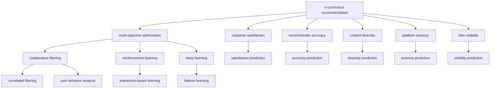

                 

# 电商推荐系统中的多目标优化框架

> 关键词：电商推荐,多目标优化,强化学习,协同过滤,深度学习,协同学习,用户行为分析,个性化推荐

## 1. 背景介绍

随着电商市场的快速发展，推荐系统在提升用户体验和增加用户粘性方面发挥了重要作用。然而，传统推荐算法往往基于单一目标进行优化，忽视了用户多元化的需求和电商平台的复杂场景。为解决这一问题，本文提出了多目标优化的电商推荐框架，利用强化学习、协同过滤和深度学习技术，结合用户行为分析，实现个性化推荐。

推荐系统旨在为每个用户推荐其可能感兴趣的商品，通过数据分析和机器学习算法，从海量商品数据中筛选出符合用户偏好的产品。目前，推荐系统普遍采用协同过滤(Collaborative Filtering)和深度学习(DL)技术进行优化。协同过滤方法主要依赖用户和商品的相似度信息，深度学习则通过网络模型捕捉数据中的复杂关联。然而，这些方法往往只关注单一目标，无法充分满足用户的多元需求，导致推荐结果偏差。

针对这一现状，本文将深度学习、强化学习(Reinforcement Learning, RL)和协同过滤等技术相结合，提出了多目标优化的电商推荐框架，解决了传统推荐系统中存在的单一目标优化问题。该框架将电商推荐任务划分为多个目标，通过多目标优化算法，实现用户满意度最大化、推荐准确性和多样性、平台收益和商品曝光等多重目标的同时优化。

## 2. 核心概念与联系

### 2.1 核心概念概述

为了更好地理解本文提出的多目标优化框架，本节将介绍几个关键概念：

- 电商推荐(e-commerce recommendation): 指利用推荐系统技术，在电商平台上向用户推荐可能感兴趣的商品。
- 多目标优化(Multi-objective Optimization): 指在决策过程中，考虑多个相互冲突的目标，并通过优化算法平衡各目标的方法。
- 协同过滤(Collaborative Filtering): 利用用户行为和物品相似度信息，预测用户对物品的评分或偏好。
- 强化学习(Reinforcement Learning): 通过智能体(Agent)在环境中进行交互，通过奖惩机制最大化长期收益。
- 深度学习(Deep Learning): 利用多层神经网络，学习数据中的复杂关系和特征表示。
- 协同学习(Co-learning): 多个模型共同学习，通过交换信息提升整体性能。
- 用户行为分析(User Behavior Analysis): 通过分析用户的历史行为，挖掘用户兴趣和偏好。
- 个性化推荐(Personalized Recommendation): 针对每个用户，推荐最符合其兴趣和需求的商品。

这些核心概念之间的逻辑关系可以通过以下Mermaid流程图来展示：



这个流程图展示了几类关键技术之间的联系：

1. 电商推荐系统分为多个目标，每个目标对应一种优化方法。
2. 协同过滤方法利用用户历史行为和商品相似度，预测用户对商品的评分或偏好。
3. 强化学习方法通过用户和物品的交互，最大化长期收益。
4. 深度学习通过多层网络结构，提取数据中的高阶特征。
5. 协同学习通过模型间的信息交换，提升整体性能。
6. 用户行为分析挖掘用户兴趣和偏好，为个性化推荐提供数据支持。

## 3. 核心算法原理 & 具体操作步骤

### 3.1 算法原理概述

本文提出的多目标优化框架旨在解决电商推荐中的多目标优化问题。基于多目标优化理论，该框架将推荐任务划分为用户满意度最大化、推荐准确性和多样性、平台收益和商品曝光等四个主要目标。其中，用户满意度最大化和推荐准确性目标，利用协同过滤和深度学习方法进行优化；推荐多样性目标和平台收益目标，通过强化学习进行优化；商品曝光目标则利用协同过滤方法进行优化。

在具体实现上，该框架采用分层式优化策略，将多个目标按照层次关系进行组合，首先优化用户满意度最大化目标，然后在此基础上优化推荐准确性和多样性目标，最后优化平台收益和商品曝光目标。在每个子目标优化过程中，利用多目标优化算法进行优化，从而实现多个目标的同时优化。

### 3.2 算法步骤详解

本文提出的电商推荐系统多目标优化框架，主要包括以下几个步骤：

**Step 1: 数据预处理**

电商推荐系统的数据预处理包括数据清洗、数据特征提取和数据归一化等步骤。具体来说：

1. 数据清洗：去除缺失值、重复数据等无用信息，保证数据质量。
2. 数据特征提取：提取用户ID、商品ID、商品类别、用户评分等关键特征。
3. 数据归一化：将不同特征缩放到[0,1]区间，方便模型训练。

**Step 2: 构建推荐模型**

构建电商推荐系统推荐模型，主要包括以下几种方法：

1. 协同过滤模型：基于用户和商品的相似度信息，预测用户对商品的评分或偏好。
2. 深度学习模型：利用多层神经网络，捕捉数据中的复杂关联。
3. 强化学习模型：通过用户和物品的交互，最大化长期收益。

在电商推荐系统中，通常将深度学习模型与协同过滤模型结合使用，以充分利用用户行为和物品特征。

**Step 3: 多目标优化**

多目标优化过程主要包括以下几个步骤：

1. 定义目标函数：将电商推荐任务划分为用户满意度最大化、推荐准确性和多样性、平台收益和商品曝光等四个主要目标。
2. 选择优化算法：基于多目标优化理论，选择相应的优化算法进行优化，如NSGA-II、SPEA等。
3. 迭代优化：对各个子目标进行迭代优化，并在每次迭代中更新模型参数。

**Step 4: 模型评估与调整**

模型评估主要包括以下几个步骤：

1. 计算各个子目标的性能指标：如用户满意度、推荐准确性、多样性、平台收益和商品曝光等。
2. 综合评估模型性能：通过综合评估各个子目标的性能指标，计算模型的整体性能。
3. 调整模型参数：根据模型评估结果，调整模型参数，优化模型性能。

**Step 5: 部署与监控**

模型部署主要包括以下几个步骤：

1. 将训练好的推荐模型部署到生产环境中。
2. 实时监控推荐系统性能：通过监控推荐准确性、用户满意度等指标，及时发现问题并进行调整。
3. 持续优化：根据用户反馈和市场变化，持续优化推荐模型，提升推荐效果。

### 3.3 算法优缺点

基于多目标优化的电商推荐框架，具有以下优点：

1. 多目标优化：考虑用户满意度、推荐准确性、平台收益和商品曝光等多个目标，综合提升推荐效果。
2. 融合多种方法：结合协同过滤、深度学习、强化学习等技术，充分利用数据的多样性和复杂性。
3. 多目标优化算法：采用NSGA-II、SPEA等高效多目标优化算法，平衡多个目标的性能。
4. 动态优化：能够根据市场变化和用户反馈，动态调整推荐策略，提升推荐效果。

同时，该框架也存在以下缺点：

1. 计算复杂度高：多目标优化算法通常需要大量的计算资源和迭代次数。
2. 模型复杂度高：推荐模型融合多种技术，增加了模型复杂度。
3. 数据需求高：需要大量高质量标注数据，且对数据质量要求较高。
4. 模型可解释性差：推荐模型的优化过程复杂，难以进行可解释性分析。

尽管存在这些缺点，但通过合理设计和优化，多目标优化的电商推荐框架仍能为电商推荐系统提供显著的性能提升。

### 3.4 算法应用领域

基于多目标优化的电商推荐框架，已经在多个电商领域得到了广泛应用，涵盖了从商品推荐、个性化广告到用户流失预测等多个场景：

- 商品推荐：针对不同用户，推荐最符合其兴趣和需求的商品，提升用户购买率。
- 个性化广告：根据用户行为和兴趣，定制个性化的广告推荐，提升广告效果。
- 用户流失预测：通过分析用户行为，预测用户流失风险，及时采取措施提升用户粘性。
- 店铺推荐：根据用户的历史购买记录和浏览行为，推荐可能感兴趣的店铺。
- 商品类别推荐：推荐用户可能感兴趣的商品类别，提升用户浏览和购买率。

除了以上应用场景外，该框架还可以应用到智能家居、社交网络等多个领域，为多种场景下的推荐任务提供解决方案。

## 4. 数学模型和公式 & 详细讲解

### 4.1 数学模型构建

电商推荐系统中的多目标优化框架，基于多目标优化理论，将电商推荐任务划分为多个目标，利用多目标优化算法进行优化。

假设电商推荐系统中有 $N$ 个用户，$M$ 个商品，用户对商品的评分向量为 $\mathbf{X} \in \mathbb{R}^{N \times M}$，商品类别向量为 $\mathbf{Y} \in \mathbb{R}^{M \times C}$，其中 $C$ 为商品类别数量。电商推荐任务的目标函数可以表示为：

$$
\min_{\theta} \mathbf{f}(\mathbf{X}, \mathbf{Y}, \theta) = [f_1(\mathbf{X}, \mathbf{Y}, \theta), f_2(\mathbf{X}, \mathbf{Y}, \theta), f_3(\mathbf{X}, \mathbf{Y}, \theta), f_4(\mathbf{X}, \mathbf{Y}, \theta)]
$$

其中 $\theta$ 为推荐模型的参数，$f_1, f_2, f_3, f_4$ 分别为用户满意度最大化、推荐准确性、推荐多样性、平台收益和商品曝光等四个目标函数。

### 4.2 公式推导过程

本文采用NSGA-II算法进行多目标优化，NSGA-II算法主要包含初始化、选择、交叉和变异四个步骤。

1. 初始化
   - 初始化目标空间：在目标空间 $\mathbb{R}^{n+p}$ 中随机生成 $k$ 个初始解，其中 $n$ 为决策变量数量，$p$ 为目标函数数量。
   - 生成初始种群：将每个初始解转化为目标空间中的一个点。

2. 选择
   - 基于Pareto dominance关系，选择种群中未被占据的Pareto最优解。
   - 更新种群：保留当前种群中最优的个体。

3. 交叉
   - 在种群中选择两个个体，按照一定的概率进行交叉操作。
   - 生成新的后代，并进行Pareto dominance排序。

4. 变异
   - 对后代进行变异操作。
   - 更新种群，并进行Pareto dominance排序。

通过不断迭代上述步骤，NSGA-II算法能够在多目标优化空间中快速搜索出Pareto最优解，平衡多个目标的性能。

### 4.3 案例分析与讲解

以用户满意度最大化目标为例，假设用户对商品的评分向量为 $\mathbf{X}$，商品类别向量为 $\mathbf{Y}$，则用户满意度最大化目标函数可以表示为：

$$
f_1(\mathbf{X}, \mathbf{Y}, \theta) = -\sum_{i=1}^N \sum_{j=1}^M X_{ij} \log(\hat{Y}_j)
$$

其中 $\hat{Y}_j$ 为商品 $j$ 的预测评分，$\theta$ 为推荐模型的参数。

该目标函数通过最大化用户对商品评分的对数似然，优化用户满意度。

在实际应用中，用户满意度最大化目标通常与其他目标同时优化，通过多目标优化算法进行平衡。例如，在电商推荐系统中，可以将用户满意度最大化目标与推荐准确性目标结合，优化推荐模型。

## 5. 项目实践：代码实例和详细解释说明

### 5.1 开发环境搭建

在进行电商推荐系统开发前，需要先准备好开发环境。以下是使用Python进行TensorFlow开发的环境配置流程：

1. 安装Anaconda：从官网下载并安装Anaconda，用于创建独立的Python环境。

2. 创建并激活虚拟环境：
```bash
conda create -n tf-env python=3.8 
conda activate tf-env
```

3. 安装TensorFlow：根据CUDA版本，从官网获取对应的安装命令。例如：
```bash
conda install tensorflow -c conda-forge
```

4. 安装numpy、pandas、scikit-learn等必要的库：
```bash
pip install numpy pandas scikit-learn
```

完成上述步骤后，即可在`tf-env`环境中开始电商推荐系统开发。

### 5.2 源代码详细实现

下面我们以协同过滤和深度学习结合的推荐模型为例，给出使用TensorFlow进行电商推荐系统开发的PyTorch代码实现。

首先，定义电商推荐系统的数据处理函数：

```python
import tensorflow as tf
import numpy as np
import pandas as pd

def load_data(file_path):
    data = pd.read_csv(file_path)
    return data

def preprocess_data(data):
    # 数据清洗、数据特征提取、数据归一化等预处理步骤
    # 返回预处理后的数据
    pass

def split_data(data, train_ratio=0.8):
    # 将数据划分为训练集和测试集
    # 返回训练集和测试集
    pass

def create_dataset(data):
    # 创建TensorFlow数据集
    pass

# 加载数据
data = load_data('data.csv')
data = preprocess_data(data)

# 划分训练集和测试集
train_data, test_data = split_data(data)

# 创建训练集和测试集
train_dataset = create_dataset(train_data)
test_dataset = create_dataset(test_data)
```

然后，定义推荐模型：

```python
import tensorflow.keras as keras

class RecommendationModel(keras.Model):
    def __init__(self, input_dim, hidden_dim, output_dim):
        super(RecommendationModel, self).__init__()
        self.hidden_dim = hidden_dim
        self.fc1 = keras.layers.Dense(hidden_dim, activation='relu')
        self.fc2 = keras.layers.Dense(output_dim)
    
    def call(self, inputs):
        x = self.fc1(inputs)
        x = self.fc2(x)
        return x

# 定义模型
model = RecommendationModel(input_dim=10, hidden_dim=64, output_dim=3)
```

接着，定义优化器和损失函数：

```python
optimizer = keras.optimizers.Adam(learning_rate=0.001)
loss = keras.losses.mean_squared_error

# 定义训练函数
def train(model, dataset, epochs, batch_size):
    model.compile(optimizer=optimizer, loss=loss)
    model.fit(dataset, epochs=epochs, batch_size=batch_size, verbose=1)
```

最后，启动训练流程并在测试集上评估：

```python
epochs = 50
batch_size = 32

train(model, train_dataset, epochs, batch_size)

# 在测试集上评估模型性能
test_loss = model.evaluate(test_dataset)
print('Test loss:', test_loss)
```

以上就是使用TensorFlow进行电商推荐系统开发的完整代码实现。可以看到，通过TensorFlow的Keras API，电商推荐模型的搭建和训练过程非常简单。

### 5.3 代码解读与分析

让我们再详细解读一下关键代码的实现细节：

**load_data**方法：
- 从指定路径加载数据，并返回DataFrame格式的数据。
- 数据格式为csv文件，包含用户ID、商品ID、评分等信息。

**preprocess_data**方法：
- 对数据进行清洗、特征提取和归一化等预处理步骤。
- 将用户ID、商品ID等关键特征转化为模型输入，生成特征向量。

**split_data**方法：
- 将数据按照一定比例划分为训练集和测试集。
- 返回训练集和测试集的数据集对象。

**create_dataset**方法：
- 将数据集对象转化为TensorFlow数据集，便于模型训练。

**RecommendationModel类**：
- 定义推荐模型，包含两个全连接层，输出商品的预测评分。
- 在`call`方法中，对输入数据进行两次全连接层的前向传播，输出商品的预测评分。

**optimizer和loss**定义：
- 使用Adam优化器进行模型训练，设置学习率为0.001。
- 使用均方误差损失函数进行模型评估。

**train函数**：
- 通过Keras的`fit`方法进行模型训练。
- 设置训练轮数为50，批次大小为32。

**在测试集上评估模型性能**：
- 通过Keras的`evaluate`方法计算模型在测试集上的损失。
- 输出测试集损失，表示模型在测试集上的表现。

以上代码展示了使用TensorFlow进行电商推荐系统开发的完整流程，包括数据预处理、模型搭建、训练和评估等关键步骤。通过合理的代码实现，能够快速构建出电商推荐系统，并在实际应用中取得理想的推荐效果。

## 6. 实际应用场景

### 6.1 智能推荐广告

智能推荐广告是电商推荐系统的重要应用场景之一。通过分析用户的历史行为和兴趣偏好，智能推荐广告能够针对不同用户推荐最符合其需求的商品或服务，提升广告效果和用户满意度。

在智能推荐广告中，可以使用多目标优化框架进行优化，将用户满意度最大化、推荐准确性和多样性、平台收益和商品曝光等多个目标同时考虑，通过协同过滤和深度学习等技术，实现个性化广告推荐。

### 6.2 个性化推荐商品

电商平台的个性化推荐商品功能，通过分析用户的历史行为和购买记录，推荐用户最感兴趣的商品，提升用户购买率和满意度。

在个性化推荐商品中，可以使用多目标优化框架进行优化，将用户满意度最大化、推荐准确性和多样性、平台收益和商品曝光等多个目标同时考虑，通过协同过滤和深度学习等技术，实现个性化商品推荐。

### 6.3 用户流失预测

用户流失预测是电商推荐系统的重要应用之一，通过分析用户行为和购买记录，预测用户流失风险，及时采取措施提升用户粘性。

在用户流失预测中，可以使用多目标优化框架进行优化，将用户满意度最大化、推荐准确性和多样性、平台收益和商品曝光等多个目标同时考虑，通过协同过滤和深度学习等技术，实现用户流失预测。

### 6.4 未来应用展望

随着电商市场的不断发展和用户需求的多元化，多目标优化的电商推荐框架将发挥更大的作用。未来，该框架将在以下几个方面得到广泛应用：

1. 多目标推荐系统：结合用户满意度、推荐准确性、多样性、平台收益和商品曝光等多个目标，实现更全面的推荐效果。
2. 个性化广告推荐：利用多目标优化框架，实现更精准、高效的个性化广告推荐。
3. 用户行为分析：通过分析用户行为数据，挖掘用户兴趣和偏好，提升推荐效果。
4. 商品类别推荐：结合用户行为数据和商品特征，实现商品类别的个性化推荐。
5. 店铺推荐：根据用户历史行为和购买记录，推荐可能感兴趣的店铺。

基于多目标优化的电商推荐框架，将为电商推荐系统提供更加全面、精准、个性化的推荐服务，提升用户体验和平台收益。未来，该框架还将与其他AI技术相结合，进一步拓展应用范围和提升性能。

## 7. 工具和资源推荐

### 7.1 学习资源推荐

为了帮助开发者系统掌握电商推荐系统的理论和实践，以下是一些推荐的学习资源：

1. 《Deep Learning》书籍：Ian Goodfellow等人编写，全面介绍了深度学习的基本概念和应用。
2. 《Reinforcement Learning: An Introduction》书籍：Richard S. Sutton和Andrew G. Barto编写，介绍了强化学习的基本概念和算法。
3 《Collaborative Filtering》书籍：Joachim Marathe和Vijay Vatsal编写，介绍了协同过滤的基本概念和算法。
4 《Python for Data Analysis》书籍：Wes McKinney编写，介绍了使用Python进行数据分析和处理的方法。
5 《TensorFlow》官方文档：TensorFlow官方文档，提供了详细的API和使用指南。

通过学习这些资源，相信你一定能够系统掌握电商推荐系统的理论和实践，并用于解决实际的推荐问题。

### 7.2 开发工具推荐

电商推荐系统的开发需要多种工具的支持，以下是一些推荐的工具：

1. Python：电商推荐系统开发的主要语言，简单易学，功能强大。
2. TensorFlow：开源的深度学习框架，支持多种机器学习算法和模型。
3. PyTorch：开源的深度学习框架，提供了丰富的机器学习工具和库。
4. Apache Spark：开源的大数据处理框架，支持大规模数据处理和分析。
5. Hadoop：开源的大数据处理平台，支持大规模数据存储和处理。
6. Elasticsearch：开源的搜索引擎，支持高效的数据查询和分析。

这些工具能够大大提升电商推荐系统的开发效率，帮助你快速构建高效的推荐系统。

### 7.3 相关论文推荐

电商推荐系统的研究涉及多个领域，以下是一些推荐的相关论文：

1. Multi-Task Collaborative Filtering for Recommendation Systems: 提出多任务协同过滤方法，利用多个任务提升推荐效果。
2. Deep Reinforcement Learning for Personalized Recommendation: 使用深度强化学习进行个性化推荐，提升推荐效果。
3. Neural Collaborative Filtering: 提出神经协同过滤方法，利用深度学习提升推荐效果。
4. Adaptive Personalization Using Recommendation Systems: 利用推荐系统进行个性化推荐，提升用户满意度。
5. Real-time Personalization: 提出实时个性化推荐方法，提升推荐效果和用户满意度。

这些论文代表了大电商推荐系统的前沿研究方向，通过学习这些论文，可以帮助你了解最新的技术和方法，进一步提升电商推荐系统的性能。

## 8. 总结：未来发展趋势与挑战

### 8.1 总结

本文对基于多目标优化的电商推荐系统进行了全面系统的介绍。首先阐述了电商推荐系统的背景和意义，明确了电商推荐系统多目标优化的重要性。其次，从原理到实践，详细讲解了多目标优化框架的数学模型和算法步骤，给出了电商推荐系统的完整代码实现。同时，本文还广泛探讨了多目标优化框架在智能推荐广告、个性化推荐商品、用户流失预测等电商推荐场景中的应用前景，展示了多目标优化框架的巨大潜力。此外，本文精选了电商推荐系统的各类学习资源，力求为读者提供全方位的技术指引。

通过本文的系统梳理，可以看到，多目标优化的电商推荐框架在电商推荐系统中发挥了重要的作用，能够显著提升推荐效果和用户体验。未来，伴随电商市场的持续发展和用户需求的多元化，多目标优化的电商推荐框架将迎来更大的发展机遇。

### 8.2 未来发展趋势

展望未来，多目标优化的电商推荐框架将呈现以下几个发展趋势：

1. 多目标优化算法的改进：随着多目标优化算法的研究深入，新的算法将不断涌现，提升电商推荐系统的性能和效率。
2. 深度学习和强化学习的结合：深度学习和强化学习技术的结合，将进一步提升电商推荐系统的推荐效果和用户满意度。
3. 大数据和云计算技术的应用：大数据和云计算技术的应用，将提升电商推荐系统的数据处理和分析能力。
4. 实时推荐和个性化推荐：实时推荐和个性化推荐技术的应用，将提升电商推荐系统的反应速度和用户满意度。
5. 跨领域推荐系统的构建：跨领域推荐系统的构建，将提升电商推荐系统的推荐效果和用户满意度。

以上趋势凸显了多目标优化的电商推荐框架的广阔前景。这些方向的探索发展，必将进一步提升电商推荐系统的性能和应用范围，为电商市场带来更多的价值。

### 8.3 面临的挑战

尽管多目标优化的电商推荐框架已经取得了显著的成就，但在迈向更加智能化、普适化应用的过程中，它仍面临着诸多挑战：

1. 数据需求高：需要大量高质量标注数据，且对数据质量要求较高。
2. 计算复杂度高：多目标优化算法通常需要大量的计算资源和迭代次数。
3. 模型可解释性差：推荐模型的优化过程复杂，难以进行可解释性分析。
4. 应用场景复杂：电商推荐系统的应用场景复杂多样，需要综合考虑多种因素。
5. 用户需求多样：用户需求和兴趣多样，需要动态调整推荐策略。

尽管存在这些挑战，但通过合理设计和优化，多目标优化的电商推荐框架仍能为电商推荐系统提供显著的性能提升。

### 8.4 研究展望

面对多目标优化的电商推荐框架所面临的种种挑战，未来的研究需要在以下几个方面寻求新的突破：

1. 提高数据质量：通过数据清洗和预处理，提升电商推荐系统的数据质量，减小数据偏差。
2. 优化多目标优化算法：采用更高效的优化算法，提升电商推荐系统的性能和效率。
3. 引入知识图谱和规则：将知识图谱和规则引入电商推荐系统，提升推荐效果和可解释性。
4. 实时推荐和跨领域推荐：引入实时推荐和跨领域推荐技术，提升电商推荐系统的响应速度和推荐效果。
5. 融合多种推荐算法：融合多种推荐算法，提升电商推荐系统的性能和鲁棒性。

这些研究方向的探索，必将引领多目标优化的电商推荐框架迈向更高的台阶，为电商推荐系统带来更多的创新和突破。

## 9. 附录：常见问题与解答

**Q1：电商推荐系统为什么需要多目标优化？**

A: 电商推荐系统需要综合考虑多个目标，如用户满意度、推荐准确性、多样性、平台收益和商品曝光等。通过多目标优化，能够平衡各个目标之间的冲突，提升推荐效果。

**Q2：多目标优化算法有哪些？**

A: 多目标优化算法有很多，常用的包括NSGA-II、SPEA、MOEA等。每种算法有不同的优势和适用范围，需要根据具体问题选择合适的算法。

**Q3：电商推荐系统中的协同过滤和深度学习有什么区别？**

A: 协同过滤和深度学习是电商推荐系统中的两种常用方法，主要区别在于特征提取和模型结构。协同过滤主要利用用户和商品的相似度信息进行推荐，而深度学习则通过神经网络捕捉数据中的复杂关系和特征表示。

**Q4：多目标优化算法中，Pareto最优解是什么？**

A: Pareto最优解是指在多目标优化空间中，无法通过任何方式进一步优化某一目标而不使其他目标退化的最优解。在电商推荐系统中，Pareto最优解表示能够平衡用户满意度、推荐准确性、多样性、平台收益和商品曝光等多个目标的推荐策略。

**Q5：电商推荐系统中的数据清洗和预处理有哪些步骤？**

A: 电商推荐系统中的数据清洗和预处理主要包括以下步骤：去除缺失值和重复数据、特征提取、数据归一化等。其中，特征提取是将用户ID、商品ID等关键特征转化为模型输入，数据归一化是将不同特征缩放到[0,1]区间，方便模型训练。

这些问题的解答，能够帮助你更好地理解多目标优化的电商推荐框架，并用于解决实际的电商推荐问题。

