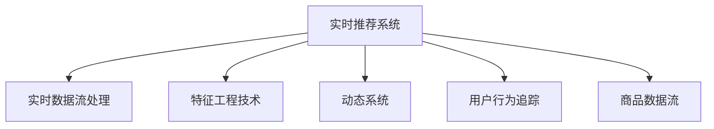

                 

## 1. 背景介绍

### 1.1 问题由来
随着电商平台的快速发展，推荐系统成为支撑用户购物体验、提升销售转化率的关键。推荐算法根据用户历史行为数据和商品特征数据，为用户推荐个性化的商品，从而最大化用户满意度。然而，传统推荐系统依赖于历史数据进行训练，难以适应用户行为的快速变化，无法满足实时推荐的需求。

### 1.2 问题核心关键点
针对实时推荐的需求，推荐系统需要根据用户实时行为数据和实时商品数据，进行动态调整，快速输出推荐结果。传统推荐算法无法实现实时调整，需要引入实时特征工程技术，才能在动态变化中保持推荐准确性。

### 1.3 问题研究意义
实时推荐系统对推荐算法提出了更高的要求：

1. 动态调整：用户行为实时变化，推荐模型需要动态调整以保持推荐效果。
2. 实时性：推荐结果需在几毫秒内输出，才能满足用户实时反馈的需求。
3. 资源优化：实时推荐需要在高并发情况下保证性能，需要优化计算资源和存储资源。
4. 数据融合：实时推荐需要同时考虑历史数据和实时数据，需要高效的特征工程技术。
5. 模型稳定性：实时推荐需要在数据分布变化时保持模型稳定，避免过拟合。

通过引入实时特征工程技术，推荐系统可以实时动态调整，快速响应用户需求，提升推荐效果。

## 2. 核心概念与联系

### 2.1 核心概念概述

为更好地理解实时推荐系统中的特征工程技术，本节将介绍几个密切相关的核心概念：

- 推荐系统(Recommendation System)：根据用户历史行为和商品属性，为用户推荐商品的系统。
- 实时推荐系统(Real-time Recommendation System)：能够实时响应用户行为和商品动态变化的推荐系统。
- 特征工程技术(Feature Engineering)：通过提取、变换、组合特征，提升推荐模型性能的技术。
- 实时数据流处理(Real-time Data Streaming)：对实时数据进行高效处理和分析的技术。
- 动态系统(Dynamic System)：能够根据输入数据动态调整输出的系统。
- 用户行为追踪(User Behavior Tracking)：对用户在线行为进行实时追踪和记录的技术。
- 商品数据流(Product Data Streaming)：对商品实时数据进行高效存储和处理的技术。

这些核心概念之间的逻辑关系可以通过以下Mermaid流程图来展示：



这个流程图展示了几类核心概念之间的关系：

1. 实时推荐系统是整个系统的核心，依赖实时数据流处理、特征工程技术和动态系统。
2. 实时数据流处理和特征工程技术是实时推荐系统的基础，负责高效处理和提取特征。
3. 动态系统负责根据输入数据动态调整推荐输出，提升实时性。
4. 用户行为追踪和商品数据流是实时数据流处理的主要数据来源，需高效存储和实时处理。

这些核心概念共同构成了实时推荐系统的核心技术架构，使其能够在动态变化中快速推荐商品。

## 3. 核心算法原理 & 具体操作步骤
### 3.1 算法原理概述

实时推荐系统中的特征工程技术，旨在通过高效处理和融合实时数据，动态调整推荐模型，提高推荐效果的实时性和准确性。其核心思想是：将用户历史行为数据和实时行为数据，以及商品属性和实时属性，进行融合和动态调整，构建实时特征向量，输入推荐模型进行实时推荐。

具体来说，实时推荐系统可以分为以下几个步骤：

1. 实时数据流处理：对用户行为数据和商品数据进行实时采集和预处理。
2. 特征提取与变换：对预处理后的数据进行特征提取和变换，构建实时特征向量。
3. 动态调整：根据实时特征向量，动态调整推荐模型参数，输出推荐结果。
4. 融合与优化：对历史推荐结果和实时推荐结果进行融合和优化，提升推荐效果。

### 3.2 算法步骤详解

以下是实时推荐系统中的特征工程技术的详细步骤：

**Step 1: 实时数据流处理**
- 对用户行为数据进行实时追踪，获取用户的点击、浏览、购买等行为记录。
- 对商品数据进行实时处理，获取商品的最新属性、评价、价格等信息。
- 对实时数据进行预处理，包括去重、过滤异常值、标准化等操作。

**Step 2: 特征提取与变换**
- 根据用户行为和商品属性，提取特征，如用户的兴趣类别、浏览时长、购买频率等。
- 对特征进行变换，包括编码、归一化、特征降维等操作，构建实时特征向量。

**Step 3: 动态调整**
- 根据实时特征向量，动态调整推荐模型参数，如改变权重、调整阈值等。
- 使用动态系统实现推荐模型的在线训练和推理，实时输出推荐结果。

**Step 4: 融合与优化**
- 对历史推荐结果和实时推荐结果进行融合，提升推荐效果。
- 使用优化算法对推荐结果进行排序和过滤，输出最终的推荐列表。

### 3.3 算法优缺点

实时推荐系统中的特征工程技术具有以下优点：
1. 实时性高：能够实时响应用户行为和商品动态变化，提供即时的推荐结果。
2. 动态调整：根据实时数据动态调整推荐模型，提升推荐效果。
3. 数据融合：综合历史和实时数据，构建更加全面的特征向量。
4. 计算高效：通过高效的数据流处理和特征变换，降低计算复杂度。
5. 稳定性好：通过动态调整和优化，保持推荐模型在不同数据分布下的稳定性。

同时，该技术也存在一定的局限性：
1. 数据延迟：实时数据流的延迟可能导致特征提取和模型调整的滞后。
2. 数据质量：实时数据的采集和处理需要高质量的系统支撑，否则可能导致噪音和错误。
3. 计算资源：实时推荐系统对计算资源有较高的要求，需合理配置和优化。
4. 模型复杂：动态调整和实时推理增加了模型复杂度，需要更多计算资源。
5. 数据隐私：实时推荐系统涉及大量用户行为数据和商品数据，需注意数据隐私和安全。

尽管存在这些局限性，但就目前而言，实时推荐系统中的特征工程技术仍然是最主流的推荐范式。未来相关研究的重点在于如何进一步降低数据延迟，提高数据质量，优化计算资源配置，降低模型复杂度，同时兼顾数据隐私和安全。

### 3.4 算法应用领域

实时推荐系统中的特征工程技术在电商领域已经得到了广泛的应用，覆盖了几乎所有推荐任务，例如：

- 商品推荐：根据用户历史行为和实时行为，推荐商品。
- 价格优化：根据市场变化和用户需求，动态调整商品价格。
- 广告推荐：根据用户兴趣和行为，推荐相关广告。
- 库存管理：根据销售预测和库存水平，动态调整库存。
- 用户分组：根据用户行为和属性，进行用户细分和分组。

除了上述这些经典任务外，实时推荐系统中的特征工程技术还被创新性地应用到更多场景中，如个性化推荐、精准营销、实时搜索等，为电商推荐系统的持续优化提供了新的思路。

## 4. 数学模型和公式 & 详细讲解  
### 4.1 数学模型构建

本节将使用数学语言对实时推荐系统中的特征工程技术进行更加严格的刻画。

记实时推荐系统的输入为 $(U, P)$，其中 $U$ 为用户行为数据，$P$ 为商品属性数据。假设实时推荐系统的时间戳为 $t$，则实时数据流 $D$ 可以表示为：

$$
D = \{(U_t, P_t) | t \in [0, T] \}
$$

其中 $T$ 为时间窗口，一般取秒级别。

定义实时推荐系统的推荐模型为 $R$，其输出为推荐商品列表 $Y$。推荐模型 $R$ 可以表示为：

$$
R = f(U_t, P_t)
$$

其中 $f$ 为推荐模型的映射函数，$U_t$ 和 $P_t$ 为输入特征。

### 4.2 公式推导过程

以下是实时推荐系统中的特征工程技术的数学推导过程：

**Step 1: 特征提取**
- 设用户行为数据 $U_t = \{u_1, u_2, \ldots, u_n\}$，商品属性数据 $P_t = \{p_1, p_2, \ldots, p_m\}$。
- 提取用户兴趣类别 $u_i \in \{1, 2, \ldots, k\}$，商品属性类别 $p_j \in \{1, 2, \ldots, l\}$。
- 构建特征向量 $X_t = (x_{1t}, x_{2t}, \ldots, x_{mt})$，其中 $x_{ij} = 1$ 表示用户 $u_i$ 对商品 $p_j$ 有相关行为或属性，$x_{ij} = 0$ 表示无相关行为或属性。

**Step 2: 特征变换**
- 对特征向量 $X_t$ 进行归一化处理，使得每个特征值在 $[0, 1]$ 区间内。
- 对归一化后的特征向量进行编码，如独热编码、二进制编码等，转换为稠密表示。
- 对稠密表示进行特征降维，如PCA、LDA等，减少特征维度。

**Step 3: 动态调整**
- 根据实时特征向量 $X_t$，动态调整推荐模型的权重向量 $\alpha$，如：
$$
\alpha = \mathop{\arg\min}_{\alpha} \mathcal{L}(\alpha, X_t)
$$
其中 $\mathcal{L}$ 为权重向量 $\alpha$ 在实时特征向量 $X_t$ 上的损失函数。

**Step 4: 融合与优化**
- 对历史推荐结果 $Y_{t-1}$ 和实时推荐结果 $Y_t$ 进行融合，如加权平均、Adaboost等。
- 使用排序和过滤算法，对融合后的推荐结果进行排序和过滤，输出最终推荐列表 $Y$。

### 4.3 案例分析与讲解

以下是实时推荐系统中的特征工程技术的实际应用案例：

**案例1: 个性化推荐**
- 对于用户 $u$，根据其历史行为数据 $U$ 和实时行为数据 $U_t$，提取用户兴趣类别 $u_i$ 和商品属性类别 $p_j$。
- 对提取的特征进行归一化、编码和降维，构建实时特征向量 $X_t$。
- 根据 $X_t$ 动态调整推荐模型参数 $\alpha$，输出推荐列表 $Y$。
- 对 $Y$ 进行排序和过滤，输出最终的个性化推荐结果。

**案例2: 实时广告推荐**
- 对于用户 $u$，根据其历史行为数据 $U$ 和实时行为数据 $U_t$，提取用户兴趣类别 $u_i$ 和商品广告类别 $a_j$。
- 对提取的特征进行归一化、编码和降维，构建实时特征向量 $X_t$。
- 根据 $X_t$ 动态调整广告推荐模型的权重向量 $\alpha$，输出推荐列表 $Y$。
- 对 $Y$ 进行排序和过滤，输出最终的实时广告推荐结果。

## 5. 项目实践：代码实例和详细解释说明
### 5.1 开发环境搭建

在进行实时推荐系统中的特征工程技术实践前，我们需要准备好开发环境。以下是使用Python进行Scikit-learn开发的环境配置流程：

1. 安装Anaconda：从官网下载并安装Anaconda，用于创建独立的Python环境。

2. 创建并激活虚拟环境：
```bash
conda create -n recomm-system-env python=3.8 
conda activate recomm-system-env
```

3. 安装Scikit-learn：
```bash
conda install scikit-learn
```

4. 安装各类工具包：
```bash
pip install numpy pandas scikit-learn matplotlib tqdm jupyter notebook ipython
```

完成上述步骤后，即可在`recomm-system-env`环境中开始实时推荐系统的特征工程技术实践。

### 5.2 源代码详细实现

下面我们以个性化推荐任务为例，给出使用Scikit-learn对用户行为数据和商品属性数据进行特征工程处理的PyTorch代码实现。

首先，定义用户行为数据的处理函数：

```python
from sklearn.preprocessing import LabelEncoder, MinMaxScaler
from sklearn.feature_extraction.text import CountVectorizer, TfidfTransformer
from sklearn.decomposition import PCA

def preprocess_user_data(user_data):
    # 用户行为数据的处理
    user_labels = ['buy', 'click', 'view']
    le = LabelEncoder()
    user_labels_encoded = le.fit_transform(user_data)
    user_labels_onehot = le.transform(user_data)
    
    # 商品属性数据的处理
    product_labels = ['category1', 'category2', 'category3']
    le = LabelEncoder()
    product_labels_encoded = le.fit_transform(product_labels)
    product_labels_onehot = le.transform(product_labels)
    
    # 归一化处理
    scaler = MinMaxScaler()
    user_labels_encoded = scaler.fit_transform(user_labels_encoded)
    product_labels_encoded = scaler.fit_transform(product_labels_encoded)
    
    # 特征降维
    vectorizer = CountVectorizer()
    user_features = vectorizer.fit_transform(user_labels_onehot)
    user_features = TfidfTransformer().fit_transform(user_features)
    user_features = PCA(n_components=10).fit_transform(user_features)
    
    product_features = CountVectorizer()
    product_features = TfidfTransformer().fit_transform(product_features)
    product_features = PCA(n_components=10).fit_transform(product_features)
    
    return user_labels_encoded, user_features, product_labels_encoded, product_features
```

然后，定义实时推荐模型：

```python
from sklearn.linear_model import LogisticRegression

def build_recommender(user_labels, user_features, product_labels, product_features):
    # 用户特征和商品特征的融合
    user_product_features = np.concatenate([user_features, product_features], axis=1)
    
    # 构建推荐模型
    model = LogisticRegression()
    model.fit(user_product_features, product_labels)
    return model
```

最后，启动推荐流程：

```python
import numpy as np
from sklearn.metrics import accuracy_score

# 用户行为数据
user_data = ['buy', 'click', 'buy', 'view', 'click', 'buy', 'buy', 'view']

# 商品属性数据
product_data = ['category1', 'category1', 'category2', 'category3', 'category2', 'category3', 'category1', 'category2']

# 特征提取和变换
user_labels_encoded, user_features, product_labels_encoded, product_features = preprocess_user_data(user_data, product_data)

# 推荐模型构建
model = build_recommender(user_labels_encoded, user_features, product_labels_encoded, product_features)

# 测试数据
test_user_data = ['buy', 'click', 'buy', 'view', 'click']
test_product_data = ['category2', 'category3', 'category1', 'category3', 'category1']

# 特征提取和变换
test_user_labels_encoded, test_user_features, test_product_labels_encoded, test_product_features = preprocess_user_data(test_user_data, test_product_data)

# 测试推荐
test_user_product_features = np.concatenate([test_user_features, test_product_features], axis=1)
predictions = model.predict(test_user_product_features)
```

以上就是使用Scikit-learn进行个性化推荐任务的特征工程技术实践的完整代码实现。可以看到，Scikit-learn提供了丰富的特征工程工具和机器学习算法，使得实时推荐系统的开发变得相对简单。

### 5.3 代码解读与分析

让我们再详细解读一下关键代码的实现细节：

**preprocess_user_data函数**：
- 对用户行为数据和商品属性数据进行编码、归一化和降维操作，生成用户特征向量和商品特征向量。

**build_recommender函数**：
- 将用户特征向量和商品特征向量进行拼接，生成融合特征向量。
- 构建逻辑回归模型，对融合特征向量进行训练。

**测试推荐**：
- 对测试数据进行特征提取和变换，生成融合特征向量。
- 使用训练好的推荐模型对融合特征向量进行预测，输出推荐结果。

可以看到，Scikit-learn提供了丰富的特征工程工具和机器学习算法，使得实时推荐系统的开发变得相对简单。开发者可以通过合理的参数配置和使用，快速搭建实时推荐系统，实现个性化推荐等应用。

当然，工业级的系统实现还需考虑更多因素，如实时数据流的采集和处理、推荐模型的在线训练和推理、数据隐私和安全等。但核心的特征工程技术基本与此类似。

## 6. 实际应用场景
### 6.1 电商推荐系统
电商推荐系统中的实时特征工程技术，可以广泛应用于个性化推荐、实时广告推荐、精准营销等场景，提升用户购物体验和平台销售转化率。

**个性化推荐**：根据用户历史行为和实时行为，动态调整推荐模型参数，输出个性化推荐结果。

**实时广告推荐**：根据用户兴趣和实时行为，动态调整广告推荐模型参数，输出实时广告推荐结果。

**精准营销**：根据用户行为和属性，进行用户细分和分组，输出精准营销策略。

**实时搜索**：根据用户搜索行为和商品属性，动态调整搜索结果排序算法，输出实时搜索结果。

**库存管理**：根据销售预测和实时订单，动态调整库存水平，优化库存管理。

### 6.2 金融推荐系统
金融推荐系统中的实时特征工程技术，可以广泛应用于股票推荐、理财产品推荐、风险控制等场景，提升金融服务质量和用户体验。

**股票推荐**：根据用户历史交易行为和实时交易数据，动态调整推荐模型参数，输出股票推荐结果。

**理财产品推荐**：根据用户历史理财行为和实时理财数据，动态调整推荐模型参数，输出理财产品推荐结果。

**风险控制**：根据用户交易行为和实时市场数据，动态调整风险控制模型参数，输出风险评估结果。

**实时风控**：根据用户行为和实时数据，动态调整风控模型参数，输出实时风控结果。

**金融搜索**：根据用户搜索行为和金融产品属性，动态调整搜索结果排序算法，输出实时搜索结果。

### 6.3 未来应用展望

随着实时推荐系统中的特征工程技术的发展，未来将在更多领域得到应用，为各行各业带来变革性影响。

在智慧医疗领域，实时推荐系统可以用于推荐个性化医疗方案、实时健康监测等，提升医疗服务质量和患者满意度。

在智能教育领域，实时推荐系统可以用于推荐个性化学习方案、实时学习效果评估等，提升教学质量和学生学习效果。

在智能城市治理中，实时推荐系统可以用于推荐智慧城市管理方案、实时城市事件监测等，提升城市治理效率和居民生活质量。

此外，在企业生产、社会治理、文娱传媒等众多领域，实时推荐系统中的特征工程技术也将不断涌现，为各行各业带来新的技术路径和应用场景。相信随着技术的日益成熟，实时推荐系统中的特征工程技术将为各行各业带来更多的创新和突破。

## 7. 工具和资源推荐
### 7.1 学习资源推荐

为了帮助开发者系统掌握实时推荐系统中的特征工程技术的理论基础和实践技巧，这里推荐一些优质的学习资源：

1. 《推荐系统实战》系列博文：由大模型技术专家撰写，深入浅出地介绍了推荐系统的原理、算法和工程实践。

2. CS294《推荐系统》课程：加州大学伯克利分校开设的推荐系统经典课程，涵盖了推荐系统的基本概念和先进算法。

3. 《Python推荐系统实战》书籍：详细介绍使用Python实现推荐系统的工程实践，包括特征工程技术、模型优化等。

4. Kaggle推荐系统竞赛：通过实际数据集和竞赛环境，锻炼特征工程能力和模型优化能力，积累实践经验。

5. 《推荐系统理论基础》书籍：全面介绍了推荐系统的数学基础和经典算法，适合理论研究者和算法工程师学习。

通过对这些资源的学习实践，相信你一定能够快速掌握实时推荐系统中的特征工程技术的精髓，并用于解决实际的推荐问题。

### 7.2 开发工具推荐

高效的开发离不开优秀的工具支持。以下是几款用于实时推荐系统开发的常用工具：

1. Scikit-learn：用于特征提取、特征变换和模型训练的Python机器学习库，功能强大且易于使用。

2. TensorFlow：用于模型训练和推理的深度学习框架，支持多种分布式计算和优化算法。

3. PyTorch：用于模型训练和推理的深度学习框架，具有灵活的计算图和动态图功能。

4. Apache Kafka：用于实时数据流的处理和传输，支持高吞吐量和低延迟。

5. Apache Spark：用于分布式数据处理和分析的计算框架，支持大数据量的实时处理。

6. Apache Flink：用于实时数据流处理和状态管理的计算框架，支持高效的实时计算和状态维护。

合理利用这些工具，可以显著提升实时推荐系统的开发效率，加快创新迭代的步伐。

### 7.3 相关论文推荐

实时推荐系统中的特征工程技术的发展源于学界的持续研究。以下是几篇奠基性的相关论文，推荐阅读：

1. Item-based Collaborative Filtering：提出基于用户-商品交互矩阵的协同过滤推荐算法，奠定了推荐系统研究的基础。

2. Content-based Recommendation：提出基于商品属性特征的推荐算法，结合用户兴趣进行推荐，提升推荐效果。

3. Matrix Factorization：提出基于矩阵分解的推荐算法，通过分解用户-商品交互矩阵，捕捉隐式用户兴趣和商品特征。

4. Deep Collaborative Filtering：提出基于深度神经网络的推荐算法，结合用户行为数据和商品特征数据，提升推荐效果。

5. Multi-view Recommendation：提出多视角推荐算法，结合用户行为数据、商品属性数据等多视角信息，提升推荐效果。

6. Adaptive Recommendation：提出自适应推荐算法，根据用户行为和商品属性动态调整推荐策略，提升推荐效果。

这些论文代表了大规模推荐系统的发展脉络。通过学习这些前沿成果，可以帮助研究者把握学科前进方向，激发更多的创新灵感。

## 8. 总结：未来发展趋势与挑战

### 8.1 总结

本文对实时推荐系统中的特征工程技术进行了全面系统的介绍。首先阐述了实时推荐系统的背景和重要性，明确了特征工程技术的核心价值。其次，从原理到实践，详细讲解了特征工程技术的数学原理和关键步骤，给出了实时推荐系统中的特征工程技术的完整代码实例。同时，本文还广泛探讨了特征工程技术在电商、金融、智慧医疗等多个领域的应用前景，展示了实时推荐系统的巨大潜力。此外，本文精选了特征工程技术的各类学习资源，力求为读者提供全方位的技术指引。

通过本文的系统梳理，可以看到，实时推荐系统中的特征工程技术在推荐领域的应用已经相当广泛，极大地提升了推荐系统的实时性和准确性。未来，伴随实时推荐技术的不断进步，特征工程技术将进一步优化和拓展，为各行各业带来更多创新和突破。

### 8.2 未来发展趋势

展望未来，实时推荐系统中的特征工程技术将呈现以下几个发展趋势：

1. 多视角融合：结合用户行为数据、商品属性数据、时间信息等多视角信息，提升推荐效果的全面性和鲁棒性。

2. 实时动态调整：动态调整推荐模型参数，实时响应用户行为和商品动态变化，提升推荐效果的实时性。

3. 自动化特征工程：引入自动化特征工程工具，提升特征工程效率，减少人工干预。

4. 集成推荐系统：结合协同过滤、基于内容的推荐、深度推荐等多种算法，提升推荐效果。

5. 跨领域推荐：将实时推荐系统应用于更多领域，如医疗、教育、智能城市等，提升各领域的推荐效果。

6. 数据隐私保护：引入数据隐私保护技术，保护用户隐私和数据安全。

以上趋势凸显了实时推荐系统中的特征工程技术的应用前景，这些方向的探索发展，必将进一步提升实时推荐系统的效果和应用范围，为各行业带来新的创新和突破。

### 8.3 面临的挑战

尽管实时推荐系统中的特征工程技术已经取得了显著成效，但在迈向更加智能化、普适化应用的过程中，它仍面临着诸多挑战：

1. 数据延迟：实时数据流的延迟可能导致特征提取和模型调整的滞后。

2. 数据质量：实时数据的采集和处理需要高质量的系统支撑，否则可能导致噪音和错误。

3. 计算资源：实时推荐系统对计算资源有较高的要求，需合理配置和优化。

4. 模型复杂：动态调整和实时推理增加了模型复杂度，需要更多计算资源。

5. 数据隐私：实时推荐系统涉及大量用户行为数据和商品数据，需注意数据隐私和安全。

尽管存在这些挑战，但就目前而言，实时推荐系统中的特征工程技术仍然是最主流的推荐范式。未来相关研究的重点在于如何进一步降低数据延迟，提高数据质量，优化计算资源配置，降低模型复杂度，同时兼顾数据隐私和安全。

### 8.4 研究展望

面对实时推荐系统中的特征工程技术所面临的种种挑战，未来的研究需要在以下几个方面寻求新的突破：

1. 探索无监督和半监督特征工程技术：摆脱对大规模标注数据的依赖，利用自监督学习、主动学习等无监督和半监督范式，最大限度利用非结构化数据，实现更加灵活高效的特征工程。

2. 研究参数高效和计算高效的特征工程技术：开发更加参数高效的特征工程技术，在固定大部分预训练参数的同时，只更新极少量的任务相关参数。同时优化特征工程的计算图，减少前向传播和反向传播的资源消耗，实现更加轻量级、实时性的部署。

3. 融合因果和对比学习范式：通过引入因果推断和对比学习思想，增强特征工程技术的建立稳定因果关系的能力，学习更加普适、鲁棒的语言表征，从而提升特征工程的泛化性和抗干扰能力。

4. 引入更多先验知识：将符号化的先验知识，如知识图谱、逻辑规则等，与神经网络模型进行巧妙融合，引导特征工程技术的动态调整过程学习更准确、合理的特征表示。同时加强不同模态数据的整合，实现视觉、语音等多模态信息与文本信息的协同建模。

5. 结合因果分析和博弈论工具：将因果分析方法引入特征工程技术，识别出特征工程技术的决策关键特征，增强输出解释的因果性和逻辑性。借助博弈论工具刻画用户行为和商品动态变化，主动探索并规避特征工程的脆弱点，提高系统稳定性。

6. 纳入伦理道德约束：在特征工程技术的训练目标中引入伦理导向的评估指标，过滤和惩罚有偏见、有害的输出倾向。同时加强人工干预和审核，建立特征工程技术的监管机制，确保输出符合人类价值观和伦理道德。

这些研究方向的探索，必将引领实时推荐系统中的特征工程技术迈向更高的台阶，为构建安全、可靠、可解释、可控的智能系统铺平道路。面向未来，实时推荐系统中的特征工程技术还需要与其他人工智能技术进行更深入的融合，如知识表示、因果推理、强化学习等，多路径协同发力，共同推动推荐系统效果的进步。只有勇于创新、敢于突破，才能不断拓展实时推荐系统的边界，让智能技术更好地造福人类社会。

## 9. 附录：常见问题与解答

**Q1：实时推荐系统中的特征工程技术是否适用于所有推荐任务？**

A: 实时推荐系统中的特征工程技术在大多数推荐任务上都能取得不错的效果，特别是对于数据量较小的任务。但对于一些特定领域的任务，如医学、法律等，仅仅依靠实时数据流的预处理，可能难以很好地适应。此时需要在特定领域数据上进一步进行特征工程处理，才能获得理想效果。此外，对于一些需要时效性、个性化很强的任务，如对话、推荐等，特征工程技术也需要针对性的改进优化。

**Q2：特征工程中的预处理步骤有哪些？**

A: 特征工程中的预处理步骤主要包括：

1. 数据清洗：去除缺失值、异常值、重复值等噪声数据。

2. 数据归一化：将数据缩放到 [0, 1] 或 [-1, 1] 区间，避免不同特征之间的尺度差异。

3. 数据编码：将类别型数据转换为数值型数据，如独热编码、二进制编码等。

4. 特征降维：通过PCA、LDA等方法，减少特征维度，避免维度灾难。

5. 特征组合：通过拼接、融合等方法，生成新的特征。

6. 特征选择：选择对模型性能有贡献的特征，避免冗余和噪声。

通过合理的预处理步骤，可以提升特征工程技术的质量和效果。

**Q3：实时推荐系统中的特征工程技术在实际应用中需要注意哪些问题？**

A: 实时推荐系统中的特征工程技术在实际应用中需要注意以下问题：

1. 数据延迟：实时数据流的延迟可能导致特征提取和模型调整的滞后，影响推荐效果。

2. 数据质量：实时数据的采集和处理需要高质量的系统支撑，否则可能导致噪音和错误。

3. 计算资源：实时推荐系统对计算资源有较高的要求，需合理配置和优化。

4. 模型复杂：动态调整和实时推理增加了模型复杂度，需要更多计算资源。

5. 数据隐私：实时推荐系统涉及大量用户行为数据和商品数据，需注意数据隐私和安全。

6. 模型稳定性：实时推荐系统需要在数据分布变化时保持模型稳定，避免过拟合。

合理解决这些问题，可以显著提升实时推荐系统的效果和应用范围。

**Q4：特征工程技术在实时推荐系统中如何实现高效特征组合？**

A: 特征工程技术在实时推荐系统中实现高效特征组合的方法包括：

1. 特征降维：通过PCA、LDA等方法，减少特征维度，避免维度灾难。

2. 特征拼接：将用户行为数据和商品属性数据拼接，生成融合特征向量。

3. 特征融合：通过SVM、KNN等方法，将不同特征进行组合，提升特征表示的泛化性。

4. 特征提取：通过NLP、图像处理等方法，从文本、图像等多模态数据中提取特征。

5. 特征编码：通过独热编码、二进制编码等方法，将类别型数据转换为数值型数据。

通过合理设计特征工程技术，可以提升实时推荐系统的特征组合效果，提升推荐效果。

**Q5：实时推荐系统中的特征工程技术在实际应用中如何处理异常值？**

A: 实时推荐系统中的特征工程技术在实际应用中处理异常值的方法包括：

1. 数据清洗：通过删除、填充等方法，去除缺失值和异常值。

2. 数据归一化：将数据缩放到 [0, 1] 或 [-1, 1] 区间，避免不同特征之间的尺度差异。

3. 数据平滑：对异常值进行平滑处理，如中值平滑、均值平滑等，避免异常值对模型的影响。

4. 数据替换：将异常值替换为合理的数值，如中位数、众数等。

5. 特征降维：通过PCA、LDA等方法，减少特征维度，避免异常值的影响。

通过合理处理异常值，可以提升特征工程技术的稳定性和效果。

---

作者：禅与计算机程序设计艺术 / Zen and the Art of Computer Programming

