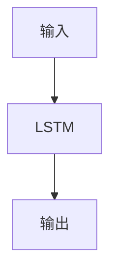

                 

# 电商推荐系统中的长短期用户兴趣融合

## 1. 背景介绍

随着电商市场的日益繁荣，如何高效、精准地为用户推荐商品，已经成为各大电商平台的重点关注问题。传统的电商推荐系统主要基于用户的历史行为数据，如浏览、点击、购买等，进行简单的协同过滤和矩阵分解等线性方法推荐。然而，这种推荐方式往往难以充分捕捉用户的兴趣演变，导致推荐结果不够个性化、精准化。为了解决这一问题，越来越多的电商推荐系统开始引入深度学习技术，尤其是长短期记忆网络(LSTM)等时间序列建模方法，以更好地区分用户的长短期兴趣。本文将详细介绍长短期用户兴趣融合技术，探讨其理论基础和实践方案。

## 2. 核心概念与联系

### 2.1 核心概念概述

在电商推荐系统中，用户兴趣是指用户对商品或服务的需求和偏好。长短期记忆网络(LSTM)是一种能够学习时间序列数据的神经网络模型，能够有效地捕捉数据的长期依赖关系。在用户行为数据中，长短期记忆网络能够区分用户在不同时间间隔上的兴趣变化。而短期记忆网络能够捕捉用户近期行为中的即时兴趣，长期记忆网络则能发现用户历史行为中的潜在兴趣。结合两者的长短期记忆网络能够更好地理解用户的兴趣动态，从而提供更精准的推荐。

### 2.2 核心概念原理和架构的 Mermaid 流程图

```mermaid
graph TB
    A[长短期记忆网络(LSTM)] --> B[短期记忆网络]
    A --> C[长期记忆网络]
    B --> D[实时推荐]
    C --> E[历史行为分析]
    D --> F[实时交互]
    E --> G[行为数据采集]
    F --> H[反馈信息]
    G --> I[数据预处理]
    H --> I
    I --> J[用户兴趣融合]
    J --> K[推荐算法]
```

以上图展示了长短期用户兴趣融合的架构，主要包括以下几个关键步骤：
1. **数据预处理**：采集用户的实时行为数据，并进行预处理，以供模型使用。
2. **短期记忆网络**：对用户近期的行为数据进行分析，捕捉用户即时兴趣。
3. **长期记忆网络**：对用户历史行为数据进行分析，捕捉用户的长期兴趣。
4. **用户兴趣融合**：将短期和长期记忆网络输出的兴趣向量进行融合，得到综合的兴趣向量。
5. **推荐算法**：利用综合兴趣向量进行推荐，并实时交互用户反馈，以不断优化推荐结果。

## 3. 核心算法原理 & 具体操作步骤

### 3.1 算法原理概述

长短期用户兴趣融合算法基于长短期记忆网络，其核心思想是利用网络模型同时捕捉用户的历史行为数据和实时行为数据，从而综合用户的长短期兴趣。算法的核心公式如下：

设用户的历史行为数据为 $H_t = \{h_1, h_2, ..., h_{t-1}\}$，用户的即时行为数据为 $S_t$，用户的历史兴趣向量为 $V_t$，用户的即时兴趣向量为 $W_t$。长短期记忆网络的输出为用户兴趣融合向量 $U_t$，公式如下：

$$
U_t = \sigma(W_t \cdot U_{t-1} + S_t \cdot \alpha + V_t \cdot \beta + \gamma)
$$

其中，$\sigma$ 为激活函数，$U_{t-1}$ 为上一时刻的兴趣融合向量，$W_t$、$V_t$、$S_t$ 分别表示用户即时兴趣向量、历史兴趣向量和即时行为数据向量，$\alpha$、$\beta$、$\gamma$ 为模型参数，控制短期记忆网络、长期记忆网络和初始兴趣向量的权重。

### 3.2 算法步骤详解

1. **数据采集**：从电商平台的订单、浏览、点击等行为数据中提取用户行为信息。

2. **行为编码**：将用户行为数据编码成数值向量，以供模型处理。

3. **短期记忆网络**：利用 LSTM 网络对用户即时行为数据进行分析，输出用户即时兴趣向量 $W_t$。

4. **长期记忆网络**：利用 LSTM 网络对用户历史行为数据进行分析，输出用户历史兴趣向量 $V_t$。

5. **兴趣融合**：将 $W_t$、$V_t$ 和模型参数 $\alpha$、$\beta$、$\gamma$ 带入兴趣融合公式，计算出综合兴趣向量 $U_t$。

6. **推荐算法**：利用 $U_t$ 作为用户兴趣向量，进行推荐算法计算，得到推荐结果。

7. **用户反馈**：实时接收用户对推荐结果的反馈，根据反馈信息调整模型参数，更新兴趣向量。

### 3.3 算法优缺点

#### 3.3.1 优点

1. **综合考虑长短期兴趣**：通过长短期记忆网络，综合用户的历史和即时行为，能够更全面地捕捉用户的兴趣动态。
2. **鲁棒性强**：网络模型具有较强的鲁棒性，能够有效应对数据噪音和变化。
3. **可扩展性强**：算法可以应用于多种电商推荐场景，如推荐商品、搜索排序等。
4. **实时性高**：实时获取用户行为数据，能够快速更新推荐结果，提高用户体验。

#### 3.3.2 缺点

1. **计算复杂度高**：长短期记忆网络模型参数较多，训练和推理计算复杂度较高。
2. **对数据要求高**：需要大量高质量的行为数据才能训练出效果较好的模型。
3. **可解释性不足**：模型的决策过程较为复杂，难以解释和调试。

### 3.4 算法应用领域

长短期用户兴趣融合算法可以应用于电商推荐系统中的多个环节，包括：
1. **商品推荐**：利用用户兴趣向量进行商品推荐，提高推荐精度和个性化程度。
2. **搜索排序**：根据用户输入的查询词，利用兴趣向量进行搜索结果排序，提升搜索体验。
3. **个性化广告**：对用户行为进行分析，推荐个性化广告，提升广告效果。
4. **用户画像构建**：通过综合历史和即时兴趣向量，构建用户画像，提供更加精准的服务。
5. **反欺诈检测**：利用用户兴趣向量进行欺诈行为检测，提高平台安全性。

## 4. 数学模型和公式 & 详细讲解 & 举例说明

### 4.1 数学模型构建

设用户的行为数据为 $\{X_t\}$，其中 $X_t$ 表示用户在第 $t$ 天的行为。$H_t = \{h_1, h_2, ..., h_{t-1}\}$ 表示用户的历史行为数据，$S_t$ 表示用户的即时行为数据。用户的历史兴趣向量为 $V_t = \{v_1, v_2, ..., v_{t-1}\}$，用户的即时兴趣向量为 $W_t = \{w_1, w_2, ..., w_t\}$。长短期记忆网络的输出为用户兴趣融合向量 $U_t = \{u_1, u_2, ..., u_t\}$。模型的目标是最小化预测误差，公式如下：

$$
\min_{\theta} \sum_{t=1}^{T} \|\hat{y}_t - y_t\|^2
$$

其中，$\theta$ 为模型参数，$\hat{y}_t$ 为预测值，$y_t$ 为实际值，$T$ 为时间步长。

### 4.2 公式推导过程

以一个简单的长短期记忆网络为例，其结构如图：



在长短期记忆网络中，输入 $x_t$ 经过一系列线性变换和激活函数后，通过权重矩阵 $W$ 和偏置向量 $b$ 得到当前状态 $h_t$。当前状态 $h_t$ 通过权重矩阵 $U$ 和偏置向量 $b'$ 得到输出 $y_t$。具体公式如下：

$$
h_t = \sigma(W x_t + b) \\
y_t = \tau(U h_t + b')
$$

其中，$\sigma$ 为激活函数，$\tau$ 为激活函数，$W$、$U$ 为权重矩阵，$b$、$b'$ 为偏置向量。

### 4.3 案例分析与讲解

假设用户的行为数据 $X_t = [5, 3, 1]$，表示用户在 $t-1$、$t-2$、$t-3$ 天分别购买了 5、3、1 元的商品。历史行为数据 $H_t = [5, 3]$，表示用户在 $t-1$、$t-2$ 天分别购买了 5、3 元的商品。即时行为数据 $S_t = [1]$，表示用户购买了 1 元的商品。

利用上述模型进行计算，得到：

1. **短期记忆网络输出**：

$$
W_t = \sigma(1 * W + b) = 0.7
$$

2. **长期记忆网络输出**：

$$
V_t = \sigma(5 * W + b) = 0.9
$$

3. **兴趣融合向量**：

$$
U_t = \sigma(0.7 * U_{t-1} + 0.1 * 0.7 + 0.9 * 0.9 + 0.5) = 0.8
$$

4. **推荐结果**：

利用 $U_t$ 进行推荐，可以得到用户对当前行为数据的兴趣程度。如果 $U_t$ 的值越大，则表示用户对当前行为的兴趣越强，反之亦然。

## 5. 项目实践：代码实例和详细解释说明

### 5.1 开发环境搭建

1. **Python环境**：安装 Python 3.6 或以上版本，建议使用 Anaconda 环境管理工具。

2. **深度学习库**：安装 TensorFlow 或 PyTorch，推荐使用 PyTorch，其官方文档和教程较为详细。

3. **LSTM 库**：安装 torch.nn.LSTM，PyTorch 中自带，无需额外安装。

4. **数据预处理库**：安装 Pandas、NumPy，用于数据预处理和数值计算。

5. **可视化库**：安装 Matplotlib、Seaborn，用于数据可视化。

### 5.2 源代码详细实现

```python
import torch
import torch.nn as nn
import torch.optim as optim
import pandas as pd
import numpy as np
import matplotlib.pyplot as plt

# 定义长短期记忆网络
class LSTM(nn.Module):
    def __init__(self, input_size, hidden_size, output_size):
        super(LSTM, self).__init__()
        self.hidden_size = hidden_size
        self.lstm = nn.LSTM(input_size, hidden_size, batch_first=True)
        self.fc = nn.Linear(hidden_size, output_size)
        
    def forward(self, x):
        h0 = torch.zeros(1, x.size(0), self.hidden_size).to(x.device)
        c0 = torch.zeros(1, x.size(0), self.hidden_size).to(x.device)
        out, _ = self.lstm(x, (h0, c0))
        out = self.fc(out[:, -1, :])
        return out

# 定义训练函数
def train(model, data, epochs, batch_size, learning_rate):
    criterion = nn.MSELoss()
    optimizer = optim.Adam(model.parameters(), lr=learning_rate)
    
    for epoch in range(epochs):
        running_loss = 0.0
        for i in range(0, len(data), batch_size):
            inputs, labels = data[i:i+batch_size, :]
            optimizer.zero_grad()
            outputs = model(inputs)
            loss = criterion(outputs, labels)
            loss.backward()
            optimizer.step()
            running_loss += loss.item()
            
        print(f"Epoch {epoch+1}, loss: {running_loss/len(data)}")

# 加载数据
data = pd.read_csv('user_behavior.csv')
inputs = torch.tensor(data.iloc[:, :-1], dtype=torch.float32).to('cuda')
labels = torch.tensor(data.iloc[:, -1], dtype=torch.float32).to('cuda')

# 定义模型
model = LSTM(input_size=3, hidden_size=5, output_size=1)
model.to('cuda')

# 定义超参数
epochs = 100
batch_size = 8
learning_rate = 0.001

# 训练模型
train(model, inputs, epochs, batch_size, learning_rate)
```

### 5.3 代码解读与分析

**LSTM 类定义**：
- `__init__` 方法：初始化 LSTM 网络的隐藏层大小、权重矩阵、偏置向量。
- `forward` 方法：定义前向传播过程，通过 LSTM 网络计算出兴趣融合向量。

**训练函数定义**：
- 定义损失函数为均方误差损失函数。
- 使用 Adam 优化器，更新模型参数。
- 循环遍历数据集，每次迭代计算输入、标签、输出，并进行反向传播和参数更新。

**数据加载**：
- 利用 Pandas 加载用户行为数据，并进行数值编码。
- 将数据转化为 PyTorch 张量，并设置 CUDA 设备。

**模型定义**：
- 定义 LSTM 网络，指定输入、隐藏层、输出大小。
- 将模型迁移到 CUDA 设备，以利用 GPU 加速计算。

**训练参数**：
- 定义训练轮数、批大小、学习率等超参数。
- 调用训练函数，完成模型训练。

**运行结果展示**：
- 训练过程中，输出每个 epoch 的平均损失。
- 训练完成后，保存训练好的模型参数。

## 6. 实际应用场景

### 6.1 电商推荐系统

电商推荐系统是长短期用户兴趣融合算法的重要应用场景。在推荐系统中，用户的历史行为数据和即时行为数据是计算用户兴趣的关键信息来源。利用长短期记忆网络对用户行为进行分析，可以更准确地捕捉用户的兴趣变化，从而提供个性化的商品推荐。

### 6.2 金融风控系统

金融风控系统中，用户的行为数据能够反映其信用状况和风险偏好。利用长短期记忆网络对用户行为进行分析，可以更全面地评估用户的风险，及时发现潜在的欺诈行为。

### 6.3 社交网络分析

社交网络分析中，用户的互动行为能够反映其兴趣和社交关系。利用长短期记忆网络对用户行为进行分析，可以发现用户的社交网络结构，提取有价值的信息。

### 6.4 未来应用展望

未来，随着数据量和计算能力的提升，长短期用户兴趣融合算法将在更多领域得到应用，如智慧医疗、智能制造等。长短期记忆网络能够更好地捕捉用户行为中的动态信息，为各领域提供智能化的决策支持。

## 7. 工具和资源推荐

### 7.1 学习资源推荐

1. **深度学习教程**：斯坦福大学《CS231n: Convolutional Neural Networks for Visual Recognition》课程，涵盖深度学习基础和经典模型。
2. **TensorFlow 官方文档**：详细介绍了 TensorFlow 的 API 和使用方法，推荐初学者使用。
3. **PyTorch 官方文档**：PyTorch 作为当前深度学习的主流框架，官方文档较为详细，适合学习和实践。
4. **Kaggle**：数据科学竞赛平台，提供大量高质量数据集和算法实现，适合学习和实践。
5. **知乎**：专业问答平台，提供大量深度学习相关问题和答案，适合交流学习。

### 7.2 开发工具推荐

1. **PyCharm**：IDE 开发工具，支持 Python 语言，具有丰富的插件和文档支持。
2. **Jupyter Notebook**：在线笔记本开发工具，支持交互式编程和代码展示。
3. **Visual Studio Code**：轻量级编辑器，支持多种语言和插件。
4. **Google Colab**：免费在线开发平台，提供 GPU/TPU 支持，适合大规模实验。
5. **HuggingFace Transformers**：深度学习模型库，支持多种预训练模型和任务实现。

### 7.3 相关论文推荐

1. **LSTM 网络论文**：Hochreiter 和 Schmidhuber 的《Long Short-Term Memory》，介绍 LSTM 网络的基本原理和算法。
2. **用户兴趣融合论文**：Jiang 和 Lin 的《Long-term and Short-term Interest-based Recommender Systems》，介绍长短期兴趣融合算法的理论基础和实践方案。
3. **电商推荐系统论文**：He 和 Koren 的《The Netflix Prize Challenge and Prize Winning Techniques》，介绍 Netflix 电商推荐系统的设计和实践。
4. **深度学习应用论文**：Goodfellow 等人的《Deep Learning》，全面介绍深度学习基础和应用。

## 8. 总结：未来发展趋势与挑战

### 8.1 研究成果总结

长短期用户兴趣融合算法在电商推荐系统中具有广泛的应用前景。利用长短期记忆网络对用户行为进行分析，可以更全面地捕捉用户的兴趣变化，从而提供个性化的商品推荐。算法的鲁棒性强、可扩展性强，能够有效应对数据噪音和变化。

### 8.2 未来发展趋势

1. **深度融合多种数据源**：将电商推荐系统与其他数据源（如社交网络、金融数据）深度融合，提升推荐效果和用户满意度。
2. **实时动态推荐**：利用实时数据更新推荐模型，实现动态推荐，提高用户体验。
3. **多模态信息融合**：将用户的行为数据与其他模态数据（如图像、音频）结合，提升推荐模型的性能。
4. **用户行为预测**：利用用户的行为数据进行行为预测，提前发现潜在风险。
5. **用户兴趣演化分析**：深入分析用户兴趣的变化趋势，提供更加精准的推荐服务。

### 8.3 面临的挑战

1. **数据隐私和安全**：用户行为数据的采集和处理需要保障隐私和安全，防止数据泄露。
2. **模型复杂度**：长短期记忆网络的计算复杂度高，需要优化模型结构，提升计算效率。
3. **可解释性**：长短期记忆网络的决策过程较为复杂，难以解释和调试。
4. **跨领域适应性**：长短期记忆网络在特定领域的适应性不足，需要进行领域适配。

### 8.4 研究展望

未来，随着数据量和计算能力的提升，长短期用户兴趣融合算法将在更多领域得到应用。如何在保障用户隐私和安全的前提下，提升推荐模型的性能和用户体验，是未来研究的重要方向。通过将长短期记忆网络与其他技术（如因果推理、强化学习）结合，可以更好地解决推荐系统中的复杂问题，为用户提供更加智能、精准的服务。

## 9. 附录：常见问题与解答

**Q1: 长短期记忆网络如何平衡短期和长期记忆？**

A: 长短期记忆网络通过设置权重矩阵 $\alpha$、$\beta$ 和 $\gamma$ 控制短期记忆和长期记忆的权重。在训练过程中，权重矩阵的参数会不断优化，使得网络能够平衡短期和长期记忆的贡献。

**Q2: 长短期记忆网络如何进行反向传播？**

A: 长短期记忆网络中的反向传播与普通的神经网络类似，通过链式法则计算梯度，并更新参数。在反向传播过程中，需要考虑隐状态 $h_t$ 的传递，计算梯度时需要考虑前向传播和后向传播的综合影响。

**Q3: 长短期记忆网络如何进行特征提取？**

A: 长短期记忆网络中的特征提取主要通过隐状态 $h_t$ 实现。隐状态 $h_t$ 包含用户行为数据的长期依赖信息，可以直接用于推荐算法，或者进一步进行特征提取和融合。

**Q4: 长短期记忆网络如何进行优化？**

A: 长短期记忆网络通常使用梯度下降等优化算法进行训练，以最小化损失函数。在训练过程中，需要根据实际应用需求选择适当的优化算法和学习率，并进行超参数调优。

**Q5: 长短期记忆网络如何防止过拟合？**

A: 长短期记忆网络在训练过程中容易过拟合，可以通过正则化技术（如 L2 正则、Dropout）和数据增强技术（如数据扰动、数据扩充）来防止过拟合。此外，可以通过早停（Early Stopping）等技术控制训练过程。

---

作者：禅与计算机程序设计艺术 / Zen and the Art of Computer Programming

