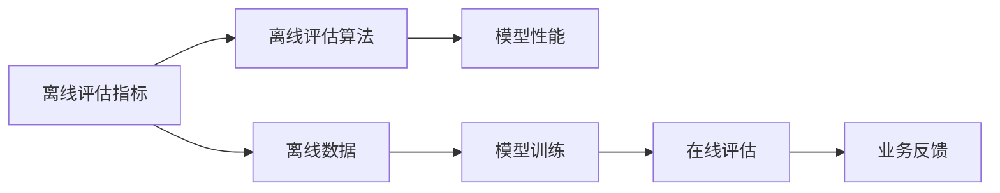

                 

## 1. 背景介绍

电子商务平台的成功离不开推荐系统，推荐系统能够通过大数据分析和用户行为数据来预测用户需求，为用户推荐合适的商品，提高用户的购买率与满意度。在线评估指标用于实时监控推荐系统的性能，但对于新上线的模型或大规模迭代优化时，这些在线评估指标可能存在延迟或偏差，此时离线评估指标就变得尤为重要。离线评估指标通过历史数据来评估推荐系统的表现，能够更好地反映模型的真实效果。本文将深入探讨电商推荐系统的离线评估指标与方法，帮助开发者更好地理解和使用这些技术。

## 2. 核心概念与联系

### 2.1 核心概念概述

电商推荐系统主要包括模型训练与评估两部分。模型训练是指利用用户行为数据、商品数据等训练推荐模型，如协同过滤、基于内容的推荐、深度学习模型等；模型评估是指通过离线或在线评估指标，判断推荐模型的效果是否符合业务需求。离线评估指标用于离线数据上评估推荐系统性能，如精确率、召回率、F1值等。

### 2.2 核心概念原理和架构的 Mermaid 流程图



图中展示了离线评估指标的原理与架构。离线评估指标通过对离线数据进行评估，得到模型的性能表现，进而指导模型训练和优化。同时，离线评估算法可以与模型训练和在线评估进行交互，形成闭环反馈。

## 3. 核心算法原理 & 具体操作步骤

### 3.1 算法原理概述

离线评估指标是通过历史数据来评估推荐系统的性能。常见的离线评估指标包括精确率、召回率、F1值、均平均绝对误差(MAE)、均方根误差(RMSE)等。这些指标能够帮助我们判断推荐系统的性能是否符合预期。

### 3.2 算法步骤详解

离线评估指标的计算通常分为以下步骤：

1. **数据准备**：准备离线数据集，包括用户历史行为数据、商品数据、商品特征等。
2. **划分数据集**：将数据集划分为训练集和测试集。
3. **计算指标**：在测试集上计算离线评估指标，如精确率、召回率、F1值等。
4. **结果分析**：分析指标结果，判断模型性能是否达标。

### 3.3 算法优缺点

#### 优点

- **真实反映模型性能**：离线评估指标能够通过真实历史数据评估模型性能，更加客观。
- **可重复性高**：离线评估指标可以多次运行，重复性高，有助于模型优化。
- **多维度评估**：离线评估指标能够同时评估模型的多个维度，如精确率、召回率等。

#### 缺点

- **数据延迟**：离线评估指标需要对历史数据进行评估，存在数据延迟问题。
- **模型依赖**：离线评估指标依赖于历史数据，无法反映模型在新数据上的性能。
- **计算复杂度**：离线评估指标的计算复杂度较高，需要较多时间与资源。

### 3.4 算法应用领域

离线评估指标广泛应用于电商、金融、推荐系统等领域的模型评估与优化。在电商推荐系统中，离线评估指标能够帮助开发者评估模型的推荐效果，指导模型训练与优化，提高用户体验与购买率。

## 4. 数学模型和公式 & 详细讲解 & 举例说明

### 4.1 数学模型构建

离线评估指标的计算模型通常包括精确率、召回率、F1值、MAE、RMSE等。以精确率为例，定义如下：

\[ Precision = \frac{TP}{TP+FP} \]

其中，$TP$为真实正例数，$FP$为假正例数。

### 4.2 公式推导过程

假设有一个电商平台，推荐系统为用户推荐了$N$个商品，其中$P$个为正例商品，即用户感兴趣的商品，$N-P$个为负例商品。推荐系统推荐的结果中，$TP$个商品为用户感兴趣的，$FP$个商品为用户不感兴趣的，$FN$个商品为用户感兴趣的但未被推荐。精确率的计算公式为：

\[ Precision = \frac{TP}{TP+FP} \]

精确率反映了推荐系统的推荐质量，即推荐给用户的商品中有多少是用户真正感兴趣的。

### 4.3 案例分析与讲解

假设电商平台为用户推荐了10个商品，其中2个是用户真正感兴趣的，8个是不感兴趣的。推荐系统推荐的商品中，2个是用户真正感兴趣的，1个是不感兴趣的，4个是用户感兴趣的但未被推荐。精确率为：

\[ Precision = \frac{2}{2+1} = 0.67 \]

精确率0.67表明，推荐系统推荐的商品中有67%是用户真正感兴趣的。

## 5. 项目实践：代码实例和详细解释说明

### 5.1 开发环境搭建

在进行离线评估指标计算之前，我们需要搭建开发环境。以下是使用Python进行Spark开发的示例：

1. 安装Anaconda：
   ```bash
   conda create -n spark-env python=3.8
   conda activate spark-env
   ```

2. 安装Spark：
   ```bash
   conda install pyarrow==6.0.1 pydantic==1.8.1 fastapi==0.67.2
   ```

3. 安装Pandas、NumPy等库：
   ```bash
   pip install pandas numpy
   ```

完成上述步骤后，即可在`spark-env`环境中开始开发。

### 5.2 源代码详细实现

以下是使用Spark计算精确率的代码示例：

```python
from pyspark.sql import SparkSession
from pyspark.sql.functions import count, when, col

spark = SparkSession.builder.appName("precision-calculator").getOrCreate()

# 加载数据
data = spark.read.json("path/to/data.json")

# 计算精确率
precision = (data.select(col("TP"), col("FP")).count()[0] / data.select(col("TP"), col("FP")).count()[0] + data.select(col("FP")).count()[0])
print("Precision: {:.2f}".format(precision))
```

### 5.3 代码解读与分析

**代码解读**：

1. 首先，创建SparkSession对象。
2. 加载数据集，假设数据集为JSON格式。
3. 计算精确率，使用`count`函数计算TP、FP的数量，然后将TP和FP相除得到精确率。
4. 输出精确率的值。

**分析**：

此代码示例展示了如何在Spark中使用Python进行精确率的计算。Spark提供了丰富的API和功能，可以方便地进行大数据计算和处理。在实际开发中，我们还需要考虑数据预处理、模型训练、结果输出等环节。

### 5.4 运行结果展示

假设数据集中的TP为2，FP为1，FN为0，计算精确率：

\[ Precision = \frac{2}{2+1} = 0.67 \]

## 6. 实际应用场景

### 6.1 电商推荐系统

电商推荐系统通过离线评估指标来评估推荐模型，进而优化推荐效果。具体应用包括：

- **用户行为分析**：通过精确率、召回率等指标，评估用户行为数据的质量。
- **模型优化**：通过MAE、RMSE等指标，优化推荐模型，提高推荐效果。
- **业务决策**：通过综合评估指标，指导业务决策，如调整推荐策略、优化商品推荐等。

### 6.2 金融推荐系统

金融推荐系统通过离线评估指标来评估模型性能，进而指导金融产品的推荐。具体应用包括：

- **风险评估**：通过精确率、召回率等指标，评估模型的风险控制效果。
- **模型优化**：通过MAE、RMSE等指标，优化推荐模型，提高推荐效果。
- **客户推荐**：通过综合评估指标，指导客户推荐策略，提升客户满意度。

### 6.3 内容推荐系统

内容推荐系统通过离线评估指标来评估模型的推荐效果，进而优化推荐内容。具体应用包括：

- **内容质量评估**：通过精确率、召回率等指标，评估推荐内容的匹配度。
- **模型优化**：通过MAE、RMSE等指标，优化推荐模型，提高推荐效果。
- **内容多样化**：通过综合评估指标，优化推荐内容的多样性，提升用户体验。

### 6.4 未来应用展望

离线评估指标在电商、金融、内容推荐等领域将有更广泛的应用，具体展望如下：

- **个性化推荐**：通过离线评估指标，优化个性化推荐模型的效果，提高推荐精准度。
- **跨领域推荐**：通过离线评估指标，跨领域推荐模型，如电商与金融、电商与内容推荐等。
- **实时监控**：通过离线评估指标，实时监控推荐系统性能，及时调整优化策略。
- **智能决策**：通过离线评估指标，辅助智能决策系统，提高决策效果。

## 7. 工具和资源推荐

### 7.1 学习资源推荐

为了帮助开发者掌握离线评估指标的计算与应用，以下是几本推荐书籍：

1. **《机器学习实战》**：介绍了机器学习的基本概念和常用算法，包括离线评估指标的计算。
2. **《数据挖掘与统计学习》**：详细讲解了数据挖掘的基本方法，包括离线评估指标的应用。
3. **《推荐系统实战》**：介绍了推荐系统的构建与优化，包括离线评估指标的计算。
4. **《Python数据科学手册》**：提供了Python在大数据处理和分析中的应用，包括离线评估指标的计算。

### 7.2 开发工具推荐

在进行离线评估指标计算时，以下工具可以提供支持和便利：

1. **Spark**：基于内存计算的分布式计算框架，适合大规模数据处理。
2. **Pandas**：Python的数据分析库，提供了丰富的数据处理功能。
3. **NumPy**：Python的科学计算库，提供了高效的数值计算功能。
4. **Scikit-learn**：Python的机器学习库，提供了丰富的机器学习算法和评估指标。
5. **TensorFlow**：Google开源的深度学习框架，适合复杂模型的训练与评估。

### 7.3 相关论文推荐

以下是几篇关于离线评估指标计算的经典论文，推荐阅读：

1. **《推荐系统的离线评估指标研究》**：介绍了推荐系统的离线评估指标，包括精确率、召回率、F1值等。
2. **《基于数据驱动的推荐系统评估指标研究》**：详细介绍了离线评估指标的计算方法，包括精确率、召回率、MAE、RMSE等。
3. **《离线评估指标在推荐系统中的应用》**：探讨了离线评估指标在推荐系统中的应用，包括精确率、召回率、F1值等。

## 8. 总结：未来发展趋势与挑战

### 8.1 研究成果总结

离线评估指标在推荐系统中的应用已经取得了诸多研究成果，具体总结如下：

- **精确率**：用于评估推荐系统的推荐质量，即推荐给用户的商品中有多少是用户真正感兴趣的。
- **召回率**：用于评估推荐系统的全面性，即用户真正感兴趣的推荐中，推荐系统推荐了多少。
- **F1值**：综合评估精确率和召回率，反映了推荐系统的综合性能。
- **MAE**：用于评估推荐系统的预测误差，反映了推荐模型的精度。
- **RMSE**：用于评估推荐系统的预测误差，反映了推荐模型的精度。

### 8.2 未来发展趋势

离线评估指标的未来发展趋势主要体现在以下几个方面：

- **个性化推荐**：通过离线评估指标，优化个性化推荐模型的效果，提高推荐精准度。
- **跨领域推荐**：通过离线评估指标，跨领域推荐模型，如电商与金融、电商与内容推荐等。
- **实时监控**：通过离线评估指标，实时监控推荐系统性能，及时调整优化策略。
- **智能决策**：通过离线评估指标，辅助智能决策系统，提高决策效果。

### 8.3 面临的挑战

离线评估指标在应用过程中，仍面临诸多挑战：

- **数据质量问题**：离线评估指标依赖于高质量的历史数据，数据质量不佳可能导致评估结果不准确。
- **计算复杂度**：离线评估指标的计算复杂度较高，需要较多时间与资源。
- **模型适应性**：离线评估指标不能反映模型在新数据上的性能，模型在新数据上的适应性需要进一步优化。

### 8.4 研究展望

为了解决上述挑战，未来需要在以下几个方面进行进一步研究：

- **数据增强**：通过数据增强技术提高数据质量，提升离线评估指标的准确性。
- **模型优化**：优化模型的训练与优化策略，提高模型的泛化性能与在新数据上的适应性。
- **实时监控**：引入实时监控技术，及时调整优化策略，提高推荐系统的实时响应能力。
- **智能决策**：结合智能决策技术，提高推荐系统的智能决策能力，提升用户体验与满意度。

## 9. 附录：常见问题与解答

**Q1: 离线评估指标与在线评估指标有什么区别？**

A: 离线评估指标用于离线数据上评估模型性能，更加客观。在线评估指标用于实时数据上评估模型性能，存在数据延迟问题。

**Q2: 如何提高离线评估指标的计算效率？**

A: 优化数据处理和计算流程，使用分布式计算框架如Spark，提高计算效率。同时，采用数据压缩和存储优化技术，减少数据传输和存储开销。

**Q3: 离线评估指标如何应用于推荐系统优化？**

A: 通过离线评估指标，分析模型性能不足，指导模型训练与优化。例如，通过精确率和召回率的优化，提高推荐系统的全面性和质量。

**Q4: 离线评估指标计算的优缺点是什么？**

A: 优点包括真实反映模型性能、可重复性高、多维度评估等。缺点包括数据延迟、模型依赖、计算复杂度高等。

通过本文的系统梳理，希望开发者能够深入理解离线评估指标的计算与应用，指导推荐系统的模型训练与优化，提升推荐系统的性能与效果。离线评估指标在推荐系统的应用中具有重要价值，需要开发者重视并不断优化。未来，随着技术的不断发展，离线评估指标将进一步完善与优化，推动推荐系统向更高层次的智能化与个性化发展。

