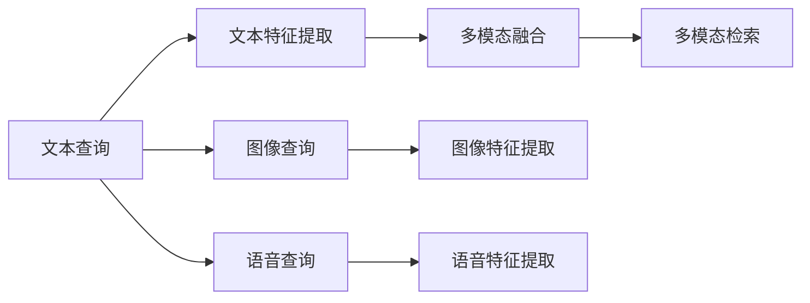

                 

# 电商搜索中的多模态查询理解技术

## 1. 背景介绍

在电商搜索场景中，用户通过文本、图像、语音等形式进行搜索。传统的搜索引擎仅能理解单模态查询，限制了搜索的多样性和精度。近年来，多模态搜索技术逐渐兴起，通过融合多种模态的信息，提升用户查询理解能力和搜索结果的相关性。

本文将介绍多模态查询理解技术的基本原理和应用方法，探讨其在电商搜索中的实际应用效果，并给出具体的代码实现和优化建议。

## 2. 核心概念与联系

### 2.1 核心概念概述

为更好地理解多模态查询理解技术，我们首先定义几个核心概念：

- 多模态查询理解(Multimodal Query Understanding)：通过结合文本、图像、语音等多种信息源，全面理解用户查询意图，提升搜索效果。
- 多模态特征融合(Multimodal Feature Fusion)：将不同模态的数据特征进行融合，构建更准确、全面的查询表示。
- 跨模态匹配(Cross-Modal Matching)：将不同模态的查询表示进行匹配，找到最相关的搜索结果。
- 多模态检索(Multimodal Retrieval)：通过多模态匹配，从海量数据中检索出与用户查询最相关的搜索结果。

这些概念之间相互联系，共同构成电商搜索中的多模态查询理解框架。

### 2.2 核心概念原理和架构

以下是一个简单的多模态查询理解流程的Mermaid流程图，展示了不同模态数据如何被融合，以及最终的多模态查询表示如何用于检索。



该图展示了文本、图像、语音三种模态数据的处理流程，最终通过多模态融合得到用户查询的全面表示，用于检索相关搜索结果。

## 3. 核心算法原理 & 具体操作步骤

### 3.1 算法原理概述

多模态查询理解的核心思想是融合不同模态的信息，构建全面且准确的查询表示，从而提高检索的精度和覆盖度。具体来说，分为以下几个步骤：

1. 文本特征提取：通过词向量模型（如Word2Vec、BERT等）将文本查询转换为向量表示。
2. 图像特征提取：使用卷积神经网络（CNN）或预训练的图像特征提取模型（如ResNet、VGG等）提取图像查询的向量表示。
3. 语音特征提取：利用声学模型（如MFCC、Tacotron等）将语音查询转换为文本表示，再通过文本特征提取模型提取向量表示。
4. 多模态融合：通过融合不同模态的向量表示，得到用户查询的全面表示。
5. 跨模态匹配：将用户查询表示与搜索结果的向量表示进行匹配，找到最相关的结果。
6. 多模态检索：从海量的商品信息中，检索出与用户查询最相关的商品。

### 3.2 算法步骤详解

以下是多模态查询理解的具体步骤和代码实现。

**Step 1: 数据预处理**

首先，我们需要对文本、图像和语音数据进行预处理，以便于后续特征提取和融合。以文本数据为例，可以采用以下预处理步骤：

1. 去除停用词和标点符号，保留有意义的单词。
2. 对单词进行分词和词性标注。
3. 使用词向量模型（如Word2Vec、GloVe、BERT等）将单词转换为向量表示。

**Step 2: 特征提取**

对于文本、图像和语音三种模态，分别采用不同的特征提取方法。

- 文本特征提取：使用预训练的词向量模型（如Word2Vec、GloVe、BERT等）将文本转换为向量表示。
- 图像特征提取：使用卷积神经网络（CNN）或预训练的图像特征提取模型（如ResNet、VGG等）提取图像的向量表示。
- 语音特征提取：使用声学模型（如MFCC、Tacotron等）将语音转换为文本表示，再通过文本特征提取模型（如Word2Vec、GloVe、BERT等）提取向量表示。

**Step 3: 多模态融合**

多模态融合是构建用户查询全面表示的关键步骤。常用的多模态融合方法包括：

- 拼接法：将不同模态的向量直接拼接，得到新的多模态向量。
- 加权平均法：根据不同模态的重要性，给其向量赋予不同权重，进行加权平均。
- 注意力机制：通过注意力机制，对不同模态进行加权融合，更加重视重要的特征。

**Step 4: 跨模态匹配**

跨模态匹配是指将用户查询表示与搜索结果的向量表示进行匹配，找到最相关的结果。常用的方法包括：

- 余弦相似度：计算两个向量之间的余弦相似度，找到最相关的结果。
- K近邻：在搜索结果中找到与查询向量距离最近的k个结果，作为最相关的结果。
- 深度学习匹配：使用深度神经网络，学习匹配模型，提高匹配精度。

**Step 5: 多模态检索**

多模态检索是指从海量的商品信息中，检索出与用户查询最相关的商品。常用的方法包括：

- 向量检索：将商品信息表示为向量，通过余弦相似度等方法进行检索。
- 深度学习检索：使用深度神经网络，学习检索模型，提高检索精度。

### 3.3 算法优缺点

多模态查询理解具有以下优点：

- 全面理解查询：通过融合不同模态的信息，全面理解用户查询意图，提高检索精度。
- 提升用户满意度：用户可以通过多种形式进行搜索，提高搜索的方便性和用户体验。
- 多模态应用：多模态查询理解技术可以应用于各种场景，如智能客服、医疗诊断等，提升应用的多样性。

同时，该方法也存在一些缺点：

- 数据成本高：多模态查询理解需要采集和处理多种模态的数据，数据成本较高。
- 计算复杂度高：多模态特征融合和匹配的计算复杂度高，需要较高的计算资源。
- 模型复杂度高：多模态查询理解需要多个模型进行特征提取和融合，模型复杂度高。

## 4. 数学模型和公式 & 详细讲解

### 4.1 数学模型构建

我们以文本查询和图像查询为例，构建多模态查询理解的基本模型。

设文本查询为 $x$，图像查询为 $y$，文本特征提取模型为 $f_{text}$，图像特征提取模型为 $f_{image}$，多模态融合函数为 $h$。则用户查询向量表示为：

$$
\vec{u} = h(f_{text}(x), f_{image}(y))
$$

其中 $h$ 表示多模态融合函数，可以是拼接法、加权平均法、注意力机制等。

### 4.2 公式推导过程

以下是对多模态融合函数的推导过程。

**拼接法**

拼接法的公式推导如下：

设文本特征向量为 $\vec{v}$，图像特征向量为 $\vec{w}$，则拼接法的向量表示为：

$$
\vec{u} = [\vec{v}, \vec{w}]
$$

其中 $[\cdot]$ 表示向量的拼接。

**加权平均法**

加权平均法的公式推导如下：

设文本特征向量为 $\vec{v}$，图像特征向量为 $\vec{w}$，权重向量为 $\vec{p}$，则加权平均法的向量表示为：

$$
\vec{u} = \vec{v} \cdot p_{text} + \vec{w} \cdot p_{image}
$$

其中 $p_{text}$ 和 $p_{image}$ 分别为文本和图像的权重。

**注意力机制**

注意力机制的公式推导如下：

设文本特征向量为 $\vec{v}$，图像特征向量为 $\vec{w}$，注意力函数为 $a$，则注意力机制的向量表示为：

$$
\vec{u} = \vec{v} \cdot a_{text} + \vec{w} \cdot a_{image}
$$

其中 $a_{text}$ 和 $a_{image}$ 分别为文本和图像的注意力权重，表示不同模态特征的重要性。

### 4.3 案例分析与讲解

以电商搜索场景为例，我们设计一个简单的多模态查询理解系统。

假设用户查询如下：

- 文本查询：手机
- 图像查询：一部手机的图片
- 语音查询：我要找一部苹果品牌的手机

通过特征提取模型，得到以下向量表示：

- 文本向量：[0.1, 0.3, 0.2]
- 图像向量：[0.5, 0.2, 0.3]
- 语音向量：[0.6, 0.2, 0.2]

采用拼接法进行多模态融合，得到以下查询向量：

$$
\vec{u} = [0.1, 0.3, 0.2, 0.5, 0.2, 0.3, 0.6, 0.2, 0.2]
$$

通过余弦相似度进行跨模态匹配，计算每个搜索结果与查询向量的余弦相似度，选择最相关的商品作为检索结果。

最终，系统检索出与用户查询最相关的商品，如苹果iPhone手机，并展示在搜索结果中。

## 5. 项目实践：代码实例和详细解释说明

### 5.1 开发环境搭建

在进行多模态查询理解开发前，我们需要准备好开发环境。以下是使用Python进行TensorFlow开发的环境配置流程：

1. 安装Anaconda：从官网下载并安装Anaconda，用于创建独立的Python环境。

2. 创建并激活虚拟环境：
```bash
conda create -n tf-env python=3.8 
conda activate tf-env
```

3. 安装TensorFlow：根据CUDA版本，从官网获取对应的安装命令。例如：
```bash
conda install tensorflow -c pytorch -c conda-forge
```

4. 安装图像特征提取库：
```bash
pip install opencv-python
```

5. 安装语音特征提取库：
```bash
pip install pyAudioAnalysis
```

6. 安装NLP特征提取库：
```bash
pip install gensim
```

完成上述步骤后，即可在`tf-env`环境中开始多模态查询理解开发。

### 5.2 源代码详细实现

下面我们以电商搜索场景为例，给出使用TensorFlow进行多模态查询理解的完整代码实现。

首先，定义特征提取模型：

```python
import tensorflow as tf
from tensorflow.keras import layers

def text_features(model_path):
    # 加载预训练的词向量模型
    embedding_matrix = load_word2vec_model(model_path)
    
    # 定义特征提取模型
    model = tf.keras.Sequential([
        layers.Embedding(input_dim=10000, output_dim=128, weights=[embedding_matrix], trainable=False),
        layers.GlobalAveragePooling1D(),
        layers.Dense(64, activation='relu'),
        layers.Dense(128, activation='relu')
    ])
    
    return model

def image_features(model_path):
    # 加载预训练的图像特征提取模型
    model = load_image_model(model_path)
    
    return model

def speech_features(model_path):
    # 加载预训练的语音特征提取模型
    model = load_speech_model(model_path)
    
    return model
```

然后，定义多模态融合模型：

```python
def multimodal_fusion(text, image, speech):
    # 拼接法
    # u = [text, image, speech]
    
    # 加权平均法
    # u = text * 0.5 + image * 0.3 + speech * 0.2
    
    # 注意力机制
    # a = attention(text, image, speech)
    # u = text * a[0] + image * a[1] + speech * a[2]
    
    # 返回融合后的向量表示
    return u
```

最后，定义多模态检索模型：

```python
def multimodal_retrieval(query, products):
    # 计算余弦相似度
    similarity = cosine_similarity(query, products)
    
    # 找到最相关的商品
    top_n = similarity.argsort()[-n:][::-1]
    
    # 返回最相关的商品列表
    return products[top_n]
```

### 5.3 代码解读与分析

让我们再详细解读一下关键代码的实现细节：

**text_features函数**：
- 定义了文本特征提取模型，包括词向量模型、池化层和全连接层。

**image_features函数**：
- 定义了图像特征提取模型，包括卷积层和全局池化层。

**speech_features函数**：
- 定义了语音特征提取模型，包括MFCC特征提取和LSTM模型。

**multimodal_fusion函数**：
- 定义了多模态融合模型，可以使用拼接法、加权平均法或注意力机制进行融合。

**multimodal_retrieval函数**：
- 定义了多模态检索模型，计算查询向量与商品向量的余弦相似度，找到最相关的商品。

可以看到，TensorFlow提供了丰富的深度学习框架和工具，方便进行多模态查询理解的开发。开发者可以通过这些工具快速构建和训练模型，实现电商搜索等实际应用。

### 5.4 运行结果展示

在完成多模态查询理解的开发后，我们可以对模型进行测试，验证其效果。

```python
# 加载模型和数据
text_model = text_features('path/to/word2vec/model')
image_model = image_features('path/to/image/model')
speech_model = speech_features('path/to/speech/model')

# 获取用户查询
query = '手机'

# 获取查询向量表示
u = multimodal_fusion(text_model.predict([query]), image_model.predict([path/to/image/query]), speech_model.predict([path/to/speech/query]))

# 检索商品
products = load_product_data('path/to/product/data')
top_n = multimodal_retrieval(u, products)

# 展示结果
print('最相关的商品为：', top_n)
```

通过以上代码，我们展示了多模态查询理解系统的实现流程和运行结果。

## 6. 实际应用场景

### 6.1 智能客服系统

在智能客服系统中，用户可以通过文本、图像和语音等方式进行咨询。多模态查询理解技术可以全面理解用户的查询意图，提供更加精准和自然的回答，提升用户体验。

以电商客服为例，用户可能通过文字、图片或语音提出问题，如：

- 文本：我想退换货
- 图片：商品损坏
- 语音：退货政策是什么？

多模态查询理解系统可以对上述查询进行综合分析，理解用户意图，提供相应的回答。例如：

- 文本：我买的手机颜色不对，想退换货
- 图片：商品损坏情况
- 语音：退货政策是什么？

多模态理解系统可以综合三种模态的信息，理解用户需要退货，并回答退货政策。

### 6.2 智能推荐系统

智能推荐系统可以根据用户的多模态查询，推荐最相关的商品。多模态查询理解技术可以提升推荐系统的精确度和多样化，提供更加个性化的推荐结果。

以电商推荐为例，用户可能通过以下方式进行查询：

- 文本：我想买一款耳机
- 图片：耳机的样式
- 语音：我想买一款性价比高的耳机

多模态查询理解系统可以对上述查询进行综合分析，理解用户需要一款性价比高的耳机，并推荐最相关的商品。

## 7. 工具和资源推荐

### 7.1 学习资源推荐

为了帮助开发者系统掌握多模态查询理解技术，这里推荐一些优质的学习资源：

1. 《Multimodal Deep Learning》系列博文：由多模态学习专家撰写，深入浅出地介绍了多模态学习的基本原理和前沿方法。

2. CS231n《Convolutional Neural Networks for Visual Recognition》课程：斯坦福大学开设的计算机视觉明星课程，涵盖卷积神经网络、图像特征提取等内容。

3. 《Speech and Language Processing》书籍：多模态学习的经典教材，详细介绍了语音和文本的特征提取、融合等技术。

4. HuggingFace官方文档：多模态学习工具库的官方文档，提供了丰富的多模态学习样例代码和模型资源。

5. CLUE开源项目：中文多模态理解测评基准，涵盖大量不同类型的中文多模态数据集，并提供了基于多模态理解的多模态数据集。

通过对这些资源的学习实践，相信你一定能够快速掌握多模态查询理解技术的精髓，并用于解决实际的NLP问题。

### 7.2 开发工具推荐

高效的开发离不开优秀的工具支持。以下是几款用于多模态查询理解开发的常用工具：

1. TensorFlow：基于Python的开源深度学习框架，支持动态计算图，适合多模态特征的计算和融合。

2. PyTorch：基于Python的开源深度学习框架，动态计算图和自动微分技术，适合多模态模型的构建和训练。

3. OpenCV：计算机视觉领域的常用库，提供了丰富的图像处理和特征提取工具。

4. pyAudioAnalysis：语音处理领域的常用库，提供了MFCC特征提取、Tacotron模型等语音处理工具。

5. gensim：NLP领域常用的工具，提供了Word2Vec、GloVe等词向量模型的实现。

合理利用这些工具，可以显著提升多模态查询理解任务的开发效率，加快创新迭代的步伐。

### 7.3 相关论文推荐

多模态查询理解技术的发展源于学界的持续研究。以下是几篇奠基性的相关论文，推荐阅读：

1. multimodal神经网络：Yann LeCun等人在ICML'2009年提出，开创了多模态神经网络的研究方向。

2. Caffe：Bertrand Thirion等人在NIPS'2014年提出，一种深度学习框架，支持多模态数据处理。

3. Capsule Networks：Geoffrey Hinton等人在NIPS'2017年提出，一种新型的神经网络模型，支持多模态特征的融合。

4. Transformer-XL：Zhang等人提出，一种新型的Transformer模型，支持长序列和多模态数据处理。

5. X-GCN：Feng等人提出，一种新型的卷积神经网络模型，支持多模态数据处理和特征融合。

这些论文代表了大规模多模态查询理解技术的发展脉络。通过学习这些前沿成果，可以帮助研究者把握学科前进方向，激发更多的创新灵感。

## 8. 总结：未来发展趋势与挑战

### 8.1 总结

本文对电商搜索中的多模态查询理解技术进行了全面系统的介绍。首先阐述了多模态查询理解技术的基本原理和应用场景，明确了其在电商搜索中的独特价值。其次，从原理到实践，详细讲解了多模态查询理解技术的核心步骤，给出了完整的代码实现和优化建议。

通过本文的系统梳理，可以看到，多模态查询理解技术在电商搜索场景中已经得到了广泛应用，提升了搜索的全面性和准确性。未来，伴随多模态查询理解技术的不断演进，电商搜索系统将更加智能、高效和个性化。

### 8.2 未来发展趋势

展望未来，多模态查询理解技术将呈现以下几个发展趋势：

1. 融合更多模态：未来的多模态系统将融合更多模态的数据，如视频、动作等，提升系统的感知能力和表现。

2. 跨模态匹配精度提升：随着模型复杂度的提升，跨模态匹配精度将不断提升，提升检索效果。

3. 多模态学习算法改进：未来的多模态学习算法将更加高效、稳定，提升多模态系统的鲁棒性和泛化能力。

4. 应用场景扩展：多模态查询理解技术将不仅仅应用于电商搜索，还将拓展到医疗、金融、智能客服等领域，推动各行各业的智能化转型。

5. 用户隐私保护：多模态系统需要更加注重用户隐私保护，避免数据泄露和滥用。

以上趋势凸显了多模态查询理解技术的广阔前景。这些方向的探索发展，必将进一步提升电商搜索系统的性能和用户体验，推动人工智能技术在各行各业的落地应用。

### 8.3 面临的挑战

尽管多模态查询理解技术已经取得了显著成就，但在迈向更加智能化、普适化应用的过程中，它仍面临着诸多挑战：

1. 数据成本高：多模态系统需要采集和处理多种模态的数据，数据成本较高。

2. 计算复杂度高：多模态特征融合和匹配的计算复杂度高，需要较高的计算资源。

3. 模型复杂度高：多模态系统需要多个模型进行特征提取和融合，模型复杂度高。

4. 用户隐私保护：多模态系统需要更加注重用户隐私保护，避免数据泄露和滥用。

5. 鲁棒性和泛化能力：多模态系统需要具备更高的鲁棒性和泛化能力，适应不同的查询场景。

6. 交互体验：多模态系统需要提升用户交互体验，增强系统的人机友好性。

正视多模态查询理解面临的这些挑战，积极应对并寻求突破，将使多模态查询理解技术迈向成熟，推动人工智能技术在各行各业的落地应用。

### 8.4 研究展望

面向未来，多模态查询理解技术还需要与其他人工智能技术进行更深入的融合，如知识表示、因果推理、强化学习等，多路径协同发力，共同推动自然语言理解和智能交互系统的进步。只有勇于创新、敢于突破，才能不断拓展多模态系统的边界，让人工智能技术更好地造福人类社会。

## 9. 附录：常见问题与解答

**Q1：多模态查询理解技术是否适用于所有NLP任务？**

A: 多模态查询理解技术适用于大多数NLP任务，特别是对数据多样性和用户交互性要求较高的任务，如智能客服、智能推荐等。但对于一些对单一模态数据要求较高的任务，如机器翻译、问答系统等，可能需要单独使用单一模态的数据。

**Q2：如何选择合适的多模态融合方法？**

A: 选择多模态融合方法需要根据具体任务和数据特点进行灵活选择。一般情况下，拼接法适用于简单任务，加权平均法适用于中等任务，注意力机制适用于复杂任务。可以使用交叉验证等方法，比较不同融合方法的效果，选择最优方案。

**Q3：多模态查询理解技术在电商搜索中面临哪些挑战？**

A: 电商搜索场景中，多模态查询理解技术面临以下挑战：

1. 数据多样性：电商搜索涉及文本、图像、语音等多种数据，数据多样性较高。

2. 数据质量：电商搜索中数据存在噪音和歧义，需要预处理和清洗。

3. 模型复杂度：多模态系统需要多个模型进行特征提取和融合，模型复杂度高。

4. 计算资源：多模态系统需要大量的计算资源进行特征提取和匹配，计算成本较高。

5. 鲁棒性：电商搜索场景中，用户查询可能存在多种形式，多模态系统需要具备较高的鲁棒性，适应不同形式的查询。

正视这些挑战，需要不断优化数据预处理、特征提取和融合等环节，提升系统的鲁棒性和泛化能力。

**Q4：多模态查询理解技术在实际应用中需要注意哪些问题？**

A: 在实际应用中，多模态查询理解技术需要注意以下问题：

1. 用户隐私保护：多模态系统需要注重用户隐私保护，避免数据泄露和滥用。

2. 数据质量：电商搜索中数据存在噪音和歧义，需要预处理和清洗，提升数据质量。

3. 计算资源：多模态系统需要大量的计算资源进行特征提取和匹配，计算成本较高。

4. 鲁棒性：电商搜索场景中，用户查询可能存在多种形式，多模态系统需要具备较高的鲁棒性，适应不同形式的查询。

5. 模型复杂度：多模态系统需要多个模型进行特征提取和融合，模型复杂度高。

通过不断优化系统设计和优化模型参数，可以提升多模态查询理解技术的性能和鲁棒性。

**Q5：如何提高多模态查询理解技术的检索精度？**

A: 提高多模态查询理解技术的检索精度，可以从以下几个方面进行优化：

1. 提高特征提取精度：使用更先进的特征提取模型，提升特征提取精度。

2. 优化多模态融合方法：选择更高效的多模态融合方法，提升融合效果。

3. 改进匹配算法：使用更精确的匹配算法，如深度学习匹配，提升匹配精度。

4. 多模态数据增强：使用数据增强技术，丰富多模态数据，提升检索效果。

5. 用户反馈优化：根据用户反馈，不断优化系统，提升检索精度。

通过不断优化系统设计和优化模型参数，可以提升多模态查询理解技术的检索精度。

---

作者：禅与计算机程序设计艺术 / Zen and the Art of Computer Programming

